# RHCE8红帽认证课程／自学必备／云计算／rhce／Linux运维 - P12：NFS服务配置及设置开机自动挂载mp4 - 学神科技 - BV1L54y1S7qZ

看一下nfs，不会在这儿啊，nf嗯，我得给他改一下，这个啥改一下这个，唉哟我，找一个正常点的，这个大点儿，nfs啊，然后配置ifs服务器并实现开机自动挂载是吧，nfs叫什么。

nfs的话叫network fil system啊，network for system是吧，通过这个名字你应该也能猜出来是啥意思吧，对不对，网络文件系统是吧，网络文件系统啊，呃它呢是什么。

free bs d支持的文件系统的一种啊，也被称为n s允许一个系统，这样它允许一个系统在网络上与其他人共享目录和文件，通过使用vs用户和程序，可以像访问本地文件一样访问远端系统上的文件是吧。

这就是n n n f s对不对，其实这种nt的这种存储都是好吧，都是啊，然后那个啥那个那个ftp其实也是啊，你登录之后就好像是吧，ftp的目录就在你的本地一样，你也可以去上传下载呀是吧，创建呀是吧。

这也是可以的，对不对，s也可以啊，像之前咱们还见过一些扫码什么的是吧，也可以嗯，可以的啊，都都都是可以挂载文件，挂载这个目录，然后可以去用啊，可以用啊，那么nfs的话它也是cs的一个模式好吧。

然后呢啊这个也是直接可以通过这种目录的形式去访问的好吧，它的端口是2049啊，2049啊，七版本的默认值是四版本啊啊默认是这个nfs v4 的版本好吧，这个号是049，但是呢它不单单是有一个符啊。

和和f p很像啊，它还有一个叫还有一个r pc的啊，在这个rpc的啊，r p c的话它还会管理你的端口，因为它传输的时候可能会用到很多数据端口啊。

所以说有一个专门的去管理这个端口的叫r p c rpc啊，然后服务叫rpc版的是吧，2049啊，由于文件系统非常复杂，因此nfs还有其他程序去启动额外的端口，fs默认使用传输端呃。

使用传输端口是随机选择的，小于24端口啊，捐端口告知客户端是需要依赖于rpc的啊，rpc的rpc技术管理端口的是吧，当ms启动启动时候，会随机选取数个端口，并且rpc注册。

因此rpc就可以知道每个端口对应的ms功能啊，然后r p c最主要的功能就是指定一个n m s功能所对应端口，并告知客户端一边扣端连接对吧，就是干这个的啊。

呃这个的话nfs呢也可以通过那个呃etc service，以那个文件去看是吧，它的阶段位是多少啊，2049好吧，2049啊，这个我就不去看了是吧，到时候你们可以看一下。

可以搜一下so nfs就可以了对吧，那就可以了，那么装n fs的话呢，咱们最少的话需要装这么两个包，一个就是rp c，一个是n s包的名字呢叫这个包的名字可能不太好记，也就比较长啊，嗯我把它拿过来啊。

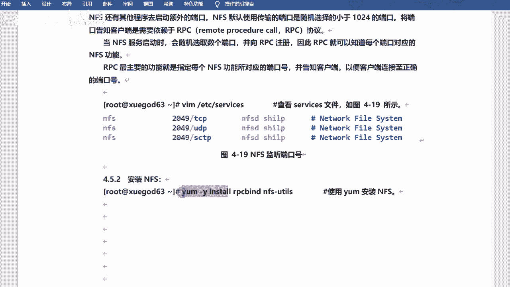

啊一个叫r p c b，一个叫nfs youtus是吧，呃当然这两个默认是装好的是吧，装好的一般像这种呃，就是平常的安装是吧，还有这种什么图形化的话，它一般都是装好的好吧，都是装好的啊。

但是你没装好的话，肯定需要装嘛是吧，没装好，那我肯定需要装的啊，ok这样的话就装好了，对不对，装好之后呢，它有这个配置文件啊，在tc下的叫exports，它里面默认是空的啊，pose好吧。

你可以把要共享的这个目录写进去是吧，写进去啊。

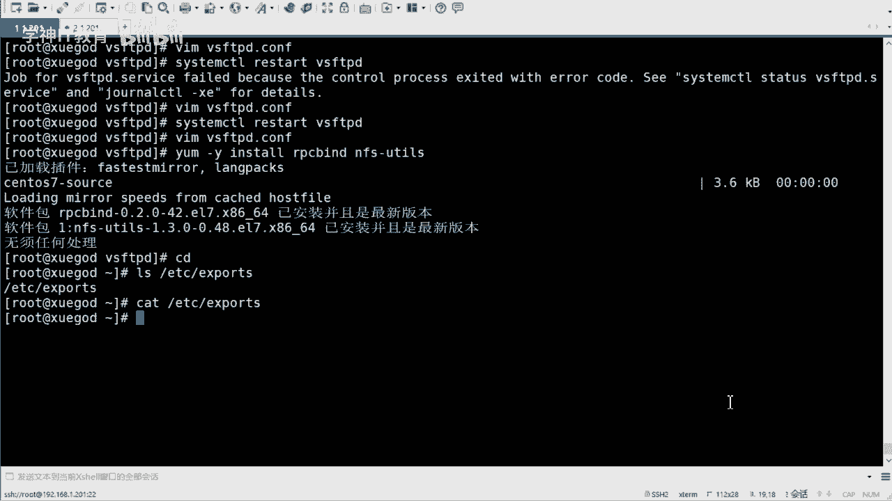

嗯配置文件在这，嗯是吧，e d c expose啊，然后嗯启动它，启动它之后呢，咱们可以启动两个啊，一个是r p c版的，一个是n f s server，两个服务都要起啊，两个服务都要起呃，行动之后呢。

它的尖端口是2049对吧，2049啊，然后需要注意的是，在启动fs之前要先启动r r p c行吧，先启动rpc啊，否则vs就无法向rpc进行注册，另外rog pc重新启动啊，这个应该是重新吧是吧。

这个重新是吧，重新好像都成了方言了是吧啊等等等等等诶，我在哪，现在啊这是启动nfs，重新启动，重新启动嗯，那原来注册的数据会消失，所以在重启p c之后啊，他所管理的服务器都要重新重启。

以重新向rpc注册对吧，所以说这两个相对它是有关联的好吧，它是有关联的啊，ok啊，那咱们来启动一下。

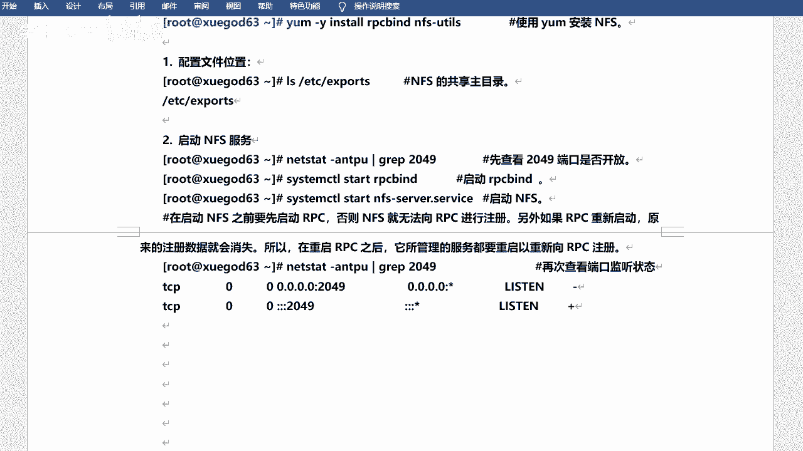

这怎么去掉start，rpc版，哟嚯这是已经启动了吗，pc端啊，因为我这边不出来啊，哇塞卡了吗，刚才好起来了啊，然后我再去取那个n f s server，是吧，来洗一下啊，洗完之后咱们看一下啊。

n t6 grab一下，2049是吧，已经在监听啊，也在监听啊，然后enable一下开机启动好吧。

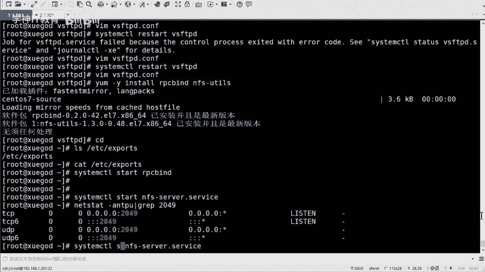

是吧，开机启动啊，这样就可以了啊，ok嗯然后的话然后的话咱们可以怎样呢，可以去呃呃连接一下你的服务啊。

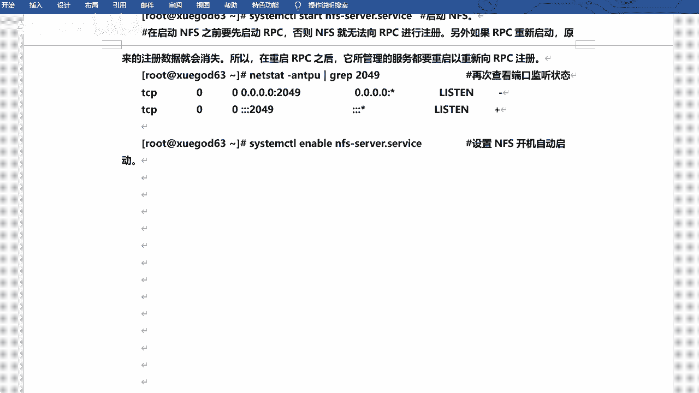

连接一下你的服务啊，就是应该是客户端连接啊，我看我这边可以可以显示吗，so smart刚一显示啊，然后是192。198。1。201好吧，他会去exports啊，给你导出列表啊。

你的这台服务器共享的nfs的目录是吧，它会给你显示，但是目前我没有共享，所以它是它是空的对吧，它是空的啊啊然后比方说你去骂他挂载什么的。

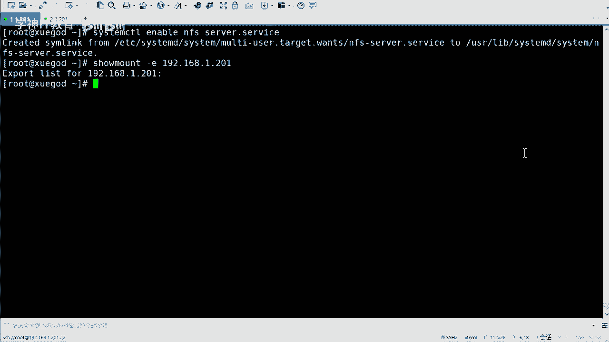

他可能是不能去挂载的，因为还没有分享是吧，咱们需要去给他分享一下，比如说我把我的某个目录分享出去是吧，让别人可以用我的这个分享的目录是吧，才可以的啊，那么这样的话呢就需要修改配置文件啊，你想共享谁是吧。

然后可以给他这个这个这个写一下啊。

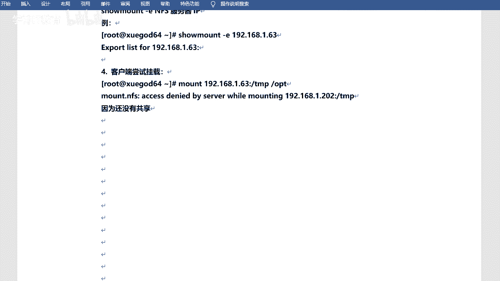

在这儿写一下啊，ec下载expose是吧，pose啊这些呃，比如说我要共享media这个目录啊，我说pd啥的都可以共享啊，然后心啊，然后2w啊，这个写法是很简单的啊，是吧，这么写就可以啊，什么意思啊。

media的话就是当前你的系统的某个目录，你想去共享啊，新人的话呢其实是这个网段啊，网段就是你想共享给谁，或者说谁可以去挂载你的这个共享是吧，新的话就是任何的网段，2w是访问权限是吧，就是读写权限啊。

读写权限啊啊然后咱们再去收梦幻，刚一看一眼啊，1。201嗯，那我应该啊应该先这样啊，一个export export gr v有了吗啊已经有了啊，media啊，哇塞他可能不能自己看自己是吧。

那我还是开开个机吧是吧，开个新机器，我看一眼啊，试一下啊，so so much搞一是吧，嗯1+二点一个吧，点1。201啊，你看这个才能看出来对吧，它能看出来啊，media星，然后我自己看不出来是吧。

自己是看不出来的啊，那那那还得开两台啊，我本来想今天能开一台就解决还是不行。

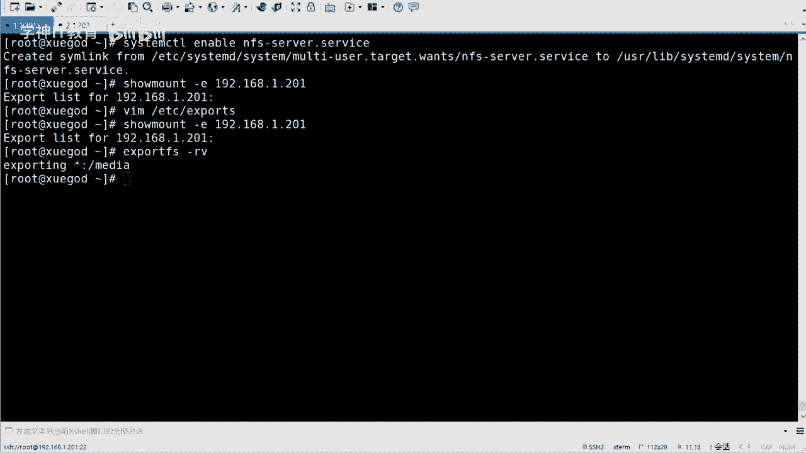

还是开两台吧，嗯没有录象，直接去写就行啊，然后呢你可以先自己去看叫expfs gr v啊，这个也可以就是可以看到自己的那个啥啊，这个是看自己的好吧，自己的那个那个那个共享的目录啊。

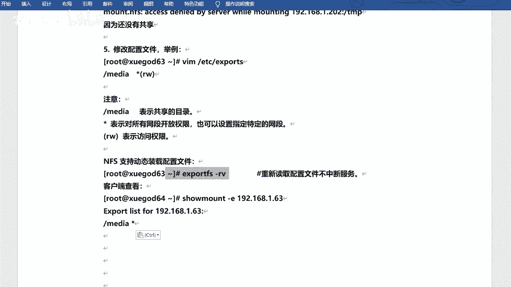

杠2v是吧，你可能看到，然后这个收纳的刚毅呢是看你的服务端的啊，这个是刚毅是看你的服务端的啊，ok行那那咱们来试一下哈，然后我来挂载一下行吧，我来挂载一下啊，啊mark挂载mot挂载啊。

gt是指定那个那个文件类型啊，n fs类型啊，应该叫应该叫文件系统类型啊，n f s挂谁呢，192。168。1。201下着啊，这么写冒号啊，跟然后mea挂到哎呀，挂哪去啊，我抽烟啊，哇塞我这个算了。

我就挂这吧，我现在也用不到什么东西啊，然后我就挂到这个op t下好吧，挂到p一下啊，换过来啊，挂完之后咱们看一下啊，df杠大t是吧，然后在这里能看到啊。

然后你的201的这台机器的media挂到了我的o p地下是吧，n f4 的类型啊，四的话就是版本啊，呃十个g用了39，还剩6。2是吧，很大对不对，其实他这个卦的话呢。

是相当于把这边你剩余的这个根根区都给你刮过来了啊，你看我这命局用了3。9，还剩62，一共十个g，对不对。

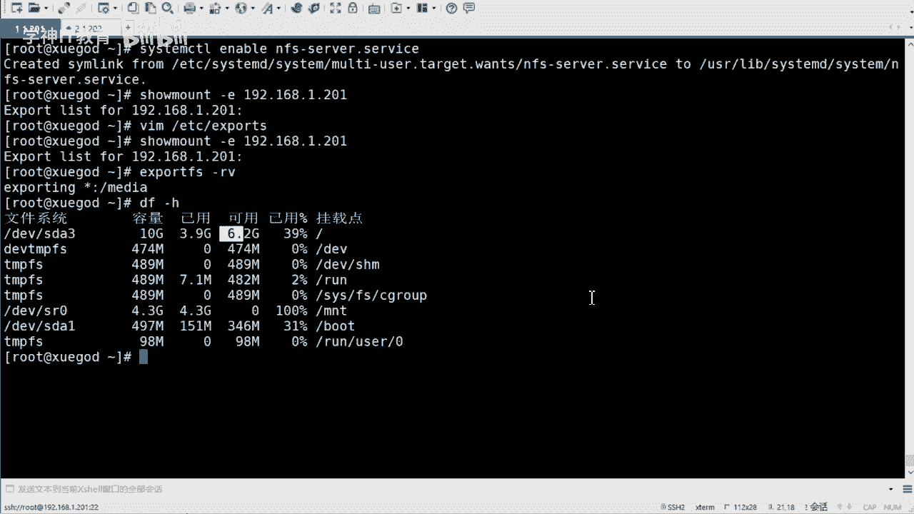

他就是这样显示的行吧，那就这样显示的啊，嗯那么你共享了，然后直接挂就可以好吧，直接挂就可以啊，好的，行那这个是手动挂是吧。

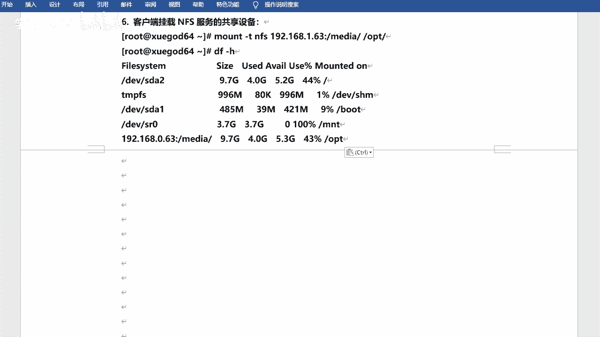

然后呢咱们来设置一个开机自动挂载，黑字挂载的话呢，其实在这a t c f s b啊，也是写在这对吧，然后我写一下啊，然后地址是一个2。1的8。1。1。1。201下的是吧。

mea挂的话挂到o p t下格式系啊，嗯文件类型是fs啊，f00 是吧，就这样写就可以了好吧，这样写就可以了，ok然后咱们可以重新验证一下，好吧，重新验证一下啊，如果写的错的话，他可能都开不了机是吧。

咱们稍等他一下啊，啊然后咱们再来看一下啊，挂好了吗，啊在这呢啊没有在最后啊，在这呢对吧，这就挂好了啊，就是重启验证一下。

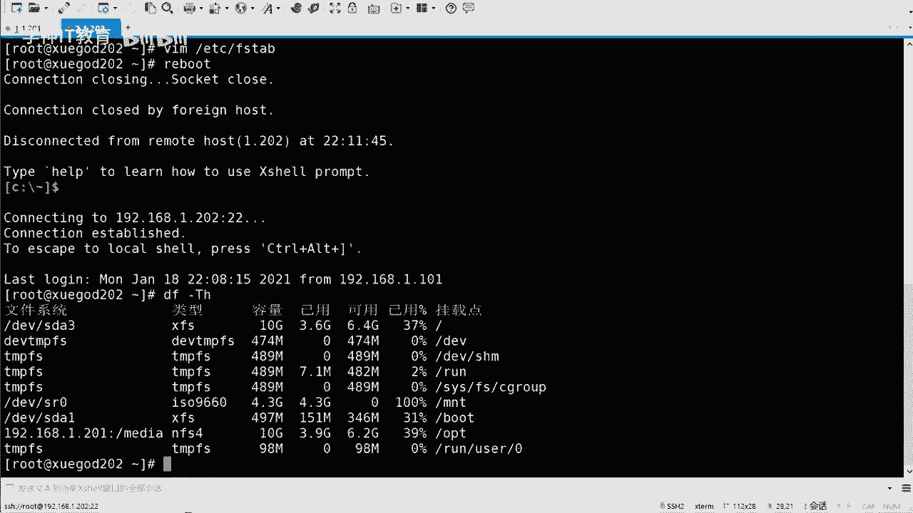

可以是吧，啊当然你不想重启也可以啊，但是他肯定是可以去可以去这个啥的啊，可以去这个这个嗯挂挂在上面是吧，因为你只要写的没问题是吧，然后肯定是可以的，除非如果说你写的错的话是吧，他可能起不来。

起不来的话就会进入一个emergency mode是吧，一个模式啊，可能就是那写错了好吧，可能今年写错了啊，好那咱们再来看啊。

挂上了是吧，挂上之后呢，就是咱们的o p t这个目录，你看里边现在是空的，以前还有什么angx，还有印象吧，还有什么rh这个目录啊，就在这儿呢，我现在把它挂上，挂上之后呢，他就把我之前的东西覆盖掉了。

好吧，就看不见了，然后目前的话就是media里面是空的，对空的话呢，我去创建一个文件是吧，咱们看看能不能写，能不能写啊，touch一个o p t下，比如说a。t i t吧，能不能写，对不对。

咱们刚才这个权限是吧，是这个这个读写的rw的，对不对，但是呢他却不能写好吧，那就不用想，为什么呢，因为读写的话确实是可以读写，但是呢你不是root用户，现在对啊，不是你不是啊，是你挂载的时候对吧。

你不是root啊，你挂上之后你不是root权限对，虽然说你现在这是root啊，但是你挂的时候都不是啊，因为nfs的话它有一个默认的挂载选项是nfs nobody啊。

这样的用户就好像ftp 10用户是ftp一样是吧，这个用户叫nfs nobody啊，所以说你还得改权限啊，还得改权限啊，呃那我看啊，那可以改成七七啊，直接改717啊啊是在这边改服务端去改啊。

但是七七太大了，就像是吧，那我可以去改成nfs nobody的一啊，然后是nfs nobody杆是吧，把米底改一下啊好吧，把谜题改一下，然后咱们再来创建一下，哎你看现在就可以了，对对现在就可以了。

所以说你虽然是root，但是你也不能创建目录是吧。

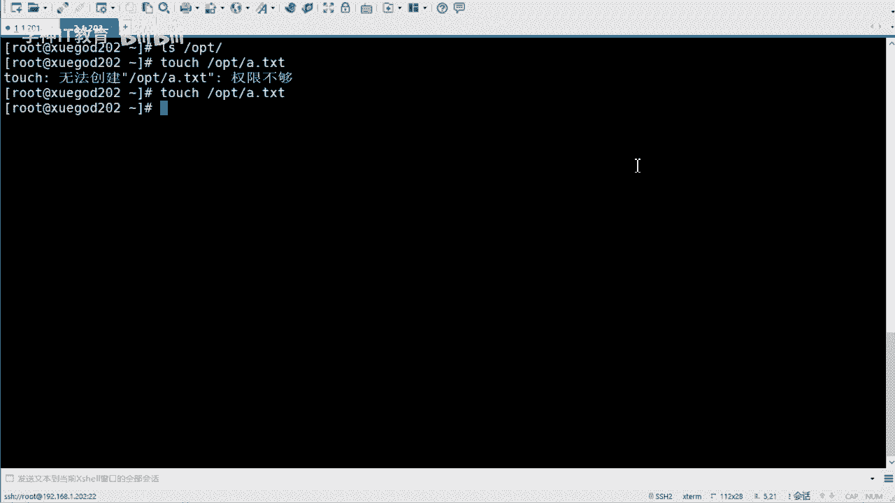

你发现了吗，这个很神奇的说你权限不够，对不对，所以权限不够啊，你很少看到说root权限不够吧是吧，但是这个地方唉就就就就看到问题了是吧，你看到问题了啊，好吧，就是因为这个这个这个权限啊，我把它标个红吧。

嗯我把这个啊把这个标可能不太明显是吧，nfs nobody啊，这是七的嗯，在巴巴里边的话呢，其实nfs nobody nobody是吧，这个用户它缩写成了叫nobody nobody 8的版本啊。

但是目前你们可能还用不到八字这个服务的啊，这个知道就可以了，他简简化了，因为之前也有nobody，有n fn装b对他现在全部改成了装b是吧，感觉相当然这个这个不建议是吧，不建议这么想，这个因为它它太大。

声音太大对吧，但是你可以用后边这个啊，这个不是静音的，然后再去写的话就可以了好吧，你再去创建是吧，这个就没问题了是吧，这就没问题了啊，字的话其实它的参数可以可以很多啊。

这个参数就是指咱们那个配置文件的参数对吧，2w刚才只是一个是2w啊，那些还可以r o只读是吧，s n c是同步对吧，咱们上节课讲的是2s n c，你看现在有s n c。

s n c的话是资料同步写入内存和硬盘当中是吧，a s n c是异步，异步的话就是先存的内存，然后再写到这个硬盘是吧，那个硬盘啊，对secure啊什么之类的啊，然后insecure啊什么什么这种的啊。

这种这种其实简单看一下就可以啊，是wiley啊，nomi had had是是是是躲藏的意思啊，cf的共享目录中不共享其怎么录是吧，你看诶是不是你看对吧，他可以写的很细啊，他可以写的很细的啊。

啊什么subtree啊，no rules rash，这个可能会用到啊，这个意思是root用户的所有请求映射成如anny用户一样的权限啊，这个是完全的访问权限，就是权限的问题啊。

然后用法的话就是把它加入到括号里边对吧，咱们刚才写的括号呢就是就是那个啥嘛，就是按w嘛，对不对，但是呢你可以加这些都可以加进来啊，然后逗号给它分开是吧，就行了啊，就是你可以设置的很复杂是吧。

可以设置的很复杂，就这种的啊，可以这样写，括号里边的是吧，刚才咱们这些参数简单说了一下啊，然后呢这个星啊这个心的话代表是什么呢，代表是网段是吧，就是谁能连接我，谁能挂在我，对不对，心的话就是任何任何的。

如果说你想让某个网段的话，你可以这样写p地址啊，什么点0+24，就是这个灵光段，具体的某一个就是只有它可以连，可以挂在我啊，这个就就写的很很很那啥了嘛是吧，就很专业啊，对然后也可以这样写。

什么u i d等于500这个东西就可以啊，然后还可以写三个五，一个零也行啊，写24也行啊，对然后也可以这样写，还可以写多个啊，可以允许这个网段三零网段也可以四个联网段都行啊，形成这种对吧嗯。

在发布共享目录的格式中，除了共享目录是必须必跟参数外，其他参数都是可选的啊，除了这个就是共享目录啊，是可选的，其他必选的，其他都是可选的是吧，都是可选的。

并且共享目录与客户端之间及客户端与客户端之间需要使用空格符号，就是这个地方空格，但是客户端与参数之间不用空格啊，就是客户端就是这个地方就是你的地址和空小块之间是吧，不利用空格的好吧，不利用空格的啊。

ok这是共享的参数啊，然后还有挂载的参数，挂载参数的话，这个就是客户端的了是吧，客户端就是mt的时候好吧。

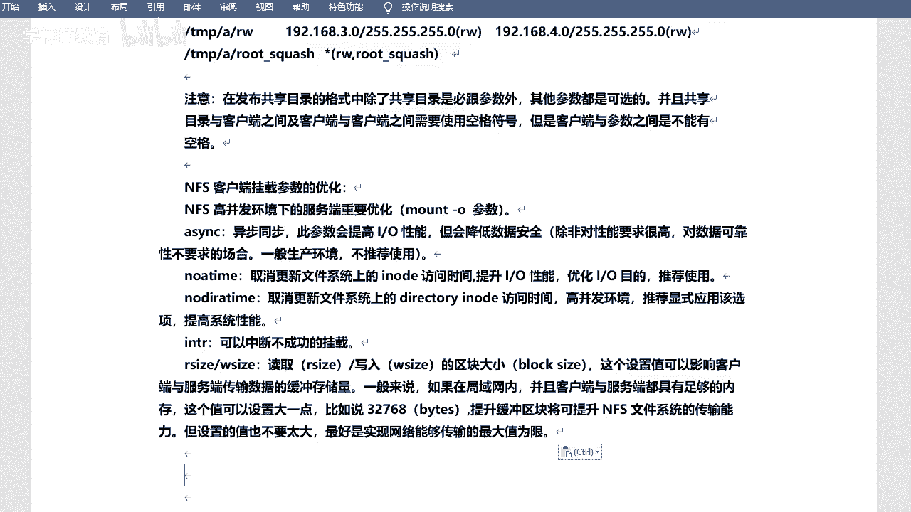

mt的时候，然后你可以去去加的啊，mt时候刚才咱们只加了个t吧是吧，就这个码是吧。

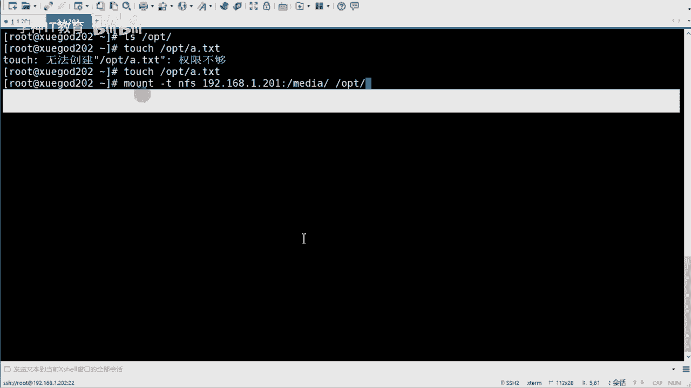

然后可以加a s n c，这个也可以移步啊，什么noway time啊，取消更新文件上的i know的访问时间，提升io性能是吧啊。

什么d r a t m a n t r可以中断不成功的挂载r3 w size是吧，读取写入的区块大小啊，这个也可以去设置，希望你可以设置啊，这是挂载的时候好吧，挂载的时候啊，然后还可以内核优化。

内核用啊，那句话的话就得去改什么呢，就得去改c m c c s c t l啊，这个配置文件了好吧，这个配置文件了啊，内核默认携缓存啊，独缓存最大毒缓存最大限缓存是吧，然后让它生效，刚好p的话就是生肖啊。

然后把这个参数可以写进去是吧，让它生效啊，这个可以可以可以试一试行吧，当然这个呃怎么说呢，呃除非你对他的要求特别严格是吧，然后你可能需要去改这个东西对吧，如果一般去用的话，你可以不用改啊。

可以不用改啊对吧，然后如果说你咱们挂载的时候，mt的时候可以写是吧。

mt就是说更mount这个这个gt nfs对吧，然后你可以加上那个参数啊，加参数的话就是用这个用这个高o的方式加我。

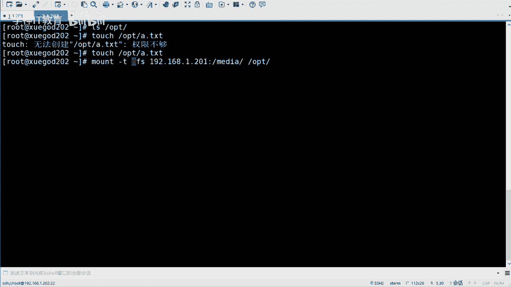

这有写高o吗，牛啊，游戏啊，在这高的参数后边加上这些这些东西啊，这些东西啊就是杠t n f4 之后是吧。

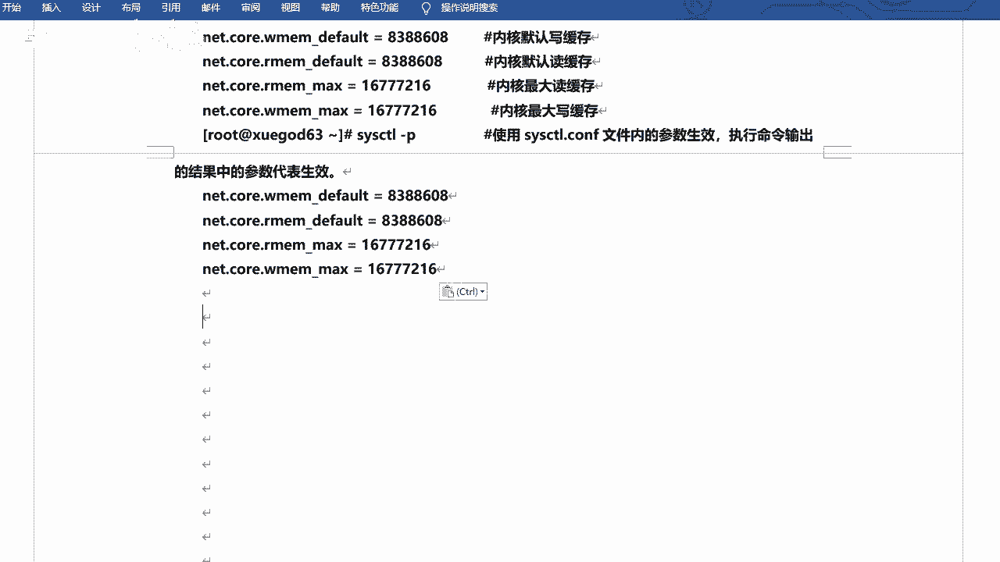

你加上高o啊，这什么no time这种的啊，逗号什么no什么d r a time是吧，然后什么r size这种，r4 s等于什么，随便选一，啊啊如果不写的话，就空格空开空开，然后把谁关在哪儿去对吧。

这样就可以啊，但是我这个是busy啊，因为我已经挂过了是吧，对不对，没挂过的话，可以这样写啊，可以这样写啊，f a t p可以加吗，可以加的，f a t p加的话呢就是这种加口端的加啊。

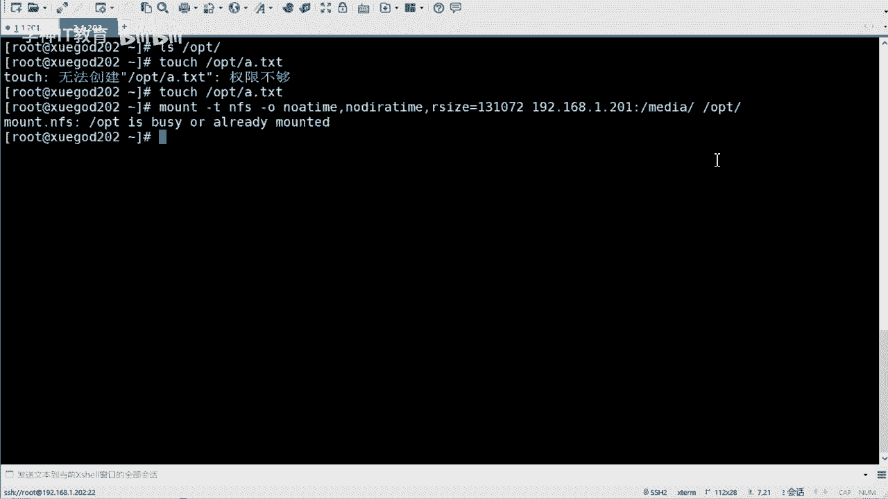

就是加这些行吧，你加这些啊，我把这个写一下吧，写一下啊是吧，帽子的时候的话呢，你可以去这样加啊，刚tm scoo这样写，是这样写啊，呃f a t p的话就不用杠o这个参数了是吧，不用杠o了啊。

nfs但是后面有空格好吧，还有空格啊，就是把谁空格挂到哪儿，空格n f s空格，然后你的这个优化的参数是什么，time呀，no dr time是吧，然后得到没有啊，没完了之后呢，直接零零啊。

零零它就不是default。

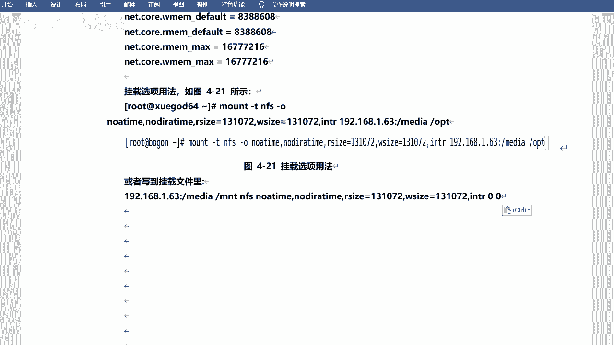

明白了啊，default啊，它就不是default了，就这个地方啊，你把default给他是吧，给它换掉好吧，default给它关掉啊，换成你你想加的那种是吧，什么time啊，这种的好吧，我想改一下。

no time啊，然后是no d r a time，好吧，它会变一变颜色的啊，我看我妈的高音可以吗，是吧，你看啊这个是可以挂的吧，没有报错嘛是吧。

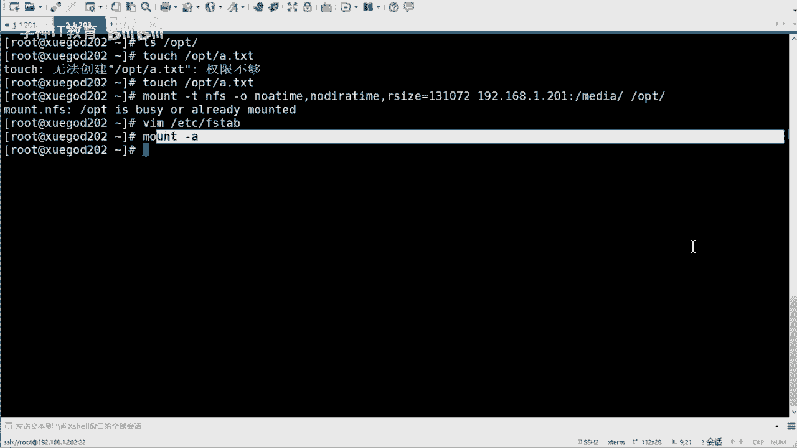

没有报错啊，是吧，可以这样写啊，当然这是这全都是扩展扩展好吧，因为这个东西太多对吧，太多太多啊，一般的话你就记住2w2 s n c的话，可能有的时候会用到啊。

然后其他的这个地址需要记住怎么写的格式需要记住啊，这个这个其实没什么，客户端里边没什么，除非你要改参数，这个地方可能要改，但是几率会比较小，几率比较小啊，行然后的话咱们来总结一下好吧，总结一下啊。

今天主要是f好吧，ftp啊嗯首先介绍ftp ftp服务器的这个介绍是吧，然后安装配置一命访问对吧，用户密码的方式访问，包括咱们用客户端的方式访问，包括那个s加密是吧，咱们也试了一下啊。

然后就是fs n s f s的话，你能正常的去这个装好，装好之后呢，去分享这个目录，然后呢客户端能挂载就可以了是吧。

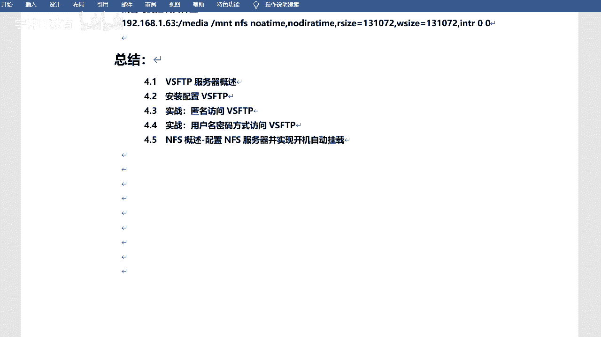

就可以了，ok行。