# RHCE8红帽认证课程／自学必备／云计算／rhce／Linux运维 - P1：环境配置-sshd服务介绍 - 学神科技 - BV1L54y1S7qZ

哈喽啊，然后今天的话呢就正式开始咱们第二阶段的内容了，是不是嗯第二件的话呢咱们主要讲的就是服务好吧，各种服务啊，像s s d是吧，什么远程同步的ftp文件共享的是吧啊，cover工具安装的啊。

阿帕奇等等的一些数据库是吧，都是第二段会讲到的啊，然后咱们第二阶段开始呢用的是七的环境对吧，就是七的啊，因为之前咱们第一段讲的是八的对吧，然后讲八的时候呢，其实也讲了一些七和八的区别，对不对。

然后第二段话呢咱们就是用的七的啊，包括三四也都是一样，后面的课程的话就都都用到这个七的呃，八的话呢因为他的一些呃怎么说呢，一些版本吧是吧，还有一些配置啥的，和和七的服务什么的配置是差别比较大的好吧。

所以说咱们后边这个服务什么的啊，包括后续的集群呢啊什么存储啥的是吧，咱们还是用七的系统嗯，当然你们装的话，后期可以装两个，你八还可以正常用的啊是吧，然后咱们做实验的话呢，就可以直接用用七的好吧。

当然有兴趣你可以跑一跑，你看t的服务能不能在八上面跑起来啊是吧，也可以去试一试好吧，当然咱们建议现在用的就是还是七的，后面用的还是七的呃，七的装系统咱们就不用过多去说了是吧。

但是我会简单的给大家提一下啊，装系统啥的，咱们不用多说啊，因为装系统的话呢，七和八的区别不大是吧，然后装好之后呢，咱们要做做一些事情啊，包括关闭防火墙是吧，因为目前还没有涉及到防火墙。

所以说先给它关掉对吧，关掉防火墙，然后s linux给它关掉，对不对，呃这个咱们之前应该讲过吧，对不对，然后你去stop stop掉防火墙，然后disable开机不启动是吧。

然后呢s linux呢也disable掉呃，当然这个需要改配置文件是吧，彻底关掉，需要改配置文件，然后重启生效的，是不是，但是我这没有写重启啊，这个你们你们需要知道一下好吧，你需要知道一下啊。

嗯然后如果说你想临时关闭，那就是set enforce，对不对，这个命令还记得吧，临时啊，set in fort 0是吧，也是可以的啊，但是咱们最好是给他dc不掉呃，配置文件的话，还记得吗。

配置文件有两个，是不是两个，一个是etc s，一个can fig是吧。

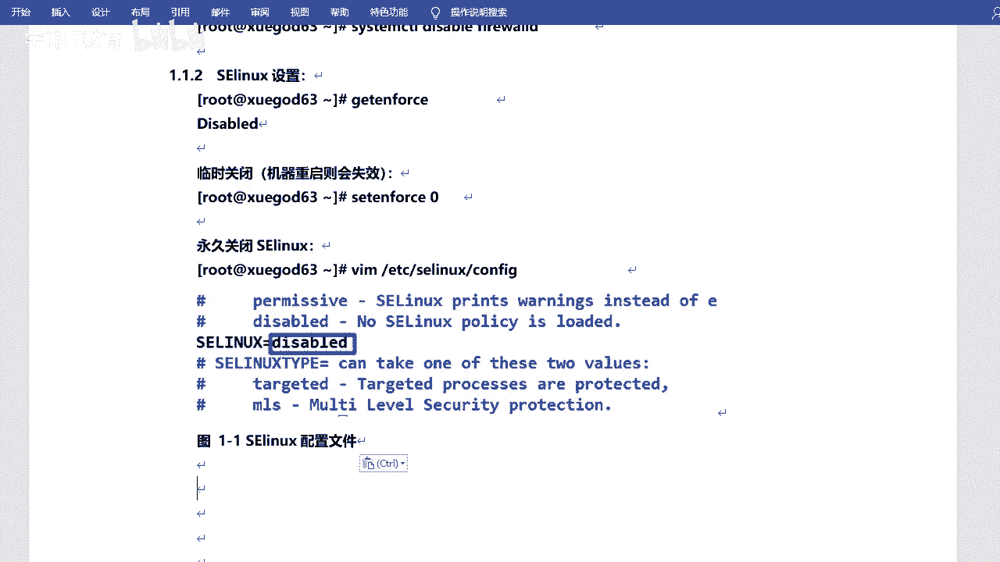

简单看一眼，e d c啊c啊，不是那个s linux是吧，跟这个还有一个是谁，是哪记得吗，btc，忘了是吧，cs跟那个s10 是不是这俩是一样的啊，给这俩哪个都可以啊，好吧呃。

然后当你改完之后需要重启的是吧。

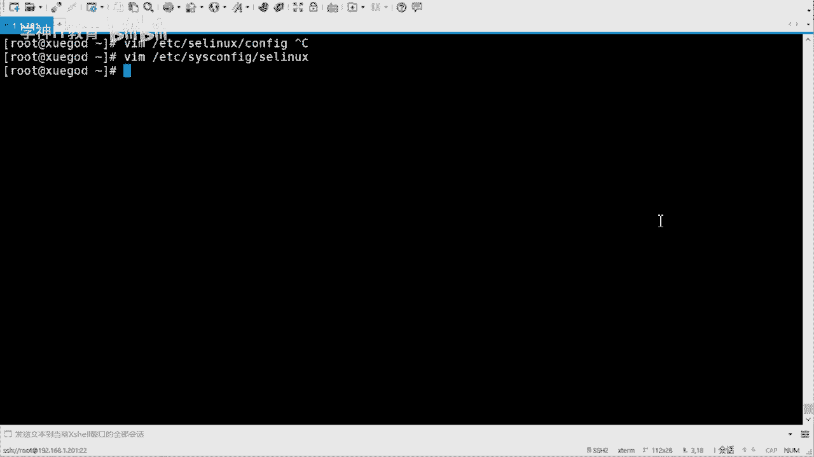

需要reboot的呃，然后就是配置ip对吧，配置ip啊，呃配置ip的话呢和八其实八也可以改配置文件，但是八的话咱们需要重启网卡的，是不是，然后七的话呢咱们也呃咱们也是需要去改配置文件，改配置文件的话呢。

然后呢去重启这个服务好吧，重启服务啊，就是那个network好吧。

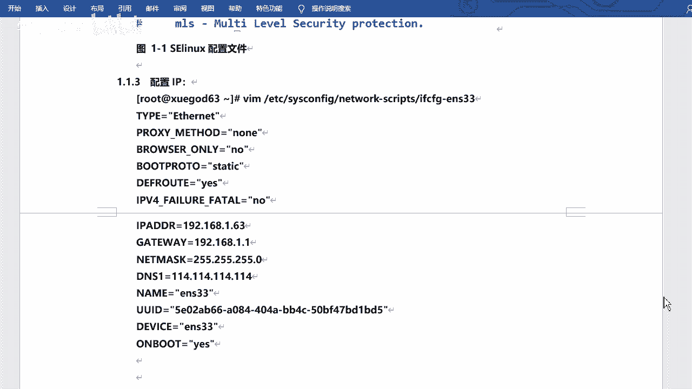

这里边咱们有network这个服务啊，叫network是吧，这个你给它重启，然后你的配置生效了，八里边咱们是一副down是吧，if up这样子的，是不是心里边的话，咱们就用服务去去去重启就可以了啊。

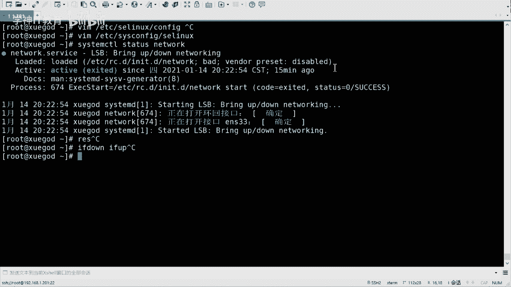

然后改的方式呢其实呃主要就是嗯我简单标一下吧是吧，主要就是这boss for two啊，获取ip的方式，csc就是静态的是吧，b a c b就是动态的啊，然后如果静态的话呢。

你要写上一代非地址网关掩码d对吧，这个需要提升啊，当然all boat一定要是yes的是吧，就是开机启用你的网卡啊，然后如果是dc p的话，其实也行啊，dc也可以就是自动获取的是吧，自动获取的啊。

这个但是这个呢它可能会变ip是吧，后期你去远程连接啊是吧，然后你还得老老得去改那个啥是吧，老得去改那个那个地址是吧，所以说咱们一般就是设置成静态的就可以好吧，静态的就可以啊，呃当然这个地址的话呢。

根据你的a根据你的网段的情况是吧，有的可能是一网段的啊，一点网段，有的可能是零点网段的是吧，啊有的可能还是什么十啥的是吧，反正你是什么，就是你自己的就可以好吧，你别说啊，老师我和你的ip设置一样。

怎么你可以我不可以啊对吧，因为我的网络和你的不一样是吧，所以说要注意一下啊，对不对，这个之前呃第一段可能也讲过吧是吧，不一样的地方就是去设置这个配置，完全配置文件之后是吧，然后重启服务啊。

重启network这个服务呃，当然他也支持n m m c i的方式也可以啊，这个也改是吧，当然这个改完之后呢，也是需要去重启那work这个服务的好吧，嗯哼这是网络部分啊部分啊。

嗯然后可以设置一个主机映射是吧，主机映射啊，呃主映射这个呢需要去改叫house文件是吧，house文件呢不单单是咱们linux系统，有的windows也有是吧，我不知道你们有没有注意过啊。

windows也是有的，这个呢主要就是一个ip和主机名对应关系运算关系啊，后期你去什么ping啊，或者你去用这个主机名啊对吧，他都可以通的啊，都是可以通的啊，嗯这里边咱们举的是写的是两个啊。

ip和主机名的一个关系是吧，呃当然呃目前啊咱们用的是一台机器，一台这个虚拟就可以了，是不是嗯，然后下次课的话咱们就会用到两台好吧，然后第二阶段的话咱们会用到有一台的时候。

有两台的时候也会也有三台的时候是吧，到时候需要几台的话，我会提前跟大家说的好吧，反正目前的话最少你需要先装两台啊啊这个最好可以做一下是吧，如果你不想做这个也可以不会做啊，然后就是改主机名是吧。

主机名这个最好都有的啊，主机名，因为主机名的话，你可以通过主机名判断你的这个这个这个主机是吧，你就不用看ip地址了，因为它都是locost，也不好分，如果说你有多台机器都调logo cost是吧。

到时候你也分不出来是吧。

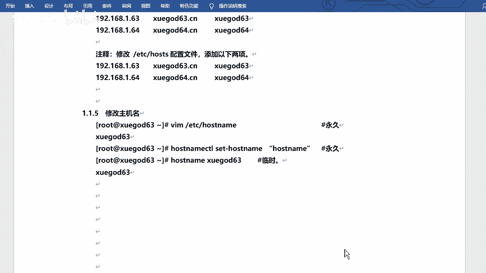

改主机名呢是通过etc house啊，这个文件可以改的，e d c house呃，house name吧，name是吧，这是主机名啊，然后命令的话就是house name c t l是吧。

我这个讲的比较快啊，因为咱们之前说过这个东西是吧啊，side house name啊，叉叉叉是吧，然后也可以啊，也可以啊，这是云九改的，临时改的话可以直接house name，然后加上你的主机名。

这样也可以，就是临时改的是吧。

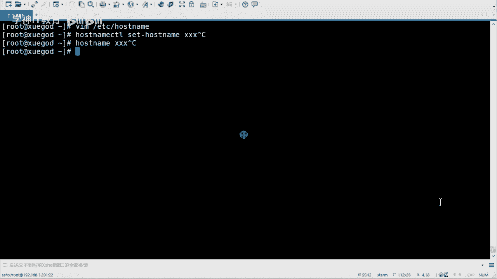

ok啊，然后这是主界面啊，然后是亚美元，要么源的话，目前啊咱们用的一般通过本地的样本院就可以了，本地的就是光盘镜像的样品源就ok就可以呃，但是呢呃后期会用到网络源，包括一普源是吧。

就是他们的包会多嘛对吧，而且版本比较新，所以说要要配置一个啊。

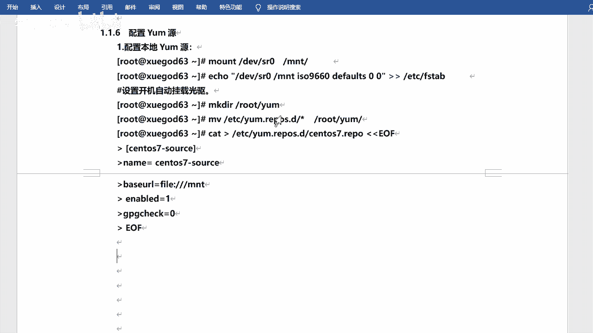

要配置一个，其实怎么说呢，其实在咱们的系统，因为现在咱们用的snos是吧，现在是sn s7 啊，right has release，我是7。4啊是吧，你们可以装7。6，7。8的都行啊。

呃它都给咱们配置好了，其实啊，对不对，这里边它都是有的，送s都是有的啊，然后默认的话呢呃是可以直接用这个网络源的，但是我一般的话你看我这种是吧，我就是给他改了个扩展名，我就是给它相当于应用掉了。

因为我一般也不用这个网络的啊，我用本地的就可以啊，但是呢现在要配置的话，你可以去配置一个好吧，那不是配置啊，sorry，就是你直接用就可以，直接用就可以了，然后一普源的话，你把它放开，把这个放开。

就是把后缀名，我这个后缀名额就是还是点rap，然后直接压门，in stop，啊然后ip就可以了，一le release，是吧就可以了啊，今天应该会用到吧，我看啊，那我直接改吧，我直接改一下啊。

我把我这个恢恢复那个啊，sorry，我切过去，我把它恢复成正常的啊是吧，然后让我rep list可以看一下嗯，网络的话应该是有1万 1万几啊，17000还是18000，15000个包是吧。

15000多个包啊，当然这个包含了我的本地的原是吧，这是我本地有3800多个包啊，然后有了之后你可以直接让刚y insert e e p l release是吧，直接装这个离谱源扩展源就可以了是吧。

呃扩展的话就更多了啊，扩展的话会会有29000还是多少个包来着看一下吧，他会去同步这个缓存信息啊。

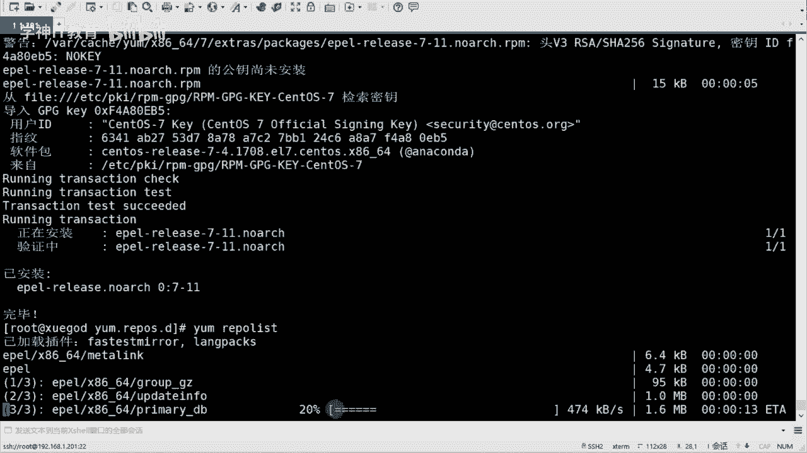

嗯当然咱笔记里边的话呢是用的另外的一个啊，笔里边呃这是本地源是吧，咱们应该都会啊，然后呃网络源的话他用的是诶这是还是本地的是吧，网络呢网络源的话用的是这个阿里的阿里的对，然后这是国内的吧是吧。

会比较快一些，会比较快一些啊，你看是吧，他是阿里的啊对然后要么原啊，然后装好之后的话呢，也是去直接装app release，是直接要么一扫一会就可以了，嗯对吧，你看这个名字，阿里云点com对吧。

咱们呃笔记里边是用的是阿里云啊，我这个我现在操作的话呢，用的是这个这个它自带的就是送来自官网的源啊。

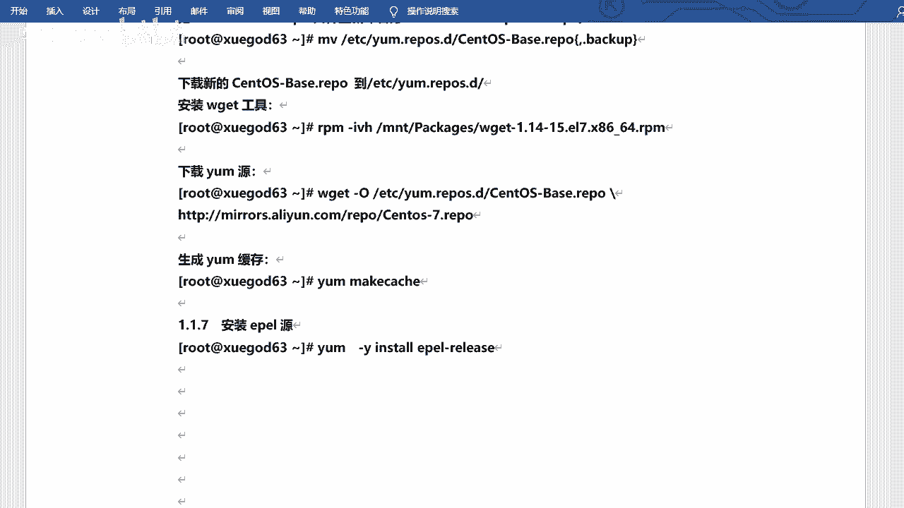

嗯，好啊，这边然后也出来了啊，然后包的话一共是有29000多个包是吧，你看看这个很多包证明就就已经成功了是吧。

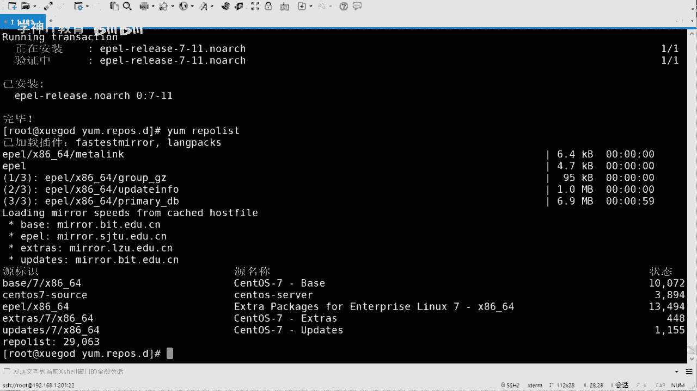

证明就已经成功了好吧，然后做完这一系列操作之后啊，那你可以做拍照是吧，可以做拍照啊，后期呃如果说去那个做这个实验的话是吧，你可以快速恢复到这个当前这个快照啊，然后再去什么安装呀，配置啊是吧。

然后再去坐箱的设置就可以了，好吧嗯，拍照之前咱们应该做拍照啊，在第一阶段的时候是吧，第一段的时候当时也是说做好一个本地的亚美元对吧，然后什么防火墙嗯，s1 windows也是关掉吧。

关掉之后也是做了一个快照是吧，这个也可以做一个啊，如果说你不想做也可以啊，因为这个和咱们第一段不一样的地方，就是说它配置了网络源和易普源是吧，到时候你再单独配也行啊，也也挺快的。

其实嗯反正最好还是做一个吧是吧，快照啊，呃做快照的时候呢可以关机做快照是吧，关机做啊，因为关机的话它占的空间还小一些是吧，开机会占的占的这个这个这个空间会比较大啊，然后前面的工作做完之后。

咱们就开始这个服务了，好吧啊，第一个服务咱们讲的是s s h d是吧，叫做远程服务啊，远程服务其实这个服务啊是吧，这个第二阶段咱们讲的都是服务是吧，你像web服务啊，像这个这个什么ftp的文件服务是吧。

什么数据库服务，这都叫服务，对不对，都叫服务啊，呃因为咱们学的是linux系统，是linux系统啊，它就是这个服务器系统是吧，为什么叫服务器呢，其实它里面跑的就是服务对吧，给用户去提供这个服务的。

对不对，比如说咱们的web服务啊，web服务的话就是说别人可以访问你的网页是吧啊可以去去点击啊，会可以去干嘛的，对不对，数据库服务可以去连接啊，可以存储存储你的数据是吧，那么s s h d服务的话呢。

它就是用来远程控制的好吧，远程控制的啊，s s h z服务啊，它使用的是s h协议啊，可以用来进行远程控制或在计算机之间传送文件是吧，呃相比较是用ta的方式来传输文件，有安全很多，因为tnt是明文传输。

s h是加密传输是吧，这又讲到tnt，台湾的话，其实也是一个一个一个服务，可以这样说啊，然后有些如果做过网络的话，应该知道啊，网络的话像一些交换机路由器啊是吧，之前用的都是tnt啊，像我之前干的时候。

那几年都是用的这个后来网络的网络的这个这个设备是吧，他也换到了s h是吧，这样去连接的，因为它是s h的话是更安全的是吧啊因为tnt它是明文传输，s h是加密的，对不对，当然这个是s h的。

它是个协议啊，还有这个协议啊，就是什么安全啊，外壳什么的是吧，然后哎这样的一个协议s i d的话，它是一个符，加了d之后，它代表的是demon，demon就是后台是吧，后台运行的一个一个服务啊是吧。

它不单单是可以进行远程控制，远程登录对吧，然后它还只是叫传输文件，传输文件的话，你像那个s e t是吧，这个命令用过吗，这个命令对不对，他就是用的是s h这个这个这个服务啊。

然后还有那个什么嗯sf tp是吧，还有那个那个r s n c是吧，咱们下次给大家讲的这个他走的都是s的协议。

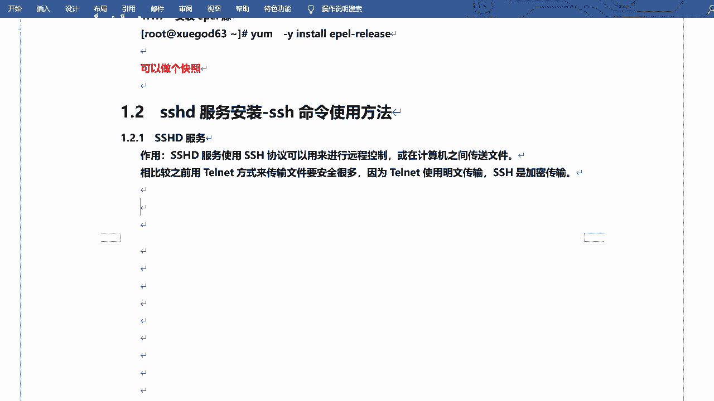

对吧，包括咱们用的这个远程的什么呢，远程的这个工具是吧，远程一个工具啊，我用的是叉叉，对不对，我不知道你们用的是啥啊是吧，像这种工具，它也是支持s协议的对啊，你不管是什么x shell啊。

c r t final shell啊，还有什么term之类的是吧，它都是支持的啊，你可以看一下这里连接的时候，他是不是让你当然咱们没有选啊，默认他他用的就是s s协议，看到没有，默认就是他是吧。

输入你的ip地址多个号，然后用户名密码诶，我就可以连上了，对不对，我就可以连上吧。

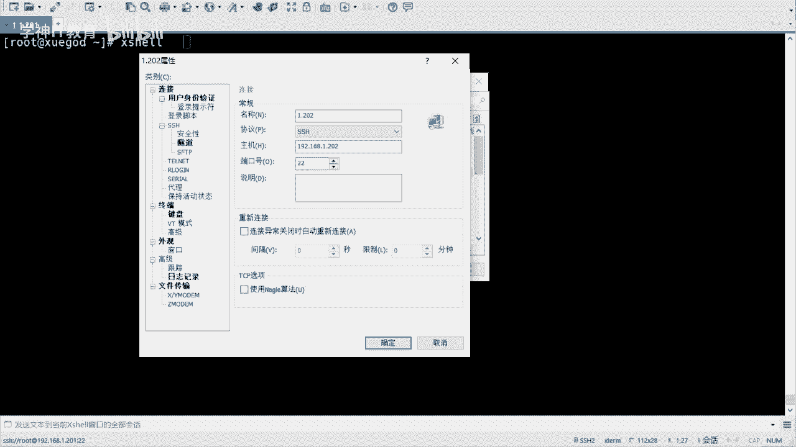

是因为什么，就是因为它支持s s协议啊，当然这是客户端啊，这个客户端c端直角是端，咱们是server服务端，对他支持s这协议啊，然后咱们这边呢是跑的是s h e的服务，对不对，哎那就可以连上来是吧。

那就可以连上来啊，对吧，现在你们应该也就是用的这种工具去远程连接过来的吧是吧，然后去那个操作的对吧，然后操作的啊，当然这个s c服务的话，一般情况下都是装好的啊，一般的话它默认就是支持的啊。

其实不管哪怕你是最好安装的啊，可能你有300多个包，是不是你的系统啊，然后它也是支持的啊，你是这个带带图形化的，带桌面的对吧，它也是有的好吧，当然你可以先看一看啊，咱们可以通过这个方式sm c调对吧。

控制咱们的这个服务啊，stus看一下s s h d是吧。

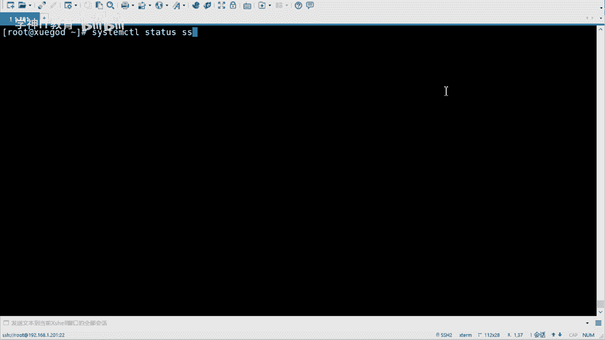

它是不是运行的对不对，它是不是运行的啊，如果没有装啊，咱们可以装一下，装一下可以装几个包是吧，可以要么意识到open s h啊，open s h lss和open server这么几个包是吧。

直接装就可以啊，或者说rpm的方式去装对吧，open s开头的包，rpm包你都可以装上，28，你都可以撞伤啊，他的包的名字叫这个啊啊然后啊这还写了一个说如果如何去确认是吧。

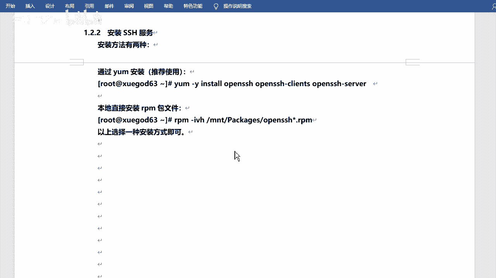

嗯rpm刚好q a这回忆一下啊，这qa是啥意思，是吧，就是是不是你你这个这个装过的包是吧，然后你可以检索open cc这个关键字对吧，它会显示出来，对不对，当然你通过这个服务去看他是running的。

已经已经运行了是吧，那这边已经装好了好吧。

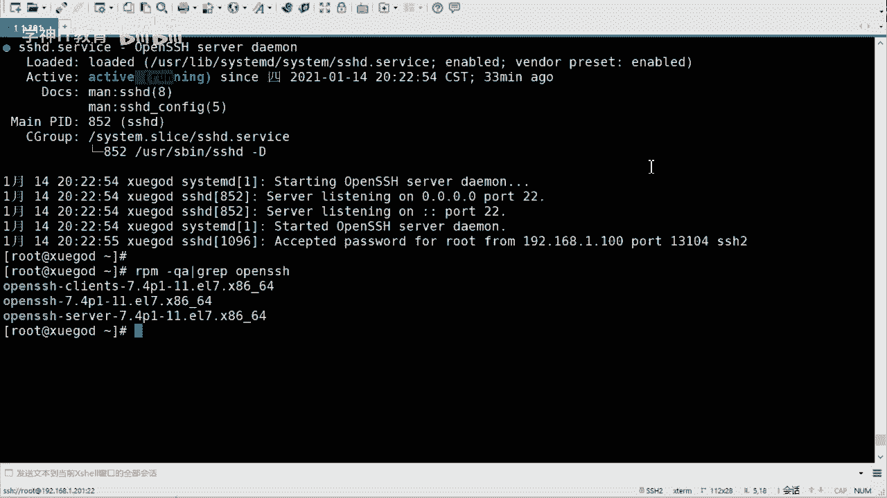

3s h，然后它会有一些配置文件，咱们去学服务的话，学服务会给很多的配置文件好吧，会有很多配置文件，基本上就像一个服务是吧，它会对应一个配置文件啊，但是有的服务的话，它可能会对应多个配置文件是吧。

那咱们在第二阶段的话呢，就会看到看看到好多的服务是吧，然后就会改很多的配置文件是吧，当然这个配置文件的话你可以不用记啊，你可以不用记啊，什么意思呢，就是因为咱们第一段就学的一些命令啊是吧。

然后呃什么参数什么的啊，有同学可能会记是吧，哎我可以记住我这个参数是干什么的，对不对，然后后期用的话直接用就可以了啊，把它记在脑子里边是吧，第二就是这些配置文件啊，都都不用记啊，你都别记。

因为太多啊太多啊，有的时候可能少吧是吧，有几个参数改改什么数字啥的，是不是就可以就可以了，有的改的时候可能会写非常多的配置啊，这些你都不用记啊好吧，然后呢你知道他在哪是吧，咱们在哪讲啊，这个服务是吧。

到时候你能找到他就可以啊，因为记的话也记不过来，确实也记不过来好吧，而且不同的这个服务是吧，它们之间的配置有的时候不太一样啊，没什么通用性是吧，而且有的时候比如说我去设置一个服务，咱们可能讲过对吧。

咱们讲过，但是呢你回去工作中可能会用到另外的一个模块啊，另外的一个方式啊啊这个配置和咱们讲过的又不一样是吧，嗯所以说你更不用记是吧，到时候去会去查呀是吧，会去搜啊，对不对，就可以了好吧就可以了啊对吧。

然后这儿有这儿有些配置文件可以简单看一看啊，呃s s是相关的是吧，这个这个也不用记啊，简单看一下就可以好吧，现在看一下就可以啊，关键是有两个好吧，关键是有两个，呃呃这俩是一个吧。

e d i s c是看这个啊啊两个啊，一个是a d c s h目录下的config，一个是a d c s s之下的s h d config是吧，这两个看上去是一样的，对它有一个不一样的地方。

就在这儿有一个有d是吧，有一个没有d，对不对，就差这一个字母啊。

我们可以看一下啊，b d c s h s h figure是吧，然后还有一个是a d c s h s h d，看这个这两个这两个的话一个是客户端，是客户端的配置，这个是服务端的配置啊。

当然咱们现在用它呢，就用的就是用的就是服务端是吧，用的是服务端啊，所以说咱们改的就是这个配置文件好吧。

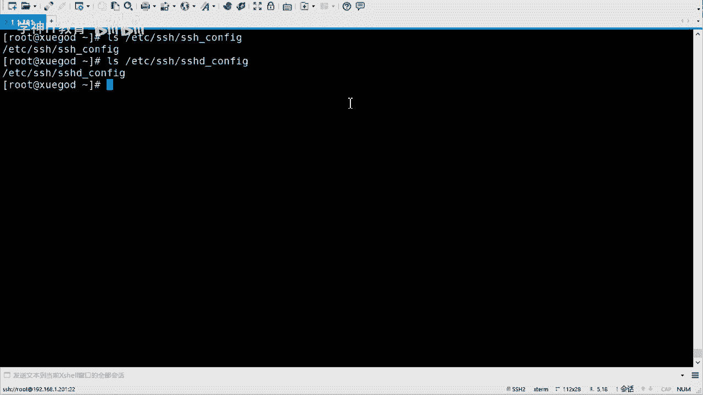

这个你可以不用动好吧，这个你不用动啊，就是加d的好吧，就是加d的啊，s s h d config这个配置文件行吧，然后呃服务的启动关闭是吧，这个其实咱们都操作过好多次了啊，就是什么重启。

restart stop，停止start启动啊，sitors是状态是吧，产生状态啊，然后设置开机启动的话呢，可以用system c t enable是吧，这是咱们七啊，包括八一样是吧，咱们那个怎么说呢。

咱们这个这个这个推荐去用的方式是吧，但是如果说你用之前的方式也可以啊，有些可能用的六比较多是吧，甚至五啊更更更老一些的啊，那种的话会用到这个什么check config这样的命令他也支持啊。

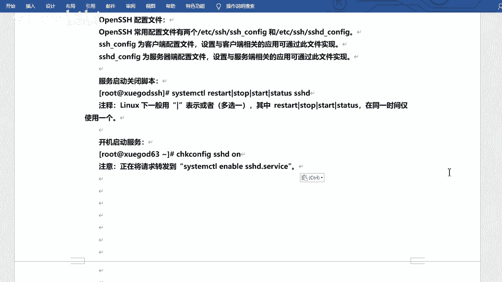

就是它是兼容之前的命令啊，你就说check vg是吧，s s h d2 这个方式还是支持的，但是它会告诉你正在将请求请求转发到system enable啊，这个这个这个命令过来是吧，就是你执行这个命令。

但是他会其实执行它还是它啊，就这个意思好吧，这个意思啊，包括service，还有支持service service命令是吧，service s s h d是吧，start对不对，你看它也支持的啊。

它同样会提示你说redirecting to be system ttl stars h d是吧，同样的它也是用的是system加的方式是吧，去执行的好吧。

对这个当然当然这是如果说杨老师我不懂这是啥是吧，这是七之前65000啊是吧。

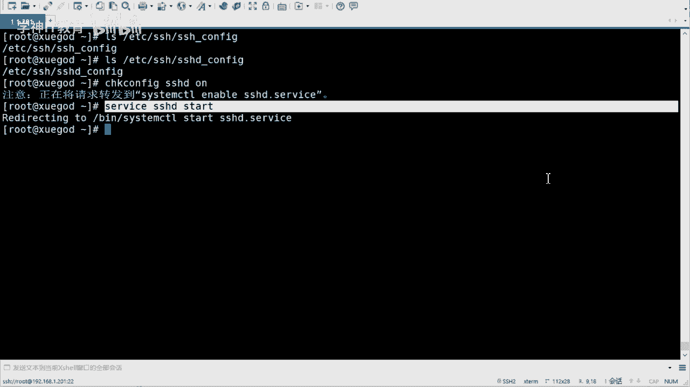

用的方式，如果说你不懂哎。

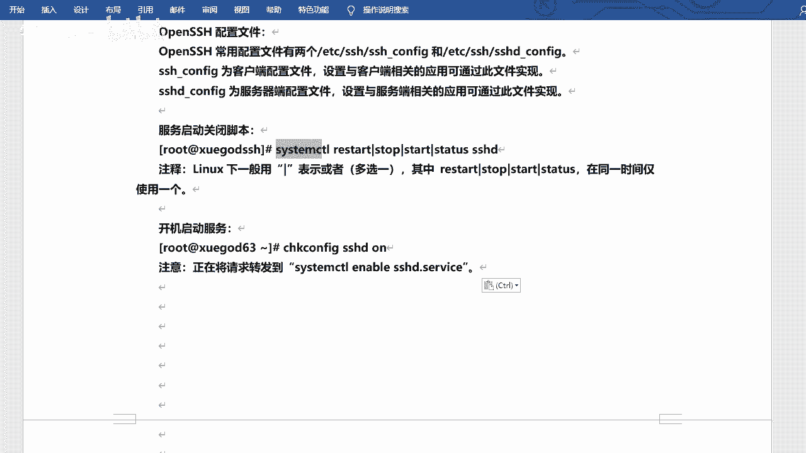