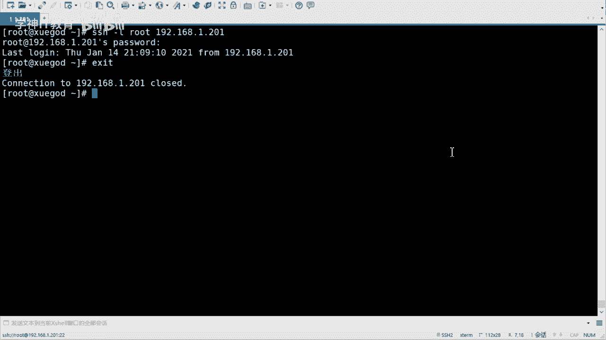
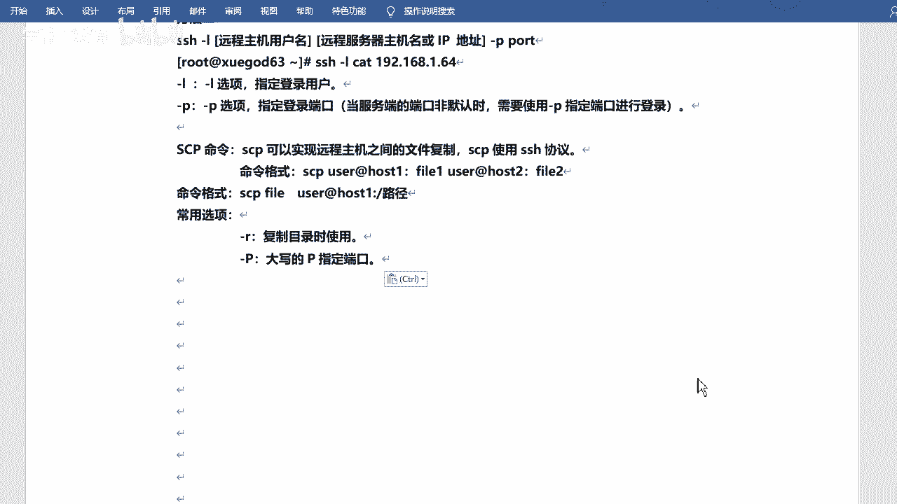
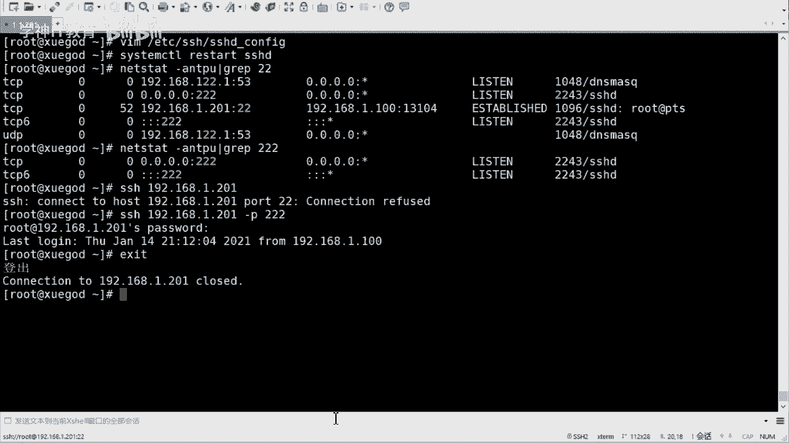

# RHCE8红帽认证课程／自学必备／云计算／rhce／Linux运维 - P2：ssh远程连接-配置文件讲解 - 学神科技 - BV1L54y1S7qZ

嗯这个是呃服务是吧，就是启动关闭啊，然后开机启动这个东西呃，然后正常的咱们就是system c调的方式是吧，c怎么现在方式啊，然后你也可以查看是吧，哎我不知道我的服务现在是不是启动，是不是启动。

开机启动一个叫啊是吧，是不是开启动，咱们可以查叫csl啊，is enabled啊。

可以去查system可以调啊，is enabled呃，s s s d是吧，它会告诉你enabled就是引进的对吧，不是就不是啊啊应该是disable，应该是就是不是啊，哎illie就是启动就是就是啊。

当然如果说你有的有的服务可能名字不知道是吧，我也想去看，对不对，那么你可以检索啊，叫cm c过滤嘛是吧，叫list unit，field是吧，然后它会显示所有的啊是吧，所有的啊是不是enabled啥的。

会显示，然后咱们去检索一下，比如说我就检索s rap是吧，s h哎对吧，他也没告诉你，对不对，他没告诉你啊，就是他啊是不是enabled啊，是不是able，然后ok行。

这是这就是服务是吧啊什么开启啊是吧，关闭啊是吧，开启启动啊，对不对，这个咱们会设置啊。

ok然后看看怎么用，是怎么用这个s h啊，连接呃连接的方式呢，其实呃windows端的一些工具咱们就不用多说了吧是吧。

直接用就行啊，然后呢其他的地方你像如果说我是linux服是吧，客户端吧，比如说啊去连接咱们的linux系统，怎么连呢，就是用的s h这个命令，去年s h啊，像mac有用过的吗，mac是吧，它有命令行。

是不是他也可以用s h去直接连你的这个linux系统是吧，你都不用装，不用装那个工具了，对不对，该怎么去连呢，s h啊，去指定你的这个这个呃主题名啊，火ip地址应该叫啊，比如说我连谁呢。

我连我自己吧是吧，我地址是192。198。一点，这个这个201啊，这是我的地址是吧，嗯然后呢，哦sorry，应该是这样，这应该标准是这样的，就是用户名用哪个用户的身份去连啊，用户名。

然后at加上你的ip地址转换后主机名啊，然后呢加上你的问号杠p端口号好吧，就是你的服务的端口号是吧，嗯当前咱们这个s h啊是吧，它的默认端口号的话是22好吧，22啊，你可以这样去连一下对吧。

它会呃有一个什么呢，有一个提示啊，还有sure you want to continue connecting是吧，你确定你要去继续吗是吧，yes，然后输入你的密码就可以了啊。

用户名所对应的密码123456啊，我里面都是这个啊，哎这就连过来了好吧，连过来了，当然是是一样的，因为我是自己连自己嘛是吧，所以说是一样的啊，呃如果说你的ip你的不是ip地址，你的端口号是默认的话。

这个地方你可以不用加直接用户名，at ip地址就可以来就可以连过来啊是吧，然后e x i t退出啊，然后如果说你的用户名是当前的用户名的话，比如说我是root，你当时就是root了是吧。

那么你可以直接连它，默认会用你当前用户名去连接你的那个服务器啊对吧，这个也可以好吧也可以啊，除非你可能换一个是吧，比如说我换成cd cd at，然后加上ip地址对吧。

那你就得输入cd用户所对应的密码了好吧，连接的时候啊。

是不是就是s h去连好吧，s s h去练啊，嗯还有一个方式是这样子的啊，这样子啊加杠l啊，gl呢是指定登录用户好吧，只登录用户啊，这个就不用加at了。

行吧，记不加at了啊，也试一试吧，高l是吧，密码123456，对不对，这个也可以的啊，当然这个其实用的不多啊，反而好会用at的那个方式就可以了，这是s h对吧，s h啊，嗯s s h它是远程连接的对吧。

它还支持其他的命令对吧，命令啊，比如说i s t这样的命令，s p它其实走的也是s s h这个协议啊，它代表是靠远程拷贝啊，远程拷贝这个文件啊，有人考编文件呢，呃也得去指定你的什么用户名啊。

买地址啊是吧，然后哎拷贝过去行吧，拷贝过去啊。

我在这里把格式写一下啊，来cp，是吧呃i c p呢，你的文件好吧，然后用户名和ip地址对不对，然后冒号啊，加上冒号，冒号后边跟上你的目录啊，你要把你的文件拷贝到另外一台服务器是吧的哪个目录下啊。

去指定好吧，去指定啊，然后可以呃，可以考也可以考虑目录，但是考虑目录的话呢，需要去指定你的这个杠二这个参数是吧，杠二参数啊，杠大p呢是指定多个号啊，这个是大写的p好吧，这是大写的p啊。

但如果说你多少号改的话是吧，改的话，那不改的话，那就不用加高达p是吧，这个意思啊，呃s h也是用xxl联系的吗，适应差二上面那一段对嗯。

咱们不是第一阶段就讲了怎么去连接你的服务，你的虚拟机吧是吧，就是那样去连的啊，c m d是吧，呃win win 10的话。

我看啊win 10的话它是支持s制的，是不是开开试试s s h啊，rt 192。1。8这样1。201是吧，好啊123456啊，支持对吧，因为我之前用的七比较多啊，win 10最近才换过来的。

win 10它是有的啊，win 7这个c m d是不支持的是吧。

现在windows跟linux之间的这个配合感觉越来越多了是吧，嗯哥儿来好了，好像变了啊，sp天天用是吧，哈哈行，好的啊嗯是吧，这是去使用啊，就是使用ssh啊，什么s p这样的这样的命令啊。

好那咱们来看看这个配置文件吧，好吧说了半天啊，来看看这个配置文件，这个配置文件是吧，就是etc下的啊，s之下的s s h d config这个配置文件是吧。

这是咱们服务端的主配置文件啊，在这ec s g d s d conv表啊，你看这个配置文件有多长啊，一共有139行，是不是139行是吧，这都需要记吗是吧，这是什么玩意儿，对不对，那肯定是不胸肌。

不需要鸡的好吧，现在是不需要鸡的啊，不要难为自己是吧哈，然后然后这儿的话就是一些一些配置啊，这就是它的配置，然后k啊对吧，然后哒哒哒一些啊，呃咱们可以看这啊，他这有个叫p22 对吧，报团12啊。

这个是它的默认端口好，默认端口就是22啊，当然这个可以改好吧，这个可以改啊，咱们可以改成别的啊，改成别的啊，但是你改的话呢，你得把他这个注释给它去掉，在配置文件里面啊，一般的话他这个什么呢。

他这个井号井号开头的话代表就是注释的好吧，但是注释的啊，但是有一些的话就是它是默认的，有些默认代表是默认的，你像有些配置像这个配置吧，你就就就这个吧是吧，listen address啊，监听地址是吧啊。

这个地方它是井号开头的，是不是，其实它是默认的配置啊，这个零代表是i p v4 的地址，任意任意地址段是吧，这个是ip v6 的地址段好吧，就是这样的好吧，就是这样的啊。

然后port呢呃但是你改的话你得把它放开好吧，你改的话你得把它放开啊，然后我把它改成三个二是吧，呃不改成这个这个呃我不用两根了，改成三根好吧，哎改完之后保存退出。

这个会用吧，vm就可以啊，为什么要改这个的话，其实一般的话咱们再比如说我去装好这个系统之后好吧，装这个系统之后啊，对不对，然后呢一般都是需要去改的，因为都知道默认的呃s h是吧。

你的你的端口号就是22啊，后期如果说有人在炮击破解你啊是吧，对不对，他就会先去攻击那个端口对吧，哎那咱们可以改一下是不是改成三个二，或者改成其他的啊，不然不一定非得改成三个二啊，你可改成其他的都行啊。

都行啊，当然这个端口的话呢，嗯咱们应该讲过端口吧是吧，讲网络的时候讲过端口，端口的话呢，呃一般的话呢是不用1024以内的是吧，咱们可以改1024以上的啊，但是呢也不一定对吧，有的端口如果说没有备用。

你就可以用，为啥我不能用啊是吧，我能改成八零吗，比如说我能把s hd的这个服务逗号改成八零吗，对不对，可以吗，当然可以，有何不可呢是吧，因为你的八零没有被没有再用，没有没有再占用，我没有web服务。

是不是我就可以用啊，但是如果说你后期这个服务器要装web服务的话，那你最好不要改成八零是吧，你你可以改成别的好吧，你可以改成别的啊，就是意思就是没有没有人用啊，那你就可以用好吧，这个直接改行啊。

直接改改完之后呢，咱们可以去重启一下服务，这个就是改完配置之后，咱们重启服务。

让你的配置生效好吧，这也是一个过程啊，一个步骤，所以叫restart s s h d啊，你的服务重启就可以啊，处理完之后，咱们查看端口有没有在监听啊，next state是吧，杠n t p u啊。

grab一下，22，先看20 20啊，嗯22的话呢，这是三根是吧，这是三根，这有个22是因为我我现在连的是两个儿，你的默认是20，但是目前的这个什么呢，一看三个人吧。

目前呢它的监听端口已经变成三个二了好吧，如果说你想连接怎么连接呢，s是连接可以连接这个自己12。1了吧，点1。201是吧，如果说你不加到5号，它会提示你说connection refused。

连接被拒绝，对不对，连接被拒绝在这，是吧，有没有事儿，等会儿你根本就不在监听了是吧，所以他连不上好吧，所以连不上啊啊，然后呢呃那咱们加上端口啊，杠p对吧，三个二诶是吧，然后他会让你输密码了，对不对。

123456啊，然后退出e x t啊，就可以了对吧，但是目前我这个是已经连接上了，所以它没有断，如果我在断了之后，我再去连接，我也连不上了，我也得改短号好吧。

是吧，改配置文件改完之后呢，去重启服务，让它生效对吧，让他生效啊，呃呃有同学说要要先改配置啊，先copy一下这个配置非常棒啊，没错这个是正常的行吧，这是正常的啊，然后呃后期的话，那我在这我在这加一下吧。

嗯我看过这个家吗，修改是吧啊，我在这儿在这儿加一下吧，好吧没错啊，嗯服务的配置文件是吧，然后修改之前最好怎样呢，copy一份啊，是吧，当然我这个因为改的比较多，我没有，我没有拷贝啊。

呃因为这个配置的话对不对，你改完之后，如果说他起不来，对不对，他起不来啊，你得你得有一个挽回的余地是吧，每到时候改坏了，起不来了，那就那就坏了是吧，所以说咱们给他去干嘛呢，先拷贝一份。

如果说起不来之后是吧，那么你可以去恢复回来，是不是最起码让它能跑起来是吧，有的时候你改完之后不行啊，但是呃前提是你改的比较多是吧，可能你记不住啊什么的，会会会有这个问题啊，你改的比较少的话。

其实也还没啥太大问题，但是这个好习惯对不对，这是个好习惯啊，挺好的啊，嗯登录方法杠p，然后六怎么重启是吧。

六的话就是service service啊，我记得我还演示一遍吗是吧，service s s h d啊，不是那个restart，是吧，s s d啊。

这样子的是吧，ok这是改了一个是吧，这是改了一个咱们的那个上啊，带了一个端口20是吧，然后下面的一些简单的配置，咱们可以看一看啊，listen vs监听端口，任意端口啊，呃这有一个安全建议说。

如果主机不需要从公网s这访问啊，可以把监听地址改为内网地址啊，这个值可以写成本机的ip，也可以写成所有地址啊，零零是吧啊，这个其实一般可以不用动啊，这个东西啊，然后还有一些还有一些配置啊，这就多了是吧。

看你们这个这个情况啊，嗯有一些默认的，然后有一些可以改的好吧，这个是一些安全调料的重点啊，就是安全的方面的需要改的一些配置啊，主要就是参数是吧，login什么grass time。

意思是多少秒来进行登录，系统给多少秒来进行登录，对不对，就是给你输密码的时长吧，然后呢是permit rea，permit root login啊，就是不允许root login登录。

当然这个登录指的是远程登录。

一般它是yes啊，咱们看一下吧，嗯，我直接搜吧，permit啊，就在这儿呢，哎呦在这呢啊，permit root v yes是吧，这个咱们红帽系的这种系统一般都是yes，就是允许如t用户远程登录啊。

但是一般的话呢咱们是给他改成肉的，就是不允许入的用户源登录是吧，因为咱们都知道root用户是超级管理员，对不对，万一有贼人是吧，然后破解密码之后，那你的整个的系统是吧，那就相当于属于别人了。

他随时都能上来是吧，他随时干可以干任何事，对不对，所以说咱们设置的话呢是不允许root用户远程登录啊，这个改成之好吧，你像deban系的啊，deban系的就是deban乌班图啊，ky这样的啊。

他们做的比较好，他们默认就是这种默认就是no的嗯。

然后password station yes啊，就是密码验证是不是需要是吧，需不需要密码验证啊，当然有的是有的是改成不需要，然后有的是设置密钥登录啊，就是不用密码，用密钥嗯。

然后呢是permit empty password，是不是允许空密码，no，这个当然不允许的啊，print last log yes啊，就是要不要打印上次登录的信息是吧。

登录信息就是咱们远程就是你不管是s h啊是吧。

还是通过什么叉烧远程联盟之后过来之后，它会有一个呃提示提示语是吧，不要欢迎语啊，一个提示语登记一下啊，123456对吧，然后它会提示说last login在什么时候几点几分，然后从哪登录的啊。

它会有这个提示好吧，它会有这个提示啊。

当然这是个这只是个提示是吧，这只是个提示啊，ok嗯可以试一下啊。

嗯那我把段位改回来吧，把端口改回22啊，方便去合法操作，重击一下，行这是嗯它的配置是吧，它的配置啊，然后这儿有一个小扩展啊，什么小扩展就是说呃如果说你想给他远程登录的时候是吧，添加一些报警信息好吧。

搞点信息啊，咱们可以去给它添加一些信息啊，在这在tc下有个叫m啊，这个文件是吧，你可以写进去，写进之后呢，你s s h登录上来之后，他会去把这里面的信息给你打印出来好吧，感应出来啊，嗯这个怎么说呢。

这个也挺有意思的啊，啊挺有意思啊，因为有同学有些同学可能在网上或者在哪看到过一些东西，什么东西呢，就是有的是s h过来之后看一个佛，有见过这个的吗是吧，一个一个就是字符的符啊是吧，什么什么永不宕机啊。

还想字啥的是吧，那样的有没有见过的，直接写一下吧，写几个字啊，提示信息吧，好吧这样的啊，然后是一个我是用echo的方式是吧，echo的方式打印，然后重定向到a t c下的m o t t是worry啊。

一个什么警告啊，from now on，从现在开始，all of your operation，operation has been recorded啊，就是你所做的所有操作将会被记录下来是吧。

然后我可以去登录，咱们试一试啊，s h呃，192。168。1。201啊，过来啊，密码是123456啊对吧，你看除了有last log in啊，完了之后它还有worrying啊。

from none of your of your个提示是会提示出来的好吧，会提示出来的啊。

嗯，这个其实就是一些提示啊，他也干不了别的，有兴趣可以去试一试是吧，可以去改一改啊，对想写啥就可以写啥，写点啥是吧，还有一个是这个啊，叫做use d s这个地方，柚子dns啊，yes。

一般来说这个呢是为了判断客户端的来源是否正常合法的，因此会使用d去反查客户端的主机名啊，但通常在内网互联的时候啊，该，该设置基本为零啊，不是基本为零，基本为重是吧，就是不用去设置什么d啊。

因此会速度会快一些啊，因为服务器的话一般情况下啊，咱们表示都是内网的是吧，我就不用查什么dns了是吧，没看见s了，这个画有点不通顺啊，我稍微改一下啊好吧，这些配置的话一般都是比如说我装好系统之后是吧。

装完之后呢，你就可以直接去直接去改的好吧，把这些啊都可以改一下，主要就是他对吧，主要就是标红这个标红这个看中就可以了是吧，其他的一些基本上基本上那个默认就可以是吧。

默认的话就可以满足咱们正常的一些需求了。

