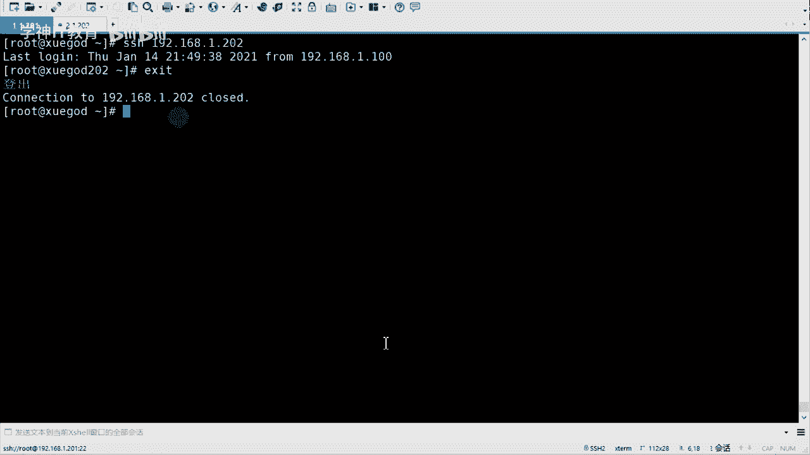

# RHCE8红帽认证课程／自学必备／云计算／rhce／Linux运维 - P3：使用fail2ban防止暴力破解 - 学神科技 - BV1L54y1S7qZ

行啊，下面的话咱们来看一下防止爆料报警啊，什么叫暴力破解是吧，暴力破解的话呢，就是你比如说有一个黑客是吧，想要去攻入你的系统，对不对，他会去找呀是吧，咱们去匹配呀，对不对，比如说默认他用的是root。

然后去去登录对吧，然后他会去呃破解密码是吧，密码的话当然可以很复杂啊是吧，然后他会去一个个试对吧，这个过程中的话就叫做poly破解好吧，又要暴力破解啊，那么呃s c h的话。

咱们可以设置它的防止暴力破解是吧，防止暴力破解啊，或者说最起码你破解我的时候不可能说那么简单就成功了，是不是我们来看一下啊，因为s s h d这个服务很重要，是因为它是远程连接的嘛。

是不是因为只有你的怎么说呢，只有你的管理员是吧，有权限去去登录的是吧，那如果说有外人登录进来之后，他可能会用你的服务器干起其他的事是吧，有的会什么挖矿呀，有的可能被当成肉鸡呀对吧。

但是这个是不是咱们要禁止这个这个这个东西的对吧，我们可以看一下啊，如果说你要防止玻璃破解啊，咱们有几个方法啊，嗯第一个密码的话要是设置的足够复杂一些啊，怎么叫复杂呢，密码的长度要大于八位啊。

小于20位是吧，因为这个方面去记忆啊，呃长度是一方面，还有就是复杂度，复杂度的话要经常有数字，大写字母和特殊符号啊混合组成，这个的话其实是四种符号啊，四种符号啊，然后这四种符号呢如果说你包含了三种的话。

那证明你就是一个比较强的密码了啊，比如说有的密码有的同学可能喜欢把密码叫这个啊，password是吧，是吧，有这么用功的吗，这是他密码，对不对，这个其实就挺强的啊，大写有了特殊字符，有了小写。

有了数字有了，对不对，哎这就是一个密码，是不是，这就是个密码对吧，当然也可以用别的是吧，也可以用别的啊，对不对，这都行啊都行，但是尽量要要复杂，就是尽可能多的去包含不一样的这个字符啊，但是字符要分范围。

就是数字，大写字母和特殊符号啊，他这么说啊，当然你可以使得很长是吧，你可以设置很长啊，如果说嗯但是太长也不好，因为太长的话，比如说你可能会接到一个文件里边儿是吧，接到文件里边的话呢。

你的文件可能被别人窃取到是吧，然后又又又又又暴露了，对不对，还有就是什么呢，还有就是你的密码呀是吧，当然有有的，比如说有很多机器密码都可以改，是可以时时改，比如每隔一个月啊，改s密码呀是吧。

这个也可以的，嗯好吧，这也可以的，嗯然后就是改端号，端号呢这个咱们刚才改过了是吧，改成其他的，改成其他的啊，对其实怎么说呢，通过密码也可以看出来啊，其实最不安全的是谁呢，是操作系统吗，是我的服务器吗。

其实是人，对不对啊，人其实才是一个最不安全的一个东西啊，有些可能如果看过一些什么电影，那个叫呃那个叫什么哎呀，这个名字忘了，就是一个黑客啊，然后什么黑进了一个什么特别厉害的组织是吧。

比如说五角大楼啊什么的啊，然后又出来的那个那个黑客不是黑，是第一步啊对吧，没有没有绝对安全的系统，对对对，那个啊玩社会工程学玩的特别溜，心理学是吧，这个人才是最不安全的一个一个部分的嗯。

对我号咱们改过了啊，然后还有就是禁止入信用户登录啊，入侵用户不允许远程登录好吧，然后可以添加普通账号，然后去登录收益root权限对吧，然后呢就是不允许密码登录啊，这个也可以是布西密，登录的话呢。

后期要设置密啊，妙对是吧，咱去来去登录好吧，来去登录啊，嗯然后咱们来做做这个实验是吧，做做实验啊，啊哎呀哇塞，今天还真的用到两台机器，那我再开一台啊，因为咱们要去测试一下啊，测试一下啊。

我这边呢去开一再开一台啊，人是最不安全的，嗯然后我简单说一说吧，嗯开两台机的话，一台是服务端，一台客户端是客户端，就是去去去连接的啊，然后咱们要生成一个密钥，对东西好吧，面对的东西啊，这个是什么呢。

这个是一对公司要好吧，是一对公私钥啊，呃公钥的话呢其实他们都叫什么密钥，公钥私钥其实你把它想象成就是一个钥匙和一把锁两个东西，公钥的话相当于是锁啊，然后一会儿咱们可以把锁传给你想去远程登录的机器。

传过去之后是吧，然后呢你现在手里边握着钥匙啊，然后你就可以开两把锁了啊，然后你就不用密码了，就这个意思好吧，它会生成一个这样的一个一个对啊，面对嗯，然后行。

然后6364这个是啊，然后我给他开的是我的是202，我有个机器是学尬的，一个是学霸的202好吧嗯然后我在哪生成妙对啊，我看啊嗯他写的64，我就在202生成吧，怎么生成的s h杠k根啊。

这个是生成密钥对啊，什么密钥对啊，直接回车就行啊，哦哦已存在是吧，那我删了吧，嗯，然后，啊然后再生成一下啊，当然这个你们不用做啊，你就直接s是杠k杠就可以了，我在这边生成了，就在那边生成，往这边可以吗。

啊这个可以行吧，直接回车就行啊，当然他会说可以选择什么加密的方式是吧，一般的话默认加密就可以啊，呃直接回车，直接回车之后呢，它会生成一个这个东西对吧，这个叫什么print finger啊，关键指纹啊。

其实它会生成两个文件啊，就是在你的呃加目录下点s a c开头的文件是吧，会有a d r c和a d r c的pob这两个文件，这个就是公钥好吧，60公钥啊，然后我把这个公钥呢传过去好吧。

传过去传过去之后呢，我就可以去无无密码的登录了好吧。

诶这是过程啊，当然过程的话我会有一些注释啊，你可以看一看是吧，这个其实直接回车就可以啊，唉然后你可以看到这个面对是吧，然后传输怎么传输呢。

s p传，就是呃指定你的文件传过去，其实它会有这个什么呢，它会有这个特定的命令去传输的啊，叫s h copy id啊，通过这个东西去传好吧，通过这组数据串啊，然后可以加个参数较高a是吧，呃也不用加。

其实也行啊，不用加其实也行啊，然后传给咱们的是192。168。1。202是吧，转过去啊，1123456好吧，这样的话呢我就把这个公钥传过来，公钥传过来之后，你在这边可以看见啊，也是点ssh下边啊。

可以看到会有个叫什么authwest case，这个是叫做已认证的k是吧，你看传出来之后，他的名字变了，把名字变了，然后我就可以直接去这个这个这个这个船了啊啊不是船了，直接登录了啊，叫s h。

然后是就一个大一点202是吧，你看直接就连上了，对不对，就不用输密码了是吧，这叫这叫一个密密钥对登录啊，对吧，然后退出过来是吧，我从学霸的远程到了学霸的202，然后又退出嗯。

这个直接登就行啊，嗯咱们笔记的话可能写的比较复杂，因为它加了一个参数是吧，加了一个更a的参数啊，这个其实可以不用加对吧，可以不用加啊，然后是什么呢，然后是这个呃。

第一次啊，如果说你第一次去传输的时候，我这有提示吗，我看啊也有提示，还是这个啊，就是说你要你要去连接吗，yes就可以，yes，完了之后呢才会让你输密码对吧，你肯定得知道它的原理密码，然后才能去登的是吧。

才能去传的啊，只要传过去之后，那么你再去远程登录是吧，那就不用密码密码了好吧，就不用密码了，这就是密码对了对吧。

这个庙对啊，然后需要注意的是，如果说你的端口不是20的话对吧，那你怎么传呢啊，你要加一个杠p这段号传过去就可以了行吧，这个也是加杠t的啊，嗯ok好吧，这个就是咱们的一个什么呢，一个一个嗯。

防止玻璃杯的方式啊，就是密码足够复杂对吧，然后等会号修改，不允许root远程登录啊，然后不让密码登录，当然其实还有其他的是吧，也可以用黑白名单，黑白名单对吧，刚才有同学提了一下啊。

什么house deny hol，稳健是吧嗯啊这个当然也可以，对不对嗯，还有像堡垒机是吧，跳板机啊，这个也可以，是不是啊，基本上反正其实方法挺多的啊，有的可能还会上一些嗯，那个那个会变那个叫啥来着。

网银那个东西叫啥叫啥来着嗯，会变验证码，那个我这个车想不起来了啊啊这这这这什么在这，反正就是那个和银行那个很像那个啊，咱们每隔几秒换一个码，每隔几秒换个码，对那个其实也有那样的啊。

但是那个那个一般是需要花钱的啊，嗯对对对，其实很多的，但是咱们这个基本上能用的，这个就ok就可以好吧就可以啊是吧，如果说你想再去那啥一点的是吧，再去严格一点，那就会有更多的方法，还有就是可以花钱嘛。

花钱可以解决大部分的问题，对不对啊，但是咱们尽量是吧，用的话还是用这种开源的，用的是自己的东西啊，好啊，包括咱们讲的服务是吧，其实也都是开源的服务，对不对行，这是用s s h d服务本身是吧。

去做这个防止暴力破解啊，嗯然后呢可以使用工具啊，还可以使用工具好吧，叫做fto b这个东西啊，这个也挺好用的是吧，叫做fban啊，然后来进行防护啊，防护啊，优点是使用简单灵活，功能强大对吧。

为什么要用它呢，是这样的啊，因为呃比如说我的服务器在被别人暴力破解，虽然他们没有成功，但是呢但是呢会导致系统负载很高，为什么会这样呢，因为你像咱咱们去登录或者暴力破解的时候啊，好吧。

然后呢它会有一个认证的过程，对不对，你的用户名密码是不是匹配的呀，对不对，服务系统啊会去这个啥的啊，系统会去这个检测的是吧，那么检测的话呢这个是需要资源资源的啊，不管你的cpu还是内存。

是不是他会去检查对吧，那一个两个无所谓是吧，如果有多个的话，或者持久的话，那它会消耗你的系统资源，增加额外的开销是吧，导致你的公司的网站就访问不畅对吧，因为你的系统都跑不起来了是吧是吧。

然后你的网站可能也运行不起来嘛，对不对，所以说这时候可以使用qu b这个图片可以监视你的系统日志，然后呢匹配是错误信息，执行相应的屏蔽动作啊，然后他会去设置策略，比如说我允许你来连接我。

或者允许你错误的连接，就是密码不对啊，几次之后如果说还不对，那我就会阻止你，让你停一停吧，停停啊，歇一歇是吧，然后如果是外人，如果是坏人的话，那你就停停一会儿，停一会儿再不对，那你再停一会儿是吧。

这个时间可以设置的好吧，哎加入了防火墙，让他，然后让他去干嘛呢，然后让他去那个那个暂停访问好，暂停访问啊，对吧就是fu盘啊，其实有一个和它很像的叫也有一个和它很像的啊，叫那个host啥来着。

也是个工具啊，其实它很像，但是pu图片的话其实它更强大，因为pu的话它不单单是可以保护咱们的s s h d的，还可以保护一些其他的一些服务都可以是吧，都可以啊，嗯然后的话咱们就可以装一下。

装一下这个fb，他这个的话要求p python版本要大于2。4啊，这个一般的话都是大于的。

放大v是吧，看一下啊，这是2。7的，没问题啊，然后呢就可以直接去压门安装了好吧，因为咱们配了什么网络源，一源都配好了，那么fil主办的话就在这个1p园里边啊，直接装就可以了，你看是吧。

也没几个包啊，这是三个四个是吧，四个包装好了好吧。

直接装就ok啊，衣服会员咱们刚才一开始就配好了是吧，如果你没配好的话，你在这儿也要去配一下好吧，应该配一下啊，嗯它有几个几个文件是吧，几个文件啊，主要的话就是这个叫只有点cf，主要就是它只有点亢奋啊。

这个是什么呢，这个是呃是咱们策略的好吧，这也是咱们策略啊，就是可以去阻止啊是吧，阻止多长时间呀是吧，错多少次啊，在这可以去设置好吧，在这可以设置啊啊这些这些可以不看好这一个就行了，这个是最主要的好吧。

它会在etc etc下面会去产生这些文件啊。

etc下的叫few to b，在这呢好吧，在这在这是吧。

主要就是他好吧，主要就是他啊，ok然后咱们设置个什么策略呢，嗯咱们可以先想好啊，先想好啊，比如说我让它怎样呢，我让它在三五分钟吧是吧，五分钟之内，如果说三次密码验证失败。

那么我就禁止这个用户ip访问一小时，就是一小时，是认你是不是连我的好吧，一小时之后，然后去自动解除啊，然后用户的话可以重新登录，如果你再错的话，那你就再等一小时好吧，再等一个小时啊，好吧嗯。

然后这个动作文件和日志匹配文件啊，这个不用做任何修改，看到没有，不用做星星和修改啊，所以说你不用动它啊，所主要做的就是这个jail cf，主要就是他啊。

然后启动s s d服务的日志分析水晶动作阈值就可以啊，你给他设置一个值，设置一个范范围是吧，哎如果他超过了，那就禁止它好吧，就禁止上就可以了好吧就可以了啊。

那咱们来看一下啊，设置一下etc field半下的叫做只有点co呃，这个的话咱们找一下，找一下s s h d，我看它在哪啊，哦在这儿就是这个就是这个啊，在这里面去设置好吧，这里面去设置啊。

然后还有别的地方吧，啊就这个，然后咱们可以简单看看他还有其他的一些服务，他支持其他服务的嗯，你看h t t p的服务是吧，它也可以保护啊，当然目前咱们不会涉及到嗯阿帕奇的是吧，是多少阿帕奇的。

呃n g x是吧，它也可以保护啊，但是咱们现在就是他s h的一个保护行吧，就可以了啊，就可以了，然后下面咱们去添加一些配置啊，这个配置的话需要咱们去添加的啊，那需要咱们去干什么呢，需要咱们去写一下啊。

加一些配置，然后加的比较多是吧，然后我就直接给他复制过来了，从这个s s h d是吧，这个模块啊，下面的bend后边去加enabled true啊，就是鼠标启用后边会有这个提示的啊，就是那个注释的啊。

filter啊，什么策略，s s h的策略action啊，动作加入到防火墙对吧，这个方向他用的是ip tx啊，然后cmo啊，要不要发送邮件是吧，这个其实对吧，这个其实可以不用发，也可以发。

你可以发给你能收到的邮箱也行啊，然后lang pass log plus呢是它的日志文件好吧，日志文件日志文件呢这个是咱们外向log，现在cure啊，这个是咱们s s h d服务的日志文件。

我们可以看一下这个，log下的啊，然后secure好吧，log的话就是存放咱们日志的，一般对不对，然后secure的话呢是针对s s h d服务的啊，它不叫s s h d。log啊。

这个需要注意一下是吧，因为有的同学可能认为认为一般就是点log呗是吧，但是其实不是的啊，然后他就cure可以可以简单看一下吧，就是to吧，还有那个那个那个，n20 ，它会记录下来。

就是你你s h的一些操作啊，不管成功还是失败是吧，它会记录的啊，嗯receive disconnect就是取消链接啊，表示取消链接的，登录的话是accept accepted的。

public key for root from一点201，然后端口，然后s h过来的就是他接收了一个公公钥是吧，然后去去登录过来啊，登陆过来啊啊等等的吧。

这个地方是accepted password啊，结束了一个密码，然后登录过来的是吧，但是成功的啊，如果不成功的话，它会提示什么error啊啊或者field啊，相关的关键字好吧，相关的关键字啊。

呃其实这个fiba他也是监听的这个日志是吧。

就是他看看有没有那个那个报错是吧，有没有错误啊，然后把这个写一下吧，然后配置啊。

好了，pass下面的话是比较主要的，下边，这个怎么给我注释掉了呀，我把它放开啊，这个叫bt是bt，bt的话代表是禁止时间，如果说他没有成功是吧，没有登录成功，那就禁止3600的话，代表是秒啊。

3600秒啊，就是这个这个一小时是吧，一小时啊，然后新版本的话应该支持那种小时的方式，就是1h啊，都是m分钟它都支持啊，你可以试一下啊，然后翻time的300，这个是秒，这个是五分钟是吧。

就是在五分钟之内，它会让你最多尝试max trap，最多尝试这是三次是吧，三次密码失败之后，那就那就会静止一小时好吧，就这个意思啊，这个意思啊行，那咱们下来之后呢，呃启动一下它让它生效是吧。

启动一下这个服务啊，start一下fib对吧，然后c掉enable一下啊，feel fb，ok然后咱们来试一试吧，来试一试啊，比如这边的话呢，我去登录一下啊，s h一点2。1的，8。1。201是吧。

然后我输错故意的啊，嗯三次了，对不对，然后我去连接啊，我写的是三次吗，还是五次，再试一下啊，嗯等会啊，刚才是因为什么呢，刚才是因为配置文件里面是有注释啊，然后我给他删掉了，e d c呃，图案只有对吧。

刚才是因为后边有好多这个注释的，删掉它就可以了行吧，然后呃你的配置边里边的话会去，如果说呃错的多的话是吧，就是五分钟错三次啊，它会有一些field这样的关键字对吧，field关键字的话呢。

他会去检索检索到，如果到达一定次数，比如说就是三次或者更多是吧，那它就不能连接我们连接的话，最后最后的结果就是说他会直接拒绝你，他不会再给你输密码的机会了对吧，所以你看这就直接refused，对不对。

直接resu啊，这个你只能等着了好吧，等一小时再再再再去那啥啊，再去尝试，当然咱们可以通过ipados去看啊，防火墙去看，是吧，会有一个叫f two b s h这样的一个呃这样一个策略是吧。

在这儿啊就不就不行了是吧。

就不行了啊，这个这个这个是注释啊，这个需要注意，后期你们做的时候不要加这个东西啊是吧，不加这个啊，然后下面是咱们的规则，ok啊规则，然后去连接的话，故意输错三次以后啊，直接就refuse好吧。

直接就拒绝你，嗯嗯然后动漫ptbox你也可以看见是吧，你也可以看见啊。

好然后还可以怎样看呢，还可以通过fb去看fib few to be啊，这个这个叫lt啊，theus，状态啊，它会提示说呃这有啊，就是你的那个拒绝里面有有几个啊，然后具体去看的话呢就可以加呃status。

然后s s h d去看好吧，然后他会说总共feel了多少次，总共feel的话呢是15次对吧，失败15次啊，然后当前进用的是一个currently bendy，是一个total bed，总共禁止的是一个。

然后ip地址是差，对不对，当然如果有多的话，它会有多个ip地址给你显示出来的啊，给你列出来好吧。

就是图片去看，就是你能看到是谁在是吧，是谁在暴力破解你，对不对，暴力破解你啊，嗯然后在这儿在这儿再看一下啊，在这儿再看一下，需要注意的两点，我直接把它拿过来吧，需要注意点啊。

然后如果说后期需要把ip table的星空或重启的话啊，然后也需要把水煮饭重启一下啊，如果修改这个ssh端口的话是吧，所有图案来监控s是需要修改配置文件是吧。

需要改配置文件啊，就是这个dio点康复，他也有part啊，action这个地方action这个地方啊，p就是之前是什么炮，等于s h是吧，你们得改成你改后的端口号就可以了对吧。

然后重启对吧，然后重启就可以了啊，然后还可以从黑名单中去移除i p啊，这端client fs i c h d m band i p bi p是吧，就是把谁移除掉是吧，咱们可以试一试啊，这可以试一试啊。

移除我是1。20。

202，对不对，1。202，1。二点，然后呢我再去连接，你看也就可以了对吧就可以了好吧。

