# RHCE8红帽认证课程／自学必备／云计算／rhce／Linux运维 - P4：ssh升级 - 学神科技 - BV1L54y1S7qZ

行吧，最后咱们来看一下升级s h啊，如何去升级s h对吧，s t h是安全协议对吧，s s h t的话呢是咱们的这个呃服务对不对，然后呢呃它他呢他们他的话呢是通过open s这个包去生成的是吧。

然后呃不管你什么包生成的对不对，它都会有相同版本啊，版本的话有的时候可能会比较低啊，或者说有的人会爆出来漏洞是吧，有漏洞之后的话，咱们就需要去升级，然后去这个补充这个漏洞是吧。

有的可能有同学知道一些什么，那叫什么来着，那叫嗯漏勺是吧，还有什么等保之类的，对不对啊，他们就是干这个的啊，看看你的系统是不是安全的呀，对不对，他发现你的版本比较低，有漏洞之后。

它会提示你说让你去升级之类的对吧，像这种啊，还有一些像这个嗯云主机啊，阿里的，我记得啊，阿里的话它就会提示你，比如说有些问题上，他会提示你说让你升级啊，还是干嘛的，对不对，就这个东西啊。

s h服务用于远程连接服务器，如果s h服务存在漏洞，那么黑客就可以通过这个漏洞去控制你，他甚至都不用密码了对吧，然后啪就进来了，很快是吧，啪就进来了，所以说咱们要经常的去去这个呃升个级。

或者说去这个这个呃查看一些漏洞啊，有没有这个你的版本的一个漏洞，好不好，像这种是吧，我们s h的漏洞，这都是我们s h的啊是吧嗯。

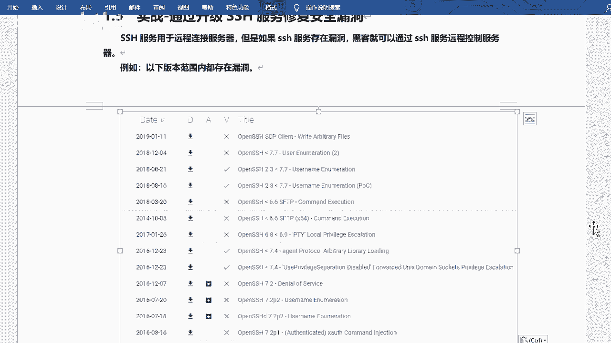

但是目前咱们这个版本的话呢，那可以看一下啊，啊open ssh杠v吧，嗯诶抗大v，嗯那就是version，哎我去他他他没有提示吗，v啊那就那么看吧，rpm杠q a是吧，rap一下。

open s n h h，是吧，这个我是7。4的啊，这是我是7。4的啊，然后嗯咱们可以升级一些更高的版本是吧。

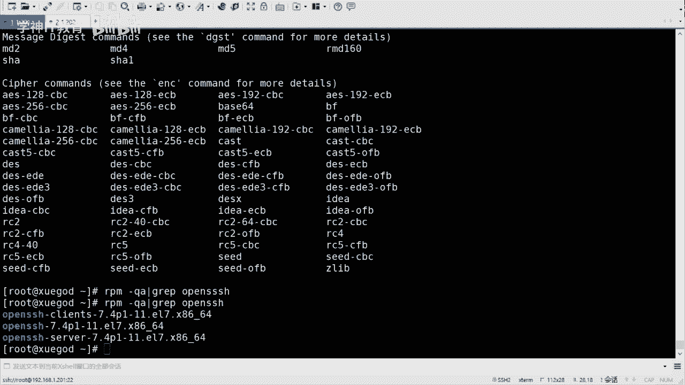

更高的版本啊，啊我在这儿呢有一个版本啊，呃当然这个可以通过样本的方式去升级也是可以的啊，update是吧，升级对不对，但是这个呢你不用指定版本是吧，不是这个版本啊。

然后咱们可以指定版本后边要么升级其实也挺方便啊，但是不是那个这个版本是吧，然后我先说这个样本的方式好吧，先说样本的方式啊，这是原版的是吧，嗯样本的话用这个方式其实就就就可以了是吧，直接可以升级啊。

但是你控制个版本是吧，咱们可以用原版的话控制这个版本啊，呃原版的话呢，如果说你要升级啊，一定要注意什么呢，一定要注意你要开启tnt对吧，开启time net啊，然后配置备用连接方式。

tnet防止配置失败，不能连接服务器的一个过程，还有就是配置过程中呢，咱们也是用tnet去做配置的是吧，因为你比方说你把它删了，然后再装是吧，你s h就连不上了呀是吧，所以说咱们用太阳电，然后装的话呢。

呃要去装上这个tnt。

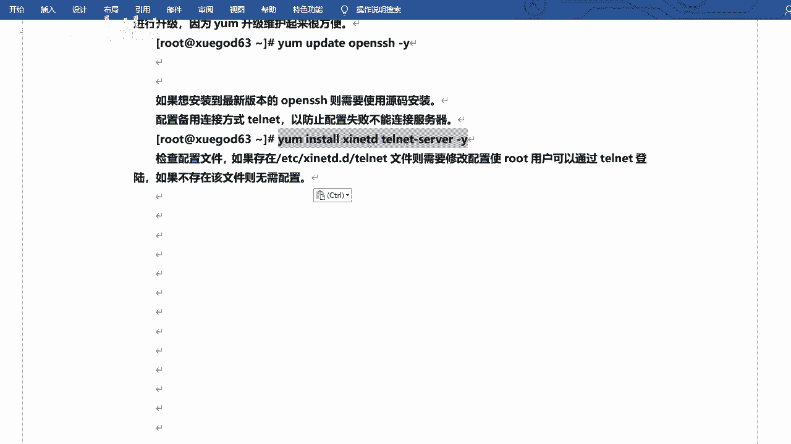

把这个服务装一下啊，嗯，嗯叫做一个是新建d，一个是tnt啊，这个装一下，新天地的话叫守护进程好吧，他会去管理一些比较简单的这个这个服务啊，在这的话就给他去管理啊，然后完了之后呢，咱们可以看一下啊。

btc下的叫做新net d。d下的tnt啊，没有这个文件是吧，没有这个文件啊，没有这个文件的话，咱们咱们去这个，我看这个需要写吗，现在应该不用写了，因为之前你像那个叫什么来着，那个那个七之前吧。

就六吧是吧，六的话你像这个tnt还有叫r3 c啊，123c吧啊对对对对吧，这两个服务它都是归新建的地瓜的，这个账号也扩一下啊，说说这个历史是吧，通过它去管理的啊，然后它会有配置文件，然后是不允许啊是吧。

是不是拒绝啊之类的啊，呃在七的话呢它就独立了啊，就不用去那啥了啊，不用去设置这个tnt了啊，啊不用去设置这个这个配置文件啊。

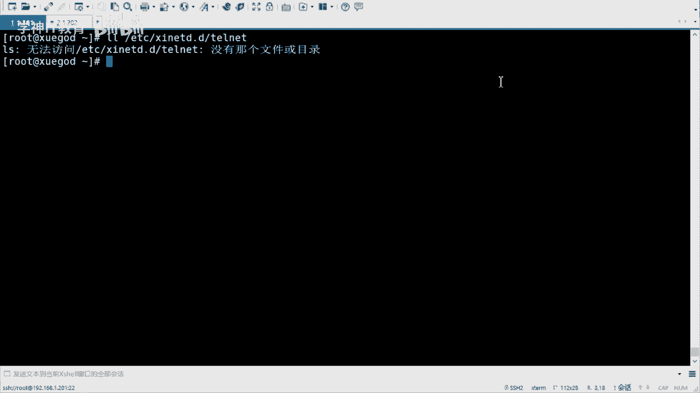

你看如果说存在这个配置文件好吧，那么你需要去修改，如果不不存在的话，就不用配置了，好吧就简单了很多啊，以前如果说你真的存在是吧，它里边有个配置啊，就是把disable等于no改成yes。

就启用它就可以行吧。

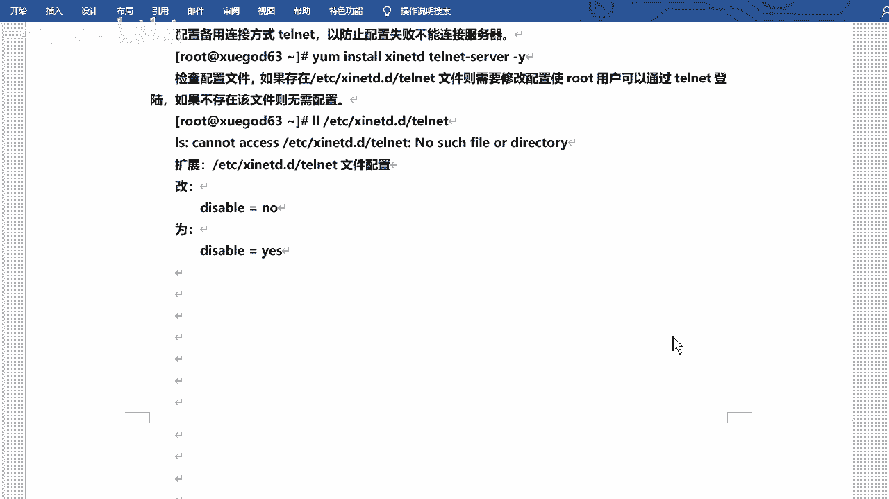

启动它就可以了，然后呢，但是咱们必须得改一个配置，就是这个配置啊，呃e t c下的叫做security security security t t y这个东西啊，然后，试试吧，对然后在最后啊添加什么呢。

添加咱们的这个东西啊，叫p t s是吧，p t s啊，p t s的话叫虚拟终端是吧，虚拟终端啊，然后加上这个这几个啊，这几个p t s0123 这几个好吧，这个叫什么security p t t v啊。

就是一个tale net登录的终端类型啊，要添加那个p t s终端，就是远程连接嘛是吧，远程连接终端啊，ps动态，0123的话就是通过这个这个叫什么，就是远程连接的方式啊，可以连上这个tnet。

好连上tnet嗯，写完之后保存退出啊，然后我给他启动一下啊，在咱们这票啊，start是吧，新建的力，这个其实毒气也行啊，但是还是起一下吧，因为ta现在独立出来的，然后再把那个tnt记一下。

start town town net，点socket啊，它的它的名字叫socket好吧，就不点service了啊，所以说你要你要其他是吧。

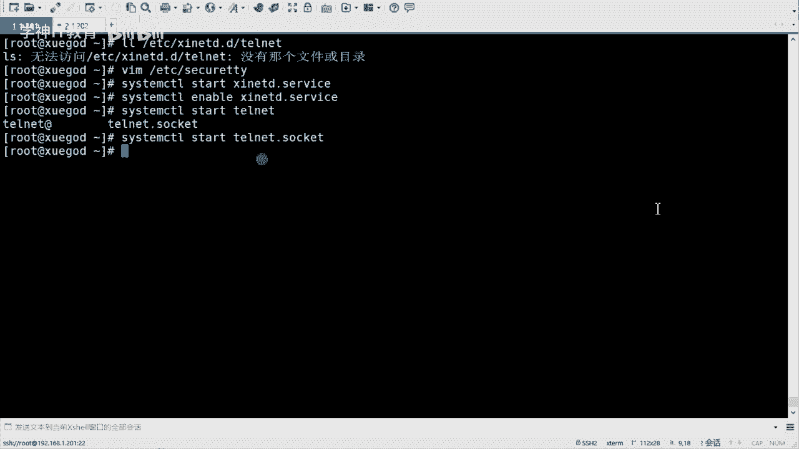

你要其他啊，嗯这是咱们需要改的，这咱们需要改的，ok然后呢我用tag的方式呢把它连过来行吧。

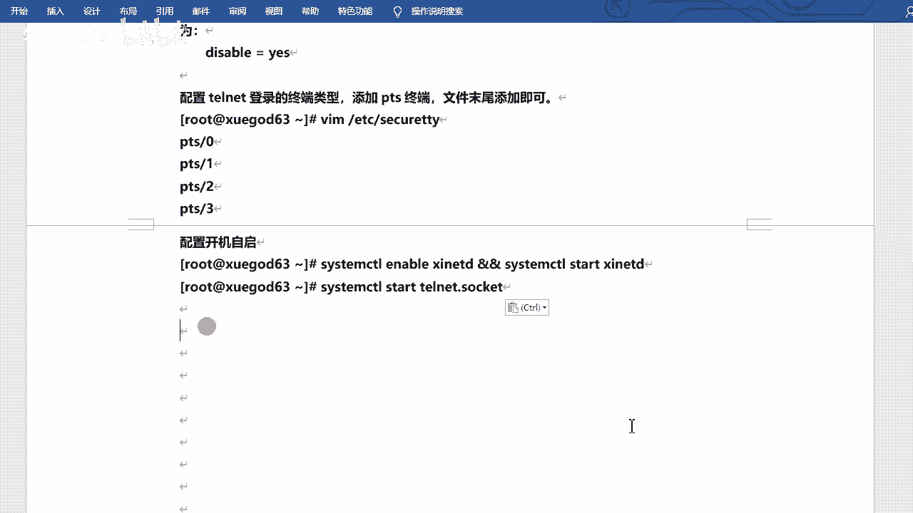

天债的方式连过来啊，嗯通过插shell就可以啊，叉shell的话，它支持这个这个我看我这之前有吗，好我这有一个啊，咱们看看，tnt的方式去连接啊，那么协议的话呢就不是s h了好吧，就叫做tnt啊。

tynet啊，然后呢主机还是这个主机端口号呢是23跳。

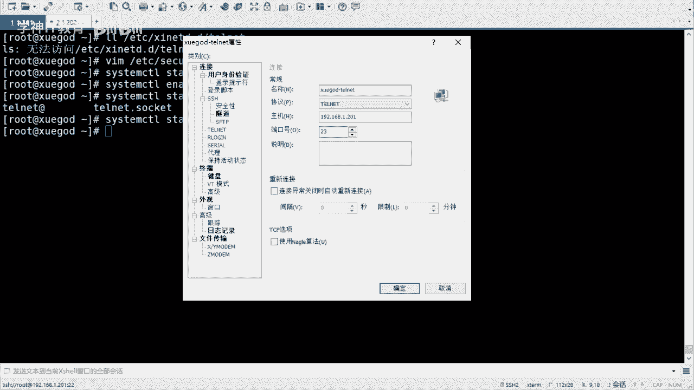

这个断口是23啊，然后确定连接一下就可以了，然后学glov是吧，嗯是这个入密码是123456好吧，你看它也可以连过来是吧，这还有欢迎光临呢，看到没有，还有欢迎光临的啊，对不对。

这个的方式呢是ta的方式去连接的好吧，这不是sc啊，但是你也可以去操作对吧。

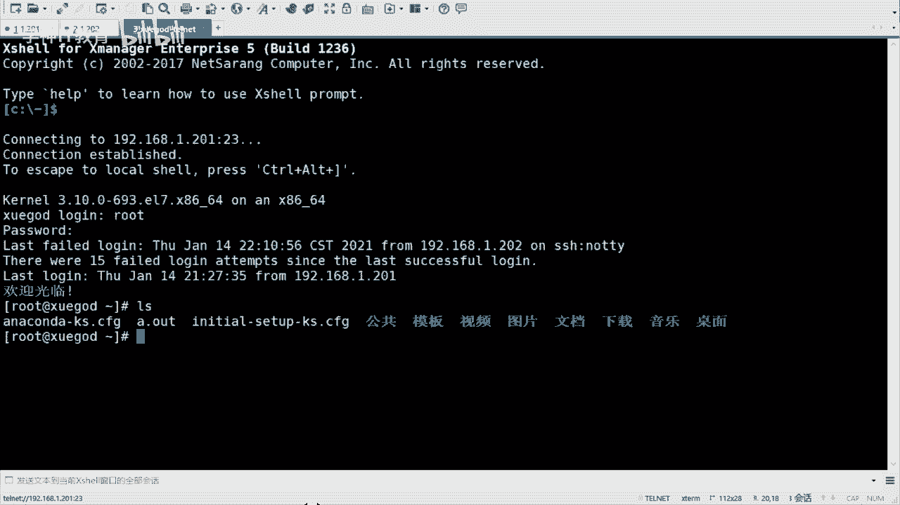

你可以操作，那么下面咱们开始去升级好吧，开始去升级啊。

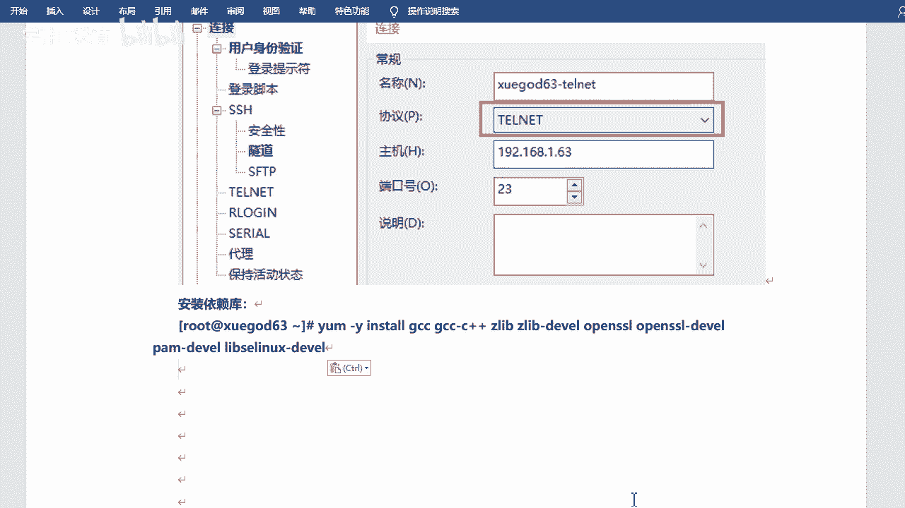

o啊升级啊，咱们先去安装依赖包，升级它的依赖包啊啊当然这个包比较多是吧，这个你也不用记啊，你就直接用就可以了，什么g c c啊，什么g c加加呀，我们下乡啊是吧，什么pm dl啊，这样的包啊。

直接去升级一下，升级完之后呢，去上传咱们的open ssg的主播是吧，这个主播在在这儿啊。

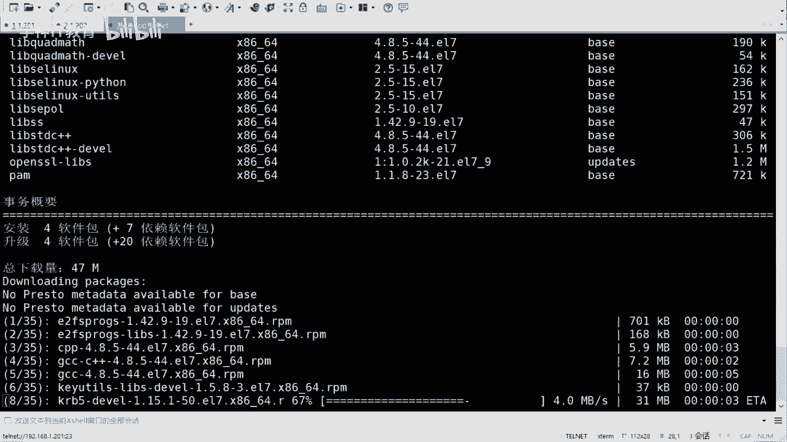

我给大家传一下好吧，再传过来传过来，直接拽过来就可以了是吧，当然你需要注意的是，我这个是用x v tp是吧，你需要用c c制的方式去点开啊。

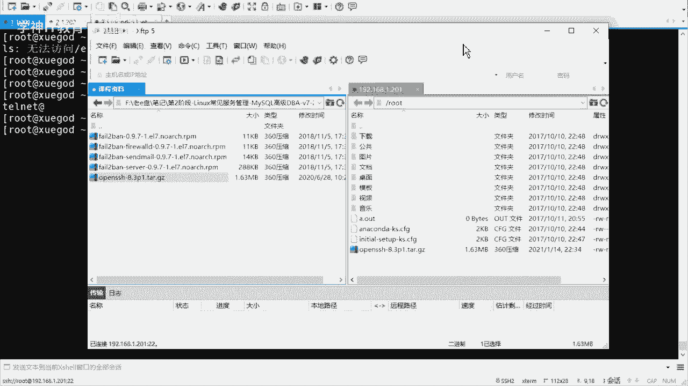

就在这点采用点他演不出来啊。

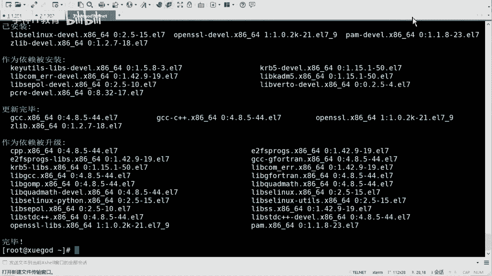

点出来之后它它是连不上的。

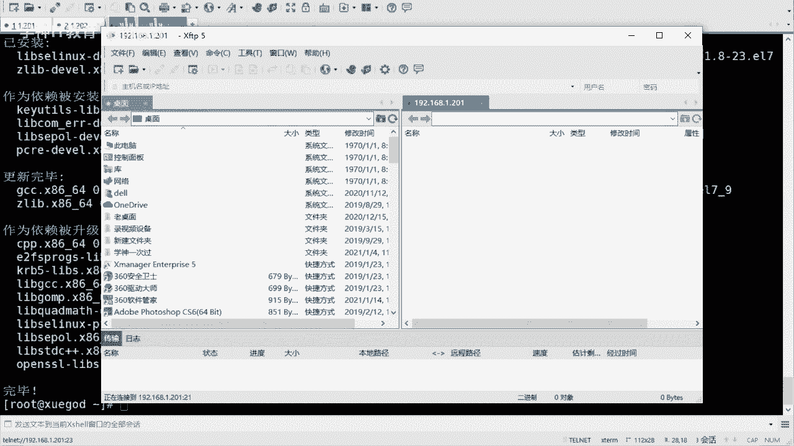

你看这把连不上啊，行等啊啊，当然我这个是给大家直接直接那个那个给大家的啊。

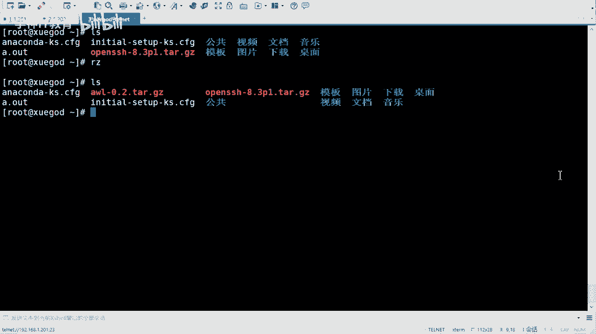

一个一个一个包是吧，然后你也可以下载好不，我这有下载地址啊，你可以下载，是吧，下载这个包啊，对然后好，那咱们开始工作吧是吧嗯先备份先干什么，先备份现有的s c h的配置文件好吧，然后给它创建一个目录。

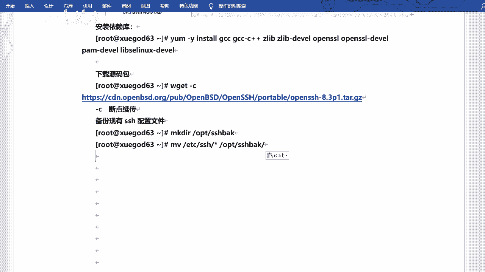

然后给它移过来啊，咱们这个操作还是挑战的方式操作的啊，创建一个目录啊，就是op t下的s h back吧，然后把etc下的叫做fc之下的所有的配置文件。

一到o p t下的bass是back这个目录来好吧，移动过来啊，移动过来之后呢，呃我去mc dr创建一下user local下的s h d，创建一个这样的目录啊，然后把它装的时候装在这，装在这啊。

当然我这个地方是移动是吧，其实也必须是移动，因为你去复制啥的话，哎我复制行不行啊，其实也可以，但是后期它生成的新的文件它不能覆盖理解吧，就是他用的可能还是你之前的配置文件，但是可能不通用是吧。

所以说你就直接移动啊，这个不用怕，直接移动就可以了好吧，然后我去装一下啊，tx解一下咱们的sc是3。8，比如把它解压到8。3啊，sorry，解压到u的local，下载3。3源码下过来，然后切过去，是吧。

这就是它的原码啊，啊当时很长是吧，很长啊，然后咱们去什么配置啊对吧，什么编译安装啊，就开始了啊，就开始了啊，嗯这个的话呢需要加一些参数好吧，加一些参数啊，配置的时候啊，用的什么md password啊。

用pm啊，用s0 in x，然后privy什么sg pass，这是咱们的呃新的游走logo下的s s s d是吧，这是咱们新的目录啊，然后呢config目录呢还是etc的s h的一个目录。

就是它会把新的配置文件还是放到a t c s h这个笑啊去配置一下啊。

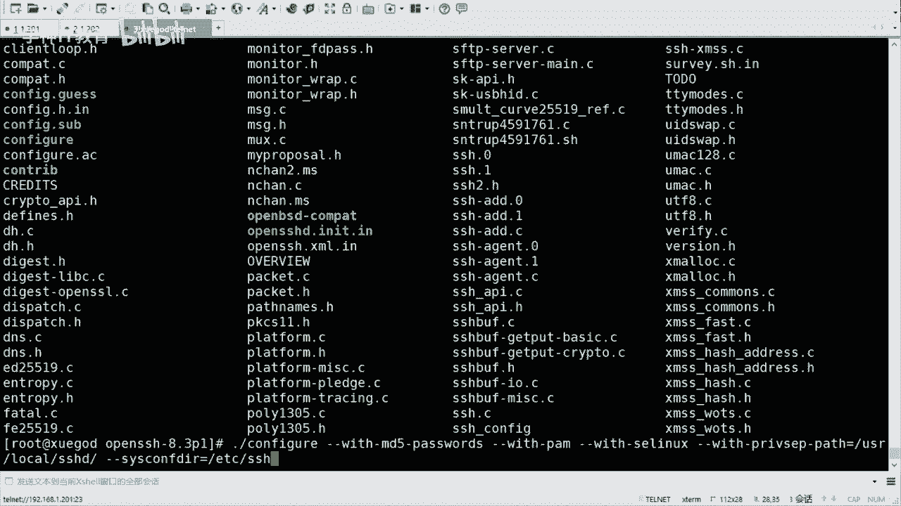

然后让他去装一下啊，嗯，这个不用着急啊，等他一会儿就可以了是吧，这也是源码安装嘛对吧，源码安装，好然后成功了是吧，成功了啊，ok然后说什么pm is abled啊。

你也许需要去装一个pm control pfs s d啊，对不对，你看什么country b这个目录下的什么sub discreet districtory这个目录啊。

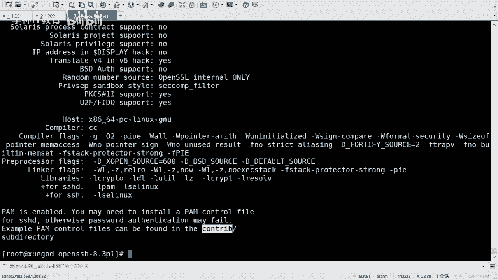

这个需要咱们拷贝一下就可以，拷贝一下就可以了，就是它会有一个温馨提示是吧，我们先提示啊，然后把它拷贝过去就可以了，这个提示是吧。

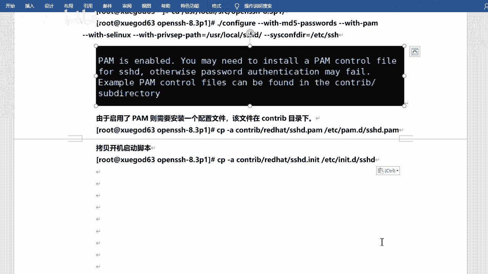

拷贝一下cp一下cp高a啊，ctrl b下的叫做red hat下的s是d拷到etc下的time点，地下的叫做s s h d呃s h d。time，好吧给他拷过去啊，这是pm文件啊。

这个这个你只考就可以啊，然后呢开机启动脚本啊，也是在country b下的，叫做red hat下的s s h d。i n t啊，这是就是启动文件启动文件啊，考到a t c下的n t。d以下的啊。

s s h d是吧，启用脚本啊，启用脚本啊，拷过来拷过来之后呢，我可以去编译啊，make是吧，然后and make install安装是吧，然后去执行就可以了啊，嗯完成之后的话呢。

咱们去修改一下配置文件啊，嗯e t c下载s h s h d那个啊，这个是新的配置文件啊，新的配置文件，然后呢第32行有一个叫permit root login啊，什么什么password，这个是吧。

然后咱们给它给它改成yes啊，好改成yes啊，就是允许路选择入土用户选程登录啊啊然后还有一个37号，这个37啊，这个给它去掉，叫plicate ocation，yes是吧。

tk就是就是那个那个那个公钥是公告登录啊，还有是use ds，这个可能比较远啊，这98行柚子d啊，no是吧，就是不用点s啊，这几个配置好吧，咱们给他放开一下啊，然后呢去，然后呢去设置一下，叫做配置。

开机自启动啊，叫做check bag，刚刚add添加一下s h e嗯，然后c怎么叫nebo s s c h d，是吧，然后他有一个原来的开机项好吧，原来的开机箱啊，嗯可以把它移走吧。

在user lab下的assistant地下的system啊，叫做s s h d，这是service是吧，就是它的启动也是它的启动启动文件啊，然后把它移到o p t下的叫做s back，你给它移过去啊。

然后check v一个ssd啊是吧，设施启动啊，就是就是还是enable是吧，还是enable，ok然后呢我重启一下s s s d啊，咱们用这个方式啊，e d c a a t点地下的s s h d嗯。

restart，重新上好吧嗯重建完之后看看有没有被监听啊，not s，22是吧，已经在监听了啊，重启一下啊，然后可以去什么启动停止就可以啊，所以咱们就叫stop嗯，s s e d是吧，给它停一下。

然后提起来，还是支持一种方式的啊，嗯完了之后呢，s h杠大v们看一下是吧，他现在是不是变成8。3了对吧，大概三了，那么这边的话呢，当然这边他没有停啊，然后s h正好大会是吧，还是7。4，对不对，还是7。

4啊，你比如说我再连一下啊，我再连一下啊，我在a。一下201，你看它会它会出现这个东西，什么东西呢，就是说呃词接受此主机密码啊对吧，它都不认识密码了，看到没有，不是密码了，然后我接受介绍完了之后呢。

这是新的新的通过s c h的链接，s h h刚大v是吧，你看你是8。3的对吧。

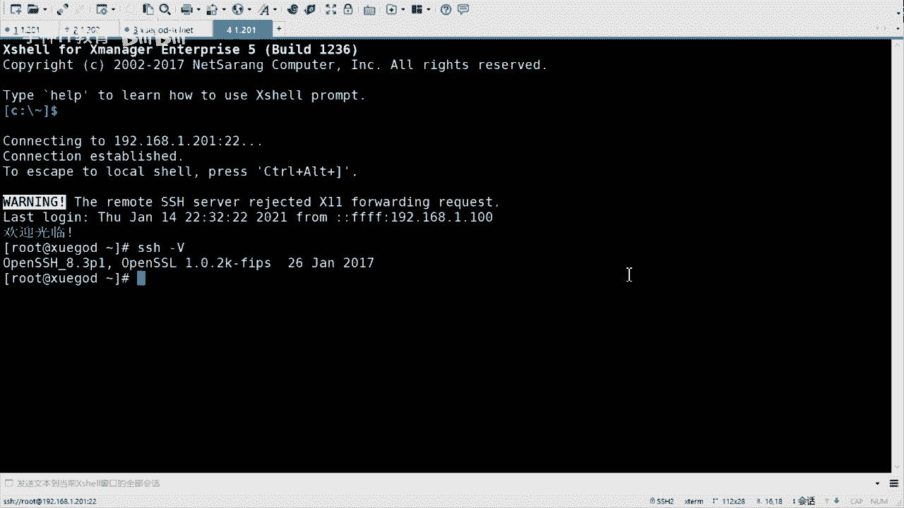

这样的话就就升级成功了啊，对操作的话呢可能稍微复杂一些，对不对啊，当然这个好处就是说你可以指定版本啊，你可以用，你可以升级到别的版本，这个也可以的，85是吧，86%对吧，嗯也可以的啊，因为要么装的话。

他可能只会去装你的那个什么呢，只会去找你的那个当前的圆里面的最新的版本是不能指定啊。

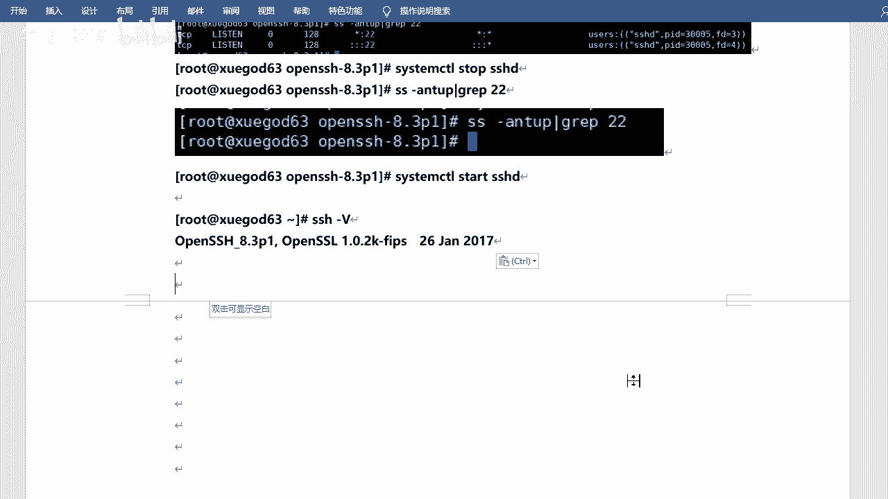

嗯但是这个做完之后需要注意一下啊，这个做完之后呢，咱们把s啊，不是把那个tnt的服务给它停掉啊，不让它不允许tnt在登录了啊，因为咱们还是用的是这个s h好吧。

还是用哪个s h a system gpl啊，然后stop是吧，卸磨杀驴是吧，人家好不容易给你升级成功了，你不就不用人家了，但是没办法是吧，因为这个tt确实不安全，直接给它关掉。

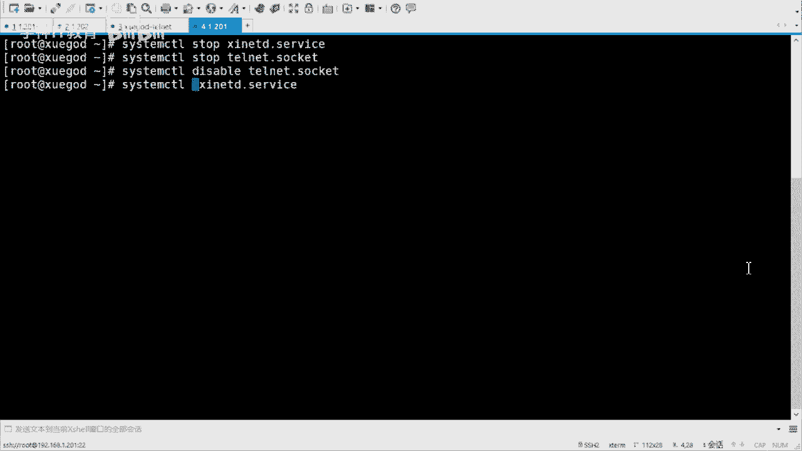

是吧，这样就可以了啊，哎那咱们还是用s h链接行吧，过河拆桥卸磨杀驴行，然后咱们来总结一下，这个可能比较繁琐是吧，然后按照步骤一步一步来就行啊，好吧嗯，反正就挺顺利的是吧，直接就装好了啊。

好然后咱们来总结一下啊，今天东西挺多的，是不是嗯，首先咱们认识了这个服务是吧，然后呢要准备相应的环境啊，什么s7 的环境啊，最好现在最好就搭就是装两个虚拟机啊，然后最好三个。

因为后面也会用到三个的情况啊，嗯然后认识了s h是吧，s h d的服务，s h的命令啊，它的配置和管理是吧，有一些参数啊，然后防止暴力破解对吧，然后升级好不好，升级啊。

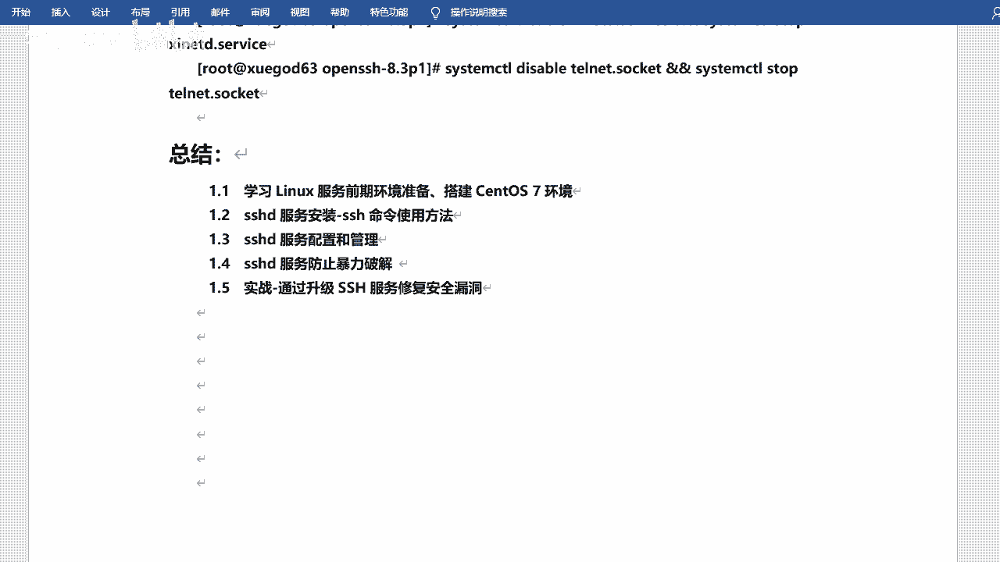