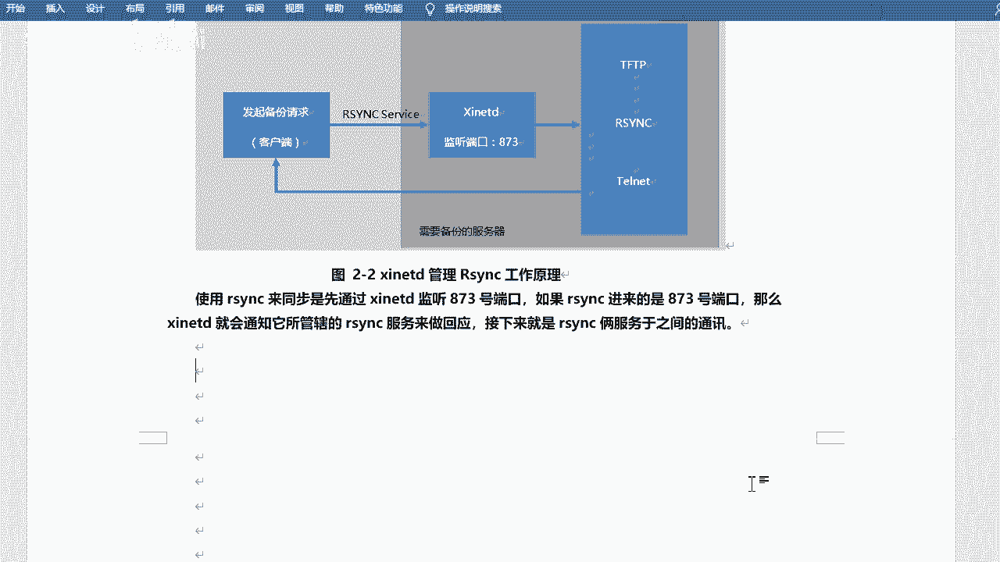
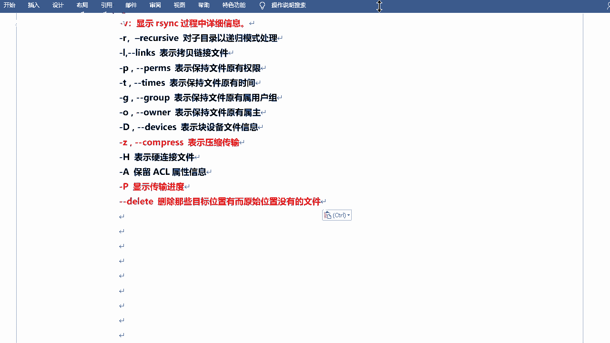

# RHCE8红帽认证课程／自学必备／云计算／rhce／Linux运维 - P5：rsync介绍-同步单个目录 - 学神科技 - BV1L54y1S7qZ

来啊今天是咱们的第二章是第二章第二章啊，呃23c加sic实现数据的实时同步好吧，嗯也叫做备份是吧，同步也是备份啊，呃首先咱们认识一下什么是r3 c是吧，然后如何去安装啊。

包括3c加sdk实现实时同步是吧，啊包括咱们后边的实战啊，啊通过s 15 s h进行r3 c的数据备份啊，13c服务进行数据备份，呃然后实时同步是吧，这个是今天的内容好吧，还是还是挺多的是吧。

还是挺多的啊，呃咱们先认识123c好吧，看一下它它呢就是做这个什么呢，做这个同步的好吧，懂不懂，然后它可以是当成命令去使用啊，然后也可以是当成服务器使用行吧，咱们今天这两种方式都会去讲的啊，好看一下啊。

嗯r c c的话呢是linux系统下的数据镜像备份工具啊，使用快速增量备份工具remote s n c可以远程同步啊，呃remote sn c就是2s n c好吧，相当于一个缩写啊。

remote就是远程的意思是吧，远程同步啊，可以在不同主机之间进行同步，可以实现全量备份和增量备份啊，就是完全备份和增量备份啊，不可以保持链接和权限啊，就是你文件的啊传入前进行压缩啊。

因此非常适合用于呃架构其实是备份或d备份等应用啊，这个它是可以的好吧它是可以的啊，这个是r3 c是吧，其实呃还有一个单独命令叫s n z啊。

不知道你们有没有敲过啊，叫s n z是吧，这也是个命令，对不对，这也是个命令啊，这个呢是把你内存中的数据同步到硬盘的是吧，比如说你内存里面的信息啊，数据还没写到硬盘的话啊，你可以手动去同步啊。

同手动去写入啊，呃23c的话呢，他就是去做这个备份和同步的好吧，然后呃当然了，其实嗯除了23c是吧，咱们上一节课啊，也提这个命令，s p啊，呃sp的话呢他也是可以去备份的，是不是也是可以去传输的啊。

对不对啊，但是呢呃肯定r3 c会比c p要好很多啊，首先sp的话无法去备份大量的数据啊，类似于windows的复制啊，它就是一个拷贝的功能，对不对，当然了，他也可以去拷贝到远程主机是吧，这个是可以的啊。

对吧，而r c c的话呢可以边复制边统计边比较，是不是它是一个专业的，就是专门去做这个同步的好吧，专门去做同步的啊，这是简单的一个比较，然后更多的话就是这个啊r s n c。

在这啊哎呀这个格式有点不一样啊，行这样，因为这个格式咱们还是统一比较好看一些是吧，这样啊，呃它有什么特点呢，它可以去镜像保存整个目录树和文件系统对吧，就是它可以去同步整个目录啊。

然后可以很容易地做到保持原来文件的属性，权限时间，软件链接等等啊，这个它可以去帮你去保持呃，无需特殊权限即可安装啊，就直接装就可以了，快速第一次同步的时候，r3 n c复制全部内容。

但在下一次只传输修改过的文件是吧，也叫做那个增量备份是吧，就这个啊，呃压缩传输r c c在传输数据的过程中，可以实时实行压缩及挤压缩操作，因此可以使用更少的这个带宽是吧，这个其实是他在传输前去做的。

而不是说一边传输一边去压缩的啊，然后按键镜啊可以使用呃，s p s s是等方式传输文件啊，其实他走的这个协议是吧，其实还是s s是协议的啊，当然也可以通过直接socket连接啊。

选择性的保持for连接连接啊，和这个就一样了好吧，和这个就一样了啊是吧，这是r3 c的特点，对不对，它的作用就是去做这个备份的好吧，可以去备份咱们的这个数据，是不是把你的文件呀对吧。

你的目录呀啊你目录下面的所有的数据啊是吧，他都可以去同步的好吧，那r4 c的话呢，它支持两种备份的方式，叫做完全备份和差异备份，是吧啊，不是啊，增量备份啊，我们可以来看一看啊，嗯在这咱们有写是吧。

它只是这种方式的啊，呃简单来看一看是吧，简单来看一看啊，完全备份这个比较好理解，就是完全备份的话，他会去备份所有的数据好吧，它会备份所有的数据啊，那差异备份的话呢。

每一次备份和第一次完全备份相比较的差异的这个数据啊，这叫差异差异备份对吧，就是他每一次的分他会和第一次去做这个对比，你看这个看那个图啊，这是原始数据，然后去备份对吧，然后原始数据第二天新增的啊。

这是第一次差异备份对吧，然后原始数据第二天和第三天新增的，他又去备份一下，相当于第一天备份呢，他又备份了一次是吧，然后唉这样去累加的好吧，这叫差异备份啊，然后增量备份的话呢是这个除第一次备份以外。

每次都只备份增长的数据啊，原始数据备份是吧，呃第二天新增的呢他只会去同步第二天新增的是吧，第三天新增的呢他只会去同步第三天新增的好吧，这是这是几个备份方式啊，什么完全备份差异备份和增量备份对吧。

23c的话呢，这支持这种啊，叫增量备份对吧，就这种增量备份好吧，就是你有不同的话是吧，他会去给你去同步啊，都可以通过它对比的话，是你上一次的一个一个备份的过程，好吧好吧，这个知道就可以了是吧。

这是几个备份的方式的一个一个一个对比吧是吧，一个对比啊，ok然后咱们来使用它一下是吧，使用它一下啊，呃今天的课程咱们会用到两台机器啊，一台是备份端啊，一台是这个原端是吧。

就是你要把你的数据被分到哪儿去好吧，这是两台机器啊，来咱们来看一下，sc，呃它的运行模式和端口是吧，呃它使用的是cs模式，客户端服务器的模式啊，实际上是一个点到点的传输，直接使用sc命令也可以完成。

就是你不一定非得去跑这个服务，你可以把这个呃23c当成一个工具去用一个命令去用也可以，也没问题对吧，呃如果说当成服务器用的话，它会接近端口啊，端口的话是873813端口啊是吧，然后呃有几个名词是吧。

咱们会用到两台机器嘛是吧，两台机器啊，那么你得把整台机器分开，是不是哪一台是数据源端啊，哪一台是我要备份的是吧，嗯当然这个这个怎么说呢，呃他的这个叫法可能不一样啊，但是你要分清楚就可以了。

有的是什么叫发起端备份端啊，有的叫服务端和客户端，好吧，这个其实反而啊用客户端和服务端这种方式去解释的话，呃反而不太好理解啊，你就以数据为这个参照物是吧，你的数据在哪，然后通不到哪儿去。

哎这两个你分分开就可以了好吧，这两个你分开就可以了，因为有同学每当学到这的话是吧，可能会搞混对吧，这是因为咱们这是第二阶段，第一次用到两台机器嘛是吧啊上一次用的话是因为简单，咱们那个什么攻击力一下是吧。

简单测试了一下啊，今天是真正的用到两台机器嗯，我来说一说啊，发起端是吧，发起端的话负责发起r3 c同步操作的客户机叫做发器端，通知服务器，我要备份你的数据啊，备份源啊。

否则响应来自客户g23 c同步操作的服务器叫做备份源是吧，需要备份的服务器对吧，这是什么发行的合并分原段啊，然后呢还有就是服务端和客户端，服务端的话呢，运行r3 c d这个服务啊。

但是这个是肯定肯定运行的啊，一般来说是需要备份的服务器好吧，然后客户端的话呢是存放备份数据啊，就是相当于这个是原端啊，这个是发起端是吧，你看是不是先讲到这儿的话，有点有点有点懵啊，感觉对不对。

所以说他这个呃虽然说这是一个怎么说呢，比较官方的是吧，比较正式的一个解释啊，但是如果说你分不清是吧，你就以数据作为参照物，还是再说一遍啊是吧，你的数据在哪，你要同步到哪儿去就完了好吧。

你不用管它的服务是吧，在哪儿起着啊好吧，你们这个这个服务其实比较比较特殊的啊，这个r3 c，对吧嗯那为什么说他会有发起端备份端啊，什么属什么这个那个啊，服务端客户端呢是吧，而且有的时候可能会搞混呢。

因为你的这个数据同步的方式啊，它是分这个叫推和拉的方式是吧，就是你可以把数据这个推过去，你也可以把数据拉过来，这样的话相当于是一个双向的过程是吧，双向的过程啊，就是我既可以去这个这个呃同步是吧。

我也可以接收啊，是这个意思好吧，这个就看它的一个方式啊，当然咱们大部分情况下一般都是这种拉的方式啊，好吧，它支持两种啊，铺推和拉是吧，push和po推的话就是一台主机负责把数据传到其他主机啊。

然后服务器服务器开销比较大，比较适合后端服务器少的情况啊，拉就是所有主机定时去找一台主机去拉取数据啊，可能会导致数据这个缓慢是吧，这个看情况啊好吧，看情况啊，其实一般的话是这个呃，就是我去同步啊。

然后我去把我的数据是吧，然后发给我的备份端啊，这这种是一个比较常用的啊对吧，你看推的话是呃目标主机啊，配置为rsc的服务器是吧，原主机周期性的使用23c命令把要同步的目录推过去啊。

需要备份的机器是客户端啊，存储备份的机器是服务端对吧，你看是不是现在有点更懵了，感觉对吧啊拉的话呢是原主机为这个r3 c服务器啊，目标主机周期的是r3 c命令，把数据把要同步的目录拉过来。

需要备份的机器是服务端啊，存储备份的机器是客户端，你看就是他们俩颠倒了是吧，就他们俩颠倒了啊，这个图简单看一下吧，这个图啊p和push对吧，嗯这个是什么呢，这个就是拉啊，我从我从这个服务端拉取数据啊。

然后这个就是推啊，我给啊，这个下面是推啊，上面是拉是吧，x从123拉数据，z从abc拉数据啊，推的话是y y把数据推给x y这样子的。

当然这个可能没有没有箭头是吧，就这啊拉的话就是这样的，是吧，推的话就是这样对吧，这个这个这个应该能看懂吧，这可能画的不太好吧好吧，就这样子啊。

就是方向问题嘛是吧，方向问题啊，ok啊，然后嗯但是如果说你老师你讲的确实有点是吧，确实有点混淆啊，或者有点懵对吧，别着急，一会儿咱们做起来，其实你也能明白好吧，目前看的话只是纯理论，纯讲的话。

可能你你搞不清楚是吧，一会儿就明白了啊，嗯然后这是r3 c啊，然后23c的话呢，在七系统之前，他是受管于新建的地这个服务的啊，就是一个守护进程是吧，事关于这个啊，但是现在的话就不用了。

它可以单独去去去执行的啊，单独去运行的好吧，就是如果说你用六的系统的话是吧，那么你要多装一个服务，叫做新天地啊，上节课咱们其实讲用那个太空站的时候也简单说了一下对吧，那起以后的话就不用了是吧。

它是单独运行的，新战地的话它就是一个呃怎么说是个管理阶层啊，它可以去管理一些比较简单的服务啊，像什么t m d t是吧，r3 c tnet对不对，后来的话就就单独出来了啊，不用太去管理了行吧。

所以说咱们就直接去装rsc就可以了好吧，直接去装就可以了，你就不用装它了是吧，不用装它了啊。

ok然后咱们可以看看有没有装啊，其实默认的话一般都是装好的好吧，114吧，rs n c是吧，你看已经装了啊，这边我也看一下啊，我用两台机器嘛是吧。

这边也装好了好吧，呃当然如果说你现在用的是网络源的话，对不对，嗯，呃然后你之前装的是用那个系统镜像去装的啊，它可能会升级是吧，那个只是时升级啊，不是说装对吧，然后呃一般都装好的啊。

呃最小化的话眼也装好了是吧，到时候你可以去看一看是吧，可能没有装啊，到时你可以去试一试。

一般正常的话都装好了是吧，但是咱们先不用让他去服务运行啥的啊，咱们先看它一个单独的使用怎么去用好不单独的去使用啊，就是r3 c啊，像平常的命令一样去用啊，就像比如说s是吧，等a啊。

什么root目录啊对吧，像这样去用好吧，嗯二分z啊。

它有一些参数，咱们可以来看一下啊，ok r3 c是吧，呃它的基本用法呢和命令一样，和命令一样啊，就是23c那是你的选项参数，然后呢呃当然后边会有两个那个那个对象啊，就是你要把谁同步到哪儿去，是不是啊。

就这个意思对吧，就是圆和目标对吧，圆和目标啊对吧，就这个过程，那么它常见的选项可能会比较多一些啊，比较多一些，什么a v r l p巴拉巴拉这么多啊，这一批lt这些是吧。

然后你会发现呢我会用不同颜色呢把这些呃这个这个选项是吧，给它标出来了，什么意思呢，就是你如果说你要记的话，就记这些呃，加颜色的就可以好吧，这些的话就可以不用记，瞬间这个记忆压力就减小了是吧，是这样的啊。

就是嗯这些选项其实这个杠a它是叫归档啊，周边档模式它会包含了这些参数，它就都包含了啊，它包含的就是有比如说递归的模式处理啊是吧，然后这个链接文件是保持原有权限时间数组数组啊，一些信息是吧。

他会帮你去保持的好吧，那我帮你去保持的啊，然后呃v的话是显示一个呃这个这个同步过程中的一个详细信息是吧，有详细信息啊，这个其实你不想显示，你可以不用加显示啊，这个也无所谓好吧，然后z的话呢表示压缩是吧。

传说前期压缩啊，这个一般是需要加的对吧，然后p的话是显示传输进度啊，一个是信息，一个是传输进度对吧，这个如果说你不想显示，也也也可以不显示，对不对，还有一个刚刚delete啊。

刚刚delete这个可能不太不太容易去理解，它代表是删除那些目标位置，而原始位置没有的文件对吧，这个是什么意思，大家大家可以这个过一下啊，想一想是啥意思，对不对，因为这个可能说起来比较绕啊。

删除那些目标位置，而原始位置没有的文件，对吧这个看上去挺高级的是吧，挺高级的啊，呃ok那我说一说好吧，那我说一说啊，这个呢是为了保持你的数据端啊，就是你的备份端和备份原端是吧，是完全一致的啊。

比如说我要同步一个目录是吧，比如说我要同步一个这个这个网站的目录是吧，哎那我的这个目录就比如说这边吧。

我这边简单表示一下啊，这是我的a目录是吧，这边的是我的b目录，对不对，那我如果说加上gdelete的话是吧，那我去同步这个数据，比如说a的文件传到b这边来，对不对。

那你这两个目录里边的数据和文件是完全一样的啊，比如说我这边有123，这边肯定也是123啊，这边不能是12341234啊。

或者这边是什么1234是吧，就是完全一样的啊，gdelete对吧，当然如果说诶我不想这样，对不对，我就想让他们这个这个不太一样的，是不是，那你也可以不用去加这个是吧，到时候看情况好吧，看情况啊。

因为可能你的另外一个目录可能还需要做其他操作呢是吧，我还可以放其他的这个文件呢是吧，也不一定啊，也不一定啊，看情况啊，用起来就是这样啊，用起来就是直接，这样用就可以了，23c啊。

当然我这只是用了一个刚刚之类的参数啊，原始的位置，然后同步到哪去啊，i p地址冒号加上你的目录啊，就是加上你这台服务器的一个目录啊，行当然咱们还可以加什么a v z打p是吧，这些都可以加，都可以加的。

那咱们来测试一下好不好，测试一下，比如说我去创建一个目录是吧，然后呢呃同步一下这个目录好吧。

这边两台机器是一台，那是学尬的好吧，这台是学霸的，202，刚才啊都是咱们七的版本啊，七版本的，然后我创建一个目录吧，好吧，就是创建一个叫做，哇下的3w html，是吧，有同学可能见过这个啊。

下一个杠p对吧，这个是什么呢，这个是咱们还没学啊，是阿帕奇的一个叫做网站根目录对吧，当然你也可以把它当成一个普通目录是吧，当然你也可以创建一个简单的，比如跟下面创建一个test目录呀是吧，这种也可以啊。

也可以的嗯，然后一会儿我我往里边去放东西是吧，然后我cp一下吧，比如说我把咱们boot下载是吧，two这个目录拷贝的话，下3w2 见面拷贝过来啊，那现在它里边的话呢就会有玩不透里面的文件是吧。

也是就是有有子目录，有子文件的，对不对，那下面我来去同步一下，怎么同步呢，r s n c对吧，加上咱们刚才讲的参数啊，a a呃，这个这个z v是吧，然后大p啊，这几个可以写一块好吧，这个可以写一块。

相当于咱们之前讲的什么tr q f这样的啊，当成一个组合，然后加上刚刚delete是吧，哎然后我同步啊，现在3w tml从哪儿去呢，咱们是1。2。168。1。202，这是我的呃。

比如说跟一下的while back这个目录好吧，正常的话这需要加入户名的啊，以谁的身份去同步对吧，当然如果你不加的话，它会是你当前用户的身份去同步的啊，对然后过来同步到跟下webc这个目录。

但是目前的话我的202没有这个目录，你看啊嗯这个肯定是没有的，好吧，可能是没有的，这一行就显示出来了，will back，跟一下的my back啊，我没有写错啊，没有这个目录，对不对，大家可以想想。

我如果直接回车，它能不能同步过去，别回车啊，走你啊，他他让我输液了是吧，那我输个液，然后然后让我输密码了对吧，然后因为他也是s h这个这个协议的啊，所以说看上去和远程登录的这个这个提示是一样的是吧。

密码是123456哦，过去了对不对，过去了啊，哎在这儿是吧，然后咱们来看一下啊，是不是有了对吧。

grab to也有了，对不对，有钱人可能认为不行啊，是这样的啊，呃其实是可以的，确实是可以的啊，然后他在同步的时候呢，它会帮你去创建这个目录哦，当然咱们笔里面是写的先创建啊，当然其实你不创建也可以。

但是创建的话他只会帮你创建这一级目录。

什么叫一级目录呢，比如说我的way back不存在是吧，那他会帮你创建，那如果说你要同步到wwc下的是什么a b c啊，test这样的，这个是不行的，就是它不存在，它也不存在，那肯定是不行的啊。

一个不存在还可以是吧好吧，当然这个嗯这个其实你到时候敲你也能看出来是吧，当然你可以去记一下啊，然后它会显示咱们的传输过程对吧，你看对不对，什么百分之百啊，它的文件啥的会显示啊。

就是因为加咱们加了这个什么大p啊，v啊这样的东西啊。

如果说你不想显示你这两个其实可以不用加的啊，当然你也可以当成一个什么呢，当成一个这个呃就是组合是吧，去记啊，当成一个组合去记也挺好的是吧，也挺好的啊，行这个是咱们手动的去用r3 c去执行，去同步了。

对不对，那么问题来了是吧，问题来了，什么问题呢，如果说让你去同步一些文件的话，是不是你会去什么时候同步呢，让你同步你们公司的数据。

