# RHCE8红帽认证课程／自学必备／云计算／rhce／Linux运维 - P6：无密码同步-保持文件权限 - 学神科技 - BV1L54y1S7qZ

呃凌晨是吧，或者后半夜对吧，月黑风高啊，对这个确实是可以的是吧，然后大家也都知道哎有这个意识说呃，咱们同步的时候要在业务闲的时候对吧，因为同步的话，如果说你的数据多，它可能会占用你的带宽呀是吧。

占用你的系统资源啊，对不对，那我不能影响我正常的业务，对不对，后半页是完全没问题的，对不对，那问题就来了，是吧，问题问的什么问题呢，刚才我同步的时候大家也看见了啊。

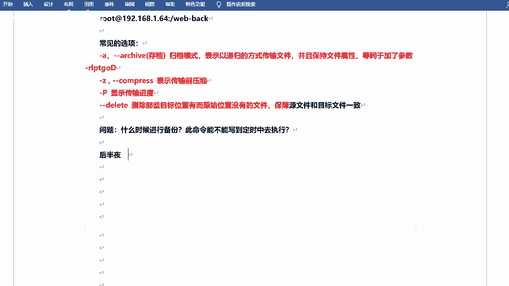

就在这个地方同步的时候，对不对，他让我输密码了。

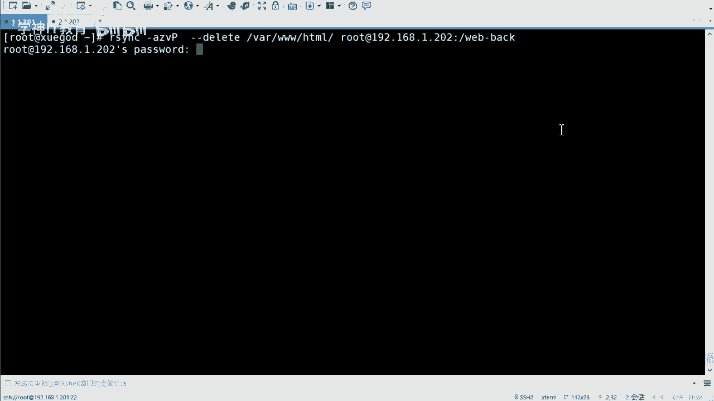

我是不是得敲密码，也就是3456，然后怕过去，是不是，那如果说是后半音的话，两点吧，就比如说对吧，如果说你们公司要求你每天的两点都得去同步是吧，那你每天两点都还得起床，然后去输密码吗，是不是。

这个是不现实啊对吧，做运维的话，做运维就应该24小时待机待命吗，是不是，那他不可能的是吧，不可能的啊，所以说咱们可以去后半夜去同步，是不是，然后诶咱们得想一个办法，是不是我可以让它自动去完成对吧。

不能说全手动啊，这可能是不行的，对不对，然后呃呃好有同学说啊，可以做s h免密是吧，挺好的啊，咱们上节课好像说了那个面对的那个是吧，对还有的话，当然你也可以写脚本，脚本是可以删掉。

啊有的还加变量之类的是吧，ok啊对这个这个都可以啊，写shell脚本的话，写respect也可以，其实啊啊但是咱们有更简单的是吧，用这个面对就可以实现了，因为咱们要看到这个本质，什么本质呢。

因为r3 c他走的是s是协议是吧，s协议的话，首先用户名密码是吧，这是一个过程，还有一个就是密钥，对对不对，我有了瞄准之后，我就可以无密无密码的登录了，是不是诶，那我是不是就可以无密码的去传输了呀是吧。

这样显示这样这样想是没问题的啊对吧，这样想是没问题的啊，上节课咱们其实已经验证了是吧，那咱们再来做一下好吧，现在做一下啊，诶我可以怎样呢，我可以呃无交互的备份是吧，然后去这个定期对称是吧，定期对称啊。

首先是生成妙对啊，这个和上次是一样的啊，生成一下秒对。

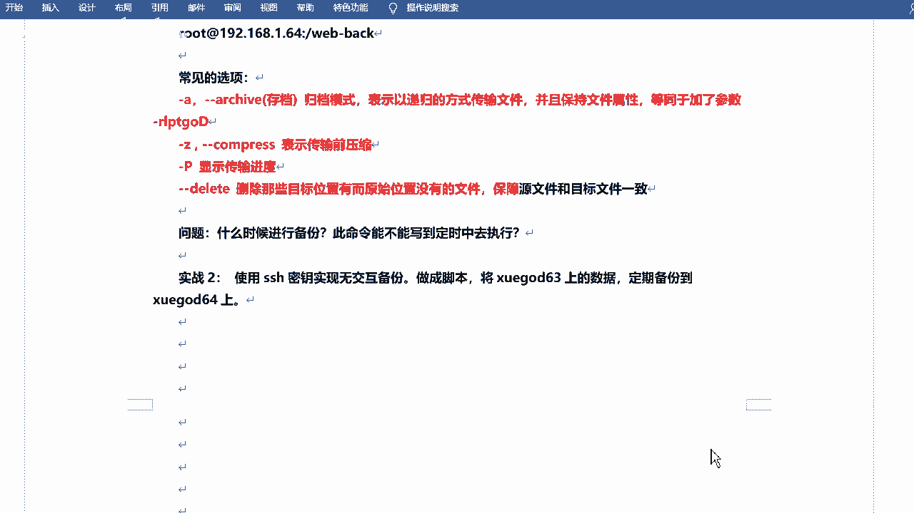

直接生成ssh杠k更是这个命令啊，这个就直接回车就行啊，它会默认生成一个在当前的s h目录下对吧，它有两个文件啊，一个是i d。r c是吧，一个是叫pua啊，their pub的话就是公钥公司要嘛是吧。

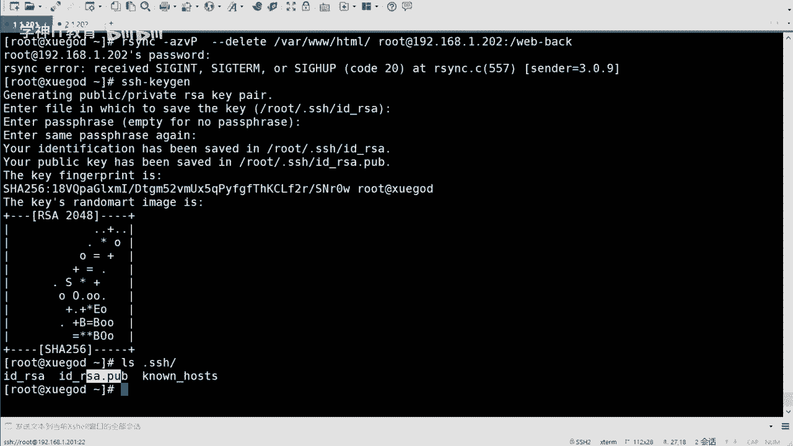

公司要嘛，那么呢咱们需要把公钥传给你想去无密钥无密码登录的那个主机是吧，直接传过去就可以把它传过去好吧，我再传过去啊，当然c p可以传啊，然后它会有专门的命令去传对吧。

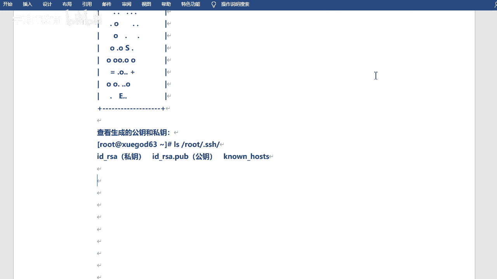

就是这个s h更好cp a d是吧，传啊传给咱们root嗯，1。2。168。1。202是吧，传过去啊，你看他还让你输密码对吧，当然这个肯定是需要输密码的啊，123456哎，传过去了，对不对。

传过去之后呢，咱们直接远程登录一下啊，192等于了吧，八啊哎呦呵八呢1。2。2是吧，对不对，这个可以远程过来啊，从学霸到学霸的202对吧，那我的r3 c是不是也可以呢，对面的是不是也可以呢是吧。

咱们试一下啊，试一下啊，我先把这边的那个啥删了啊，我我我往里走吧，比如说我把不是tp web bgm是吧，一到tap模下吧好吧，是吧，能不删除尽量就不删除啊，先一周再说，然后我去同步好吧。

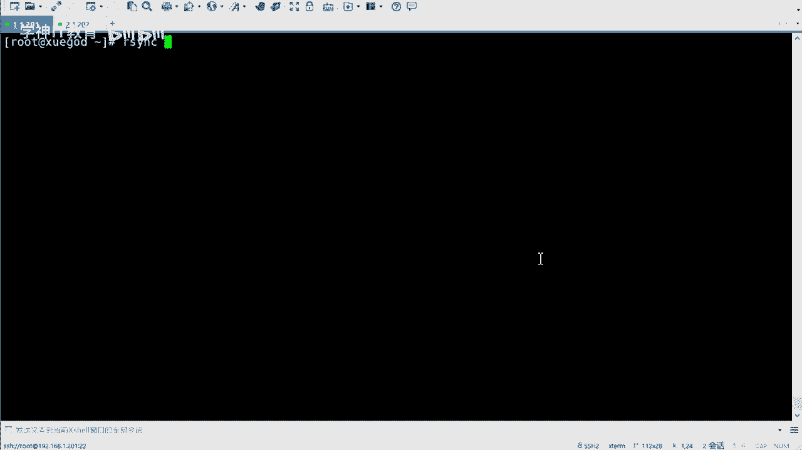

然后我去同步啊，传输直接传就可以了，当然s p也行啊，我这把两种方法都写了好吧，都写了，看你用哪种，然后测试一下是吧，测试一下啊，然后咱们先测试远程登录对吧，然后再测试去同步看可不可以啊。

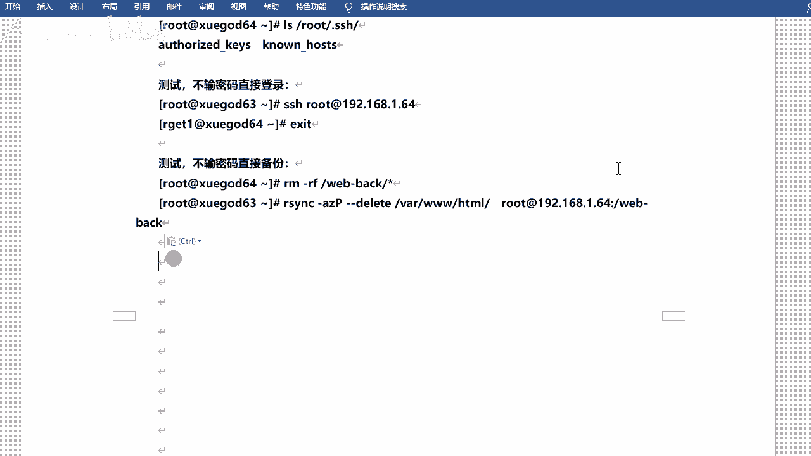

r3 c对不对，23c啊，嗯在这的话给大家说一个小技巧吧，什么小技巧呢，刚才234这个命令其实很长的是吧，什么杠a0 和v z p啥的是吧，还有后边好多的这个目录，对不对，咱们可以用一个什么呢。

叫ctrl加r的一个快捷键好吧，ctrl加r啊，快捷键，这个有用过的吗，中加r啊，它可以去检索啊，它可以去搜索是吧，那你的呃关键字就是你之前执行过什么命令啊，比如说rs对吧，你看我直接输入两个字符s。

它就会把我之前执行过的命令给我调出来了，他就他就找到了，对不对，他就找到了啊，嗯嗯，ok然后放下你的左右键啊，然后就可以调到前台了，然后就可以执行了对吧，你看和前面是不是执行的那个那个过程是一样的对吧。

一样的啊，哎然后走，你对不对，是不是没有要密码对吧，然后这边再来看一眼啊，又回来了对吧，又回来了啊，是不是这就是一个五秒的一个同步好吧。

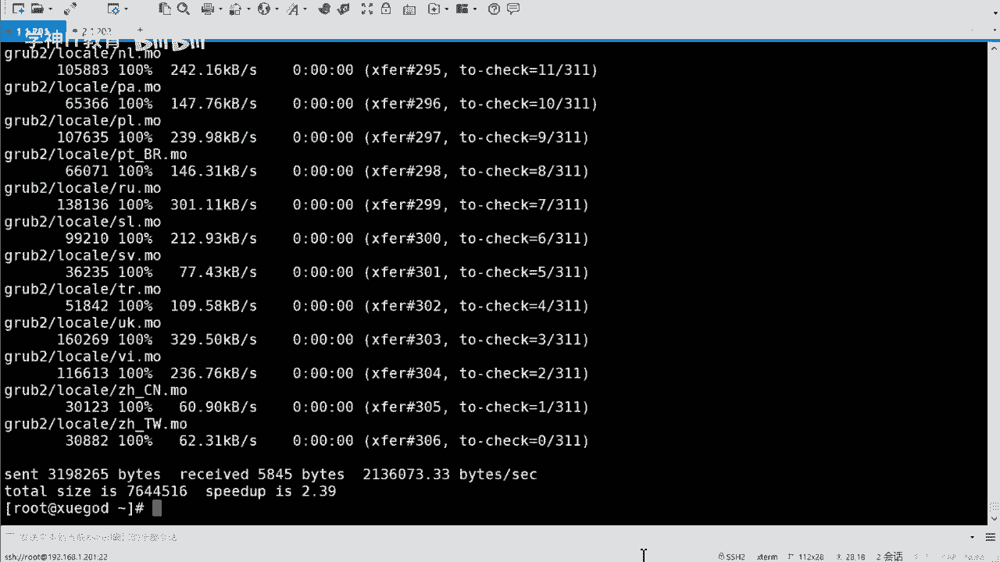

五妙一个同步啊，嗯我这简写一下吧是吧，ctrl加r啊，嗯可以怎么说，可以，历史命令是吧，搜索历史命令，快速调到前台是吧，执行，o，是个小技巧吧是吧，是个小技巧。

呃那么这样的话呢是咱们用rs n c的方式是吧，去去同步的，对不对，不管你要不要密码啊，咱们是直接同步的，那么这个是push的方式，就是推的方式是吧，哎我把数据推给我的这个这个备份端是吧，这个比分的啊。

那么下面的话咱们就用服务的方式好吧，用服务的方式啊，然后去干嘛呢，去这个操作一下好吧，去操作一下啊，服务的方式啊，就是会用到咱们的新的那个那个服务了啊，就不单单是这个命令了，ok，服务是吧。

然后现在的话是两台两台机器两台机器啊，也你看我这没有写什么服务端还是什么客户端之类的啊，我写的是原主机和目标主机，原主机呢就是你的数据在哪五秒，主机呢就是你要把数据这个这个放的评分到哪去是吧。

平分到哪去啊，咱咱们笔记里边都是6364这样啊，然后我的用的话都是什么1。2011的202啊，然后你们用的话呢就是和你们的主机是对应的是吧。

和你们的ip地址是对应的啊啊然后咱们做的话呢需要关闭s linux是吧，然后关闭这个防火墙啊，因为目前没讲防火墙，后面会讲的对吧，然后否则创建文件之后去启动服务也不会生效啊。

这个一般其实咱们都会去默认都给它关了是吧，但是还是可以验证一下啊。

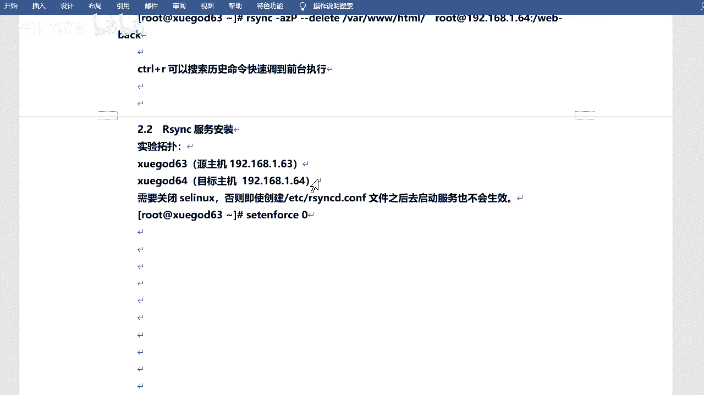

看看有没有关是吧嗯两边都得关啊，get enforce吧，是不是，两边的地方，都是第四步是吧，好那去装包是吧，装包装包的话，其实刚才咱们也看到了，已经装过了r s n z对吧，直接用就可以好吧。

直接用就可以啊，那我这个是什么呢，我这个是呃相对于我这个就是服务端啊，同同样我的数据也在这儿啊，我会去把我这边的目录同步到这边去啊，他俩是在一块的啊，行然后我启动一下这个服务啊。

system to start r s n z啊，这个直接tab就能出来是吧，这个tab就能出来啊，r3 c d是吧，从出来之后呢，咱们可以拿去看一下端口有没有在监听，873是不是已经在监听了啊，行吧。

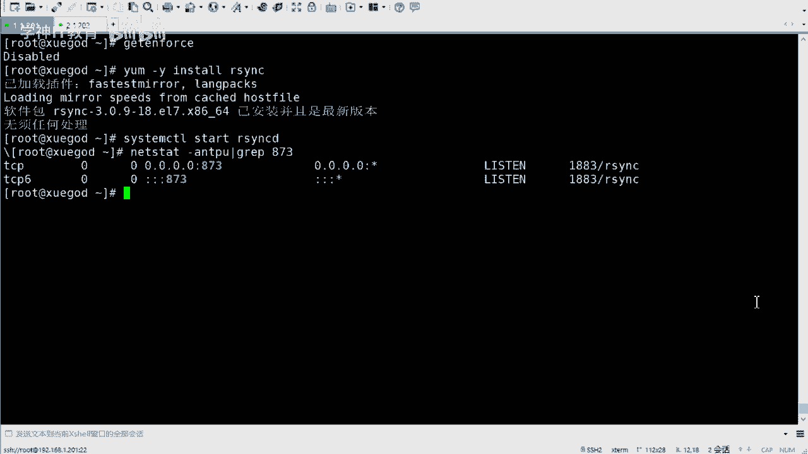

这个这个这个就可以了啊，这个就可以了啊，然后a安装，然后查看，看看就可以了啊，呃呃我再说一下那个啥吧，再说一下那个那个那个那个六和八的吧是吧，六和八的话呢，它需要六的主要是吧是吧。

他需要去装那个新建的地啊，这个这个需要说一下啊，中央系列力啊对吧，然后呃再去创建一个就是r s c d。com这个配置文件，默认的话他都没有这个配置文件对吧。

然后r c c更低执行完之后再去启动新天地啊，然后有心态地的话，你只需要洗洗心态d就可以了，不需要起r3 c了行吧，当然这个是六和八的啊是吧，然后所以说你是七的话，你就不用做这个操作了好吧。

七的话就不用做这个操作了，这是一个一个提醒吧好吧，因为确实不太一样啊，好的这个我就放这儿吧，行吧，到时候你们注意一下啊，ok行，然后的话咱们来看看这个怎么用啊，呃用法的话呢其实还是命令的方式去用。

但是呢它可以加一些加一些比较复杂的参数啊，什么az打t啊啥的，咱们都看到了是吧，咱们都用过了啊，然后可以加这种像这种杠杠啊，杠杠这种呃，当然part也可以改变part啊，然后嗯这个我把这个标红吧，不用。

password的z啊，这个文件是吧，这个文件啊，你可以去呃指定密密码文件中获取密码密码呃，这个怎么说诶，有同学说老师刚才你不是把那个啥把那个是吧，咱们的密钥都做好了吗。

是不是完了之后我也可以无无密码的去传输了，上怎么还得用一个密码文件呢，对吧，是这样的啊，就是咱们做的话是是root用户，比如说是吧，或者说是一些系统用户，对不对，但是咱们同步的时候呢。

你可以不用这些用户，我不用root用户是吧，我不用系统用户，我不用什么cd啊，什么这样的用户，对不对，我可以单独去这个赋予一个用户是吧，然后让他以他的身份去同步啊，这个也是可以的好吧。

就是你不一定非得用那个系统用户的普通用户，也不是普通用户，是就是这个单独用户也可以啊，单独用户也可以是吧，那单独用户单独用户的话，就是可能是你能持想起来的一个用户，或者说你自己配置的用户是吧。

那我不能说我再去做一个密钥对吧，或者说这个用户根本在系统里就不存在是吧，那你也做不了对吧，所以说咱们还是用的一个pass文件啊，咱们可以去写上这个什么用户名啊，密码的呀对吧，这样一个关系啊。

然后呢哎也可以实现一个无密钥的，是无密码的一个传输，好吧，这个意思啊，这个意思啊，其他的一些如果你想加的话，到时候也可以加啊，关键就是它主要就是他对吧，然后常用的就是a v z是吧。

当然打p也可以加的啊，行，然后咱们来做一下是吧，来备份一下啊，说性格一会儿还回家的啊，别着急，这个啊，使用23c啊去备份数据是吧，备份数据啊，当然这个不是刚才做过吗是吧。

这次咱们做的是一个呃不一样的好吧，做一个做的是一个不一样的嗯，然后的话，然后的话咱们来做一下啊，呃哦笔记本写的是创建测试用户是吧，这个用户创建创建创建就是专门去用来同步的好吧，专门去用来同步的用户啊。

就是什么r e g a r g e t e是吧，这个用户啊，然后呢两台主机都需要操作是吧，两边都做一下啊，这个我就直接回车了吧。

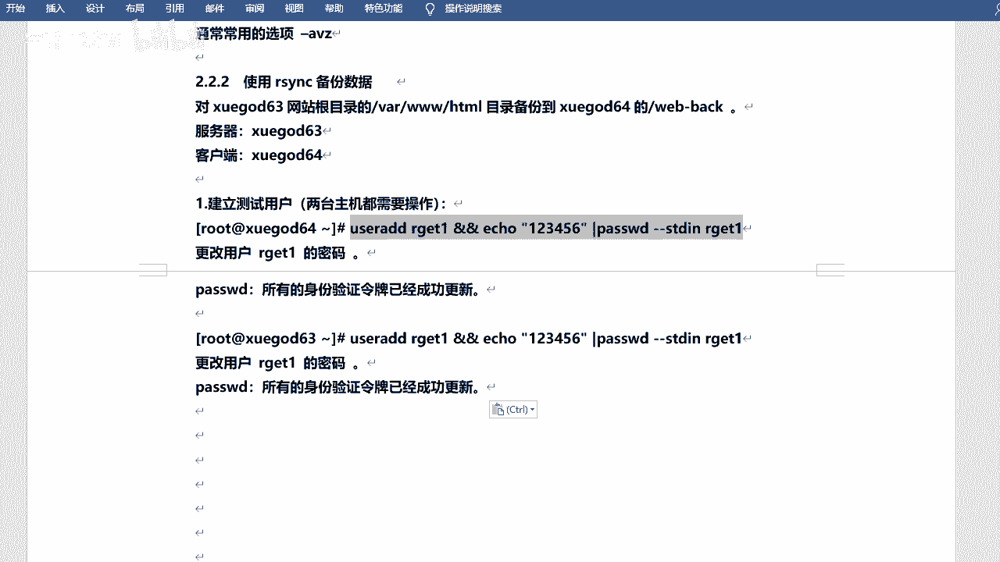

直接复制了吧，就是创建一个用户，专门去做这个同步的啊，叫r g e，这也是密码，我都写的比较简单是吧，都是12346好吧，都是12346啊，然后呢这边我同步的还是谁呢。

还是这个y下3w tml还是他好吧，然后我给他去改一个这个什么呢，改一个这个这个这个权限啊，杠啊杠l d看一下吧，啊包括杠二位看一下是吧，他这个都是root嘛，因为我是用root身份去拷贝的，对不对。

那我去给他改一下啊，呃叫做sf a c l，这个名字还记得吗，是不是这个是单独去去改权限的啊，嗯杠杠r杠r就是递归区别啊，跟user好吧，user呃改成r g e t一啊。

然后呢它的权限是2w x y下的3w tml改一下是吧，然后嗯还可以改一个site out杠r杠m叫default，默认的啊，default r g e t e。

然后呢也是2w x也是瓦下的3w tml是吧，这个目录啊，就是我把它的权限改一下，改完之后呢，咱们去看啊，get f e c l哇，下3w2 t喵啊，那目前他的这个这个用户啊，在这啊是吧。

就加了一个rg e t e r w x啊，当然他你去看的话，他还是root啊，是吧，还是root root啊，但是咱们加了一个啥啊，加了一个呃，这个这个这个这个用户是吧，就是它这个用户。

然后你也有2w x线线好吧，然后default是吧，default用户啊，然后也是adox啊，然后也是给的是r g e t一对吧，也就是2g2 g1 t对这个目录啊，包括它其实它下面的什么子目录啥的。

我看还有还有什么文件啊，device map是吧，哦grab to rap图也能看啊啊啊不对不对，gf e c o m grab to是你看对不对，它就都是2g1 t了，好吧，就都是他了是吧，都是他的。

就是他对这个目录是吧，是有读写读写可执行权限的是吧，你能看到它就行啊，这两个是吧。

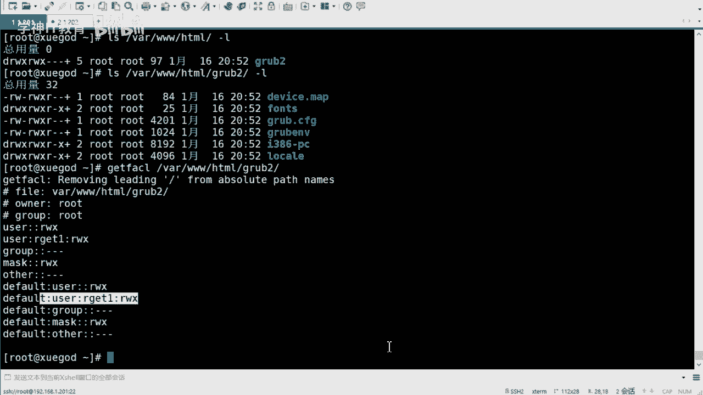

这是一样的一样的嗯，然后ok这是负的权限啊，ok然后比如说我再去干嘛呢，我再去呃测试一些数据啊，然后我再去复制一些数据吧。

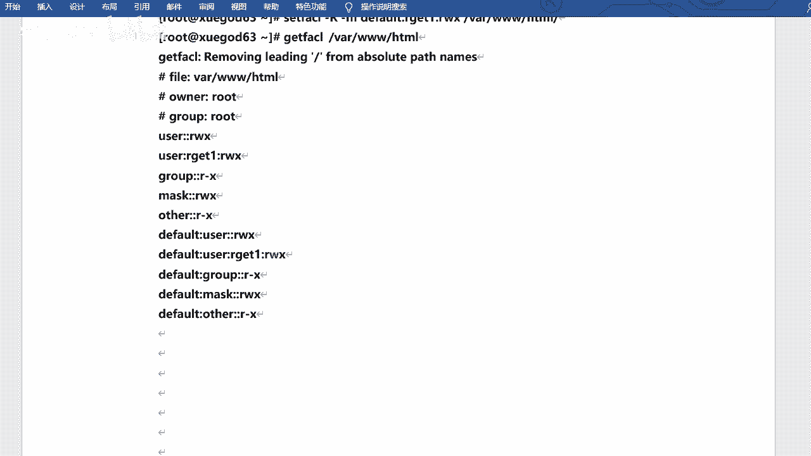

我把bot下的所有文件同步到w下3w27 秒，哦这是我之前的是吧，那那，一个让我先把他删了吗，那我先给他拍mv吧，删了吧，没用了啊，呃y下3w7 差不多，然后我再考虑一下，这个是啥，怎么还有这个看这个。

诶我之前有东西吗，里边，得得得我直接删内容啊，好吧，我把etl也删了，再重进一下吧，是吧，然后我拷贝一下啊，cp，拷贝过来，这个是新的新的一些那个啥啊，新的一些文件是拷贝过来了啊，嗯然后给他。

然后给他干嘛呢，修改一下权限啊，这边change one r g e t e r g e t e，然后是高r还是啊，然后will back是吧，他以前是root的，是不是，现在变成r g e t一了啊。

这个其实就是为了保持这个其实就是为了保持权限的一致性好吧，权限的一致性啊，没有别的，因为因为咱们同步的时候不是可以去什么保持什么属性啊，是保持什么输入速度啊，对不对，这个就是为了做这个啊好吧。

他就是可以去保持这个东西啊，保持权限是吧，然后我去嗯同步一下是吧，然后rs n c啊，看a v z，然后往下3w7 秒啊，用r g e t这个用户是吧，去同步啊，at 19=8。1。

202的web web back这个目录，好吧我给他同步过去，给他同步过去啊，当然这个是需要密码的是吧，这个需要密码的就是就是什么呢，就是这个理啊，因为你不是root嘛是吧。

因为咱们root之前是做了面对的，但是这个没有做，所以说还是需要密码的啊，123456是吧，然后去同步啊，但这个过程也是可以看见的嗯，过来是吧，过来之后再去看啊，嗯，这里边儿是吧。

然后他会给你同步过来好吧，同步过来捅过来之后呢，它的数数组你看什么都是r e g t一对吧，能看到吧，我看里面e f i这种的里面的都是看了吧，都是这个就是为了保持什么呢，为了保持这个这个权限的好吧。

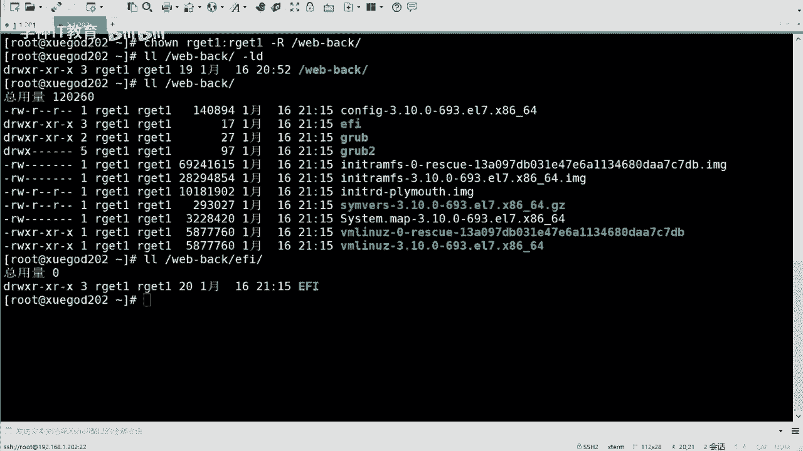