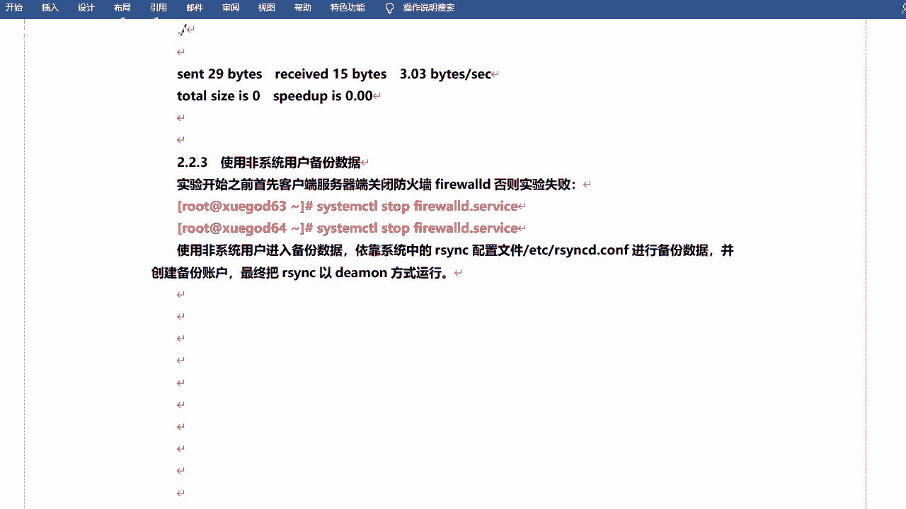

# RHCE8红帽认证课程／自学必备／云计算／rhce／Linux运维 - P7：rsync服务形式运行-推拉模式 - 学神科技 - BV1L54y1S7qZ

好啊，然后咱们来看一下服务啊，如何用服务的形式去应用是吧，然后怎么去试试它的配置文件好吧，ok而且你看它可以使用非系统用户去备份这个数据是吧，备份数据啊，嗯还是关闭防火墙，关闭s1 linux对吧。

先给它关掉啊，呃使用飞机的用户呢进入备份的数据是吧啊进入数据备份啊，然后依靠系统的r3 c配置文件啊，a p c r s c d。com进行备份的备份数据，并创建备份账号。

最终把r s n c e d a方式运行啊，就是服务嘛是吧，第一位就是服务的意思啊。

那这个配置文件呢嗯咱们一边打开一边看吧，e c r s v c地点创意啊，就这个它默认里面其实没多少东西啊，然后呢整体上分成两个部分好吧，两个部分啊，一个叫做全局配置啊，就是这一部分。

一个叫做那个模块参数啊，这个部分是吧，关关键不一样的地方就是这个东西啊，它有一个中框括起来的一个模块的名字是吧。

这是全局部分啊，然后默认端口号是873是吧，这个就不用多说了啊，ok那么它能配置的参数呢其实其实挺多的啊。

当然这里边呢也会有一些默认的啊，什么ui啊啥的是吧，但是它是注释起来的啊，注释起来的没有没有没有应用的。

对不对，然后嗯我在这儿去说几个吧行吧。

说几个port，这个也是默认的参数啊，我看这有part吗。

没写是吧，没写也是873啊，然后的话就是这些一起来看一看啊，这些啊当然你不用记是吧，你不用记啊，因为因为挺多的好吧，因为挺多的啊，到时候你能拿过来参考就可以了，首先是u i d。

u i d的话就是你的用户id是吧，用户id啊，该选项指定当前当该模块传输时候，守护进程应该具具有的这个有i d啊，现在就是以谁的身份是吧，谁的身份去运行的啊啊然后呢j i d就是阻y d是吧。

用户yd和阻i d啊，然后是max connections啊，最大并发连接数以保护这个服务器啊，超过限制的连接连接请求将会被告知，随后再试啊，默认值是零啊，也就是没有限制是吧，当然你也可以限制它啊。

也可以的啊，log file锁是锁文件啊，呃指定支持mark ation参数的锁文件啊，默认值是这个这个地方嗯，然后mod fd啊，mod fd的话是一个消息文件，就是一个提示嗯。

咱们上次讲了一个什么etc下的mt，那个还记得吧，就是什么欢迎光临啊，那个东西是吧，呃这个二分c的话它也有这个文件是吧，就是一个提示啊，但是这个这个不重要是吧，不提示也可以的。

log file是日志文件啊，呃是指定r3 c的日志文件，而不是将日志发送给cs log，这个其实很重要的，因为后期如果说你配置是吧，然后那个那个比方说我重启用服务没问题。

但是呢我同步的时候他不成功是吧，然后他会有一些这个这个提示嘛是吧，有些日志啊，然后他会告诉你什么问题之类的是吧，咱们可以通过日志文件呢去去定位是吧，去检查啊，和哪哪写的不对啊是吧，或者哪儿有问题啊。

嗯p i d费用是它运行的p i d的文件啊，这个这个一般对可以指定一些，也可以不指定啊，然后house allow这个是单个ip或ip地址，这个是指定是允许访问的，客户寄地址就是允许谁访问。

允许谁在同步，或者这个意思啊，cos嗯，ok这是全局的配置啊，然后呢有一些模块的配置和它可以是重复的，还有一些呢是是不重复的是吧，咱们也可以简单看一看啊，嗯重复的话也是因为主呢重复的话。

如果说你的模块参数里边的这个这个配置是吧，和全局里面的配置冲突了，表示相同的配置，但是植物一样是吧，那以谁为准呢，以咱们的模块算数为准好吧，我看这游戏吗啊有写的啊，在这如果模块参数和群体参数冲突。

那么冲突的地方模块参数最终生效啊，也就是说它的模块参数是吧，他的这个权限更高是吧，更高的，然后模块参数呢必须是以中二括起来的共享模块名来去这个系啊，格式是这样的啊。

然后comment的描述pass就是同步到哪儿去啊，这个是一个目录必须要指定的redi是否以只读模式啊，然后true的话无法上传写入，就是能不能去去呃，是是主还是可以写的是吧。

一般的话都是都是读写的啊啊什么执行啊，这个不这个不用记，这个不用记啊，这也不用定，然后下面这些需要需要注意一下，下面那些还挺多的是吧，所以说你你不用都都记啊，像这个all ser这个非常重要。

all sa的话就是认证用户是吧，所谓真正用户呢就是允许谁呃，不是允许啊，是以谁的身份去传输是吧，去支线2323c啊，osu的对吧，这里的用户和性能用户没有任何关系，就是你可以随便写好吧。

就是可以不用是系统用户的，然后six secret field是密码文件，该文件的权限一定要是六六百600，也就是说只有那个root是吧，因为咱们现在是用root身份去操作的嘛是吧。

只有root有对这个文件有写的权限，其他人都没有权限，因为咱们这里边写的话会以铭文的形式去写，你密码是不安全的，对不对，但是呢哎我给他写的600是吧，其他人是没有读的权限，没有写权限的。

当然也没有读全线是吧，只root用户有有图片权限啊，嗯hoo上面一样啊，允许谁是吧，可以单个地址啊，可以是网段啊都行啊，行也可以的，然后还有dna就是不允许谁是吧，不允许啊，然后当然你你你不去写。

默认就是都允许啊，或者说只允许那个alload嗯，例子的话呢是呃，当客户请求可以使用的模块列表的时候，该模块是否应该被列出，就是列出你的这个这个模块好吧，默认值是true的啊。

呃还有time out超时是吧，time out超时啊，就是该选项啊，可以确保r3 n c服务不会永远等待一个崩溃的客户端是吧，如果说他比如说他连不上呢，是不是或者它不同步呢，对不对，或者说有问题呢。

它它这个这个链接是吧，它它如果说一直是连接的话是不行的，它会有个超时时间啊，零的话是没有的啊是吧，当然你可以去设置好吧，你可以设置啊，这是几个呃参数是吧，当然很多是吧，这不下十个吧，对不对，怎么着。

二三十个这样的啊，是不是呃，所以说呃你先去理解好吧，你理解，然后这个标红的话要去看一下，再去看一下啊，然后其他的一些你都可以，目前可以先忽略掉是吧，先忽略掉啊。

然后看的话呢还有就是要看咱们的配置文件是吧，看我是怎么写的好吧，看我是怎么写的这个配置啊，当然这个配置也会比较长是吧，然后我在后边的话就单独去注释一下是吧，这个是干什么的，这是干什么的，这是干什么的。

好不是吧，嗯然后呢呃你去写这个配置文的时候，千万注意啊，呃第一手动创建啊啊然后还有就是说你不能直接去复制啊，跟上次咱们讲那个fan一样是吧，你你复制完之后呢，他后边跟上那个注释啥的，他不生效啊。

他也不会报错，如果以重启啊或者起伏啊，他也不会报错，但是他就不生效好吧，所以说这个咱们需要收纳行吧，这个需要手打的啊，也锻炼一下是吧，当然在手打过程中，你很可能会写错，哎正好咱们也可以排个错是吧。

也可以排个错啊行吧，然后我去实行一下啊，呃这里边他写的是664是吧，它是以六四为服务端的啊，那么咱们在六四上面去去去去改这个配置文件好吧，六四上面是吧，你看它是会写的，然后这个地方主机名有写是吧。

我以六四为准吧，还是啊，相当于是我的这台机器是吧，然后我写一下啊，嗯e d c下的r4 wcd。com嗯，这些都可以不用啊，咱们直接自己写好吧，嗯ui d是吧，the root啊，然后哦在这一写空格吗。

其实写不扣空格都行啊，等号两边啊，嗯，然后是address嗯address的话呢是你的当前主机的ip好吧，当前主机的ip啊，这个其实不写也可以，那我写一下吧，1。2。168。1。202是吧。

然后part等号873，嗯但是这是默认的是吧，然后house allow允许这呢允许是嗯，192。168。1。2啊，不是一点网段啊，然后24对吧。

允许这个网段的这个这个这个机器来同步我或者我同步给别人是吧，都行的啊，嗯然后是叫u子change root，yes啊，这个是是是否无知到什么锁啊是吧，就是是否锁定加目录啊。

意思就是比如说你的r3 c被如果说被黑了是吧，如果说通过它进入了你的系统的话是吧，那黑客是不能就是不能去在你的这个运行的加目录之外去创建文件啊，就是保证你的安全性相当于好吧，保证全性啊。

嗯然后是max connection，connection啊，这里边写的是个五好吧，那你写100其实也可以啊，它可以同时就同时传出100个文件行吧，快写个诗吧，嗯然后是pad啊，pad费指定一个吧是吧。

挖下的run一下r s n c b d p i d啊，然后lock f，哇想ru下角r s n c block，还有log，还有一个是log日志文件啊，这个是主要的啊。

log fi那log file是我下log下的rs cd的log呃，mode fail是吧，这个这个这个也可以写，可不写啊，就是就是那个那个欢迎文件或提示提示文件啊。

就是a t c一下子就r s wcd点，嗯这个是一个全局配置好吧，全局配置啊，然后下边就是去写这个模块参数，模块参数啊，比如我的模块呢叫3w啊，3w root嗯，pass pass是比较写的。

pass的话就是你要去同步到哪去是吧，怎么哪儿去啊，就是你用我这个服务，用我这个模块的话，对不对，然后你要把文件备份到哪去，相当于啊比如说还是为back，嗯有个comment。

comment是一个描述啊，比如说这是一个used for web back，比如说啊描述啊，然后read only，还有啥list，list是不是要列出模块是吧，呃no也可以啊，yes也可以。

然后最主要的就是os all users用谁的身份是吧，去同步啊，r s n c表示user吧，然后呢secret fi secret啊，嗯就是密码文件啊，etc下载rs n c。ps。

对吧，写的反正挺长的啊，这是这是多少号呀，这是20多行吗是吧。

写完之后保存退出好吧。

这样的话就相当于相当于对咱们的这个服务是吧，进行配置了好吧，进行配置了啊，ok那咱们来创建箱的目录和文件啊。

开始去做，咳咳这是我写一个欢迎欢迎文件啊，welcome，to become so往下重定向到etc下的s n c d。m t d是吧，这是指定一个换原文件啊。

然后password的a d c r s n c password，这是密码文件密码我的用户名的话是r s n c user，这个需要注意的话，就是和你的配置文件里面一定要保持一致的对吧。

然后密码的话比如说叫做password 123好吧，这个里边的话咱们需要把用户名和密码都都写进去啊，都选去啊，然后改改权限600，啊然后是a d c下的r s b n c。password是吧。

我配置不一样啊，我看看啊，是不是你说了错了的话，咱们就改啊，是这个吗，不一样吗，这个不一样吗，我看一眼啊，r s y c user是吧，然后嗯e d c r s wc。possible，那可不一样啊。

这个吗，log fail，这个我还没写，没写呢是吧，这个这个也不用写啊，嗯，这是密码啊，600我改了吧是吧。

6001定要改啊，这个这个需要注意，这是强制的好吧，强制的啊，好然后咱们重启下服务是吧。

那服务器回来肯定不对啊，服务器来，我再去看看配置文件吧，sm去掉啊，restart r s n c d，是吧，看上去是没错的啊，然后next st grape一下873，是不是运行的，对不对，呃。

当然他会去默认去读取，默认去读取这个配置文件，你也可以单独去指定啊，单独去指定，然后呢用这个配置文件呢去启动的服务也可以是2s n c，刚刚dem，啊刚刚config指定config文件啊。

是etc下的s n c d。cos是吧，这样也可以啊，但是他说说什么呢，他说p i d存在，说明你的服务已经起来了是吧，如果说你没起的话，你可以去这样去起的啊。

啊这样的话说明它已经起过了pc文件应用了啊，pd文件就是你的进程所对应的那个那个文件是进程号，主要是。

ok那么完了之后咱们来测试一下好不好，服务也起来了，对不对，然后咱们看看能不能同步过来好吧，这一步也非常关键啊，非常关键啊。

和咱们后边的那个实时同步啊，它是相关联的对吧，怎么同步呢，我在这边啊，在这边去同步好吧，这边去同步啊，然后呢呃还是用23c的命令去同步s n z什么a v e z是吧，用啊还是同步化下3w tml。

然后呢用rs wc user这个用户是吧，去同步啊，at地址是192。168。1。2。2，是通到这边来啊，然后呢如果说你要同步到什么way back是吧，和之前是写的一样啊。

但是咱们用的是那个配置文件嘛是吧，用的是服务啊，那我就可以这样写两个冒号加上3w root是吧，3w root呢它指定的是这个模块参数对吧，那么模块它是它里面有一个pass是指定的这个目录，对不对。

所以说它就会自动去放在那个目录下好吧，放在那个目录下啊，同问题是吧，你看它会有提示说welcome to back up store，对密码的话是什么，密码的话是你的i sc user，所以就得密码啊。

叫做p a s s w o r d123 ，是我的密码不对吗，密码可能比较长，p a s s w o r123 ，哎呀是不是写错了呀，ez r s n c点儿趴座的啊，这个5号可能复制过来吗。

复制一下啊，关键是用户名和密码是吧，有的时候这个怎么说呢，他写错肯定是通不了的啊，哎我去我敲两次居然都敲错了啊，这个是我把那个密码直接复制过来的啊，就是就是这样是吧，这样复制的啊，我这手不行呀。

p a s s w o r d，上岁数了不好使了，这时候看这家伙行吧，这是没问题的，因为我是直接复制过来的是吧，复制过来的啊。

我敲错了吧，当然你们测试的时候，你们可以先弄一个简单的密码，是先弄个简单的密码测试，是不是这样是可以的啊。

这样就可以的啊，呃然后呃当然这个的话呢它也是一个呃什么呢，它也是一个这个这个手手写的方式是吧，那我想要去自动去同步呢是吧，我不用敲密码，对不对，那咱们在这个地方啊，这个地方选择客户端吧是吧。

我也可以去写个密码文件，然后呢他可以去直接去调用这个密码文件好吧，我写一个啊，ez i s n c点差错了好吧，这个里面呢就单独去写，单独去写密码就可以了好吧，p a s s w不玩是吧，123。

没写错吧，试一试啊，这个只写密码啊，这个不用写用户名，然后也是加一个600，e t c r s n c点趴座啊，然后咱们再去同步一下啊，在这同步是不是，然后我可以加上刚刚password，呃f是吧。

等于什么呢，等于咱们e t c下的rs和c，就是你刚才创建了个面码文件啊，p a s s w d对吧，然后去同步好吧，就可以了啊，就可以了啊，你看是吧，每一次你同步的时候，你都可以这样去。

都可以这样去用啊，手动是吧，ok嗯这样的话呢就把你的数据这个这个同步过去了是吧，同步过去了啊，这个叫push啊，推的方式是吧，把你的这个数据推到你的服务端是吧，推到你的服务端啊。

然后其实还有一句话是可以去呃，拉的拉的话就是把服务端的数据拉到本地啊，拉到本地啊，这个其实它是双向的好吧，双向的啊，怎么写呢，写的话把这个地址呃电脑过来就可以行吧。

就是你比如说我要把服务端的数据同步到我当前目录的o p t这是吧，这个这个也可以好吧，集合啦都行的。

其实啊就看你想怎么去，是吧，怎么去用了啊，这就是拉看到没有，这就是l所以说他他他们两个这个角色是可以互换的。

是可以互换的啊，关键是你要找到数据在哪是吧，你到底是要推啊。

还是要拉呀是吧，就看你的情况，o o p t是吧，对不对，这个文件是不是又把它拉下来了。

是不是，ok啊这是咱们的同步是使用服务的形式去同步好吧，服务同步啊，那这样的话我就可以通过脚本去实现了是吧，脚本去实现啊，然后定时定点的对吧，实现啊，然后也可以不用root用户是吧。

你就用用用它给你的用户，当然这是咱们自己设设定的，是你想用啥就用啥，对不对，然后可以通过一个写脚本的方式继续同步是吧，同步啊，这个同步当然你可以是什么推啊，也可以是lion对吧。

这个当然也是可以的啊啊然后去执行完了之后呢，要有一个可以写一个计划任务吗，是一块肉嘛，然后咱们可以凌晨的每天的是吧，每天的凌晨的03：01，是不是哎我去执行这个脚本对吧，精锐脚本啊。

