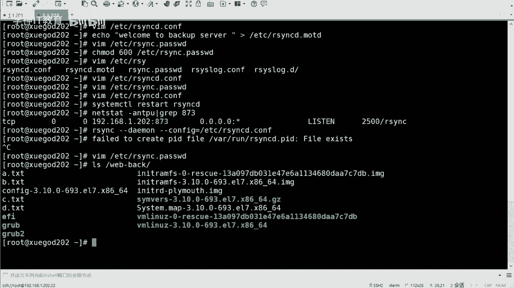

# RHCE8红帽认证课程／自学必备／云计算／rhce／Linux运维 - P8：sersync+rsync触发式同步 - 学神科技 - BV1L54y1S7qZ

这个可以满足咱们正常的一个需求是吧，但是如果说我想实时同步怎么办，对不对，但这个实时的话呢，它不是说其实不是说每分每秒都去同步的啊，这个也没有也没有这个必要。

因为有的时候你的你的这个目录过程它没有变，没有发生改变是吧，哇一下3w没有这个地方对吧，比如说我我可能一个小时一个小时里边啥也没有增加，也没有修改，那你还要去同步吗，就不用同步，是不是就不用同步啊。

那如果说我可能一秒钟啊，或者说几秒钟吧是吧，我看我改了改了一次是吧，那你那样的话去同步是可以的，是不是，但是如果说每分每秒都去同步的话，那肯定会消耗更多系统资源的是吧，可能有的时候他就啥也不干了。

他就光绪同步了是吧，也没有这个必要，对不对。

所以说咱们所说的诗同步呢，其实更应该叫什么呢，应该叫触发式的同步，啊什么叫触发式是吧，什么叫触发式啊，就是说嗯等它发生改变了是吧，你的你的原目录发生改变啊，发生改变对吧，这个发生改变的话呢。

其实就是无碍，无外乎于就是增删改是吧，是不是就这么几个操作对吧，这么几个操作就是比如说哎我新建了个新建了个文件诶，我要同步我删除的文件诶，我要同步是吧，我改了一个数据是吧，我改了里面的几个字符是吧。

或者是干嘛的啊，我需要同步是吧，其他的时候不需要，比如我去查我l s一下，他要同步啊，可能是不需要同步的，因为它是还没有变是吧，我cat一下需要同步吗，不需要的，是不是诶，那这样的话呢是吧。

那那和他对不对，就不太不太一样了是吧，就不应该叫实时同步了啊，对不对，叫触发式的是吧，但是咱们叫的话其实喜欢教师同步啊，但是你知道它是出发式的就可以了好吧，触发式的啊，等它发生了改变之后对吧。

然后你再去这个同步是吧，ok啊嗯这个的话其实咱们嗯之前一直在用一个工具叫innotify，这个东西啊，innotif是吧，这个可以去实现实时同步，然后它是一个监控你的目录的变更的一个一个一个工具是吧。

但是这个东西有时候不太稳定啊，然后这个还需要写shell脚本是吧，有的时候可能还比较麻烦，现在有一个更好的更好的一个一个工具啊，叫think好吧，叫叫这个sir ink啊，sir ink是吧。

它是呃可以去实现这个实时同步的好吧，可以实现这个实时同步的啊，然后咱们可以简单做个对比对比吧，给我拿过来呃，移动defi是移动罪犯的话呢，只会记录下来被监听的目录发生了一些变化。

并没有把具体是哪个文件或者哪个目录发生变化记录下来，它只是说我发生改变了，对不对，它并并不会说是哪个文件发生改变了，23c在同步的时候，我并不知道是哪个文件发生了变化是吧，所以说呃他去同步的时候呢。

可能会对整个目录去同步啊，但是这个不是说这样的是吧，咱们要同步的话呢，就是干嘛呢，就是这个这个这个要同步修改，修改过的是吧，你没改的话，那我就不用同步是吧，不用同步啊。

那sc的话呢它就会帮你去记录下来谁发生了改变，然后呢哎再用r3 c去同步更改过的文件，指同步发生变化的文件是吧，因此的话效率会更高嗯好吧，因此的话效率会更高啊，这个这个这个这个知道就可以是吧。

而且它还更稳定宇宙，对方的话有的时候跑着跑，他可能自己会死掉啊，有的时候真的会这样啊，算性格的话会很稳定好吧，会很稳定啊，ok那简单再来看一下同步这个原理吧是吧，这个其实嗯呃其实怎么说呢。

其实就是咱们这刚才同步的过程其实也看到了啊，只不过它是自动的，它会有个手工进程，然后会会自动去监听，然后去去同步，好吧嗯在这啊用户实时的往sic的服务器上写入更新文件的数据啊。

此时需要在同步的主服务器上配置csk的服务，然后呢在另外一台服务器开启23c守护进程啊，以同步拉取来自sc的服务器上的数据啊，然后另外一是开启守护进程，然后呢是push过来对吧。

所以说你去拉雅去这个这个啊推啊都行好吧都行啊，就看你的命令怎么写了是吧，刚才咱们也也说了是吧，推和拉有什么区别啊，其实就是命令不一样，是吧，然后你就看它是怎么怎么写的好吧，你就看怎么写的。

当然这也会有一个图吧是吧，sc文件成啊，监控文件的这个变化啊，然后一旦发生改变s n c啊，直接去进行同步就可以了好吧，直接同步就可以了，然后我把这个发给大家啊，我传到咱们的群里面去是吧，这么强是吧。

会省很多事儿是吧，省很多事啊，然后呢我也把它上传到我的服务端啊。

嗯嗯，哎呀我从这儿穿吧。

我这个软件可能藏的比较深啊。

电脑啊，笔记第二阶段。

啊还是他是吧，然后我就直接把它拿过来了。

这东西也不大啊，也不大啊，看有多大啊，711k是吧，711k啊，它是一个压缩包对吧，压缩包，然后可以给它解压出来，这个不用装啊，然后有一个是命令命令文件，一个是配置文件是吧，然后不用去什么源码安装。

这个都是编译好的，直接用就可以。

什么x86 是吧，叫这个啊啊当然你也可以下载是吧，你也可以下载啊，不一定非得用我这个我这有有一个什么呢，有一个路径是吧，一个一个地址吧是吧，大家可以下载的，也可以的啊，哦我把它夹到了op d下是吧。

然后我那我把它移到op下吧，嗯mv，等金庸这个目录移到op上，ot哇塞o d是我之前同步的一个是吧，然后里面的目录对吧，就这两个文件好吧，挺简单的啊，就这两个文件对吧，然后的话呃我给他改个名字吧。

我我我我切到op贴吧，然后我把这个金u这个改成，是吧，然后我切进去好吧，就这两个文件啊，一个是配置文件，一个是命令文件啊，那我去我先拷贝一下咱们的配置文件吧，对吧这是个好习惯是吧，这是好习惯啊。

然后可以去呃，在改配置文件之前是吧，咱们可以先去备份啊，然后我去修改一下config xml，修改它一下啊，当然这个也比较长啊，嗯从哪开始，从哪开始，从这开始啊，这是第几行，第23行行吧，从这开始啊。

这是the c的一个配置呃，叫local pass，logo，pass呢是本地目录的意思是吧，意思就是说他会去监控哪个目录是吧，监控哪个目录啊，那么他这写的是o p t同步啊。

其实咱们发现了一个比较有意思的东西，就是什么呢，他这个是拼音的东西，拼音的写法是吧，不是那个英文的，说明什么呢，说明做这个软件呢是中国人好吧，然后确实是中国人啊，是那个金山公司的啊。

金山公司的一个游戏分公司吧，叫金山逍遥网宝贝，有没有同学玩过他的游戏啊，其实啊有什么剑侠系列的游戏啊，对那个同学叫什么周洋，好像是周阳那个人开发的是吧，以前雷军也是也是金山的是吧。

对周扬开发的这个他是用c加加写的啊，一个一个这样的一个工具啊，嗯那咱们那咱们监控的不是他是吧，那咱们就改一下啊，改成什么呢，改成这个这个哇下3w html是吧，我见过的是他。

然后下面的是i p remote ip remote app的话呢，就是你要同步到哪去，相当于是不是嗯是192。168。1。202，这个第七对吧，然后是name啊，name name这个呢需要注意。

name是名字的意思是吧，name是名字的意思啊，呃但是这个名字不是用户名啊，不是不是用户名而什么，而是你的模块的名字行吧，这个一定要注意啊，模块名字，咱们模块的话呢刚才设置的啊是3w root对吧。

算咱们root啊，然后往下走啊，往前走啊，这个parameter不用写啊，就是参数啊，然后这个地方all start是吧，它是fast给它改成true，出啊，然后user这个users才是用户啊。

这个用户呢是你从用哪个用户的身份去同步，当然咱们嗯配置文件里面写的是一个是一个呃系统不存在的用户是吧，那咱们还用它啊，就是还是用r s wc嗯，user是吧，用它那password fi啊。

还是e t c下的r3 c点，password p s s wd是吧，是这个吧，先写啊，应该是这个我记得对好吧，写完之后就可以了啊，主要改的就是一个两个三个四个五个六个六个六个参数是六个参数啊。

改完之后保存退出行吧。

这就是咱们要改的配置啊，ok然后再从第23行开始是吧，然后去改的24行，24行要改的，然后这个是密码用的部分是吧，改的话其实也改的也不多啊，而且当然你要用这个susa的前提。

你要把r3 c的服务要配好是吧，你不然的话你这个地方没法写，是不是，所以说你要搞清楚先做什么啊，先做r3 c的服务，然后再去做cnc好吧，再去做cc啊，试一下啊。

嗯那我先去起这个服务啊，先去起这个sirink这个服务啊，啊就是它其实就是他啊可以点杠是吧，the thing to嗯，杠d加参数啊，杠r然后杠o然后是咱们的config xml，什么意思呢。

杠d的我先不说啊，咱们先敲一下试试啊，试试啊，然后过来了对吧，然后这里边会有这个参数的一个解释好吧，刚d的话呢是run as a demon是吧，后台运行呃。

r的话呢是r3 c all the local fields to the remote server before the service，think work，什么意思呢。

就是他会先去同步你当前的就是你监控那个那个那个目录的文件啊，然后到你的远程主机啊，在真正运行csgo之前，他就会先去同步一下是吧，他会先去同步一下啊，呃这o的话是指定你的配置文件。

我的配置文件就是刚才咱们写的那个是吧，刚才咱们写的那个对，然后哒哒哒哒哒啊，然后password啊，psa不是啊，这user user是r3 c user是吧。

然后password是etc 23 c一点，password这个啊嗯其实这个东西你也可以简单看一看是吧，然后得到的，然后这然后他会去执行呃，excuse mt啊，就是执行命令啊，然后它会切换到这个目录。

这是咱们刚才监控的目录，然后呢去执行23c的命令是吧，你看你这里边其实就是他他用234这个命令去写的，相当于so sc这个工具吧是吧，封装了这个这个命令好吧，直接继续执行的。

而且还有一个监控目录的过程好吧，监控目录的过程啊，对watch hs啊，监控目录是这个东西对吧，那咱们来试一试好不好，试一试啊，你比如说我切到23356，这样啊，是目前的文件挺多了啊。

然后我去啊创创建一下啊，创还是七点创建一个吧，嗯c。t i t是吧，d。t i t，然后这边来看一下，will back是吧，cd这不都过了嘛对吧，都过来了，这个还是挺快的是吧，挺快的啊。

然后需要注意的是，如果说你平时可能同步的同步的这个文文件比较多是吧，那么咱们的max connections啊，那你就写大一点是吧，因为我现在用的是十啊。

因为有的时候可能你同时穿同时同步的文件比较多的话啊，然后你的max nation比较小的话，可能会出现同步不成功的过程啊，你可以写大一些是吧。

写100多都可以的啊，这是咱们启动啊。

ok启动啊，呃当然也可以通过watch去查看是吧。

一些什么变化啥的啊，这个其实这个其实就是一个监控的过程啊。

这个其实也不用试也行，where的话它都可以同步过来的，好啊，然后的话嗯然后的话咱们可以写一个什么呢，可以写一个开机启动脚本，直接开启的呢，因为这个东西咱们是那个啥的嘛。

咱们是还是手动去手动去执行的，就点杠，这个方式是，这个方式去执行了，对不对，那么我想让他就是我让它一直运行，或者说哪怕我重启服务器之后，对不对，他还是可以去，就是开机之后才可以去自己去执行的是吧。

这个当然是ok的啊，当然是ok的，当然可以的啊，嗯咱们可以写一个这个这个呃叫什么呢，叫启启动脚本啊，比如说e t c下载r c。d里边写r c。local是吧，因为开机的时候他会去读取这个文件好吧。

然后呢哎我去直接写一下咱们的那个命启动命令就可以啊，在这他就会去执行这条命令好吧，然后嗯然后呢给他加一个可成权限，七五这个etc 2 c一点d一下子r c一点logo是吧，可以可以执行一下啊。

嗯然后呢也可以去呃检索一下是吧，就是可以去怎样呢，可以去呃执行一个这个这个监控脚本是吧，监控这个呃就是cc是吧，有没有正常运行好吧，有没有正常运行啊，嗯就在这k一下啊行吧，比如说check是吧。

你会发现脚本的重要性了是吧，咱们其实可以写好多脚本啊，对吧，因为为什么要监控呢，因为有的时候可能我不知道他他已经停了，或者他他他不能同步了是吧，那你还在去，可能你认为他还在同步着。

但是偶然一天你发现哎我的这个东西可能不行了，我要恢复了，突然间发现哦，原来他已经好多天没有同步了是吧，这其实是个坑，也是个坑是吧，这其实也是个坑啊，到时候对吧，他没有在同步，但是你认为他也在同步。

对不对，那就是有问题的好吧，来看一下啊，呃我在这儿的话呢写了一个简单的监控脚本啊，啊sir think是吧，呃然后呢执行，sc等于op下的the c，这为什么有空格把它去掉啊，空格是可能是不对的啊。

对是吧，一个一个是你的命令对吧，一个是你的配置文件啊，然后呢呃又有另外一个变量啊，去执行p s去检索to是吧，有没有在执行呃，这个咱们可以检索一下啊，p s u x是吧。

然后我可以grapy一下sisto对吧，这个的话说明它的运行是吧，然后没有的话说明他们的运行，然后给他一个状态啊，状态就是就是零啊，如果是运行的话，他就是零啊，如果说状态是零的话，哎那我就干什么呢。

呃那我就执行是执行啊，然后这个这个这个这个这个命令是执行命令，否则的话我就退出啊，普通话就退出啊，啊稍等一下哦，ok啊，这为什么是零，一个是一吧啊，记住，哦哦sorry嗯嗯好吧，这个返回值是这个啊。

是行数是行数啊，嗯为什么是为应该是这样的，就是如果说p的话，只到这的话，它显示的应该是零好吧，显示的是零，就是返回值对吧，然后我又去检索了一个grape啊，grape就是去掉杠v的话是取反是吧。

去掉这个东西啊，因为grape的话它也会有一个这个这个sto是吧，然后如果说它是一的话，证明什么，证明它的运行的，如果是零的话，证明他没有在运行对吧，那没有在运行的话，那我就需要把它运行起来。

这个你看懂了吧，因为这个命令是一个一个111整条的啊，对是运行起来，然后如果说是是一的话是吧，如果不是零，那我就退出好吧，就这个意思啊，然后写完之后对吧。

写完之后怎样呢，写完之后没完啊，写完之后哎呀好，我把它拿过来吧，写完之后咱们要给他写个计划之后，我会定时去定时去那个查一下是吧，看看他到底有没有跑着对吧，看看他算是个有没有偷懒是吧，或者有没有自己崩溃。

完了之后自己退出了这个情况好吧，定期去检查一下啊，定期检查一下啊，就是做了一个双重保障是吧，双重保障啊，然后什么意思呢，就是我的csa是可以同步的，但是你怎么证明你的csgo是运行的呢是吧。

如果他没同步呢是吧，那我的数据很重要，没有没有去同步过去，那是不是也是损失啊是吧，所以说哎咱们做一个监监控啊，监控你的cs是正常运行的好吧，正常运行了啊，好咱们来总结一下啊对吧，总结一下啊。

嗯今天主要就是serena的同步啊，包括命令的方式是吧，包括这个服务的方式是吧，然后呢哎3c23 c啊，咱们中华式的同步是吧，也做了，对不对，念错了啊，这是今天内容操作还是很多的啊。

包括写配置文件啥的呀，是吧也挺多的啊，就先到这吧，下一个的话把实验东西敲一敲啊。

多去动动手是吧。