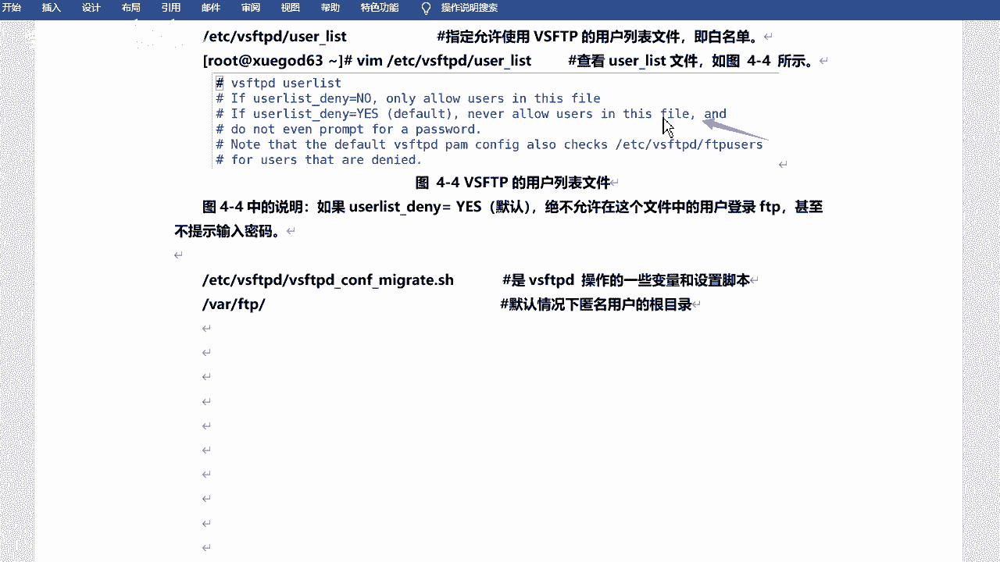
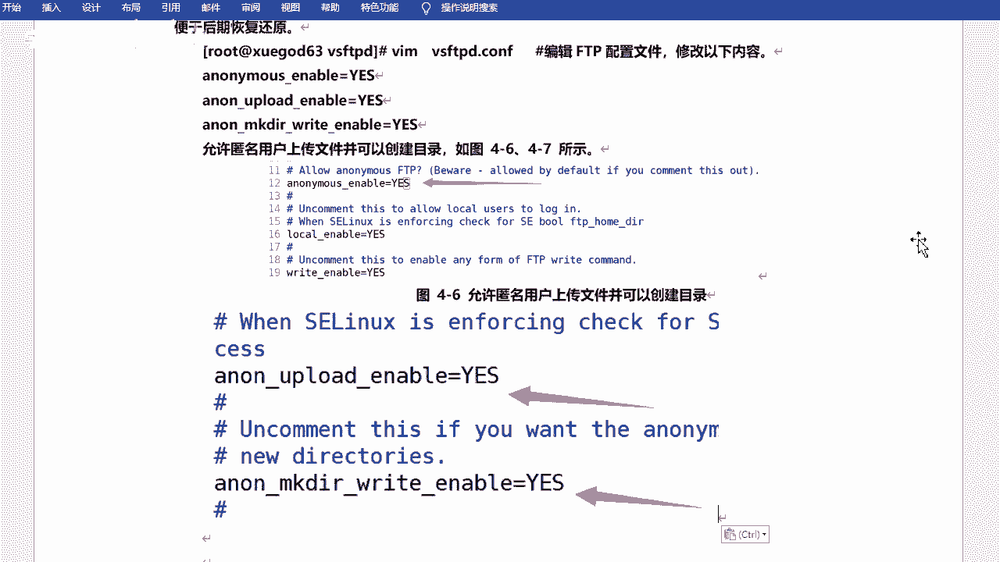

# RHCE8红帽认证课程／自学必备／云计算／rhce／Linux运维 - P9：ftp介绍-设置匿名用户可写 - 学神科技 - BV1L54y1S7qZ

来啊咱们今天的话呢来看一下f t是吧，ftp服务器啊和nfs服务器是吧，今天是两个啊，这个关于咱们的文件共享的是吧，呃首先认识一下ftp服务器是吧，然后咱们装的是呢vs f t p是吧。

然后安装和配置啊，包括匿名访问啊，用户密码的方式访问对吧，然后是n m s n m s，然后配置i m s服务器，并实现开机自动挂载是吧，来啊我们来看一下啊，嗯今天的话呢最好是用到两台机器。

最好是两台啊，如果说你没有的话，用一台引擎启示好吧，因为我需要找客户端，就是咱们去那个连接测一下是吧，也没有什么其他的作用啊，服务端客户端是吧，然后一台的话也行啊，就是你既是服务端，也是这个客户端啊。

也是可以的对吧好，然后咱们来看一下f，看一下这个，f，嗯这个17号的4号的是吧，f t p啊，但是咱们装的呢是vs f t好吧，这个名字你需要注意一下啊，叫vs f t好吧，然后咱们先认识ftp。

ftp的话叫f transfer protocol server啊，就是文件传输协议服务是吧，是在互联网上提供文件存储和访问服务的计算机啊，他们依照ftp协议提供这个服务，文件传输协议是吧。

然后作用化是在internet internet上啊，用来传输文件的协议，就是在网络上是吧，就是在网络上啊，呃常见的ftp服务呢其实有好多啊，有好多就是可以去实现ftp协议的是吧。

可以实现ftp a的啊，呃像windows也有好吧，windows u啊，什么server u啊，ftp server fuza swan是吧，这个都可以去实现啊，就是这个服务的话呢。

不单单是在咱们linux服务器可以做的是吧，windows也可以啊，我内存可以可以啊，包括你像后面咱们会学到的，比如说阿帕奇啊是吧，什么ng格啊啊，什么数据库啥的呀是吧，其实都会有windows版的啊。

因为windows版本的啊，嗯linux的话就是有什么什么pro f t p d啊，就是professional啊，专业的f t t对吧，一个unix平台上或类unix平台上啊。

都有ftp服务器的程序是吧，那么咱们今天讲的是什么呢，今天讲的是vs f t p vs f t p啊，叫什么呢，叫very secure啊，这个翻译挺有意思的，vs就是vs cure是吧。

是一个非常安全的ftp啊，这个呢是一个基于gpl发布的类unix用上使用的f d b的服务器软件啊，基于gpl是吧，这个呢就是开源的一个协议是吧，看看那个协议啊，然后嗯叫vs cure ftp啊。

从名称上可以看出来编制者的初衷是代码的安全啊，它的特点就是说它是一个安全高效稳定的ftp服务器，好吧，这就是vs f t v啊和vs mtv啊，然后呃他呢当然也是也是这个叫呃服务端客户端啊。

叫cs模式啊，cs模式啊，我叫cs架构是吧，这个东西啊，cs是c和s代表的是啥意思，嗯，不是之前打枪那个游戏cs是吧啊你说cs可能这个年龄都比较大了是吧，cs是英文单词啊，你知道是什么意思吗是吧。

client和server，client server就是一个什么呢，就是一个缩写吧是吧，一个代表一个代表这个知道就可以是吧，当然还有bs啊，目前咱们还没说到呢是吧，简单提一下bs嗯对吧。

bs就是浏览器和swit端呢对吧，browser啊，browser嗯，ok cs啊，行那呃cs的话就是它会有客户端，有服务端，是不是有客户端有服务端啊，咱们当然关注的是服务端是吧。

客户端的话其实也有很多客户端啊，就是比如说可以去满足这个协议的工具，都叫客户端是吧，都叫扣的啊，嗯然后它的这个服务啊，今天端口呢是20和21啊，两个比较小的端口是吧，20和21。

呃当然咱们可以看一下service这个文件啊。

它里边会有一些呃会有这个这个这说明的啊，会有记录的是吧，etc service啊，这里边其实有大部分的一些服务所对应的端口啊，它会它会显示的啊，那咱们去找一下ftp是吧，就在这儿呢，对不对。

当然它会有ftp和ftp d data是吧，就是数据啊啊21端口是控制端口啊，20端口是做一个数据传输的好吧，这两个啊这里边其实还有一些其他的呃端口你们也可以看一下是吧。

后期其实学的越多，你会知道的越多啊，不用着急行吧，这是它对应端口啊，20和21是吧，20是数据传输，21是传输命令控制端口，就是建立连接的啊，建连接的啊，嗯然后ftp的话呢它的工作模式呢其实分为两种啊。

两种啊，一种叫主动模式，一种叫被动模式好吧，这个可以来看一下啊，当然最多的用的话呢还是这个主动模式好吧，还是主动模式啊，在这，ok我把这字体是吧看一下啊，行吧，主播的模式啊。

ftp的话呢包含了两个两个通道是吧，控制通道和数据传输到控制通道就是21对吧，20的话就是呃数据传输通道是吧，两种模式呢主动和被动啊，然后这个的话呢是以ftp server作为参照呃，作为参照的。

主动模式的话是服务器主动连接客户端传输，被动模式呢是等待客户端客户端的连接啊，是是这样的一个模式啊，这样区分的，那么主动模式操作工作原理呢主要是看这个啊，首先它会开启21端口啊，啊不是啊。

应该是ftp客户端连接21端口，当然这是服务端开的，是服务端开的啊，然后呢客户端会发送用户名和密码是吧，然后呢客户端随机开放一个端口，一般是要24以上的啊，然后发送port命令到ftp服务器啊。

power的话就是主动的意思是主动的意思啊，然后告知服务器客户端采用主动模式开放端口，f p服务器收到part的模式命令，合同过后啊，通过服务器端口和客户端开放的端口连接，你也可以这样记主动模式呢。

它的这个端口啊，服务端端口啊，它是这个怎么说，是这个这个定定好的啊，就是21和20好吧，就是这个20啊，然后发送数据是吧，过程就是这个过程啊，其实和刚才描述是一样的啊，这边是这个这个呃客户端。

这边是服务端啊，去连接去连接，然后呢20端口服务的20端口给你去去做这个回应好吧，这个回音啊，这是主动模式好吧，被动模式的话呢，那么你的服务端是吧，它会开启一个随机端口去进行这个数据传输啊。

所以说这是一个不一样的地方啊，被动模式呢叫p a s a啊，叫passive的一个缩写啊，就叫被动模式啊，也是客户端连接服务端啊，然后21端口，然后发送用户名和密码，发送完之后呢，呃发送到这个服务端。

服务端在本地开启一个随机端口，这是这是服务端本地啊，开启c端口，然后把开放端口告知给客户端，然后客户端再去连接这个c端口进行数据传输好吧，进行数据传输啊，所以说这个是它不同的工作模式是吧，工作模式啊。

然后就是你可以这样记是吧，主动模式啊，主动模式它开放端口是固定的好吧，就是20和21是吧，非的模式呢是不固定的对吧，当然你也可以以这个呃什么以这个服务端是吧，作为参照物啊，作为参照物就是主动去连接呃。

主动去连接client就是客户端的一个一个端口是主动的啊，如果client是主动连接你的话，服务端的话，那是被动的好吧，看看你怎么方便是吧，看你怎么方便啊好吧，当然它默认的话。

一般默认的话运行方式都是主动模式的啊，如果说你后期想调的话是吧，你可以调成被动模式是吧，这个看看情况啊，一般都是主动的，那咱们来装一装啊，装一装叫vs f t是吧，vs f t p啊。

嗯那咱们这个的话呢是什么呢，咱们这个的话是vs f t p d啊，这个包的名字叫vs f d b d好吧，装的时候这个需要注意一下啊，加一个d是吧，这个直接装就可以，二一斯诺是吧。

咱们目前学的这些服务啊，包啊是吧。

其实都是属于咱们光盘镜像里边自带的啊，就是你装系统那个镜像是自带的啊，就可以直接装了，也不用去配什么网络源和易普源是吧，直接装好了好吧，这个就是服务端啊，这是服务端，然后他有客户端啊。

客户端叫l f t p l f d p啊。

这个是咱们的命令行的好吧，就是linux code命令行的l f d b呃，在在他之前的话呢，有一个叫也有一个叫ftp的一个一个一个客户端啊，但是后来相对升级了嘛是吧，升级成了l ftp啊。

这个你再装一下就可以了，是吧，直接装就行啊，l d l f t的话是一个功能强大的下载工具啊，它支持访问文件的协议f t t f t s h t t p h g p s啊，这些它都可以连接，相当于是吧。

然后l ftp的界面呢类似于一个shell啊，就是让你去输命令的啊，让你输命令啊啊有命令补全啊，历史记录允许多个后台任务执行等功能，使用起来也非常方便啊，还有什么书签啥的。

这个这个是后边后边如果是你们经常去用的话，可能会用到的啊，什么断断续传什么的是吧，它都是支持的好吧，它都是支持的啊，配置文件啊，他呢有几个有几个配置文件啊，有几个主要的是吧，呃vs f c b d。

cf啊，这是一个啊，然后下边是f tb users和user list啊，这三个吧是吧，三个啊，当然了，他们都是在e t c下的vs f d b下是吧，在这儿啊，呃如果说你没装的话，它是没有这个目录的。

也没有这个配置文件好吧，你装好之后它才会生成的啊，这个是它的核心配置文件啊，然后usa这个呢是用于指定的协议，用户不能访问ftp服务器，相当于黑名单啊，这那黑名单有点意思的话呢，相当于是白云单啊。

允许谁来访问好，不允许是来访问啊，这个地方有一个说明是吧，然后你可以看一下，在这啊，其实在配置上面他有说明relist是吧，它是干什么呢，呃如果说有个list是等于它应该是ulist下文件dna啊。

等于yes的话，是绝不允许在这个文件中的用户登录ftp，甚至不提示输入密码，它是有一个配置啊，在这if user list项目denn是吧，等于yes啊，是这样的对吧，是这个意思啊。

就是他他指定的是这个，他指的是这个啊，ftp user看到没有。

就是这个哎呀，这个在哪儿，我看一眼啊，它是一个，b b c a s f c b d，you the list啊，在这就算累死了，呃这个超默认是yes的好吧，默认是yes。

never allow users in this fw是吧，and do not even什么promote for password是吧，就是不允许这个用户。

不允许这个这个当前这个这个这个文件里面用户是吧，缺少n的啊，甚至不给他输密，甚至不给他输密码的机会是吧，就这个意思好吧，这个简单看一下就可以啊。

嗯这是这个文件里边的一个提示，一个说明是吧，一个说明啊，嗯然后对啊，然后的话呢还有还有两个啊，还有两个啊，这两个就不太不太重要了啊，啊不是不太重要啊，是也有两个，但是这两个尤其是这个可能用的不多啊。

这个会用到一个是点s h的一个好吧，v f a d e cf什么maggie s h，这个是vs f d操作的一些变量和设置脚本好吧，这是脚本啊，这个y f t p呢这个比较重要。

这个是默认情况下匿名用户的根目录啊，匿名用户根目录什么意思呢，就是比如说我搭好了ftp是吧，然后别人可以去连接我，对不对，匿名用户啊，就是就是怎么说呢，嗯一会咱们可以看小金明户啊。

就是可以就是没有名字是吧，然后也可以什么母女登录这种的啊，那么他们登录进来之后看到的就是这个这个目录啊，相当于他们近代的根目录是吧，你看看就是他wah f t好吧，往下按f tp啊。

呃目前的话咱们什么都不用做啊，先去给它启动一下行吧，先去给它启动一下啊，就是先不用去改配置文件的是吧，咱们先细细来看一看啊，嗯启动一下服务啊。

system c t l啊，然后start是启动一下vs f t b t这个可以tp的啊，你装好之后它肯定是可以tp的啊，嗯然后enable是吧，设置开机启动啊。

所以咱们去掉able vs f d d啊，这个是开启动是吧，然后然后就可以了啊，然后咱们可以看一下nine state，看一下网络连接情况是吧。

这个其实是看它的一个监听监听端口的啊啊grab ftp是吧，有没有在监听啊，21端口对不对。

也已经在监听了好吧，已经在监听了啊，当然咱们做的时候呢，呃这个环境和配置是吧，都是关掉防火墙和sv ux好吧，都是关掉s1 x方火墙的，看一下有没有监听就可以了，当然目前的话呢它只有21好吧。

目前的话它只有21啊，20呢是吧，20呢它不是监听两个端口吗，是不是为什么少一个呢，对不对，为什么少一个呢，啊我来说一说啊，刚才其实有同学可能会记住啊，就是21的话它是一个控制端口对吧。

就是他会去呃这个连接呀是吧，去验证你的用户页面还是这样子的，20端口的话呢是用来传输数据的是吧，建立起连接之后，然后传数据他才会去用这个端口是吧，所以说啊你得注意一下啊，不要以为哎这好像不对啊是吧。

其实是对的好吧，其实是对的啊，因为没有数据传输，有的话20就开了是吧，有的话20就开了，行然后咱们可以连接试一下啊，连接试一下啊，呃那么当前的话呢我装了一个l s p是吧，装了一个l f t p啊。

然后咱们可以连一下，用这个工具去连一下啊，l f t p总结呢直接连你的ip地址就可以啊，嗯192。168。1。201是吧，哎这样的话就连上来了对吧。

s也可以去查看啊，我这个问号是帮助吧啊问号是帮助啊，就是你可以去这个这个这个干嘛呢，可以去看你可以输什么命令，输入什么命令好吧，这是客户端是吧，这是自呃不是自带的啊，是咱们装的是吧，装的客户端啊。

然后可以推出好，目前先不用操作的啊，这是linux是windows也可以啊，windows也可以啊，呃啊e s d可以推出ctrl d也可以啊，windows的话咱们就可以用那个那个那个目录是吧。

然后就可以去访问了啊，目录就是这个这个叫什么地址栏吧，叫什么是吧，就这个地方啊，还ftp是吧，然后这么写啊，2万杠是吧，然后191681。201是吧，你看它也可以连过来了啊啊这这是这是目录就可以啊。

就是咱们那个进进进我的电脑那个是吧就可以了，然后可以点进来对吧，就可以好吧就可以啊，但是你没有什么权限啊，目前的话你是没有权限的，permission denied是吧。

因为这个的话这个其实就叫匿名登录好吧，匿名登录啊，就是就是没有没有权限的好吧，没有权限的只能去查看呀，甚至有些目录你都不能切换好吧，然后咱们可以设置一下什么呢，设置一下权限是吧。

比如说我可以去什么商店下载啊对吧，可以创建文件啊什么的，对不对，咱们这个权限可以设置一下啊，浏览器啊，对文件夹这种方式也可以的啊，他会给他们去打开啊，用f tp的方式去打开好吧。

f t的方式去打开它是怎么要求的啊，嗯什么呢，在这个地方啊，他说呃要求公司的技术准备一搭建一台功能简单的ftp服务器，允许所有员工上传和下载文件，并允许创建用户自己的目录是吧，以及所有员工上传和下载啊。

然后怎么去分析呢，允许所有员工商量和下载啊，需要设置成允许匿名用户登录，并且允许匿名用户上传功能开启啊，下载的话其实一般都是默认都是允许下载的，上传需要放开啊，上山需要放开啊，呃这个怎么做呢。

因为默认的话它其实是允许匿名用户的啊好吧，但是他没有上传功能，所以说咱们要给他去开一下啊，看一下啊。

这个就得改配置文件了好吧，改配置文件啊，切到吧是吧，e z vs f t t，然后拷贝一下咱们的这个啥啊，拷贝一下咱们的这个配置文件，点cf是吧，然后给他这样写一下啊，逗号点gk啊，这样的话没好大口哈。

sorry大号啊，这样的话呢他会帮我生成一个呃备份是一个备份，然后我直接改它就可以了，修改一下vs ftd加cf，然后找啊ntm啊，就是匿名用户是吧，是否允许用啊，yes啊。

然后什么local enable，yes啊，right enable，yes啊，然后有一个，这个是要手写吗，有一个local，有一个upload，搜搜看也没用啊。

poload upload是上传的意思吧，啊啊在这呢，在这儿呢你看它是默认是默认是禁用掉的是吧，默认禁用掉的啊，然后会显示anonymous啊，a n o n嘛是吧，upload enable。

yes啊，就可以了，然后呢再找一个叫做make de right，哦，在这呢在这呢把它也放开是吧，允许创建用户是吧啊不是允许创建目录啊，没有第2e是吧，这里我给他放开。

他放开啊，当然你也可以手写是吧，你手写也可以啊，然后就不用去找了好吧，你就挨着那个啥挨着那个edge，这个是吧，写也可以的啊，我这个是找的是吧，设置一下啊，行吧，这个直接两个yes，我是给他放开的是吧。

然后我的截图呢是手写的好吧，截图啊，然后在这儿也可以找。

没有好号，是这个号号是多少啊，好好可以，这是29和33。

29 33，你直接搜就可以查，查找就可以好吗，查找就可以了，ok那咱们来试一下好吧，试一下，然后我去这个啥呢，我去重启一下服务好吧。

重下服务让配置生效，restart vs f d d啊，然后咱们来试一下啊，哎我给他关了是吧，我重新打开一个那啥可以打开一个电脑吧。

还是去访问ftp啊，过来，回来之后就从这吧，比如说创建一个文件夹对吧，还是不可以的啊，这边可以吗，啊也不行对吧也不行啊，因为这个其实相当于哪呢。

这个就是跟ml相当于咱们下的f t t就是这个y下的fc选在这是吧。

它这个pub这边有个pop啊，那为什么不行呢，是不是明明我已经开了呀对吧，我已经开了这个权限了，对不对，是这样的啊，怎么可以这样看一下啊，港d是吧，看一下瓦下的ftp ftp一个看看吧是吧。

他是root root的，root root的pub其实也是都是root的，对不对，我可以给它改成什么呢，改成f t的，改成他好吧，给人看啊，只有这样的话，它的匿名用户才有写的权限啊。

这之后改一下ftp ftp下载ftp，我记得pop下吧，在这边创建一个。

然后再来试一下，我在这里吧，创建一下啊，我跟你讲诶可以了是吧，比如叫test好吧，是可以的啊，但是他说重命名时发生错误是吧，好像只能叫新建文件夹啊，不能叫别的，我不能重命名是吧，也是不可以的啊。

这个好像跟权限就没啥没啥关系了吧，留在咱们刚改的是吧。

刚改的那咱们看一下啊，这个其实是什么呢，这个其实是和配置有关系的啊，和咱们权限也没什么关系的啊，不能重命名啊，然后也不能删除这个咱们需要怎样的添加一行，添加一行啊。

叫in one other reenable，yes啊，就是其他的写的权限，1米账号有写权限的，相当于好吧。

就是你才能去改，才能去删除，这个得新加一下啊，etc不是在当前目录是吧，vs f t t在最后吧加一下啊，操作a n n arthur bad，enable等于什么呢，yes是吧，然后我也去重启一下啊。

然后咱们再来打开。

对吧，你说这样的话才可以的是吧，这样的话才可以的，所以说你改的话需要去把配置文件里面再加一条配置是吧。

再加一条配置啊，ok，行吧，这样的话是匿名用户是吧，什么可以上传呀。

下载呀，什么改文件啊对吧，就都是可以的啊。