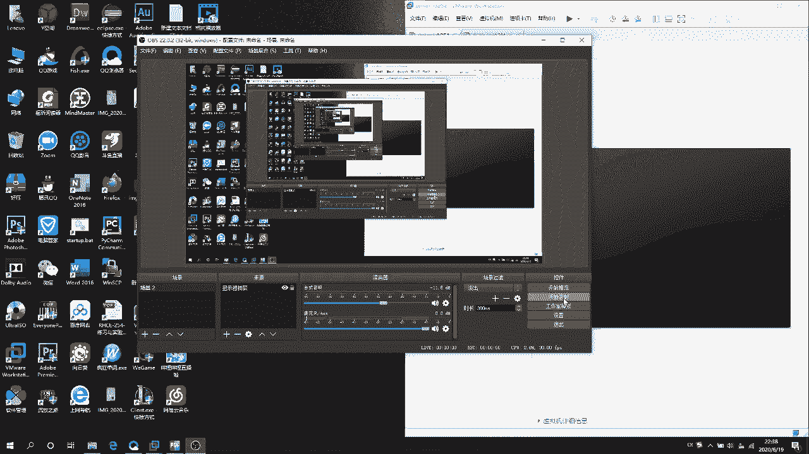
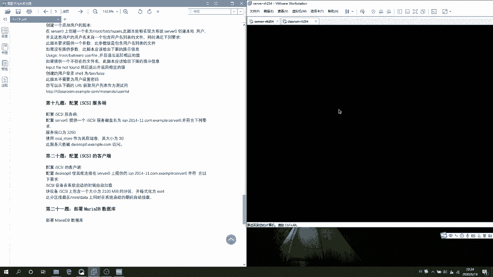
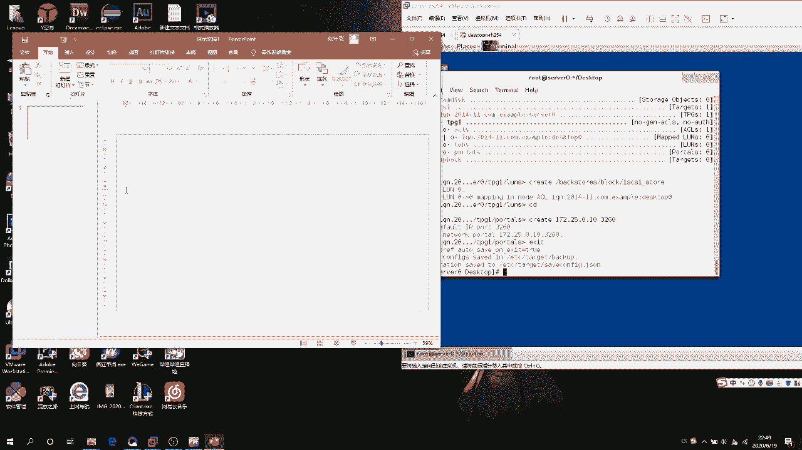
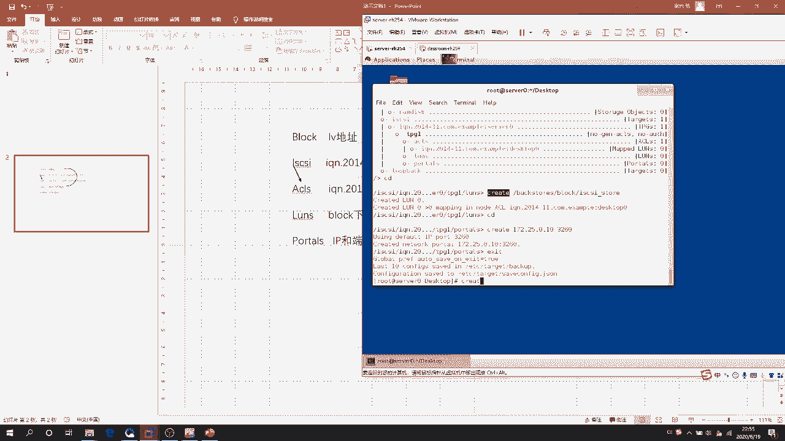
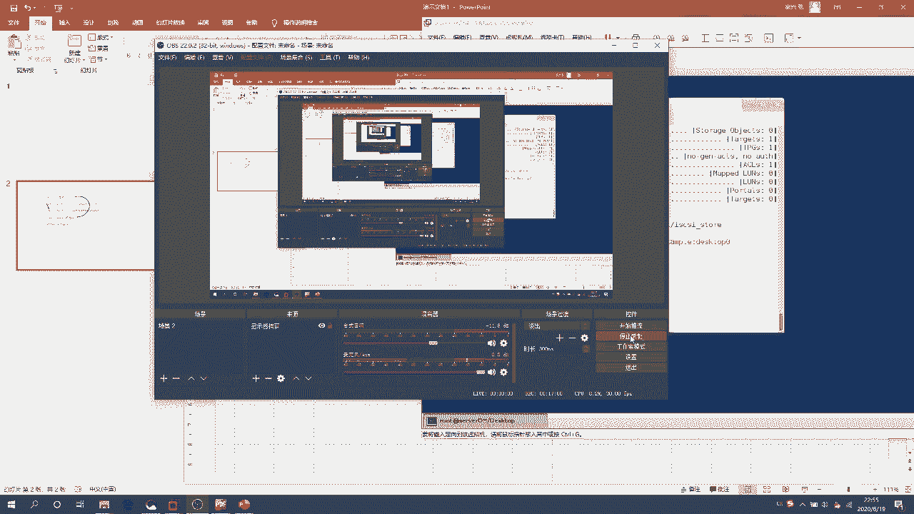

# RHCE课程：P1：iSCSI服务端搭建教程



## 概述
在本节课中，我们将学习如何在Linux系统上搭建一个iSCSI服务端。具体目标是创建一个名为`servera.example.com`的后端存储卷，大小为3G，并确保该服务只能被指定的客户端`serverc.example.com`通过端口3260访问。我们将从磁盘分区开始，逐步完成LVM逻辑卷的创建，并最终配置iSCSI目标服务。

---



## 准备工作与磁盘分区
首先，我们需要为iSCSI后端存储准备一块磁盘。假设我们使用`/dev/sdb`这块磁盘。

1.  使用`fdisk`命令对磁盘进行分区。
2.  创建一个新的主分区，并设置其大小为4G（为后续创建3G的LVM卷留出空间）。
3.  将分区的类型更改为Linux LVM（代码`8e`）。

以下是具体操作命令：
```bash
fdisk /dev/sdb
# 在fdisk交互界面中，依次输入：n -> p -> 1 -> 回车 -> +4G -> t -> 8e -> w
```

**注意**：如果分区后系统没有立即识别，可以使用`partprobe`命令重新加载磁盘分区表。
```bash
partprobe
```

---

## 创建LVM逻辑卷
上一节我们完成了磁盘分区，本节我们将使用这个分区来创建LVM逻辑卷。

我们需要依次创建物理卷（PV）、卷组（VG）和逻辑卷（LV）。逻辑卷的名称需指定为`iscsi_store`。

以下是创建步骤：
1.  在分区`/dev/sdb1`上创建物理卷。
2.  创建名为`iscsi_vg`的卷组。
3.  在卷组中创建名为`iscsi_store`、大小为3G的逻辑卷。

具体命令如下：
```bash
pvcreate /dev/sdb1
vgcreate iscsi_vg /dev/sdb1
lvcreate -L 3G -n iscsi_store iscsi_vg
```
创建完成后，可以使用`pvs`、`vgs`、`lvs`命令分别查看物理卷、卷组和逻辑卷的状态。

---

## 安装与进入iSCSI配置环境
在配置iSCSI服务之前，需要先安装必要的软件包。

使用`yum`命令安装`targetcli`工具包，它是配置iSCSI目标服务的命令行界面。
```bash
yum install -y targetcli
```
安装完成后，输入`targetcli`命令即可进入交互式配置界面。

---

## 配置iSCSI后端存储块
进入`targetcli`环境后，我们的第一步是创建后端存储块。这相当于告诉iSCSI服务，使用哪个逻辑卷作为实际的存储空间。

操作路径和命令如下：
1.  进入`/backstores/block`目录。
2.  创建一个存储块，命名为`iscsi_store`，并指向我们之前创建的LVM逻辑卷设备。

在`targetcli`中执行：
```bash
cd /backstores/block
create iscsi_store /dev/iscsi_vg/iscsi_store
```

---

## 创建iSCSI目标与门户
上一节我们定义了存储块，本节我们来创建iSCSI目标（Target）和门户（Portal）。目标是客户端的连接对象，门户定义了服务监听的IP和端口。

以下是配置流程：
1.  进入`/iscsi`目录。
2.  创建一个iSCSI目标。其名称格式通常为`iqn.年月.域名反写:自定义标识`，这里我们使用`iqn.2020-06.com.example:servera`。
3.  在创建的目标下，进入`tpg1/portals`子目录。
4.  删除默认的`0.0.0.0:3260`监听（允许所有IP访问），然后添加只允许服务器自身IP（例如`172.25.0.11`）和客户端IP（`172.25.0.13`）访问的规则。但根据题目要求“服务只能被客户端serverc访问”，我们通常会在ACL中限制，这里门户可以暂时保留默认或设置为服务端IP。更严格的限制在下一步设置。

在`targetcli`中执行：
```bash
cd /iscsi
create iqn.2020-06.com.example:servera
cd iqn.2020-06.com.example:servera/tpg1/portals
delete 0.0.0.0 3260
create 172.25.0.11 3260
```

---

## 配置访问控制列表（ACL）
为了保证安全性，我们需要配置访问控制列表（ACL），精确控制哪些客户端可以连接到此iSCSI目标。



1.  进入ACL配置目录：`/iscsi/iqn.2020-06.com.example:servera/tpg1/acls`
2.  创建一个ACL规则，规则名称是允许连接的客户端的iSCSI发起者名称。客户端名称通常格式为`iqn.年月.域名反写:客户端标识`，这里我们创建`iqn.2020-06.com.example:serverc`。

在`targetcli`中执行：
```bash
cd /iscsi/iqn.2020-06.com.example:servera/tpg1/acls
create iqn.2020-06.com.example:serverc
```

---

## 将存储块映射给目标
最后一步，我们需要将最开始创建的存储块，映射到我们配置的iSCSI目标上，并指定给允许访问的客户端。

1.  进入逻辑单元号（LUN）配置目录：`/iscsi/iqn.2020-06.com.example:servera/tpg1/luns`
2.  创建LUN映射。这里需要指定两个参数：
    *   `storage_object`：指向我们在`/backstores/block`下创建的存储块路径。
    *   `target`：这个参数在本语境下实际是指定给哪个ACL（客户端）。我们将其指向刚才创建的ACL客户端名称。

在`targetcli`中执行：
```bash
cd /iscsi/iqn.2020-06.com.example:servera/tpg1/luns
create /backstores/block/iscsi_store
# 注意：在有些版本的targetcli中，创建LUN时可以直接关联ACL，命令可能略有不同。
# 通常需要确保在正确的ACL路径下进行映射，或者使用如下格式（如果支持）：
# create /backstores/block/iscsi_store 1
# 然后通过设置LUN的‘alias’或‘mapped_lun’属性来关联ACL。
# 更常见的做法是在ACL目录下为客户端创建映射，例如：
# cd /iscsi/iqn.2020-06.com.example:servera/tpg1/acls/iqn.2020-06.com.example:serverc
# create mapped_lun=1
```
**重要**：`targetcli`的详细操作可能因版本而异。核心逻辑是：在ACL目录下为特定客户端创建映射，指向存储块对应的LUN编号（通常是1）。配置完成后，输入`exit`保存并退出。

---

## 配置流程总结
为了帮助理解整个配置流程中各个目录和对象的关系，可以参考以下逻辑结构图：

*   `/backstores/block`：存放**后端存储块定义**（如 `iscsi_store` -> `/dev/iscsi_vg/iscsi_store`）。
*   `/iscsi`：存放**iSCSI目标定义**（如 `iqn.2020-06.com.example:servera`）。
    *   `tpg1/portals`：定义服务监听的**IP和端口**（如 `172.25.0.11:3260`）。
    *   `tpg1/acls`：定义允许访问的**客户端列表**（如 `iqn.2020-06.com.example:serverc`）。
    *   `tpg1/luns`：将**存储块映射**为目标下的逻辑单元。

整个过程围绕这五个核心位置，创建了五个关键对象，从而构建起完整的iSCSI服务端。

---



## 总结
本节课我们一起学习了iSCSI服务端的完整搭建过程。我们从磁盘分区和LVM逻辑卷创建开始，安装了`targetcli`配置工具，并逐步完成了：
1.  定义后端存储块。
2.  创建iSCSI目标与门户。
3.  配置访问控制列表以限制客户端访问。
4.  将存储块映射给指定的目标与客户端。



最终，我们成功配置了一个符合要求的iSCSI目标服务器，其存储卷大小为3G，仅允许客户端`serverc.example.com`通过3260端口进行访问。