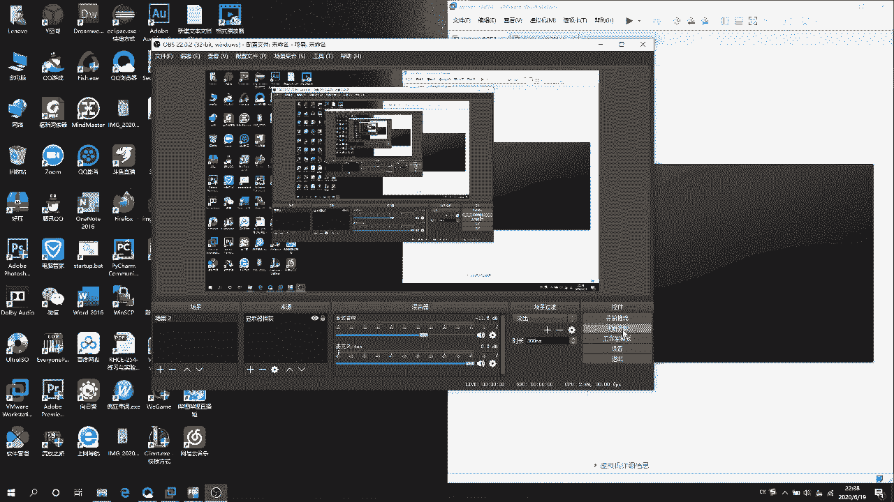

# RHCE——iscsi服务端搭建 - P1：2020-06-19 22-38-20 - 牛魔王同学 - BV1bp4y1D7rc

🤧嗯。哎，同学你好。我们这一次来做一下这个as。然后我来给你们找一下这个。一よ。这是SRC的这个题，然后它是配置S咖RC的服务端。然后他的这个服务端的磁盘名称叫这个。然后并符合下列要求。

端口要求3260。然后后端卷要为这个。然后大小为3G，然后服务只能被客户端的一个三包访问。然后咱们这一回就来配置一下这个。

好。现在开机了。先拼一下。听一下这个客户端，有的时候他不通。哎，通了。通的，然后。你看他这边说的是使用这个作为后端卷，所以说咱们先得先创建这个。嗯，LVM。FDk。杠DV下的SDB。然后就直接创建。

然后他这边说的是3G。因为他这个磁盘嘛，你划分的时候，他肯定要有一部分的去用作去存储那些磁盘的一些信息啊啥的。所以说你在你如果直接划分三级头的话，它下来以后肯定不会是三级，肯定是2。9几。知道吗？

然后所以说咱们就划分4G。给那个4级。然后咱们在LV那块的时候，再把它给化成三级就可以了。这样比较准确一点，省得你那个白费工。其实我之前做过一次这个。直接换成3G的，换成3G以后，后来做LV的时候。

结果就弄不成。没有那么大的空间。然后咱们替一下，然后。LVM是8E。然后W保存结出。然后。咱们装一下这个包。档外。他。Get。CLI。这个就是S8岁的包，然后装上它，装上它直接就。啊。对。C， L。

然后咱们就这就进来了，你看你可以看一下它这里面的目录。然后咱们先来创建。首先第一步呢，我们需要先指定他这个。哎，等会儿等会儿等会儿。不要慌了不要慌。咱们是不是少做了一步，咱们还需要把那弄成LVM，对吧？

PV。然后后面指定他的地址。意为下的。SDBB。如果说你创建这个嗯划分磁盘的时候，划分完了以后，你发这样来。好像说I像是。BLK里面它没有你的这个磁盘的话，你就要需要重新加载一下，然后要用这个命令。

TO。我看啊POST。哪去了？哎呦，我的天儿啊。P，OS，T。这个命积是啥来的？哦，PAR。T。嗯。这个命令要用这个命令重新加载一下你的磁盘，然后你就可以看到你的磁盘了。这个命令比较常用。

但是我还没有记住。嗯，还得背一下。然后咱们就继续。重新加载了以后。然后你就还是这个命令，哎，我什么还没创建完？然后这是PVPV创建了。然，PVS你也可以看一下，然后VG。没记忆。一。杠1微笑的。

SBB嗯。中。VGS可以看一下。然后LV行。刚。杠大L指令大小3G。杠N指定名字，他的个名字，你看这边这不是指定了吗？这个要作为后端文件。然后你直接给他搬过来。然后。然后指定一下V议。LVS看一下。

现在有了，你看现在是3G。现在是3G。然后再用他改的那个名。C两呢。进来2S。然后咱们先CD。到这个目录下。CRE。直接tableable就行。然后。卷的名字，咱们LV叫这个名字，然后这个。

在里边创建的时候，你直接就叫成这个名字就行了。然后再。你看这个这边可以table。DV下的。明记宁下的。直接推推出来。然后这个就创建好了啊，然后咱们在CD。CD到。S卡屏问录下。然后还是这个命令CRE。

听一下，然后这这边呢直接把这个给粘上去。把这个给粘上来。创建这个。什么了？嗯，这就创建成功了，可以看一下。然后创建成功了以后，再CD。在CD到这种目录下，咱们还需要给。服务器来创建一下。

这里面服务器的这个磁盘，咱们就叫做。大家这么久。直接把后码给改成。客户端的就行。然后我们就创建上这个。然后CD的等一下。看一下。现在服务器的创建了，然后客户端的创建在CD。嗯，这回是到。

L有UNS这个我录下。这边要创建的是C2E创建的是。嗯，你刚开始指定的这个卷标就卷的那个位置，就是这个就咱们在这儿创建的这个东西。就这么一坨，你把它弄过来，实实实际上你打一个杠，它直接就推出来了。

直接推出来以后敲个回车上去就完事了。然后再CD。咱们在CD刀这个路下。在CD到这个目录下，然后CREAT。然后这边是要写。IP和端口号。然后咱们看一下这个IP。有个上号遇了的IP啊。172。25点0点。

嗯。嗯，对。哎，不对不对不对。页边不是这么写的啊，别这么写。他这边允许的是不是你看允许的是。服务器端不是这个客户客户端，那你要写客户端的IP。1、空格。后面写上那服务端口号3260。

然后回车这有IP就上去了。然后。EFIT。退出。然后这个服务器端其实就是配已经配置好了。现在。然后大伙儿可能现在有点懵，因为我刚看刚学的时候我也懵。知道吗？因为我刚学的时候我也懵。

咱们来画个图来跟您们说一下那些。我到处创建的那些目录下面。

应该总么记。创建一个文本框。这是第一个。第一个咱们是BL。OCKZ下。那边是LV。一直。然后咱们又到了S咖幕下。又到了这个母络下。然后这边创建的是那个有这门，那么一大坨，我看这边能不能粘上去啊。不是谁？

不是这个是这个。是这歌。咱们这边放的是这个。然后你创建完它以后，他会自己在。自动在下面会创建一个一个的小目录，然后你在小目录里面。再找这个，我刚刚看一下。看一下。看。ACL这么。

然后是ACLS这个模录下。然后这边。因我刚刚贴上了呢？这边放的是客户端的。这边是客户装的，要记着。DESK。O品。好。然后。然们在这个模下要创建。到UNS下然创建。这边是创建的指么吗？

创建的是就是咱们第一个创建的那个目录的地址。就是BLOCK。Z。一致的。就是他咱们创建他的时候，他下面不是。你他底下创建了一个地址吗？就是他下面的那个地址。下的地。然后。后面有。放加这个PO。RB。

S下面。我们创建了一个。IP。和。Bang口。其实你刚开始记的话，可能会有点乱哦。你只需要7组。这两个。一个是服务器端，一个是客户端。然后。这个。这个。粗点是不看不太清了。嗯。粗点。这个也粗的。

这个下面放的是他下面创建的这个LV的地址。然后这边放1个IIP地址就可以了。再看一下这这张图，你看最后创建完以后，咱们是在这边创建了一下，创建的是他。然后他这个他的地址就是。就是这个地址给你看一下啊。

嗯。基本上不显示，好吧。其实就是这一层的地址。他这边会显示。这一层的地址。他这个会映射过去，然后。这边你创建了一个服务器的这个磁盘磁盘这个名字，然后下面是对应的客户端的磁盘名字。

然后这边是IIP就这么简单。其实就在这。哦，5个木落下吧，就在这5个木落下。创建了5样东西，而且他的命令其实都是一样的，都没没多难。其实。命令你看了全都是这个全都是这个单词。你打个CRE。

然后table出来就完事了，就这么简单。

好，这期视频咱们就这样。回家。

