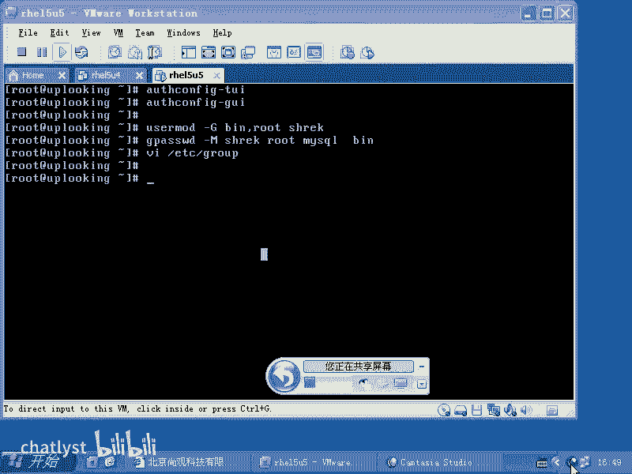
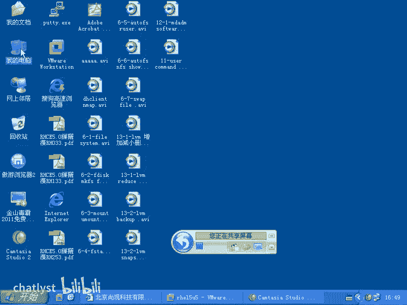
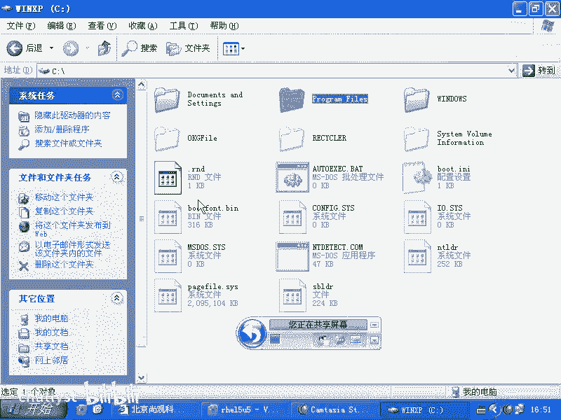
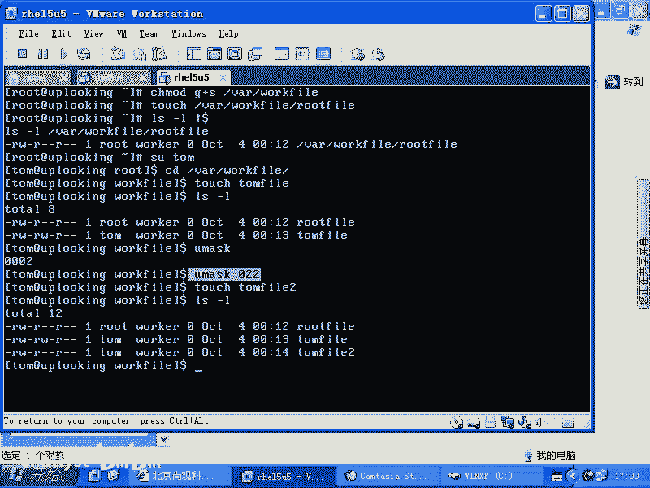
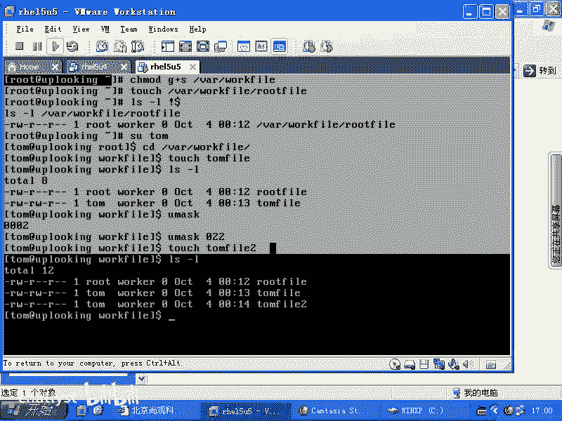
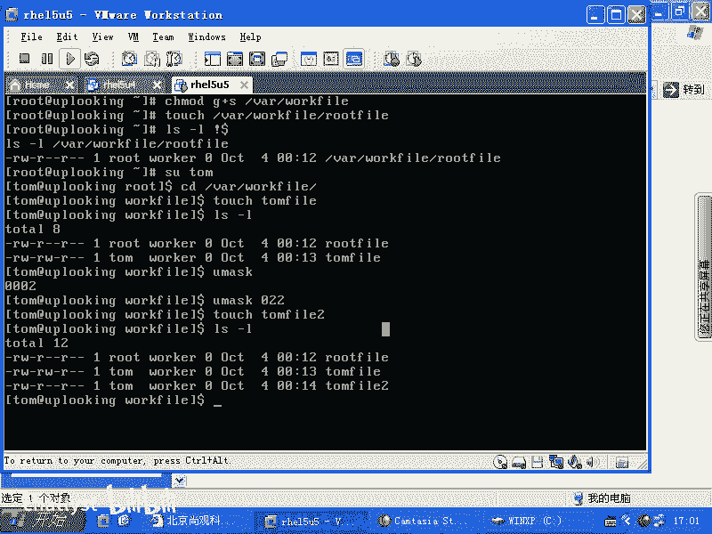

# Linux权限管理：2：SGID权限与协作目录设置





在本节课中，我们将要学习Linux系统中一个重要的权限概念——SGID（Set Group ID）位。我们将通过模拟一个团队协作的场景，来理解如何设置一个共享目录，使得团队成员在其中创建的文件自动归属于同一个组，从而实现便捷的文件共享与协作。

## 概述

传统的Linux文件权限系统基于用户（owner）、组（group）和其他人（others）三个角色。在团队协作环境中，这有时会显得不够灵活。本节我们将重点探讨如何利用SGID权限位，来创建一个高效的团队共享工作目录。

## Windows与Linux权限对比

上一节我们介绍了基础权限概念，本节我们来看看一个实际应用场景。首先，我们可以对比一下Windows系统的权限管理方式。

在Windows NTFS文件系统中，权限管理通过图形化界面进行，相对复杂。它涉及创建组、将用户加入组、区分全局组与本地组，并设置详细的允许或拒绝属性。




相比之下，Linux传统的权限模型较为简单，主要围绕用户、组和其他人进行设置。为了满足更复杂的协作需求，Linux提供了特殊的权限位来进行功能扩充。

## 创建团队与共享目录

以下是创建一个团队协作目录的完整步骤。

首先，我们需要创建用户账号和一个公共的工作组。

```bash
# 创建用户 tom 和 marry
useradd tom
useradd marry

# 创建一个名为 worker 的工作组
groupadd worker

# 将用户 tom 和 marry 添加到 worker 组中
gpasswd -M tom,marry worker
```

接下来，我们创建一个共享目录，并设置其属组。

```bash
# 在 /var 目录下创建共享文件夹
mkdir /var/workfile

# 将该目录的所属组改为 worker
chgrp worker /var/workfile
# 如果需要递归修改子文件和目录，可以加上 -R 参数
# chgrp -R worker /var/workfile
```

现在，我们查看目录的详细信息。

```bash
ls -ld /var/workfile
```
此时，目录的所属组已变为 `worker`，但 `worker` 组的成员还没有写入权限。

## 设置目录权限与SGID位

仅仅赋予组写入权限可能会导致安全问题，例如任何有权限的用户都可以删除他人的文件。我们需要结合使用特殊权限位来解决这个问题。

首先，我们为 `worker` 组添加写入权限。

```bash
chmod g+w /var/workfile
```

为了防止用户删除或修改他人的文件，我们设置粘滞位（Sticky Bit）。

```bash
chmod o+t /var/workfile
```

最关键的一步是设置SGID位。这能确保任何用户在此目录下创建的新文件，其所属组自动继承目录的所属组（即 `worker` 组），而不是创建者自己的主要组。

```bash
chmod g+s /var/workfile
```

现在，让我们验证效果。用户 `tom`（属于 `worker` 组）在目录中创建一个文件。

```bash
# 切换到 tom 用户
su - tom
cd /var/workfile
touch tom_file.txt
ls -l tom_file.txt
```

你会看到 `tom_file.txt` 文件的所属组是 `worker`，而不是 `tom`。因此，同属 `worker` 组的 `marry` 用户也能编辑这个文件（假设文件权限是664）。

## 理解umask的影响

文件创建时的默认权限受 `umask` 值影响。`root` 用户的默认 `umask` 通常是 `022`，这意味着创建的文件对组和其他人只有读权限。

普通用户的默认 `umask` 通常是 `002`，这意味着创建的文件对同组用户有写权限。

用户可以通过修改Shell配置文件（如 `~/.bash_profile` 或 `~/.bashrc`）来永久自定义自己的 `umask` 值。

## 总结



本节课中我们一起学习了SGID权限位的强大用途。通过将共享目录的所属组设置为公共工作组，并为其添加 `g+s` 权限，我们成功创建了一个协作环境。在此目录下，任何成员创建的文件都会自动归属于公共组，极大方便了团队内的文件共享与编辑。这是管理Linux系统协作目录的一个经典且有效的方案。





为了应对更精细的权限控制需求，Linux后来引入了ACL（访问控制列表）作为传统权限模型的扩展，这将在后续课程中介绍。