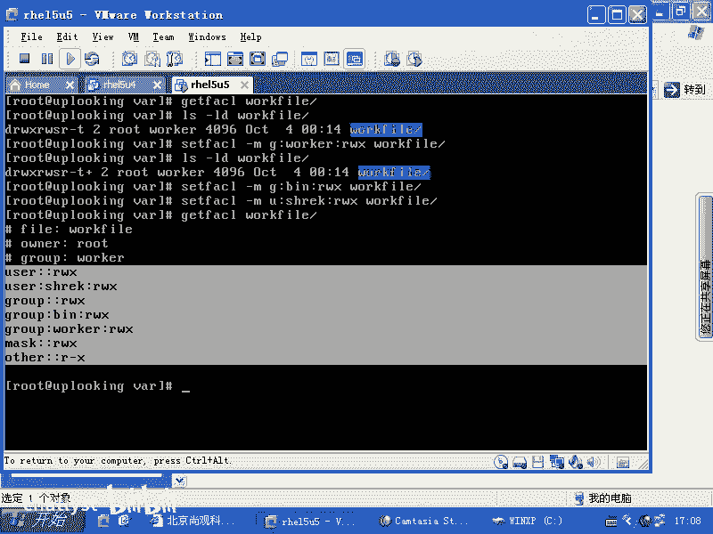
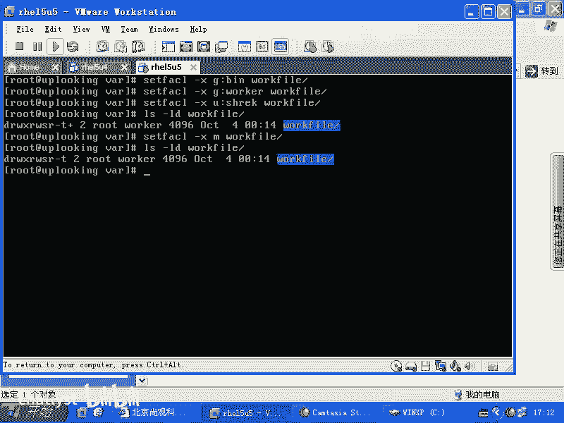

# RHCE教学视频2 - P11：RH133-ULE115-10-3-acl - chatlyst - BV1PJ411D7LB

OK我们现在来看一下，假设说现在我们的系统。要设置一个稍微复杂点的权限。我们看呢有一个开发组，有一个测试组。都要对一个文件的话呢进行写入是吧？但是我又不想让其他others都具有这个权限。

开发组成员的话呢有5个测试组成员的话有3个，他们两个组的话呢，都要对这个文件。或者这个文件夹下所有的文件进行什么写入操作。但是呢我现在又不可能给他给开发组和测试组全部都创建一个组。然后把这个文件的话呢。

全部都改成什么，全部都改成这个拥有组是谁啊？那个组是不是也如我这样子看啊，假如说AA组里面包含着几个用户啊，A1A2A3A4是不是？😊，然后呢，BB组里面包含着什么呢？B1B2啊。

那现在的话呢我有一个文件，这个文件的话呢。这个文件的拥有者啊。或者这个文件夹的拥有者。是什么呢？是66哎，不是。77。775啊这样的权限。那么我现在的话呢，对这个文件的话呢。

是如特用户拥有文件夹是如特用户拥有。然后呢，呃我到底应该是AA组拥有者，是他的拥有者呢，还是BB组，是他的拥有者拥有组？这两个组的话，我都想让他们具有什么写入的权限，是不是？

对这个文件夹就是我现在有一个叫做code。啊。扣啊这样的一个呃。这样的一个目录是吧？这个目录话呢我就想让所有的这这9个人全部都写入，我该怎么做？一般的做法是什么？是吧。毫无疑问是不吧？啊。

但是实际上的话这不是标准做法啊，那775，那么现在我想让两个组的话都具有什么这个权限。那我又不能把他们再加入到再加入到1个CC组，是不是把这把这6个人加入到CC组，然后让他们具有什么都是具有写入权限。

这就特别慢，或者说特别累，所以我们现在的话呢就有叫做ACL的东西。那我们能不能的话呢，同时让AAA和BBB两个组的话都具有写入权限呢？能不能呢？😊，这样的话呢。

我们就用个ACLACL的话呢是对传统权限的一个扩展。ACL的话呢呃我们以前啊在HE13HE14的时候，你需要VI文件重新去啊mount。但是呢我们为了讲这个课的话，兼容性更好一点。

就是你在以前版本当中也能用。那你可能首先要怎么样呢？VIETC下的FSTAB是不是？然后呢，在那个选项里面，比方说我去加载跟分区是吧？是吧让它跟上嘛，那么是EXT3的分区是吧？

DEFAULTS是不是加上一个逗号，什么ACL必须加上去。知道吧？你不加的话是不不支持的呃。😊，但是呢现在啊R715不用了。不用，那你就直接怎么样，直接可以用了。啊，如果以前的版本的话，改完以后。

还要mount杠O。remount什么根把根再重新mount下，但是现在不用了，现在怎么说呢？现在就直接用命令就好了，你可以用什么set FACL是不是？然后呢，加上一个杠M表示我要添加一个权限。

这个权限的话是什么呢？是。😊，组针对什么呢？冒号AA组的AA组的他们的话呢拥有个什么权限呢？RWX的权限对于什么呢？抠。扣s啊这样的一个目录啊，具有一个这样的权限。然后呢，我再sFACL杠M。

再一个组冒号什么呢？BBB啊，冒号RWX。这样。清楚了吗？这样设置完以后的话呢，就可以让这个目录或者这个文件同时对多个组或者多个用户具有多重的这个权限。比方说一个用户是这个权限A权限。

另外一个用户是B权限，还有一个用户是C权限，你添加多少都没有关系，添加多少都没有关系。这样的话呢就可以让。我们刚才那个问题的话迎刃而解，是不是我不用那么麻烦的去设定。

我可以为多个用户或者多个组设定多种权限啊，你可以用get。FACL来获得这个信息。明白了吗？我们在另外一边的话给大家看一眼啊。现在默认情况下，我去用get FACL的时候，看到的就是三种。

就是传统的三种UGO是不是user group和others。那么现在的话呢，我用。LS杠LD，然后加上一个work file的话呢，也看到的是这样，这就是一个目录，是不是这个目录的话呢。

它的权限就是什么UG。😊，O是不是啊有GO那现在的话我想给它设定权限了，额外去设定权限了。我怎么设定呢？用set FACL加上一个杠M，然后呢组什么组呢？我给。😊，沃er。组设定一个什么呢？RWX权限。

work file啊设定完了以后，我第一次设定设定完了以后，你再去看。这个地方就会加上一个特殊的字符，就是加。表示它有额外权限，不只是三种权限了，明白了吧？

现在的话呢我就不用去mount干 over remount了。因为那是以前的版本需要做到的是吧？现在的话直接可以用。然后接下来的话呢，我们再怎么样呢？再去用。set FACL再给另外一个账号。

比方说给并这个组啊，然后再去添加一个权限，然后我还可以给一个什么呢？我还可以给一个用户，用户的话就是U啊，哪个用户呢？比方说shack用户1个RWX权限，我这边都设置好，然后你可以用一个什么。😊。

get FACL然后来看一下。这时候的话，你刚才设定的种种权限的话，全部都会在这边有。看到了吗？你刚才添加了一个呃，我刚才添加了一个group组，并组还添加了1个12个账号。

是不是是不是多加了三条规则进去啊？

但是呢你会发现组这边有两个，一个用户这是三条是吧？好像又多了一个什么musask，是不是musask是自动添加上去的？musask的意思就是说我们最多我们的权限啊，我们比方说添加了100条新增的权限。

但是这些所有添加的权限，它的最大权限是不能超过什么musask。那么现在我们的mask的权限是不是RWX是不是他们添加的那三条规则是不是都没有超过RWX权限。你说废话，这不是最大缺限吗？😡。

我们把它改小一点CH呃s FACL是不是杠MM啊，我把M设置成什么呢？设置成RW的权限，或者RX的权限，然后呢给work。😊，是不是这样了一回车以后。😊，是不是我就把mask这个地方改成RX的权限了？

没有W了，是不是？那么我们看一下刚才添加的这几个权限会是怎么样的，好不好？然后我们看啊再用get FACL来看。😊，也就是说我刚才添加的权限都不能超过musask的权限，是不是？

我们再用get F呃ge FAC啊一看。😡，刚才这边的话呢，后面光秃秃的，是不是？现在的话呢都出现这些东西，是不是？这些东西表示什么呢？我下设置了musask的值是R杠X，是不是？

那么他们设定的权限是RWX，但是实际生效就是什么？RX也就是我添加的这些额外的权限，除了user的。😊，其他的权限都受到什么musask的限制。😡，明白了吧。这就是mask的作用，清楚吧？😡，啊。

OK这个时候你再去用LS到LD，然后呢work。呃，fi要去看他的这个权限的话呢，就是加啊，这个加号就一直在这边。那么有很多人会说，老师，我什么时候的话，我能回复成最初的状态是吧？

我不想要这个额外的这些乱七八糟权限了，我觉得太头痛了。那么我们是不是要一个一个删除啊？一个人删除怎么呢？怎么删除呢？那么你用set FACL。然后呢，杠X是删除。

把G啊把比方说啊并这个组的这个权限删除掉。那么这样的话呢，把work file删除掉，是不是再删除什么呢？再删除。我。worker啊删除，然后再去删除这什么呢？sharack这个。删le这个用户的啊。

删除这三条以后，你再去看。发觉还是有加号啊，你不看还是有加号，为什么呢？因为我们是不是没有删除那个mask。是吧再最后删除一个什么？嗯。啊，再把mask的删除。然后这样的话呢，它就恢复成最初的状态了。

看到了吧。这就是ACL。访问控制列表。这个访问控制列表很多人的话呢都习惯跟呃cisco设备里面那个ACL相提并论，其实没有什么没有什么区呃，没有什么冲突啊，就没有什么关系。ACL叫访问控制列表。

那我既然可以有IP命令IP这个访问，就是路由访问的这个访问控制列表，我这样也可以有文件的访问控制列表是吧？我还可以对某个对象有访问控制列表，这都可以有啊，所以这就是什么呢？这就是我们的ACL啊。

ACL有没有问题，这个地方。😊，就是我们能针对一个文件设定多种超出三种权限是吧？四种、5种、6种都可以超出啊，这是反问控制列表，有问题吗？

没有问题是吧？

