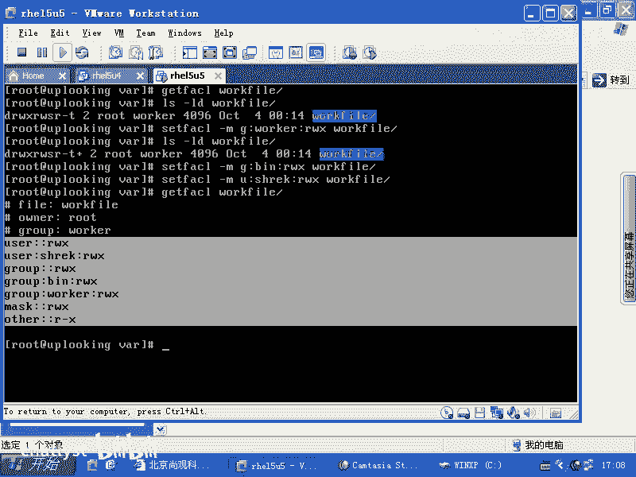
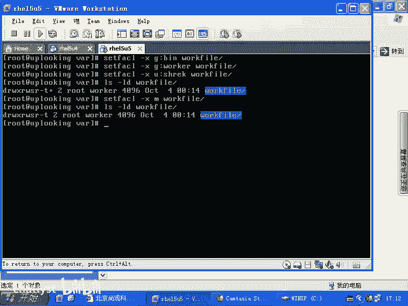

# Linux权限管理：2.3：访问控制列表（ACL）详解 🔐

在本节课中，我们将要学习Linux系统中的访问控制列表（ACL）。ACL是对传统UGO（用户、组、其他）权限模型的扩展，它允许我们为一个文件或目录设置更精细、更复杂的权限规则，例如同时允许多个用户或组拥有不同的访问权限。

## 概述

传统的Linux文件权限系统基于所有者（user）、所属组（group）和其他用户（others）这三个角色。但在实际工作中，我们可能会遇到更复杂的需求。例如，一个项目目录需要同时允许“开发组”和“测试组”的成员写入，但又不想让其他无关用户拥有此权限。使用传统的组权限管理会非常繁琐。本节介绍的ACL功能，正是为了解决这类问题而设计的。

## ACL的基本概念与启用

上一节我们介绍了传统的UGO权限模型，本节中我们来看看如何超越这种限制。ACL（Access Control List，访问控制列表）允许我们为单个文件或目录定义多条访问规则。

在较旧的Linux发行版（如RHEL 5/6）中，使用ACL前需要手动在文件系统挂载选项中启用它。但在现代系统（如RHEL 7/8）中，ACL通常已默认支持，可以直接使用相关命令。

**核心命令：**
- 设置ACL规则：`setfacl`
- 查看ACL规则：`getfacl`

## 设置ACL权限

假设我们有一个目录 `/code`，需要同时赋予 `developers` 组和 `testers` 组读写执行（rwx）权限。

以下是设置ACL权限的基本步骤：

1.  **为目录添加组权限**：使用 `setfacl -m` 命令为指定组添加权限。
    ```bash
    setfacl -m g:developers:rwx /code
    setfacl -m g:testers:rwx /code
    ```
    这条命令的含义是：修改（`-m`）ACL，为组（`g:`）`developers` 赋予对 `/code` 目录的读、写、执行权限。

2.  **为用户添加特定权限**：ACL同样可以针对特定用户设置权限。
    ```bash
    setfacl -m u:shack:rwx /code
    ```
    这条命令为用户 `shack` 单独设置了rwx权限。

## 查看与管理ACL权限

设置完成后，我们需要查看和管理这些规则。

1.  **查看ACL规则**：使用 `getfacl` 命令可以清晰地看到所有ACL条目，包括我们添加的以及系统自动生成的。
    ```bash
    getfacl /code
    ```
    输出会显示用户（user）、组（group）、其他（other）的权限，以及我们额外添加的规则。

2.  **识别ACL文件**：当一个文件或目录设置了ACL后，使用 `ls -l` 命令查看时，权限位末尾会显示一个加号（`+`）。
    ```bash
    ls -ld /code
    # 输出可能类似：drwxrwxr-x+ 2 root root 4096 ...
    ```
    这个 `+` 号表示该对象拥有扩展的ACL权限。



## 理解有效权限掩码（mask）

在查看ACL时，你会注意到一个名为 `mask` 的条目。**mask定义了除所有者和“其他”用户之外，所有ACL条目（用户和组）所能拥有的最大有效权限**。

例如，如果将mask设置为 `r-x`（读和执行）：
```bash
setfacl -m m::rx /code
```
那么，即使你为 `developers` 组设置了 `rwx` 权限，该组成员实际有效的权限也只有 `r-x`，写入（w）权限会被mask屏蔽。所有者（user）和“其他”（other）的权限不受mask影响。

**mask是一个重要的安全特性，用于集中控制赋予组和指定用户的最高权限级别。**

## 删除ACL规则

如果你需要移除已设置的ACL规则，可以逐条删除。

以下是删除ACL规则的步骤：

1.  **删除特定条目**：使用 `setfacl -x` 命令删除指定的用户或组规则。
    ```bash
    setfacl -x g:testers /code  # 删除testers组的ACL条目
    setfacl -x u:shack /code    # 删除用户shack的ACL条目
    ```

2.  **删除所有ACL规则**：要完全清除一个文件的所有ACL规则并恢复为标准UGO权限，可以使用 `-b` 选项。
    ```bash
    setfacl -b /code
    ```
    执行此命令后，`ls -l` 输出中的加号（`+`）也会消失。

## 总结




本节课中我们一起学习了Linux的访问控制列表（ACL）。ACL是对传统权限系统的强大补充，它允许我们为文件或目录设置超越“用户-组-其他”模型的复杂权限。我们掌握了使用 `setfacl` 和 `getfacl` 命令来添加、查看和删除ACL规则，并理解了有效权限掩码（mask）的作用。通过ACL，我们可以轻松实现诸如“允许多个组对同一目录拥有写入权限”这类精细化的权限管理需求。