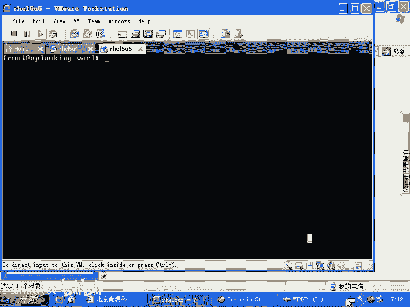
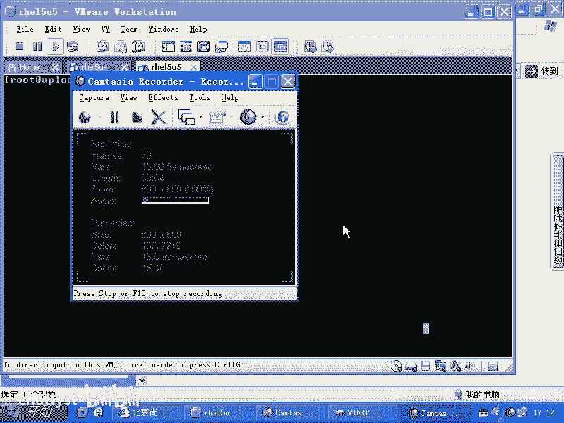
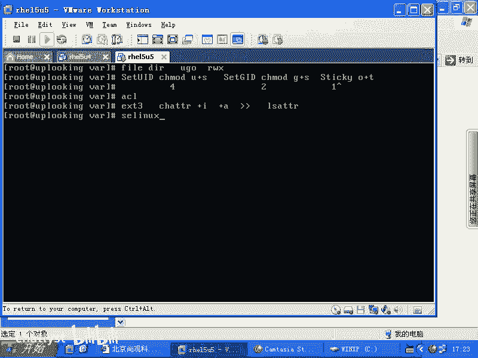
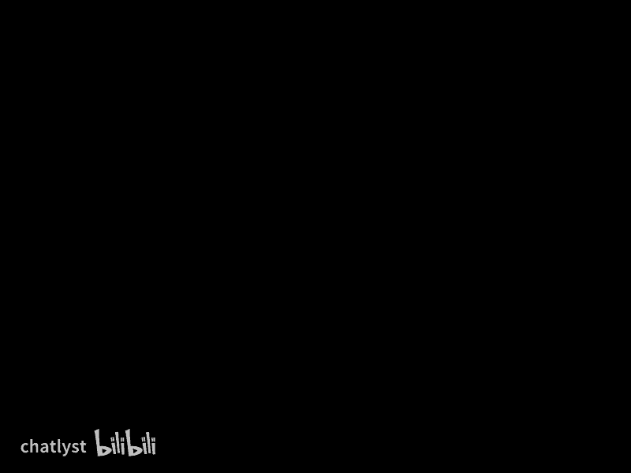

# RHCE教学视频2 - P12：RH133-ULE115-10-4-chattr - chatlyst - BV1PJ411D7LB

前那前。

就是咱们同学在问的话呢，就是说如果要是呃就是说我们设定了ACL是吧？然后或者设定了很多权限以后，以哪个为准是吧？那么你看从上到下不是有个排序吗？get FACL的时候不是有个排序吗？

就是getFACL的时候，那个排序当中谁排前面你就以谁为准。你就排在前面的话呢，是最先执行的。啊，也没有权限的合并，也没有权限的什么这种什么综合一下，或者说理性的去考虑，没有这些东西，它就是机械的。

第一条有没有第二条符合不合，第三条符合不合，就这样。好，我们看一下的话呢，另外一种权限就是我们现在实际上总结一下，系统当中应该是有5种权限。第一种权限的话就是我们什么UGO是吧，加上减去什么。

加上减去RWX这是最基本的权限，是不是？这个最基本的权限的话呢，实际上的话针对user的和针对什么呢？directed的啊都不一样都不一样，是不是？那么目录的权限R是代表什么，读代表什么，写代表什么？

😊，是吧啊R就读啊W写X代表什么？是不是？那么目录的和用户的就不一样啊，针对啊不是目录的和文件的就不一样，fill啊，那头都大了。fi和DR的是吧？R呃针对U。GO这三种角色。

也就是用户group和others是吧？他们的话呢三种用户可以有三种权限，是不是？就是说用户他可能具有R权限，或者具有R和W权限，还可以具有什么RWX权限，是不是？那么这样的权限的话呢。

对于就这三种权限的话，对于文件和对于目录是不是它是不一样的？那么对于目录来说，X权限是最重要的，没有X权限，你就没有办法进入什么目录，是不是也没有在办法在目录下的话去做任何操作。啊。

比方说LS命令都不行，有R和有X的情况下，你才能LS是不是？所以一般的目录的话，这权限都应该是什么？R和X。那所以的话我们看到系统当中绝大多数的目录都是什么7555的话，就代表others是可以进入。

但是它不能什么改动任何文件，是不是？这是目录。然后后来的话我们说传统的权限太烂了，烂到什么程度呢？就是说有很多最基本的功能，连操作系统本身它自己他都看不过去是吧？于是他不得不做了一个什么大漏洞出来。

是不是？这就是我们非常有名的什么set UID是不是还有什么呢？set。😊，GID是不是还有什么呢？S。😊，是吧。这三种曲线setUID的话，你可以用CHMOD是吧？U加上一个。S来设定是不是？

然后setGID的话呢，你可以是CHMOD是吗？呃，G加上一个S是不是来设定CKV的话呢，就是什么O加上一个T是吧，来设定。所以这是最呃就是说就是。最简单的这种设置方法。

当然你也可以数字的方式来设定是吧？set UID的话就是四什么什么，后面三个数字是吧？然后呢，如果GID的话，就是说R是吧？然后呢，那个CV的话是一后面三个数字。😊，对吧因为它的话呢。

就比方说我们说通常755是不是？那如果要是你前面加上1个4755，那就是什么sUID就质一了，是不是？如果要是你想setUID和s GID全部都质疑，那就是什么6755是吧？就是CH。😊。

MOD是不是这样的话呢加一个文件，这就是setUID和s GID同时质疑是不是？如果要全都质疑的话，那就是什么7755是不是？😊，这边的话呢，我就说了这个数字。那这个地方的话呢，sUID是什么？

你可以数字是4是吧，这个地方是什么R是不是这个地方是。一是吧后来的话呢我们又给大家讲了一个什么ACL的故事，是吧是？ACL的话呢，就是说unix世界当中也忍受不了自己unix的这个权限了，是不吧？

于是的话呢在pos规范里面规定所有遵循po规范的操作系统都必须得支持什么呢？post自己定制的什么ACL。那么我在最开始使用ACL的时候，当时的话呢，linux下根本没有资料说这个ACL该怎么设。哎。

我搜来搜去发觉有个什么lar的手册，就说我们那个s的那个unix系统的手册。那里面的话有这个命令。哎，我就试一下，我在这个linux里面试一下，哎，一模一样。😊，什么原因呢？

就是大家都遵循什么pos的规范，明白吧？所以的话呢在我们的传统的其他的unix系统里面，它要支持的话，也是一样的用法，一模一样的用法，清楚了吗？好，ACL那么还有的话呢就是我们最底层的文件系统的驱动呃。

文件系统的这个呃这个相当于权限，它是怎么设定的？它是这样的CHATTR啊，它可以设定。你要说我就要加上一个I啊，如果我给一个文件加上一个I属性的话，这个文件就是任何人都不能改动，谁都不能改动。

除非是有一个人把它的I权限怎么样，给它减I就给它去掉了。这I的这位的话呢，给它治至就是给它去掉了，去掉以后的话，别人才可以写，别管你是root还是谁，只要加了I权限。

那么我们的呃EX3文件系统就相当于什么呢？是一条不认人的狗。😊，当他你告诉他说什么，从这儿经过的时候，就给我咬一口是吧？不要让任何人过去。那么你不管谁过去，是我们的这个总统过去还是什么呢？

还是普通老百姓过去，还是减破二的过去是吧？还是你开着什么车机过去，他全部都什么咬一口，不让你过。所以这个的话呢，ES3的这个文件系统的属性，它是一个非常低层次的属性，他不会认你的UID和GID你明白吧？

他不会认它就是一个最底层的操作系统的一个接口，把那个写入的操作就全都给你封吗，疯掉了。所以CHATTR加I如果要是你有一个文件不想让任何人去改动，那你就把它加上1个I参数。啊，等加的I参数。

那么还有一个常用的就是什么呢？加上1个AA参数的话呢，是什么呢？就是我这个文件我并不是不想让别人改，但是呢你不能改我的内容，你只能往里面去添加内容，是不是？这样的话呢，就是你只能往里面去追加东西。

也就是说改完这个参数以后加A以后，你只能是什么呢？用一个两个大于号往里面去追加东西。😊，啊，往这个文件里面去追加东西是可以的，改任何原有的东西都是失败。也就是也是不允许改了。

只不过的话呢是不允许改原本的东西，你要往里面去追加东西还是可以的，明白吧？这个的话就是加A啊，还有很多其他属性，你可以用一个什么命令呢？看一下呢，用LSATTR来看一下，很简单啊，我们可以看一下啊。😊。

用LSATTR，然后你看下当前目录下这些文件都没有加什么呢？任何的选项看到了吗？这个每一位数就是一个什么？就是一个属性。那我这样的CHATTR，然后呢加上一个I，然后呢给A点SH加上一个I。

加一了啊加I啊。加I以后的话呢，再去看。那这时候我们的ADSH就加了个I是吧？然后呢，我往里面的话呢，去我去VIADSH他就告诉我这是个read only的文件。是不是read only的文件。

这个文件是不能改的。这个read only的文件不能改，然后呢，你往里面以其他方式去写入，也不行。追加过去也是penba里碳。你看到penba里那实际上不是权限的问题。

而是文件系统已经把这个写入的属性给关掉了。啊，我们除非怎么样呢？CHATTR是吧，减去I是不是A点SH减去I以后的话，你再去往里面去添加，这是一点问题都没有啊，改的话也一点问题没有。

如果要是我们的这个加A属性的话呢，就是我我往里面的话呢去追加的话呢，是可以的。😊，哦。我往里面套去追加是可以的。我这样的大于号就是清空掉原本的是吧？再往里面去添加行不行呢？拒绝啊，然后呢。

我们如果要是往里面去追加的话。他就可以。啊。再回车再回车，这都可以。那么去tail啊。taililA点SH它在里面的话呢，几个A的话都在，对吧？只要改原本的内容就不允许，所以这就是什么呢？加A属性。

还有其他的属性，你可以看一下什么man pageman。CHATTR这些属性的话呢，我们用的最多就是I和A啊。I和A。那么比方说大A属性是干嘛的啊，小A属性干嘛的？小C属性是干嘛的？

这边都有非常多的这个介绍。因为时间的就是这个时间的话呢，推移的比较就是就是比较快啊，就是现在的话呢，很多命令的话都已经很少去用了。所以我们特别少去关注这里面的属性，可能现在还有意义的话呢，就是I和A。

比如说你这个当幅命令，如果当幅命令你不怎么用，那你这个D属性就没有用了。是不是啊地属性就没有没有用的。好，这就是我们所谓的什么呢？各种权限。我们现在给大家介绍了四种权限，是不是？那么还有的话呢。

第五种的话就是SElinSE Linux的话呢，它可能会成为困扰我们很多服务不能运行的一个因素。但是这个的话呢，我们在之后的话会给大家再介绍。好吧，这五种权限。

O今天的话呢课程话。😊。

