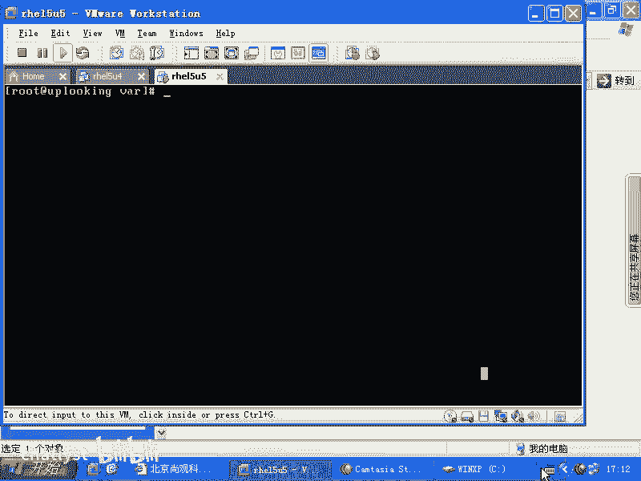
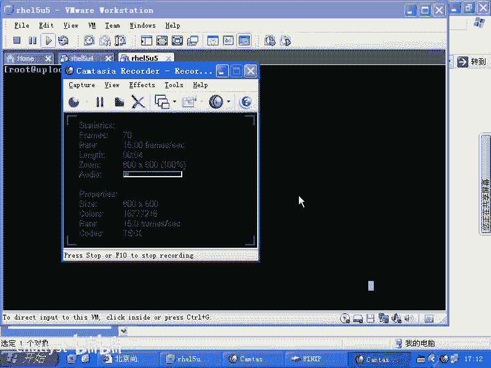
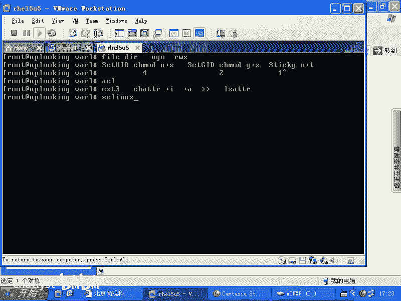

# Linux权限管理：2.4：文件系统属性chattr





## 概述

在本节课程中，我们将学习Linux系统中的第五种权限管理机制——文件系统属性。我们将重点介绍`chattr`和`lsattr`命令，它们用于设置和查看文件在底层文件系统上的特殊属性。这些属性提供了比传统权限更严格的访问控制。

上一节我们介绍了ACL访问控制列表，本节中我们来看看文件系统级别的属性控制。

## 权限机制回顾

在深入讲解`chattr`之前，我们先总结一下Linux系统中已介绍过的权限类型。

以下是Linux系统中主要的五种权限机制：

1.  **传统UGO权限**：针对用户（User）、组（Group）和其他人（Others）的读（R）、写（W）、执行（X）权限。文件和目录的RWX含义不同。
    *   目录的X权限代表可进入目录。
    *   命令格式：`chmod ugo+/-rwx file` 或 `chmod 755 file`

2.  **特殊权限位**：用于弥补传统权限的不足。
    *   **Set UID**：使执行者临时拥有文件所有者的权限。设置方法：`chmod u+s file` 或 `chmod 4755 file`
    *   **Set GID**：使执行者临时拥有文件所属组的权限，或使目录中新创建的文件继承目录的组所有权。设置方法：`chmod g+s file` 或 `chmod 2755 file`
    *   **Sticky Bit**：常用于目录，确保只有文件所有者才能删除该目录下的文件。设置方法：`chmod o+t file` 或 `chmod 1755 file`

3.  **ACL访问控制列表**：提供更精细的权限控制，可以为特定用户或组设置权限。遵循POSIX规范。

4.  **文件系统属性（chattr）**：由底层文件系统（如ext3/ext4）直接支持的属性，提供强制性的、不区分用户的访问限制。这是本节的重点。

5.  **SELinux安全上下文**：一种基于强制访问控制（MAC）的安全模块，我们将在后续课程中介绍。

## 文件系统属性chattr详解

`chattr`命令设置的属性作用于文件系统驱动层。它像一条“不认人的狗”，一旦设定，无论操作者是root还是普通用户，只要触发规则就会被阻止。它不识别UID/GID，只执行最底层的访问控制。

### 查看属性：lsattr

使用`lsattr`命令可以查看文件或目录的文件系统属性。

```bash
lsattr [文件名]
```
如果输出为空，则表示该文件没有设置任何特殊属性。

### 设置属性：chattr

`chattr`命令的基本语法如下：

```bash
chattr [+/-][属性标识] [文件名]
```
*   `+` 表示增加属性。
*   `-` 表示移除属性。
*   `属性标识` 代表具体的属性，如 `i`, `a` 等。

以下是两个最常用的属性：

**1. 不可修改属性 (i)**

为文件设置`i`属性后，文件将变为不可修改：不能删除、重命名、修改内容，也不能创建指向它的链接。即使是root用户也无法直接修改。

*   **添加i属性**：
    ```bash
    chattr +i filename
    ```
*   **尝试修改**：使用`vi`编辑或`echo`写入都会失败，提示“Read-only file system”或“Permission denied”。
*   **移除i属性**：
    ```bash
    chattr -i filename
    ```
    移除后，文件即可恢复正常读写。

**2. 只追加属性 (a)**

为文件设置`a`属性后，文件内容只能追加，不能修改或删除已有内容。

*   **添加a属性**：
    ```bash
    chattr +a filename
    ```
*   **允许的操作**：只能使用追加符号（`>>`）向文件末尾添加内容。
    ```bash
    echo "new content" >> filename
    ```
*   **被禁止的操作**：
    *   使用覆盖符号（`>`）清空并写入会失败。
    *   使用编辑器直接修改文件原有内容会失败。
*   **移除a属性**：
    ```bash
    chattr -a filename
    ```

### 其他属性

`chattr`还有其他一些属性，例如：
*   `A`：不更新文件的访问时间(atime)。
*   `S`：同步更新（数据立即写入磁盘）。
*   `c`：压缩存储（需要文件系统支持）。
*   `d`：使用`dump`备份时跳过此文件。

你可以通过`man chattr`命令查看所有属性的详细说明。但在日常运维中，`i`和`a`属性是最常使用的。

## 总结

本节课中我们一起学习了Linux的第五种权限机制——文件系统属性。
*   我们回顾了UGO权限、特殊权限位和ACL。
*   重点掌握了`chattr`和`lsattr`命令的使用，理解了`i`（不可修改）和`a`（只可追加）这两个核心属性的作用与效果。
*   认识到`chattr`设置的属性是文件系统级别的强制限制，优先级极高且不区分用户身份。




合理使用`chattr`可以有效地保护关键配置文件（如`/etc/passwd`， `/etc/shadow`）或日志文件不被意外修改或删除，是系统安全加固的一个重要手段。