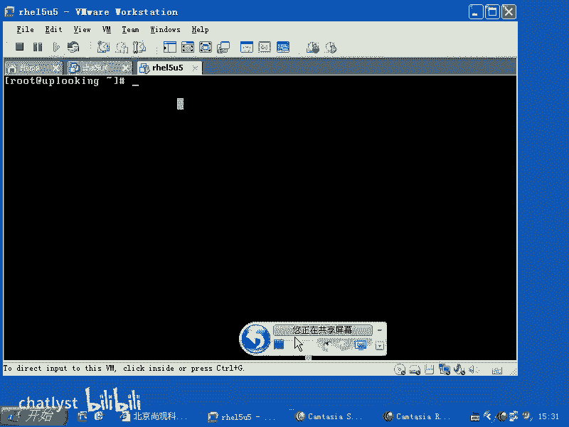
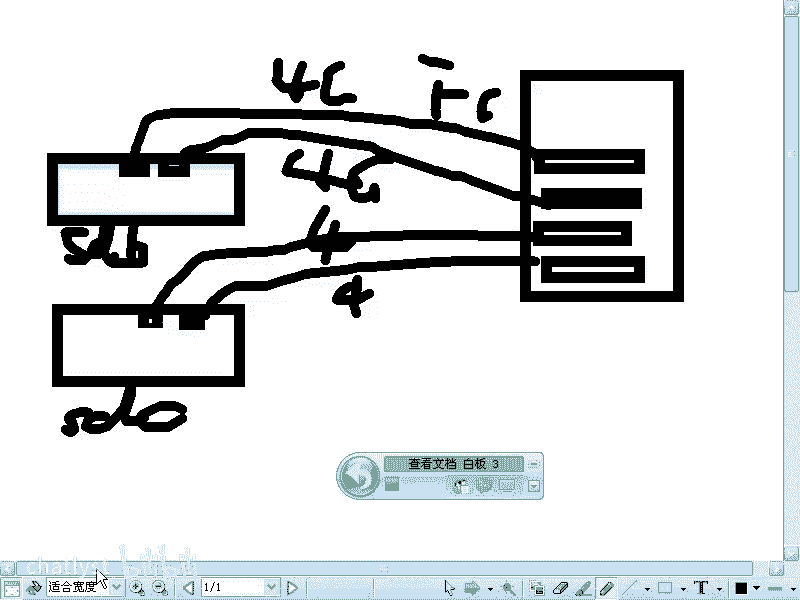
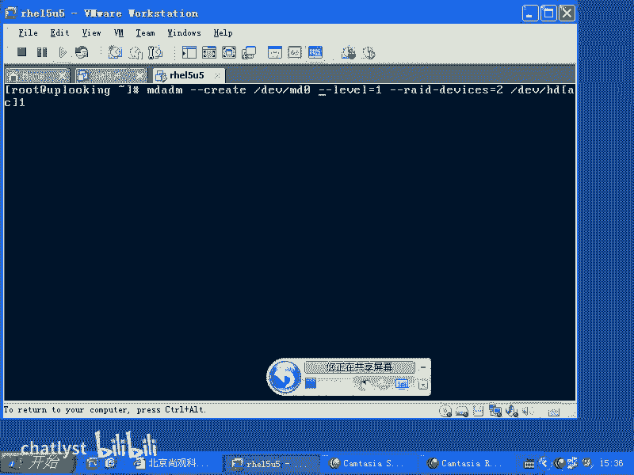
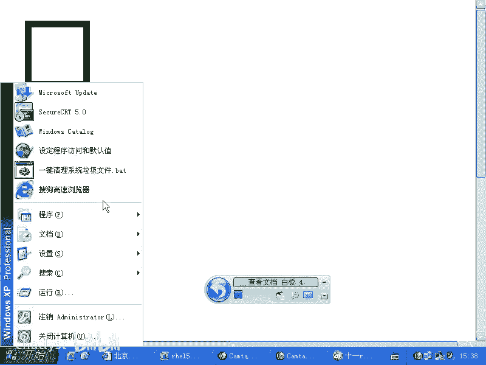
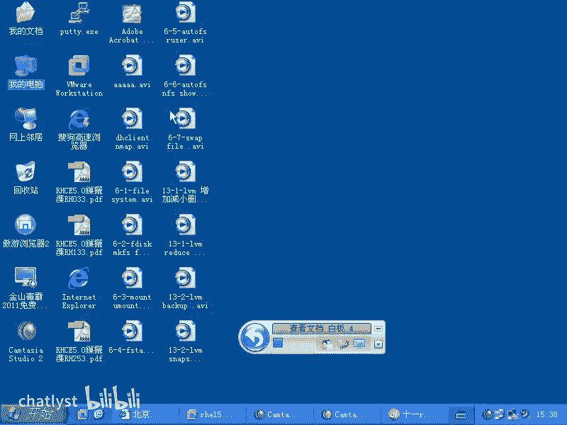
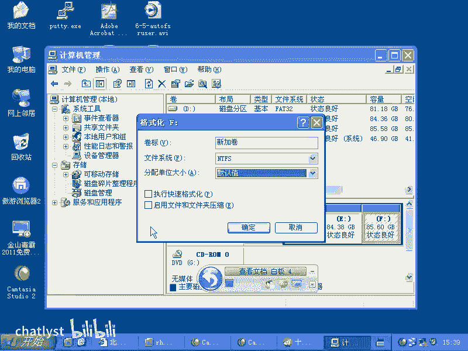
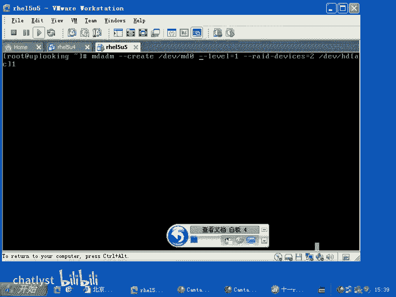
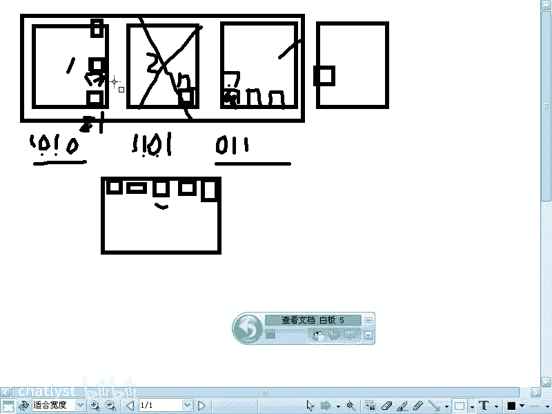
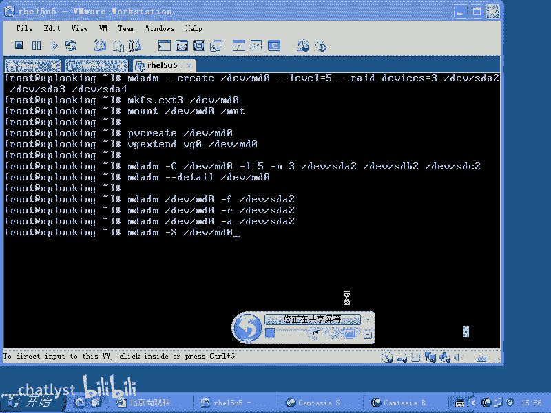

# RHCE课程：2：软件RAID配置与管理

在本节课中，我们将要学习Linux系统中的软件RAID技术。软件RAID是一种利用操作系统和CPU资源来实现磁盘阵列功能的技术。我们将了解其应用场景、工作原理，并学习如何使用`mdadm`工具来创建和管理软件RAID阵列。

## 软件RAID的应用场景

上一节我们介绍了存储管理的基本概念，本节中我们来看看软件RAID的具体应用场景。



软件RAID在系统中的应用角色比较特殊。通常，如果公司预算充足，会优先选择硬件RAID卡来组建磁盘阵列。硬件RAID卡拥有专用的处理芯片，不占用CPU资源，性能更优。

软件RAID主要应用于以下两种极端情况：
*   **预算极其有限**：使用的服务器或主板非常廉价，没有集成硬件RAID卡。例如，一些仅能安装两块硬盘的入门级设备，可能会使用软件RAID来组建RAID 0或RAID 1。
*   **对性能有极高要求**：即使购买了顶级的光纤通道（FC）HBA卡和磁盘阵列柜，带宽仍无法满足需求。此时，可以将多个阵列柜通过软件RAID 0（条带化）组合起来，使聚合带宽翻倍，以满足极端性能需求。



## RAID技术基础

在深入了解配置之前，我们需要回顾一下RAID的核心概念。RAID技术通过将多块磁盘组合起来，提供性能提升、数据冗余或两者兼得。

以下是常见的RAID级别及其工作原理：



*   **RAID 0 (条带化)**
    *   **原理**：数据被分割成块（称为“条带”或“块”），并交替写入阵列中的多块磁盘。
    *   **公式/示例**：假设一个100MB的文件，在由两块硬盘组成的RAID 0中，大约50MB写入第一块硬盘，另外50MB写入第二块硬盘。
    *   **优点**：读写速度最快。
    *   **缺点**：无数据冗余，任何一块磁盘损坏都会导致所有数据丢失。

*   **RAID 1 (镜像)**
    *   **原理**：相同的数据被同时写入阵列中的所有磁盘，实现完全备份。
    *   **优点**：提供完整的数据冗余，一块磁盘损坏不影响数据完整性。
    *   **缺点**：磁盘利用率低（例如两块硬盘只能提供一块的容量），写入速度可能稍慢。



*   **RAID 4**
    *   **原理**：使用多块数据盘和一块专用的校验盘。数据条带化写入数据盘，校验信息（如奇偶校验）集中存储在单独的校验盘上。
    *   **缺点**：校验盘可能成为性能瓶颈。



*   **RAID 5**
    *   **原理**：数据条带化与奇偶校验信息分布存储在阵列的所有磁盘上，没有专用的校验盘。
    *   **优点**：兼顾性能、容量利用率和数据冗余（允许一块磁盘故障）。
    *   **要求**：至少需要3块硬盘。





*   **RAID 6**
    *   **原理**：在RAID 5的基础上，使用两种独立的奇偶校验算法，校验信息分布存储。
    *   **优点**：允许两块磁盘同时故障。
    *   **缺点**：写入性能比RAID 5更低。
    *   **要求**：至少需要4块硬盘。

## 使用 `mdadm` 管理软件RAID

在RHEL 4及之后的版本中，管理软件RAID的标准工具是`mdadm`，它取代了旧的`raidtools`。`mdadm`功能全面，其命令结构类似于`ip`命令。

### 安装与基本语法

首先，确保系统已安装`mdadm`软件包。
```bash
yum install mdadm -y
```
`mdadm`命令支持多种子命令和详细帮助。
```bash
# 查看总体帮助
mdadm --help
# 查看创建阵列的详细帮助
mdadm --create --help
# 查看手册页中的示例（非常有用）
man mdadm
```

### 创建RAID阵列

以下是创建RAID设备的基本命令格式。创建后，原始磁盘（如`/dev/sdb`, `/dev/sdc`）仍可访问，但直接写入会破坏RAID数据。

一个创建RAID 5的典型示例如下：
```bash
mdadm --create /dev/md0 --level=5 --raid-devices=3 /dev/sdb1 /dev/sdc1 /dev/sdd1
```
**参数解释**：
*   `--create` 或 `-C`: 创建模式。
*   `/dev/md0`: 要创建的RAID设备文件。
*   `--level=` 或 `-l`: RAID级别（如 0, 1, 5, 6）。
*   `--raid-devices=` 或 `-n`: RAID阵列中活跃磁盘的数量。
*   最后列出用于创建阵列的物理磁盘分区。

简化写法：
```bash
mdadm -C /dev/md0 -l5 -n3 /dev/sdb1 /dev/sdc1 /dev/sdd1
```

### 使用与管理RAID设备

创建RAID设备后，可以像普通块设备一样使用它。



**格式化与挂载**：
```bash
mkfs.ext3 /dev/md0
mount /dev/md0 /mnt/raid
```

**与LVM结合**：你也可以将RAID设备作为物理卷（PV）加入LVM的卷组（VG），从而让LVM也具备冗余能力。
```bash
pvcreate /dev/md0
vgcreate myvg /dev/md0
```

### 监控与管理阵列状态

**查看阵列详细信息**：
```bash
mdadm --detail /dev/md0
```

**管理阵列成员**：
以下是管理阵列中磁盘的基本操作。
*   **标记磁盘为故障**：
    ```bash
    mdadm /dev/md0 --fail /dev/sdb1
    ```
*   **移除故障磁盘**：
    ```bash
    mdadm /dev/md0 --remove /dev/sdb1
    ```
*   **添加新磁盘**：
    ```bash
    mdadm /dev/md0 --add /dev/sde1
    ```
简化写法（对应上述操作）：
```bash
mdadm /dev/md0 -f /dev/sdb1
mdadm /dev/md0 -r /dev/sdb1
mdadm /dev/md0 -a /dev/sde1
```

**停止RAID阵列**：
```bash
mdadm --stop /dev/md0
# 或使用管理子命令
mdadm --manage --stop /dev/md0
```

## 总结



本节课中我们一起学习了软件RAID技术。我们了解了软件RAID适用于预算有限或对性能有极端要求的场景。我们回顾了RAID 0、1、4、5、6等不同级别的原理与特点。重点是掌握了使用`mdadm`工具创建、格式化、挂载和管理软件RAID阵列的完整流程，包括创建阵列、查看状态、处理故障磁盘等关键操作。这些关于存储、数据安全和备份恢复的技术，是企业IT环境中非常关心的核心内容。