# LVM 管理教程：第 14 章：LVM 逻辑卷的缩小操作 🛠️

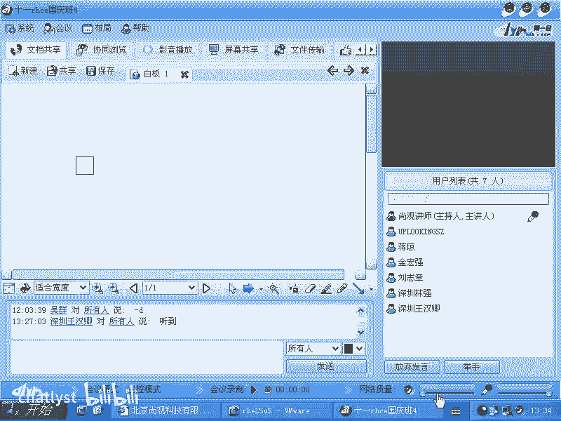

在本节课中，我们将学习逻辑卷管理器（LVM）的核心概念，并重点掌握如何安全地缩小一个逻辑卷。我们将从 LVM 的基本架构讲起，然后通过实际操作演示创建、扩展和缩小的完整流程。

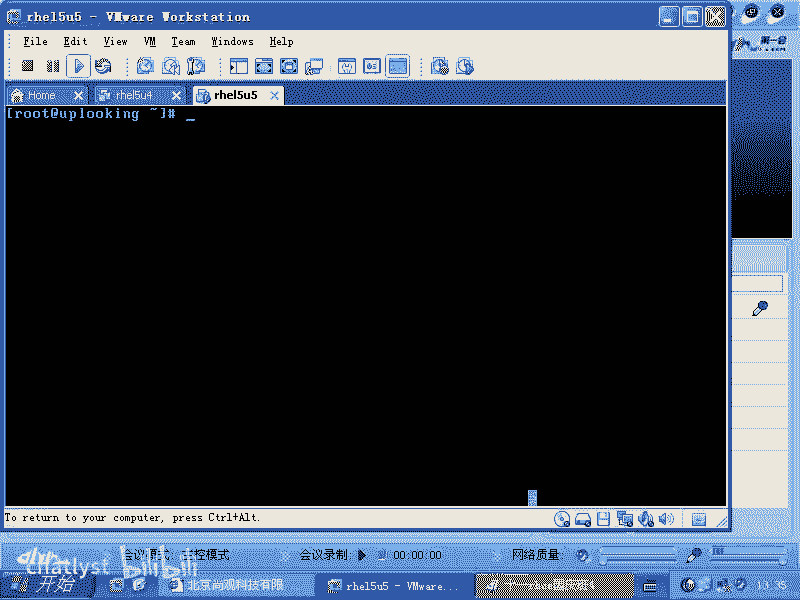

## 概述 📖

LVM 在操作系统中的作用是在文件系统和物理硬件之间增加一个抽象层。这个抽象层的目的是提供一个可以灵活伸缩的存储空间。传统上，文件系统直接创建在分区上，而分区的大小受限于物理硬盘的容量，难以动态调整。LVM 通过引入物理卷（PV）、卷组（VG）和逻辑卷（LV）的概念，使得存储空间的管理变得像搭积木一样灵活。

上一节我们介绍了 LVM 的基本概念，本节中我们来看看如何具体操作，特别是如何安全地缩小逻辑卷。

## LVM 的基本架构 🏗️

为了更好地理解，我们可以将 LVM 的架构可视化。

假设我们有两块硬盘，每块硬盘上有一个分区（例如 `/dev/sda5` 和 `/dev/sda6`）。在传统方式中，文件系统（如 `ext3`）直接创建在这些分区上，其大小是固定的。

而使用 LVM 时，步骤如下：
1.  将这些分区初始化为 **物理卷（PV）**。
2.  将多个 PV 加入到一个 **卷组（VG）** 中。VG 就像一个大池子，汇集了所有 PV 的存储空间。
3.  从 VG 中划分出 **逻辑卷（LV）**。LV 对于上层的文件系统来说，就像一个普通的分区。
4.  最后，在 LV 上创建文件系统。

这样，文件系统就不再直接依赖于某一块具体的硬盘分区，而是基于 LV。当需要更多空间时，我们可以向 VG 中添加新的 PV，或者扩展现有的 LV；当需要回收空间时，则可以缩小 LV。

## LVM 相关命令 🖥️

LVM 的命令非常有规律，易于记忆：
*   所有操作 **物理卷（PV）** 的命令都以 `pv` 开头，例如 `pvcreate`。
*   所有操作 **卷组（VG）** 的命令都以 `vg` 开头，例如 `vgcreate`。
*   所有操作 **逻辑卷（LV）** 的命令都以 `lv` 开头，例如 `lvcreate`。

你可以通过按两次 `Tab` 键来查看所有相关的命令。

## 实践操作：创建与扩展 LVM 🔨

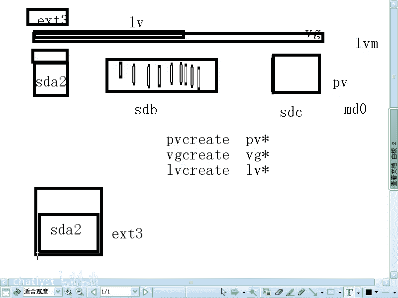

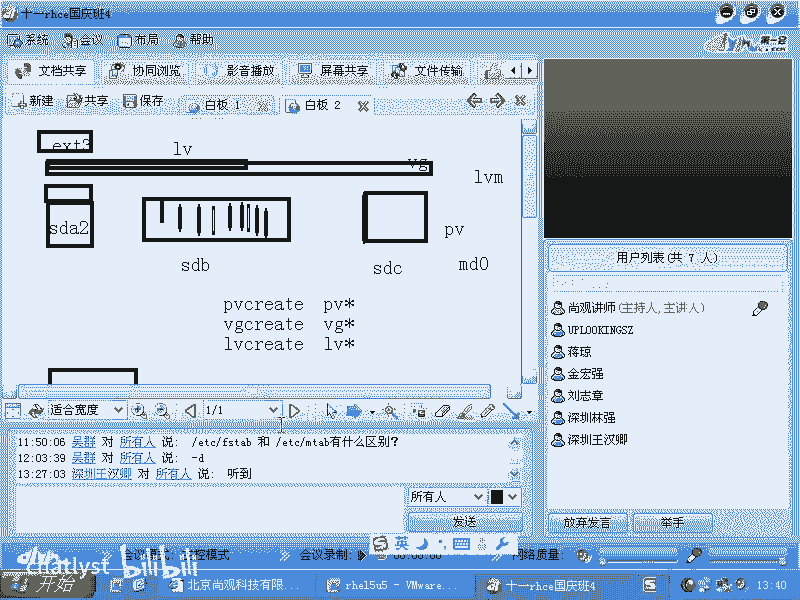

现在，让我们从零开始，一步步使用 LVM。

### 1. 准备物理卷（PV）

首先，我们使用 `fdisk -l` 查看磁盘，假设 `/dev/sda5` 和 `/dev/sda6` 是预留用于 LVM 的分区。我们将它们初始化为物理卷。

```bash
pvcreate /dev/sda5 /dev/sda6
```

### 2. 创建卷组（VG）

接下来，创建一个名为 `vg0` 的卷组，并将两个 PV 加入其中。

```bash
vgcreate vg0 /dev/sda5 /dev/sda6
```

使用 `vgdisplay` 命令可以查看 VG 的详细信息，包括其总大小和 **物理块（PE）** 的大小。PE 是 LVM 管理空间的最小单位，默认通常为 4MB。你可以把 VG 想象成一个由许多个相同大小的 PE 组成的存储池。

### 3. 创建逻辑卷（LV）和文件系统

现在，我们从 `vg0` 中创建一个大小为 800MB、名为 `lv0` 的逻辑卷。

```bash
lvcreate -L 800M -n lv0 vg0
```

然后，在这个逻辑卷上创建 `ext3` 文件系统。

```bash
mkfs.ext3 /dev/vg0/lv0
```

创建完成后，可以将其挂载并使用。

```bash
mount /dev/vg0/lv0 /mnt
cp -R /etc/* /mnt/
```

### 4. 扩展逻辑卷（LV）

LVM 的优势在于动态调整。假设我们需要更多空间，可以按以下步骤扩展：

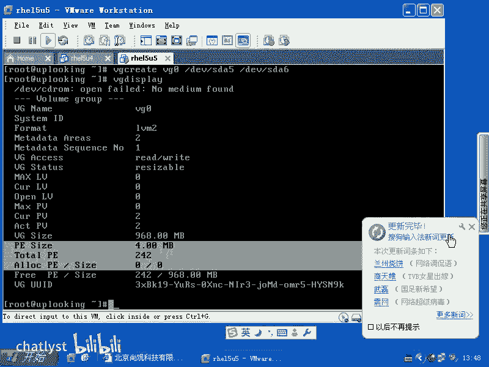

首先，将一个新的分区（如 `/dev/sda7`）初始化为 PV 并加入 VG。

```bash
pvcreate /dev/sda7
vgextend vg0 /dev/sda7
```

然后，将逻辑卷 `lv0` 的大小增加 400MB。

```bash
lvextend -L +400M /dev/vg0/lv0
```

**关键步骤**：此时，逻辑卷的底层空间已经扩大，但文件系统本身还不知道这个变化。我们需要使用 `resize2fs` 命令来扩展文件系统，以使用新增的空间。

```bash
resize2fs /dev/vg0/lv0
```

完成后，使用 `df -h` 命令检查，会发现挂载点 `/mnt` 的可用空间已经增加。

## 核心操作：安全缩小逻辑卷 ⚠️

缩小操作比扩展风险更高，必须严格按照顺序执行，否则可能导致数据丢失。**正确的顺序是：先缩小文件系统，再缩小底层的逻辑卷。**

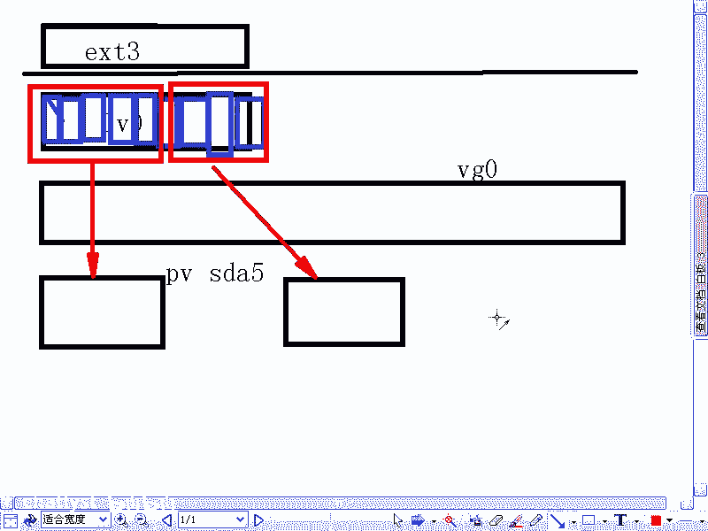

假设我们想将 `lv0` 从 1.2G 缩小到约 200MB，并回收空间。

### 1. 卸载文件系统（可选但推荐）

为了安全起见，最好先卸载文件系统。如果文件系统支持在线缩小（如 `ext3/4` 在某些条件下），也可以尝试不卸载，但生产环境建议卸载。

```bash
umount /mnt
```

### 2. 强制检查文件系统

在调整大小前，先检查文件系统。

```bash
e2fsck -f /dev/vg0/lv0
```

### 3. 缩小文件系统

将文件系统缩小到目标大小（例如 180MB）。**这个大小必须小于或等于你计划缩小后的 LV 大小。**

```bash
resize2fs /dev/vg0/lv0 180M
```

### 4. 缩小逻辑卷（LV）

现在，将逻辑卷本身缩小到与文件系统匹配的大小（例如 200MB）。

```bash
lvreduce -L 200M /dev/vg0/lv0
```

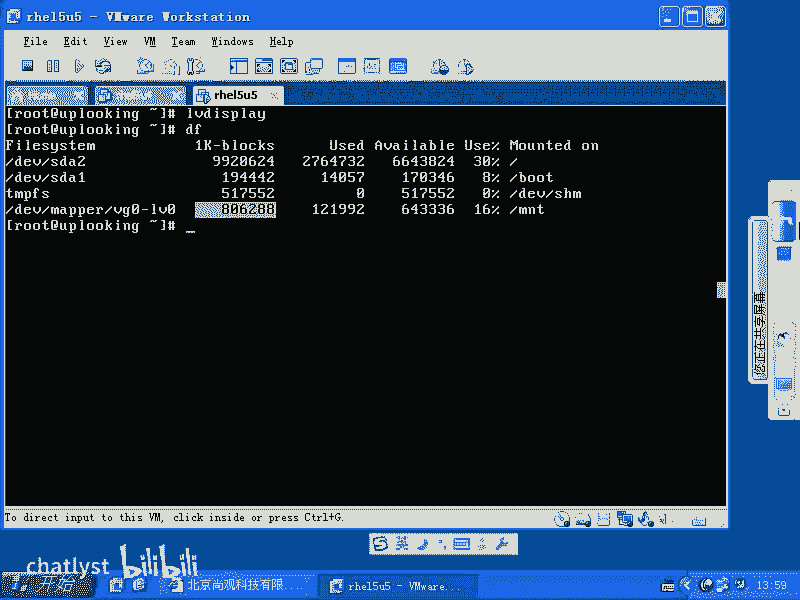

### 5. 重新挂载并检查

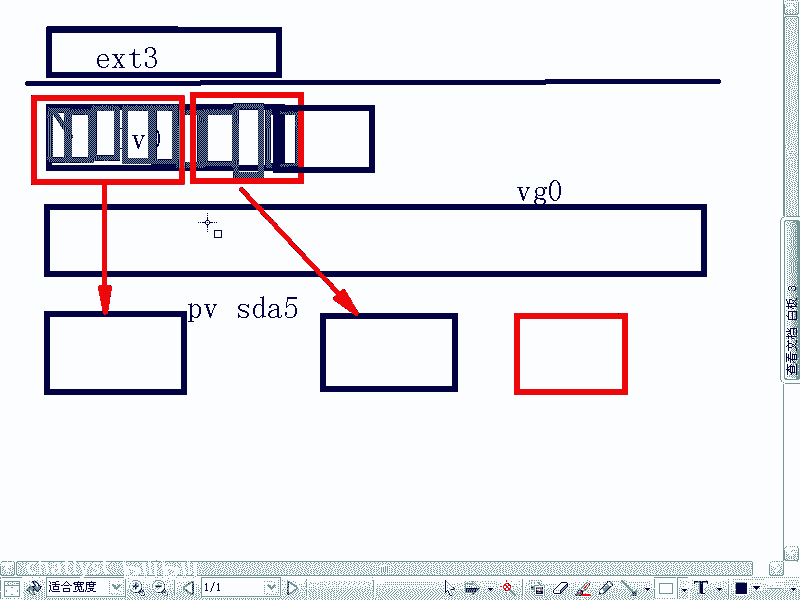

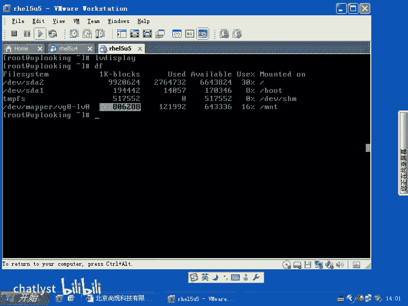

操作完成后，重新挂载文件系统并检查大小。

```bash
mount /dev/vg0/lv0 /mnt
df -h /mnt
```

**重要警告**：如果操作顺序错误，例如先执行了 `lvreduce` 缩小了 LV，但文件系统仍认为自己拥有更大的空间，这将导致文件系统损坏和数据丢失。因此，在生产环境中执行缩小操作必须极其谨慎，并确保有完整备份。

## 从卷组中移除物理卷 🔄

如果你需要移除一块硬盘（例如 `/dev/sda6`），需要先确保该 PV 上的所有数据（PE）已经被迁移到卷组中的其他 PV 上。

```bash
pvmove /dev/sda6
```

数据迁移完成后，再从卷组中移除该 PV。

```bash
vgreduce vg0 /dev/sda6
```

最后，如果你想彻底清除该磁盘的 LVM 标记，可以：

```bash
pvremove /dev/sda6
```

## 总结 🎯

本节课中我们一起学习了 LVM 的核心架构和基本管理操作。我们了解到：

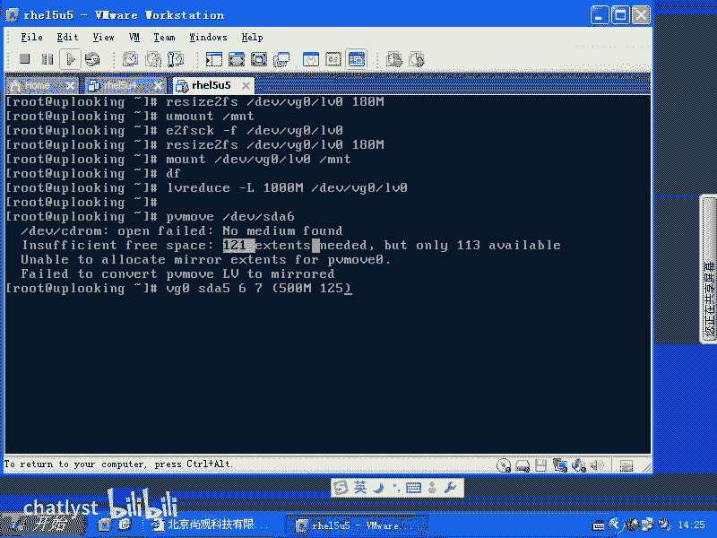

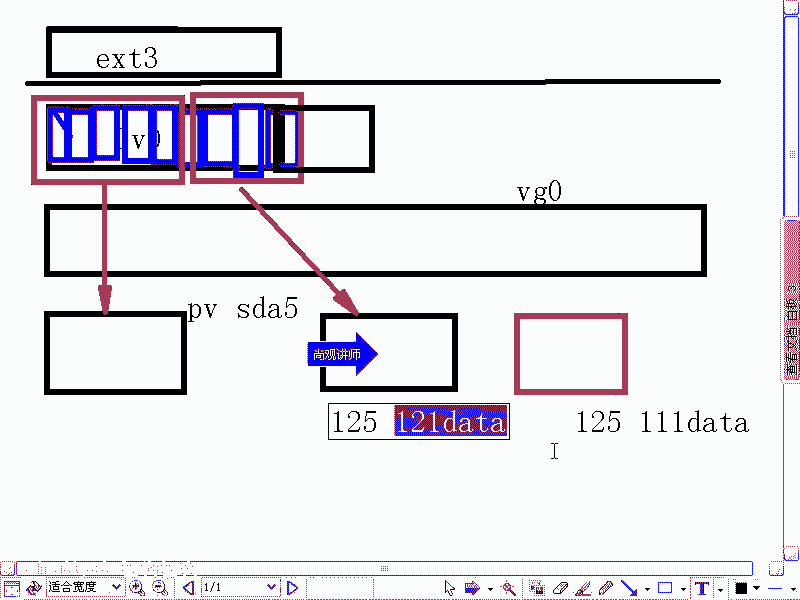

1.  LVM 通过 **PV -> VG -> LV** 的三层结构，提供了灵活的存储管理能力。
2.  **扩展逻辑卷** 的顺序是：扩展 LV -> 扩展文件系统。
3.  **缩小逻辑卷** 的顺序是：检查并缩小文件系统 -> 缩小 LV。**这个顺序至关重要，颠倒会导致数据丢失。**
4.  可以使用 `pvmove`、`vgreduce` 等命令从卷组中安全移除物理卷。

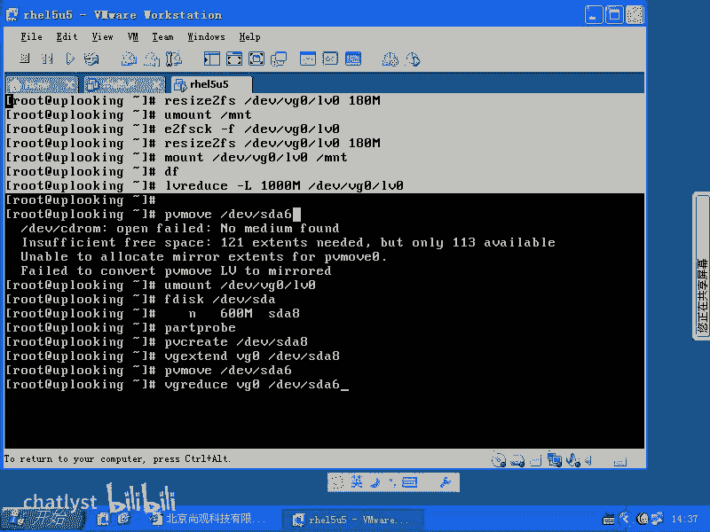

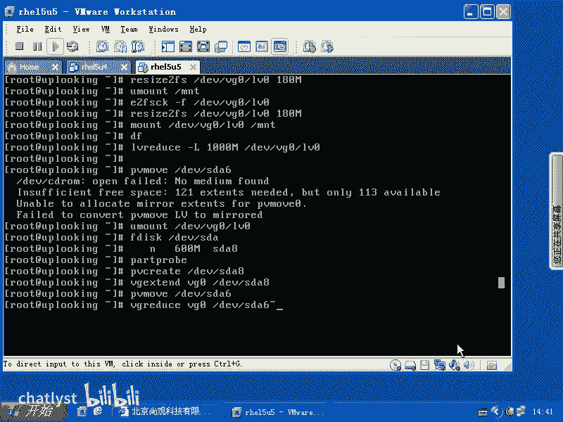

记住，尤其是在生产环境执行缩小或移除操作前，务必进行数据备份，并充分测试。