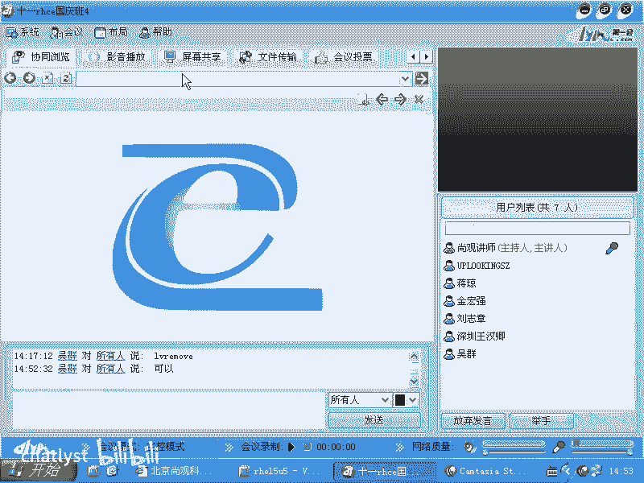
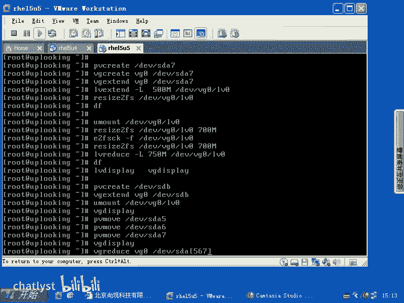

# RHCE教学视频2 - P15：RH133-ULE115-13-2-lvm reduce pvmove - chatlyst - BV1PJ411D7LB

喂。我们现在的话呢来看一眼啊，就说我们的那个呃。

就是LVM的一些补充啊，看一下。LVM的话呢。这个基本的使用我们给大家总结一下。基本的使用给大家总结一下，我们看一眼。PV。好，最开始啊最开始用就是首先的话，你要看一下自己的RPM是不是啊。

LVM是什么版本的。如果要是你现在的LVM是。不是你本机创建的，而是从前面的系统当中继承过来，是不是？或者你原来装的R713，现在装的R715，那你就一定要注意LVM本身版本问题。

如果要是把有版本方面问题，你要先看一下什么，你自己装的硬软件是LVM的哪个版本，然后呢再运行什么呢？啊，VG scan啊VG scanVG scan完了以后的话呢。

你可以看到自己不管是谁创建的LVM都会被什么呢？把被找到被找到以后呢，它会告诉你你的LVM的话呢是什么版本是LVM1还LVLVM2。如果是LVM1，那要怎么样create。哎。

不是要用VGconver是不是？然后呢，杠M2是吧？然后呢，把你的VG0改成LV呃LVMR的格式，对不对？这个大家看一下蛮配置啊，如果要是想去创建全新去创建LVM的话，非常简单PV。

create啊DV下的呃SDAR是不是比方SDA呃5吧，DV下的SDA62个是不是把它创建出来，创建成PV以后，把它加入到一个卷组里面来啊，卷组的话呢，就是VG0，是不是VG0DV下的。

SDA5基余下的SDA6，这样的话把它创建成VG0。然后呢，如果要是你创建好VG以后，就相当于你创建了一个大的虚拟磁盘。是吧大的虚拟磁盘我们在创建之前应该考虑到磁盘，它很可能坏硬盘的话呢，它很可能坏。

你自己家里面的硬盘的话呢，可能坏的几率还不是特别高是吧？但是呢服务器可是一年365天，实时都在运转，所以硬盘坏的几率非常高的。而且的话呢你的这个硬盘呃，就是现在的这个廉价硬盘是蛮多的。

像用SATA的也不少，是不是这是非常便宜的硬盘。那么假如说有人他它用SAS的那比较贵的那当然还好点，所以我们要考虑到的就是什么呢？你把它创建到物理券当中。创建的物理卷。这些物理卷的话呢。

它本身支不支持容错是个大问题。因为LM你们觉得它支持不支持容错？LVM它支持不支持工作？不支持。所以的话你的硬盘有一个硬盘坏了以后的话，它就完蛋了，明白吧？所以的话要求你创建的这个物理券，它是设略柜。

或者已经做好什么read的东西啊，那么我在这边的话呢，我创建出来以后，你看我先给大家创建完再说LV create。然后呢，这边要加上个大L是吧？大L的话表示说进行什么进行的是线性的创建。

线性创建1个LV也就是我现在VG比方横跨两个两个卷是吧，横跨两个物理卷，是不是？那么我是怎么样去分配这两个物理卷的空间呢？它L的话是线性，就说我先填满一个再填另外一个。明白吧？现在我整个多大呢？

比方说杠。😡，呃，呃多大呢是呃，比方说一G啊1G。然后呢，名字叫什么呢？名字叫做。呃，LV0是不是？然后呢，在VG0上创建，明白了吧？

这时候创建完了以后想去使用它mount地域下的VG0当中的LV0mount在某个地方，那肯定是不行。为什么美加文件系统是不是？因为它上面还有一个，你看这边的层次结构是不是非常清楚？PV。VG是吧。

LV这是LVM的管辖范围。在LVM之上，如果你创建完以后想直接去用，可以，谁可以用呢？阿acle数据库。的话，它可以把自己的表空间直接指定成什么LVM的裸设备，就是直接指定成LV明白吧？

那如果要是我们平时在使用普通的软件，比方说web服务器等等这些东西的时候，他就要求怎么样。啊，你要先格式化，因为它不带什么管理那些小块小块的这种功能，是吧？ache只是提供什么？

就是说你HTML协议是吧？过来请求我给你发文件过去是吧？怎么管理这个文件，我才懒得管，是不是？所以的话这个是acheache就怎么样呢，它就不会去管理那么多，那么这时候你要怎么样的？

你要去makeFS点EX3是不是第一下的S呃VG0当中的LV0，对不对？然后呢就可以怎么样上去了。第一下的VG0当中的LV0是吧？mon在某个录像，或者是怎么样的。

或者是VIETC下的FSTAB是不是让它自动加载，对吧？自动加载完了以后的话呢，这是我们基本的创建。那么我们再把它进行，我们再把它进行呃那个。就是他用它最大的功能是吧，把它扩展的时候。

那么就有另外的一系列的命令，是不是？那么在我们创建的时候，我们要告诉大家，真正的生产系统你应该注意什么？你现在假如说。你现在假如说你的系统里面的话呢，是有一个呃。SAT的硬盘是吧。

或者好几块SAT的硬盘。如果要是1块SATA的硬盘，你是直接加载到PV当中的。🤧直接加载成PV，直接加载到VG当中了。一块硬盘坏了怎么办？关我什么事是吧。数据丢了就啊，所以这个时候的话，你要怎么样？

你要考虑到硬盘会坏的时候有没有容错，反正LDM是不提供，是不是？于是的话呢你要么用软锐的方式把几个就是硬盘做成什么软锐的read5或者是软瑞的read什么read一明白吗？

也就是说你在这里面我这边添加的是DV下的SDA5，是不是实际生产系统当中应该是什么MD0，就是我做的第一个软锐的，明白吧？我找了2块SATA的SATA的硬盘便宜嘛？然后我再加了一个什么软瑞的。

然后我把MD0加成物理券，我把MD0加成物理卷，清楚了吗？这是一个。然后呢，要么就是做什么硬瑞的。你比方说你用光纤阵列卡啊，置列柜，然后呢，把那个硬瑞的话呢是SDB，然后直接加进来，对不对？

这个的话呢都是实际当中用的，实际当中没有这样裸分的。啊，裸奔的话就是说我这个硬盘听天由命是吧？管子什么时候坏，你想你买的那个硬盘多少钱呢？咱买的一T的硬盘多少钱，600多块钱是吧？五六百块钱。

结果的话呢我们的呃非常可爱的这个SAS硬盘什么？我记得是140G。还是400多G460G。好140多G的SAS硬盘，15000转的要11000多块钱。是吧。现在行情不太清楚啊，就没有买过。没有没有买过。

那个如果要是你去配服务器的话呢，他就问你半配还是全配是吧？全配的话塞满了是吧？半配的话呢，就配几个啊这样那么。单个的硬盘的话，一个一个去买的话呢，很少啊。SAS硬盘我买过来以后怎么样？我买过来以后。

价格差异那么多，你的SAT的硬盘的故障率就非常高，明白吧？那人家说了，哎，我保三年，你拿过来换就好了，我数据都丢了，我还换什么？是吧难道我特别在意那500多块钱吗？是吧服务器根本就不是在意那么几百块钱。

而在意的什么稳定性是吧？所以一定要先加MDD，就是先加什么软锐的，然后再把它加进去。如果要是你有钱的话，那么就把它做成什么做成那个阵列柜啊，就是买光纤阵列柜，然后加进去，或者是说用硬盘上的。

要不是用服务器上那种阵列卡，把它搭好了什么硬锐的以后，然后再把它加入到什么LVM里面来，明白了吗？这是我们的这个一般的做法。现在的话呢我们想看第三个功能，第三个功能就是升级它的容量，是不是升级它的容量。

那么比方说我PV create。DV下的SDA。比方说7啊，我添加了，然后呢，VG。createVG0当中第余下的SDA7。把它添加进去。啊，把它添加进去，添加进去了以后，然后呢再去LV create。

LV啊LV。错了。头子大了，这个肯定是错的。不是不是VGcreateVG。X ten是吧。然后呢，VG0当中的DV下的SDA7把它追加进去，追加进去以后，VG0不是就变大了吗？变大了以后。

然后我们再去用什么呢？LV啊exend是吧？到L是吧？我习惯的话呢，使用加多少多少，就是LVLV的话呢，本身是1G是吧？我又给它加多少多少。那么现在的话，我们的命令的话是本身就是扩展了，是不是？

你也可以用加500兆也可以怎么样呢？直接加上一个什么500500兆啊，500兆。然后呢，再什么呢？DEV下的VG0当中的LV0对吧？加上去了以后。还必须你看这边是不是四层啊？是不是这边四层啊。

你这边的话呢有PV层，有VG这层，有LV这层是吧？还没有动什么呢？文件系统，所以的话你要把文件系统变大，是不是？那么是ewoFS，哎，不是。Resize。e toF呃res to FS是吧？嗯。

res E to FS然后DV下的VG0当中的LV0。这个时候的话，你用DF命令一看，它才会真正变大，否则的话呢就不会变大，是不是整个变大的过程当中，我们没有让大家去ummount文件系统。

说明它是在线去变大，是不是？所以LVM的话呢天生是给大家用来做什么？变大的啊，它不会让大家什么它去缩小缩小的话呢，很容易引起问题。那么如果你一定要缩小的话怎么办呢？那就有另外一系列命令。

首先的话呢要怎么样youmount是不是？首先要you，Uant掉了以后再去用什么呢？LV。哎，要要缩小的时候要反过来是吧？嗯，那么像增大的时候，最后增大什么文件系统是吧？缩小的时候，首先应该缩小谁呀？

文件系统，那么用resize。啊，E twoFS然后呢DV下的VG0当中的LV0是吧？后面加上一个大小是不是这个大小的话应该是你所有的文件不大于你现在所有的文件之和，是不是？假如说你现在文件是500兆。

那你给它留个800兆，或者留个6七00兆，是不是？那这样的话呢，后面加上一个比方说七00兆。明白吧？把它变成多大的，就是文件系统变成多大的。然后再来的话呢，就是怎么样，就是LV reduce是吧？

reduce8。到L啊把它减掉多少呢？原来的话呢，我们的这个空间假如说是呃假如说是11。5G是吧，那我现在要减掉什么呢？减掉750兆啊，原来是11。5G。那么现在我减成减掉750G啊，750兆是吧？啊。

那么让它加起来的话呢，小于原来的值是吧？因为它有些损耗的呀，是吧？有些损耗，所以减去这么多，然后呢，在DV下的VG0当中的LV0，对吧？减去了以后，那么它直接执行这个命令，它会提示你出错了，是不是。

需要先检测文件系统，对不对？需要先检测文件系统。如果你直接回车的话呢，你会发觉它会提醒你的。是吧是不是这样？然后呢，你要怎么样？哎呀，错了，这个直接执行这一步的话呢。

就会有就是让你就是检测文件系统的东西是吧？那就是什么FSCK点EXT3是吧？杠F然后呢，地域下的VG0当中的LV0是不是？呃，EX3一样的E two FSCK是吧？是这样的。

e toFSCK是不是一样的啊一样的。那么我我执行这个命令的时候的话呢，它会出错，是不是？它会出错，然后呢，我要先检测文件系统，然后呢再去执行这个命令。执行这个命令以后的话呢，它就不会出错。

帮你把文件系统剪好了，剪好了以后的话是什么样呢？是呃LV。reduce是吧，大L。比方说750兆是吧，第块的VG0当中的LV0。这个命令的话呢，是说把我的这个文件系统减到多少呢？减到700兆。

是不是你减到700兆以后，原来是1。5G减到700兆以后，是不是就有800兆。就我们说理想来看的话，就是有800兆的剩余的，是不是就是空出来的。因为文件系统已经变成什么700兆了，那你原来是1。5G啊。

那么现在的话我们就把它什么呢？把剩余的800兆那些东西的话呢，给它划拨出去还给谁啊，还给我们的VG是吧，让他可以再次利用用来做别的事情，是不是？所以这样的话呢，我们就减的东西的话呢，就不是800兆。

而是什么呢？750兆。我们担心的话呢有一些数值可能怕对不上。因为记不记得我跟大家说过，你再操作的时候最小单位应该是PE的倍数，是不是？如果你输入的不是那个倍数的话呢，那他万一大一点或者小一点。

它可能比较麻烦。当然大家的话呢，愿意在乎那50兆的话呢，你可以再去就是再把它扩大或者是再把它缩小一些，计算的比较精确一点，是不是也可以，我为了一次成功的话，我就是直接输入这个命令啊。

这个命令输入完了以后的话呢，这个时候我再去看什么呢？我再去看一下DF。然后呢再去看一下什么呢？LV display。啊，我可以看一下LV它现在变成多大了是吧？然后我还可以看一下什么呢？VG。

display是不是？这样的话呢，我能最终确定这个当前的状态。然后呢，这是前面的，后面的话呢，我们又给大家加了一个什么功能呢？加了一个就是说我现在的话呢要想把自己的某一个旧硬盘从LVM当中给它删除掉。

呃，那这个时候的话呢就是另外一套东西了，就是我们要把某个物理卷从我们的VG当中删除掉，是不是？那这样的话呢，我们要怎么样呢？首先你这个文件系呃，你这个物理卷的话要删除，你总得要把现在的东西。

物理件上的东西挪到另外的一个机器上呃，另外的一个物理件上吧，是不是这个时候的话呢，你就要怎么重新PV。create是不是？PV create创建1个DV下的SDB是吧？假如说我又插了一根光纤置列柜过来。

是不是？拆光纤这量柜过来以后，我要把现在硬盘，现在我这个服务器上这些硬盘里面的PP全都挪掉。那我这个光线这列柜是很大的，是不是我把它加进来以后，那么我再怎么样呢？VG。Cate。呃，VG什么？是吧。

然后VGVG0当中的D一下的SDB啊，把它添加进去。当然了，在这之前的话呢，你你要把什么D一V下的VG0当中的LV0是不是都给它删除，就是给它U忘掉是吧？U忘掉。然后呢。我们再看。

如果要是现在我要移移就是把原来的SDA7呃，SDA5SDA6给它删除掉的话，我要保证这上面的这些数据的话有充足的什么剩余空间可以挪过去。那么我的这个硬盘呃，这个这个置列贵的话，它本身到到没到。

就是呃比他们三个加起来都大是吧？如果都大的话，那就OK加进来以后的话呢，你可以看一下VG什么呃display。是吧看一下位距有多大，然后再去怎么样移动移动的话呢，就这样PV什么木啊。DV下的SDA。

5是不是PV不要一块加啊，一块加的话呢，因为PV木本身的话呢，它是一个就是这样的命令。你比方说我可以把什么DV下的SDA5是吧？冒号是吧？冒号第几个PE呢？第1个P到第20个P移动到什么呢？

第V下的SDASDB呃上面什么呢？呃，比方说SDB上去是不是我可以这样的话去移动这个PE那么我如果要是把你看我P的时候，我可以把两个同时加上去，是不是？但是呢在这里面的话呢，我们只能一个一个移。

也就是说它前面的话呢是一个圆，后面应该是什么目标是吧？那你要想移除三个移除三个的话，那你不能把它并排去写了，你要一个一个来写，是不是？所以的话呢它的这个格式的话，可以这样写。那么我们在移除的时候。

我们就想把这上面的所有的P全部都移除掉，我管你放哪，不用管，不用我不管你LM自己来决定好了，那这个命令就是做这个用的，明白吧？然后现在我再移除这个。然后再去什么呢？

PV移除掉DV下的SDA7是不是我把这三个分区全部都移掉。就是说这三个物理卷上的PE全部都放在可以放的地方，是不是？当然了，要有充足的剩余空间啊，充足的这个就是就磁盘的这个可以用。

那么你看一下可不可以啊，如果要是不可以的话呢，是不是剩余的空间不够了，然后你再多添加什么物理卷过来，是不是？这样移除来以后，可以的话呢，再去用VG啊VG displayplay啊看一眼。

然后呢再去用什么呢？VG什么reduce。reduce然后呢，VG0当中的低域下的。DV下的SDA5是吧？S d a。567。是不是啊把这三个的话呢全部都删除掉啊。

这样的话呢就是我们所谓的这种移除这个已经旧的磁盘，或者说你不想要用这些磁盘，或者说因为什么原因。那么在LVM体系里面的话，想把它们干掉是吧？这样的话就移除三个，当然你要移除一个移进来一个新的是吧？

移进来一个新的还行。有问题吗？没有问题啊。

就是LM的这个内容啊LVM这个内容。

