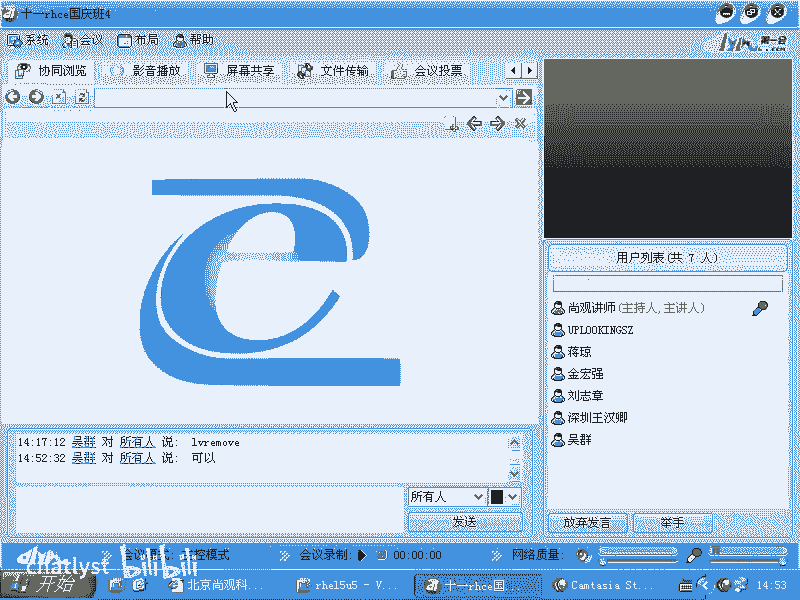
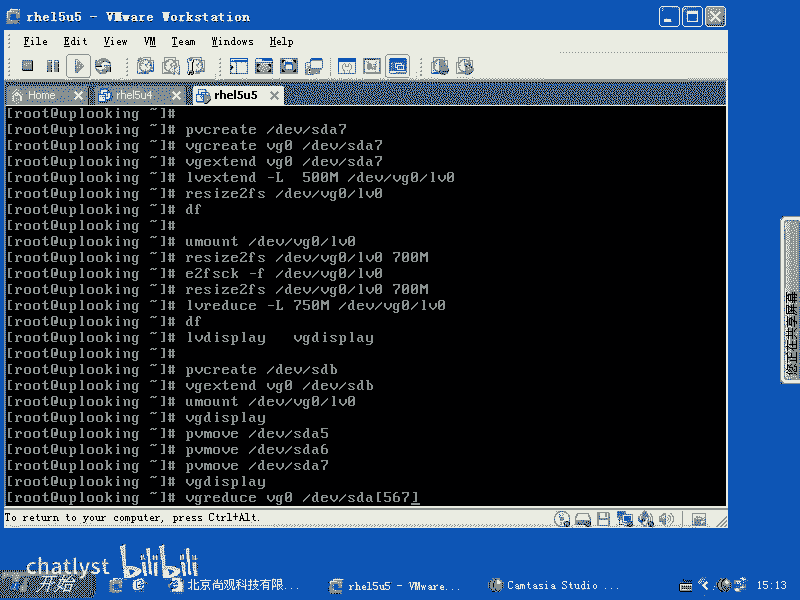

# RHCE课程：2：LVM管理与操作详解



在本节课中，我们将深入学习Linux逻辑卷管理器（LVM）的核心概念、基本操作流程以及生产环境中的高级应用，包括逻辑卷的扩展、缩减和物理卷的迁移。

## 概述

LVM是一种灵活的磁盘管理方案，它允许将多个物理磁盘或分区聚合成一个大的存储池（卷组），并从中动态地创建、调整大小的逻辑卷。本节将系统性地介绍LVM的创建、扩展、缩减及物理卷迁移等关键操作。

## LVM基本使用总结

上一节我们介绍了LVM的基本概念，本节中我们来看看其具体操作流程。LVM的基本使用遵循一个清晰的层次结构：物理卷（PV） -> 卷组（VG） -> 逻辑卷（LV）。

以下是创建和使用LVM的基本步骤：

1.  **检查LVM版本**：首先，需要确认系统安装的LVM软件包版本。如果是从旧系统迁移而来，需注意版本兼容性问题。可以使用 `vgscan` 命令扫描并显示现有卷组及其版本（LVM1或LVM2）。若为LVM1，需使用 `vgconvert` 命令将其转换为LVM2格式。
    ```bash
    vgscan
    vgconvert -M2 <vg_name>
    ```

2.  **创建物理卷（PV）**：将物理磁盘或分区初始化为LVM可用的物理卷。
    ```bash
    pvcreate /dev/sda5 /dev/sda6
    ```

3.  **创建卷组（VG）**：将一个或多个物理卷组合成一个存储池，即卷组。
    ```bash
    vgcreate vg0 /dev/sda5 /dev/sda6
    ```

4.  **创建逻辑卷（LV）**：从卷组中划分出指定大小的逻辑卷。`-L` 选项指定大小，`-n` 指定名称。`-l` 选项表示使用线性分配策略，即先填满一个物理卷，再使用下一个。
    ```bash
    lvcreate -L 1G -n lv0 vg0
    ```

5.  **创建文件系统并挂载**：新创建的逻辑卷相当于一块裸磁盘，需要格式化为文件系统（如ext3/ext4）后才能被普通应用程序使用。
    ```bash
    mkfs.ext3 /dev/vg0/lv0
    mount /dev/vg0/lv0 /mnt/lvm_mount
    ```
    也可以将其配置到 `/etc/fstab` 中实现开机自动挂载。

## 生产环境注意事项

在了解了基本创建流程后，我们必须关注生产环境中的可靠性问题。LVM本身不提供数据冗余或容错功能。如果底层物理硬盘损坏，其上的数据将丢失。

因此，在实际部署中，应确保底层存储具备容错能力。以下是两种常见做法：

*   **使用软件RAID**：先将多块廉价磁盘（如SATA盘）通过 `mdadm` 工具配置为RAID 1（镜像）或RAID 5（带奇偶校验的条带化），然后将RAID设备（如 `/dev/md0`）创建为物理卷。
    ```bash
    pvcreate /dev/md0
    ```

*   **使用硬件RAID或存储阵列**：通过服务器RAID卡或外部光纤存储阵列柜，创建具备冗余保护的逻辑磁盘，再将其加入LVM管理。

这样做可以确保即使单块物理磁盘故障，LVM上层的业务数据和逻辑卷也不会受到影响。

## 逻辑卷容量扩展

LVM的核心优势之一是支持在线动态扩展。上一节我们创建了逻辑卷，本节中我们来看看如何扩展它。扩展操作涉及LVM层和文件系统层。

以下是扩展逻辑卷的步骤：

1.  **扩展卷组容量**（如果需要）：如果卷组空间不足，先添加新的物理卷到卷组中。
    ```bash
    pvcreate /dev/sda7
    vgextend vg0 /dev/sda7
    ```

2.  **扩展逻辑卷大小**：扩大逻辑卷的容量。可以使用 `-L +500M` 增加指定大小，或 `-L 2G` 设定为目标大小。
    ```bash
    lvextend -L +500M /dev/vg0/lv0
    ```

3.  **扩展文件系统**：最后，需要调整文件系统的大小以使用新增的空间。对于ext3/ext4文件系统，可以使用 `resize2fs` 命令，并且通常可以在线操作（无需卸载）。
    ```bash
    resize2fs /dev/vg0/lv0
    ```
    完成后，使用 `df -h` 命令即可看到容量已增加。

## 逻辑卷容量缩减

与扩展相比，缩减逻辑卷风险更高，操作步骤也相反，且**必须卸载文件系统**。

以下是缩减逻辑卷的步骤：

1.  **卸载文件系统**：首先必须卸载要缩减的逻辑卷。
    ```bash
    umount /dev/vg0/lv0
    ```

2.  **强制检查文件系统**：在调整大小前，强烈建议进行强制文件系统检查。
    ```bash
    e2fsck -f /dev/vg0/lv0
    ```

3.  **缩小文件系统**：将文件系统缩小到目标尺寸（例如700M）。必须确保此尺寸不小于当前已存储数据的总和。
    ```bash
    resize2fs /dev/vg0/lv0 700M
    ```

4.  **缩小逻辑卷**：将逻辑卷的容量减小到与文件系统匹配或略大的尺寸（例如750M，为元数据留出空间）。系统会提示确认。
    ```bash
    lvreduce -L 750M /dev/vg0/lv0
    ```

5.  **重新挂载并验证**：操作完成后，重新挂载逻辑卷，并使用 `lvdisplay` 和 `df -h` 命令验证新容量。
    ```bash
    mount /dev/vg0/lv0 /mnt/lvm_mount
    lvdisplay /dev/vg0/lv0
    ```

## 物理卷迁移与移除

有时需要将数据从旧的或需要淘汰的物理磁盘迁移走，并将其从卷组中移除。这需要使用 `pvmove` 命令。

以下是迁移并移除物理卷的步骤：

1.  **准备目标物理卷**：向卷组中添加一个新的、有足够空间的物理卷（例如新存储阵列）。
    ```bash
    pvcreate /dev/sdb1
    vgextend vg0 /dev/sdb1
    ```

2.  **迁移数据**：使用 `pvmove` 将指定物理卷上的所有数据块迁移到卷组中的其他空闲空间。可以逐个迁移。
    ```bash
    pvmove /dev/sda5
    pvmove /dev/sda6
    pvmove /dev/sda7
    ```
    也可以一次性迁移多个，但命令需正确书写源和目标。

3.  **从卷组中移除物理卷**：数据迁移完毕后，即可将空的物理卷从卷组中删除。
    ```bash
    vgreduce vg0 /dev/sda5 /dev/sda6 /dev/sda7
    ```

4.  **后续处理**：之后可以对这些物理卷进行其他操作，如 `pvremove` 清除LVM标签，或将其移出系统。

## 总结




本节课中我们一起学习了LVM的全面管理操作。我们从LVM的基本创建流程开始，强调了在生产环境中结合RAID技术保障数据安全的重要性。我们深入探讨了LVM的核心特性——动态调整，详细演示了**在线扩展逻辑卷**和**离线缩减逻辑卷**的步骤与区别。最后，我们掌握了如何使用 `pvmove` 和 `vgreduce` 进行物理卷的数据迁移与安全移除。掌握这些技能，将使你能够灵活、高效地管理Linux服务器的存储资源。