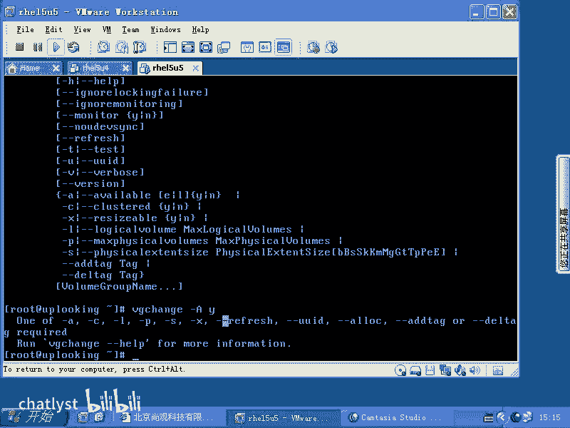

# RHCE教学视频2 - P16：RH133-ULE115-13-3-lvm backup - chatlyst - BV1PJ411D7LB

喂。我们再来看。LVM本身LVM本身啊。它有很多的这个呃它有很多的这个就是操作的这个细节的问题。我们刚才的话呢看了不少啊，刚才看了不少。现在的话呢我们要再加一些。比方说我们的。

物理卷卷组这些东西，他们的话呢是不是会有一些需要维护的时候？我们现在假如说想去让我们的LVM备份一下怎么做啊，这就是我要将要讲的内容。维护的操作的话，大家知道LVM本身它的配置文件的话。

实际上是摆在他们自己的这个就是说这个LVM的这个空间里面的啊。如果要是你想去备份的话呢，你可以输一个什么呢？呃，VG啊VG changeVG change，那么加上个杠杆 helpp。

来看一下VG change的话呢，你可以去启动。

outto back up啊杠AY或者杠AN就是auto back up就是是否把它的这个数据的话呢进行备份。啊，是否把它这个数据进行备份杠大A啊大AY。

如果要是小A的话呢，你看VG change杠大AY。那么我现在的话呢要想把它进行呃。

把，它进行备份啊，这边还需要加一些其他的属性。啊，错了。杠AY地于下的VG0啊。这个的话呢杠小A的话呢，是说是否激活它啊，我看一眼就是。Out。

啊。😮，这个命令的话呢是就是默认情况是打开的，就是outto备份的话呢是打开的。已经打开了，后面可能要加一个什么其他参数啊。这个可能就打开了。这可能就。凹备份的话就打开了。

这个就说我们LVM的自动备份打开了，默认也是打开的。那么当我们的话呢想去把它就说一次性备份一下配置文件的时候，那么我们VG的话呢，有个什么CFG是吧？呃，back up。

这个的话呢所所对应的文件的话是什么？VGCFG什么restore啊，这两个文件的话呢是相对应的。也就是你可以把它备份成一个文件，加杠F参数VGCFG。那这样的话呢，备份啊恢复的时候的话呢。

就是VGCFG是吧？restore然后呢杠F。TMP目录下的AA点BACKUP。啊。去。然后呢去把它恢复回来。这是它的配置备份和配配置的这个呃就是恢复恢复。如果要是你现在想把LVM先停掉啊。

VG呃就是我们LVM整个都停掉，就是现在不想要用了，就是什么呢？VGchange杠A。啊，嗯。这样的话呢就把我们的VG0啊去暂停掉了。这样的话呢，他就说现在这个东西是不可用的。如果要是现在的话。

我想把它打开，那么就是什么一啊，不是零啊，然后呢这边是Y。把它打开。又可用。这是几种就是说LVM的这种控制啊，LVM的控制。

