# RHCE课程：P16：LVM备份与维护 🛡️

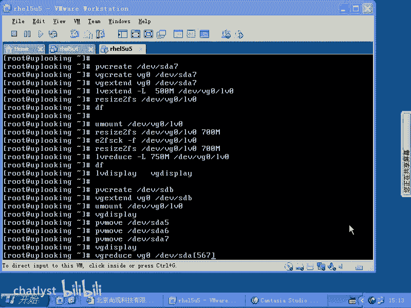

在本节课中，我们将要学习LVM（逻辑卷管理）的备份与基本维护操作。我们将了解如何备份LVM的配置信息，以及如何控制卷组的激活状态，确保数据管理的安全性和灵活性。

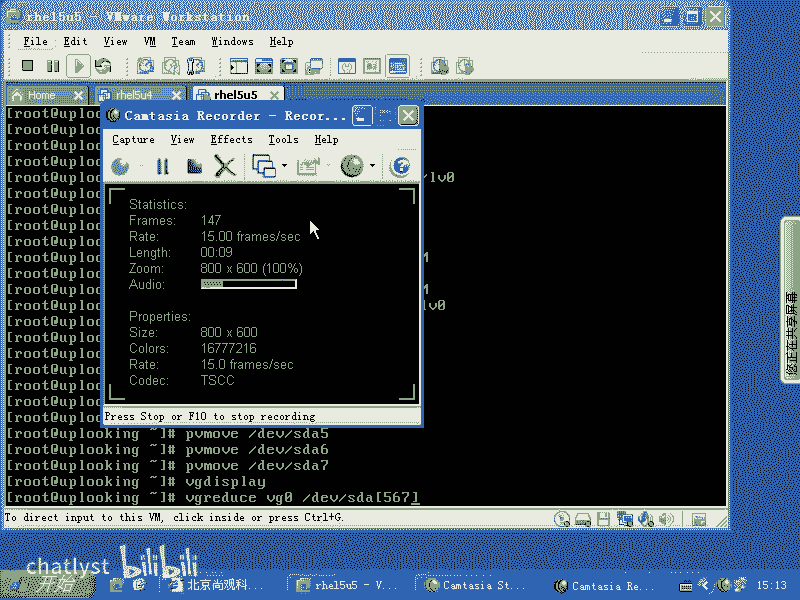

上一节我们介绍了LVM的基本概念和操作，本节中我们来看看如何进行LVM的维护工作。

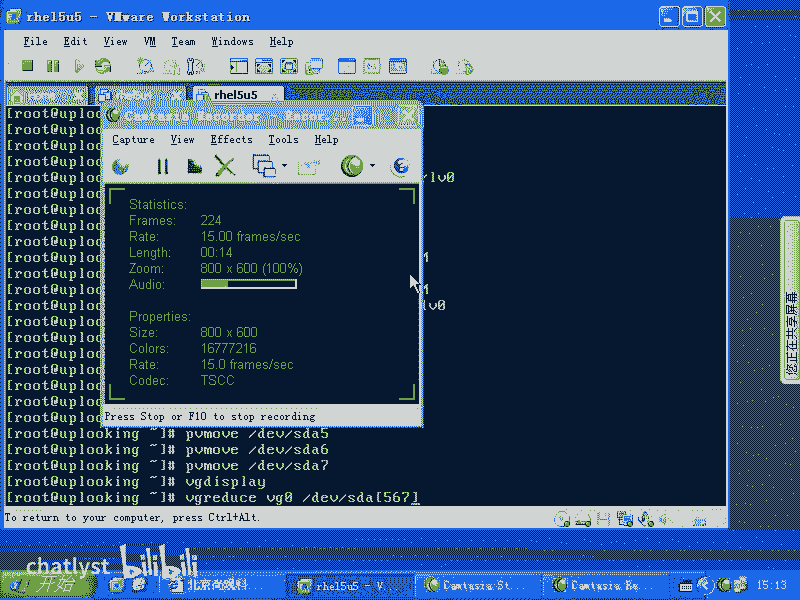

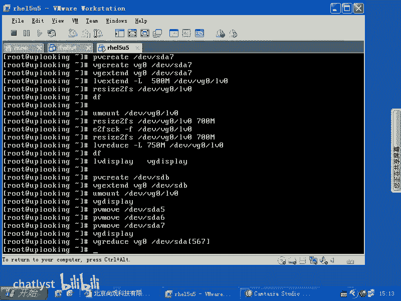

## 开启自动备份

LVM的配置信息存储在其自身的元数据空间中。默认情况下，LVM的自动备份功能是开启的。我们可以使用 `vgchange` 命令来查看或修改这一设置。

以下是查看自动备份状态的命令示例：

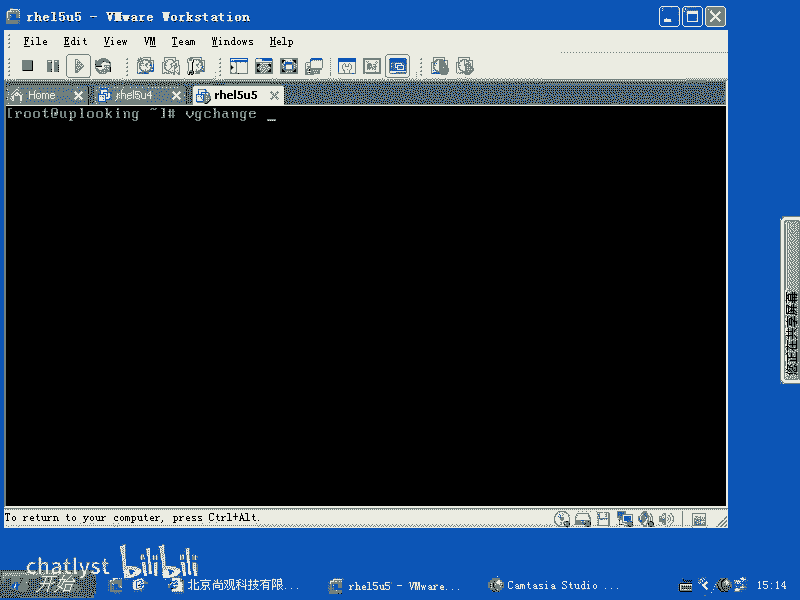

```bash
vgchange --help
```

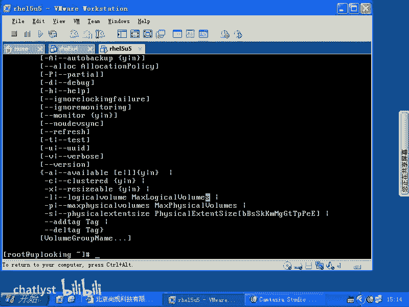

要确认或启用卷组的自动备份，可以使用以下命令：

```bash
vgchange --autobackup y /dev/vg0
```
其中，`--autobackup y` 参数表示启用自动备份，`/dev/vg0` 是目标卷组名称。

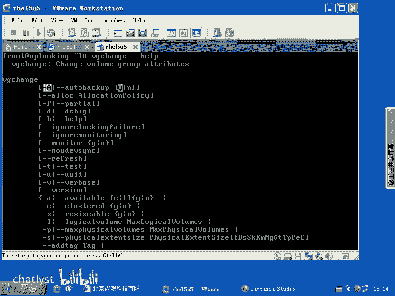

## 手动备份与恢复配置

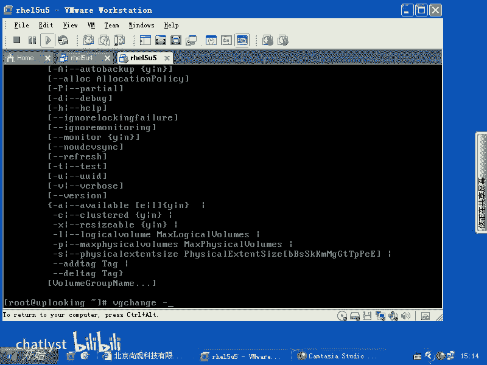

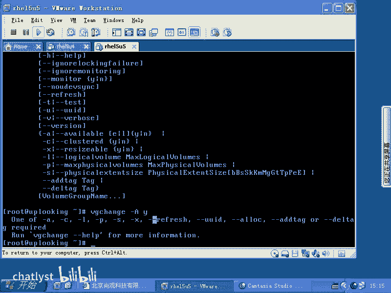

除了自动备份，我们也可以手动将LVM的配置备份到一个独立的文件中，并在需要时进行恢复。

以下是手动备份和恢复配置的命令：

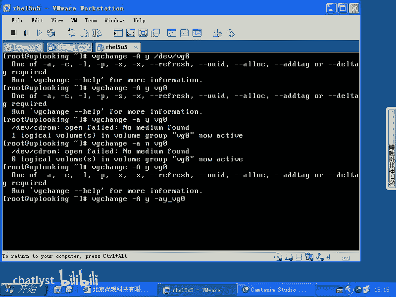

*   **备份配置**：使用 `vgcfgbackup` 命令。
    ```bash
    vgcfgbackup -f /tmp/vg0_backup /dev/vg0
    ```
    这个命令将卷组 `vg0` 的配置备份到 `/tmp/vg0_backup` 文件中。

*   **恢复配置**：使用 `vgcfgrestore` 命令。
    ```bash
    vgcfgrestore -f /tmp/vg0_backup /dev/vg0
    ```
    这个命令可以从备份文件 `/tmp/vg0_backup` 中恢复卷组 `vg0` 的配置。

## 控制卷组状态

在某些维护场景下，我们可能需要临时停用或重新激活一个卷组。

以下是控制卷组激活状态的命令：

*   **停用卷组**：使用 `vgchange` 命令的 `-a n` 参数。
    ```bash
    vgchange -a n /dev/vg0
    ```
    执行此命令后，卷组 `vg0` 及其下的所有逻辑卷将变为不可用状态。

*   **激活卷组**：使用 `vgchange` 命令的 `-a y` 参数。
    ```bash
    vgchange -a y /dev/vg0
    ```
    此命令将重新激活卷组 `vg0`，使其恢复可用。

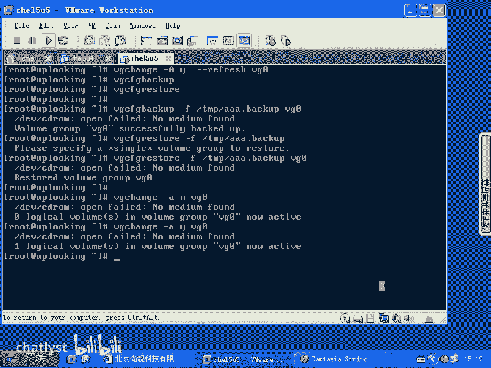

本节课中我们一起学习了LVM的备份与维护操作。我们掌握了如何利用自动和手动方式备份LVM配置，以及如何通过控制卷组的激活状态来进行系统维护。这些技能对于安全地管理存储空间至关重要。