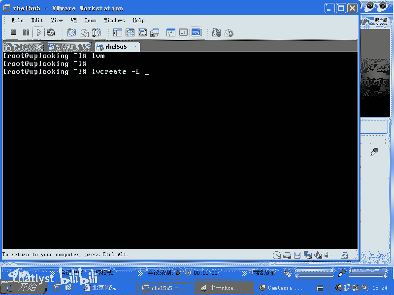
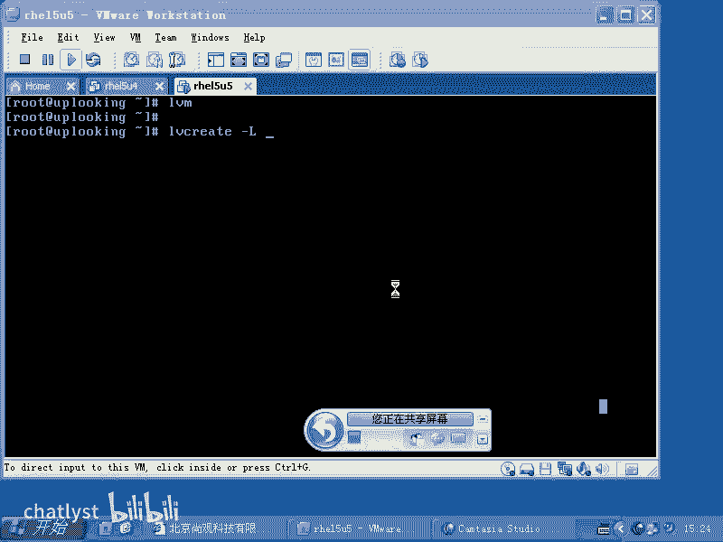
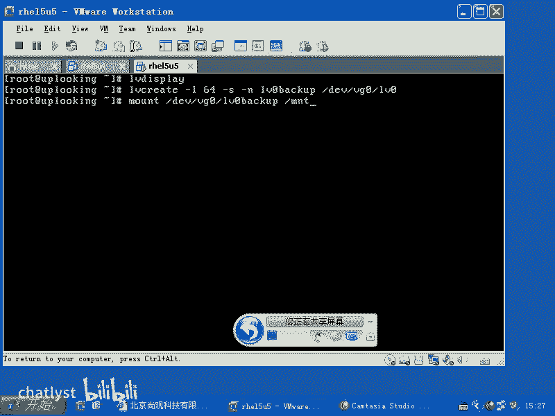
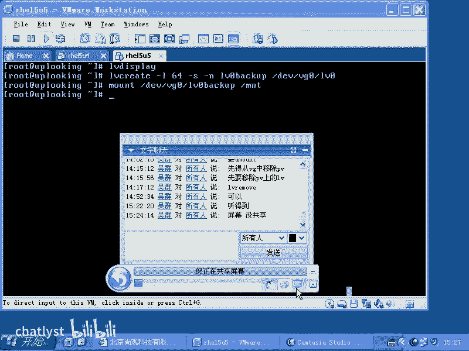
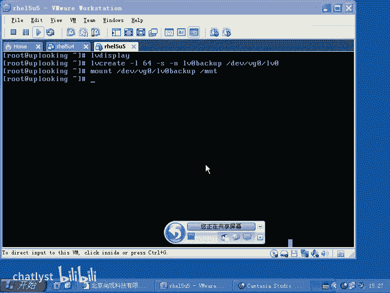

# LVM管理：2.4：LVM快照功能详解 📸

在本节课中，我们将要学习LVM（逻辑卷管理）的一个重要功能——快照。我们将了解快照是什么、为什么需要它，以及如何创建和使用快照来高效地备份数据。

## 概述

LVM快照功能允许我们在某个时间点“冻结”一个逻辑卷的状态，创建一个该卷的副本。这个副本可以用来进行备份，而原始的逻辑卷可以继续正常运行和更新。这极大地缩短了备份大型、活跃数据系统所需的停机时间。

## 快照的应用场景

上一节我们介绍了LVM的基本概念，本节中我们来看看快照的具体应用。当我们想要备份一个大型系统（例如包含数百GB文件的数据库）时，传统方法需要停止应用程序（如Oracle数据库），以确保数据在备份过程中不再变化。这种备份方式称为“冷备份”。

冷备份的缺点是应用程序必须停机，这可能造成服务中断。为了缩短停机时间，我们可以使用LVM快照。其核心思路是：在某个时间点快速创建一个逻辑卷的快照，然后让原始逻辑卷继续运行。备份操作则针对这个静态的快照卷进行，从而实现了近乎“热备份”的效果，大大减少了系统不可用的时间。





## 如何创建LVM快照

创建快照需要使用 `lvcreate` 命令，并配合特定的参数。在深入命令细节前，我们先回顾一下创建普通逻辑卷时与大小相关的参数。

以下是 `lvcreate` 命令中用于指定大小的两个关键参数：
*   **`-L`**：此参数用于直接指定逻辑卷的大小。例如，`-L 100M` 表示创建一个大小为100MB的逻辑卷。
*   **`-l`**：此参数用于指定逻辑卷占用的物理盘区数量。物理盘区是VG中的基本分配单元，默认大小通常为4MB。例如，`-l 64` 表示创建一个占用64个PE的逻辑卷。

创建快照卷的核心步骤和命令如下：

1.  **确定源逻辑卷信息**：首先，使用 `lvdisplay` 命令查看你想要创建快照的那个逻辑卷的详细信息，特别是它的名称和所在卷组。
    ```bash
    lvdisplay
    ```

2.  **执行快照创建命令**：使用 `lvcreate` 命令创建快照。创建快照必须使用 `-s` 参数，它代表 `snapshot`。
    ```bash
    lvcreate -L 100M -s -n lv0_backup /dev/vg0/lv0
    ```
    **命令解析**：
    *   `-L 100M`：为快照卷分配100MB的空间。这个空间用于存放原始卷数据发生变化时的差异数据。大小应根据原始卷的数据变化频率来设定。
    *   `-s`：关键参数，声明此次创建的是一个快照卷。
    *   `-n lv0_backup`：为新创建的快照卷指定一个名称，这里是 `lv0_backup`。
    *   `/dev/vg0/lv0`：指定要为哪个原始逻辑卷创建快照。这里是卷组 `vg0` 中的逻辑卷 `lv0`。

## 使用快照进行备份

快照创建成功后，你就可以像使用普通逻辑卷一样使用它。

1.  **挂载快照卷**：将快照卷挂载到系统的一个目录下。
    ```bash
    mount /dev/vg0/lv0_backup /mnt/snapshot_backup
    ```

2.  **执行备份操作**：现在，你可以对 `/mnt/snapshot_backup` 目录下的数据进行备份操作（例如使用 `tar`, `rsync` 等工具）。此时，原始的逻辑卷 `/dev/vg0/lv0` 及其上运行的应用程序（如数据库）可以完全不受影响地继续运行。

通过这种方式，我们用最短的“冻结”时间（即创建快照的瞬间），完成了一次对大量活跃数据的有效备份。





## 总结



本节课中我们一起学习了LVM的快照功能。我们了解到，快照是原始逻辑卷在某一时间点的静态副本，它通过 `lvcreate -s` 命令创建。利用快照进行备份，可以在几乎不中断服务的情况下完成对大型、活跃数据系统的备份，有效平衡了数据安全性与业务连续性。这是LVM提供的一个非常强大且实用的功能。