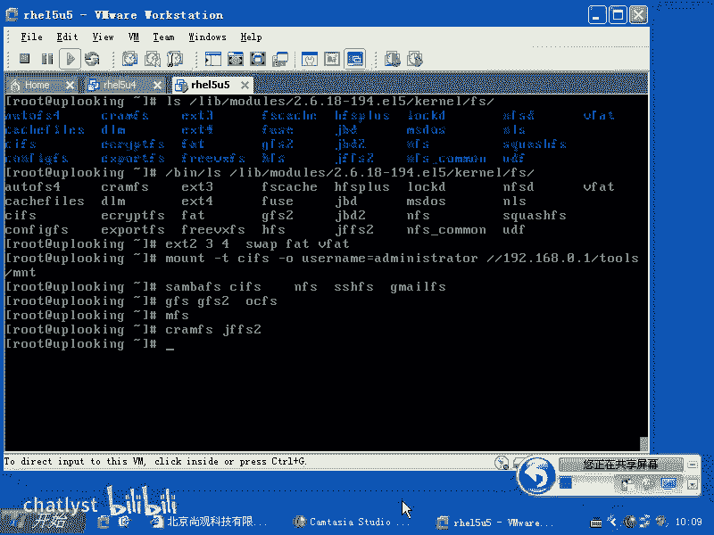
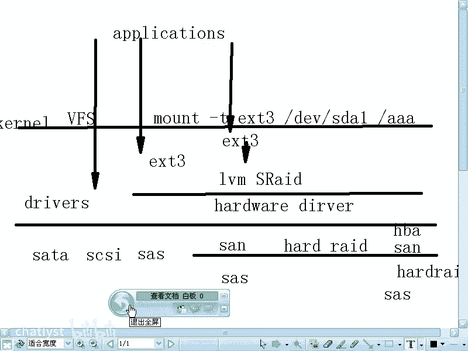
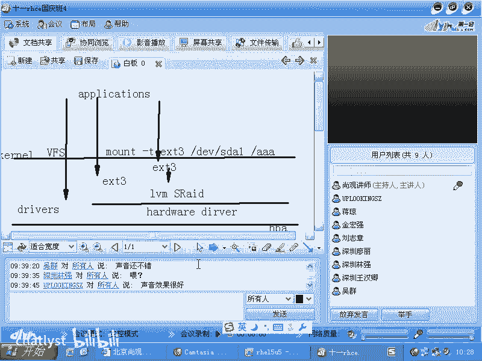

# RHCE教学视频2 - P2：RH133-ULE115-8-1-file system - chatlyst - BV1PJ411D7LB

O现在的话呢我们来看一下加载文件系统。所谓文件系统的话呢，是我们在lininux在windows和在任何的文件系呃任何的这个操作系统里面必须要用到的文件系统。如果要是我们想去加载，它必须得要指定类型。

是不是？就连windows的话，它都有数个类型的什么文件系统。当linux里面的话呢，它支持的文件系统的数量啊是windows的。几十倍啊十几至少10倍以上。为什么这么多呢？

你看我们现在想看一下lininux里面所支持的所有文件系统类型，所有的驱动程序是不是放在LIB目录下models当中是不是2。6点什么什么，然后呢，在这个这是我的内核版本号。

在 kernelnel当中是吧？会有个FS在这里面的话呢，是有我们大量的什么大量的这个文件系统，就是系统已经装的文件系统。但是这是全部吗？不是。是reite给大家编译安装的，是吧？编译出来的，是不是？

那么在我们的内核当中，这个代码及支持的话呢，支持特别多，只不过reite它是怎么样呢？它是给你。编译几个是吧，说这几个我支持其他的，不好意思啊，我不支持。因为如果要是我卖一款软件给你。

这里面带了这个文件系统支持，你要出问题，是不是我要负责，我要我要给你提供技术支持，对不对？所以的话呢这里面的文件系统还是非常少的啊，即使这样这个文件系统都是什么？

现在你看来的话就是呃是windows的10倍，是不是那我们看一下啊，为什么它会这么多呢？第一啊，就是我们在访问windows的网络共享的时候，是不是我们一般不会去考虑哦，它是网络共享。

它怎么会是文件系统呢？那我们linux里面把它认为是一种网络型的什么文件系统，明白吧？也就是说我们除了普通的EXT2EXT3EXT4啊，文件系统之外，这是windowslinux啊常用的。

是不是还有什么呢？还有就像我们的swipe，还有我们的windows的fight是吧？还有wifi这样文件系统，这是常见的这些文件系统之外，这是普通的单机文件系统。也就是说把这个硬盘格式化。

然后我们把它加载是不是？这个我们都很好理解。但是呢在windows里面的一些操作，实际上的话我们的linux把它归结成网络文件系统。比方说有一个机器，它共享了一个目录出来。

我们的话呢在windows下访问这个文件共享，对吧？这个过程的话呢，我们linux里面认为它是什么呢？网络文件系统，也就是n FSFS这种网络文件系统的话呢，我们有什么windows的共享。

是不是叫什么CIFS是不是我们一般的话加载的时候，我们叫什么呢？mount杠T是吧？CIFS然后呢输入一个呃杠Ousus。😊，name是吧，等于啊minitra是不是？然后杠杠19218。0。1。

我还给大家举个例子啊，然后呢，帽子在我们M team目录下，这就是我们的什么，这就是我们的呃加载一个网络文件系，对不对？这网络文件系统的话呢，类似的还有什么呢？这是windows下的文件文件系统的话。

原来啊叫做三8。😊，啊三八。FS啊，那么现在的话我们叫做什么呢？CIFS这windows下的网络文件系统，对不对？那么linux和unux里面互相之间常用的网络文件系统是什么呢？

NFS是不是这叫真正的网络文件系统netFS它就叫这个名，对不对？那么我们还知道SSH是不是我们可以S copypy来数据S copypy过去数据，是不是？那SSH通道的话也可以用来做什么呢？

网络文件系统叫做什么呢？SSHFS。明白了吧？也就是google大家知道用过它的那个机mail是不是机mail的话呢，甚至还有一种网络方式去访问那个机mail的方式，它只不过提供一个公共的接口。

然后有人把它写成文件系统的格式。那么那个文件系统叫什么呢？叫做机mailFS。也说你可以通过自己的用户名和账号mount机妙的那个就是那个服务器，把自己的邮件的话呢，以文件的方式的话来访问，明白吧？

所以这种东西就太多了，这就是什么呢？网络文件系统理解了吗？理解了啊，然后还有什么呢？除了这些文件系统之外啊，还有文件系统。就比方说我们现在的话呢有一个呃。有一个操作，你现在机器上绑了一块硬盘。

你假设说这个硬盘它提供两条。SATA的线一条可以插到你的机上，另外一条插到另外一台机器上。这个硬盘的话呢被我们其中一个机器格式化过，是不是两台机器同时加载。然后呢，第一个机器往里面写了一个文件。

第二个机器再往里面去写文件。这时会怎么样？同时写是吧？你要知道啊，就是说两台机器可以访问一个公用的存储，当然一般没有这样的硬盘，但是阵列柜是有，是不是？当两台机器要访问同样的一个阵列柜的时候。

那这个资源他们两个是可以同时加载的。只要那个阵列柜的硬件支持，对吧？加载完了以后，谁做主呢？我们单机型文链系统认为啊这个存储空间是我做主是吧？我的硬盘我做主，对不对？另外一个机器说这是我的硬盘是吧？

我做主啊，于是他们两个的话呢互相不沟通。也就是说在一个仓库里面，我们要放东西有两个仓库管理员。第一个仓库管理员在什么A1B1这个位置是吧？放了两袋大第二个仓库管理员直接开一辆拖拉机。

然后碾在那个大大米上，就把那个大米什么覆盖掉了，对不对？我要这两个位置我要停什么拖拉机了，是不是？于是的话呢就会造成什么的？这个数据一点都找不回来，所以的话呢，这是什么？

这是单机型文件系统不能应付这种场合的一个最主要的问题，对吧？但是呢这种文件系统的话呢，另外一个文件系统叫做GFS就是我们的。呃，全局文件系统就是说我们的呃rehead自己写的一种叫做。

网就是集群型文件系统，就是说应付多个人同时操作的文件系统叫叫什么呢？GF。或者说呢现在你看到有个什么GFS two是不是GF two。这种文件系统的话呢，就是我们的呃集群型文件系统。还有什么呢？

还有的话呢，像我们的ar口，它叫做OCFS啊OCFS two啊，这就是我们的集群型文件系统。还有什么文件系统呢？比方说云计算里面的话，我们要求有分布式计算啊，分布式运算，分布式存储，分布式存储的话呢。

比方说呃我们有位老师啊就是。呃，他出了一本书，他写了一本书，这本书里面的话呢就是论述云计算里面。比方说有一些组件是云计算，你把一个程序往里面一丢，好多台机器同时给你运算，是不是？还有一个的话呢。

就是什么？就是云存储，云存储的话呢，就是像google之类公司的这种核心。也就是说你现在有一个数据呃，有有一个文件是吧？那么这个文件的话呢，不不算太大啊，大于20T左右。这个文件包里面的话包含着啊。

就不是一个文件啊，是一堆文件。这个文件的话呢，20T存在一台机器上吗？一般存不了是吧？他拖太大的镇叠柜也不行，而且拖一个镇叠柜，这个镇叠柜坏了怎么？也不行。所以的话我们找。

无就是找个几千台那种小的破服务器那个服务器的话呢呃每一个机器的话呢，每一个服务器的话，比方说是两T的容量，是不是？那么我们找了几千台，它可以提供多大的容量呢？1000台吧，那就是2000T。

是不是2000T的容量。那么我除三啊除三，那就是。600多T是不是嗯，也就是说我。用什么呃，我通过我的这个分布式文件系统，我提供三份备份。三份备份，也就是有一台机器坏了以后，那么其他地方还有备份，对吧？

由我的总共的一个控制控制这个中心的话呢，它去定位这个数据包在哪。哪个坏了以后的话呢，再重新放换一台机器上去，他会重建这个数据，是不是这就是google的核心竞争力。那么你说它这个底层的存储。

是不是就是说对于我们这些编程者来说啊，我不是编程者。我说假如说它的编程者来说，是不是就是隔绝开的，他只知道往这个文件系统里面一放东西，是不是就能访问到以后的话呢，也不用担心它数据丢失的问题，对不对？

这就是什么分布式文件系统，你管他这个文件到底放在哪个地方。这就是云计算里面最底层的这个技术，明白吗？所以话呢这就是分布式文件系统。那么常见的有什么呢？MFS啊MF。或者其他文件系统。

那么我们说这些文件系统的话呢，它都是非常的呃用的非常多。我们现在列一列的话，是不是已经有4种文件系统了，是吧？完事了吗？还没有我们知道lininux的话呢被广泛的应用在什么？嵌入式场合。

是不是嵌入式的话呢，就意味着你的你的你比方说你拿买到了一个电视机，这个电视机里面的话呢，有一个嵌入式lininux系统。这个电视机里面给你挂块硬盘是吧？7200转硬盘是吧？你见过吗？没有。

所以一般的话呢，我们这种嵌入式场合的话呢，它的存储啊就比较小，是不是？比较小的话，我们可能要求这个文件系统本身带压缩功能。所以他这时候我们往里面去写的文件系统话有什么呢？有叫做。

CmeFS啊之类的这些这些文件系统。这些文件系统的话呢是什么？这些文件系统的话呢是就是专门针对嵌入式场合去用的，明白吧？所以的话因为linux应用的范围从嵌入式一直到什么云计算啊。

所以的话呢中间各个地方的话呢文件系统它都要支持，明白吗？这样的话，它的数量就是windows下的什么几十几倍二十几倍，明白吧？这就是我们所谓的文件系统。所以大家逐渐编译的话。

你会发现这个文件系统太多了啊，这文件系统太多了。你看这边的话，我有很多啊，像什么呃free呃呃就free free very。FSveta的话呢，现在被那个。呃，被赛门铁克收购啊。

赛门铁克收购vetaveta的核心技术技术是什么呢？它的核心技术大家都知道啊，就是说是我们的那个LVM。明白吧？实际上LVM的话呢，就是从它这边的话呢诞生，但是大家现在都在用。

是不是LVM连windows都支持你windows里面是不是可以创建什么跨区卷？带区卷动态磁盘是吧？这是什么？这就是PVVGLV明白吧？然后LV的话可以支持什么read0是吧？然后呢。

这些技术的话就是从ve test来的。你像很多公司的话，为了让他自己的什么自己的文件系统怎么样被支持是吧？所以他就自己写了一个什么这个驱动，然后免费放在什么。

lininux里面希望自己的东西用的非常广泛，对不对？所以这样的文件系统太多了啊，我们刚才说的那个什么。这个FS啊CmeFS它是什么呢？针对针对嵌入式场合是吧？

还有就是JFFS two是不是JFS two啊，那么再有的话呢，像什么呢？where test文件系统这些商业公司，它的这种自己的这种文件系统是吧？然后呢让让别人去支持。那这样他就会往里面去写啊。

这就是我们刚才给大家说的这些文件系统啊，那么文件系统的类型的话有很多，大家的话呢一定要注意它的这个肩架结构啊，肩架结构。我们的话呢来给大家看一眼。

吓我一跳，我以为的话呢说了半天的话呢，那个人家都没看到，就是已经死死机了啊，喂，能听到吗？OK我们现在看一下这个文件系统的话呢，它是怎么样一个间架结构，这个间架结构大家是一定要理解的，一定要理解。

你学什么的话呢？光记一串命令是吧？可以，没有问题。你可能只完成这个命令。但是呢当有另外的一个程序出来的时候，你不能立刻定位它在整个技术层次当中的位置，理解它的话就不够深入，对不对？

比方说刚才讲了一个google FS的例子，是不是？但是我以前不知道我们的lininux系统里面有一个云计算的这样的一个文件系统，是不是？但是我知道google文件系统的话呢。

就是google FS它本身的这个间架结构是怎么样？所以呢当我们系统当中出来一个文件系统的时候，云计算文件系统时候，云云存储的时候，我立刻能套到google FS上，是不是？

这就是我们对件架结构和体系结构先有一个大致的了解，是不是？所以接下来我画的这个图的话呢，对大家要理解这个文件系统的层次非常有用。那么你暂时可能没有感觉到它有什么问题。但是之后的话呢。

你们在应用的时候就能拿拿出来用。我们首先看一下，就是在系统当中的话呢，我们知道硬件层是不是硬件层有哪些东西啊？硬件层的话呢，比方说有我们的。呃，SATA是不是？SAT然后呢有我们的S是不是？

然后呢有的新一个版本叫什么呢？SAS是不是呃，还有的话呢像什么不管怎么样啊，它这个里面的话呢，这都是硬件接口是不是硬件的类型是不是？还有的话呢像我们的这个有一些场合是不是有些场合的话呢，它会再怎么样呢。

再往下去分，也就是说这个硬件的层次的话呢，也有很多。比方说我们先去用了一个什么呢？先去用了一个呃SAN的光纤存储就是存储域网是吧？storage是吧？area什么netbook是吧？存储域网。

我们知道那个lineLAN是不是还知道那个one是不是就是广域网是吧？line的话局域网是吧？Wline是什么无线局域网是不是，那么这种网络的话呢。

就是我们说呃什么什么域网是不是但是我前面变成S的话时候表示什么？sexy是吧。性感的网络是不是？开个网线开个玩笑，就说存储story是吧？所以存储域网的话呢，它是一种网络。

这种网络的话跟我们的以太网跟我们的什么3G跟我们的什么ADSL这种网络都是不一样的。它跑的是它另外一种协议，是不是？但是呢我们通过这个光纤去访问到阵列柜里面以后，阵列柜里面插什么硬盘呢？

还是什么SAS的硬盘，对不对？所以这样的话，我们就在SAN下面的话，又有一个什么又一个层次叫什么？😊，就是我们本身这个协议的层次是吧？存储的协议的层次或者硬件的层次，是不是这样的话。

我们的硬件本身是不是分了很多层次啊？那么硬件准备好了以后，你怎么去应用这个硬件？怎么去用这个硬件呢？怎么去用这个硬件。怎么去用呢？那么一般的话我们去访问它的时候，我们必须得要通过什么内核去访问是吧？

内核是可以直接访问的。也就是说我们的 kernelel的话呢是可以直接访问。c到直接访问科l直接通过什么呢？driver。是不是啊通过dvers直接去访问。那么我们这个dvers的话呢，有什么呢？

SAT的驱动，sga卡的驱动，readd的驱动等等啊。也就是说我们现在SATA上层的话呢，还可能用到一个什么呢？比方说呃。SA呃，就是我们的这个软硬锐的是吧？hard是吧hard，然后。

是吧也有可能的话呢，这个东西还在什么？就是说。SAN存储上用一个什么呢？硬瑞的，是不是？硬瑞的是吧？然后呢，再加什么？再加SASD硬盘，是不是很多时候都是这样的。那么我们在这边的话呢，上面的话呢。

再通过一个什么HBA卡，是不是就是说主机总线适配器卡，然后呢去连接，对不对？总之这个硬件大家要明白，就是它的层次可能是很多的，是不是？然后呢，这个时候我们这个驱动层是不是它就开始驱动。

它直接访问的那些硬件啊，直接能访问硬件驱动程序是针对硬件的，是不是？那么我们如果要是有一个HBA卡，那它就要驱动HBA卡去访问下面的什么呢？SAN存储是不是？我SN存储了以后，那个阵列柜的话呢。

它有很多硬盘，这些硬盘的话，做了read是不是？这样的话呢，它的层次就很多种。那么一般我们的内核的话呢，要求有驱动就能访问HBA卡，是不是？然后呢，我们还要有磁盘或者read的驱动，是不是？然后呢。

我们可以访问下面的东西，对不对？那这个的话呢，就是我们的层次结构。这个驱动程序当中的话。我们说有一种啊就是说这是硬件的驱动。那么我们可以说驱动程序它范围是很大的啊。

也就是说我们现在的话呢想把呃我们现在的话呢想把这个驱动程序再去分类的时候，那么这个驱动程序啊，这个 kernelnal的话呢，它就是整个的这个范围。那这个驱动程序的话呢，它实际上是分成很多层次，对不对？

那么驱动程序的一个层次的话呢，就是我们的什么hardware就是我们的。硬件的什么？是吧driver drivers，那么还会有什么呢？就是说我们可能还用到的是什么呢？就是说我们的这个呃。

软件的这个层次，也就是科诺想去使用它的话呢，我们这边可能会有一个什么EXT3的文件系统，是不是？是吧EX3文件系统EX3文件系统是。本地文件。是本地文件系统。对。

是我们通过本地文件系统格式化掉了一个硬件。然后呢，我们让应用程序的话呢，可以访问某个目录，是不是？然后呢，通过这个文件系统的话去访问到这个硬件，是不是？现在的话呢，假如说有一个程序，这个应用程序啊。

这个应用程序。appplications是吧。这些程序的话呢，他想去访问下面的硬件的时候。他想去访问下面的硬件的时候，他可以直接访问到这个文件系统。也就是说他去访问某个目录当中的某个文件，对不对？

这是我们用的非常非常多的。但是呢这个文件系统有的时候啊并不是那么单独一个层次去成立的。那么他可能是什么呢？他可能这样。我们的话呢会有格式化。我们会有格式化。但是呢我这个格式化之前。

我先做软锐的或者LVM。是不是？LVM或者是什么呢？software。read是不是sofware read，那么这样的话呢，它就是又多了一个层次。所以整整个的存储体系的话呢，间价结构一定要清楚。

而我们有一些。应用程序的话呢，它甚至不用这个文件系统这个层次，或者说它这个文件系统之下的有一个什么呢？就是我们虚拟硬件的这个层次。你看我们这边下面是不是实际的硬件。是不是那现在我问大家。

假如说我有2块硬盘，我把这两个硬盘的话呢，做成一个read0。就是说我去写入一个文件的时候，这边写50兆，那边写50兆，是不是100兆的文件，我这边写50兆，那边写50兆。这是不是我把这个硬盘做了。

或者分区做了一个readd0。那实际当中有没有这个red零的这个硬件？没有，是不是？所以我们因为想去加快速度。或者想提供什么呢？我们动态的可以扩大磁盘是吧？我们人为的加了一些软的什么驱动，是吧是？

这就是我们所说的LVM啊software read的就是软的驱动。明白了吧？这种软的驱动的话呢，跟硬的驱动又不一样，它最终写的时候还是要写在什么？硬的驱动上了是吧？硬的驱动的话，比方说我们有个阵列柜。

这个阵列柜的话呢，它本身做read几跟上面的硬跟上面的驱动程序就无关了，明白吧？上面呢我们说这个地方hudware driver它们的话呢想去。这个写错了是吧？DRDRIVER啊这个地方写错了。

那么也就是说 driver的话呢，它到底就是关心不关心你硬件是怎么配置的呢？它可以不关心是不是？也就是说我这边的话呢，我只要照顾到跟我直接相交的这个层次就O了，是不是直接相交这个层次就O了。

所以这个时候的话呢，你会发觉这个驱动的层次，还有硬件的层次都是有多层的，是不是多层的，只不过是你写入一个数据以后的话，再由谁来承接你上层写入的数据。你比方说上面的话呢。

文件系统这个地方写入了1个100兆的文件是吧？文件系统不关心，他只知道按照文章文件系统的格式，把这100兆分开成很多块，对不对？但是这些块在实际写入的时候，比方说是通过LVM再去写入的时候。

这时候LVM就把那些块接过来是吧？我说哎这几块往那边去写这几块往那边去写。😊，明白了吧？这是软件层次。那么最终它往这边去写往SDA上去写的时候，SDA假如说是一个阵列柜。

那么它就通过HB卡就直接什么发送到什么那个光纤阵列柜上了，光纤振列柜一接到这个数据包以后，说什么哎我这边的话有5块硬盘做了什么read5是不是那这个这个到那边那个到那边他在分块这样一层一层下来的话呢。

这个就是说每一层相交的部分他们要关心，那么他不用关心什么越级的部分，知道了吧？所以这个过程的话呢，在一开始接触的时候，很多人的话都是不太明白啊，那么我们有一些大型的应用程序。比方说oracle数据库。

它可以直接跳过什么呢？文件系统的类型，直接访问到什么，直接访问到我们的硬件的驱动当中去啊，比方说他直接访问的是SDA，他把SDA变成一个设备，就是裸设备他不用什么它不用你操作系统的文件系统去改。

你就不用EXT3系统，我就直接自己写硬盘。😡，这个意思明白吧？啊，就相就相当于什么呢？就相当于我去操作这个数据的时候，文件系统它要把数据分成一块一块，是不是？然后当某一块被占用的时候。

它要告诉新写的程序的话，你要放到别的块里面来。我这个整个用了多少块，对不对？这是操作系统的意义。但是呢oracle是什么程序呢？orle说，哎呀，你这ES3文件系统写的太烂了。还不如我自己改。

是不是这就是什么呢？oracle也就是它自己内置了什么这种文件系统的功能，明白吗？它的话呢有非常详细的像表空间啊，是吧？还有什么段呢，还有什么什么，这样一级一级下来blog之类的。

是不是他自己可以管自己管的效率就是什么呢？少了一个什么层次是吧？少了一个层次以后，它就速度就非常快，明白了吗？嗯所以我们的话在linux里面有个好处是什么呢？我们可以直接跳过文件系统，直接去改什么呢？

这个硬件里面的东西。比方说你说我给大家演示过cat低于一下的SDA。嗯，是不是那个的话就是跳过文件系统，然后呢直接去访问硬件。那相反，如果要是你现在想去使用某一个软件，这个软件的话。

它没有arle那么大布头，对不对？arle安装的话至少要半个小时一个小时，是不是？没有oracle那么大不同，他不可能自己去写什么怎么管理这个块，是不是？你比方说你写这一个小程序。

这个小程序是呃这个小程序是一个呃web服务器，那你还要管哎这个 web部服务器怎么访问硬件是不是那就变成什么？由一个应用开发者直接变成什么内核驱动开发者是吧？然后学惯古今，你才能开发这个硬件。

他要开发这个软件是吧？这是不可能的。所以通常情况下，所有的大部分的这个就是程序开发人员的话，应用程序开发人员，他是不关心底层的什么这种驱动是怎么写，明白吧？

所以的话oracle在最开始移植到什么linux上来的时候，他就大骂lininux下的什么开发人员说，这些家伙都不知道硬件是怎么去写数据的，他觉得那个效率特别低，明白吧？这就是这个基理。

所以大部分的应用软件的话，都是直接访问什么文件系统是不是？他的话呢可能去访问这个文件系统，然后再让让文件系统他在跟下面的什么这个LVM等等的话呢去。あ？去交流啊。删掉了啊，那种删掉无意中删掉了。

就是说我这边LVM和软锐的是不是？然后在最后写到硬件当中去。所以的话由此啊，我们来看一下，那么现在你说纸上谈兵的半天是吧？那么我们这边到底对我们来说有什么意义呢？那么如果要是你想用文件系统。

文件系统的话，就自然存在一个什么呢？mount的过程。也就是说不mount，你就没有办法用文件系统去使用那个硬件。本来你可以使用什么D一V下的SDA是不是？

但是为什么你要用分D一V下的SDA下的分区的时候，你要mount它一下。不m他，你就相当于在访问这个硬件的时候，就没有通过文件系统，是不是？没有通过文件系统的。问题在哪呢？就比方说我们这边有个仓库。

这个仓库的话呢，是刚刚建成的仓库，地面上没有任何的这个规划，没有说这个小的区域是什么？A一区，那个小的区域是什么？B一区是吧？那么我们放东西会怎么放呢？我们把一个一袋大米是吧？啪堆到门口是不是？然后呢。

第二天我们又放过来几个数据，是几块砖头是吧？那么22块2块砖头，我们放在大米的旁边是吧？第三天我们又放了一个什么呢？呃，开了辆小汽车过来，放到砖头的旁边是吧？我放了三样东西，我能记得住，是不是？

放第四样东西的时候，过了一个月啊，你放第四样东西哎。原来我放到哪来着？😡，我不知道我放到哪个地方了，是不是这个时候的话呢，你知道数据的话，它并不是凸起的东西，是不是？那么我开辆我又开一辆大吊车过来。

然后我直接什么呢？把大米碾过去，然后把砖头碾碎，然后直接再把我们刚才停的小汽车在什么。在下面然后这样的话，你什么数据都落不下，知道吧？所以文件系统的意义是什么呢？

我们找一个管理这个仓库的一个什么书记员是吧？他在前面有个表格是吧？然后他把仓库的地表画上什么的区域，说这一块叫A一区是吧？这块叫B一区那块叫C1区是吧？然后接着是A2B2C2明白吧？

这样我画分成表格以后，然后你放砖头过来，我在表格上记录，说砖头在哪儿，在A1和A22个区是吧？这样的话呢，我再放一个汽车过来时后，我直接占用什么C1到C55个区是不是开一辆大卡车过来以后，我再排。

因为我已经记录着C1和C5C1到C5都被别人占用了，是不是那么不管我再去寻找这个砖头也好，还是寻找这个小汽车也好，我都可以通过查那个表能查到，是不是然后呢我再去写入一个数据存放个数据的时候。

也不会占用其他已经有的数据格式，是不是这个文件。所以这个文件系统的话呢，你必须要加载，也就道加载的过程就是什么？杠T啊，然后呢，比方说EXT3是吧，我要把地位下的SDA是不是SDAEmount在哪呢？

mount到。😊，SDAEmount到我们的。某一个目录下去，你比方说AAA目录下去。那么当我们去访问AAA目录的时候，它就是以EX3的方式去访问谁啊，去访问SDAE明白吧？

实际上就是通过了这个文件系统，然后访问到了硬件，是不是再调用硬件的驱动。所以这个过程的话呢，是非常清楚的。所以我们由此可以看出啊，就是说这个层次结构。那么呃层次结构当中体现的是我们的这个文件系统。

它到底是呃什么时候告诉文件系统去什么，用这呃告诉操作系统用什么样的文件系统，什么时候用什么样的文件系统去访问那个地方是吧？所以这个时候我们访问杠AA的时候，就是以EX3的方式去访问那个硬件。

是不是那么访问其他目录的时候，可能以其他的文件文件系统的格式去访问，是不是？那这个时候我们要有一个管理整个体系的一个管理者，这个管理者叫什么呢？这个管理者叫什么呢？VFS啊叫做虚拟文件系统。

也就是VEFS它的作用是什么呢？就是维护着整个的一个树形结构。啊，他知道在整个这个数形结构当中，杠AAA这个地方新加载了一个资源是吧？我只要访问杠AA它就要以指定的方式去访问指定的硬件，明白了吧？嗯。

那么如果要是我新加载一个东西，那么他就会添加一个加载点。当我访问那个目录下的什么什么东西的时候，又要怎么样，又要以刚才加载的那种方式去访问那个硬件，是不是？所以整个的这个呃mount命令。

就是对VFS的一个操作，清楚了没有？清楚了啊，所有的加载点都是由VFS去管理的。我们访问一个加载点的时候，这个加载点下面的所有的文件全部都是以指定的文件系统格式去访问指定的硬件，它被重定向了，是不是？

嗯，如果你又忘掉它，那么它又回复成原本的默认的状态了。😊，是不是？如果要是我没有去加载，youmount掉这个地方，you mount掉它。那么这个时候我访问AA的时候就怎么样，就是还是按默认的方式。

是不是没有加载点的时候，VFS他就不管。所以VFS是为维护一个整个的大的数。明白了吧。好，这边的话呢我们清楚了以后，然后呢我们就看细节了啊，这个题结构，还有我们的文件系统类型。我们告诉大家。

就是说说的比较多是吧？大家的话呢这个脑子里面的话要有这个图啊，我刚才的话呢，把这个地方删掉了是吧？有LVMLVM和什么呢？software read是吧？是吧软瑞的是不是？好。

这边的话呢就是我们的这个金价体系结构啊，我们的话呢回过头来看一下，就是具体该怎么样去操作。

