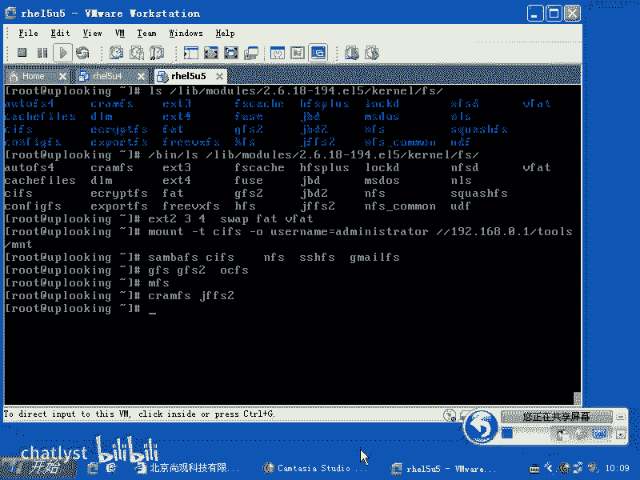
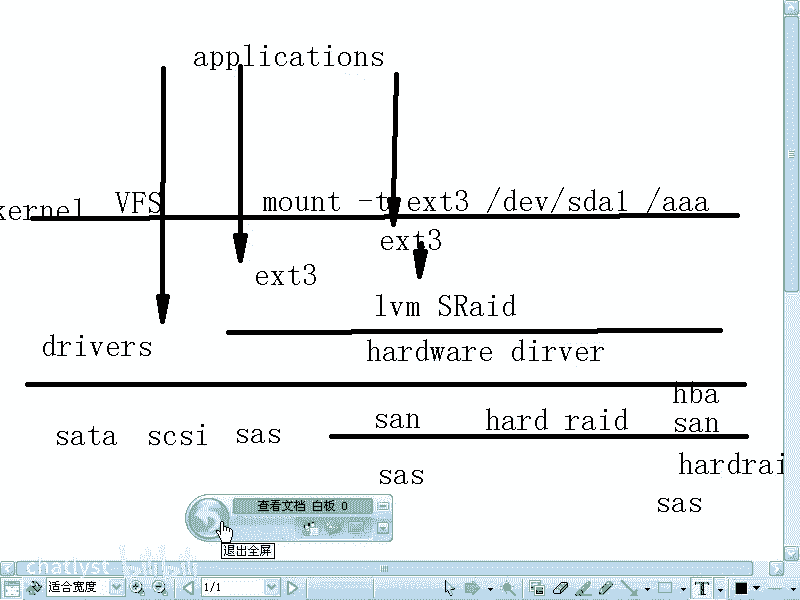
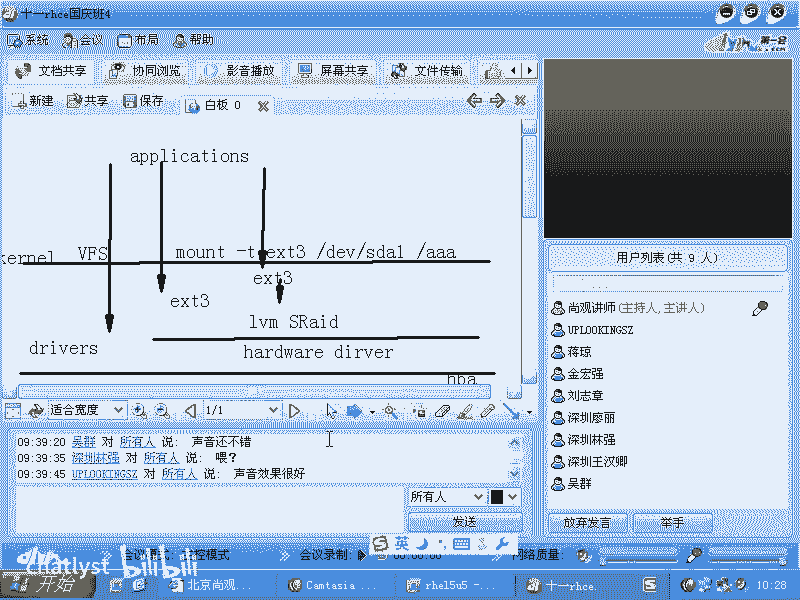

# RHCE课程：2：文件系统加载与管理

## 概述
在本节课中，我们将学习Linux操作系统中文件系统的概念、类型及其层次结构。我们将探讨如何加载（mount）文件系统，并理解虚拟文件系统（VFS）在其中的核心作用。通过本节学习，你将掌握文件系统的基本操作原理。

---

## 文件系统类型简介
上一节我们介绍了操作系统的基本概念，本节中我们来看看文件系统。文件系统是Linux、Windows及任何操作系统中必须使用的组件。加载文件系统时必须指定其类型。

Windows系统有数种文件系统类型。Linux系统支持的文件系统数量至少是Windows的十倍以上。原因在于Linux应用场景广泛。

查看Linux内核已编译支持的文件系统类型，驱动程序位于`/lib/modules/`目录下，具体路径根据内核版本而定，例如`/lib/modules/$(uname -r)/kernel/fs/`。该目录存放了系统已安装的文件系统驱动。

但这并非全部。Linux内核代码本身支持更多文件系统类型，但发行版（如Red Hat）通常只编译并默认包含一部分。这是出于商业支持与稳定性的考虑。

Linux支持众多文件系统类型，主要原因如下：

### 网络文件系统
除了常见的单机文件系统（如EXT2、EXT3、EXT4），Linux还将网络共享访问视为一种文件系统。

以下是常见的网络文件系统示例：
*   **CIFS/SMBFS**：用于访问Windows网络共享。加载命令示例：`mount -t cifs -o username=administrator //192.168.0.1/share /mnt/team`
*   **NFS**：用于Linux/Unix系统间的网络文件共享。
*   **SSHFS**：通过SSH协议访问的远程文件系统。
*   **GmailFS**：一种将Gmail邮箱挂载为文件系统的特殊类型。

### 集群文件系统
当多台服务器需要同时访问并写入同一共享存储（如存储区域网络SAN）时，单机文件系统无法协调写入，会导致数据损坏。集群文件系统专为此设计。

以下是常见的集群文件系统：
*   **GFS/GFS2**：Red Hat开发的集群文件系统。
*   **OCFS/OCFS2**：Oracle开发的集群文件系统。

### 分布式文件系统
应用于云计算场景，将海量数据分散存储于成千上万台服务器，并通过冗余备份保证数据可靠性。用户无需关心数据的具体物理位置。

常见的分布式文件系统有**MFS**等。

### 嵌入式文件系统
针对存储空间有限的嵌入式设备（如智能电视），这类文件系统通常具有压缩功能以节省空间。

常见的嵌入式文件系统有**CramFS**、**JFFS2**等。



此外，许多商业公司（如Veritas）也会为其技术开发Linux驱动，希望获得更广泛的支持，这进一步丰富了Linux的文件系统生态。

理解文件系统的架构层次至关重要。它帮助我们在面对新技术时，能快速定位其在整体技术栈中的位置。例如，了解Google文件系统（GFS）的架构后，再遇到新的云存储文件系统就能触类旁通。

---

## 文件系统层次架构
上一节我们了解了丰富的文件系统类型，本节中我们来看看它们是如何协同工作的。理解存储体系的层次结构是深入学习的基础。

整个存储访问的层次结构如下图所示，自底向上包括：

```
+-----------------------+
|     应用程序 (App)     |
+-----------------------+
|   虚拟文件系统 (VFS)   |
+-----------------------+
| 具体文件系统 (如EXT4)  |
+-----------------------+
| 逻辑卷管理 (LVM)/软RAID|
+-----------------------+
|     设备驱动层         |
+-----------------------+
|       硬件层           |
+-----------------------+
```

**硬件层**：包含物理存储设备及其连接接口（如SATA、SCSI、SAS），以及更复杂的存储网络（如存储区域网络SAN）。

**设备驱动层**：内核通过驱动程序（如SATA驱动、HBA卡驱动、RAID卡驱动）直接与硬件层通信。驱动程序只关心与其直接交互的硬件层。

**逻辑卷管理层**：在物理硬件之上，可以创建软件抽象层以实现更灵活的管理。例如：
*   **软件RAID**：将多块物理磁盘组合成逻辑卷（如RAID 0），提升性能或可靠性。
*   **LVM**：实现动态的磁盘空间管理。

**具体文件系统层**：如EXT4、XFS等。文件系统负责将数据组织成文件、目录，并管理磁盘空间的分配与回收（就像仓库管理员规划货架并记录货物位置）。

**虚拟文件系统层**：VFS是内核提供的抽象层，它统一了不同文件系统的操作接口，并维护整个系统的目录树结构。当执行`mount`命令时，就是在VFS中注册一个“挂载点”，将某个目录与特定的文件系统及存储设备关联起来。

**应用程序层**：大多数应用程序通过VFS和具体文件系统访问存储。少数高性能应用（如Oracle数据库）为了极致性能，可能会绕过文件系统层，直接访问“裸设备”。

**层次结构的意义**：每一层只与相邻的上下层交互，无需关心其他层的具体实现。这种设计使得各层可以独立发展和替换。例如，更换硬盘（硬件层）或升级文件系统（文件系统层），只要接口不变，上层应用就无需修改。

---

## 加载文件系统的原理与操作
上一节我们剖析了文件系统的层次架构，本节中我们来看看如何实际使用它，核心操作就是加载（mount）。

**为什么需要加载文件系统？**
不加载文件系统，虽然可以直接读写磁盘设备文件（如`/dev/sda1`），但这就像在一个没有货架标识和库存记录的仓库里随意堆放货物，无法高效、安全地管理文件。文件系统提供了这套“仓库管理系统”。

加载文件系统，就是告诉VFS：**“请将`/dev/sda1`设备上的EXT4文件系统，关联到目录`/mnt/data`。以后所有对`/mnt/data`及其子目录的访问，都请使用EXT4的规则来读写`/dev/sda1`。”**

**基本加载命令格式**：
```bash
mount -t <文件系统类型> <设备名> <挂载点目录>
```
例如：
```bash
mount -t ext4 /dev/sda1 /mnt/data
```

**VFS的核心作用**：
VFS维护着整个系统的目录树。`mount`命令的本质是向VFS添加或修改一个“挂载点”映射。当访问该目录时，VFS将其重定向到对应的文件系统驱动和存储设备。执行`umount`命令后，该映射关系解除，目录恢复其原本的访问方式。

---

## 总结
本节课中我们一起学习了Linux文件系统的核心知识。

我们首先了解到Linux支持远超Windows的丰富文件系统类型，包括单机、网络、集群、分布式及嵌入式文件系统，这是其广泛应用领域的体现。

随后，我们深入探讨了存储体系的层次化架构，从底层的硬件与驱动，到逻辑卷管理，再到具体的文件系统，最后是统一管理一切的虚拟文件系统。理解这个架构有助于我们定位和解决复杂的存储问题。

最后，我们学习了文件系统加载的原理。`mount`命令是连接存储设备、文件系统与系统目录树的关键操作，而这一切都由虚拟文件系统在后台协调管理。





掌握这些原理，是进行系统管理、性能调优和故障诊断的重要基础。