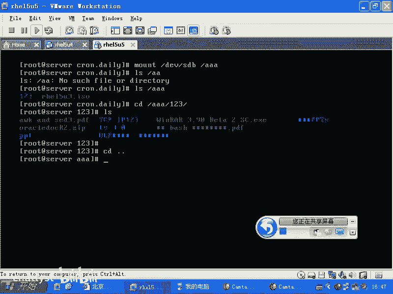
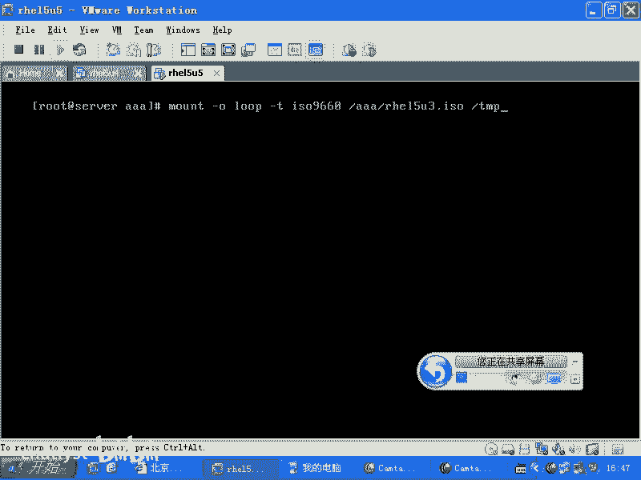
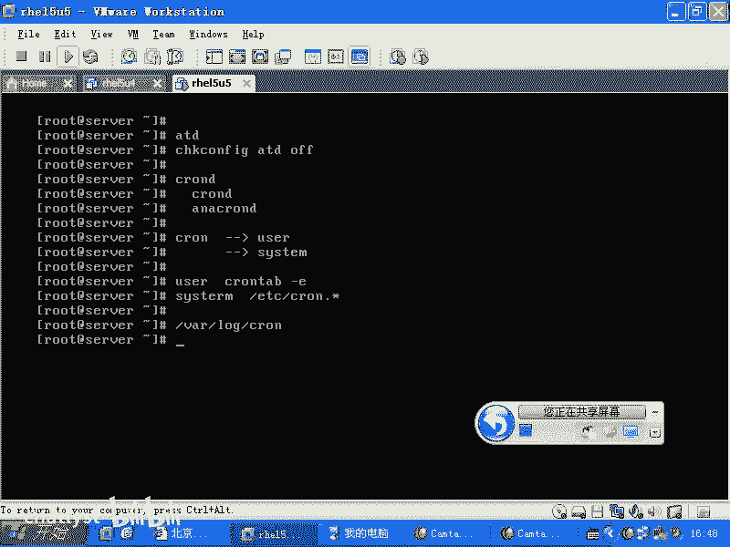
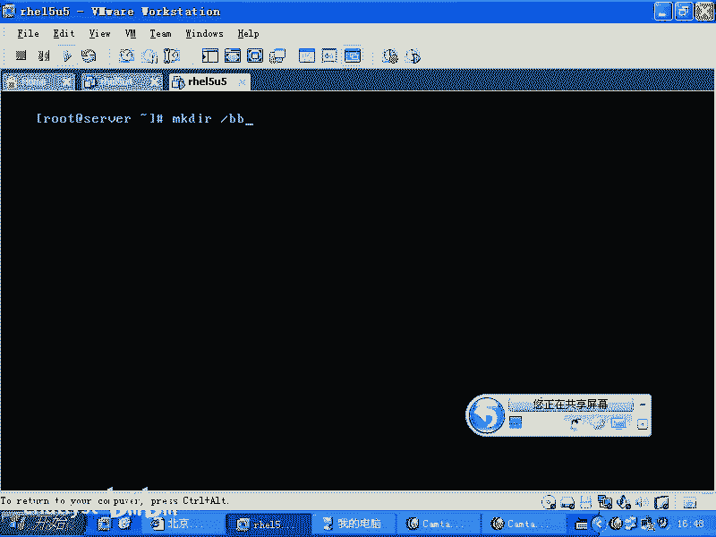
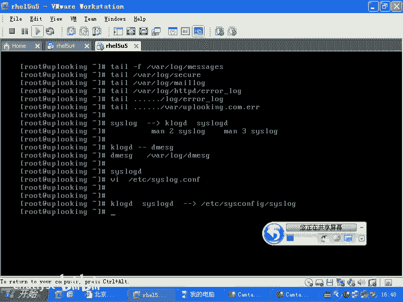
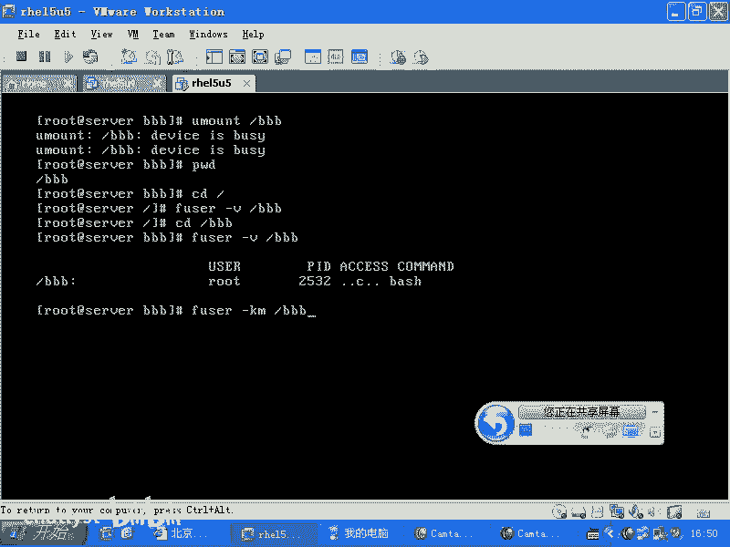
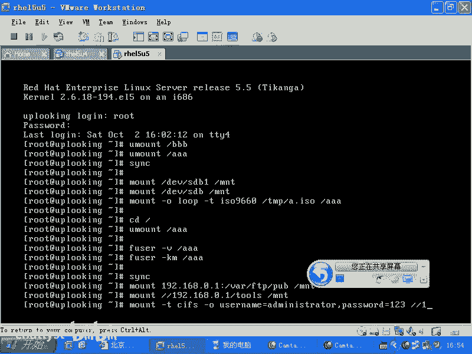
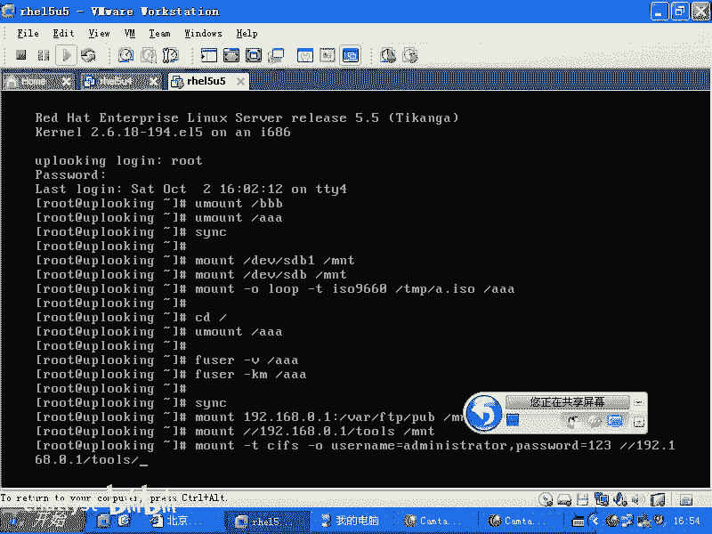
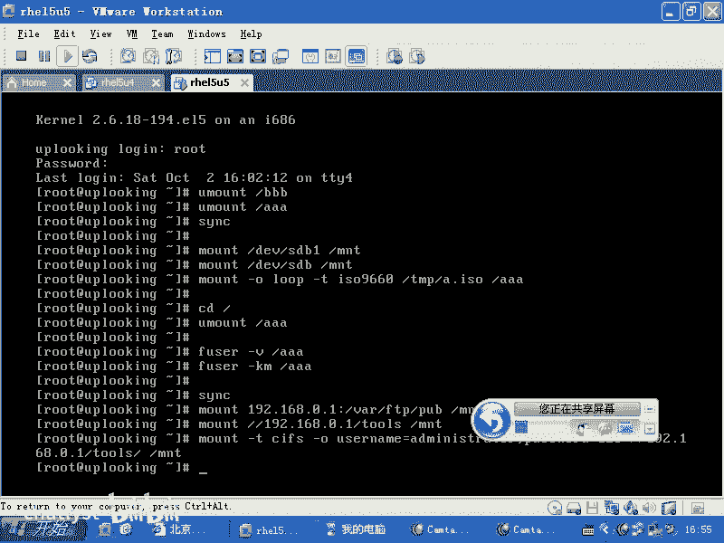
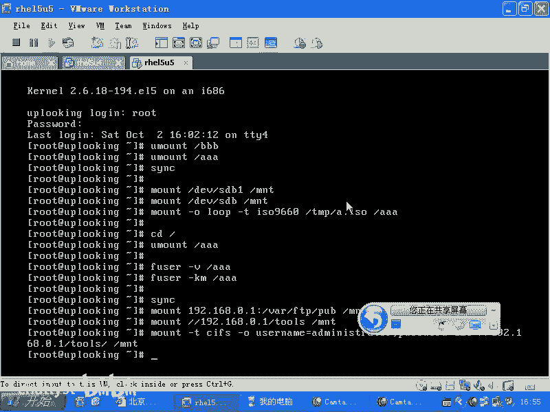

# RHCE教学视频2：P3：挂载USB与使用fuser命令 📂

在本节课中，我们将学习如何在Linux系统中挂载USB设备、ISO镜像文件，以及如何安全地卸载它们。当卸载遇到“设备忙”的错误时，我们将使用`fuser`命令来查找并终止占用进程。课程内容简单直白，适合初学者理解。

## 挂载ISO镜像文件 💿



上一节我们介绍了挂载USB设备的基本操作，本节中我们来看看如何挂载一个ISO镜像文件。ISO镜像文件是光盘内容的完整副本，可以像物理光盘一样被挂载到系统目录中。





挂载ISO镜像文件的命令格式如下：
```bash
mount -o loop -t iso9660 /路径/到/镜像.iso /挂载点目录
```
其中，`-o loop`选项用于挂载镜像文件，`-t iso9660`指定了光盘文件系统类型。





**重要提示**：请勿使用`/tmp`等系统临时目录作为挂载点，因为其他程序可能正在使用该目录，强制卸载会导致问题。建议创建一个专用目录。

以下是操作步骤：
1.  创建一个目录作为挂载点，例如`/mnt/bbb`。
2.  执行挂载命令，将ISO文件挂载到该目录。
3.  使用`cd`命令进入挂载点目录，即可访问镜像内的文件。

## 安全卸载设备与fuser命令 🛑

当我们尝试卸载一个设备时，可能会遇到“设备正忙”的错误。这通常是因为有进程正在使用挂载点目录下的文件。

此时，你不能直接卸载，就像不能站在桥上却要把桥拆掉一样。你需要先让所有使用该目录的进程离开。

`fuser`命令可以帮助我们查看并管理这些进程。



以下是`fuser`命令的常用方法：
*   `fuser -v /挂载点目录`：**查看**有哪些进程正在使用指定的挂载点。
*   `fuser -km /挂载点目录`：**终止**所有正在使用指定挂载点的进程。`-k`表示杀死进程，`-m`指定挂载点。

例如，如果你在挂载点目录内，`fuser -km`命令会终止你的当前shell进程，导致你退出登录。因此，更安全的做法是先退出挂载点目录，再使用`umount`命令。

## 数据同步与卸载 🔄

在卸载U盘等移动存储设备前，为确保所有缓存中的数据都已写入设备，避免数据丢失，可以使用`sync`命令。

`sync`命令会将内存缓冲区中的数据强制写入硬盘。对于U盘，写入可能较慢，执行此命令后可能需要稍作等待。

因此，完整的卸载流程建议是：
1.  退出挂载点目录。
2.  运行`sync`命令同步数据。
3.  使用`umount`命令卸载设备。

## 其他挂载示例 🌐

除了USB和ISO文件，`mount`命令还可以用于挂载网络共享。

以下是两种常见的网络挂载示例：
*   **挂载NFS共享**：`mount 192.168.0.1:/shared/path /mnt`
*   **挂载Windows共享 (CIFS/SMB)**：
    ```bash
    mount -t cifs //192.168.0.1/sharename /mnt -o username=your_username,password=your_password
    ```
    如果省略`password`参数，系统会提示你输入密码。





---





本节课中我们一起学习了如何挂载ISO镜像文件，以及使用`fuser`命令解决卸载时“设备忙”的问题。我们还了解了`sync`命令在安全移除存储设备时的作用，并简要介绍了挂载网络共享的方法。掌握这些命令能让你更有效地在Linux系统中管理各种存储介质。