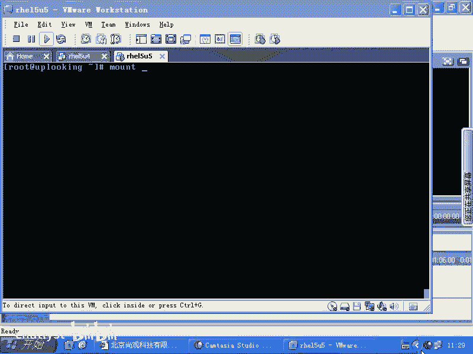
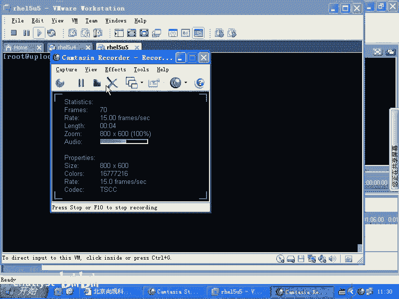
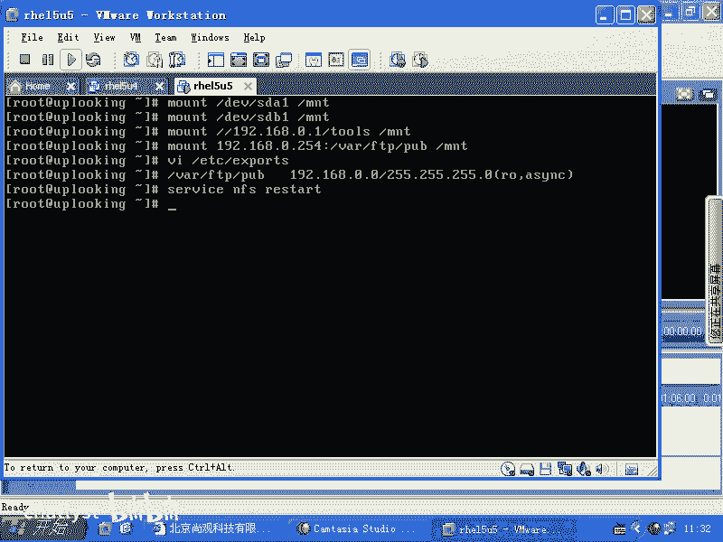
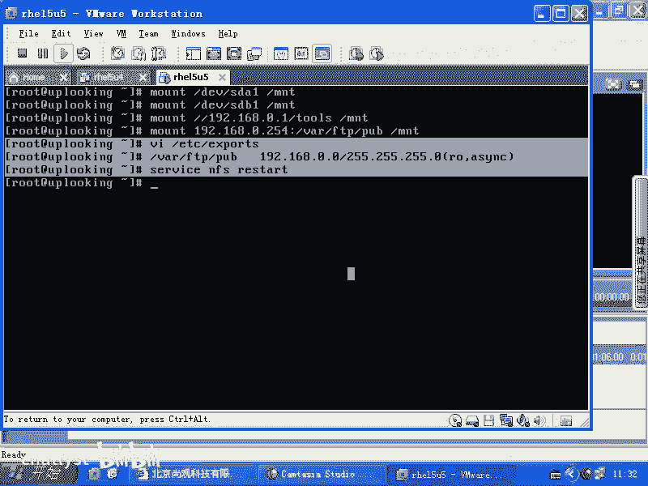
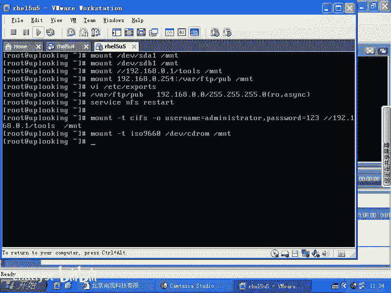
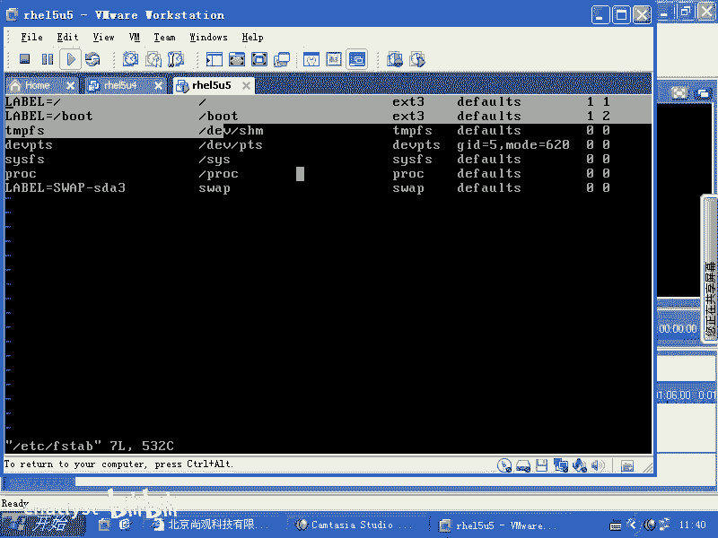
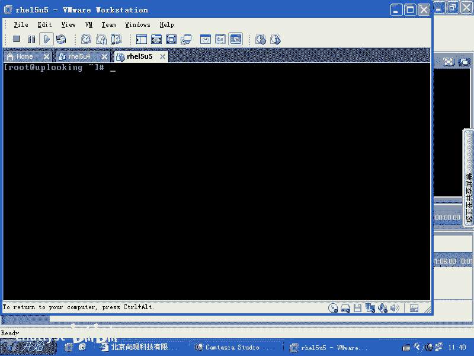
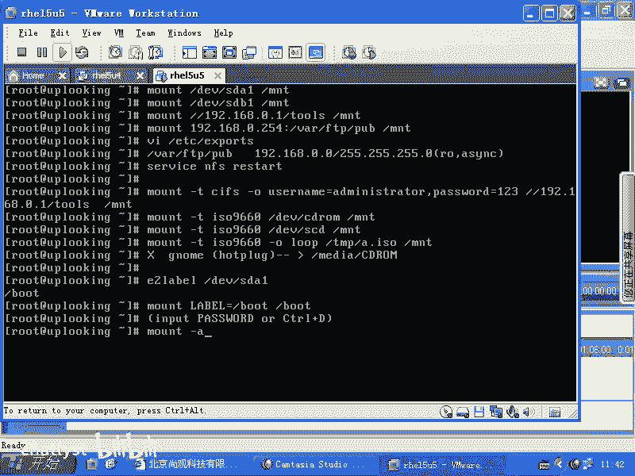

# RHCE教学视频2 - P4：RH133-ULE115-8-4-mount umount fuser - chatlyst - BV1PJ411D7LB

OK我们给大家说一下呢，我们的这个。呃，就是我们的这个。

mount命令mount命令的话呢，原来跟大家说过很多例子，mountDEV下的SDAE是不是M问题下是吧很正常。那么mountDEV下面的什么呢？SDBE是吧？

我们通常情况下硬盘如果是s或者SATA的那你的第一个U盘就是SDB啊。第一个U盘的第一个分区SDBE是吧？mount啊，然后呢我们的杠杠19218。0。1下面的什么呢？

toth共享mount在MNT录下，这样的话就把windows的一个共享mount上来，是不是？然后还有什么呢？mount1921了8。0。254的什么Y下的FTP下的POB目录mountMNT目录下。

NF共享是吧？这样的话我mount的是NFS共享，然后呢，我再去mount。当然了，如果要是你想在0。254上共享这个目录的话，是什么？VIETC下的ports是不是？在这里面的话呢，这是我是说在0。

254下，我现在在一个客户端上去0。254的这个目录。那我在0。254上是怎么样把这个目录共享出来的呢？NFS命令是不是非常简单NFS这个服务的配置是不是非常简单，那么要VI这个文件，就是这是在0。

254下去运行的。VI这个文件，然后呢把什么目录共享给谁。如果要是新的话，杠新的话，就是所有的目录，是不是那一般的情况下，我们是共享某目录。比方说下的FTP啊POB是不是共享给谁呢？比方要求2。

168点。😊，零点什么星。是不是0。7或者是什么呢？0。0。杠255。255。255。0是不是？共享给他们共享给他们权限是什么呢？那么加上一个呃RO是吧？RO是只读是不是RW呢？读写是不是然后呢。

接下来加上一个什么呢？SYNCSYNC的话表示呃同步方式。也就是说别人的话呢在写入数据的时候，那么它是立刻去同步的。那么当然了还有什么？ASYC是不是写完这个以后的话呢，这接下来的话呢。

改完它的配置文件，是不是要输入一个命令啊？NFS。restar是不是下面这个的话呢是在192168。0。254里面去做的，把它共享给一个网段，把这个目录共享给一个网段，让它具有什么呢？只读方式是吧？

这样的方式，然后呢去把它共享出来。

当然，异步的方式可能速度会快一点啊，就是说性能可能会高一些。呃，这个我没有测试过啊，大家可以测试一下同步和异步方式的话呢，他们在加载的时候，他的速度是怎么样。那么这样改完了这个文件以后。

把NF一旦什么呢？restar以后，这个配置文件就会生效。那么你在客户端上就可以运行这个命令来加载这个目录。

明白了吧。当然了，如果你想让NF每次系统启动的时候都启动，那怎么样？check个NFS啊，是不是？有没有问题？windows的共享我就不用说了吧。😡，windows怎么共享，我就不用说了，右击是吧。

是不是什么？然后我们看啊windows共享的话呢，它实际上现在用的是叫做CIFS。以前的话呢叫做3把FS，但是3把FS已经不好用。SAMBAFS已经不好用了，所以现在都是CIFSCFS大O啊。

user name等于是吧？比方说。minator啊。然后呢，逗号password。等于比方说123啊，杠杠1921个8。0。1，下面有个toth共享，然后呢，mountt在什么呢？MNT录像太简单了。

是吧。然后呢，我们还给大家演示过mount。啊，杠TRSO9660是不是把一个光盘。mount上去，那么就是DV下的CDro是吧？然后呢，M曼MNT下经常现在的光盘是不是有那个。有那个s接口的啊。

不是SAT接口的光盘，是不是那个时候的话呢，设备文件可能啊DV下的M呃Cro就不好用了。那么你要怎么做呢？你是这样的。

可能你的接口S或者SATA接口的话呢，不好用了，就是用这个CDro它本身是一个什么软链接是吧？那么它如果没有自动创建出来软链接的话，那你就找不到这个文件。所以这时候的话你可能用到的就是SCD。

SCD这个设备文件。明白吧？sga接口的光盘，光驱的设备文件。明白吧？然后呢，如果要是你去加载的是一个镜像。啊，可能是CDFS啊，也可能是ISO9660，也就是它的文件系统格式。

可能是CDFS就是说光盘的什么文件系统是吧？也可能是反正我一般用ISO9660都可以用啊。我这边加上个杠O，我从网上下载过来的1个ISO的镜像。我想看这里面的内容，那么我不用怎么样把它刻成光盘。

然后再去加载。那我直接杠O是吧？lo一定要加lo。lo的话是什么意思呢？回环设备我要用到一个回环设备。你在DV目录下的话呢，会有几个叫做look。0路1这样的设备文件。

也就是说我们现在想加载的是TMP目录下的1个A点RSO的文件，是不是把这个文件这个文件是一个设备文件吗？它是在文件系统下的一个普通文件，对不对？把一个普通文件又反过来又加载到什么呢？

咱们的这个文件系统下。所以我们需要的话呢，一个回环设备来帮忙，也就是把它帮当成是一个什么呢？一个设备文件，明白吗？所以这个杠O路是做这个用的，然后呢把它慢在然后某个目录下。啊，如果是你现在啊。

打开的X window下面，你现在在X window下面去运行。X window就是图形界面打开了，然后这时候你插入的光盘或者插入的U盘，它全部都会被自动加载到哪儿？自动下载到media下面。

Yeah media。这样的是吧，media下面的CDro是吧，或者什么呢？disk一或者dis2，对不对？所以这就是什么呢？它的自动加载机制，这是要求什么呢？要求的genome运行起来。啊。

谁能我们运行一下，也就是说它这个自动加载的机制是谁给你提供的？是内核提供的吗？不是，实际上是X window界面下的一个什么一个东西来提供的这个程序，如果X window没有启动，它会不会自动帮你下载？

不会，所以这个大家清楚明白吧？那这个自动加载机制的话呢，实际上叫做什么呢？它是用的genome里面那个程序，用的是整个内核里面的一个叫做什么呢？hot plug。机制。也就是说当我们插入一个硬盘。

或者插入呃插入1个U盘，或者插入1个USB的硬盘的时候，它会有一个热插拔的信号出来。然后热插拔的信号会会触动一个什么程序。这个程序的话呢就是X window里面运行的程序。明白吧？但是这个功能的话呢。

你完全可以自己去写，就是ho plug机制。实际上是呃在我们的系统当中是有这个机制的啊，这个机制的话，你看ETC目录下hot plug当中的文件啊，当然这个的话我没有仔细琢磨过，因为我不是一个什么。

不是一个做操作系统的人啊，如果你自己在做一个比reite更好用的操作系统，那可能这个就比较靠谱，明白吧？很大的机制。那么media目录是不是大家都清楚干什么的了？没店目录清楚了吧。好。

mountmount的话呢它有局限啊有局限，就是我们的话呢想让mount按照顺序的话去加载分区的时候，没问题。我们也知道这个顺序是不是？但是多数情况下的话呢，我们不会去记数顺序，我们会记名字是吧？

所以这时候我们需要另外一个程序帮忙e to label啊，e to label，它可以帮我们把一个分区，然后呢给它设定一个卷标是吧？默认情况下，你的boot分区就叫做杠 boot杠是一个字符啊。

不要认为这个g是没有用的，是一个根的意思，不是它就是杠，就是一个阿玛的字符啊，杠 boot就是它的卷标啊，那么我们可以通过什么呢？mount啊 label。等于什么呢？等于杠 boot的这个分区是吧？

mos在 boott目录下，明白吧？所以的话呢这个label等于跟呃label等于杠 boot，就是跟 boot实际上就是指代的什么呢？DV下的SDAE。知道吧。当我们把这个卷标改过了以后。

那么你启动的时候，你就会发现的话呢，它会出错。出错的时候的话呢，它是它是这样的一个情况。就是说你如果要是无意中把这个卷标改掉了是吧？让那个FStable里面，你看我们看。

系统的话呢每次启动的时候，是不是它自动加载分区是通过一个文件。哪个文件呢？ETC下面的FSTAB是不是FSTAB的话呢，它都是以label为根的这个分区加载到什么根下面。

它不是写的SDA1或者SDA2是吧？为什么呢？这就是我原来跟大家说过的，我觉得做第二排的第三个人欠我100块钱，是不是？我第二天我就找这第三个人，结果的话呢，第二天他们做的顺序变了，那我还找第三个人。

那就不靠谱，所以我记住他的名字是最重要的，对不对？所以他现在这里面的话都默认是以这种记名字的方式来加载，那大家也要习惯，对吧？你也可以自己创建一个分区，然后给他加个卷标。

然后再把这个卷标什么自动加载起来。😊。

明白了吧，这是一个习惯啊。那么当你的话呢无意中把一个卷标改掉了以后，他还能找到这个卷标的分区吗？如果你把这个杠不特的这个卷标改成AAA，是不是你除非在这个地方改成AAA，否则它就找不到是吧？

找不到的话呢，就会出现一个致命的严重的问题。这个致命和严重的问题。如果要是你是改的根分区的话，那会导致根分区找不到，那就会出现 kernelnal panic的情况，是不是？

如果根分区找到了其他分区找不到，那会出现什么情况呢？会出现一个这样的。

什么。呃，请输入密码是吧？然后呢，input。什么password的是吧？这是如特的密码是吧？or什么呢？按crl加。加D直接重启啊，我记得好像这样的。

就是这个我好像这个这个前面input password的好像不太对啊，就是当你有这样的问题的时候，就是这个 trouble步疏定，你看到这个问题你就知道了，要么是它找不到分区。

就FS table当中定义的分区它找不到，因为卷标的问题是吧？要不是你无意中删除掉。第二个原因是什么呢？你的文件系统遭到了非常大的问题。他说。哎呀，干不了活了是吧？

你要么输入pasword的来给我手动去检测，要么怎么样，要么你直接ctrol加D就关机算了。明白吧？我记得好像是这么说啊，但是你们自己看一下那个就是可以看一下那个出错的画面啊，可以出错画面。

把FS table当中。比方说呃put那个分区的卷标改一下，然后你重启一下，你看一下样子啊，就是这样就是我给大家说一下那个FS table的问题，是不是？这边的话呢是这个相关的。

那么大家是不是现在清楚了label就是那个卷标是吧？卷标和它相匹配相作用啊，这是这样，就是跟mount命令的话呢相结合的一些内容。那么其实的话呢，你输入mount杠A啊。

它就会把FS table目录下的所有呃这个文件里面。

GTC下的FStable当中所有的文件全部都怎么样呢？全部都进行加载啊，进行挂载啊，m子杠A命令。也就是实质上啊实质上我们的。FS table是mount命令的一个配置文件。明白吧？嗯。

FI是m命的一个配置文件。那当然了，youmount就有什么you amount是吧？嗯，有you amount。那如果youmount一个东西，you amount不掉。

那你首先要注意自己是不是在这个目录下。你要是你把它慢成MNT目录下，你再MNT目录下，你当然又忘的不掉。😡，所以你要CD1杠是吧，然后再Umount，还U浪Umount不掉，那你就什么Fuser是吧？

杠V查看谁在用什么这个目录是不是Fuser。杠KM是不是？然后呢波把波特目录下使用波特目录下所有的程序给它什么干掉啊，然后再去U。呃，但是你干掉的话都是干掉的是用户空间当中的进程。

如果要是你mount了一个东西，mount在MNT目录下是吧？然后你又mountMNT目录下的某一个文件，比方说ISO镜像，又mount在某个目录下。你就是想Fus杠KM杀掉这个MNT的这个所有的进程。

你是干不掉 kernelel自己的 kernelel是不能干掉 kernelel自己的。知道吧？有的时候也就是说有的时候杠KM是什么不起作用，很可能是因为你又在这个目录下又浪上了另外一个东西。听楚了吧？

这就是mount和unmount，还有Fus的东西。