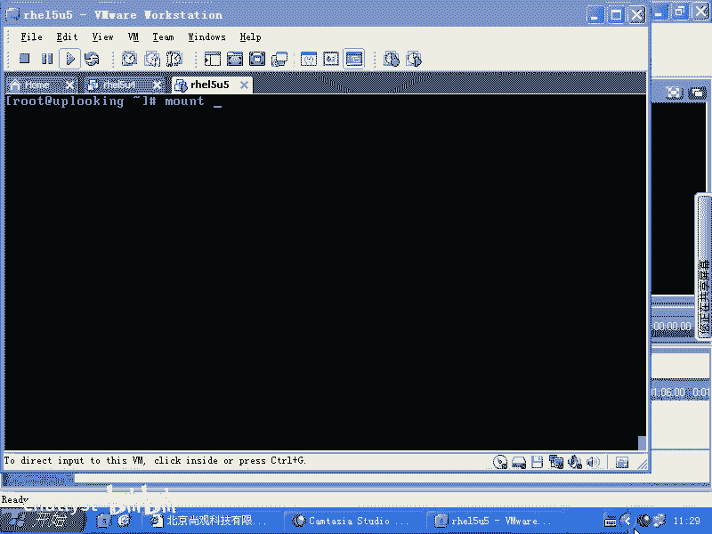
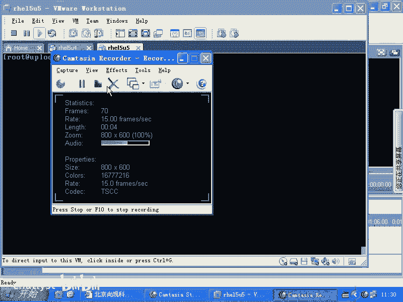
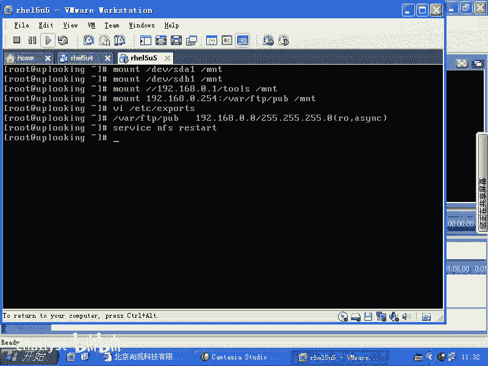
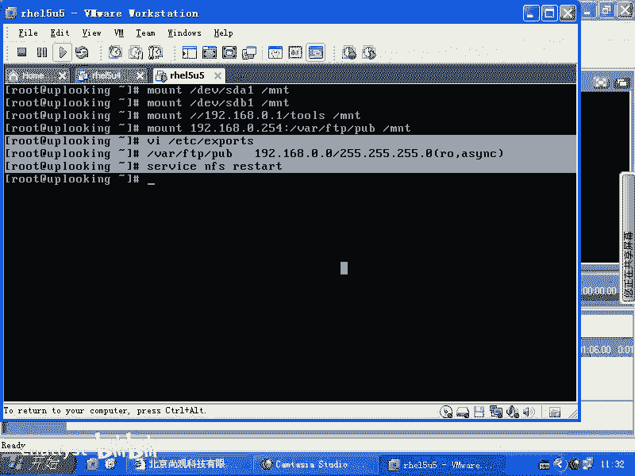
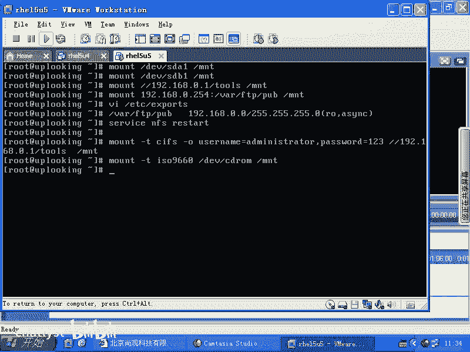
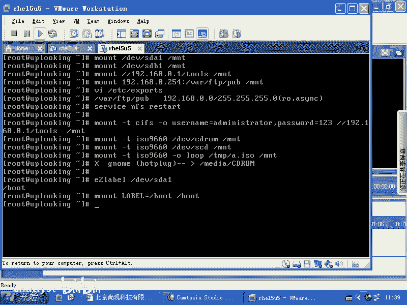
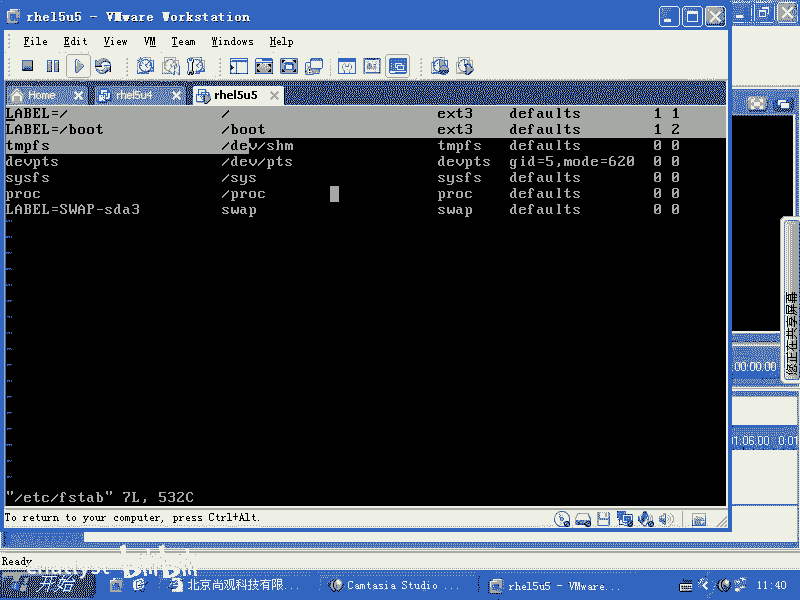
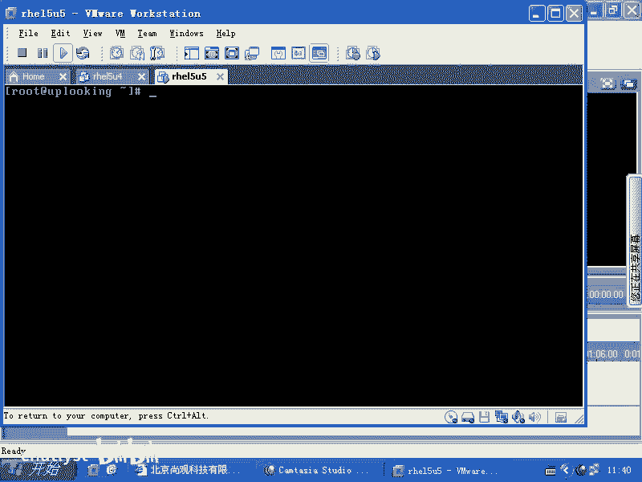
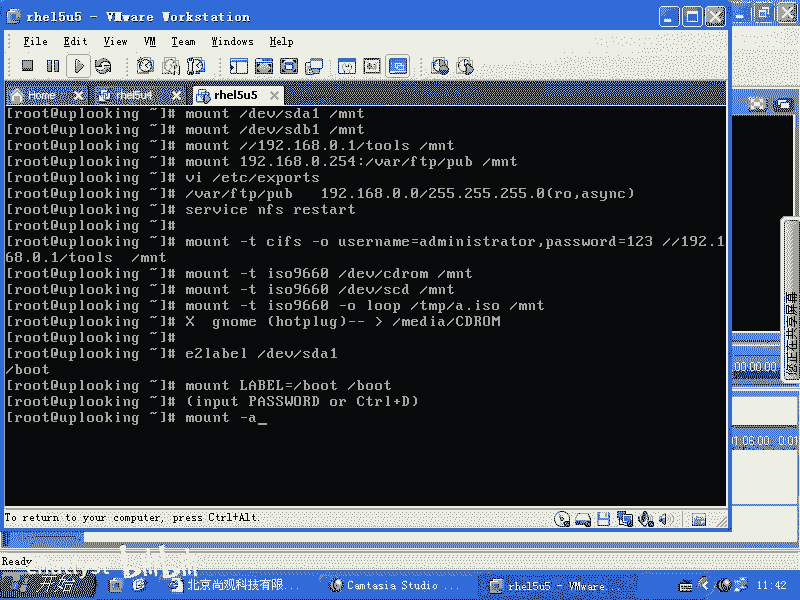

# RHCE课程：P4：文件系统挂载与卸载详解





在本节课中，我们将学习Linux系统中至关重要的文件系统管理操作：`mount`（挂载）和`umount`（卸载）。我们将了解如何将各种存储设备（如硬盘分区、光盘、网络共享）连接到文件系统树，以及如何安全地断开它们。同时，我们也会学习当设备无法卸载时，如何使用`fuser`命令来解决问题。

## 挂载（mount）命令基础

`mount`命令用于将存储设备或远程文件系统连接到Linux目录树的一个指定位置（挂载点）。其基本语法是 `mount <设备源> <挂载点目录>`。

以下是几种常见的挂载示例：



*   **挂载本地硬盘分区**：`mount /dev/sda1 /mnt` 将第一个SATA硬盘的第一个分区挂载到 `/mnt` 目录。
*   **挂载U盘分区**：`mount /dev/sdb1 /mnt` 通常，第一个U盘的第一个分区设备文件是 `/dev/sdb1`。
*   **挂载Windows网络共享（CIFS）**：`mount -t cifs -o username=administrator,password=123 //192.168.0.1/tools共享 /mnt` 此命令将Windows共享挂载到本地。现代Linux系统通常使用CIFS协议，而非旧的SMBFS。
*   **挂载NFS网络共享**：`mount -t nfs 192.168.0.254:/var/ftp/pub /mnt` 此命令将NFS服务器上的目录挂载到本地。



上一节我们介绍了`mount`命令的基本用法，本节中我们来看看如何配置NFS服务器以提供共享目录。

## 配置NFS服务器共享



若想在IP为`192.168.0.254`的服务器上共享目录，需要配置NFS服务。主要步骤是编辑 `/etc/exports` 文件。

以下是配置示例：
```bash
# 在NFS服务器上编辑配置文件
vi /etc/exports
# 添加如下行，将 /var/ftp/pub 目录以只读方式共享给 192.168.0.0/24 网段
/var/ftp/pub 192.168.0.*(ro,sync)
```
配置中的 `sync` 选项表示同步写入，数据会立刻写入磁盘，可靠性高；`async` 选项表示异步写入，可能性能更好。修改配置文件后，需要重启NFS服务使其生效：`service nfs restart`。之后，客户端即可使用`mount`命令挂载此共享。

## 挂载光盘与ISO镜像

除了网络共享，`mount`命令也常用于挂载物理光盘和ISO镜像文件。

以下是相关操作：

*   **挂载物理光盘**：`mount -t iso9660 /dev/cdrom /mnt`。对于SATA接口的光驱，设备文件可能是 `/dev/sr0`，而 `/dev/cdrom` 通常是它的一个软链接。
*   **挂载ISO镜像文件**：`mount -t iso9660 -o loop /tmp/a.iso /mnt`。这里的关键是 `-o loop` 选项，它使用回环设备将普通的ISO文件模拟成块设备进行挂载。

## 自动挂载与卷标（Label）

系统启动时会根据 `/etc/fstab` 文件的配置自动挂载分区。`fstab`中常用卷标而非设备名（如`/dev/sda1`）来标识分区，因为设备名可能变动，而卷标是固定的。

以下是相关概念和操作：



*   **查看卷标**：系统分区的卷标通常已设定，例如根分区可能是 `/`，启动分区可能是 `/boot`。
*   **通过卷标挂载**：`mount LABEL=/boot /boot` 此命令使用卷标挂载分区。
*   **修改卷标**：可以使用 `e2label` 命令修改ext2/3/4文件系统的卷标。
*   **重要警告**：**切勿随意修改系统关键分区（如 `/` 或 `/boot`）的卷标**。如果`/etc/fstab`中指定的卷标与实际不符，系统启动时将无法找到分区，可能导致需要输入root密码进入紧急维护模式，甚至引发内核恐慌（Kernel Panic）。



`mount -a` 命令会读取 `/etc/fstab` 文件并挂载其中所有定义的项目。因此，可以说 **`/etc/fstab` 是 `mount` 命令的配置文件**。

## 卸载（umount）与 fuser 命令



`umount` 命令用于卸载已挂载的文件系统，语法为 `umount <挂载点或设备源>`。

卸载时可能遇到“设备忙”的错误。常见原因和解决方法如下：



1.  **用户位于挂载点目录内**：解决方法是先使用 `cd` 命令切换到其他目录，再执行卸载。
2.  **有进程正在访问挂载点下的文件**：此时需要使用 `fuser` 命令来查看并终止相关进程。

以下是`fuser`命令的用法：

*   **查看占用进程**：`fuser -v /mnt` 查看正在使用`/mnt`目录的进程。
*   **终止占用进程**：`fuser -km /mnt` 选项 `-k` 表示终止（kill）所有访问该目录的进程。
*   **特殊情况**：如果一个目录被挂载了多次（例如，将ISO文件挂载到已挂载NFS共享的目录下），形成嵌套挂载，那么`fuser -km`可能无法终止内核自身对底层文件系统的引用。这种情况下，需要先逐层卸载。

本节课中我们一起学习了Linux文件系统管理的核心操作。我们掌握了使用`mount`命令挂载本地设备、网络共享和ISO镜像的方法，了解了NFS服务器的基本配置。我们还深入探讨了基于卷标的挂载、系统自动挂载机制`/etc/fstab`，以及如何使用`umount`和`fuser`命令安全地卸载设备并处理“设备忙”的问题。理解这些知识对于系统管理和维护至关重要。