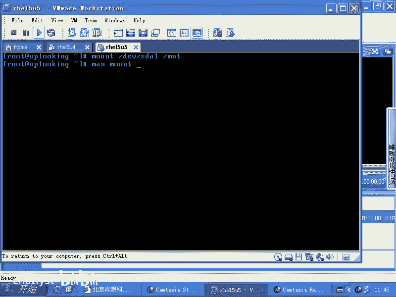
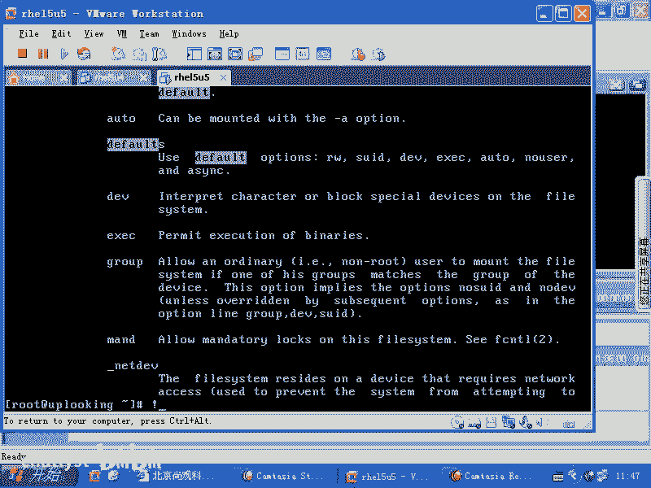
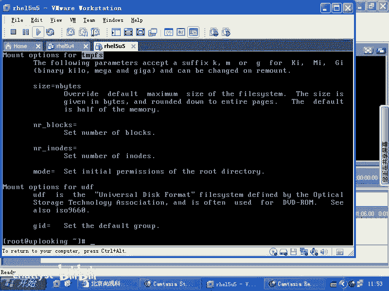
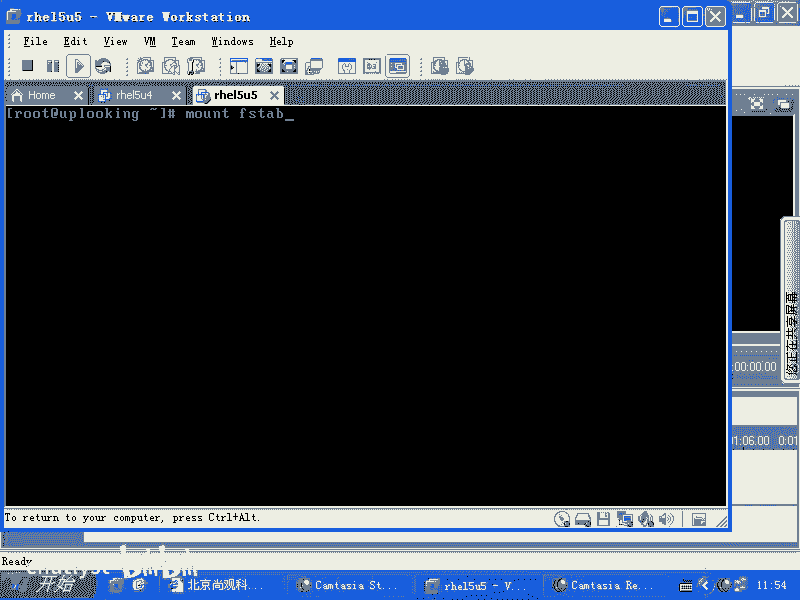

# Linux系统管理：2.5：深入理解fstab文件与自动挂载 📚

在本节课中，我们将要学习Linux系统中一个至关重要的配置文件——`/etc/fstab`。这个文件决定了系统启动时自动挂载哪些分区，以及如何挂载它们。我们将详细解析其结构、参数含义，并理解其背后的安全机制。

## 自动挂载与fstab文件 📂

上一节我们介绍了手动挂载分区的方法，本节中我们来看看如何让系统在启动时自动完成这项工作。当你希望系统自动加载某个分区时，需要编辑一个特定的文件。

这个文件叫做 `/etc/fstab`，即“File System Table”（文件系统表）。它的作用是将一个分区（通过标签、UUID或设备名指定）挂载到系统的一个目录位置。



## fstab文件结构解析 🔍

以下是`/etc/fstab`文件中每一行的标准结构，由六个字段组成：

```
<设备标识> <挂载点> <文件系统类型> <挂载选项> <dump备份> <启动检查顺序>
```

### 1. 设备标识与挂载点

第一个字段指定要挂载的设备，例如 `/dev/sda1` 或使用 `LABEL=DATA`。第二个字段是挂载点，即目标目录，如 `/mnt/data`。



### 2. 文件系统类型与挂载选项

第三个字段是文件系统类型，例如 `ext3` 或 `ext4`。第四个字段是挂载参数，这是核心部分。

`mount`命令的 `-o` 选项用于指定这些参数。如果不使用 `-o` 选项，系统会采用默认参数集。例如，执行 `mount /dev/sda1 /mnt` 时，虽然没有输入任何参数，但系统会自动应用默认集合，包括读写权限等。

默认参数（`defaults`）包含：
*   `rw`：可读可写。
*   `suid`：允许SUID（Set User ID）权限位生效。
*   `dev`：允许识别设备文件。
*   `exec`：允许执行其中的可执行文件。

你可以通过添加 `noexec`、`nosuid`、`nodev` 等选项来覆盖默认行为。例如，`mount -o noexec,nosuid,nodev /dev/sdb1 /mnt/usb`。

**为什么mount命令默认只允许root用户使用？**
这是出于安全考虑。设想一个场景：一个普通用户将自己的U盘（包含设置了SUID权限的程序或伪造的设备文件）插入服务器。如果允许普通用户挂载，并且挂载后SUID和设备文件权限生效，就可能危及服务器安全。因此，`mount`命令默认只允许root账号执行。

### 3. dump备份与启动检查

第五个字段与 `dump` 命令相关，用于控制全盘备份频率（例如 `1` 表示每天备份一次）。但如今 `dump` 命令已较少使用，此字段通常设为 `0`。

第六个字段的数字在系统正常启动时有用，它决定 `fsck` 磁盘检查的顺序：
*   `0`：不检查。
*   `1`：第一个检查（通常为根分区 `/`）。
*   `2`：第二个及以后检查。

## fstab的调用与局限 ⚙️

这个文件由谁调用呢？它是由系统初始化脚本（如 `/etc/rc.d/rc.sysinit` 或 `rc.local`）中的 `mount -a` 命令读取并执行的。`mount -a` 会尝试挂载 `fstab` 中所有未挂载的文件系统。


然而，这种基于`fstab`的自动挂载机制有其局限性：它只在系统启动时生效。如果你不重启系统，新增的`fstab`条目就不会被自动挂载。此外，它主要加载系统必需的一些虚拟文件系统。

以下是系统通常自动挂载的几个关键虚拟文件系统示例：
*   `proc`： 进程信息虚拟文件系统。
*   `sysfs` (`sys`)： 系统设备和驱动信息。
*   `devpts` (`/dev/pts`)： 为伪终端（如SSH会话）动态创建设备文件。
*   `tmpfs` (`/dev/shm`)： 内存文件系统。

## 深入tmpfs：内存中的文件系统 💾

`tmpfs` 是一个将文件存储在内存（或交换分区）中的临时文件系统。访问 `/dev/shm` 目录就相当于在访问内存中的一片区域。将文件复制到这里，就等于复制到了内存中。

你可以调整其挂载参数来优化使用。例如，限制其最大占用空间：
```bash
mount -o size=200M /dev/shm /mnt/tmpfs
```
或者，在`/etc/fstab`中添加：
```
tmpfs /mnt/tmpfs tmpfs size=200M 0 0
```

**为什么使用tmpfs？**
它适用于存放临时性、需要频繁高速读写、且重启后丢失也无妨的数据。如果一个程序每秒对硬盘上的一个小文件进行数千次读写，极易损坏硬盘的特定扇区。而将这类文件放在内存中则完全没有这个问题。注意，常规程序读写文件时，数据会先被缓存到内存，并非直接、持续地物理读写硬盘。这里指的是在编写驱动程序或文件系统时，刻意进行底层直接磁盘操作的情况。

将数据放在`tmpfs`中，重启后就会消失。当然，交换分区（`swap`）的挂载也通常定义在`fstab`文件的最后一行。



## 自定义挂载选项 ✏️

在`/etc/fstab`中，你可以在“挂载选项”（第四个）字段添加自定义参数，只需用逗号分隔即可。例如：
```
/dev/sdb1 /mnt/data ext4 defaults,noexec,nosuid 0 2
```
这表示以默认参数挂载，但同时禁用该分区上的程序执行和SUID权限。

## 总结 📝

本节课中我们一起学习了：
1.  **`/etc/fstab`文件的作用**： 系统启动时自动挂载文件系统的配置文件。
2.  **文件结构六字段**： 设备、挂载点、文件系统类型、选项、dump标记、fsck顺序。
3.  **默认挂载选项（`defaults`）的含义**： 包括`rw`， `suid`， `dev`， `exec`，并理解了其安全意义。
4.  **`mount`命令的权限限制**： 默认仅root可用，是重要的安全机制。
5.  **`fstab`的调用与局限**： 由`mount -a`在启动时调用，无法实现动态挂载。
6.  **关键虚拟文件系统**： 如`proc`， `sysfs`， `devpts`，特别是`tmpfs`（内存文件系统）的原理与应用场景。
7.  **自定义挂载参数**： 如何在`fstab`中通过添加逗号分隔的选项来精细控制挂载行为。




掌握`/etc/fstab`的配置，是进行Linux存储管理和系统定制的基础技能。