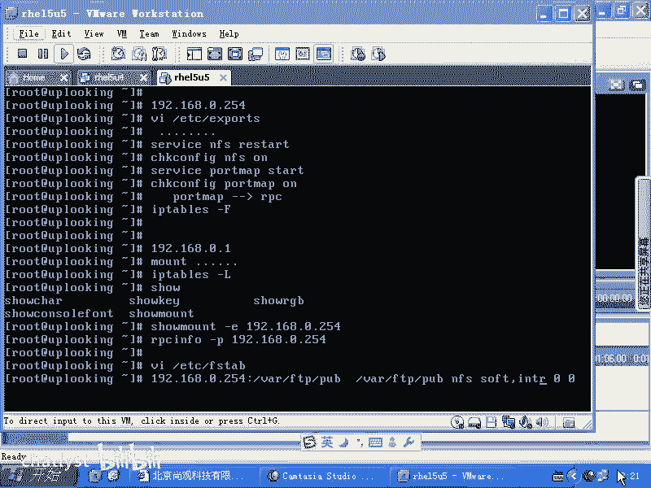
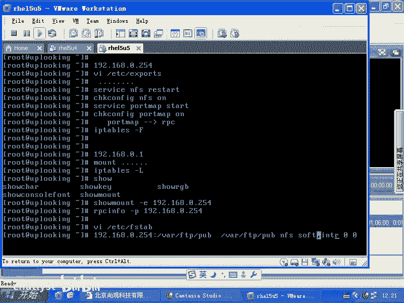
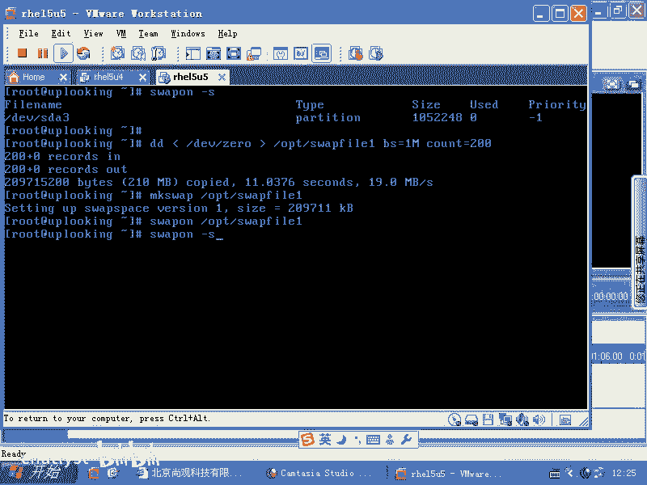
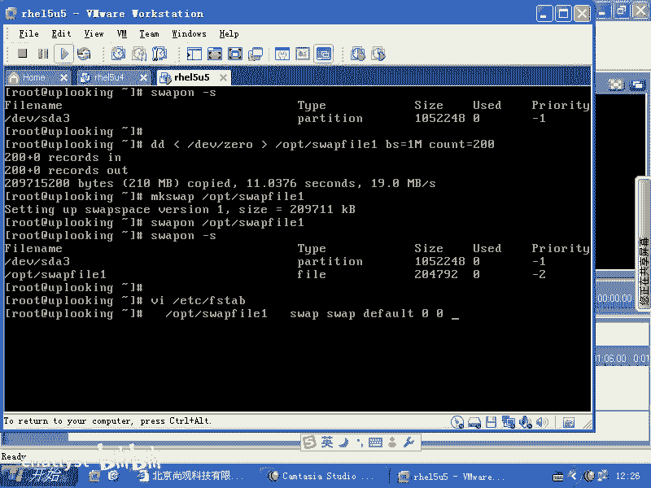
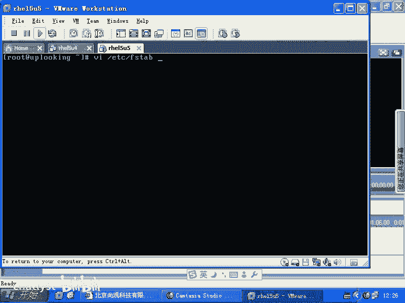
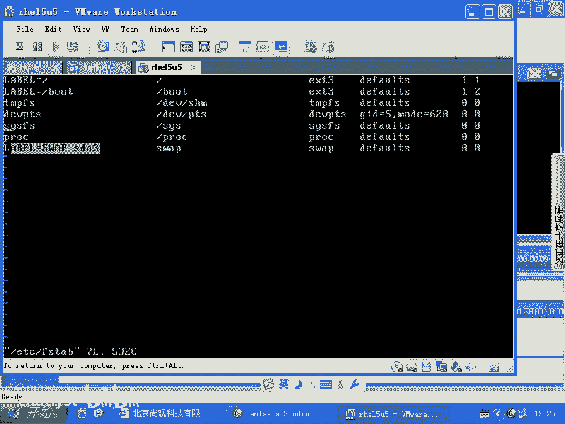
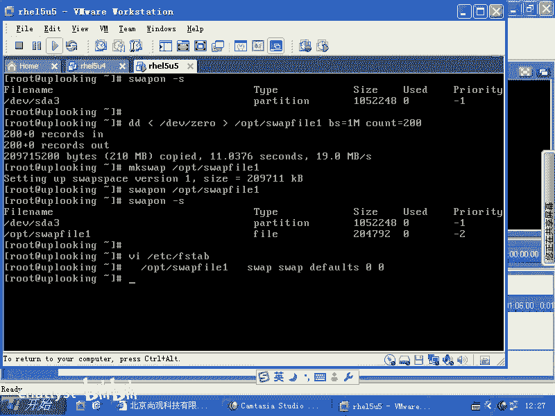
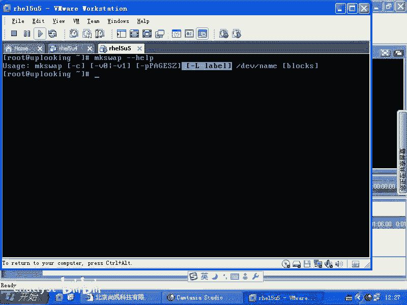
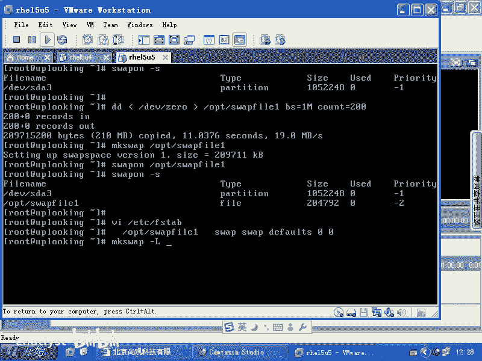
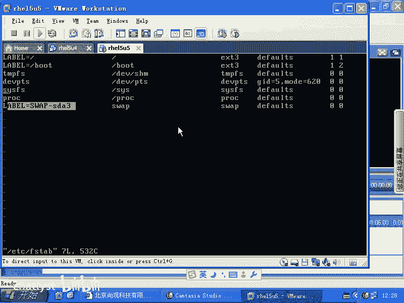

# RHCE课程：2-6：Swap空间管理



在本节课中，我们将要学习Linux系统中Swap（交换）空间的管理。Swap空间是当物理内存不足时，系统用来临时存放内存数据的一块硬盘区域。我们将学习如何查看、创建、激活、关闭Swap空间，以及如何设置其开机自动挂载。



上一节我们介绍了文件系统的基本操作，本节中我们来看看如何管理Swap空间。

## 查看现有Swap空间

首先，我们可以查看当前系统中正在使用的Swap空间。使用 `swapon -s` 命令可以列出所有活跃的Swap分区或文件。

```bash
swapon -s
```

执行此命令后，系统会显示当前使用的Swap空间列表。

## 创建Swap文件

有时，我们可能需要在不重新分区的情况下增加Swap空间。这时，可以创建一个文件并将其作为Swap空间使用。

以下是创建Swap文件的步骤：

1.  **创建文件**：使用 `dd` 命令创建一个指定大小的空文件。例如，在 `/opt` 目录下创建一个名为 `swapfile1`、大小为200MB的文件。
    ```bash
    dd if=/dev/zero of=/opt/swapfile1 bs=1M count=200
    ```
    这个命令从 `/dev/zero`（一个不断输出零的设备）读取数据，写入到 `/opt/swapfile1` 文件中。`bs=1M` 表示每次读写1兆字节，`count=200` 表示进行200次，因此总大小为200MB。

2.  **“格式化”Swap文件**：与EXT3/EXT4等文件系统不同，Swap空间不需要复杂的格式化。`mkswap` 命令的作用是在文件头部写入一个特殊标记，标识此空间专用于Swap，以防止数据被意外破坏。
    ```bash
    mkswap /opt/swapfile1
    ```
    此命令执行速度很快，因为它只是写入少量标识信息。

## 激活与使用Swap文件

创建并标记好Swap文件后，需要激活它才能被系统使用。

使用 `swapon` 命令激活我们创建的Swap文件：
```bash
swapon /opt/swapfile1
```
激活后，再次运行 `swapon -s` 命令，就可以看到新添加的Swap空间已经出现在列表中。



## 关闭Swap空间

如果不再需要某个Swap空间，可以使用 `swapoff` 命令将其关闭。
```bash
swapoff /opt/swapfile1
```

## 设置开机自动挂载





为了让系统在每次启动时自动激活这个Swap文件，需要将其信息添加到 `/etc/fstab` 配置文件中。



1.  使用文本编辑器（如 `vi`）打开 `/etc/fstab` 文件：
    ```bash
    vi /etc/fstab
    ```

2.  在文件末尾添加一行，格式参照已有的Swap分区。通常格式如下：
    ```
    /opt/swapfile1 swap swap defaults 0 0
    ```
    这行配置的含义是：设备（`/opt/swapfile1`）作为 `swap` 文件系统类型挂载，使用 `defaults` 挂载选项，`dump` 备份标志和 `fsck` 检查顺序均为 `0`。



## Swap空间的其他操作

除了基本操作，Swap空间还支持设置卷标（Label）。



*   对于EXT3/EXT4文件系统，我们使用 `e2label` 命令设置卷标。
*   对于Swap空间，则需要使用 `mkswap` 命令的 `-L` 选项来设置卷标。



例如，为 `/opt/swapfile1` 设置一个名为 `MySwap` 的卷标：
```bash
mkswap -L MySwap /opt/swapfile1
```
设置后，在 `swapon -s` 或相关系统工具中可能会显示此卷标信息。

---



本节课中我们一起学习了Linux Swap空间的管理。主要内容包括：使用 `swapon -s` 查看Swap状态；使用 `dd` 和 `mkswap` 命令创建Swap文件；使用 `swapon` 和 `swapoff` 命令激活与关闭Swap空间；通过编辑 `/etc/fstab` 文件实现Swap开机自动挂载；以及使用 `mkswap -L` 为Swap空间设置卷标。掌握这些操作，可以灵活地根据系统需求调整虚拟内存资源。