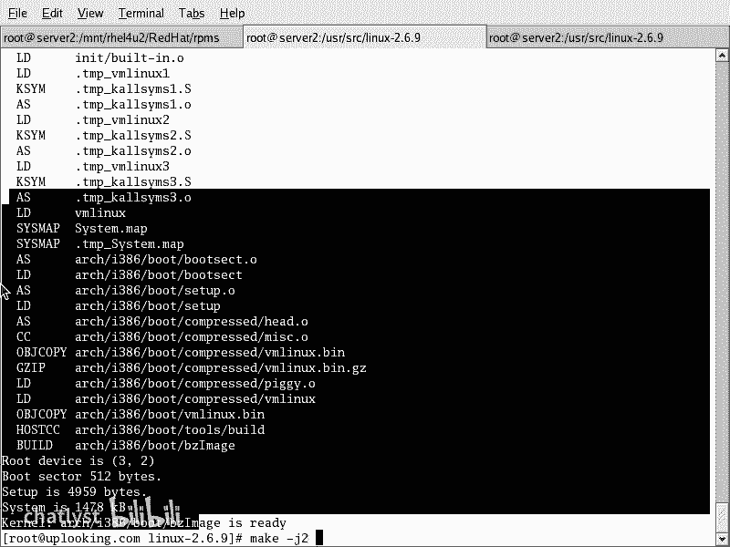

# RHCE教学视频2 - P7：RH133-ULE115-8-kernel编译 - chatlyst - BV1PJ411D7LB

我们呢呃开始下面的这样的一个内容。那么主要呢这次课的话，就是说如我们现在画面上所看到的是我们上官ULE的这个金盘三证课程当中的115部分。

也就是linux系统精简部分呢的内核编译和内核驱动模块的这种加载。这一节课。这个呢在我们的书上上应该分成两章。然后呢，我们讲的时候呢，就顺序把它讲下来。内核编译和内核驱动内核模块和驱动加载。

那这部分的话很多人啊就觉得会比较难一些啊，就是这次的话还是我们两个人的话，一块儿来呃，维尼达。那我跟小张的话呢，一块儿来，小张是个女生啊。

就是说我们一块儿呢把这个呃一问一答的形式的话来给大家解释一下这个课程。然后呢呃我们现在开始。OK先在我们看一下linux的源代码数，然后呢再去什么呢？lininux的 kernel啊。

就是内核呃编译内核编译呢及模块编译。然后呢还有它的基理，就是它到底是怎么回事，前后到底是怎么回事。然后呢，linux启动过程与模块的关系。那么linux的启动启动过程当中的话，cardl加载起来。

然后接着它为什么需要模块，然后这个模块的话呃，加上去的话有什么用。那么经常出现了一些常见的错误是怎么样的？然后接着是一系列的什么呢模块工具，来给大家介绍。

然后接着是moddels的注册机制和驱动程序的加载啊，就这样。那么实际上呢这个地方的话就是实现了lininux系统的主要的功能。这个在windows下一般你们是不会呃接触到的。因为呃就是咱们不会接触到。

因为在windows下的话呢，内核是你没有权利去动的。你用一个windows，你只能装到应用程序是吧？比如说set up一个什么金山磁霸或者等等这些东西。嗯，但是这个时候的话不涉及到什么。

不涉及到你这个驱动程序就去怎么做，你可能装一个驱动，那么只是按照set up这个步骤一步一步来向导来。那么你不知道这个驱动的话是怎么加载。linux的内核到底有哪几个文件，好像是四个文件。

那么大家呢也从来不去管。但是呢linux里面这些东西全都可以定制，连内核的实现的话，全部都可以看得到啊，OK我们现在开始。那大家可以看一下，呃，在我们的这个相关的课程当中。

这个部分呢115分呢非常重要的。这个部分的话主要是给大家介绍一些什么呢？就是如我们的linux系统它到底是呃怎么工作的，那么内核的话是肯定是一一大方面了。所现在我们看一下linux内核啊，它是在哪呢？

在这个地方目录下目录下的话，那么有这么多文件，这个文件呢我们知道呃VMLNUZ啊，这个开头的就表示的是一个内核，明白吗？嗯，这个是一个文件啊。

这个文件呢VMLRNUZ这个最后这个Z的话表示它是一个GZ压缩的文档也就是内核是它压缩过的。那么们现在这样的LS杠L然后呢。来看一下这个时候呢你看到这么多文件，这个文件这个地方是它的大小。嗯。

那小张你看一下这个地方的话有多大，就是这个文件的话有多大。你看啊这边是一个千是吧，多少K，这边是一个什么兆是吧？是1。4兆多。嗯，是不是对，那么这样的一个文件呢，它是一个压缩以后的。

如果要是你不压缩的话，有多大呢？不压缩以后的话，大约是不压缩压缩之前的话，大概是3兆多啊，三兆多这么大就是3分之1了。对，但是这是内核，就是其他东西的话，它可能是压缩的更低或者怎么样啊。

那么我们现在在这里面看到的这个文件，这个文件的话呢是压缩过的，在系统启动的时候呢，它被装载到内核当中，并且呢解压缩，然后呢开始运行，这个文件呢就有点像是一个什么呢？大的可执性文件。嗯，你比方说word。

你打开以后是看到什么？是看到一个编辑换面是吗？对，那么如果要是我的内核启动了以后，它就相当于一个大的可执行文件，它实现的功能，只不过不是word的功能，是其他的功能。啊它跟这个就是程序也是这个程序。

但是呢这个程序的话是直接机器代码运行的。也就是它不依赖于任何的库啊，这样一回事。接下来的话，你看这个地方。IRTRDIRTRD的话是跟这个内核的话相配套的。你看这边有个内核是吧，是2。6。

9-22点EL是吧？这它内核的版本号那么这边的话就有相应的什么呢？一个这个内核版本号的这样的一个什么置文件是不是这个配套的，你看一样的，这两个版本号一样。

只不过它是IITRDIRTRD的话实际上是由三个单词组成的IT的话表示以哪首是初始化。R的话是表示什么呢？ra就是说RAAMraD的话是表示disk，就是说我们的什么磁盘嗯啊di。

IITRD就是初始化的。内存磁盘啊是上内核磁盘这个地方的话是跟我们的内核的话呢相配套。内核在加载了以后的话，它就会有一个内存磁盘的话，就是初始化的这样的一个内存磁盘的话，跟它相配套使用。

这个呢confi的文件就是当初呢这个文就是说这个这个内核在编译的过程当中，然后呢产生了一个配置文件啊就这样一回事哦，清楚了吗？所以话你看到这是不是配套的嗯。那么在不同目录下的话，除了有这个内核之外啊。

我现在这个系统当中装了两个内核，一个是2。6。9-22。1L是吧？还有一个是什么？杠34。1啊啊，这个的话是两个版本内核。那么下面这个内核的版本要比上面那个内核版本的话要高嗯，啊，明白吧？

然后这个时候呢你看这边还有个gra，也就是在整个不同目录下的话，只有两样东西，一样是什么呢？ kernel，另外一项是什么呢？gragra是but loader那，我们给大家讲讲过了，已经给大家讲过了。

那么这两样东西。然后现在我们这个 kernel和gra kernel它这的RPM杠QA啊，GREP什么呢？ kernel那你会发觉你已经装了一个。这个nal的话呢是呃就是cnal杠2。

6点装我装了两个carnal。那么这两个 kernel的话都会在下面显示出来QA不是说呃RPM杠QA是查找所有的软件包，把其中呢cnal字样的这个包就是显示出来。那么这时候你会看到我这边装了一个什么呢？

cnal杠2。6。9-34，是不是还装了一个 kernelnal杠2。6。9杠呃22我们装了这两个RPM包的话。这边就有，但是我这是RPM安装的嗯RPM方式安装的RPM不是我们给大家说过吗？

是redhead red是吧？re hat packagemanage。嗯，对不对？reite manager，然后呢，这种组织方式的话是这样的，就是说会有这个片包。但是一般来说的话。

我们在系统当中的话都是什么他报啊，这个我们给大家说过，他报的这种安装方式的话是最多的。所以呢我们想获得最新的内核的时候，你要从哪去下载呢？

从这个地方 kernelnal点ORG这个网站上下载这个网站上啊，我们给大家说过linux的话，它是不是由一个人去做的呀。嗯，那么这个人的话，它是来源于一个人的人名是吧？这个人名叫做什么呢？linux。

啊，towards towards那么lins towards是个芬兰人是吧？那么这个人的话他呢呃就在管理着这个网站，因这个网站的话就是他管这个人是典型的一个搞技术的人，没有任何野心。呃。

他就说汽车洋房的话都有，然后呢在那边生活很安逸，然后生了好像两三个孩子吧，然后基触况也很好。那么他非常安逸，所以呢他也没什么野心。他现在呢就希望他在lininux的话呢非常茁壮的成长。

所以呢他就专心致志的经营他的网站。然后呢，这些人那么都受雇于一个组织叫做什么叫做OSD还是叫什么组织，这个组织的话呢，是别人资助的，就是说这些大公司都给他们一些钱，嗯，让这些人的话去维护这个代码。

维护这些内核。😊，linux不是开源的吗？那么所有的内核代码全部都放在这个地方的啊，但是linux的内核实际上呢应该叫做什么呢？GNU什么呃GNU啊。linux这个是riachter stormman。

Richard Stman。Rachtertman呢强烈要求了这个人的话，他是什么？他一手创造了谁啊？GNU啊GU这个组织的话，那么里面有各种各样的代码，就是各种各样的程序代码。

那么linux的话是它其中的一员。所以呢他强烈建议什么呢？linux应该叫做GUlinux因为什么呢？

大家现在显然知道linux不知道GNU啊GU的话实际上是linux整个系统当中绝大多数的代码都是GU的代码，而不是linux代码，但是linux只是它的一部分是吧？但大家把这个本的话忘掉了。

然后只认识一个什么linux，所以他就很不爽，说明他宣传不够，宣传不够的话，倒是就是说怎么说呢？他是一个老一辈的人，他是个老一辈的人，他要比那个谁年轻，比linux towards的话年轻。

跟他同时间在这个就是说IT圈内混的这些人都已经很强了。他本人的话也应该非常有钱，但是他现在并没有钱，为什么呢？因为他置身那就是就是置身于什么呢？开。那这种东西他毕生的精力都放在这个开源当中去了。

他所有的钱全部成立一个基金会，这个基金会就专门做开源。所以这个人的话是非常可敬的lins towards的话也不错啊，这个人的话把自己编出来的系统，然后放到网上供大家去使用，也很有眼光。

94年的时候加上GU。所以我们跟大家说清楚了什么呢？就是为什么 kernell点ORG啊，这个上面有linux的源代码。那么但是呢这个东西也是属于谁啊？GU的都遵循什么呢？GPL协议啊，换句话说。

我们又得说一下了，现在是第二个版本，GPL协议的话就是开源软件的版本，就是这个license就是说相当于许可你用我这个代码，你必须得遵循GPL要不你就不要用。那么咨询GPL的话是怎么样呢？

为什么很多cisco之类的公司他不能用？他不愿意用，因为他想用啊那个临linux的内核代码的话太丰富了那个资源，但是他为什么不用呢？因为他如果要用的话，他是不是使用了GPL的代码。嗯。

那他自己的代码的话，他也要GPL出来。所以cisco呢在一个比方说他自己非常强的一个盒子里面用了linux的代码，那他自己开发那部分东西也要贡献出来，是不是嗯那他一贡献出来。

是不是他竞争对手就全都看到是吧？但中国的话呢，这种这种事情的话是非常多的，反正大家也不怕被别人超超级梁股，谁都戳是吧？这种这种事情特别多，但是呢一般的大公司用这种代码的时候呢，非常慎重啊非常慎重。

他会呃一般的公司，你比方说。那那个就是说呃。有一些公司啊，比方说微软是吧，在用一个图片的时候，他要把这个图片的所有的版权买断。所有知识产权买断。没错嗯，那么但是呢呃这些大公司无法买断这样的代码。

无法买断这样的代码，那它自己代码就会泄露出来，所以他不愿意这样干，但是也有一些公司呢，比方说F5，它就在用。所以呢你用这个lininux系统，那么有好处有坏处啊，所以我们给大家重新说了一下。

那么接下来的话，我们怎么用这个lininux的内核呢，我们给大家说了，内核的代码从点ORG上可以下载到最新的，应该现在啊就是我在我讲课的时候，应该是2。6。2。6。2324这个样子，2。6。

2324的这个样子。然后你从那边下载出来代码以后，我们知道呢有2。5的代码，是不是有2。6的代码。那么你看到这个后面这个第二位的话是偶数是吧？嗯，这个偶数的话表示呢，它是一个稳定版内核是吧？2。

5内核的话就是为2。6内核做测试用。嗯，明白吧？然后2。5内核的话里面有很多新的东西，然后测试的不错，再拿到什么2。6内核当中来用。嗯，所以他一般用的话，肯定2。6内核，这都是老生常谈了。那么同样2。

3的内核它是给谁啊？242。4的内核做测试的。那你说现在2。4的内核还在发展吗？它还是在不断更新的，因为这个2。4内核还是有人在用是吧？它出现bug的时候是不是我们也要更新呢？嗯，所以2。

4的内核它还是在更新，2。6的内核的话也在更新，所以呢多条内核是同时在发展，而linux towards它呢就还在维护着2。6内核。也就是有人还维护着2。5内核，还有人维护着2。4内核，明白了吗？

嗯这是坑点RT。那上端的话上端上海的话有一个linux内核的维护者开发者啊，就是说呢它的很多代码的话，在lininux内核当中，它是AMD那个收购了ATI以后首席的这个linux驱动的这个。

开发工程师工程师他的呃对linux内核非常熟悉。那么我们在跟他交流的时候呢，他说就是说整个lininux代码，整个linux的内核代码实际上并不是特别优秀，并不是特别优秀。比起windows来。

那么大家觉得好还是坏？你觉得呃linux的话，比起windows来好还是不好？各有好处吧。那你出于真心的，然后你说一下你感觉是哪好。我觉得windows用起来会比较方便嘛。啊，那linux呢？

就是界面不友好吗？嗯，他说了一个就是说稍微外行一点的话，但是呢其中的话透露出一点问题，就是说界面不友好，不是lininux呃，就是不是lininux优势是吧？就是界面不是linux优势。

那么实际上是怎么回事呢？lininux的。图形显示就是这个界面，它不是坐在内核当中的。而windows这个图形界面是做在内核当中的哦，是这样，所以的话它就反应速度就非常快。

windows的反应速度要比linux快，而整个的lininux的实现，内核的实现有很多地方是比不上windows的。所以很多人的话都在说什么，就是学linux人都在骂windows。

这是属于这种人的什么，不懂，它真的两种内核驱动的话都开发过啊，它真正两种内核的话都看到过，就是说那内核代码都看到过我们那个呃。我们上海的老师的话呢，就是说在搞内核，那么他自己本人的话是怎么样的？呃。

他自己本人的话是呃。就是说它的内核的话呃是看过lininux的，而且呢写很多linux代内核代码。但是呢他同时也看过windows内核，不知道你知道不知道，就是2000年左右的时候。

windows2000的代码泄露出来，泄露出来多少呢？呃，164兆好像是然后呢，这个代码的话呢，有很多人都看到了。这个代码有很多人看到了以后，他呢也分析了，就是他发现的linux的代码的话。

内核当中还有很多地方比起windows还差很多。是这样一种情况。所以大家不要认为那个lininux的话本身是要比windows强啊，千万不要这样的盲目的这种崇拜心理。那么只能说什么呢？

linux它比较简单啊，就是它实现的东西少，那么在服务器端的话运行起来效率要高很多。而windows的话呢，在在那个windows的话运行起来，他的侧重点不一样。这个windows的话。

他是不是要应付很多人呢，你比方说呃比方说我老婆啊他呢可能就是说对linux一窍不通，然后呢用一个linux啊还star x一下费老鼻子进来，你说让他用这样的系统，他不头痛才怪。

我爸我妈想他们用个windows都难受，比如叫他们用linux了，所以对于这样的人的话，那么windows好，那么他的途径界面非常好。当然对lininux来说，那么他是在服务器端非常好。

他的效率要高很多，明白了吗？这就是他的两点啊。然后我们由这个内核的话，又跟大家说了一下windows内核和lininux内核。他们主要呢windows内核的话偏重于图形，也不是偏重于图形。

就是说他也他也喜欢去把自己的这个网络性能什么提高。但是windows因为实现的东西更多，而且呢去连图形的话都放在里面去，所以它的效率会低。嗯，但是lininux呢它把图形拿出来。

它图形的话根本就不在里面抢CPU。那么同时的话他做的判断或者是说算法非常简单。那么这时候它的效率就高，所以在服务器端来说，一般完成的任务。你比方说你现在装了一个系统。

那么你可能装一下什么office啊什么乱七八糟都装上去是吧？嗯，但是在服务器端的话，它可能只跑一个web服务就够了。支好一个网页就够了，嗯，是不是嗯他不会去装那么乱七八糟那么多软件。

所以这个时候呢它就相对来说简单了很多。所以这个大家要知道OK现在我们来看一下，那么从科到点ORG上呢，你可以下载到最新的这个内核代码啊，最新的内核代码。😊，从看到点ORG上，你可以下载到最新的内核代码。

OK大家看到呢就是说这是我打开点ORG啊点ORG这样的一个网站。点ORG上的话登录进去以后的话就是这样一个画面。那么从中的话大家可以找到HTP的这种站点，也可以呢直接到FTP上去下载。

也可以用RSYZ的话去连接这个地方，然后呢呃你看到这个网站，那么呃这个网站上有什么呢2。6。23的内核是吧？点压内核，然后还有什么2。6。24的内核是吧？然后还有2。4。35的内核是吧？

这个时候呢你从这边的话，点击进去以后呢，就可以下载相应的包，或者是说那个就是经过压缩的这种踏包，然后你就可以下载下载回来了以后那，比方说我现在点这个内核，点进去以后，那么这时候呢，他让我下载。

那么看到一个什么呢？说啊这是一个ch，这是个ch。我看一下。亲知道的。我到这边去吧。然后我看到这里面去。Change log change log。这个内核代码是很多的，你看2。6点。

比方说我们找到最新的84是吧？打个patch，咱们刚才看到他要下载一个patch。这个patch的话是说你有老的内核版本了以后，然后呢你可以呢去给他打个patch。2。6。23啊2。6。23。

你比方说2。6。23点踏点GZ嗯啊，或者点踏点BZ to。的话呢，你下载下来以后啊，这个时候呢你就可以把它解开了。那么我们知道开源代码，它下载下来以后呢，它可能有一个K文件啊，它有key文件。

这个key文件的话，你比方说打进去就是google的这个翻译啊，就是google的翻译。那么你下载完上面这个这个文件以后，然后你再下载这个这个东西呢下载完以后的话，它会有一串代码。

你用MD5SUM这个程序，你可以把它转成一个什么呢？转成一个K值一个K值，这个K值如果跟这个文件里面的这个K值是一样的，跟这个文件里面的K值是一样的。那么表示这个文件是没有任何人更改的。

就是你下载下来以后也是跟原网站是一模一样的。明吧？因为你下载下来东西的话可能是几百兆是吧？几百兆那几百兆的一个东西，你如果看电影的话，有一帧掉了，无所谓。对吧？对，但是你下载一个内核源代码。

有几个文件丢掉了，那你很很头疼的。所以的话你下载完了以后的话，应该下载一下这个，然后再用个什么呢？MD5SUM比方说什么MD5个SUM的，比方说我们下载了一个文件啊，我看一下有没有。我看。す。嗯。

这边我下载是2。6。9的内核。你要说我下载下来以后的话，呃，这个文件下载下来以后的话，我呢再去把它进行MDSUM。你比方说我下载下来这个东西啊。43兆。啊，保存在。sexy啊。放在哪个地方看一下。

马生下来。这个下保存下来以后，然后我再把这个保存下来。这个文件的话非常快，你看你下载完非常快。嗯，对，然后你打开它。因为的话它的扩展名是不太相同的，选择一个程序打开它。比方说用什么呢？

用记时本打开它打开它以后的话，你看到这样一串值。你看这样站值是吧？这串值的话呢，你可以用MD股SUM或者用什么其他的工具的话，去把它运算一下。然后呢，你就能看到这串值的话，如果跟这串值是一样的。

就是你用这个程序。呃，在这个在这里面的话用相应的程序，你比方说MD5SM你下载下来一个文件，然后ETC要他错了。这个时候呢你得到一串值，那么用这串值的话呢，跟那串值的话进行比对。如果一样的话。

那么就是可以。如果不行的话呢，它就说明这个下载过程当中有问题了。啊。O这就是我们的这个内核的下载这个地方。下载下来了以后呢，解开解开了以后呢，看一下我们的这个地方。看我们这地方。

假如说呢我们在USRSSRRC下，这一般内核代码放在这里面。把它解开了以后，taXVF什么呢？这这是BZ two的会解开是吧？然后刚才那个lininux杠2。6。9是吧，什么什么时候点2。6点什么的？

11，哎，不是23嘛，点什么什么这个内核，这个点BZ two的这个内核，解开了以后呢，你就会看到这样的一个样子。那么我现在是解压缩的2。6。9的内核。嗯，在这里面解开了以后呢，你可以到C到linux。

到2。6。9这个内核当中去。然后在这里面的话，你就可以进行编译内核了。那么编译内核为什么？为什么你叫编译内核？因为内核的话，它相当于一个大的可执行程序啊。

嗯就大的可执行程序呢呃就说你在你这边有了拥有的源代码。源代码呢拿到这个拿到了源代码以后，然后再把这个源代码呢编译成可执行的东西。C语元这里面的东西呢，你看到都是C语元的。

他说我cat driverri啊。T。比方说8139，我现在呢有一块网卡，8139TO这块网卡，这块网卡的驱动就是这个文件。这个玩卡的驱动这个文件，你一看这个文件里面全都是什么东西啊，全都是这些东西啊。

嗯，你说这些东西让我怎么用啊？这些文件的话全都可以用。在windows下你都能看到。这是C语言是吧是？嗯，C语言的话应该经过编译是吧，变成什么呢？机器代码。对吧嗯，然后呢也就是这个样子。

那么编译的过程的话是这个样子啊，我要给大家啰嗦几句。如果要不啰嗦这几句的话，你们会有问题。你当时看这个地方，那编程记忆代法是怎么样的？你现在的话有很多的有很多的硬件。比方说这是什么呢？网卡。

是吧这个下面是什么呢？硬件啊，这是显卡或者说什么呢CPU是吧？嗯，然后呢，还有什么一些乱七八糟的，比方说南桥北桥等等，什么USB是吧，设备，然后这边是一个什么呢？PCI设备是吧？还有桥设备等等。

那么这些硬件之上啊。才是软件是吧，这些全都是硬件，是不是？硬件，然后呢，这些硬件之上的话才是软件。嗯，那么你的软件呢必然是给CPU去直接下命令。对不对？那CPU能识别的是什么命令呢？

0110什么什么这样的机器代码嗯，对是吧？对，这个机器代码的话呢，它能识别出来。机械代码的话，它能识别出来。然后呢，也就是说CPU能识别的就这些东西。然后当时能识别这些东西。然后呢，你想你的应用程序。

如果要是刚才那种C语言的。C语言想转换成这种机器代码，这个过程叫做什么呢？明白吗？这叫编译。嗯，那么在lininux下的编译器的话有什么呢？有GCC啊，还有英特尔的编译器，好像叫做ICC吧等等。嗯。

那么如果要是你用英特尔自己的CPU的编译器，那么你可以呢把它转换一下。那么C语元的代码的话，就像我们刚才看到的那样C语源的代码，就像我们看到那样，就是这种这种样子，我再把它弄的多一点。

是。那么你看这些这些代码，这些代码是不可能是机器代码，它是文本文件，是不是？嗯，这种文本文件的话是不能直接执行的。所以的话呢我们要把它编译一下，编译的过程的话，就是说把这些东西变成什么样子呢？

变成是这种机器代码嗯啊，所以的话呢在内核当中内核一开始给你的时候都是C语言的文件。C语言的文件，所以的话呢在linux里面的话，C语言主要是用来跟我们的这个下层设备打交道的。

如果要是你要去linux编编程序的话，那么你有很多方向，你可能编的是什么呢？就是实现一些比较高级的功能，那么用的是什么呢？用的是C加加啊，或者是什么呢？

或者是说啊javajava本身的话也是比较高级的语言是吧？java本身的话都是由C去写的。

那么这个时候呢，java再去中间有个什么呢？G验就是java的讯机。如果要是你这边还想用一些se程序的话，你比方说是什么呢？bash大家可能学过了，有些人学过了是吧？bash的什么呢？sell脚本。

这个办室的需脚本的话，给谁去下命令呢？给悲 shell去下命令。悲 shell的话呢，又调用各种各样的库。这些库的话呢带给什么呢？操作系统就是我们的内核或者操作系统的话去下命令，然后呢进行系统调用。

这个时候呢，这个内核的话转换成机器代码以后再去执行，让CPU去执行。明白了吧？这个层次的话呢是关系这样的，也就是C加加java或者ba。那么他们都是编比较快速的程序。跟系统接触不紧密的程序。

而C语言的话是为了编辑什么呢？这些什么。核心的或者是驱动啊等等这些东西。所以呢这个编译过程就非常清楚了。那么这个编译过程我们说对于这个内核来说的话，那么它有很多功能。比方说我现在有一块代码。

这块代码的话是什么呢？网卡的是吧？这块代码的话可以把它编译到什么呢？内核当中去。😊，对吧然后呢，这边还有一个代码也可以把它编译到内核当中去，是不是？那么这部分一个一个的这种C文件。

一个一个的这种C文件可以编译进去，也可以不编译，对不对？嗯，所以的话我们一般所谓的内核裁剪的话，就是说给你这么多的代码，然后呢，你把它裁剪一下，哪些编译，哪些不编译。嗯，明白了吗？

这就是我们的呃这个东西画的是有点凌乱啊，但是告诉大家，C语言是怎么样的？C语言它是靠什么编译变成机器代码才能被CPU执行的。嗯，明白了吗？明白啊，OK这就是相当于CPU的话是最终一个核心的执行层。

那么其他语言的话是飘在之上的，飘在C语言之上。啊，这就是这样。那么现在我们再看。大家仔细琢磨一下啊，自细琢磨一下，也就是C语源是稍微底层一些的代码。经过编译以后呢，会转换成机器代码，然后直接执行。

那么我们的linux内核也是C语源编的，它有少量的部分是呃汇编编的。但是呢大量的部分都是C语源编的C语源转换成机器代码以后，就相当于一个大的可执行文件。这个大的可执文件的话，由CPU的话。

可以直接去执行的。明白了吗？嗯那么它就跟bios一样，bios你说bios在启动的时候，一开始这个开机画面启动的时候，windows并没有启动，对不对？嗯。

那么那个时候你说bios跟windows什么区别？它都是一类程序，什么程序呢？都是可以直接调用什么，都是可以直接调用CPU的程序，是不是嗯，那直接可以给CPU下下下下那个呃下指令。

所以的话你现在看一下啊，就是说我们现在看那么就相当于什么呢？CPU是一个执行者，是不是CPU是一个执行者，CPU指认什么呢？支持。机器码对不对？只认机器码。嗯，然后呢我们的bis。还有什么呢？

grab grab是一个 boot loader啊，还有什么呢？还有科ma。还有一个是什么呢？windows的内核。windows的内核，这些东西都是什么？都是直接去访问的是什么。机器代码啊。

也就是说他们跟CPU去交流的时候，都是机器代码去交流，明白吗？但是呢windows当中是不是有点com的程序啊，这种点com的程序，它也是直接去访问机器代码的。

windows当中是不是还有点EXE的程序？嗯，点EXE程序的话是调用windows的什么呢？API也就一般的程序的话，点EXE的程序调用windows的 APII而点com的程序是直接调用什么？

机器代码码所以呢这个 kernelnal的话，它也是直接去是用的机器代码给CPU去下命令。所以 kernelnal必然是有一个什么呢？就是一个C语言转化成什么机器代码的过程。嗯，明白了吗？嗯。

那么现在我们看啊就是说转化成机器代码的这个过程。那么假如说啊我们现在有一个程序，就是说这个程序呢，它到底工作在什么层次上呢？也就是说这个 kernelel它呢最上面有一个什么呢？有1个API层。

有个API层，这个API层的话呢，供上面的程序应用程序的话去调用这个应用程序在调用的时候呢，它可能调用到这个API再通过这个API的话去访问到这个 kernell。比方说什么呢？一个典型的程序。

比方 kernell之上的话，可能运行一个魔兽世界的一个服务器端。嗯嗯你知道魔兽世界是吧？魔兽世界的，比方说服务器端。那么这是一个什么呢？这是一个程序，它可能调用了这个API它同时可能调用一个什么呢？

库文件点SO的库文件。也这个时候呢它去将运行。那么这是一个整个可这样的一个程序的这样的一个呃。过程。那么其中的话还有一些什么呢？呃，就是其他的程序，比方说碑笑，碑笑呢也是基于什么？

那内核的去运行的库和内核去运行，这是库。然后呢，是要脚本。Shart script。这个sha的脚本程序，它去调用baase shell，然后呢，然后baase shell的话再去通过库或者什么API。

然后再去调内核，然后内核转换成机器代码再去执行。这样一个层次呃，大家仔细想一下啊，这个跟编译内核的话呢，呃就是为什么要编译内核。那么我给大家解释一下内核的话，它到底是一种什么东西啊，这个大家一定要知道。

然后呢才能仔细去琢磨接下来的过程。那么我说就是我为什么要给大家折腾这么久呢？因为有很多东西啊，你这个地方不清楚的话，你是没有办法以后会遇到问题的。你要这些程序在转换成机器代码的过程当中叫做编译，对不对？

但是这个程序呢这个坑了的话，一旦编译完了以后，这个机器代码是不是就出来了。嗯，它就变成机器代码，而这个机器代码，这个机器代码，这个机器代码。它是不是针对这种CPU的？嗯。

那么如果要这个CPU是X86处理器，就是我们平时所能买到的英特尔AMD那种处理器，它呢就是X86处理器。那么它这个机器代码的话就是什么呢？X86的机器代码，明白了吗？嗯，那么如果要是我们编译内核的话。

是不是有一种情况，就是这个坑的源代码在这个地方是吧？坑的源代码点C的源代码转换成这个机器代码的时候，这个在转换的过程当中，这个机器代码不是X86的机器代码嘛，而是什么呢？而是ar平台的机器代码。

ar的机器代码。那么这个ar的机器代码，你的C语元转换成arm的机器代码的话，是不是就是另外一种编译工具啊？嗯，那么这种环境的话叫做交叉编译。也就是说你在一个X8的平台下。

把一个C语言编译成arm的什么的机器代码。机器嘛，那么这个时候就叫交交叉变译。为什么linux的话呢有这么多的这个使用者呢？为什么这么喜欢去使用linux呢？因为linux不只可以在Xpl下上运行。

还可以在各种各样的平台下运行。你想把windows你想把windows装在电视里面行不行？不允许，为什么不允许啊？因为windows的源代码你没有源代码没有你已经拿到已经编译好的这个机器代码的这些东西。

那你能不能能不能直接把它拷下来，用这个CPU运行？嗯，不行，对你只能什么在电视里面再装一块什么X86的处理器才行。而X86处理器是不可能呃，就是一般情况下不会装在电视里面的，除非这个电视非常贵是吧？

否则一般不会装。所以一般电视里面的话，可能是RM平台的R平台的话呢，你就要重新编译，把C源的话编译成这个暗平台这个东西。那么现在我们看一下这个内核源代码啊。

说了那么多，你看下这个内核源代码，那么这个内核源代码解开了以后解开了以后，那么这个内核源代码解开了以后，那么你看到什么呢？ASCH这里面的话就有各种各样的平台。刚才我们说的什么X86平台只是其中的一个。

😊。

嗯，你看这里面有没有arm。有有没有M有是吧？嗯，IA64有吧，嗯是吧，有mps有吧，有power PCCpower PCC是IBM的这个好像IBM的这个处理器啊。

power PCC还有们64A的power PCC。啊，sk架构，这是sund的park架构。这是一个这新的内核下载完了，大家可以下载下来以后呢，也可以用啊。那么呃比方说parg64，还有X864。

这是它支持的不同的CPU的种类。那么也就是说它呢有这些代码，就是怎么样把内核的话转换成这些东西的代码。然后呢你只需要找到相应的平台就好了。那么也就是linux的这个AH这个目录清楚了是吧？嗯。

那么你也知道什么叫交叉编译了，什么是嵌入式嵌入式系统为什么跟我们平时编译不一样的，因为你编译出来以后，是要用特殊的编译器转换成不同的编译在不同的机器代码，明白了吗？嗯，那么这个东西东译清楚了以后。

你就知道哦，我们编译内核的需求原来是不一样的，为什么不一样呢？有些人编译这个内核的话，它是为了让它运行在什么上，运行在这个呃就是说特殊的平台上。

是不是把有些人编译的话是只是把它的选项调调多一点调少一点而已。所以说你编译的内核的这个时候呢它的需求不一样。你改的东西不一样，清楚了吗？嗯，清楚啊。

那么现在我们知道这个ARCH主要是它在转换成经机器代码的时候，它需要的条件或者说需要的这种相应的这个呃处理器的这种资料是不一样的。从这边得到是吧？然后呢在转换的时候呢，就可以用专门的编译器把它编译下。

那么这时候呢就叫做交叉编译。你在X86平台下，在X86，你现在CPU是X86的，然后把它转换成什么呢？把它转换成R平台的这个机器代码。那这就属于交叉编译了。嗯，那我问大家啊。

假如说你现在处理器是X8664的，就是你买了一个呃AMD的64位的处理器。AMD64位处理器，比方说最近的话我买这块CPUAMD64的400加呃，4000加。那么这时候呢你买这个处理器。

买这个处理器了以后，然后呢，你去把它怎么样呢？你去把它进行编译啊，你应该用什么样的内核呢？那么你在编译的时候，是不是应该把它转换成这样的格式啊？X8064这种格式啊，嗯，是不是啊？对。

转成这种格式了以后，然后呢，你接下来所有的应用程序都必须得支持这个平台。都必须得支持这个平台。也就是你所有的程序它都必须得用它专门的这个编译器去编译才成。嗯嗯。所以你内核是这个平台的。

然后其他的软件的话也必须得用这样的方式的话去编译。那么当然了，X8664是兼容于X86的这个制定机的，所以这点是无所谓。但是呢你要想发挥64位计算的话，你必须得把所有的应用程序和库啊都要编译成这个平台。

那么什么库呢？你看一下在这个的库RPM杠QA啊GRP什么呢？G labb CG labb C是什么呢？是标准C的库这个G的话表示什么呢？表示GU。刚才我们是说GU吗这个GU表示GU的什么呢？标准C的库。

那么你现在看呃PM杠QA啊。你现在看你现在编译的这个呃。金U的这个库，那么它实际上呢就是1个I386平台的。你在转换代码的时候呢，转换成I386平台的，并没有转换成什么呢？X86-64的啊，为什么呢？

因为的话你当时在编译的时候，你比方说RPM杠QI啊QIG lab C。你看一下这个库的话，它是什么格式呢？它是你可以看看他的平台啊，这个平台是什么呢？哎呦，在哪里在哪里在哪里在哪里。这边没显示啊。嗯。

就是说在编译的时候呢，它这边的这个源代码是SRC的是吧？但是它编译之后的话呢，因为我现在这个机器上的这个RPM包的话都没有给大家看到。那么这个RPM包的话，它有个什么呢？它有一般都是有个什么I386。

碾杂了啊，来应该是在这这个信息里面以为有的I386点RPM就表示呢是X86的。嗯，如果要是什么呢？叉8664叉86呃64。

叉864点RPM这个表示呢是X86就是经过这个指令机优化的嗯也就转换成这种机器代码的，明白了吧？所以的话现在呢你要知道你现在这样直接去编译的话，只是编译成什么X86的指令机，就是标准的这种东西。

并没有转换成相应的这个最针对性的这个平台。那么现在呢我们就开始编译，给大家介绍一下这个东西以后呢，就开始编译。那么O现在我们看一下呃，在这个内核的话解开了以后呢，你可以看到这里面的话有个什么呢？

大写的make file这样的文件，那大写的make file这个文件，这个文件的话就是一切的来源。那你想编译了，编译为什么要编译呢？首先你的平台可能不你当前的这个源代码down下来以后。

然后现在用的这个内核可能跟你的平台不亲近是吧？不接近，然后你想重新编译一下。然后第二种可能的话就是说你想多编译出一些功能来是不是多编成功能来。你比方看这个地方。我看一下啊。你没人看这个地方。嗯。

我看啊内核源代码数的话，刚才给大家讲一下，然后呢，我们现在看内核的这个编译。内核编译的时候，我们告诉他首先的话编译是什么，就是说转换成机器代码的过程是吧？转换成机器代码过程的话，你要转换成哪种机器代码。

对不对？嗯，哪种机器来？然后呢，现在我们要打算转换了，打算转换了以后的话，我们在这里面看。😊，嗯。那么编译的时候呢，到底是为什么是怎么编译的？你看一下啊。呃，我们现在的话这个文件总共是解开了以后。

应该有300多兆。300多兆300多兆的这些文件有各种各样的几千个C文件，几千个点C的这种文件。你比方刚刚才我们看了什么呢？8139什么点C是吧？有8139什么呢？TOO点C还有呢就是其他网络卡。

比方说3C59X点C等等。这种C文件特别多。这些300多兆的这个内核当中的话，也包含了众多的这种C文件。明白吗？这C语言文件的话都是语文件是吧？那么我是否要把它转换到内核当中去呢？它有几种它有几种选择。

第一种的话是放在 kernelel本身。 kernell本身的话就是我们刚才看到那个什么呢？VMLINUZ就那个文件记得吧？嗯，那个文件里面的话，就是我们的 kernell这个 kernell的话。

比方说我们说8139C这个文件的话，这个我要编译成那个 kernell的一部分，那它可能就编译到这个其中了，明白吗？这里面可能还有什么呢？EXTR文件系统的驱动。这个EX2文件它系统的驱动的话。

我们要不要编译呢？要编译，你要把它转换到什么呢？这个内核当中的什么一部分，明白吗？然后呢，这边还有什么呢？EXT3文件系统的驱动。这个EX3文件的系统的驱动的话，我们并不想把它编译到内核当中去。

而是想把它编译成什么呢？models当中的语言，于是的话我把它编译成什么呢？就是说编译成模块，其中一个模块明白吗？在需要的时候可以被load进去。所以呢这个时候的话，你这些代码这些源代码的话都有。

但是呢把它编译成什么，就是你的问题了。明白了吗？嗯，那么编译成什么，就是你的问题。然后呢，接下来他我们再看。把它编译成什么？那我们看一下这个点C的文件哈，VI一下点config。这个点config的话。

大家看这里面的话你有各种各样的选择是吧？比方说什么什么config，然后等于C，我们现在看一下啊EXT什么2EXT2的这边是不是等于Y啊？嗯，对，是吧，等于Y的话就表示什么呢？就表示把它编译成什么呢？

内核的一部分。嗯，明白吧？嗯，然后呢这个EFT3到底编译成什么呢？你再去看这个文件，就是说一就是说就是说我们已经那个呃已经那个就是说已经编已经我已经编译过啊，就是说你现在的话是编译之前的话。

你应该决定什么呢？呃，谁编译成什么什么东西是吧？那么这边等于M的话表示呗，它编译成什么呢？M是不是等于M啊？等于M吧，嗯这个等于M的话，表示把它编译成内核的一个模块。嗯，明白了吧？这些点C的文件都有啊。

这些点C的文文件都有。所以呢现在我想问一下啊，就是说你们觉得这个呃NTFS啊NTFwindows的分区是吧？NTFS点C的话，这个编译成什么，这个编译成哪种呢？现在我们来找一下，现在我们来找一下。

那么到这个文件里面的话去找一下，那么看一下查找什么呢？查找。NTFS是不是嗯，对，那么NTFS你看到NTF等于什么？FSNTFS呀。是不是notote sight，嗯，是不是加井号注释了？是不是？

所以的话NTFS到底有没有变异啊？没有变异，对不对？嗯，所以的话呢就是说我们刚才看到了EXT2是被编译到等于Y，是不是它就等于Y了，编译到内核当中。那么EXT3的话编译成那个模块是吧？是不是？然后呢。

这个地方的话，这个NTFS的话就是怎么样？没有变译，是不是？所以的话这一切都是由谁来决定的？就是这个点卡费个文件来决定的？明白吗？嗯，有点岗咖费文件决定的，如果等于Y，那么把它编译成内核的一部分。

等于M，把它编译成一个模块，对不对？如果not set。Not sight。那么就表示把它什么呢？不要编译，明白了吗？嗯，是这个意思啊，就是说这个点config的话是这样来的。然后呢。

我们再看那么这个文件的话，默认情况下是没有的。那么你怎么去生成这个文件？你怎么样去生成这个文件呢？你这个文件的话默认是没有的。你比方说RM点config，把这个文件删除掉，这个文件是没有的啊。

你怎么样去生成这个文件呢？你怎么生成这个文件呢？那么你应该通过几下的以下的一种方式。然后呢，因为啊我在这个目录下的话，我去make啊，你可以make confi啊，你可以make什么呢？

menu confi。然后呢，你可以make什么呢？X config还可以make什么呢？基config嗯这种make config的话，它们的目的都是什么？都是生成一个点config的文件。你看吗？

这个点confi的文件里面是不是有什么什么等于Y什么什么等于M，什么什么等于什么not呃什么什么notside，对不对？嗯，对，那么这个他们都是为了生成这个点com会填点comfi文件。

那么一般呢make confi的话，他会问你几百个问题，一个一个的问，你一个一个回答。如果一旦回答错了，你就要从头来，是不是很很变态啊。这种的话一般都是很少去用的。所以make config的话。

它会问你几百个问题，而make menu config的话呢，它会迅速一点，速度会快一点。比方说现在看见样这样的啊，我直接去什么样呢？make menu confi。那个那么你会发现的话一会儿会出错啊。

他直接出错。很多人在出错了以后，你看到大片的英文就觉得什么绝望了，我靠，这可怎么办呀？这让我怎么活啊，然后我立刻想到的是什么？问别人实际上人家这边清清楚楚的写成什么？你的display太小了，为什么呢？

对manic来说太小了，为什么呢？你应该至少有十九行吧，有80列十九行吧。然后呢，你现在这边成不了80列，然后呢，也不能容纳19行，他说这样的话太小了，所以的话我们重新开一个控白，从开始控台的话。

这边的分辨率要小很多，你看这边的字大一些是吧？这边的字是不是小一些，嗯它分辨率就会小很多，然后我这边出入什么呢？make new。

出来了吗？嗯，是不是他就没有那个错了，因为他这个容纳可以容纳它的这个所有的显示。所以呢这就是。

这样的。然后呢就有那那个me，你说老师，你不要胡扯了，你居然说了这么多这些东西，我根本就不不明白呃，就是根本就记不住啊，记不住。那么我告诉大家一个非常简单的make什么 helpp。

make help直接一回车，他只能告诉你种种它的选项，也就是你往上一拉啊，你看到。make old config 。

make many configmake X confimake G confi还make default con还有什么all mode config all yes configall no confi。

这些都是在干什么？这些都是在帮你什么都是在帮你做那个点config的文件，明白了吧？嗯那么你可以呢在做这些文件之前啊，你make clean一下，或者make mR proper一下。

那么为什么你说那这两个是什么呢？make clean的话是表示呢，把所有的。😊，你编译过一遍内核以后，把所有的编译出来的东西删掉，嗯，这叫make clean。

那么你应刚说你现在内核原代码术已经编译过一次了，我现在想推倒重新来，不受以前的干扰。那么把原来编译的东西全部都删掉，那么make clean可以帮助你。而make mI proper的话。

它要比make link要更加的狠。也就是它不只删除编译出来的东西，它还把你的配置文件全部都删除掉。明白吧？你看他说把所有呢产生的文件和count费的文件，还有变量的备份文件全部都删除掉。嗯。

你看到没有？它要比上面那个狠狠多是吧？上面只是说把产生的大部分文件全部删掉，是不是？但是只保留什么呢？配置文件。嗯，对不对？下面的话连配置文件全部都干掉。所以个MRpro的话呢，是说你推推倒彻底重来。

什么都不要了，连配置都不要了，这就是没make mR proper。然后呢，make old config。make old confi的话是说你原来已经配置过，然后呢，想基于原来的话进行配置。

然后呢make什么这几种config的话，我们说最常见的就是什么呢？manal config X config还有机 config。嗯。😊。

那么make minor config基 config X config，你不用。一会儿make mind confi，然后再来一次make X confi，make G configure不用。😊。

你只需要呢做一次，然后呢，你这个文件生成了就可以了。也就是他们三个起的作用都是相同的，只不过他们是做就是以不同的方式去做而已。嗯，那么这三种方式它都是生成一个什么文件？点com这个文件对不对？

刚才我们说就剩的那个点com费个文件。所以呢说我们那几种方式的话，都是为了生成这个文件啊。都是为了生成这个点config文件。所以的话我们现在呢不管make many config也好。

make x configurefi也好，机 configurefig也好，都是一样的。而make default confi的话，就是说你用默认的方式来启动所有的这个选项。

也就是说你不用一个一个去选了，不用选那么几百项，不用一个一个选了。然后呢，make all config，把所有的能编译的东西全部都编译成什么模块，嗯，就相当于所有的都等于M，对不对？

make all yes confi是什么，全部都编译成什么。😊，全全部都变编译成什么呢？编译成我们的内核 kernel就等于Y。嗯，我们那边不是not set等于Y或者等于M吗？

嗯那点config文件所有选项全部都编译成什么内核all no config所有的东西啊，你能不编译的就全部都不要编译。嗯，明白了吧？嗯所以他们都是为了生成那个点comfaake文件啊。

那么你从别处copy过来一个点comfaake文件行不行呢？没错，都可以。清楚了吗？嗯，然后呢，这就是我们的第二步。第一步，你有可能清理。你说我刚刚解开的这个目录，我有必要清理吗？我没有么必要清理。

对不对？我刚刚解开了一个文件，那么我没有编译过，是不是我没有必要清理啊？嗯啊，那么清理有两个级别，然后接着的话生成这个点com那个文件。那么所以呢现在我们来看，那么在你make。

menu confi的时候，你有可能遇到的一个问题是什么呢？就是你要看一下NCURSES杠d这个包到底有没有编义。这个这个情况就是说你可能遇到三个问题啊，首先的话GCC有没有装啊，GCC是编译器。

对不对？编译器都没有装，你就想编译内核，那不是有病吗？然后再有一个呢就是呃NCURSES杠d这个包要么有没有装很多人啊在我喊破了喉咙。我说哎呦大家一定要装这个包，然后他呢看也不看，一会又出错。

还是要来问老师，你一定要看到是NCURSES杠d这个包有没有装啊，我们现在看一下加T啊，不是是不是假不加T然RPM啊。😊。

RPM杠QA是不是查询所有的包把其中NCURSES啊NCURSES这个包显示出来。那你发现你这边有个ACURSES是吧？这个包装了不算啊，不算它要装一个什么呢？杠d这个包才行，明白了吗？

嗯如果少了杠de这个包，你那个东西是出不来的，听楚了吗？所以呢首先你要看下什么呢？GCC有没有装啊，GCC如果要是装了以后，这个GCC如果要装了以后，你再看ENCURSES杠de这个包装了没有？

这个包默认是不装的。嗯，如果不装的话，那么你到服务器上装，按照我们的要求去装去到服务器上去装，明白了吗？然后呢这个包装上去以后，GCE也装上去以后，然后就是看什么呢？这个display啊。

display你是否足够大，就刚才我们看到那个问题，他说的要什么80列是吧对，你那个你的分辨率不够的话，会导致它挤不下，挤不下的话，他就拒绝运行了。嗯，听明了吧？

所以呢这三个原因导致你的magac config的话，很可能运行不起来。所以大家自己去检查这三个如果要是你要不会的话，那么你就那个就是你要不会检查的话，你可能遇到问题了，你都不知道怎么回事。

然后接着是什么呢？或者是什么呢？make机 configmake机 config也可以。那个基卡费的话要求装这个吧GTK加。那首先GCC啊GCC肯定要装的，还有什么呢？GTK。将。G double。

还有呢什么呃，就说这两个包的话要装上去，然后呢，make什么呢？呃X config的话，那么要求什么呢？GCC要装，然后同时什么呢？QT杠 devil啊，你要你要你要装上去。

那么如果要是你这两个在X界面界面下啊，这两个的话都必须是star X以后才行。而这个的话是在文本界面下就可以。make config的话，你可以直接在这个界面下啊，你可以直接在这个界面下。

你可以直接在这个里面讲。make什么？你比方说CD到什么地方去呢？USR下的SRC目录下是吧？那么在linux杠2。6。9这里面，然后make什么呢？make menu，它可以直接在这里面运行。

但是呢你去怎么样，你去呃你去这样的，你刚才make可运行是吧？你直接去make什么呢？X那这时候它会直接出错，他告诉你只有在X window下才可以运行。

你吗？只有在X温下才能运行。然后呢，接着的话是什么呢？基卡啊，这边的话它也出错。那么实际上呢X下不能运行啊，非X温下不能运行，但是它现在出错的话是说什么呢？QT的话没有安装啊，QT的话没有安装。

这个是另外一回事，就是刚才我说的QT和QT杠de啊，都要装上去。那么你QT杠de都没有装啊，GDK的话也没有装GDK加也没有装，所以的话它不能make明白了吗？嗯明白啊，那么现在我这回去啊。

啊，回去以后，那么我现在在这边试一下啊，试一下make x这个。make X咖他现在就是我这个QT的库的话，确实没有装啊，等一下的话可以装一下试试看啊，装一下试试看。那么这就是我的这个咖fi啊。

稍等一下，我要装一下这个库。好，那个我现在呢在另外一个目录上啊，这里面的话有所有的RP，就是说我们那个就是说RPM包。然后现在呢我们在这边去呃make这个make xfi的时候，它不是要QT的库嘛？

对不对？比是要QT的安装是吧？那们看如果要是你去make xfi的时候呢，他要求QT和QT杠，然后呢，我们现在把这边的话装一下RPM杠IVH是吧，我们记去到杠杠AID是不是QT的库。

那么QT它开头的有不少，那么要QT3。3，然后呢，这个时候呢他去装把QT的库装上去了以后。啊，这个已经装上去了，这个装上去了，那么他说已经装上去了，那为什么还不行？那么我们还要把QT杠什么呢？d啊。

这个包装上去，这个包也装上去了以后，然后呢你再去make呃X你看成不成啊这边的话你看我你看啊就是说我们在装这个QT杠这个包，QT杠是什么东西啊？杠是什么东西呢？杠是表示它的是它的头文件。

也就QT这个库的话，你是可以用了。但是QT这个相关的这个头文件啊，它并没有装上去头文件就是那种点H的文件，大家看我现在装一个包装一个包，结果呢它给我弄7个包上来，因为什么呢？

因为我加了个杠杠ID它会自动解决一存关系，但是这个东西呢在HER5当中没有了杠杠ID在E5当中没有HE5当中全都是用什么UM来安装的来装。那这个包全部在哪呢？在这个地方装完了以后呢。

都在USR下的include目录下，会有QT之类的这样的一些库啊，这样的一些的头文件。那么这个头文件的话，大多数都是放在USR下的include目录下。你装了这种杠d的包，大多数都是放在这个目录下的。

大多数都是放在这个梦里下，也就QT杠dvo的话，就是它的那种什么什么的点H的头文键啊，点H的头文键。这期不在这里面。我们给看下RPM杠QL啊，QT杠WQL的话，就是看这个包里面包含着哪些文件。

它在什么呢？USR下的 share功下啊。太多了。它在LIB目录下的USR下的LIB吗目录下的QT当中的这个include目录下，这是不是全都是点H的头文键？看到吗？这些都是点H的头文键啊。

这就RPM吧。然后你这样的RPM杠RVH杠杠AID啊，这边这个大家自己呢去做一下，把这个杠de的包装上去，杠d的包装上去以后，我们在这端然后再去怎么样呢？make Xfi，你看这个时候行不行？

现在我就makeX config呢，是不是他就没有刚才那个报错了。OK这个时候呢它还是那个界面，就是跟fi一样。那么你看你这边的话是否选中它。那么这时候呢它非常的清楚。那么比方说你想把哪个选中。

你现在的话这个平台是什么的？啊，我们现在这个三是什么是什么是什么平台的CPU呢？是奔腾pro的，对不对？也就是686。那么现在我这个是奔4的，那么你可以点中这个奔4，那么它会有一些额外的功能提供啊。

就是针对就比奔腾三的话还要优化的一些功能提供。那么选中这个处理器类型等等。那么它是跟我们的min confi是一样的。但是呢一般的人啊习惯在linux用的人还是fig，这是QT的呃，就是 xfig。

那么。如果要是我现在呢去make什么呢？基fi，那么你会发觉它还是出错，对不对？它还是出错。那么他说呢你的基场fi个GDK的安装的话不合格。那么O我现在这样子装一下啊RPM杠IVHGTK啊加。然后呢。

什么呢？杠比方说1。2什么什么这个装上去，那么QT本身装上去，它GTK加装上装过了是吧？他说已经装过了，为什么他那边还报错，那么是为GTK加的什么呢？de这个报一样啊GT可以加，然后呢啊杠de。

这个包没有装，所以呢这个东西的话呢也要装上去，然后杠杠AID那么它们的作用都是相同的。他们作用都是相同的，你看这边再去那克基咖啡的。Yeah。😊，还不行啊。我看这他说是GDK2啊，我看这边装的是GDK。

1。2啊，所以还不行。就说我这个版本还不够。那么如果要是我想让它运行起来的话，必须得装GDK的2点多的版本。所以这个版本不够。那么但是呢大家已经看到了它的什么区别，是不是？

所以的话我们现在这边给大家列出来的makefi要求GCCCES杠，还有diplay是合格的。就是说你这个你这个显示画面必须是什么呢？80行以上，那么那80列以上19行以上的这样的一个显示屏幕才可以。

那么如果要是显示的这个列数太少，它是不允许的啊，如果要是你去Gfig它要求是什么呢？GCC和GDK加杠de这个包装上去，这那么X config的时候GCC和QT杠这个包就是装上去。

那么这时候呢我们去make什么呢？makefi。

然后呢，你看到这个画面以后，这个画面呢就是我们通常呢去编编就是编辑选项的这个画面就是通常编辑这个选项的画面。你看代码成熟度。那么你可以呢让它一些就是说代码，就是这个版本里面还没有这部分代码。

但是这部分代码它没有仔细去评定过，那么它呢可能比较激进。如果要是你不想要这些选项，那么你可以呢把它去掉啊，就是去掉它，然后呢不要那些激进的选项new的这种选项。然后呢。

general set在这里面的话，你可以调整一些通用选项。比方说 six的规范啊，什么BSD的等等这些支持啊，那么TR的这种支持啊，我们一般在这里面调的是最多的是什么呢？那大家看这边spe的支持。

对不对？然后呢我们在这里面调的最多的是。嗯。一般的话都不会动是吧？我看一下啊，这边cl点confi文件的支持。啊。看老当刚对填坑这个文件的支持。我看。😔。

car的bug啊 kernelel bufferffer啊，它是多大？那么现在是用大的这种支持这边审核我看。あそう。一些安全的选项。这里面的话呢没有什么太多要调的，一般是不会去动它。

那么这边可装载式模块的支持，这个肯定要用。一般情况下是用。如果要是你编译的是一个什么呢？你编译的是一个防火墙。这个防火墙你要求所有的这个模块，就在这个坑目当中，全部都放在这个坑目当中。

不能加载任何的一个模块，那你就把它去掉。所以的话默认情况下，这个东西的话肯定是启用的啊，可抓的是模块的这支持肯定是启用的。如果你把这选项去掉，那么你就再也不能去漏的其他模块了。

那你要把所有你要用到的模块全部都加在什么地方呢？全部都要加在那个呃就是内核当中。所以这个地方的话一般是不会去动的。

然后呢处理器类型处理器类型这个地方的话，我们刚才已经看到了，我在make X configurefi的时候选择成了什么灯4是吧？这边的话呃也是有选项的。那么如果要是你现在选成别的，比方说呃。

AMD64的，那你可以选它。如果要是其他的，比方说K7的啊，可以选。然后还有各种各样的这种处理器。那么这时候呢你是什么样的处理器的话，你应该大致清楚默认是什么呢？默认是686的。

686的就是奔腾pro以上的级别，奔腾pro奔2奔3啊，奔腾M奔4，那么都是什么呢？都是686级别的处理器。然后呢，如果要是你选择什么呢？选择K6K7KK8。他们都兼容于X86处理器，都是686级别的。

他们都可以运行。但是如果要选择K8的话，它就是什么呢？AMD64的位的处理器。也就是说呢它可以用到64位计算了。所以呢这个时候你的处理器，如果不是的话的话，那们还是不要去选择它选择它了以后呢。

你编译器的话，也必须得要用相应的编译器，你不能用什么呢？就是说目前这个编译器去编译，所以一般情况下呢呃选择通用的X86686以上的处理器就可以。但是如果要是你是用要用到64位计算。

那么你需要用特殊的编译器去在这个地方还要选择什么呢？AMD64的，然后这时候才可以编译。你说我想用想用怎么办呢？一般你不去自己编译，你要买专门原下的自带的什么呢？X86版本的X8664版本的什么呢？

这套光盘，那套光盘它有5张光盘啊，H1L4的话，有5张光盘。你说我就让自己编译，那你神经病啊，为什么这样说呢？因为的话你要编译，除了编译内核之外，还要把所有的库，所有的东西全部都要重新编译。

就跟LFSLFS的话，大家做了。做如果要做从零开始做一个linux的时候，那么这时候呢你所有的工具全部都要用X86就是64的这种编译器去编译。那么不能呢呃就是说或者说用GCC的话，加那个选项去编译。

而不能普通的这种编译也就编译器的话，必须呢就是支持这种处理器然后才可以通用的X86的支持肯定要是吧？然后呢，什么时间啊，这些东西的话，很少去调。那么我们一般调的还有什么呢？这个对称你多处理器。

也就是说你有多个CPU的时候，那么对称多多处理器的话，选项选中。如果你就有一个CPU你说我想用对称多处理器，这个内核，那么你可以把它选择选中了以后的话，对你没有什么太大好处。为什么呢它有损耗在里面。

你说可以支持我想要的时候可以支持多个CPU可以，那你把它编译上去。如果要是你压根没有可能就一块就一个什么主板，呃就是就就一个就主板上就一个插槽，你要想插两个CPU上去，你想。都支持多处理器。

这不是天方夜谭嘛？所以呢你的处对称处理器多处理器如果没有啊，你不可能有，那不要去选它，选了以后反而怎么样呢？性能会下降。啊，那么这边的话还让你选一下呢个数，那么它被最大可以支持到什么呢？255啊。

那么默认是8个。那么如果要是你只有两个的话，你可以选成2。然后呢，还有就是说呃这是超线程的这个调度器的支持。这个SMT这这种支持的话呢，呃就是性能好坏的话，你要编译完了以后的话，你再试一试嗯。

你再试一试。啊。我们这边还要选的是一个什么呢？像这个戴尔的这些东西的话，给它去掉好了，戴尔和to的这个呃夫就是 laptop就是我们的这个7上电脑，就是笔记本的这个支持，它这个如果支持的话呢。

它可能支持一些额外的，比方说休眠啊等等这样一些功能啊具体的话什么功能的话，我要来戴尔的笔记本的话，支持了也没什么用啊，就是戴尔和to的话，它给你贡献了一部分代码，你可以把它编编译进去啊，要把它编译进去。

然后呢我们再看还有呢就是这个内存的支持这个内存的支持。我们看一般你调一个什么处理器的类型，对不对？然后还调一个X86肯定要支持的是吧？然后你还要调什么呢？对称多处理器，最多可以支持多少个CPU对不对？

这两个的话，你可能要这两个两点的话，你可能要选中然后还要选中一个什么呢？就是说对内存的话，最大支持多少，这个内存最大支持多少呢？默认是4GB如果要是你想加到64GB去那么。😊，你确实有那么多内存才可以。

如果要是你没有那么多内存，你去把它选成64GB内存，那么你反而性能会下降啊，为什么呢？我们在讲调优的时候会给大家讲，因为32位处理32位处理器的话，支持的内存的最大值的话就是4GB。

你要想去加到64GB，那么它的性能会下降。所以内存你确实是很大。那么你可以加上它其他的一些东西的话呢，呃你可以去选，然后自己看一下。但是你说所有的东西都知道是什么东西啊，那么你可以看一下帮助。

可以看下帮助。你比方说摁一下H，然后看看这个帮助这是干什么用的啊，然后呢，这边摁一下帮助是干什么用的。你说全都想知道啊，我估计我即使能讲，我且不说我能不能讲，我即使能讲，你也记不住。因为这里面全部都有。

我们一般讲的是什么呢？我们一般常用的，对不对？然后呢，这几个都是常用的，调一下CPU的类型，然后呢看一下你的这个对称轴处理器，最多支持多少个处理器。然后呢，内存的最大值是多大内存的啊，这就够了。这告了。

还有呢就是说呃接下来的话再下一步，那么你再看什么ACPI和AMP是什么东西呢？是电源管理。ACPI的话是更新的AMP高级电源管理的话是比较旧的。在H14的这个内核当中的话，带的ACPI的话有bug。

有的时候呢它ACPID啊，就是说我给大家看一下。

呃，输入PSAX是吧，GREPACPID这个时候呢你看到这个ACPID这个内核线程的话，它有的时候CPU占用力啊，它的PID永远是5。它的内CPU占用率的话，有的时候几乎达到百分之百。总是达到百分之百。

那么这个时候呢它是有个bug的。所以呢现在这个你的主板如果不规范，可能会跟它的这个驱动化有冲突。所以它一般来说，linux的话也不太需要ACPI因为在笔记本上装linux成天玩的人都是一般搞开发的人。

如果要是你是就是lininux的这个维护者，那么你装linux在自己笔记本上没完没了去玩的这个几率的话也蛮大的。但是一般的人的话很少去加。

所以呢ACPI的话对笔记本或者说我们的这个电就是那个高端服务器就是就是服务器的话可能比较有用。当然对于我们的这个普通机器来说，你想支持休眠啊什么的话。

都是ACPI去支持AMP高级电源管理的话呢是比较老的东西。AMP的话没有bug，但是ACPI的话有bug，那么看你自己去选。总线的支持。那么你是否支持PC呃PCI总线啊。

PCI杠E总线啊S总线你是不是要支持啊PCMCIA啊什么这些总线支持你是否要支持，你自己去选。那么可执行呃可执行权可执行文件的格式。那么。设备驱动这可是最多的啊设备驱动可是最多的。设备驱动里面有什么呢？

有比方说ATA啊SATA的支持sega设备的支持，你可以一步一步去选定。这里面比较要强调的一点是什么呢？就是你网络的支持也是在这里面找。也就是说，网络的支持也是在什么？也是在这个设备驱动这里面去找啊。

是这样的，就是说网络驱动。网络的话它也是属于设备驱动。那你比方说我要找什么呢？我的呃ip tables的驱动。而ip tables我在这个netightworking这个support这里面去找。

然后找找的话，那就是我的网就是我的这个防火墙模块在哪呢？在这个地方。我找一下啊。嗯嗯my future。啊，网络的包过滤程序对吧啊。选中它那么这里面的话呃nett filter。

那么IPV6的net filter等等，这样一步一步就选择了啊，怎么来的呢？我再给大家家下来看一下，比方说我们首先呢是访问到什么呢？访问到呃。访问到我们的这个device driver这个地方，对不对？

next进来了以后，然后选择到什么呢？night working support这个地方，nwork support这个地方的话，再等到什么呢？

nightwork options options这个地方let options这个地方进来以后，然后选择哎我看啊。选择什么呢？哎呦，我也忘了。😔，是头痛死了啊。

这个light work packagefuturefu啊，这样的这边进去了以后，那么这边有什么呢？IPV4的IPV6的，还有桥的啊，这个过滤器。那么你是否编译它？比方说桥设备的这个你是否是编译它啊。

如果要是IPV6的，你是否编译它。然后呢，还有就是IPV4的，你是否编译它，这个时候呢就是我们的这相应的这个呃。

就是说IP tables在内核当中的实现是在这个地方的。那你要找其他的，比方说。什么TCPS onecook啊什么的，都在这里面找。那大家可以呢去找到。如果要是你现在想找USB的驱动，那么在这里面的话。

你去找USB的驱动。啊，USUSB supportport是吧，sport。然后呢，比方说呃UOHCIUHCI这是两能主要的这个USB1。0的这样驱动。USB2。0的驱动在这个地方，那么你可以去选。

还有呢下面一些什么摄像头啊等等，都可以去找到啊，都可以找到。那么呃你说每一样都要讲，这个不太可能。因为的话它的选项实在太多了，没有需求，那么很少有一个真正的可用的方案，每个都讲完，就相当于每个都没有讲。

而且时间也不够。fll system这个地方比方说EX2的驱动，EX3的驱动，这个是什么呢？GBD就是说我们的jonal的驱动，就是说我们的那个呃就是。预制的预制型文件系统的统一的驱动。

reerFS这是呃就是那个susi原原本就是根分区的这个驱动啊，susi的驱动。然后还有什么呢？GFS驱动，还有XFS驱动等等啊，都可以找到。然后呢，什么呃就是说配置的这种支持啊，然后呢。

 kernell的控制啊，比方说 kernelel的就什么debug等等这些东西，它是否支持，就是在你编译 kernell的时候呢，要产生信息的时候呢，去选安全选项SE。就是lininux是否启用。

那么这个我们以后会讲。那么如果你考HCE考试的话，SCElinux需要在打开的情况下来进行什么呢？来进行那个调试。也就是SEux必须得打开，然后呢你才能然后呢你进行考试。

如果要是这个SElinux把你的这个服务禁止了，让你这个服务没有办法运行。那么算你考试不不合格。所以Sinux的话也要知道也必须得要学习在啊考HCE考试的时候，SElinux大家要知道啊。

我我跟大家说从重新再说一遍，它是未来linux的一个安全的发展的趋势。你要想让lininux的话，比较安全，SEinux是必须得要启动的，而且这个东西的话受呃非常受重重视，为什么呢？因为它细出名门。

大家看这个东西是什么东西啊，NA是吧？NA是什么？美国国家安全局。他们一些所谓的这种专家啊，这个专家的话还真是专家啊。他们的话呢是一群数学家和计算机学家，然后呢去做出来一个模型。

这个模型的话在linux下实现就叫做SEinux不管什么版本的话，都可以去启用SE Linuxux这是在内核当中的实现。那么其他的东西的话，比方说code的支持啊等等这些东西的话酷环境啊。

那么大家可以自己去看一下了。这边进行选择完了以后，那么你一般呢去选择完了以后，然后EXIT退出来就可以了。也就是说呢呃C完以后就可以了。也就是说这三种config它最终的话起的作用是什么呢？

就会生成一个什么。

点confi的文件，这个连confi的文件你去直接改也可以。你去直接改也可以。你比方说我现在找到NTF了。那第284我想要支持它，那么你把前面的注释取消掉，然后让它等于Y或者等于M，它就可以支持。

所以呢你去直接改它是一样的啊，直接改它是一样的。然后呢，这边的话你可以直接去改。然后呢，做好这个文件以后的话，那么你呢可以就make kernel了啊，make B image了。啊，是。对。

就BZ位置。那么也就是说你回头我们再来看一下。Make help。make help你在做这步的时候啊，make clean完或者make m proper的话是做清理。清理完了以后呢。

你make这几种config都是一样的。那么一般来说，我们正常的人啊，一般都是make many config X config或G config这三种。

那么如果要是你现在的话想去默认的config直接编一个内核，就算想看一下效果，那么就make default config。😊，make all model configurefi所有的编译成模块。

all yes configurefi所有都编译到内核当中去。我们刚才不如说了，这些代码的话有在内核当中的，对不对？有在内核当中的，也有可能是在哪呢？😊，我看一下啊。有在内核当中的这些代码都在这个地方。

有的话编译到内核当中，有的话编译成内核的模块，内核的模块都在哪呢？都在。😊，LIB目录下的什么？model录下以你的内核版本号，比方说2。6。9-22点EL是吧？那这个里面的话。

这个内核全部都在放在这个箱的版本呃，版本号里面。比方说有两个版本，一个2。6。9-221个2。6。9杠什么呢？34EL啊，这是不一样的，那么放在箱的这个目录下。

然后呢去呃选择这些模块这些模块的话呢都是放在这样的目录下，也就独立于这个VMLNUZ的啊，那么这些模块的话呢都是通过这个点卡fi文件来决定编到内核当中，还是编译成模块还是压根就什么呢？不编译，对不对？

那么反过来又回过头来看到了我们刚才那些呃那些东西，那么所以呢这些东西做完了以后，这个点卡fi文件就生效了，点fi文件一生效以后就决定了哪些文件编内核当中，哪些文件编译成模块，哪些哪些哪些文件的话不编译。

对不对？所以这个点fi文件的话就。这个作用的而那那个make那几种config的话都是在什么呢？决定这一些东西。那么你如果要是直接有一个点comfi的文件，那么照着他这边也是一样的。

你如果有这个点抗fi的文件略微有点不太满意，那么你可以去改里面的几个选项。改完了以后啊改完了以后不要忘了什么，改完了以后不要忘了这样改完了以后呢，不要去忘了再去make什么呢？n newfi一下。😊。

make matter confi一下，你现在的话就可以再去EXIT退出来啊，但是呢你make many confi的时候，他们就会把你的依层关系啊。

他把你的依存关系调整一下。他就会把你的异存关系调整一下。那么make这个K是干什么呢？就是说你现在makefi里面你不是有很多选项吗？对吧？这个选项这个选项都是哪来的呢？这些选项都是哪来的呢？

都是从Kfi这里面来的？也就是说你在这里面挪一挪东西。你要添加一个什么呢？你现在在编一个嵌入系统这个嵌入系统的话多了一个功能叫什么呢？摄像头功能摄像头功能你要不要启动。

那么这时候呢你可以去编辑那个相应的平台里面的什么呢？Kfifi里面的话，就是标示你make时候能出现哪些东西，出现的那些条目啊那些条目都是从什么ARCH386，然后呢386就是你用3平台的时候。

那么这个fi里面就是说m的话，从这里面读出相应目如果要是你ar平台的里面的什么呢啊这样一个情况。😊。

所以呢Kfi这套机制的话，我们给大家说完了，mal confi也好，X config也好，出现那些条目都是由K config的话给大给你提供出来的啊。最后的话呢他们都生成一个什么呢？点confi的文件。

不人。哎呀有点凉啊。唔好意思。我们在讲课啊再重新说重新说一遍啊，讲课的话，那么一般呢。虽然说比较轻松，但是呢讲的东西啊不是特别的简单。所以大家不要呢老认为老师的话一定要怎么样，一定要皱着眉头啊。

在那边好像自己呃就是说有多牛叉那种感觉。那么我们轻松的去讲，并不一定意味着我们讲的东西不好。但是呢轻松去讲是为了提醒大，就是提醒大家的兴趣啊，大家不要去睡觉，然后呢要有兴趣是继续学，也啰嗦一点啊。

所以呢希望大家呢啊。多注意啊，不要睡觉啊。然后呢，每都这个。😊，折腾完了给大家搞清楚了。那么这个点confi文件生成完了。那你说我直接从某处copy的一个点confi文件可不可以，这样可以。

那么现在我们看波om目录下是不是有一个什么confi是不是还有这样的一个config这两个文件可不可以直接用呢？可以用。那么你可以这样的copy什么om目录下的什么config什么-2。6。

9-22是吧？copy过来以后呢，变成这个点config文件是可以的，copy完了以后，但是这个点confi文件能不能用呢？不一定为什么这么说呢？因为你看到这个点config文件后面加了个EL是吧？

EL的话表示re自己定制过这个内核定制的那个内核的话，这个内核源代码，就跟你现在2。6。9的这个内核源代码就不一样了。😊，它不一样的话，那么是不有很多选项很可能就没有，对不对？

所以当你直接copy过来以后，未必这个点config文件直接能copy出来。所以你一般要怎么样呢？再去make menu config一下。make一下啊，我看一下，我看是不是能能靠不过来啊。

我这样的copy这个2。609-22点EL这个内核copy成我的这个呃。他会过来执行一下。覆盖到它覆盖到它以后，我再去怎么办样呢？make啊 menu configurefi。

makefi以后，然后呢，我把CPU啊，我把处理器稍微改一下啊，现在奔能pro是吧？我给它改成什么呢？我是奔成M的啊，奔成M的。然后呢，接着是什么呢？对称多处理器我要支持是吧？那么我不要8个。

我要多少个呢？我要。😊。

Yeah。😊。

然后。我要四个就可以了啊，4个。然后呢说这个调度算法我要支持啊，然后呢，像我们的一些我常用的这不要的这些东西的话，我可以去掉它啊。4GB内存OK这个地方啊OK可以。然后呢，什么。这些不要的话。

我可以去掉它。啊，这这些审核的话呢，可以去掉，也可以不要它。然后8份大小的话，什么什么可以。然后呢，接着是什么呢？其他的功能的话，跟与ipad系统是一样的。然后我这边呢加个NTF4的支持。

我再加个NTF4的支持。visa的话我想要用啊我想要用你bug的话，我不要，然后这个这几个的话，我要用。然后呢，GFS我也去用一下。XFS我也编译出来，然后呢，NTFS的话，我要啊NTFS我要。

那么但是NTFS的话，默认情况是应该是不能去写的。你要去写的话呢，可能他也就是写坏了，他不管。你要用一个你自己定制过的内核，然后搞坏了。然后你说re，你给我负责，他不会给你负责的啊。

OK我这边的话调了这样几个东西啊，可能比较快。呃，我这边调了这样几个东西啊，退出来以后，我们说首先的话我在这个呃处理器类型里面，我把内存啊这些东西的话调了一下。首先处理器的话，我给它改成了什么呢？

不能M啊，我因为我这笔记本，那么是不同M的处理器。然后呢，把这个对称多处理器加上去了。为什么呢？因为是双核的是吧？那么在winux4里面，如果要双核的处理器，它会认成两个两个处理器。

然后同时的话我把比较激进的这个呃就是超线程的这个超线程这个调度的话，支持加上去了。诶。火线设备啊f。我睡呗。😔，这个boss的支持。其他的话我没有用啊，内存的话呢还是默认的。我跟reite一样。

那么f system这个地方的话，我要求比较高啊，就是说这种操这几种那个呃就是。这几种文件系统上我都要支持。那么我尤其要支持一个什么呢？NTFS的支持啊，NTFS的这个。呃，我看那边。😔。

你要到这个doss这里面去啊，NTF范的支持，我把它加上去还可以写入，但是我一般不会去写的。你写的话很可能把你的系统写坏啊，所以的话不是吓唬大家啊，就是你文件系统一写坏的话，你很可能数据全都丢掉了。

然后呢，这边全都保存完了以后，那么。

大家看我从那边copy过一个文件，我必然要make money conflict一下，让它怎么呢？让它变得呃就是说他们互相之间的依层关系的话，一定要让它调一下。如果你不调的话，很可能用不了。

然后之后的话就可以怎么样呢？make了。😊，makeBZmake b image是在你这个点fi文件啊，这些东西生成了这个点fi文件里以后，那么make bZ image的时候。

它实际上就会把你所有等于M的那个所有等于外的那个选项全部都编译到内核模块编编译成内核。那么在你做这步之前，你可以决定一下你的这个内核的这个版本号，那么你可以去VI什么呢？make。在这里面的话。

你可以调这个版法版本，现在是2。6。9是不是2。6。9。那么后面的话你可以加上一个其他的东西。你比方说你看2。6。9啊，你比方说杠22，那么2。6。9-22是吧？我现在这个2。6。9杠什么呢？100。

我给它起名字叫杠100。然后呢，这个名字的话，比方说我叫做什么呢？叫做啊，那么这个名字的话，就是你编译出来内核以后，它叫什么名字啊，这个时候的话，我就是说我说上面的这个。😊。

这几个内核版本都是可以由你自己去改的，这个版本的话都是可以由你自己改的。然后之后的话，你把它什么保存退出，保存退出了以后，然后你去那个B类位置的时候。😊，它就会生成这个B，就是这个内核了。

那么就直接回车，那它开始编译。那么因为编译的时间呢较长啊，等一下的话我们再来看看这个结果。等一下的话，我们再来看下这个结果。编译的过程的话可能是比较长的。啊，那么在编译完内核以后。

我们刚才不是说了去m啊呃。先去m。是吧然后就make proper，然后 make这个这种confi。然后开始呢什么make B imagemake B v image是干什么呢？

make B image我直接到这边了，上面这些东西的话呢，我一般是不去用的。如果要是你想做一个片包，你可以这样的b的片包可以这样的。然后呢，DB的PKG的这种呃DB的这种就得b的这种包也可以。然后呢。

你可以去做其他的，但是我一般不习惯直接直接用那上面那些东西，我都是自己去用。😊，就是自己1。1点去编译。我不想生成一个完整的这样的东西。有很多人现在喜欢使用什么呢？make all。😊，Iit all。

这边的话他就想去直接去全部都编译出来，但是我还是习惯使用什么呢？make bZ image bZ image的话，B的话表示什么呢？大于那就是大的大于800K的都叫做BZ的话表示压缩。

就是你那个VML nZ是吧？那个Z的话，跟这个Z是一样的image就是镜像，那么我是习惯使用这样的。如果要是呃你去用什么呢？make直接回车的话也是可以啊，就make all直接回车的话也是可以。

但是呢呃。就是make out的话它会做什么呢？做一个VMLNUX的这样的一个东西，它是一个什么呢？没有经过压缩的这样的一个内核。我们刚才不是在内核当中的话，不通目下。

比如说VMLINUZ是不是MNUZ那么它这个VMLNXX的话表示的是什么呢？它是一个直接可执行的非什么非压缩的这样的一个东西。那么它的make out的时候呢，他是把这两项的话全部都自动编译下。

那么我如果要是直接去make b位置的话，那么我这边也是可以的。那么再去什么呢？make b置完了以后，然后我再去什么make models，我自己手动去做也是可以的啊。

所以的话这个你make直接回撤也可以make b位置，然后呢也可以。那么它就开始编译了。那么我不能保证呢你在编译的过程当中肯定没有问题。因为你某个选项的话，它可能不支持，或者一个代码没有给你改了一下。

那么很可能就出不来。但是。那我们现在的话就是说呃哪个地方出错，我们可以针对哪个地方再去改一下啊，先让他编着。那你在编的时候的话，你还可以加快速度。比方说什么呢make什么杠J2，就是说取两条线程的话。

同时去编等等。那么现在呢我们先不管那么多，然后给大家呢重新来一遍make你可以can是吧？然后呢。然后你可以什么呢？make menufig或者make xfi等等，你可以进行选择。

也可以copy过来以后再去改那个点config文件，对不对？我刚才是从哪copy的copy录下的什么呢？config-2。6。9-22是吧？copy你点confi文件，然后我再去怎么样？

makemanfig基于这个配置文件再去改。改完了以后的话，那么这个生成一个点卡费文件了。对不对？深成这个点卡这个文件以后，我再去运行什么呢？我在运行。make啊BZ image这是我的习惯。

你如果要是直接去回车make也可以，无所谓。他这个BV面纸他也会做，还会做1个VMLRNUX出来，还会做一个什么呢models出来，对不对？我做完这步以后，我再去怎么样make。models。

然后呢再去运行什么？make models下划线insstore。那么这两步是干什么？make models是把那个点comfi文件里面不是有一些东西是等于M的吗？把那个等于M的那些东西的话。

全部都怎么样编译成内核模块，都是编译内核模块。而make models in store的话，那么它就会在什么地方。

它会在L拉B目录下mod目录下给你建一个你的内核版本号命名的什么目录命名的这个目录建立起来了以后，然后呢把所有刚才编译出来的模块，全部都分门别类的copy到这些目录当中去，那么比方说我们举个例子。

比方说2。6。9啊，杠22的这个内核，在这个里面那么它就有个目录，在这里面的话，你就看到这样几个分门别类的目录，对不对？有FS是文件系统drivers所有的驱动是吧？

L拉B是net的话是网络部分上的是声音部分，对不对？ASH是什么平台相关的，是不是？那么也就是说我刚才是不是做了一个2。6。9-100的这个内核，那么它这时候呢就会有个2。6。

9-100的这样的一个内核这。这一个文件夹出现啊，等一下我再去make models install了以后，就会有这样的文件夹出现。然后在那个科隆目录下的话，就分分别类的，我coverpy那些东西。

然后在我刚才编译的什么NTFS是不是？那么在FS目录下的话，就会有NTFS。而现在这个内核当中有没有啊？现在这个内核当中是不是没有NTF？对不对？那么我一会编译出来的内核当内核当中的话，就应该有啊。

所以呢这个make models install完了以后。在这些在这个目录下，就会有一个以以你的内核的版本号命名的目录。文件夹出现这个文件夹里面的话就是放置着你刚才做出来那些模块。

BV image做完了以后的话，BV image的话，它会什么呢？放在那个另外一个文件里面啊，然后之后的话你去什么呢？makeint。m instore的话，他会以帮你做几步。

把你刚才编出来那个BZ image，那个BZ image在哪呢？在ARCH下面的I386目录下会有个什么呢？不om目录，会有个什么BZ image。这个文件他把这个文件co到不同录下。

情调的什么VMLNUZ啊，然后杠什么呢？2。6。9。杠100是吧，然后呢改名叫这个，改完名叫这个以后帮你做第一步，做完一步以后，然后呢再去运行什么呢？那可。按压器RD。然后呢，做一个什么呢呃。

不同落下这个RTRD2。6。9杠什么呢？100的这样的一个inage镜像。也就是说呢，它在mstore的话，它这这两步是自动做的，先把这个文件的话top过去并且改名，并且呢去做一个这样的镜像出来。

做这个做这个镜像的时候呢，用的是这个命令make IRTRDIRTRD的话呢，它起的作用是什么呢？辅助你的 kernel？你的 kernell当中是不是有有驱动啊？我们只有把EXTR文件系统的话。

放到这个 kernel驱动当中。但是你现在的文件系统是不是EEX3的，你的根分区是不是EXT3的？对吧你想一下你的根踪区是EX3的，但是你的这个B位位置当中只有EXT2的驱动。那么EX3的驱动在哪？

在这个RD当中。所以呢你那RD的时候，实际上就是说通过这个内核版本号把相应的必须的模块放到了TRD的这个镜像当中，在系统启动的时候，BZ启动起来以后，加上去以后，这个东西也在内存当中。

然后这时候B从这里面获得了EX3的驱动。所以的话一般启动的设备的驱动。比方说什么呢？设备或者是什么呢？或者是说你的这个EX3文件系统或者是什么其他文件系统，也就跟跟文件系统跟踪去的这个文件系统的驱动。

一般都放到这里。然后之后再怎么样呢，他在自己去做什么把不t录下的什么gb当中的gb点com，然后呢自己去改一下啊，这是他做的这三步，这就齐活了啊，这就齐活了。

你知道make matter conflict以后，生成点confi文件。😊，make BZ image是做出一个什么呢？大于800K的这个B的话是大于800K的Z的话表示的是什么呢？ZIP压缩。

那就是GZP压缩的做出这样一个镜像以后，这个镜像会放在哪呢？makeBZ image以后，那你这个内核放在哪呢？这就是编内核了。

你的这个内核是实际放在当前的这个ASH当中的I386目录下的bo当中的BZ放在这里面呢。但现这里面的话，你并没有去动它，这个时候呢它还没有放在不通录下。

然后你再去make modelsmake models的话，就是把你那个点卡啡的文件里面所有等于M的选项全部都编译成那个模块。那B个BZ位的时候，是所有等于Y的那些选项，全部都编译成这个BZ位当中去。

对不对？make models的话就是把那个所有等于M的话变成内核的模块，对吧？make models instore是干什么呢？

它是在LID下的modode model models目录下做一个呢以你的内核版本号命名的目录。把刚才呢编译出来的所有的模块全部都分门别类的co到这个以你的内核版本号命名的目录下去的card到目录下去。

然后呢去怎么样呢？分门别类的放置着。比方说呢你一会有NTSS的模块，那么它就会放到哪呢？LIB下的models当中的2。6。9-100。科尔导像的FS当中的什么呢？NTFS。

这样的你的make models的作用是什么呢？把你所有编译出来的模块copy到相的目录下去。然后接下来的话怎么样呢？接下来的话你再去make installmake install的话。

实际上它会帮你做三件事情。第一的话呢是把你那个BZ imagecopy过去，并且改名。第二件事情的话是帮你把这个蝌le所对应的ITRD的这个镜像做出来。第三的话是什么样呢？

就是帮你在那个gra的配置文件里面添加这样一个选项啊，这时候你去启动的时候，它就有了，这个选项就有了。OK整个的这个过程大家看啊，回归一下回归一下。回归到哪去呢？大家看这地方。😊。

大家看是不是给你出现300多兆的这样的一个这样的文档。那么它有各种各样的C文件，比如EXT2文件系统，EX3文件系统NS系统。那么EXT2这个东西的话，它默认情况是等于Y的。

所以呢在你make BZ image值的时候，它就会编到这个当中去，就是make BZ。😊，Iage。对不对？它会放在BZ位置当中去。如果等于M的话，它会放在什么呢？models目录下去。

放到models目录下去，等于M的时候呢，你再去make modelsel完了以后，再去make models install store的时候，它就放到这箱的目录当中去。

make呃就是如果要是not set的，他就不去变译，不去变译。所以呢这边的话跟它呼应起来，然后我们再去回头再来看啊。这边就是那个编译过程，然后呢编译过程的这个机理啊，编译过程的这个机理。

那么这个地方的话就讲完了啊，代码数是怎么回事？然后呢，编译过程，然后呢，这个编译过程的话，各种各样的机理，它模块的这个编译的机理。然后呢给大家说了一下。那么它还在编译啊，它还在编译，大家看一下。

看他还在编译，这时候编译完了，你看到在你编译的过程当中，如果你看到正确的这种输出表示呢是OK没有问题的。如果要出现什么呢？L什么什么东西，L3L2L一什么什么东西，那就说明你编译的过程话有问题。然后呢。

你接下来的话再去怎么样呢？make我这边杠G啊2，然后models。

我让他去make models。

。make models它就开始呢编译各种各样的内核模块，那么就让它慢慢的来了。呃，因为我刚才的话可能忘了一件事儿啊，忘了一件什么事儿呢？因为我本身的这个处理器，我本身的计算机的话。

这个CPU的话是什么双核的处理器。但是呢这个虚拟机它可能是不是双核的，所以等一下的话，我可能还要重新编一遍内核，我先试试看能不能启动啊，等一下大家先看一下这个效果。

那么现在make models是不是我们进行到哪一步了，make置完了，然后开始make models。然后一会make models完了以后再去make models install这个过程的话呢。

可能持续的时间更长，model持续的升时间更长，我们可以先等它一会儿，然后大家仔细琢磨一下这个步骤啊，仔细琢磨一下这个步骤。那么老师的话回答一下学员的问题。然后呢我们刚才把makefi需要什么样的包啊。

给大家说了常见的问题是在哪。那么GCC要装。NCURSES杠dvo这个包要装。然后呢，还有呢就是display的话要符合它的要求，要符合80列啊，有80列等等。

那么make xfi makeake机fi要出来，然后最后生成一个点confi文件。如果要是你觉得省事，你想省事，那你直接把这个copy一下，copy过来了以后再去make makefi一下。

那么这时候呢你能看到这个。文件啊这个文件你不要去执行，这个地方不是让你去执行的。你make mind one confi完了以后，make confi完了以后就OK了，就开始什么呢？

make B image。然后再去make models，那么大家看刚才我make busy枚指的过程已经完了，正在make什么 models，一会好了以后。

我再去make my呃 models install，然后我再去怎么样呢？再去什么make install。那么这几步的话是我要做的这几个make的话是我要做的做完了以后的话。

我这个新的内核的话就加载起来去运行起来了啊。OK那么这就是我给大家讲的编缘内核的过程啊，还有问题的话，问一下我们的老师，问一下我们的辅导老师，辅导老师必须得要回答这个问题啊，这些问题。😊。

OK那么这是我们的这样的一个呃内核的编译过程。我们让他先编译着。然后呢，等一下的话，我们来继续给大家看一下这个效果啊，继续给大家看一下这个效果，先让它编译着，老师回答一下我们学员的问题。

学员的话开始编译。O大家可能已经在那个在做了，就是说已经在做了，可能做了一段时间了啊，就是说呢我们的辅导老师一定要回答学员的一些问题。如果有问题的话呢，一定去把它那个解决掉。我这边已经出现问题了。

大家看一下。大家可以看一下。那么我这边的这个我这边呢在make models的时候呢，它出现一个问题，穿错误的时候，他就会说LLL。这个表示出错了。那么出错的时候。

他告诉你说QLA2XXX这样的一个模块的话，编译的时候有问题，它是什么属于什么模块呢？它是s的模块，的一个什么呢？s卡的或者是什么的一个驱动。那编译的时候呢，出现问题。那么具体出现什么问题我不太清楚。

但是这个驱动呢，我不要。我可以呢把它改一下，这akeVI什么的点config。那么我在这边找什么呢？Q哎，我看看是什么来着？猪一样啊，真的忘了。😔，看一下啊，是。QLA2XX。

QLA2啊XX那么这些模块的话呢。这些模块的话都它都编译是吧？那么我把它去掉滴D滴D滴D滴D滴滴。我把它全部去掉，那么我不编辑这个模块不编辑这些模块。那你说到底是什么问题啊，你也不解决。

我真的不知道什么问题。有可能是就是rehead内核是不是改过一些什么东西，或者是说这个代码的话是不是不是最新的啊，这些东西的话我不大清楚。那么如果要是这样的一些问题的话。那我也很难去解解决它。然后呢。

现在我只是什么呢？再去试一下啊，我不去G2了，然后我就直接make models，我看一下。那么你刚才编译的那些东西都已经在什么呢？都已经是在编译了。有感じな。😔，这边呢刚才我不是删掉了。

说QA什么什么东西，他还说这些东西你是否要编译，我不编译啊。我都不编译，那么他就开始后面的编译了。那么后面一会儿再有问题的话，那么那个呃那个模块我到底要不要编译呢呃。我到时候再决定啊。

就是说如果这个模块跟你没有关系，就是说你根本就不可能用到它，那么你就可以把它去掉。像我刚才那样，你说这个东西我肯定要用啊，肯定要用，不可能不用它，那你就找一下它的依存关系，有可能是这个代码是不是比较旧。

有可能是它依存的另外一些东西是不是没有incrlude进来。也就说这个代码的话，它是不是依存于其他的代码，那个代码的话是不是没有编译。那这个依存关系是我调好了。以前的2。4内核的时候，2。4。

21之前的内核，那简直是晕头转向。你一般编译内核的话都是出不来的。2。6内核已经改的很好了。makefi以后啊，它会给你做的已经很充分了。所以呢这种问题出现的时候呢，你稍微改一改，应该是能过得去的。

但是如果要是你就想编辑这个模块结果，它就是编译不出来。那么你再说到时候呢你再去给它调一下，你仔细琢磨一下这个过程，在网上查一查，然后能把它解决掉。如果你说按每个的话，你都要去把它搞定。

那么我觉得就是说可能花费的精力会大一点。刚才那个问题就是说你到底要不要编译它编译，如果一定要编译它，那么是不是它的依存关系有问题。那么我们要看这个同文件的话，是不是include进来了。

或者说是不是比较旧，还是因为我直接从copy的re的那个呃内核的那个配置文件是不是有点问题啊等等。大家要看这样的，大家看刚才那个部分它就已经去掉了。我把那几项删除掉了，是不是我不编意它。

那么它它出现的问题的话，自然就不会有问题了。所以一般那B的话不会有问题。但models的问题的话，可能会比较多，很多人都是这个地方的编译不下去。这样过程，那么我们等他再编一下啊再编一下。

现在编编译声卡的驱动啊，在linux里面，这个声卡的驱动是最让人头疼的。因为声卡的话呢，它的生产厂家一般都不会提供linux平台的驱动。那么最后的话都是用windows，都是提供windows平台驱动。

所以在声卡的话中就是在linux里面有个叫做ASIC。就是高级声音呃。什么。😔，linux什么声音体系啊？ASIC还是ALSA啊，我忘了。那么这个这个声音体系的话呢，它是专门驱动声卡的。

几乎驱动所有的声卡。那么它是专门做了一个开源的。所以呢它的这个驱动并没有放在driver当中，它是单独拿出来的这就是为什么你看到很多声卡的话都是单独拿出来的，它没有放在driver当中啊。

OK它的编译已经编译过声音，然后呢编译了这个I8呃386里面的一些架构，然后呢，架构方面的这样的一些模块。然后呢，这边生成的文件大家仔细看都是点O的，对不对？点O的文件的话就是一个一个的功能模块。

最后这样一堆功能的点O的文模块的话，有可能要组成一些点KO啊，点KO的这样的一些模块，也就是一个KO的模块里面它可能包含了一堆点O的2。4内核里面的内核模块都是什么呢？点O结尾的。而2。

6内核里面的话都是点KO结尾的。那么点O结尾的话是中间过渡的模块，一堆模块加在一起是一个什么呢？点KO的模块啊，你可以看这边。你可以看这边看这看这边的看一下啊，S阿拉B线的models当中。

比方说我们现在看一下EX3文件系统的驱动2。6。9是吧，22。然后呢，这个目下的FS当中是不是有什么呢？EXTEXT3或者EXT2是吧，这里面是不是EXT3点KO啊。

那么这个EXT3点Q的这个模块是有一堆点O的文件的话组成的。你看在生成的过程当中，不是这边全都生成了点O的文件嘛，最后在。最后再组合成点K的文件啊。最后再组合成点K的文件。OK再让他去编译着。

那么刚才大家看到我解决了一个小的问题是吧？那个小的问题的话是我投机取巧，然后直接给它删掉，是不是？你说老师你这样做不行啊，那么我不知道它是什么问题，如果要是我要花精力去做的话。

那我可能要折腾一个段一段时间，可能不是一下两下能做完的。我要把它的依存关系抵顺了。这个模块可能依存于其他什么东西，是不是代码那部分代码有问题，或者说那部分是不是没有编译。那我是不是要先编译那一部分。

然后再编译这部分。然后呢，如果依存关系没有问题，那么是不是这份代码本身有问题啊，那这都是有可能的。所以呢我不太清楚。那么如果要是我把它删掉的话，那这个问题我就不用去考虑了，是吧？那么逃避了问题。

但是当你不得不去处理的时候，那么就按照我刚才说的那个思路再去做一遍，make给下，你看它依存于哪些模块，那些模块是不是都加载了，然后重新去che一下就好了。啊，这边编译的时间的话是比较长的。

这边编译的时间是比较长的。OK我们再等一下啊再等一下。然后呢，大家呢继续编译，然后等一下有问题的话，我们再继续给大家说啊。等一下别等一下有问题的话，我们继续再给大家说。OK大家看一下啊。

就是说呃我这边的话编译完成了。那么经过一段时间的编译的话，大家看编译完成了。编译完成了以后呢，我这边没有任何的出错是吧？那刚才的话出错了，完了以后的话没有出错。大家看呢在你出错了以后的话。

你把那个错误调整了以后，再去make models的时候呢，它不是重新开始编译，原来编译过的东西呢，它会接着编译，就是说原来编译的东西它它就不动了。它接着你新编译那个地方去编译。

就没有编译过的地方的话去编译，所以的话速度的话就快很多。然后再去怎么样呢？make什么 modelss。Inスタ。对不对？那个能mod installt以后的话，看我这边硬盘呢狂想一段时间以后啊。

那它instinst呢它会创建个文件夹，然后把这些模块的话全部都装进去。装进去以后呢，你可以看到呢你你做的这些模块是不是都在里面。大家看这个时候的话就全都是KO的文件了。

你这点O的文件已经被组合成点KO的文件。点O的文件已经被组合中点Q的文件啊。嗯你看那么我们在另外一端可以看一下，那另外一端可以看一下。LIB呃LSLIB下的什么models。那么你看一下有个什么呢？呃。

2。66加了呃，不少加了一个杠了啊，这边变成了9100了啊。这个内核的版本的话就错了。刚才的话我那个m呃就说。CUSR是的SRC下的linux杠206。9。在这里面的话呢，我改那个内核版本的时候。

make confi的时候，哎VI那个m的时候，这边是100嘛，应该加上一个什么加上一个杠100啊。杠100杠100就对了，结果导致现在这个问题啊，现在这个问题没有办法。那么这边话直接变成了什么2。6。

9啊，100了，少了一个杠，然后呢，结果他是这样的。呃，这没有办法，inst完了是吧？全部inst完了，inst完了以后，那个模块全部过去了。那么刚才是不是什么那个models是吧。

那个model installt，然后再去怎么样那个inst。makeinst完了以后的话，你会看到这个不能弄下多了一些东西啊，不能梦录下多了一些东西。OK嗯，大家呢也可能经历过这个步骤啊，然后呢。

如果有问题的话呢，自己在。你咱解决一下。问献老师，然后呢把这个配置文件的话自己琢磨一下整个的这个过程啊，怎么琢磨呢？🤧根据这个来。m或者copy一个文件过来是吧？然后再去make把它的依存关系调一下。

调一下以后看一下这个文件。这个文件如果存在了以后，那个B the image，然后再make models makeake models install每一步干什么的。

然后再最后再make models啊make install啊。🤧就这样。ok看一下他做了些什么。makingake store的过程还是蛮漫长的啊。他呢做了1个VMLENUX这个文件。

然后呢去呃做一个sstem map，然后呢把这些文件的话全部都压缩一下或者怎么样一下，然后呢全部都拷py过去。一。s。理由。我我刚才改了一下，不应该改他的。这个杠100的话，我不应该改他的啊。然后呢。

是把这个量去掉啊，然后呢再去make installt。花了很长时间，结果的话白费了，因为改了一下。那么他找那个原来的他找那个2。6。9-100那个内核了，我没有2。6。9-100是吧，是2。6。

9是吗？2。6。9100少了一杠，所以他是比较恐怖了。那么现在大家看这边他做了做好这个。找到了嗯，这回是找到了。嗯，整个的这个编译内核过程啊，整个这个编译内核的过程的话呢有点漫长。然后之后的话你再去看。

比如S什么波目录。那你看一下这边是不是有个2。6。9100。对吧，9100，这是我那个内核。我现在删除一下啊，whatom录下的。行。😔，9-100的所有的文件删除掉。嗯，这样，然后大家看这个时候呢。

你这个内核的话嗯，再看一下啊。是不是多了一个是吧？2。6点，我这边应该将错就错了啊，就是2。6。9100是吧？然后呢，这边有个stem map啊，还有一个什么呢？还有一个就是我们的IRTRD啊。

这些镜像的话都有了。之后的话重新启动一下。那么这个时候呢这个新的内核，我一会儿可以看一下能不能启动啊。那么今天的作业是什么呢？今天的作业就是这样。嗯，那这边的话是我编译出来以后。

然后呢之后的话做了1个IITRD的这个镜像make IITRD的这个镜像。刚才我给大家解释过，就是说呢你在内核不可能随意去动了，对不对？其实你的内核在启动的时候呢，需要一些额外的模块的时候。

那么我们要靠makeIITRD的话，把它放在这个。呃，INITRRT的这个镜像当中。那么所以呢makeINITRD跟那个呃cur的启动过程哈是这样一个关系。

models的 tools modelel tools和模块的加载机制的话，等一下我们的呃另外一章的内容，等一下我们继续讲。然后呢，先给大家呢，就是说呃前面的话内容讲完了，然后呢，我们看一下呢。

我们做的这个东西能不能启动啊，我们做的这个东西能不能启动。那么这个RRTRD的话是这样来的。我们看啊再给大家说几句啊，再给大家说几句。那么IIRTRD呢是这样来的，我们知道呢那个biuse。可以启动。

启动完了以后呢，找到这个MBR是吧？MBR找到了以后，这个MBR的话里面有什么呢？grab，对不对？grab的话去抓了什么呢？是不是啊这个科呢一启动，科呢启动完了以后，它就要什么呢？它就要驱动程序了。

这个科呢是不是接着下来要找那个root分区啊，就是跟分区啊。那么加载这个root分区的时候，加载这个root分区的时候，那么这个root分区，假如说是什么呢？EXT3的这是典型的一个例子，ES3的分区。

结果科当中只有什么呢？EXTR的点KO的模块，那么这个科呢就是个VMLNUZ。这个模块当中只有EX2的模块，它不能去加载这个，它不能加载。所以他这时候怎么办呢？那么grab在加载的时候啊。

grab在加载的时候，它同时呢加载了这个VMLNNUZ以后，它还从硬盘上找到了另外一个文件。这个文件就是什么呢？INITRD杠什么什么什么东西的image的这样的一个文件。那么这个是应该是2。6点。

9什么什么的这个内核版本号是吧？然后呢，这个文件同时呢被grab读到内存当中。然后这时候呢，科l还会去找这个IITRD，并且把它解开。解开了以后呢，这里面有什么呢？EXT3的文件系统驱动。然后呢。

这个点Q的这个驱动在里面，还有什么呢？GBDGBD的话是我们的什么呢？是那个。呃，就是说Jnal啊的驱动，就是说日志型文件系统的日志的驱动。那么这两个东西在这里面，那么Knel在有了这个东西以后。

是不是就可以加载它了？它在访问了这个东西以后，再去加载它的话，加载这个跟踪区的话，这是一个跟踪区啊，这根踪区是EX3的，它是不是有这个驱动以后就可以加载了。

所以呢一般启动的设备在这里面的话都就是它的驱动的话，都是放在IITRD当中。还有典型的这文件系统是一个。那么还有典型的，如果要是你这个设备是sgaci设备的话，那么一般sgaci驱动的话也放在这里面。

驱动它放在里面也就如果你的这个ser在装的时候，那么有是设备。那这个设备的这个驱动的话，自然是在这里面是自动放在这里面的。所以呢这个IITRD的话，如果里面没有这个驱动。

然后它结果呢去访问你的什么这个设备，它自然加载不到根，对不对？因为当中模没有你默认的这个s卡的驱动。那它加载不了根。这个时候呢就会出现。也就是说呢这个IITRD里面的驱动不够的时候。

它出现的一个现象就是什么呢？Panic。就是看到惶恐的不安的是吧？所以这就是我们的IRTRD那这个IRTRD怎么做呢？是靠这样的makeINITRD啊，然后呢，这边加上一个什么呢？呃。

接下来这个参数是那么你这个这个文件做在哪波om录下的INITRD什么比方说啊这边啊接下来杠2。6点什么什么这个image。然后呢，这边这是一个参数啊，加载完了以后就是你在哪创建一个什么样的文件。

然后之后的话再加上你的内核版本号。放在什么呢？这个后面这是第二个参数。所以呢这边是是什么呢？makeINIT。RD啊，然后呢先加上一个不测目录下的什么呢？IITRD，然后呢杠2。6。9100是吧。

点image，那后再加上一个什么呢？2。6。9100。讲了这就是一个什么呢？呃命令。那么这个地方的话啊，这个命令里面这个地方的话是什么呢？这是生成的文件。生成的文件，这个地方是什么呢？版本号。

这个地方是版本号，这是生成的文件，这是版本号。这就是我们的makeITRD啊，这是怎么做的这就是我们刚才说的那些啊，这是我们刚才说的那些呃。回来头来再看。嗯。

这个地方IITRD为什么启动过程跟它是什么关系？我们给大家说了，那么也就是说你的makeITRD为什么那么重要啊，为什么在make install的时候，为什么在make install的时候。

它要做一步？然后看一下啊，为什么他在make install的时候会做一步。是不是这边是不是做了一部makeITRD那最后make installs的时候，他会做这样一步。

那么就是为了让你这个按RRTRD什么呢？给它呢做什么给这个VMLNUZ啊B就是个BBZ image置，然后呢做辅助用的就是这样的。一般来说的话，我们说驱动会放在里面。谁让谁驱动？啊，和什么呢？

文件系统的驱动就是跟分区的这个驱动，也就是跟启动直接相关的驱动会放在IITRD里面。什么驱动不会放在里面了，你方说网卡驱动。不是跟分区的这个文件系统。你看跟分区是EX3的。结果你有一个分区是什么呢？

reerFS它不会放在里面。还有呢像什么呃跟启动不相关的这些驱动一般不会放在这里面啊，这就是我们的这个东西啊，就是说我们的这个IITRD到底是什么东西啊，就给大家解释清楚了。有如果有问题的话呢。

大家还要再问一下啊那么当你IITRD里面的驱动有问题的时候是 panic啊，这样的一个提示服，因为它找不到根了，是不是？当然找不到根的话， panic它的原因不一定是这个问题。

所以呢如果要是你自始至终安装的过程当中，你一直的话呃正常安装，最后的话，那么第一次启动就 panic那么很可能是你car卡的驱动没有放到IITRD里面。

如果要是你原来都是正常的IITRD也没有动过 panic，那是其他原因可能是跟你根区的问题。这个在troub的总结的时候呢，我们会给大家再去总结啊，这就是。这样的一个原因有可能的这样的一个原因。

IITRD的这个原因啊。O现在的话我们看一下这个系统的话能不能正常重新启动。ok我现在的话这样的啊，重新启动一下IIT啊6，然后呢，我让它重新启动一下，看一下的话。

我刚才做的这个内核是不是能正常启动起来。

过程的话，持续的时间很长。然后如果大家需要上厕所的话呢，呃就是说要去下，不要太机械。就是说我们这种课程啊跟那个在大学里面或者在那个什么里面不一样。呃。

跟在那个小学里面或者大学就是大学里面中学里面的话不太一样。呃，不太不太不是不太严格，就是说他是这种实践性的，就是大家都是成人，那么不会把大家当小孩子啊，我们如果要是很长时间去下课的话。

那么我估计每一个学员的话都不满意啊，都不爽。你这老师的话呃就是说总么不讲课，你可能会这样的，那么小孩子的话是什么呢？哎指定实践，那么还不下课，他就非常不爽。但是我们的话呢是成人，所以的话呢。

大家可以灵活掌握一下，做实验的时候的话，可以去一下厕所。那么这个根据各个培训中心要求不一样的话，那么大家呢要呃就是说灵活掌握。O看一下。

还有。

我不知道这加载哪个坑了吧，我先停一下。

我重新启动一下，大家看一下啊。

升奇动享，我给大家看一下。

喂，他是34，我们看九这台这个内核的话能不能启动？920凌看能能不能启统？就是刚才插了个U盘了，有一些问题。哎也是可以启动的啊。是我新装的那个内核，大家看大家看是不是这边是不是9100啊。

是不是这是我自己的那个内核，这个内核镜像是吧？那么启动过程的话都是正常的。那么这是自己编译的那个内核，让它来启动了。那么启动到这个地方的话呃，启动到这个地方的话，那么应该是没有什么太大问题的。

应该是没有什么太大问题。必要的驱动的话，因为我是基于原本的ret的那个内核的话，那个confi文件来做的。还有个fieldfe的话可能smart那个东西的话。没有启动起来。

OK看一下。

唉。

OK大家看我新编的那个内核是可以启动的是吧？呃，证明的话还证明的话还可以啊，这个内核的话还可以又回来了。那么我们这个地方的话就胜利结束了是吧？到这个地方的话就胜利结束了。给大家解释完这些东西。

那么花费的时间是相当的长啊。好。好，我们呢现在留下作业啊，作业当中的话是怎么样呢？就是大家必须得要下载最新的内核源代码。然后呢，基于当前的confi文件稍微调整一下。

然后呢呃重新编一下内核编于内核当中的话，要求支持NTF分区支持呢呃比方说JFSXFS。然后呢，并且把最大的内存的支持的值，然后呢，由4G调整到64G啊，那么提醒大家一下，那么不要随意的去调整。

但是我们现在要求大家做这个内核的话，能支持到64GB的内存。那么你在生产系统上，也就是说你到公司里面去一下去的时候，你说我把这内核调到64GB，那么你自己本身的这个机器上，那不可能多于4G的内存的时候。

不多于4G内存的时候，你就不要去调。如果要是多余的时候，你就把它调到最大OK重申一遍啊。自己下载最新的最新的内核，那么老师可以给它实先下载下来啊，用最新的内核的源代码数编译内核及模块。

那么编译的时候的话呢，你应该怎么样找一个什么呢？呃是呃最最接近于你的这个比方说PCP4处理器啊，然后呢是支持到64GB内存，那么当然了，实际生产系统上，那么你有多大内存，如果超出4G的时候。

你再让它支持这么大。如果不超出4G的话，你就不要让它支持这么大，那么要求这样几个，然后呢还要把什么呢？NTFS的这个功能加上去，还要把XFS和什么呢？和GFS的功能加上去。

然后同时的话呢再做一些呃就是就是你把这个内核的话编译出来，并且呢把步骤的话呢，详细写出来啊，那么这是几个要求编译出这样的内核来啊，编译这样内核来O我们这个地方的话就给大家讲完了。

这是我们的详细的今天的这个就是这节这章的这个。呃，要求啊，就是说这个作业这个作业的话，第二天老师一定要检查作业，老师一定要检查。好，这个地方的话给大家讲完了啊，然后呢我们就这几这张先到这边。

