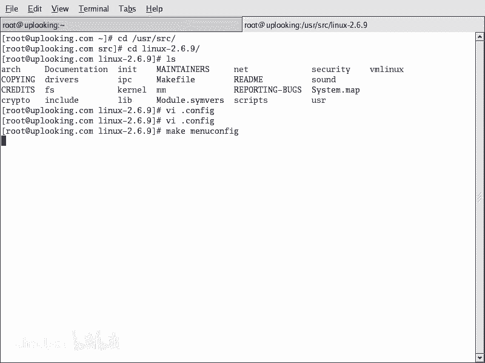
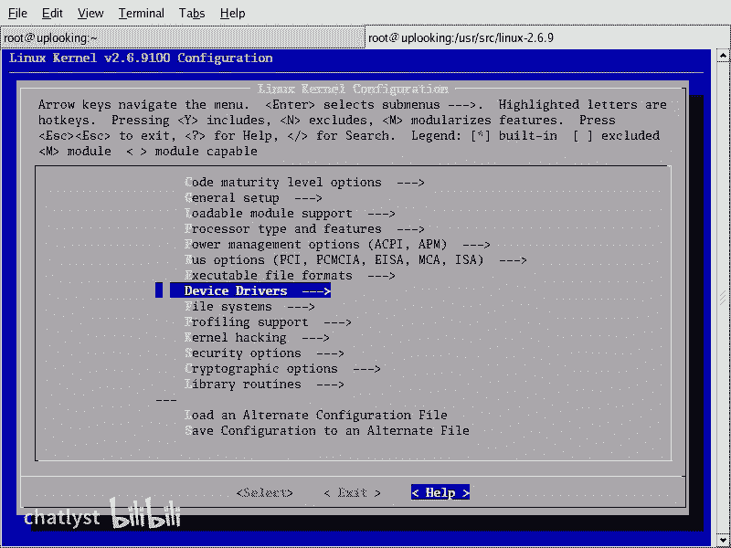
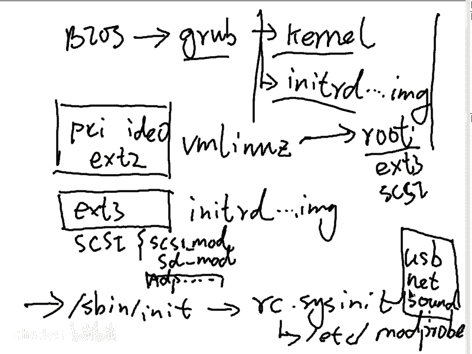
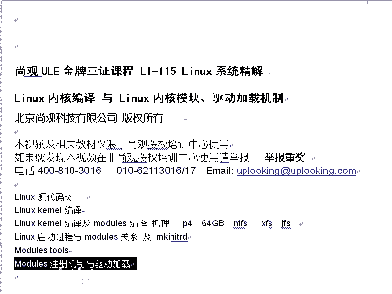
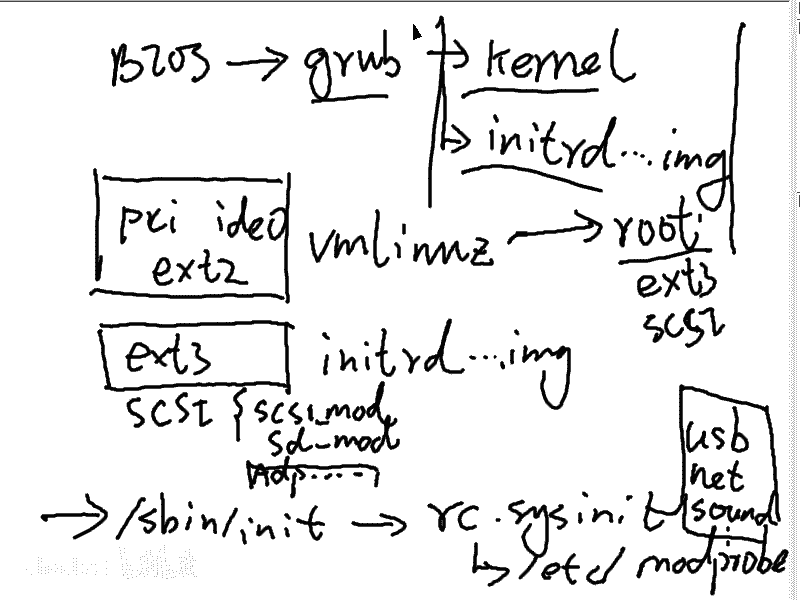
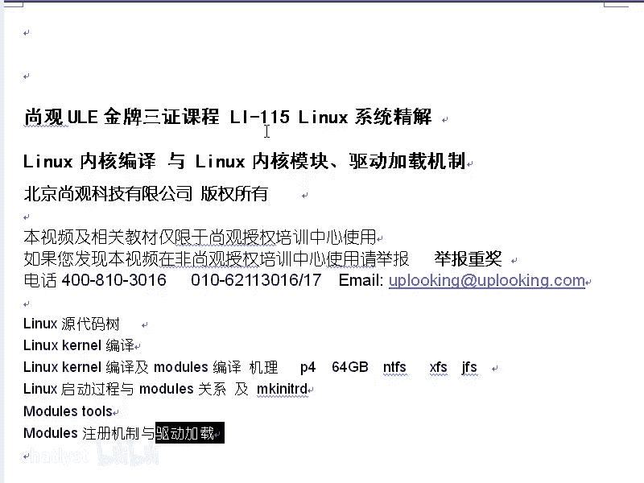
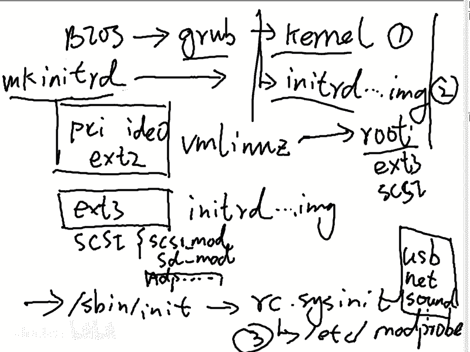
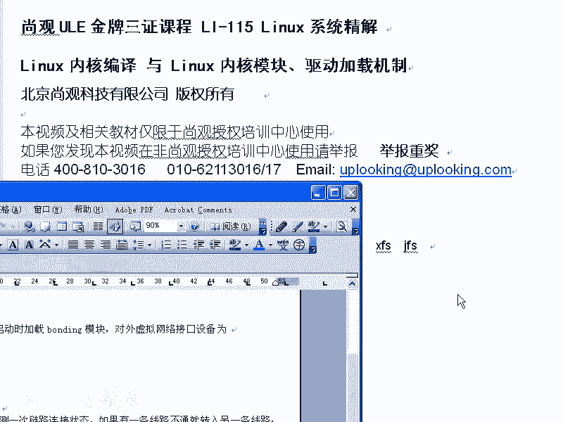
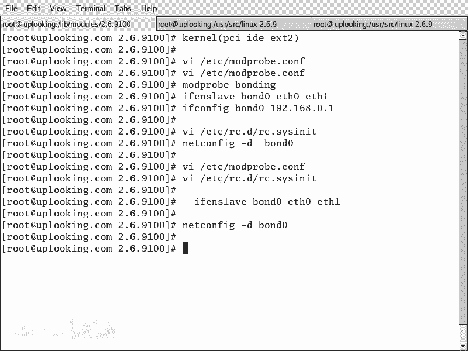

# RHCE教学视频2 - P8：RH133-ULE115-9-modules - chatlyst - BV1PJ411D7LB

哎啊，大家好，呃，我们现在呢开始就是说linux下啊驱动程序还有模块。呃，实际上lininux下的驱动程序的话，实际上都是呃大部分都是模块系统的模块，就是说我们上节课不是在给大家编译内核编译模块吗？

那么其中有大量的driver啊，也就是说呢linux里面一般内核所配置的那些驱动程序，都是内核模块。那么linux里面有一类的驱动程序的话呢，跟windows下不一样。

比方说windows下的这个显卡驱动。那么它实际上就是lin呃就是windows的一部分内核一部分。那么但是linux上呢。显卡的话它是一个应用程序。所以呢在linux里面。

我们说显卡的驱动跟其他的驱动是不一样的。linux里面的显卡驱动它是X window的驱动。那么我们上海的这个就是说老胡啊。那么他呢是认为就是linux下的这个显卡，它比起windows来要差很多。

所以呢它要呃就是说改变这些状况。然后呢，也就是说这个有很多人也有这样的想法，也就是说呢linux下的显卡驱动，它不是linux的显卡驱动，而是什么呢？Xwin的显卡驱动。也就是说呢它是一个应程序自带的。

那么这部分驱动呢不在linux内核当中，但是linux内核里面的话是其他驱动。比方说什么呢？USB驱动，啊，声卡驱动呃，s s的设备驱动网卡的驱动啊，文件系统的驱动等等，这些东西呢都是属于内核的模块。

而显卡的驱动呢，是X window本身的驱动。啊，这是我们要介绍这一块。那么这个呢跟着我们上期那就是上一节课是呃来的啊，大家记不记得上一节课的话，我们讲完了什么？这样的一些东西，对不对？

linux的内核源代码数，linux内核的编译编译及models的。机理，然后呢给大家留了这样的作业，那么把自己弄1个P4P4处理器啊，然后64GB内存NTFS要编辑进去XFSJFS都要编辑进去。

那么linux的启动过程及模块的关系make anITRD。那么我们给大家介绍了一下make anITRD是干什么用的。接下来的话就是说models tools和模块的注册和驱动加载的这套机制。

那么我们要给大家呢再重新说一下啊，这是我们这个部分。ok吓。😊，刚才呢开宗明异的跟大家说了一下，就是说我们呃显卡驱动跟linux其他驱动是不一样的啊，它是一个应用程序的这样的一个系呃。

这样这样的一个驱动程序。OK我们现在看，那么所有的驱动程序都是就是说我们刚才提到那些驱动程序都是linux的内核模块在L拉B下的models目录下2。6。9-22啊。

在这里面那么 kernelel目录下，比方说driver。在这里面的话有大量的驱动程序，比方说ACPI的block设备的，然后自动设备的，然后呢fair worldIDIDE的驱动啊等等。

那么这些驱动呢都是我们linux下本身的这个自带的就是内核当中自带的这个驱动OK现在我们来看一下呢，假设说你现在呃想理解这一套驱动。那么我们知道那么我们实际上是理解什么呢？models对不对？模块。

那么模块的话，大家看RPM杠QA啊GREPMOD。No就。呃，models。对，那么我们看这些模块的话，它有一些呢就是模块的工具。那么这套工具的话呢，实际上就是我们的这个大家看模块的初查工具集。

看到了吗？这些工具集当中呢包含着像我们的什么呢？inscent mode，比方说RPM啊杠QF。我希望大家呢这些基本的用法的话，也应该逐渐就是说熟练起来。加个反引号啊，就是ESC上面那个反引号。

whichLSMOD那大家看。这些工具这个工具链啊，这是针对模块的这样的一个工具集，是靠这个包提供的。如果要是你现在想去升级你的内核，有可能这一套东西要先升级。比方说最典型的一个例子。在re9里面。

你想用2。6的内核。有很多人的话是有这样的需求。它在re9个系统里面想用2。6的内核，那它就必然要怎么样呢？先升级这一套工具，然后呢再把make RIRTRD的话也升级了，然后呢，你才能去做1个2。

6内核的这样的一个启动。也就是说你在2。6内核里面想去呃就是2。4的环境里面想去用2。6内核，那么这些工具的话都要升级。没有这套工具的话，你的模块是没有办法正常工作的对吧？

OK现在我们看那么这套工具当中它有什么呢？首先LS mode，那它可以列出所有的模块LS mode它可以列出所有的加载的模块啊，不是说所有的模块。我刚才说错了。那么mods就是说下面的话都是模块的名字。

这个模块它的大小是多少，被多少个地方所使用啊，被谁所使用。你刚说下面这个例子很清楚XpoFS它的整个的话是呃7168个字节，那么总共呢被一个程序所使用，这个程序的名字叫做NFSD啊，那么你说哎不对啊。

那这边不是有9个吗？那9个的话，后面怎么没有东西呢，它可能是应用程序在用，不是被其他的模块在用，有可能是应用程序，也有可能是其他的模块。😊，也就是前面的话是模块的名字，这边的话是模块的大小。

然后被多少个程序所使用。这边的话是说什么呢？可能依存于它的模块，也就是NFSD是依存于exports FS的。NFSD是基于NXFS换句话说就是说它不加载，那么NFS就没有办法正常启动啊。

这就是LS modeLS mode呢可以看到的这些东西呢，大家要自己呢呃再去看一下。你可以看到呢现在系统当中，如果要是你想看进程的话，那么是怎么样呢？PSAX对不对？看所有的进程。

但是这些进程呢并不是真正的就是说全部的这个这些进程的话，并不是真正的可以呃。😊，这进程的话并不是真正的系统当中正常加载的所有的东西。不是的。那么实际上LSMOD的话。

那么它呢是一些什么内核空间当中的东西。也就是说呢它是不在进程空间当中，你看不到的，也就是你用PS命是看不到的LSMLS那么它可以看到LS是这样的。然后还有就是什么呢？

啊是加载一个模块LSLS modepro还有什么in mode等等。那么说呢知道了列出模块之外，那么你想加载一个模块in mode，那么它可以帮助你你要输入一个模块的完整的路径。然后呢。

你才可以加载这个模块。然后SMOD是已经加载的一色modode是现在要加载一个新的。你方说现在我想把LB目录下的models2。6。9杠呃，22当中的这个呃card当中的。

然后FS当中的MS dos当中的MS dos这个模块加载起来。那这样吧，就是我要加载的是V fight当中的什么呢？V fight模块点Q这个模块。这个时候呢你看到它加载的时候呢，它说什么？

他说呃这个模块的格式是不对的啊，那么可能呢是因为就是说它的版本不一样。那么我们用you name杠A。可以看到自己当前内核的版本，那么是2。6。9100，是不是？然后现在我映射了modode的时候呢。

我去音射了什么呢？2。6。9呃。100啊，这是一个历史性的错误，对不对？然后呢。把这里边V fight和V fight点Q这个模块加载上去。这个时候呢，他说什么？这个时候呢他说出错的话。

说另外一种另外一种错误了。他说什么呢？他说在加载这个模块的时候，他说不明白的什么呢？sbol啊，就是说我们的这个符号，这个模块当中的话，调用另外一个符号。

这个东西呢是模块和模块之间互相调用的时候的什么呢？称呼。你比方说我这个模块啊，它提供给另外一个模块一些功能，那么就是说提供的这个功能就叫做什么呢？就叫做这个SY nBOL啊symbol。

那么也就是说我们这个加载这个wefi这个模块的时候，它可能依存于另外一个模块，要加载那个模块的功能的时候呢，找不到啊，找不到。所以这时候它会出错。那么这时候呢我们就知道了模块之间可能有依存关系，对不对？

in mode的时候呢，我们这样的in mode先in mode当中的点Q这个时候呢是没有问题的，对不对？没有错误，因为什么呢？因为ft点KO，它不依存于其他的模块，然后呢。

你现在再去加载Vf点KO这时候呢也没有问题了。然后呢，现在你知LSMOD然后GLEP什么呢？ft你看到这两个模块是不是都上去了。这两个模块都在上面吗？所以呢这个时候的话。

这两个模块它的依存关系是由你手动去解决的，也就是你自己要明白它的依存关系，对不对？那么假如说我们现在把它去掉啊RMMOD然后我们可以把Vf先什么呢？去掉，然后呢再去把什么呢？f去掉。

这个时候你再去看这里面的模块是不是都去掉了，没有了，对不对？那么我们刚才学会了什么呢？LS和D列出所有的已经加载的模块in mode，那么我们要给完整的一个路径和这个模块的名字能把它加载上去。

如果要是加载的过程当中出现依存性的关系的问题，那么你要自己去解决，也就是in mode，它不管。😊，那么在删除的时候呢，RMMOD可以帮助你。对吧这是我们解释的一个。两个还有呢三个啊三个命令。

是不是这三个命令的话可以帮助我们把这个模块的话呢呃稍微用一下。但是呢我们说依 mod，它很很不爽，那么它要自己解决依次性关系。你看你要加载模块，然后再去加载wifi模块，你要自己知道这个依存关系。

那么如果要是你想自动解决的话，那么你可以用什么呢？promoreprofi。刚才是不是我们说你在加直接加载微fi的时候，它出错，对不对？看这个上面你再直接去加载这个微fi模块的时候，是不是出错啊。

它这边出这样的一个错误。那么现在的话我还是直接去加载wefi呃，就是微fi模块，刚才我不是把这两个模块都删除了吗？然后呢，我现在重新再加载一遍，用modpro去加载pro直接回车，你连它的路径。

还有它具体的文件名都不用知道，那么依存性关系，它都帮你解决好。这个时候pro就自动加载了。😊，然后我们这个时候呢再去看一下LSMODGREPfight你看到这两个是不是都出来了。所以你看。

inser的mod和什么呢？mod。pro啊，他们两个的话都是加载模块，但是呢iner mode它就显然不智能，而mpro的话，它就是智能的去加载，对不对？这是它们两个的区别啊，这是它们两个区别。

所以的话一般情况下，我们想去加载一个模块的时候，都是mopro。那比方说我现在的话有个驱动程序啊，网卡的驱动。那么是3com的3C59X。那么这样的mopro。啊三。3C59X。

然后我想把它加载modpro，这样的话它就会加载，你直接输入这个模块的名字就好了。而这个模块具体在哪呢？我们看一下GREP3C59X也就是为什么modpro能知道它的位置呢？

首先他在自己的这个模块的目录下啊。自己的这个模块的目录下，有一个什么mods点DEP文件。在这里面的话就有3C59X这个模块所在的位置。也就是mododepro，实际上呢它的配置文件是谁呀？就这个文件。

每一个自己版本的内核模块的个目录下有个models点什么什么的这样的一个文件，也就modpro会找这个models点什么什么这样的一个文件。那么在modelpro的话，找这个文件的时候啊。

找这个文件的时候，还会自动解决它的依存关系。你比方说刚才我们为什么modelpro wefi的时候。notpro we fight的时候，你能看到就是说这两个模块都一块加载上去了啊。

为什么为什么这两个模块都加载上去了啊，为凭什么就notpro实际上呢在加载的时候，那么我们再来看一下个是什么呢？刚才是3C59X啊，我们现在在看什么呢？呃， fight。

你看一下微fi这一行里面的话就是什么呢？我首先的话加载这个微f模块，这个点KO的模块的时候，这个路径在这里面了，是不是在这个冒号后面是不是有它依存的那个模块的名字啊。

也就是说微ite这个模块依存于什么f点KO对不对？所以呢这个时候的话modpro它自己呢能根据这个配置文件，首先第一的话，找到这个文件的什么位置，对不对？这个文件的话在哪？然后第二的话还能解决什么呢？

依存关系。是吧那么他会先把冒号后面这个东西的话先加载起来，这就是morepro。大家呢现在就知道了，modpro它的配置文件所在的位置是在哪呢？就是models点DEP那modelpro的话。

它呢会自动去找这个models点DEP找里面这个文件的路径，还有呢它的依存关系。所以呢这就是modpro它的比起in model来好的地方。然后呢，你想把它去掉的时候，那么还可以呢去modpro啊杠R。

比方说我现在想把什么呢？呃V fight的模块去掉，然后呢去掉了以后，然后再看。这个时候呢它的模块就都没了，是不是？所以呢morepro杠R的话，它呢可以呢去卸载这个模块，那么它也是智能的去卸载。

那么跟RMMOD的话是相对应的。它呢是RMMOD是手动。那么morepro杠R的话呢，是智能的去卸载这个模块啊，我们列出了这么多，列出了这么多。那么大家看一下是这样的。LSM。呃。

INSMOD然后呢modpro啊，然后呢是modpro杠R，是不是？然后呢，它需要找到我们的L拉B下的models相应的目录下。想能目录下的什么呢？models。点第一P。这样的一个文件。

那么作为它的什么呢？作为它的配置文件，然后RMMOD也是。跟上面的是一样的，就是跟那个modpro是一样的。但是呢modpro跟R是一样的啊，只不过它是一个一个删除，不是由不是自动去删除的。

那么这一系列的命令的话，还有还有什么呢？这样的，那么你想知道这个模块的情况呢，model info info，然后呢加上这样的一个文件，加上这样的文件。比方说现在我想看一下这个文件的话。

就这个模块它到底是呃就是干什么的。然后呢，我把它什么呢？copy，然后呢，连接过来，这个时候呢，我一回车，我就可以看到这个模块的消息，mod info就是做这个用的。all的in就做这个。

回顾一下啊回顾一下，搞清楚了吗？inser mode呃iner mode，还有呢什么LS。Andm O， what probably。RM mode然后现在的话我又说了一个什么呢？

mod infomod info的话直接回车。那你可以看到这个模块，它的什么license，然后它的描述啊，作者是谁？然后呢，现在编译的时候呢，是哪个版本啊，针对什么样的这个什么编译器，然后编译的。

那么它依存关系在哪？那么这边modode info同学能看到，所以呢这一系列的命令当中的话，我们现在讲的这这个地方的话，总共讲了5个命令，对不对？还有一个命令是什么呢？还有一个命令是这样的。

还有命令的话就是我们的第一Pmodode。第一批modote是干什么用的？是这样的，你直接一回车，你会发现你的硬盘的话就开始亮啊，亮一段时间的话呢就就灭。这是废话啊，说了一堆废话。那么为什么呢？

就是因为第一批mod它会把那个LIB那个目录下啊，就是你相应那个模块目录里面所有的模块全部都去什么呀？看一遍这些模块之间的依层关系啊等等这些东西全部都搜索一遍。搜索完了以后呢，它会放在这里面。

就是说你自己编译的模块也好，或者说呃后来编译的这些模块也好，它都在这个里面，那么会有这样几个文件啊，大家看这个目录下的话是不是有什么mods点第一P看到了吗？就是我们刚才说过的是吧？还有什么呢？

mods iE1394mapPCIM map什么input map什么呃USB map，还有呢就是模块互偏之间相对应的时候调用的那种符号是吧？调用那些符号的这样的一些信息。

也就是说第一批mod它实际上呢就是把这个目录下所有的模块啊全部都搜索一遍。然后把里面的这些信息呢。拿出来，然后呢放到这些配置文件里面去。所以什么时候会用第一批mod呢？

你比方说我们现在呢呃就是说刚才编译内核的时候，就编译我们的模块的时候，有一个东西没有编译啊。比方说我们现在CD到什么呃。比方说我在另外一段啊另外一段。那么我现在呢到昨天的那个编译内核的那个地方去。

我昨天呢到编译内核那个地方去。然后呢，我CD到USR且的SRC目录下是吧？到我们的这个linux杠2。6。9这里面去。然后呢，我在这里面的话去怎么样？VI那个点卡费的文件。

现在呢假设说我已经编译过一遍内核了，我现在想编辑一个额外的驱动，我想编辑一个额外的驱动。那么我现在找一下啊呃我想想什么比较合适一点。额外的驱动，我看一下USB啊。嗯。USB设备。

那么假如说呢我们现在的话有一个什么呢呃。假如说我们有一个东西的话，想编译啊，这边比方说这个呃s接口的这个。就是IS接口的这个IS接口的这个wach啊，就是看mon狗。这个看mon狗这个功能。

大家看刚才这个功能的话，它是什么not side是吧，is not side好加了注释。不我现在把这个注释取消掉，也就是说我已经编辑个内核。那么现在我不想重新编译，我只想编译一个驱动，怎么编译呢？

那么这样的，我把它给改成等于M，等于M了以后保存退出。那么我改了一个下改了一下的话，最好再去什么呢？make menu confi一下。也就是说呢我刚才改的什么东西呢？改在这里面。

然后它呢刚才是not set，我把它改成等于M这行的话把它改成等于M，把前面的注释取消掉。那么取消掉以后呢，这边做完了以后，然后我再去怎么样呢？make menu config。然后呢。

这样的你进去以后啊，进去了以后不用太多的去动什么东西，你不用太多的去动什么东西。那比方说随便去看一下，然后最好呢到那个USB那个地方去呃。😊。

dice driverver是吧，找到USB。Yeah。这里面的话是哎呦讲起来太费劲了。USB supportport是吧？你比方说在这里面的话，你可以看到刚才那你选的那个啊，不是不是USB设备了。

刚才那是IS设备是吧？老是犯错误。就不管它了，这边的话随便你去就是说从make confi里面的话，你转一圈回来，然后呢，你再去呃保存一下啊，保存一下。这个时候呢它可能会帮你把依存关系整理好。

因为我们的make file的话，它做的还是不错的。那么这样做一下的话，可以有助于你减少你要犯的错误。然后之后的话，你再去什么呢？make什么make呃 models。

那么这个时候你会看发现呢，那么它编译内核的时候就编译内核模块的时候就没有那么长时间了。他只编译呢你没有去做过的那些东西啊，他只编译你没有去没，就是你刚才改的那些东西。

那么如果要是你已经就是说已经编的那些东西的话，它应该是不动的。我看一下啊。这个过程话应该是比较快。除非是就是说我有改过东西了。忘了。看样子好像是不太对劲。好像我这个机器的话是又被别人动过，我看一下那个。

按你说应该没有动啊。要重新去编了，就说我的意思是什么呢？假如说这个东西没有别人动过。那么接着我们刚才那节课的话，做完了以后，没有别人动过的话，那么这时候你再去make那个模块的时候。

它只会编译其中的那一个模块，也就是这个模块依存的那些模块的话，它才会编译，编译完了以后呢，你可以手动把它co过来。也就是说我刚才为什么要串到那边去？我在讲这边的命令的时候。

我说你什么情况下用第一批mod呢？你比方说刚才那个模块编译出来了。那么于是我们这样的USR下的SRC下的linux到2。6。9是吧？在这个目录下的什么呢？呃，比方说呃。我看啊。比方说在那个2。6。

9这个那这个目录下，那么我们把刚才的就是说编译出来那些东西的话呢，呃再拿过去。因为我不太熟悉我刚才编那个东西可能是在哪个地方。然后呢，你可以把它copy过去。比方说driver目录下的。艾a。

那IS的功能可能根本没有。比方说你现在编译的一个什么呢？PCI总线的这样的一个工具。那比方说把一个。啊。Hot plug。hod plug当中的。比方说把这个PCIEHP点Q啊，你copy到了什么呢？

copy到了I拉地下的目录model目录下，什么2。6。9100这个目录下是吧？然后呢，放在这个s当 kernel当中的什么driver目录下drivers目录下，那么比方说copy到某一个位置。

比方说PCI这里面。copy过去了以后，龙想请问大家，这个模块如果我copy过去了，是不是它没有在刚才那个配置文件里面，没有在哪个配置文件里面呢？阿拉B线的 models2。6。点9100。

就是我们刚才不是说呃modpro的话，它不是有大量的配置文件嘛？在这个第一P里面的话，不是没我刚刚copy过去的这个模块不是并没有注册吗？那么这个时候的话你就运行一下什么呢？

第一批modode第一批modode一回车O那这时候呢他会把你那个mod下所有的你刚刚做出来那些模块的话也进行注册。所以它第一批modode经常都是这样做的，就说你更新了一大批的内核模块了以后啊。

你更新了一大批的内核模块了以后，这个内核模块的话呢，你呃就是说不是原来那些了，那么你要把这些新的内核模块的话，注注册一下，那么注册到这里面来。

那么用第一批mod那你说哎老师我明白第一批modode是干什么呢？他要更新这个文件嘛是吧？那跟其他文件有什么关系呢？这些文件啊一般都是什么呢？即插即用的文件呃，就说他们要找的文件。你比方说。

你插了一块什么，你插了一个呃鼠标是吧，它就不会出现摄像头的驱动，对不对？如果你插了个USB的U盘，那么它不会给你出现一个什么呢？鼠标的驱动，为什么会这样呢？那么大家仔细看一下这个文件就好了。

tailll啊，我们到这个动作下去CD到。CD到这个目录下去，到这个目录下去了以后，然后呢，我们这样的tell一下。

比方说mods点USB map这里难看你可以看到呢有各种各样的驱动程序的名字和它所对应的代码，这些代码都是什么东西呢？都是它的厂商ID或者USB的这样的一些协议的这样的一些编号。那么通过这些编号。

你比方说你插了个U盘。这个U盘里面呢，其中带着两个编号或者更多的编号。这样的编号呢所对应的驱动，就是这个驱动。所以呢这个时候的话它就自动找这个驱动，而不会去找其他的驱动。明白了吗？

也就是说我们在这个目录下直接看到的这些配置文件，这个文件的话是做什么呢？是做注册用的，解决他们的依存关系，注册这些模块用的，对不对？那么其他的这些m是干什么呢？

比方PCM map然后呢USB map等等这些东西是干嘛的呢？那么是你插上这个设备以后，它这个设备的话会有一个即插即用的代码，这个即插即用的代码，那么包含着一个什么呢？厂商的代码还包含着一个什么呢？

设备的代码，USB设备有PCI设备也有a的话呢，即插即用做的不是特别好啊，所以这边的话这个isa的一般很少去用。然后呢，IE1394也是一样。那么还有什么呢？呃原来还有什么PCMC1A啊等等。

那么这些东西呢插上去以后有个厂商ID有一个什么呢？有一个设备I根据这个ID的话，反过来在这个文件里面的话去查找它的什么查找它的。查找它的什么驱动程序的名字，是不是？然后呢，从这个文件里面的话。

查找到驱动程序的名字以后，再到这里面的话，去找这个驱动程序所在的位置。然后呢，接着的话去加载这个驱动程序。在这里面，这就是它的加载机制，也就是计差机用的这个机制，就是这样来的。OK我们给大家总结一下。

那么一个是什么呢？LSMOD一个是什么呢？色的MOD映的MOD的话必须得输入一个完整的路径是吧？什么什么点KO的这样的文件，完整的路径，完整的文件名都要输入，那么自己解决一层关系不用。

那么你直接就是什么呢？就直接上去了，连点KO都不用加。那么的话想把它卸载的时候呢，然后呢杠R可以把所有的模块全都卸载掉。RMMOD也是一样。RMMOD的话可以在内存当中，比方说把V fight卸载掉。

但是呢你要自己去解决它的依存关系。它呢跟modpro杠R的话是呃是一个作用。但是呢没有modpro杠R的话呢，那么就是没有它那么智能。然后呢。

model他们它是可以看我们的模块的什么模块的这个呃就是说信息这个模块的话，依存于哪个模块作者是谁。他的协议是什么？他可以这样，那接下来的话还有什么呢？还有就是我们的第一P。

modode第一批mod的话，我们告诉大家的什么呢？models是吧？点DEP的作用，还有什么？models，然后呢等等这些我们上面这些。什么什么什么点什么map的这些文件的作用啊。

什么什么USB map啊，什么PCM map啊，么input map啊这些map的作用。那么它是插上这个设备的以后，这个设备会给他一个ID号码。通过这个ID号码的话。

你可以在这个文件里面反查出它需要哪个驱动。需到这个驱动的话，它再到这个models点DP当中找到这个驱动的具体位置。然后再到科这个目录下，再去找这个驱动的名字啊。比方说。呃，就这边我在我我就先停一下。

然后给大家仔细琢磨一下，大家可以问一下我们的辅导老师看自己明白了没有啊，看自己明白了吗有？这就是整个的一个more tom to。大家还可以看一下呢，就是说你想看系统当中所有的模块啊，这些模块的话呢。

它提供哪些呃就是功能嘛。这些功能的话，你可以找到这个啊，我看啊哦K。Yes。K SY。哎呦，我脑子是就是有段时间不动它的话，它就有问题啊，有段时间不动它就有问题。等一下呢我给他找一下。呃。

找一下在这个地方啊，KR，然后SYMS这个文件里面的话是有所有的啊，这个文件里面是有所有的那个每一个模块它所提供的功能。就是说你要说你可以看更细节的。比方说这边的话编译完了，就是比较快。

比刚才的话快很多。那么大家看catPRPROC下的什么KR。SYMS然后呢，这里面你可以看到，就是说我们首先啊这些功能啊这些功能。GBD这个已经加载的这个模块，这个模块里面提供一个这样的功能。

在内存当中的个位置。那么GBD又提供这样的一个功能，这个功能相当于是给别人提供的一个函数调用啊。那么它呢在内存当中这个位置，所以呢这就是。这就是你所看到的，就是说每个模块这GBD啊。

GBD的话提供那么多。那EXT3的话提供哪些，那么很大每一个模块的话，它提供了哪些什么功能供供别人去使用。所以呢这个文件的话，大家也知道它是做什么用的就好了。另外呢就是说呃。另外呢就是说对模块的话。

那么大家要有一个这样的认识，就是说它跟驱动程，那它跟那个应用程序是不一样的。应用程序你可以用PS。命令来看或者套话等等看。那么模块的话呢，在应用空间当中你是看不到的。那么你用LS mode能看得到。

OK大家呢问一下我们的辅导老师，看一下还有什么问题，等一下我们接下来继续讲啊，继续讲一下。那么大家呢稍微呃稍微缓一下，看一下这张列表，那么仔细问一下问题。ok那个大家不知道总共清楚了没有？

如果要是有问题的话呢，还可以继续问啊，我们在这里面再补充一些东西，就是说whatpro。他这个命令的话呢，他是可以把一个模块啊，那么自动的进行加载，并且解决它的一存关系。那他在加载的时候呢。

是找这个配置文件。这配置文件呢是由D一Pmod的话，帮他整出来的，就是models点DEP这里面呢有依存关系，还有我们模块具体的位置。如果你新编译了一个模块。

你可以把这个模块呢copy到指定的目录当中去。然后呢再运行一遍第一Pmodode，那么modote probably它就可以找到了。monpro后面跟的是一个模块的名字。你比方说现在我们要想加载什么呢？

XFS文件系统的驱动，那么直接mopro XFS它就上去了。对吧然后呢。啊。晕了啊，大家看XFS这个模块就已经上去了，它怎么上去呢？morepro通过这个配置文件里面的位置把它加载上去。

这就是XFS怎么去加载上去。那么它非常简单，但是呢我们接下来要讲的就是说你的模块在加载的时候，它可能是有参数的modelsmorepro的话，那么它呢有自己的一个配置文件，这配置文件在哪呢？

在这样的ETC下面的什么呢？morepro点com这个配置文件。那么在这是在HEL4。HEL4以后的版本啊之后版本。after啊就说在他的之后的版本。那么在以前的话是什么呢？

ETC下morepro什么呃models。modelles点comM这是HEL3。HEL3以前的版本啊，在它之前的版本，也就是HEL3HEL2。1re8reite9等等。

以前的老式的版本里面都是models点com，而不是pro点 co。所以呢现在我们再来看一下呢modpro点这个的点，大家看这里面的话加载了你必要的什么呢？呃，网卡。你要说现在的话，我们的网卡ETH0。

它用的驱动是要的PCnet32Pnet32的话是网卡的驱动驱动的名字。它呢有pro去加载pro每次加载的时候呢，都会访问这个文件。它访问这个文件的时候呢，加载到这个模块了以后。

并且把这个模块的话起一个名字叫做什么呢？叫ETH0。也就是你访问ETH0的时候，实际上就是在访问你的这款网卡。你访问ETH0的时候，就是在访问你这块网卡。

那么如果要是你访问UHCI杠HCD的这个呃这个驱动的时候，它还有个别名叫做什么USBcontrl。实际上呢它这USB的什么呢？这个USB的这个呃就是芯片组，就相当于你在主板上，你不是有USB口吗？

那这个USB口连到哪呢？连着你的南墙上的这个USB芯片是吧？那么可能是在集成在里面也可能是分出来的一个芯片。那么一般来说的话呢。就是在你的主板上的这个USB的控制芯片。

有UHCI和OHCI或者EHCIEHCI的话呢是USB2。0的驱动。那么USHCI是USB1。0的这个驱动，或者是OHCI也是1。0的这个驱动。它有两种啊，这是这样的。那么这个模块加载上去以后。

你能通过访问什么呢？EB杠conttrol来访问到它。那么所以呢我们现在看你加一个A什么什么东西。那么这个模块的话就会被加载起来。每次启动的时候都会被加载起来。

这就是为什么你的网卡每次启动的时候都会有这个驱动。那么你要在这里面的话，把这个网卡的话，加载上去，并且给它改名叫做ETH。那么知道这个命知道这个配置文件有什么有什么好处呢？比方说你有2块网卡。

一块网卡的话是就是说比方说PCn32，还有块网卡呢是8139啊，就是台湾的我们的一个著名的这样的一个芯片厂商产生的就是生产的非常非常著名的8139网卡，8139网卡的驱动。那么你可以这样的。

你可以呢在这里面你可以手动的怎么样往外连接一下啊。那么现在的话你想让那块网卡的话叫做什么呢？叫做ETH1啊，每次系统启动的时候呢，这块网卡也加载上去8139TOO那么这个时候呢这。😊。

网卡一加载上去以后，它是不是叫做ETHE了？每次系统启动的时候呢，只要这边有这样一行modpro就会把这个网卡的这个驱动，就是8139wo的这个驱动的话加载上去。他就会把它加载上去。

那么这时候呢它会改名叫ETHE。所以呢这时候你的2块网卡，一个是ETH0，一个是ETHE，对不对？那么你是不是把一个新的网卡加载上去了呢？😊，你的新的网卡的驱动是不是在这边加载了。

一旦加载了这个驱动了以后，你才可以给它设置IP地址，没有加载IP呃，就是没有加载这个驱动之前的话，那你是不能加这个IP地址。你要么就是用morepro8139wo，然后给它加载上去。

并且给它用RFfi给它设置IP地址，要么是怎么样呢？你写在这里面，写在这个配置文件里面，然后让系统每次启动的时候，它都自动把它加载上去，并且改名叫做什么呢？ETH1。那么你说A呀。

老师这个ETH0ETH1，我想换一下可不可以？当然可以了，能把这个上面改成一，下面改成0。那么8130那开网卡就变成ETH0了。那么上面这套网卡就是ETH1那，就非常简单。

这就是我们呃系统呢每次启动的时候，它自动去加载驱动的时候，它的这个配置文件，这个配置文件是哪？是是哪个配置文件呢呃。ETC下的modpro点com啊ETC下的modpro点 co这个配置文件就是它啊。

那么我们再看这里面的话呢，它加载了一个驱动，声卡的驱动是吧？这个声卡的驱动的名字是这个名字，然后呢，给它起的别名是这个别名。那么它这边的话是options，是说呢在加载这个声卡的时候。

那么给它起好传递一个参数，传递参数是什么呢？叫做indes等于0。啊，ind等于0。那么也就是说我们加载这个声卡的时候呢，给它起这样的一个什么，给它加载这样的一个参数，传递这样一个参数。

也就是说这里面不只可以加载某一个指定的驱动，还可以呢在加载这个驱动的时候呢。就是给它传递一个参数。那么另外呢有在装载这个驱动的时候，大家看你装载这个驱动的时候，用modpro，然后怎么怎么怎么怎么样做。

那么也就是说在装载这个驱动的时候，那么inint就装载这个驱动的时候，它帮你自动完成某一个功能。它自动帮你装完成网共了，或者是在 remove入这个驱动的时候，它也会自动帮你呢可以做你某一些事情。

所以呢在这个配置文件文件里面，除了可以帮你怎么样。除了可以帮你把这个驱动加载上去，你加这样调的话就加载上去。然后呢，还可以呢在加载这个驱动的时候呢，给你传递一个参数，这个参数哈in desk等于0是吧？

对不对？这个option。看明白了吗？明白了没有？加载这个驱动的时候，传递给他一个参数ind等于0。对吧然后呢，还有呢就是说安装这个驱动的时候，在自动去运行某一个命令。在自动去运行某个命令。

那么删除这个驱动的时候啊，删除这个驱动的时候，那么也是自动帮你完成某一些命令。是这样的，那么这个搞清楚了以后，然后呢，我们再来看。呃，这个文件里面能在加载驱动删除驱动的时候呢，帮你自动去执行某一个命令。

还可以呢在加载时候传递参数。那么我们看具体的这个声卡驱动，它是干什么呢？它是帮你把这个声音啊进行调节啊，声音进行调节。以前的话声音进行调节。这边的话好像是呃。

这边的话好像就是说I呃ALSAALSA是什么呢？高级linux声卡架构啊，声音架构高级linux声音架构有一个叫做3WALSA的这样的网站吧，好像这个网站里面的话是声linux下声卡的这个驱动。

刚才就是呃我给大家讲过，就是说在上一节课的时候给大家讲过，就是说声卡，它为什么独立于driver呢？就是独立于其他的driver呢？因为linux的声卡是最难找的驱动。为什么要lininux声卡的话。

虽然找？因为linux平台，你比方说是存储设备，比方说scar设备啊等等这些设备网卡，它肯定有lininux的驱动。这个厂商它自己要编，为什么呢？因为你一个服务器，它肯定是高端的网卡。

高端的scars设备对不对？而这个服务器经常要装lininux系统，所以它它的驱动非常完善。但是呢什么样的驱动最难找呢？你这个机器它有块声卡，这个声卡本身就是娱乐的，这个机器上才会装。

是不是我们一个服务器上谁都不会去插上一个什么耳机，在那边听歌，对不对？那么零就不是零下，就是18摄氏度以下的这个window里面，谁在那个机房里面再去听歌啊，所以呢在服务器领域的话。

对声卡的驱动要求最不最不高。所以的话lindows平台的声卡驱动是极度的匮乏。😊，连创新的网站能去找它的声卡驱动很难找到。所以呢我们专门有个lininux的组织。

专门做叫做高高级linux啊声音架构这样的一个东西。那么由它呢来统一的做所有声产的驱动。当然不是所有的了，就是大部分声产的驱动。所以呢它是一个功利性，就是说。公益性的这样的组织。这个组织的话呢。

它是为了驱动linux声卡啊，让linux的这个机器的话有声音这样的一个东西。所以呢它是独立的一套架构。它的这个规模的话非常庞大。所以呢你如果不用的话，你可以把这个声卡这些东西全部都去掉。

因为它你你根本不是一个什么娱乐级的这个机器，对不对？你要不要声卡都无所谓，你可以把它全部去掉。如果你这是一个服务器的话，如果你是一个什么呢？台式机或者PC你要听歌，那么你就把它加上去。

那么这个文件在什么时候被调用呢？这个文件是什么时候被调用呢？它是这样的，大家记不记得我们说系统初始化的时候，有一个脚本叫做RC点s对不对？在这里面你看一下GEP，然后呢，叫做啊，然后呢。

在我们的ETC的RC点D当中，然后呢，找到RC点你可以看到。not tro啊not tro的话呢，它实际上是呃。通过这样的一些东西，就是说呃morepro杠C啊morepro杠C这个参这个参数的话。

它会自动读取morepro点com把里面的话，你想去加载的驱动加载上来。也就是说啊你现在系统当中这些驱动，就是放morepro点com里面的这些驱动是什么时候被加载呢？是这样的。首先的话l启动的时候。

科l里面包含着种种种种的驱动是吧？比方说什么呢PCI的驱动IDE的驱动，还有什么呢？还有就是说我们的这种比方说EXT2或者EEX3EXT2文件系统驱动。我这边画一个图的话，大家可能比较清楚。

我这边画一个图，大家可能比较清楚。okK大家看就是说L4启动。启动L启动完了以后呢，该是什么呢？gb grab去加载什么呢？加载 kernelel，是不是在这个 kernelel里面，也就内存当中的话。

这个 kernelel里面这个 kernelel被加载了， kernelnel里面的话应该有什么呢？就是那个VMLINUZ是不是这个配置这个文件，这个内核文件解开了以后呢，它里面有常见的驱动。

比方说PCI的桥设备的驱动啊，还有呢我们的IDE0的驱动啊，还有呢我们的这个常见的。比方说EXTR文件系统驱动啊，这个是在reite的这个内核里面一般都包含的。然后接下来的话呢，在另外一些驱动的话。

是包被包含在另外一个文件里面，也是由grab去访问的grab除了调把 kernel加载起来，还有个什么呢？INITRD什么什么点image。对不对？那么这个文件的话，那么是在也在不同录下，在这里面。

在这里面的话有什么呢？EST3文件系统驱动跟启动相关的驱动，一般都放在这里面。如果你有s设备，有seac的什么呢？sac的modode啊，s的相关的驱动，s的相关驱动的话有什么呢？s mode。

scuss mode还有什么呢？还有就是说SD mode。SD mode是sga的diga的磁盘啊，还有呢我们呢比方说呃。A backpacker。ADP什么什么东西，这种呃卡的这种驱动。

C咖斯卡的驱动等等。那么这些驱动的话呢，都够跟启动相关。我不知道大家明白不明白，你比方说内核启动完了以后，它是要驱动是吧？那么它接下来的话是不是要找跟风区啊，这个科呢是不是要找跟分区啊，找根分区。

是不是这个根分区的话本身是一个什么呢？EXT3的文件系统，同时的话是在s上面。scar上面，那么这个时候的话你的这个VMLNUZ当中没有这些驱动，对不对？那你怎么加载根跟区啊？你没有办法加载。

所以他就说呢他找内存当中的IITRD的话去找。所以他一般跟启动相关的驱动程序，跟启动相关的驱动程序是在这个地方的话，被iner mode去加载的。然后呢，如果要是你。如果要是你现在的话，这样的。

就是说呃这个地方加载完了以后，顺利的加载了跟踪区。然后也就是说这个阶段也完了啊，就是说这个阶段的话实际上包含了两部分加载内核模块的部分。然后呢，接下来的话去加载什么呢？接着去运行什么S并且的。

INIT是吧，S定义的INIT调用的第一个系统启动脚本就是RC点什么s。C点4net去去访问的什么呢？访问的我们的ETC下的什么modpro。点com啊，写不下了，点com。

也就是说呢在这个地方我们已经经历过前面的内核当中原本的驱动，还有呢IITRD里面的驱动。然后呢，启动完了以后跟启动无关的驱动才会放在什么呢？ETC像的morepro点com里面。你比方说什么驱动呢？

在这里面常见的就是什么USB的驱动，还有什么呢？还有网卡的驱动，还有什么呢？声卡。啊，声卡的驱动等等。那么如果要是你现在这个跟启动相关的这个驱动啊，跟启动相关的这个驱动，那么呃肯定是放在上面那两个地方。

那么这边的话跟都是跟启动无关的这个驱动放在这里面，我不知道大家是否明白了啊，这个就是我们的什么呢？这个就是我们的呃linux的话，mo tools给大家介绍完以后。

然后呢给大家介绍linux的模块的注册与驱动的加载。那么实际上呢你常见的这个驱动程序的话，那么很多都是在这里面的。

很多都在这里面，也就是说呢我们在这里面的话，大家记住这个驱动程序的加载呃，models的模块机制。那么给大家介绍清楚了。然后呢，比方说注册机制，你比方说谁去注册这些模块。

那么注册那几个配置文件是哪些文件。然后驱动的加载是怎么加载的。你方说你现在装了一个新的驱动，你想装个新的驱动，你应该把它放在哪个地方？如果要是这个驱动是跟启动相关的。

那么你就把它应该放在什么IITR地点以位置当中，那么怎么放在里面呢？你可以输入这样的一个model。

啊啊，不是错了。不好意思啊，晕掉了，这个地方错了。呃，应该输入一个什么呢？输入一个makeINITRD啊这样的一个命令。makeNITRD这个命令的话，在上节课给大家讲过，那么make NITRD的话。

你可以把你指定的驱动加载到IITRD的这个镜像当中，什么情况下用呢？就是说你现在做的这个驱动跟启动相关。也就启动的时候必然要用到这个驱动。你网卡，你说启动的时候一定要网卡驱动吗？

不是启动时候一定要USB驱动吗？一般情况下不是如果是1个USB的U盘的话，启动的时候，那它要是不是声卡你也不是启动的时候必须得要的。所以呢这些驱动，那么一般放在ETC的mopro这个点com里面去加载。

而make IIRTRD的话，那么它呢是可以把一些启动驱动。比方说EX文件系统驱动驱动放在里面。那么这个呢就是我们这个部分啊驱动加载这个部分。不知道大家清楚了没有，大家可以仔细问一下呢。

我们的那个呃就是说我们的这个辅导老师啊，看一下是怎么是怎么做的。仔细问一下这个辅导老师。好，我们现在呢回头再来看啊，回头看一下这个驱动的加载。驱动加载的话呢，我们给大家介绍的比较清楚了。

那么现在呢我们知道这个模块啊，你想让它启动时候加载，能把它放到moreproing co里面，那么就可以了啊，等一下的话，我们来举个例子吧，等一下我们来举个例子啊。

那么大家呢先看一下刚才这个图到底有没有什么问题啊，刚才这个图的话到底有什么问题没有。这个图的话到底有什么问题，特别乱是吧？bis启动完以后，grab grab加载两个文件。

一个 kernel1个IITRD对不对？IITRD里面的话一般都是跟启动相关的这样驱动。而 kernelnel里面的驱动的话都是固定下来的。对不对？所以呢你可以呢把一些跟启动相关的驱动的话。

用makeIRD的话给它加载进去。如果要是跟启动无关的。比方说声卡驱动的话，你可以在ETC下mpro co里面的去下载。所以的话这是什么三个地方，这是第一是吧？这边要从面内核的这是第二这是要怎么样呢？

去用makeIRD的这是第三直接改配置文件就好了。这三个地方可以加载你的驱动三个地方可以加载你的驱动。那么如果你就一定要用mpro自己手动加载，没人拦着你啊，随便这样的话你直接可以下载。

这就是我们的驱动加载的机制啊，内核驱动加载的机制。O就是这样。大家呢都问一下啊，都问一下。我们马上的话举个例子啊。看一下有什么问题没有。看下有什么问题没有。

O那个我们看一下这个例子啊，我们看一下这个例子。呃，现在的话我们想做一个双网卡绑定，就是说假如说我有2块网卡。这2块网卡的话，一个是100兆，另外一个也是100兆。那么我呢平时所使用的带宽的话呢。

超出他们两个的就是单个的一个的这种范围。比如说这两块网卡接在同一个交换机上，那么我们能不能让这2块网卡像一块网卡一样，像一块什么呢？200兆的网卡一样。这是双网卡绑定。那这种事情的话非常多。

你比两个千兆网卡。那么现在大家一般能看到的就是说呃能用双绞线的网卡的话，一般都是最高是千兆。实际上以太网的话可以达到万兆以太网，但是都是光纤的。那么你想做这种事情的时候呢。

你可以加上一个什么VIETC上的什么呢？pro点com对不对？在这里面的话，你想要加上什么呢？双网卡绑定。你比说这里面的话有什么呢？有另外一看网卡啊，有另外一个网卡跟它是一模一样的。

一个ETH可个ETH1。那么我要加的时候呢，就是als啊，然后呢，加上一个。杠0，然后呢。加的这个模块哈就是boning啊boning这个模块。然后呢，你可以呢去在加这个模块的时候，options。

Options。option4里面它加上什么呢？棒的就是棒的零的话是给它起的名字，这跟ETH0一样啊，就跟ETH01样加这个模块的时候呢，我们再去怎么样加几个那个参，加几个传递它的参数啊。

加这个模块的时候啊，比方说MRIMON等于什么呢？等于说100。那么这边表示100毫秒呢，也就是0。1秒的话，监视一下链路状态。因为2块网卡的话，它在工作的时候呢，有几种工作模式。如果要是你的模式的话。

等于什么呢？模式的话等于0。那么这表示呢负载均衡状态。负载均衡状态的话，那么他们两个每隔100100毫秒就互相之间看一下对方的话是否是正常工作啊，就是说你的机器会看其中的一块网卡是否正常工作。

如果不正常工作的话，数据包是不是就不通过那边去发送了，对不对？还有一种呢就是模模块为什么呢？模式为一模式为一的时候呢，就是我这两块网卡，同时在跟别人去连在同一个交换机上的时候，其中只有一块网卡正在工作。

正在呃发送数据包。如果要是每隔100毫秒发现呢这块正在工作的网卡坏掉了。那么它就会移到另外一块网卡上去，这是模式为一模式为一的话，表示呢它是什么，它是一种互备的模式啊，它是一种互备的模式。那么总共的话。

这个模式的话有多少种呢？很多种啊？那个我这边的例子的话，可以就是本来是可以给想给大家看，它是文字太多了啊，就不给大家看了。大家可以从网上的话去搜到这样。的一些内容。

那么这是典型的一个就是说你要用到这个驱动。这个驱动的话，你要给它加载的时候呢，加不同的参数。如果要是加的模模式为什么呢？0，那么它是什么负载均衡，这2块模网卡同时工作，那它带宽的话就增增倍。

如果要是模式为一的时候，那么它就是什么互背，就是一块网卡坏掉了以后，另外一块网卡就顶替它的工作，那么这是模式为一啊，这个时候的话你还要做一些其他的操作，你还要做一些其他的操作。

那么假设说就是说假如说你这边零或者一的话搞清楚了，零的话是表示两块网卡同时工作，它的带宽加倍。一的话是表示热备。就是说一块网卡坏掉时候，另外一块网卡的话，顶替它作用，把它的IP绑过来同时发送和接收数据。

那你这边做完了以后，大家看这边东西你照着做完了以后看好了的0是吧？帮顶是不是帮顶是这个驱动的名字是吧？驱动这个名字在加载了以后，这个驱动加载了以后给它自动起一个名字叫0。那么加载棒的零的时候呢。

给它设置成监视的话是100毫秒将监视一次模式为什么什么有零有一啊，还有23啊，大家可以查一下其他的模式，那么零和一的话用的非常多。然后接下来再怎么做呢？然后接下来的话这样来，那么比方说保存退出了。啊。

保证退收了，保证退收了以后呢，再去运行一下什么呢？modpro。你现在在运行motro什么呢？呃，boundunding。那么这时候呢他在加载的时候呢，这个帮这个模块被加载了以后。

它呢就会加载这里面这些选项。每一次系统启动的时候，帮顶的话帮顶这个这个驱动的话，它也会被加载起来。然后这个时候的话你再去怎么样呢？再用这个命令啊，然后呢这样什么呢？然后呢ETH0ETH1。

这样把它加载起来。因为我现在确实只有一块网卡，所以的话这个时候呢会失败。如果你们的话有2块网卡，那么直接一回车，那么这时候呢你这2块网卡就是帮0，你刚才是就是说是什么状态呢？

是modode模式为一是不是？那么这时候它2块的话就是什么互背，就是说有一块坏掉以后，另外一块把这个网卡的IP的话绑过来，那么这样呢直接回车完以后，那么你这时候怎么做呢？你应该去是吧？

给他加一个什么加一个IP加个I说192168。0。1那么这时呢。访问0。1的时候，那么是这2块网卡当中的某一块啊在工作。这2块网卡当中的某一块在工作。明白了吗？那么你需要呢把这两行命令。

把这两行命令放在哪儿，把这两行命令放在哪呢？放在VIETC下的什么RC点D当中的RC点s啊，也就是说在你modpro完了以后modpro完了以后，那么这个modpro你不用做不用不用动，为什么呢？

因为这里面的话自动会帮你配自动会帮你运行modpro每次启动启启动完以后modpro完了以后，你还应该用fi给它设置一下我做一下。那么这一行话如果你不愿意做，那你就运行一下什么呢？运下fi啊。

然后呢给它设置一个IP这样的话就跟一个普通网卡是一样的，只不过这2块网卡接着同一个交换机是进行了什么呢？进行了互备模式。互背模式啊，OK这就是我们的一个实力，这就是我们的一个实力啊。

这个实力的话呢是在就是说是我们这边驱动加载这个地方给大家的呃准备的啊局就是给大家做的这样的一个实例啊，驱动加载这个地方啊。因为大家呢那个有问题的话可以多问啊，问一下我们的老师，辅导老师啊。

遇下我们辅导老师。本来我有份文档的话，想给大家看啊，结果的话太多了，那太多了。OK现在再来看。那么重新说一遍，我们呢先去VIETC下的mo。

点com在这里面的话加载了什么呢？bounding的驱动，然后呢给它取别名叫做boundund0是吧？然后呢，option加载这个bound0的时候，设置它的两个参数。

这两个参数呢比较重要的是一个什么呢？model mod等于零还是等于10的话表示的是负载均衡方式。2块网卡同时发送数据包，或者同时接收数报，它的带宽倍增。modode一的话是热备方式，就说一个坏掉以后。

另外一个起代它的作用。那么一般的服务器的主板上都是带2块网卡的。你可以让这两块网卡接到同个交换机，有一个网卡坏了，另外一个网卡的话能提供这个功能啊，这样。然后接下来的话是怎么样呢？接下来的话。

那么这边做完了以后，然后再运行什么呢？再运行呃，mpro你可以不用去管啊，mpro你可以直接去VI什么ETC下的RC点D当中的RC点s。在稍微靠后的位置加上一行这样的。

加上一行什么呢RF in slave。啊，然后呢是bound0，然后呢ETH0ETH1啊，在稍微靠后的位置的话，加这样一行，加完这样一行以后的话，那么你可以再去运行什么呢？拿fi杠D啊，然后呢。

bound0，然后呢给它设置一下IP地址。这样的话你的系统的话就没有问题了啊，没有问题了。然后呢，每次启动的时候，你这个bound0，你以后不要用ETH0了，就是b0ETH0和ETH1都不能用了。

那么只能用b的零的话，去跟人家发送水报或者接受水报啊，这就是我们的刷网卡绑定。在你的带宽不够的时候，你可以用它的话来做一下，就是让它来做一下几种模式啊，这就是我们的什么呢？就是这个部分的课程啊。

希望大家呢有问题的话多问一下，有问题的话多问一下。OK回过头来再去看啊，这边的话给大家列出来了。那么大家仔细看清楚。好，呃，这节课的话就是我们希望大家呢一定要做作业，做什么作业呢？

就是你在网上去查一种声卡的安装过程，然后呢自己在网上再查一下什么呢？显卡的安装过程，然后呢是怎么样的，自己做一下作业。那么无非就是说改不同的配置文件，那么找到不同的什么的地方下载这些东西以后。

那么把这个驱动的话，靠py到哪个地方去，然后改一下配置文件的问题啊，非常简单，找一种声卡的驱动的安装文档，然后呢再找一种显卡的驱动的安装文档。那么自己试试看。就是我们这部分的作业。

然后呢自己把我们讲的more to全部都自己呃列出来这些命令的话，全部都列出来。O那么这课的话就到这这边啊，这一节的话就到这边。

