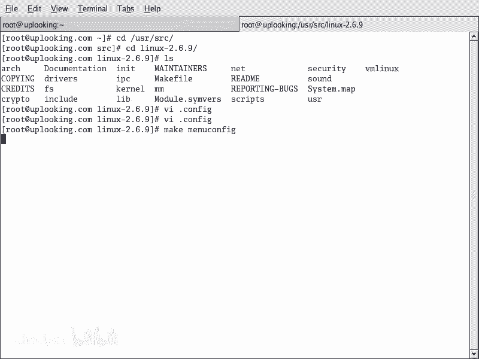
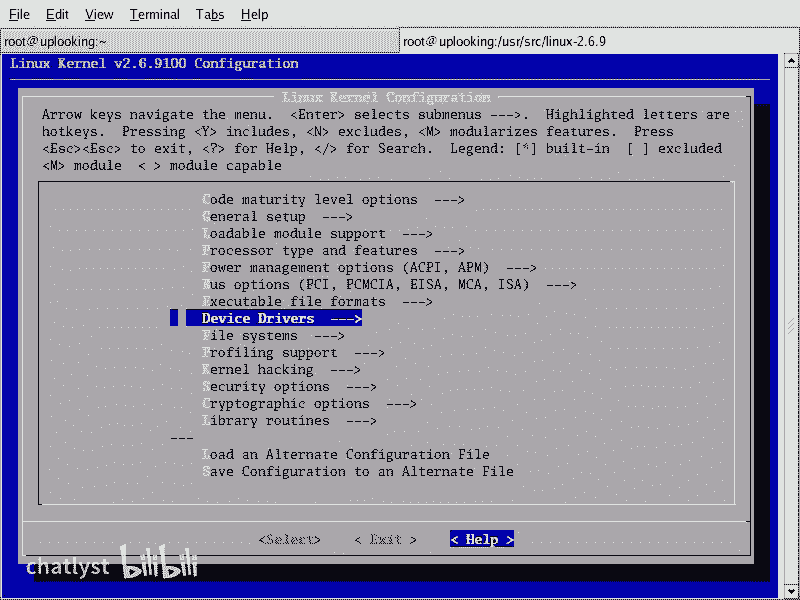
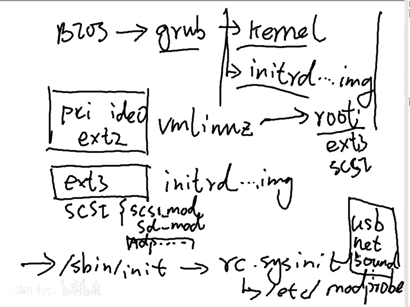
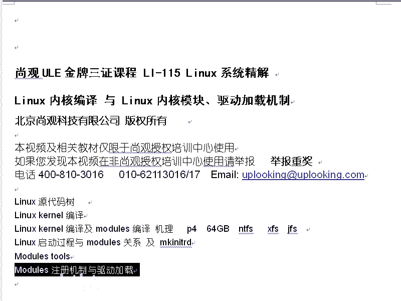
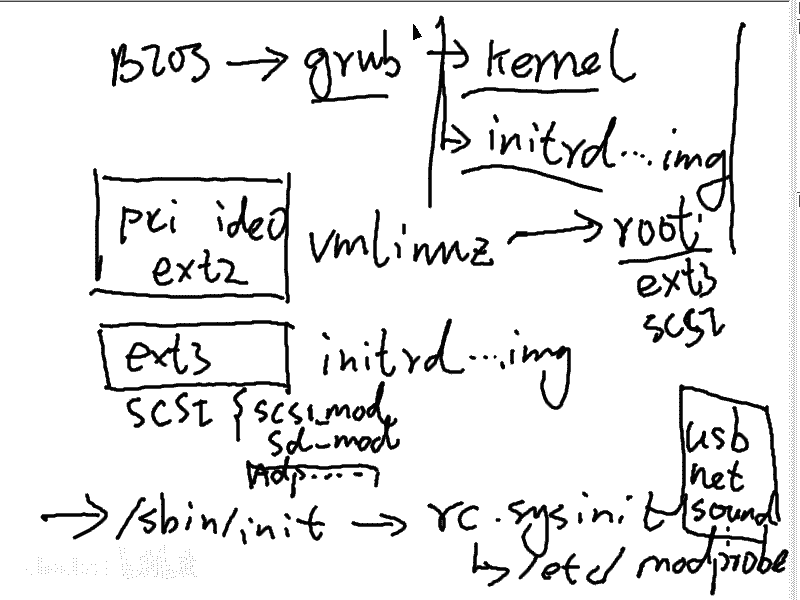
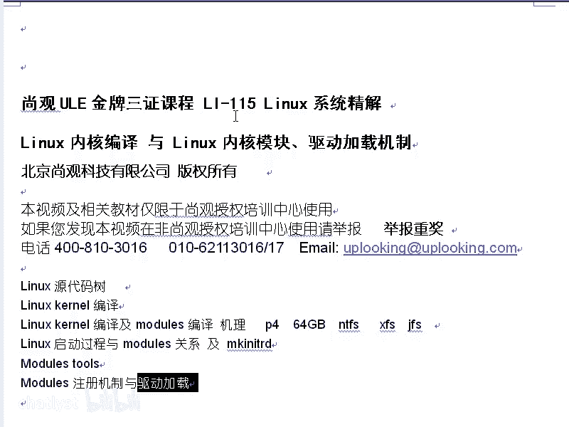
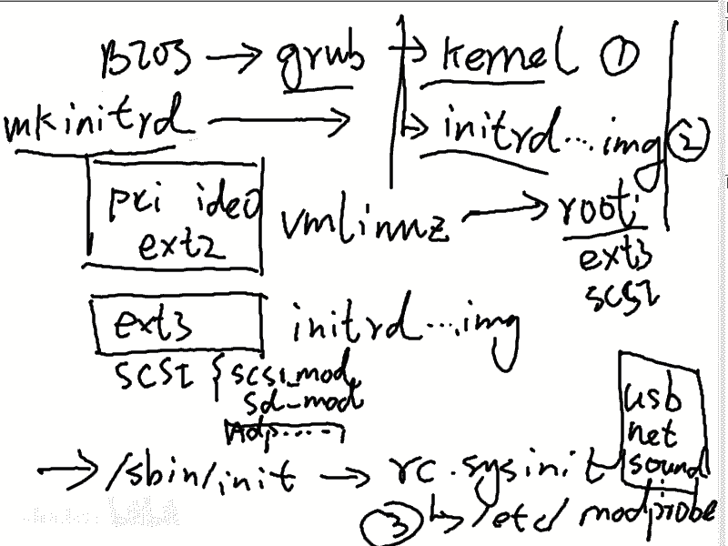
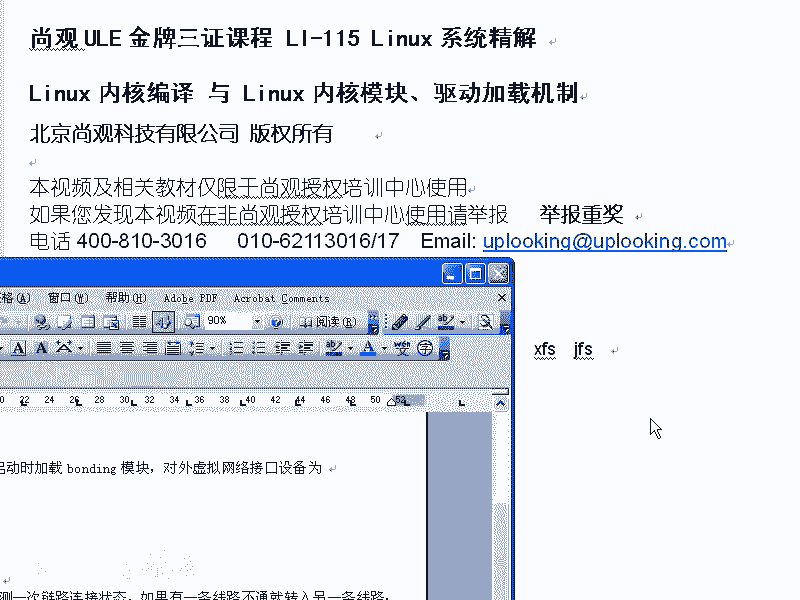
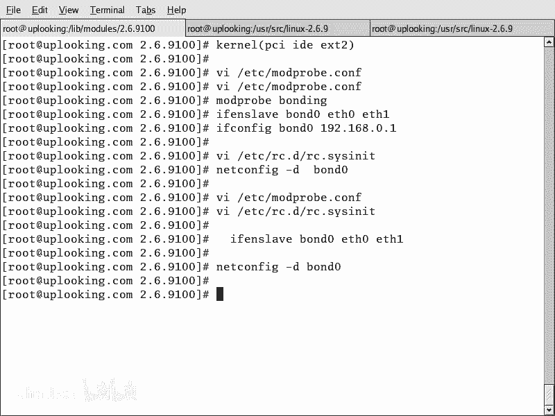

# RHCE教学视频2：P8：RH133-ULE115-9-modules

在本节课中，我们将要学习Linux下的驱动程序与内核模块。我们将了解模块的基本概念、管理工具、加载机制以及如何配置系统在启动时自动加载模块。

## 概述：Linux驱动程序与模块

上一节我们介绍了内核编译与模块的机理。本节中，我们来看看Linux下驱动程序的具体形式和管理方式。

Linux内核中的大部分驱动程序都是以模块的形式存在的。这与Windows系统有所不同。例如，在Windows中，显卡驱动是内核的一部分。但在Linux中，显卡驱动通常是X Window系统这个应用程序自带的驱动，并不属于内核模块。

而其他诸如USB驱动、声卡驱动、SCSI设备驱动、网卡驱动、文件系统驱动等，都属于内核模块，它们位于系统的模块目录中。

## 模块管理工具

要管理内核模块，我们需要使用一系列工具。这些工具由 `module-init-tools` 软件包提供。如果你想升级内核（例如在RHEL 9中使用2.6内核），通常需要先升级这套工具。

以下是核心的模块管理命令：

### 1. 列出已加载模块：`lsmod`
`lsmod` 命令用于列出当前已加载到内核中的所有模块。
```
lsmod
```
输出信息包括模块名、模块大小以及被其他模块或进程引用的次数。

### 2. 加载模块：`insmod` 与 `modprobe`
加载模块有两种方式。

*   **`insmod`**：需要指定模块文件的**完整路径**，且**不会自动解决依赖关系**。
    ```
    insmod /lib/modules/`uname -r`/kernel/drivers/xxx/yyy.ko
    ```

*   **`modprobe`**：只需指定模块名，工具会**自动解决依赖关系**并加载。
    ```
    modprobe yyy
    ```
    `modprobe` 的智能来源于其配置文件 `/lib/modules/$(uname -r)/modules.dep`，该文件记录了模块的位置和依赖信息。





### 3. 卸载模块：`rmmod` 与 `modprobe -r`
卸载模块也有两种对应方式。

*   **`rmmod`**：手动卸载指定模块，不处理依赖。
    ```
    rmmod yyy
    ```

*   **`modprobe -r`**：智能卸载模块，会一并卸载依赖它的其他模块（如果不再被使用）。
    ```
    modprobe -r yyy
    ```

### 4. 查看模块信息：`modinfo`
`modinfo` 命令可以显示指定模块的详细信息，如许可证、描述、作者、版本以及依赖项。
```
modinfo yyy
```

### 5. 重建模块依赖关系：`depmod`
当你向模块目录中添加了新的模块文件（例如，自己编译的驱动）后，需要运行 `depmod` 来更新模块依赖关系文件（如 `modules.dep`）。
```
depmod
```
运行后，`modprobe` 才能找到并正确加载新模块。

## 模块的配置与自动加载

了解了基本命令后，我们来看看如何配置系统在启动时自动加载所需的模块。

系统启动后，会通过初始化脚本调用 `modprobe` 来加载模块。其配置文件的位置因系统版本而异：
*   RHEL 4 及之后版本：`/etc/modprobe.conf`
*   RHEL 3 及之前版本：`/etc/modules.conf`

### 配置文件详解
`/etc/modprobe.conf` 文件不仅用于指定要加载的模块，还能设置模块别名和加载参数。

以下是一个配置示例：
```
alias eth0 pcnet32
alias usb-controller uhci-hcd
alias snd-card-0 snd-intel8x0
options snd-card-0 index=0
```
*   **`alias`**：为模块定义一个别名。例如，系统会将设备 `eth0` 关联到 `pcnet32` 这个驱动模块。
*   **`options`**：向模块传递参数。例如，为声卡驱动 `snd-intel8x0` 设置索引号为0。

通过编辑此文件，你可以轻松管理多块网卡（为其指定不同的eth名称）或调整硬件驱动参数。

## 驱动加载的完整流程

现在，让我们将模块加载放到系统启动的完整流程中来看。Linux驱动主要在三个时机被加载：

1.  **内核镜像 (vmlinuz) 中**：包含最核心、启动所必需的驱动，如PCI总线、基础磁盘和文件系统驱动。
2.  **初始内存磁盘 (initrd) 中**：包含挂载根文件系统所必需的驱动，例如SCSI卡驱动、RAID卡驱动或特定的文件系统驱动（如ext3）。可以使用 `mkinitrd` 命令将新驱动加入 initrd 镜像。
3.  **系统初始化脚本中**：通过 `/etc/modprobe.conf` 配置文件加载其他非启动必需的驱动，如网卡、声卡、USB控制器等。

这个流程确保了系统能够从启动到完全运行，逐步加载所有必要的硬件支持。

## 实战示例：配置双网卡绑定 (Bonding)

最后，我们通过一个实际案例来巩固所学知识：配置双网卡绑定以实现网络负载均衡或冗余。







**目标**：将 `eth0` 和 `eth1` 两块网卡绑定为逻辑网卡 `bond0`。



**操作步骤**：

1.  **编辑模块配置文件**，添加 bonding 模块配置：
    ```
    vi /etc/modprobe.conf
    ```
    添加以下内容：
    ```
    alias bond0 bonding
    options bond0 miimon=100 mode=0
    ```
    *   `miimon=100`：每100毫秒检查一次链路状态。
    *   `mode=0`：负载均衡模式（round-robin）。`mode=1` 为主备模式（active-backup）。



2.  **加载 bonding 模块**：
    ```
    modprobe bonding
    ```

3.  **配置网络脚本**（以RHEL为例）：
    编辑 `/etc/sysconfig/network-scripts/ifcfg-bond0`，配置IP地址等信息。
    编辑 `/etc/sysconfig/network-scripts/ifcfg-eth0` 和 `ifcfg-eth1`，确保它们包含 `MASTER=bond0` 和 `SLAVE=yes` 配置。

4.  **重启网络服务**：
    ```
    service network restart
    ```

现在，`bond0` 就作为一块逻辑网卡工作，根据设定的模式提供带宽叠加或故障转移功能。



## 总结

本节课中我们一起学习了Linux内核模块的核心知识。我们首先区分了Linux中显卡驱动与其他内核模块驱动的不同。然后，我们掌握了 `lsmod`、`insmod`/`modprobe`、`rmmod`、`modinfo` 和 `depmod` 这一系列模块管理工具的使用。接着，我们深入了解了通过 `/etc/modprobe.conf` 文件配置模块别名和参数的方法，并梳理了驱动在系统启动流程中的加载时机。最后，通过双网卡绑定的实战示例，将理论知识应用于实际配置中。



**课后作业**：
1.  在网上查找一种声卡在Linux下的安装文档，并尝试安装。
2.  查找一种显卡（如NVIDIA或AMD）在Linux下的驱动安装文档，并尝试安装。
3.  练习使用本节课介绍的所有模块管理命令。