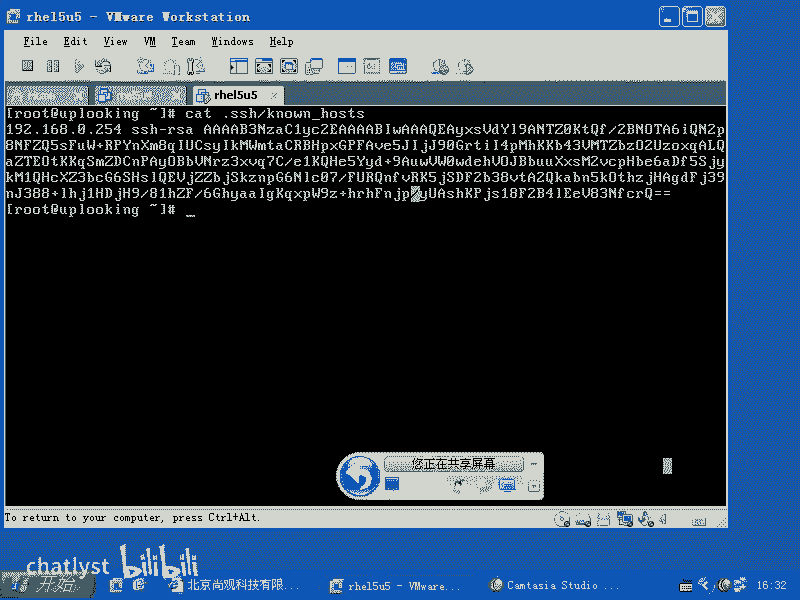
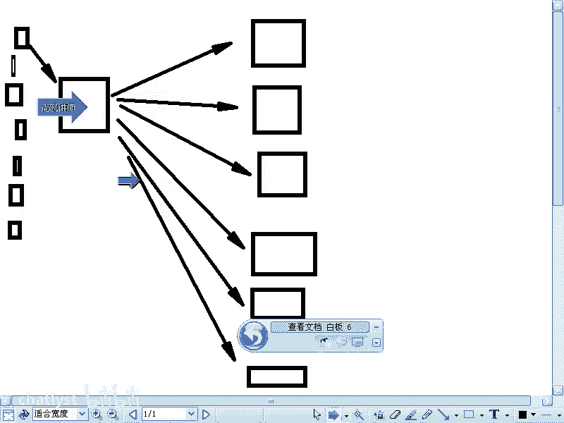
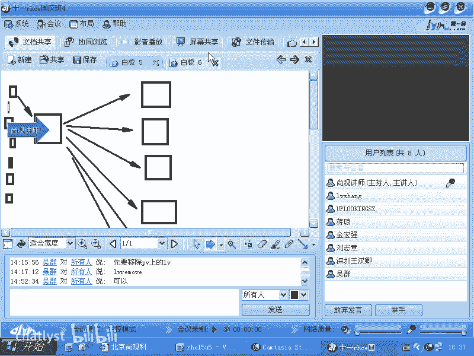
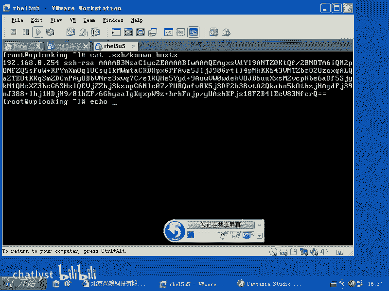
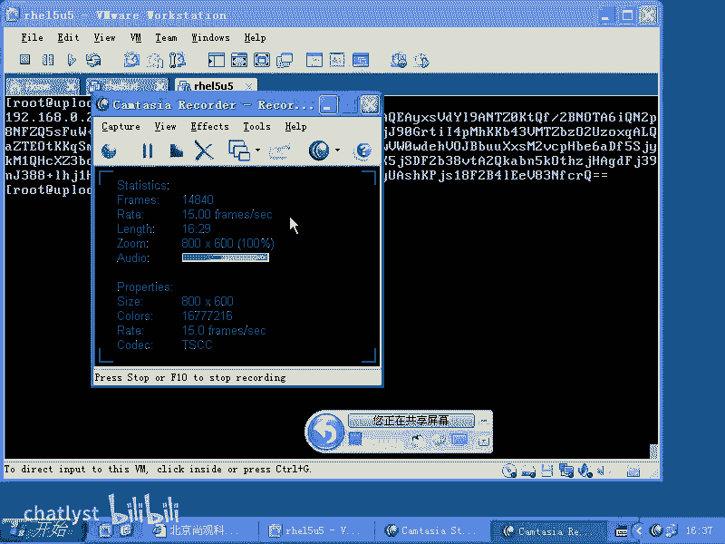
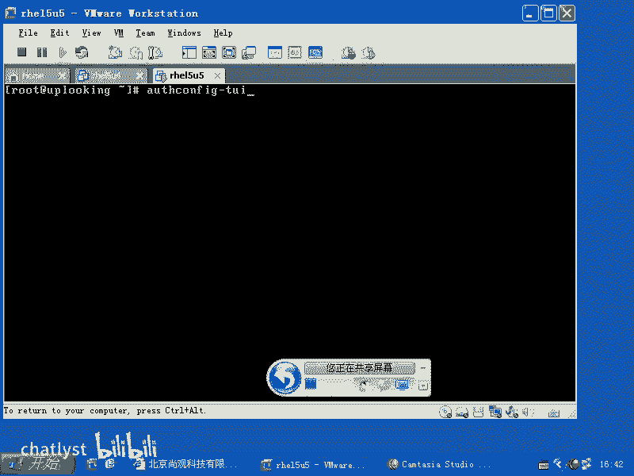
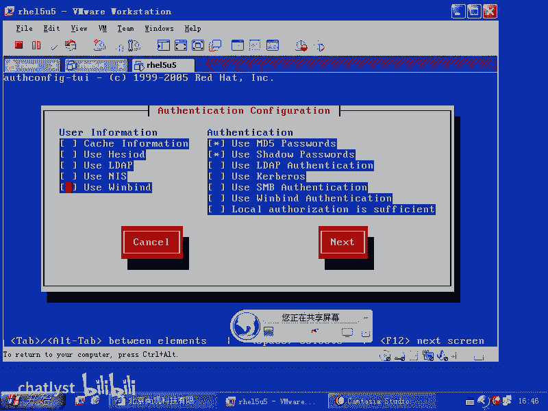
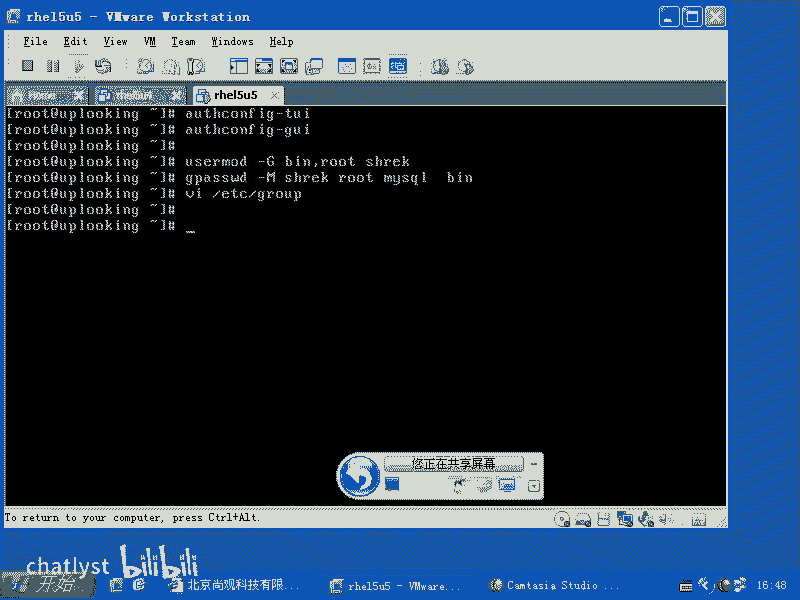

# RHCE教学视频2 - P9：RH133-ULE115-10-1-user command shadow authconfig - chatlyst - BV1PJ411D7LB

我们来看一下。现在如果要是我们。把03单部分讲完以后啊，就是我们的这个最基础的课程讲完以后，大家可能知道基本的用户的添加删除等等这些命令是不是？但是我们常见的这种呃通常的通用的这种做法是什么？

就是说我们在公司里面怎么去维护这些呃这些这个用户的这个比方说账户啊，然后呢密码啊等等，这些我们该怎么样去维护呢？就是我们接下来的话呢要给大家讲的啊，也就是说在公司里面。

我们的话呢怎么样去营造一个公司里面可能用到的lininux的环境。那么在lininux的这个用户管理这个地方，我们要更深入一层啊，我们原来给大家说过。

我们的lininux里面的用户主要是放在四个文件里面，是不是？他做的是不是？然后呢ETC下的。山头是不是？还有呢ETC下的什么呃group是不是？还有ETC下的什么G shadow。这样的几个文件。

如果要是你想改password的这个属性，那么是用user mode去改，是不是它常见的参数有什么大呃，就是user mode杠杠大G，是不是？呃，然后呢可以把它指定到多个组，是不是？哎，不对。

这个是改这个group文件了，是不是user mode。然后呢，还有就是user add什么user DEL是吧？然后它有关组的话呢，就是group mode是吧？group。Add。然后呢。

 growth。DEL然后呢，password是改什么用户的密码，是不是Gpaword是改组的密码，是不是？但是组的密码一般没人用。那我们用这个G passwordsword主要是用来做什么呢？杠M。

然后呢，我们把多个用户加到一个组去。是吧这是我们原来给大家说过的，还有的话呢就是用。CHAGE然后呢，CHAGE他可以给某一个用户让他的话呢去设定他的账户的期限。就是账户他能比方说有效期有多长时间啊。

有效期多长时间的话呢来提醒你什么时候的话呢，这个账户就被什么禁用掉了。也就是说实际上本质上讲，CHAGE它就是在改筛的文件。他是在改筛le文件，但是呢我们仔细看一眼筛道文件。筛le文件的话呢。

在HC考试的时候，它会考到一个什么呢？就过期这个账户怎么样过期的时候呃，怎么什么时候过期，也就是只要是在什么呢？最后的一个两个。冒号之间的话呢，加上一个什么一是吧？这个时候就表示。

1970年1月1日这个账号就过期了。啊，我们看一下这个账这个这一行的结构。首先的话呢是登录名，是不是接着是它的密码，对不对？接着是它的什么呢？它的这个时间啊，这是什么时间呢？账号创建的时间。

就账号创建时间不是应该是2010年什么什么时间吗？但是呢它这个地方的时间是什么？是从1970年1月1日就叫做unix元年，是不是嗯啊，这个时间的话呢开始。所以纪元的话呢。

你像我们公元什么什么是耶稣什么耶稣应该是复活那天是吧？是不是复活那天？算了，就是说这个的话呢说unix什么诞生的那一天，就是1970年1月1日开始，到今天有多少天？啊，到今天有多少天？

这边的话呢是说用户的话呢，这个密码啊，这个密码一这不是我刚才说错了，就是说不是用户的创建时间，而是这个密码的创建时间。也就是说当你的这个密码设定了以后。😊，呃。哎，是创建时间。这个会不会变呢？

我看一下啊。这样吧，我们来试一下。我们看一眼啊，看这最后的两个值一样不一样啊，不一样，还真的是密码的创建时间。那么后面的零是代表什么呢？就是说密码创建了以后啊，这个账户的话呢，多长时间？就是呃。

再次更改这密码的最短的使用历史是多少？也就是说我可以随时我可以再次更改。是吧最短历史。那么后面这个地方的话呢，是密码的什么最长历史。也就是说我如果把它改成9，那就是我9天之后必须得改再次改密码。

要不然这个密码就失效了。所以这三个时间是一伙儿的，看出来没有？这三个时间是一伙的。啊，也就是说密码创建了以后，多长时间之能再能再次能更改密码。0就是随时能再次更改密码是吧？99999。你算一下。

如果你活100岁的话，100乘以365是不是？那就是3万多天是吧？也就说在你有生之年啊，基本上活三个来回是吧？然后呢，这个密码都够用了，实际上就是用吧，密码永不过期，对不对？这三个时间是一伙的是吧？

然后这个期的话是密码的话呢，多长时间啊，就是过期前多长时间提醒你。😊，7天啊，提醒你。后面这个地方的话呢，最后的这两冒号的话呢，它是什么？它是空的，空的表示说什么密码的到期的日期是什么？什么时候？

到期的日期的是什么时候？也就是说什么时候到期？如果我写一的话，就是1970年1月1日是吧？如果二的话，1970年1月2号3的话，我就不说了是吧？所以这个时间的话，你说哎，我想这个的话设置成197啊。

不是2010年的12月是吧？我开始搬脚趾头70年1月1日，1月20第这是不是就很难办，是吧？所以这个时间的话呢，你最好就用CHAJE来帮你设。😊，知道吧？他设置完以后，就是说到那个时间这个账户就怎么样？

就禁止运行禁止登录了。所以以前的话呢，我们有个troub数ing啊，我这是说以前的troub数ing，他就自己的话就弄一个什么，弄一个在后面的话，两个冒号之间加个一说什么呢？呃。

197年1月1号这个账号就被禁用了。然后呢，你肯定这个账号登录不进来了。是不是？啊，所以这个地方的话呢是这个用啊，那你说老师你嘚过半千，我真记不住，是不是？😊，怎么整呢？慢。5。shadow啊。

看一看就明白了。所以的话呢这边每一块的话，他都告诉你是不是最后一个地方是什么呢？是保留区啊保留区。这个地方的话呢，就是这个是197年1月1日之后的话呢，这个多长时间这个账户就被禁用了是吧？

这是倒数第二个位置是吧？他是用冒号隔开的是吧？嗯他做的这个命令，是不是我们冒号隔开是7个位置，我们都很容易记得住，是不是什么用户名啊、密码啊、UID啊、TID是不是逐目录啊？😊。

等等这些东西一切全都下来，也可以通过这种方式的话去寻求到帮助。所以他呢我们。CHAGE就是帮你这个忙的，他可以免于让你去计算，搬着脚趾头去算什么这个2010年的什么这个那几月几号是unix的第多少天啊。

他就不用去计算这个了，明白吧？其实你本质上想一想啊，为什么咱们会有天这个概念，是因为太阳是吧？升起又落下，是不是？然后呢，这样的太阳刚好转，就是咱们咱们这个地球自转一周是吧？为什么咱们要有年这个概念。

是因为地球围绕太阳转一年是吧？咱们的话刚好什么种庄稼呀，或者说去什么旅游啊，或者说穿什么衣服啊，都是一周。但是计算机它要穿衣服吗？😊，计算机又不装种庄稼是吧，他凭什么要以一年作为这个单位呢？是不是？

他不用管，所以的话他就是天了，这就是他特别就是说可能简化的地方，它不用不愿意去计算这个年啊，这unix time所以CHAJE是做这个用。那么我们有一个文件啊，这个文件大家一定要注意。

就是ETC下面的什么呢？login点DEFS这个文件里面规定的是你默认创建出来的账号，它有多少就是像它的有效期限啊，它的等等这些东西，这是你创建出来的默认的这个文件啊，默认的用户。直接回车创建出来以后。

它的这个文件里面应该怎么样去写啊，就是在那个sder文件里面怎么去写。你看到密码的最大的硬历史是99999。就是说你300多年是吧？基本上跟乌龟一样长寿了是吧？这个时候的话呢，你的密码都有效啊。

为什么这么长，是因为在这里面写了，你把它改成什么？密码的最长时间30天有很多公司的话呢，非常强制的规定，30天必须得更改密码，一个月的话呢，必须更改密码，他们的密码是怎么样来的？

通过password的命令来动态的来改。😊，哈索尔的命令来动他的改啊，怎么回事呢？就是说我。我给大家看一眼这个啊。嗯。看一下这个文件。这边的话呢是生成的大量的密钥，是不是？这个文件的话呢。

这里面的这些字符的话呢，有没有规律啊？可能还是不够复杂是吧？但是类似这样的啊，就比方说我去生成了一串这种随机的这种文字啊，就是有些大公司就是这样做的。他们的话呢会有一个大的文件。

这个文件的话呢是通过某一些什么这种算法得出的是吧？夸从中间哪个地方到哪个地方的话呢，cast下来，就是16个字符或者32个字符。然后呢，每一行32个字符，每一行32个字符，全部都把它放成一个什么呢？

把它放到一个文件里面去。每30天用脚本自动的把那个密码进行修改。明白吧？这个字符的话呢，不是一个你设定的值，而是从一个随机数文件里面怎么样cut出来的类似这种值明白吧？这个文件的话呢，有比方说有12行。

那就是一年的密码，这12个密码。大公司的话管是这么管啊。

我给大家看一下。大公司管的话是这样管。他们的话呢，你想一个公司里面，他不可能只有一个管理人员，是不是？他可能有一堆。结果的话呢，突然这个公司的数据库文件被别人偷走了。你们这些人谁干的？😡。

他说不是我那个也不是我疑点都是无辜的样子是吧？结果的话呢，这个你要说有个公外面有个公司就拿到就有个私服，就是他们公司的这个就是说这个服务器代码是吧，就被泄露去，谁干嘛？谁干的？我找责任人是吧。

怎么找都是如才。😡，是不是那么我用普通账号去登录。我用普通账号去登录。那我做如他做的事情，我肯定要做不了是吧？我还要去转换一下，你转换的话就没影了。他说他干的他他干的两个人打起来了，是不是？

后来的话呢是怎么样？就是这个公司的话都是这样，我们找一台服务器，这台服务器做什么呢？做登录服务器。也就是说很多的这个人的话呢，他们比方说有各种各样的什么这个终端是吧？有笔记本有台式机是吧？他们的话呢。

不允许直接连什么呢？真正的服务器，我们真正的服务器有很多是不是？这些真正的服务器的话呢，都设置好密码，这些密码的话呢，是一个月1变，一个月1变，大约是16位到32位随机数啊，一个月1变。

你可以用需要脚本的话呢来给它自动更改密码啊，然后呢，我们看通过大家所有人的话呢，都不允许直接访问这些机器。这些机器的话呢，只对这个机器的话呢进行开放，明白吧？我可以用SSH。

我说SSH只允许这个IP去访问其他IP都不允许，是不是？都不允许。😊，然后呢，我在这台机器上的话呢，给每个用户的话呢创建一个账号。这台机器的话呢给每个用户创创建一个账号。

这些人的话呢可以通过这台机器的话呢访问。这些机器，但是呢你都是以自己的用户名登录的。那这台机器的如的权限我是不给这些人的，明白吧？就是说这台机器。😡，这台机器的话呢是没有什么不能给你如特的账号。

如此账号的话呢，这台机器是有一个更高的管理员。这个管理员的话呢进行审核，它会打开一个叫做audit服务AUTI哎auDIT是吧？auit。的再加个D是吧？那么这样类似的服务，这是一个审计服务。

这个审计服务它呢，基本上你运行的所有命令键盘输入全部都可以记录下来。全部都可以记住去。那么你作为一个什么呢？比后sck账号从这儿返问到这边是吧，你是以sck身份登录的是吧？

但是你可以管理员的身份是不是登录这些机器啊？😊，是不是？但是呢你在这边输入的东西全部都会被这台机器记录下来。😊，记录下来以后，哎，你为什么要把公司的代码是吧？copy到一个软盘上。

呃要copy到一个U环上。为什么你做这步是用于干什么是吧？好，就是你小子，然后把你揪到监狱里面去，这很正常，这就抓到什么元凶了，是不是？所以这个时候的话呢，我们这个大公司啊非常一定要非常注意。

你知道买一套这种公司的这种后台是吧？就是这个网游的后台要花多少钱？他们卖啊，我记得盛大抓盛大那个就是征途是吧，他们抓几个前员工啊，我记得那个整个的故事写的还跌宕起伏的。最后的话这些人的话是卖了。

就是网上的话有啊，就是他们发出来的这个文档，就是警告这个就是一些人的话不要乱搞是吧？你说警察的话抓到以后是第一个人卖了20万，第二个人拿到以后的话，哎，第一个人卖了十几万。第二人转手以后卖了20多万。

😊，总之的话呢，他还卖了很多，就是把这个代码一卖出去以后，这个代码就可以做什么呢？做私服。啊，代码就做私服，做完私服以后的话呢，他收的钱要比什么普通的这个就是征途本身收的话呢要便宜很多是吧？

但是提供的还是相同的好玩这个感觉。所以这就是什么呢？这就是公司对这个代码或者数据的安全的话呢，要非常注意。一般的公司都是这样去管理，明白了吗？明白了啊，好。那么你是不是需要设定？那么如果要是这样的话。

你是不是需要设定每台机器上的这个密码是吧，最长的时间应该多长时间啊？强制30天是不是？30天之后的话，这个密码就失效了，是不是？密码就失效了。那么我要用在这个地方，比方说自动SS过去去改他们的密码。😊。

自动SS过去去改它的密码，我是不是可以用SSH呃SS过去以后的话呢，就是说输入命令，是不是？是吧或者说我直接把他坐的同步过去就完事了。啊，不是筛的文件同步过去就完事。可可以啊。我只要有如此权限。

我什么不能干。是吧根本就不用password的这个命令去改是吧？那如果要是你想去用pasword的命令去改的话，行不行啊？

啊。怎么去改？

那就是呃。Ele是吧。

ele echole什么呢？ele呃。诶。嗯。啊，不是管道。是吧。改掉了。我把shack的密码改成什么shack是吧？然后稍123也改掉了，这个事脚本是不是直接这样写？对吧。然后呢。

你说一脚把我踢开是吧是这么笨是吧？他做的直接加那个用户名不就改掉了吗，对吧？但是那个是要求你什么交互，是不是你半夜3点钟爬起来，然后呢，每天啊今天加班，今天晚上我要改20个机器的密码是吧？那真是太冤了。

所以这个命令的话呢，每天晚上的话呢去执行一下就OK是吧？所以的话这个地方你像这个密码的话呢，你就可以从指定文件当中去获取，是不是？比方让我这样的cut。😊，cut，然后呢，cut杠呃杠C是吧。

第二个字符到第什么呢？第24个字符。呃，第第18个字符，我cut出哎，不对。17个字符cut出16个字符来点SI支目录下的KNO啊，knowho唉。啊，他这是一行他这是一行。咦。是吧看得出这段字符来。

然后我把这串，我把这个命令放在哪儿？加反引号放到这儿。或者放在这儿。是不是啊？它是不是就可以自动去从一个文件里面截出密码来，然后把它怎么样。把它就是全部都改掉，是不是？很方便吗？嗯，好。

这边的话呢就是我们标准的改密码。然后呢，基本的一般的这个呃基本的这个公司里面。那么你要想针对这个呃登录或者登录的这个问题的话呢，进行一些限定的话，那么就可能采用这种方式啊。图的话呢给大家就画画完了。

还有什么问题没有？还有什么问题没有？那这种方式的话呢，是一些就是管理这个机器啊，是一个服务器。然后呢，不是用在公司当中啊，不是用在公司的这个人员的机器上。你比方说我是一个呃。比方说一个外企。

这个外企的话呢，他希望做到什么呢？呃，德国总部他有一个系统管理员，他可以控制全全世界内1000多号人，他们能做什么，不能做什么，能做什么，不能做什么。这套东西的话呢。

就是微软的server的最大的竞争优势，明白吧？他的这个东西的话呢，首先客户端用的人非常多。但是呢在企业那端的话呢，包括它的exchange，包括他的什么，包括他的这个呃AD是吧？活动目录。

还有包括他的什么的那种呃。就是说联动，比方说你创建一个账号以后，它的email就自动出现了是吧？还有呢这个账号的话呢，调动到其他部门了，我就把它移动过去。这些操作上都非常容易。

一个人的话呢可以管理几百个计算机。然后呢，你们都不允许用自己的U盘，都不允许用自己的什么这个移动硬盘是吧？你们都不能去安装硬件，我全都给你统一配好。我现在的话呢，有一个新的office的补丁出来的时候。

我能立刻实施到大家机器上去。所以在这种。😊，客户端场合微软的话呢是毫无疑问，非常强势的对吧？它肯定要比linux要强太多。但是lininux的话只不过是没有任何的一个公司的话，从中能得到太大的收益。

但是lininux有太多的手段去实现相同的功能。那么你像它支持的这种集中用户管理的手段的话，特别多啊，我们普通话用的是什么呢？大家可以看一下啊，你输入一个什么off。config是吧？

us config，然后一回车以后，它会自动判断你的这个就是说你的这个呃终端啊。那么你如果要是用TY的话，那你输入个TY直接回车以后，你看它可以支持哪些方式的话去远程远程验证呢？你比方说呃。

我想去用Ldap协议的话进行验证。Ldap协议的话呢就是微软的。呃，微软的那个AD活动目录对外提供的这个服务啊Ld，然后呢还可以去用curs进行验证。

还可以用windows的这个就是就是平时windows互相之间的这种方法进行验证。还可以用什么呢？win band啊验证。那么我们一般的话呢用的在linux里面的话。

Ldap NISNIS可以说是它的这个原生的这个东西。就是说在unix用的。非常多的东西。然后呢，我这边点击什么呢？Next。next的选择域，比方说NIS里边的话呢，它有域啊，就是有域域的话呢。

比方说叫uplicing点com。然后呢，我的这个server的名字是192。168。0。254。还记得我们给大家讲介绍过那个auto FS吧。

auto FSauto FS呢它就可以呃就是auto FS的话，它就可以把这个人的主目录是不是给它自动去mount过来是吧？但是呢我们当时只是mount他的主目录是吧？那他的账号信息是从哪来呢？

你说我本机上是不是有一个呃password文件，是不是本机上pasword文件，没有我创建出来那个账号，没有在服务器上，假如说我在我的这个教师机上创建了12个账号，这个12个账号能在你们机上登录吗？

登不了，为什么呢？因为你们本地的password文件是不是没有这个账号啊？但是呢我可以作为我我可以作为NIS的什么这个服务器端，我可以把我的这个账号的话呢共享给你们。然后你们的话作为我的客户端是吧？

从我这边接收账号是不是接收账号以后，我的账号传递过去的。主目录是什么呢？R home下的sck是吧？你们又配置好了all to后凹 to FS是吧？

au to FS就会自动把我机器上的这个主目录也共享过去。也就是说这样就做到了什么呢？你们在你们的记上用我的账号来登录，同时拥有什么呢？他们的在我记上这个准路NFS共享出去的。没要了没有。

所以的话呢这样去填写就OK了。这个奥FS啊啊奥FS。啊，out out卡fi啊 out卡fi啊。Yeah。那么你当然可以什么呢？避免使用什么MD5的密码，不用MD5的密码，你的密码的话呢。

就是以另外的编码的方式去保存的，其他的编码方式保存的。但是呢原来用MD5写的这个密码，它是没有办法找回来的。我原来比方设置123，它用MD5已经转换了是吧？现在说我不用MD5了。

我用另外一种格式来加密存储。结果的话呢，你那你得要给它重新给他什么密码吧。你已经用MD5加密过的密码，他是不是不知道原本是什么，所以它话原本的密码是不不会动的。那么用shaow嘛？如果不用shaow。

那么所有shale文件里面的密码的话，就会全部跑到什么paword的文件里面去。对吧他搜入软件里面去，然后这边的话呢就是呃这几项选项啊，你们可以自己看一下。实际上的话呢，我觉得就是说你改这两项的话呢。

没什么意义。一般来说的话呢，我们就是说用NIS或者说Ldap的话呢，去集中管理账号，集中管理账号，比方把它的主目录啊，把它的这个用户名密码全部都储存起来。然后你可以用这种方式上去管理。比方说用Ld是吧？

这种方式这个的话呢就是out config啊ous斯 config。我们运行的是什么？al斯confi杠TUY在老式的版本当中的话，就直接是al斯fi。如果要是在图形界面下的话。

那你们觉得应该用什么命令？奥斯康费港杠。GY是不是？GUI这就是图形界面下运行的命令，对吧？这是用远程的话呢去管理你的账号啊，远程管理你账号。那么大家的话呢，如果要是参加考试之前，应该问自己几个问题。

你会不会把用户加入到组，你会不会创建组，你会不会把用户加入到组，你会不会把什么呃一个11呃几个用户加入到一个组是吧？这个用用。用不用费太多的脑筋啊？VI一下group全都搞定是吧？当然你可以用什么呢？

呃把一个用户指定到多个组，用什么命令。是吧嗯如果要是把多个用户指定到一个组。加大什么组呢？病组是不是？是不是？很简单吧。然后呢，你最后的话再去VIETC下的group来看一下，对不对？

我们在那在讲这种场合。如果要想集中控制你的账户的时候，你可以那样方式去控控制，是不是？呃，就是刚才奥斯卡 fake的话呢，去把自己作为一个什么NS的服务器的这个客户端，是不是？做完了以后的话。

你从那边可以获得这些数据，比方说组的数据啊，还有用户的数据，是不是？接下来的话呢，我们假如说平时在一块工作，咱们现在是同事是吧？咱们现在的同事，那么我们现在的话呢。

有一台机器集中管理着大家的用户名和密码，集中的管理用户密码，你们现在登录了，一般的话呢，你接下来会做一些什么事情。😊，你在你的linux系统上，你会收发email，是不是你会看网页，是不是？

还有最重要的就是说同事之间互相协作是吧哎。😊，把你的那个文件共享给我一份，把你那个代码给我一份，把你那个代码放到服务器上去，是不是这时候是不是需要用我们lininux来做细节的权限控制啊？对不对？

这时候lindowux里面的这个细节的权限控制的话呢，就需要我们再仔细琢磨一下，特别的繁琐。因为windows里面我们可以右击它是吧？其实windows里面的话呢也不像我们想象的那么简单啊。

OK我们先把这个前面的东西保存下。😊。

