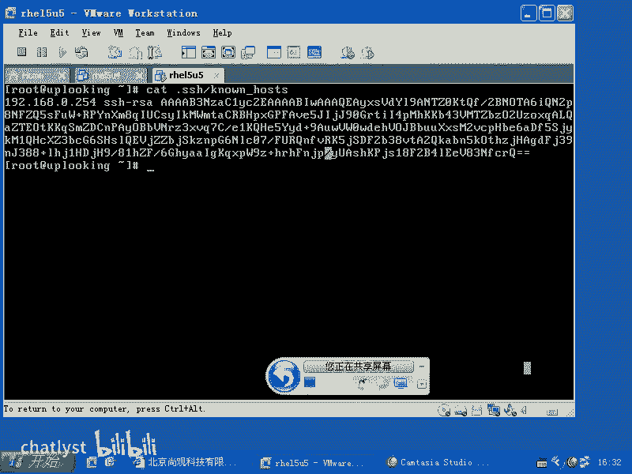
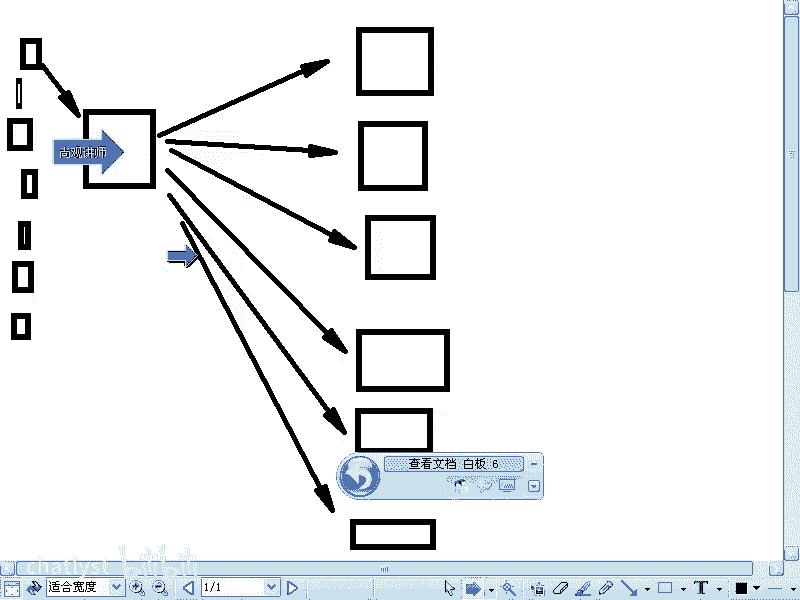
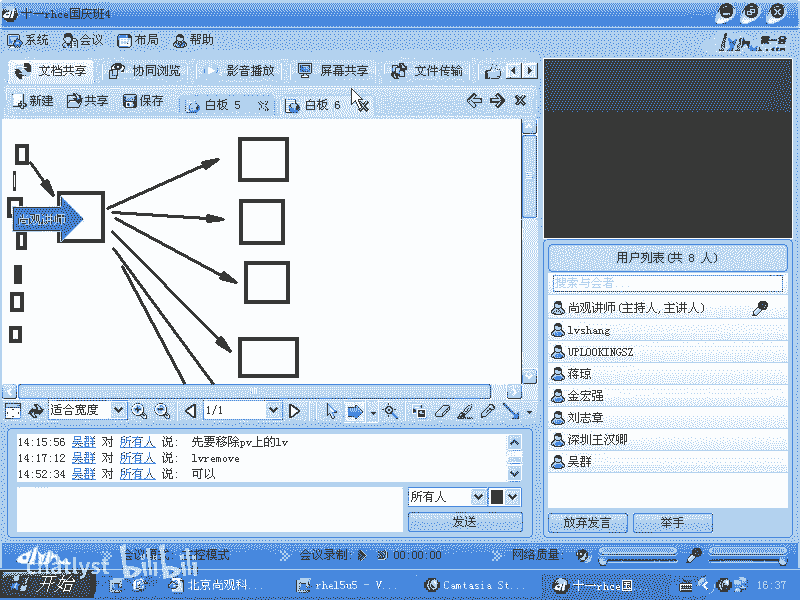
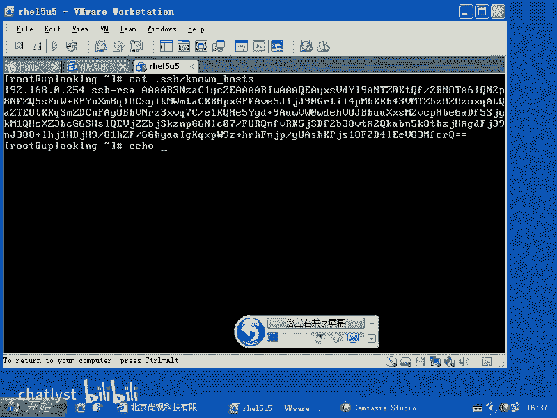
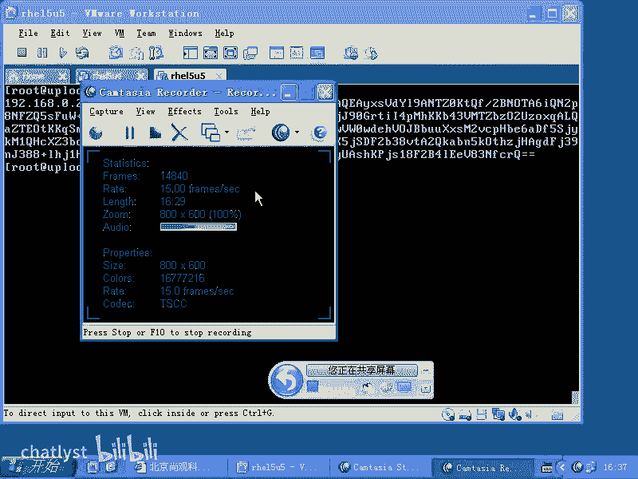
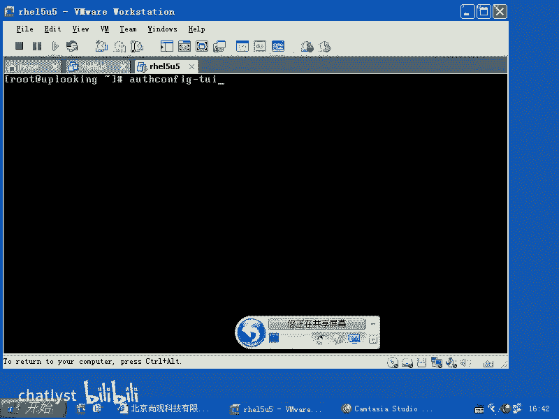
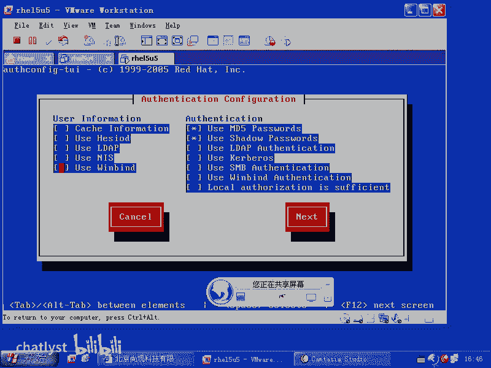
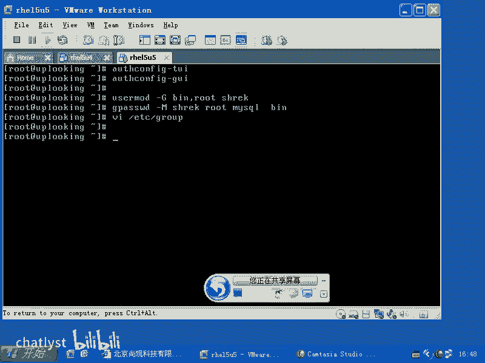

# RHCE教学视频2：P9：RH133-ULE115-10-1-用户命令、shadow文件与authconfig配置 🧑‍💻

在本节课中，我们将深入学习Linux用户管理的进阶知识。我们将探讨如何在实际公司环境中维护用户账户和密码，深入理解`/etc/shadow`文件的结构，并学习如何使用`authconfig`工具进行集中式用户认证管理。

## 用户管理基础回顾

上一节我们介绍了基本的用户和组管理命令。本节中，我们来看看这些命令在实际工作中的应用。

Linux系统中的用户信息主要存储在四个文件中：
*   `/etc/passwd`
*   `/etc/shadow`
*   `/etc/group`
*   `/etc/gshadow`

以下是常用的用户管理命令及其功能：
*   `usermod`：修改用户属性，例如使用 `usermod -G` 将用户添加到多个组。
*   `useradd` / `userdel`：添加或删除用户。
*   `groupmod` / `groupadd` / `groupdel`：修改、添加或删除组。
*   `passwd`：修改用户密码。
*   `gpasswd`：修改组密码，更常用的功能是使用 `gpasswd -M` 将多个用户添加到一个组。
*   `chage`：设置用户账户的期限，例如有效期和过期提醒。

## 深入理解 /etc/shadow 文件

`chage`命令本质上是在修改`/etc/shadow`文件。在RHCE考试中，可能会考察如何使账户过期，方法是在该文件最后一行的两个冒号之间添加数字“1”，这表示账户在1970年1月1日（Unix纪元）就已过期。

让我们仔细查看`/etc/shadow`文件的结构。每一行代表一个用户，由冒号分隔为多个字段：
```
username:encrypted_password:last_pwd_change:min_pwd_age:max_pwd_age:pwd_warn_period:inactive_period:expiration_date:reserved_field
```

以下是各字段的详细解释：
*   **登录名**：用户的登录名称。
*   **加密密码**：用户的加密密码。
*   **上次密码更改时间**：从1970年1月1日（Unix纪元）开始计算的天数。
*   **密码最短使用期限**：密码更改后，再次允许更改所需的最短天数。0表示随时可以更改。
*   **密码最长使用期限**：密码必须更改前的最大天数。例如，99999天意味着密码几乎永不过期。
*   **密码过期前警告期**：密码过期前多少天开始向用户发出警告，默认为7天。
*   **账户不活动期**：密码过期后，账户被完全禁用前的宽限天数。
*   **账户过期日期**：账户被禁用的具体日期（同样以Unix纪元天数表示）。如果设置为1，则表示1970年1月1日。
*   **保留字段**：留作未来使用。

`chage`命令的作用就是帮助管理员设置这些时间，而无需手动计算从1970年1月1日到目标日期的天数。



## 默认账户策略：/etc/login.defs

`/etc/login.defs`文件定义了创建新用户时的默认属性，这些值会写入`/etc/shadow`文件。

例如，该文件中定义了密码的最大有效期（`PASS_MAX_DAYS`），默认是99999天。许多公司出于安全考虑，会强制要求定期（如30天）更改密码。你可以修改此文件来强制执行此类策略。

## 企业级密码管理实践

在大公司中，密码管理通常更加严格和自动化。以下是常见的做法：



1.  **生成随机密码**：使用脚本从随机数文件中截取字符串（如16-32位字符）作为密码。
2.  **定期自动更改**：编写脚本，定期（如每30天）自动为所有服务器更改密码。
3.  **集中登录与审计**：设置一台专门的“跳板机”或“堡垒机”。所有运维人员必须先登录这台机器，再通过它访问后台服务器。跳板机本身不授予用户root权限，但会开启审计服务（如`auditd`），记录所有用户的操作命令和输入，实现操作可追溯，防止内部数据泄露。







例如，可以使用非交互式命令批量修改密码：
```bash
echo "new_password" | passwd --stdin username
```
或者通过脚本从密码文件中读取并设置：
```bash
echo "username:$(cut -c 2-17 /path/to/password_file)" | chpasswd
```

## 集中式用户认证：authconfig 工具

在拥有大量Linux服务器的企业环境中，手动同步用户账户效率低下。此时需要集中式用户认证。Linux支持多种协议，而`authconfig`（或`authconfig-tui`）是一个配置工具，用于设置系统使用哪种远程认证服务。

常见的集中认证方式包括：
*   **NIS**：传统的Unix网络信息服务。
*   **LDAP**：轻量级目录访问协议，微软的活动目录（AD）也支持此协议。
*   **Winbind**：用于集成Windows域认证。



配置NIS客户端的示例步骤：
1.  运行 `authconfig-tui` 命令。
2.  选择“User Information”和“Authentication”为NIS。
3.  指定NIS域名（如`example.com`）和服务器地址（如`192.168.0.254`）。

结合`autofs`服务，可以实现用户主目录的自动挂载。当用户通过NIS认证登录客户端机器时，`autofs`可以自动将其主目录（存储在NIS服务器上并通过NFS共享）挂载到本地。

图形界面下可以使用 `authconfig-gtk` 命令进行配置。

`authconfig`工具还可以配置密码的加密哈希算法（如MD5、SHA256/SHA512）。但请注意，更改加密方式不会对已存在的MD5哈希密码进行解密转换，用户下次更改密码时才会使用新算法。



## 权限控制的重要性

在团队协作环境中，集中认证解决了账户统一的问题。接下来，同事之间需要共享文件、协作开发代码。这就引出了Linux系统中精细的**文件权限控制**需求，这是保障系统安全和数据隔离的关键，我们将在后续课程中详细探讨。

---



本节课中我们一起学习了Linux用户管理的进阶内容。我们回顾了基础命令，深入剖析了`/etc/shadow`文件的结构和`chage`命令的用途，了解了企业环境中自动化、集中化的密码管理策略，并介绍了使用`authconfig`工具配置集中式认证（如NIS、LDAP）的方法。这些知识是构建安全、可维护的企业级Linux系统环境的基础。