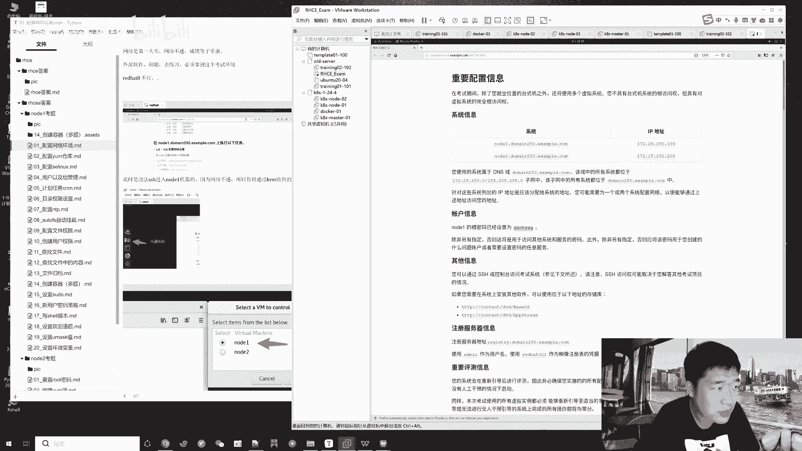
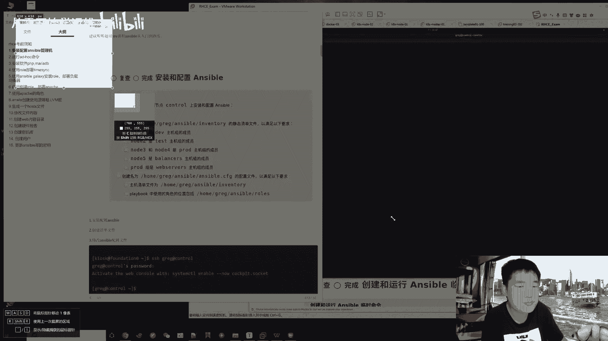
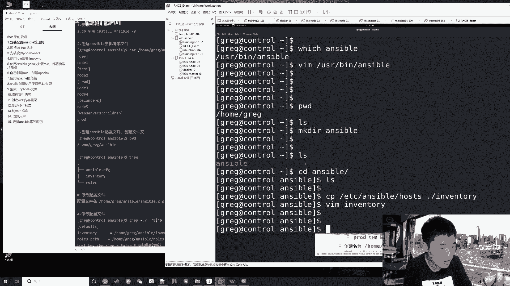
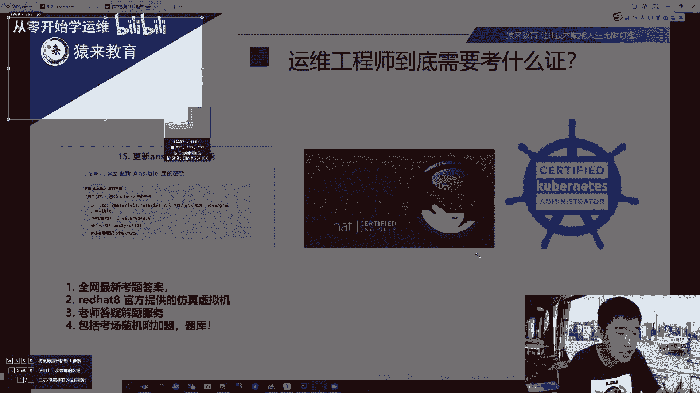

# RHCE红帽认证考前精细辅导教程，知识点+注意事项，学会必过！！ - P1 - 从零开始学运维 - BV19N411x7Av

还流着泪，我从远方赶来。

赴你一面之约，一痴迷留恋人间，我为她而狂野，我是这耀眼的瞬间，是划过天边的刹那火焰，我为你来看，我不顾一切，我将熄灭，永不能再回来，你那个运维，好久没见，你说话就在这里呀，惊鸿一般短暂，如夏花一样绚烂。

我是这耀眼的瞬间，是划过天边的刹那火焰，我为你来看，我不顾一切，我将熄灭，永不能再回来，不虚此行呀，不许自己量，惊鸿一般短暂，会放在你面前，我是这耀眼的瞬间，像划过天边的刹那火焰，我要你来爱我。

不顾一切，我将熄灭，永不能再回来，一路春光啊，一路荆棘啊，大头那惊鸿一发光芬种夏花一样绚烂，我这背景你你你就想看一个五角大楼，我都能给你，我都能给你整出来啊，我可以出现在任何地方啊。

是不是这回这个背景比之前牛逼多了是吧，之前的背景不行啊，放点书架是吧，现在的背景一看就很高大上啊，是的我看到处是阳光快乐，在城市上空飘扬，新世纪来得像梦一样格局啊，这就叫逼格，不逼格不能差是吧。

怀表还在转吗，你的旧皮鞋还能穿吗，只有一未来牌香烟，你不想尝尝吗，明天一早，我猜阳光会好，我要把自己打扫，把破旧的全部卖掉哦，这样多好，就让它们代替我来，有什么问题，剪新发型呀，轻松一下。

windows98打扮漂亮，18岁是天堂，我们的生活甜得像糖，穿新衣吧，剪新发型呀，轻一下，过了周末就是中秋，过了中秋就是国庆还厉害很厉害，但是咱们中秋干啥呢，国庆干啥呢啊，六啊，欢迎各位谢同学啊。

身边的太阳，哎呀，刷题刷题把自己打扫，今天实战还行吧，今天没啥实战，兄弟啊，说实话啊，因为我今天就是带着各位来刷题的，带着各位想考证，考个红帽的这个红帽的工程师证书嘛，有这个证书的话。

叫吴墨还是比较好找是吧，哎就是有有帮助吧是吧，所以今天主要是抓紧啊，兄弟们，windows笑话打扮漂亮，18岁是天堂，我们的生活天天教堂和穿新衣吧，剪新发型呀，轻松一下windows98。

你要不再会有痛，我们的未来该有多恐惧，你你没有要求你你你你只要去报考就行了，报考的话只要你考试能过去，线下考试嘛，就是玩儿研究的很基础嘛，非常简单，一会我会非常详细的聊一聊这个事儿能干啥。

你为什么要考啊，还要怎么考啊，没有要求，就是你你只要是做运维的，或者说你LINUX基础不太不太行，想学点LINUX基础，学点answer自动化运维啊，想在你的简历上加点还这个亮点是吧，那你要是个大学生。

你有没有工作过啊，你又没有实习过，你去找工作，你怎么证明你懂技术呢是吧，那你考个证，那说明你考了这个美国人推出的专业的LINUX，操作系统的一个运维操作啊，就是trouble shooting。

故障排查，能把这些题做出来，那你基本功还是可以的，所以没有要求，是你想考就能考在我身上每个角落，因为那只能通过面聊对吧，因为啊只能说人与人的沟通面聊吧，我知道你会还是不会因为你空口无凭嘛对吧。

你说你学习能力强啊，你连个证书都没有，那，啊对呀，你看你要是考那个什么教师资格证，什么一建二建考什么消什么，其他行业的会有很多的限制，提这个证没有限制，你找我们只会用证书含金量，待会我会好好去聊的。

那这样吧，欢迎欢迎各位新来的朋友啊，初级，没那么贵啊，呃我想想啊，他们现在考试是初中级一起考的啊，对初中级初中级一起考，考试费是差不多4000块钱，对我最爱的痛苦含金量咋样。

兄弟啊，含金量咋样，我带你看一眼啊，欢迎各位新来的朋友啊，我们40上课啊，四十四十上课来，我教你来直拼点co boss直聘你学技术，考证有没有用，你就在这搜是吧，你看你搜RHC能出不来什么。

还有起点软件招一个技术知识经验不限，老铁们看这鲜花，这位兄弟，那个念慈兄弟看好了，这个岗位是不是说有RHC证书者优先呢对吧，就考证含金量搁这儿了吧，9000到1万4的运维岗，那不搁这呢吗，需要哪些英语。

不要啥英语，老铁英语就是这些反反复复的计算机单词是吧，没什么，我觉得你搞it，你搞这么多年就反复的计算机单词，什么内什么CPU啊，系统服务啊，日志啊，error warning啊，能不到100个单词。

不到100个单词，对，你要是考过英语四级三级就够了，我告诉你啊，那叫什么应用型英语，那就够了啊，学AT哪有什么英语啊对吧，当然当然当然你你你我不是说完全不重要，完全不懂那么紧张。

你最起码你能考过个三级啊，所以你看啊咱们聊到一个人的能力诶，我把声音小一点，寂寞的翅膀不好听，这歌，对啊欢迎新来的朋友，我们40上课啊，现在37，我们还有3分钟上课，对你你看啊，咱们聊这个一个人呐。

他懂不懂英语，你看咱是不会去聊诶，他是不是过了四级，他是不是过了三级对吧，他是不是过了六级，过了不同的级别，咱们就默认他的英语能力是不错的，对不对啊，那搞IT搞运维也是一样的，你说你运维啊还行。

那你怎么证明你运维能力牛逼呢，比如说啊你从你你在哪个公司上班对吧，你有公司背景，那你说你从阿里出来的，那非常牛逼对吧，你说你工作了8年，那有个屁的用啊，因为根本不知道你会还是不会。

所以一个T证明他技术能力，从你从哪个公司啊，这个这个出来的是吧，之前在哪个公司上班的，这是一个吧，其二你在这个公司做了几天，就看你的简历项目怎么写的，西餐就是你有没有证书啊，你说啊，因为RHC的话。

它还是一个很初中级的证，还是中级其实都不算了，比较初级啊，他是针对让你一个大学生考一个证啊，能够入个行，能懂得LINUX基础，能找一个这个万把块呃，当然你要说你光考啊，RTC想找工作还是比较难。

你还是得学技术好吧，有基础加有证，那说明哎你这小伙子，你这个应届生能力不错是吧，你能找一个1万块钱的，一个这个应届生的一个岗位，或者说你找一个不错的实习岗对吧，比如说我有个学员去那个上海的小米啊。

哦不是不是小米，是那个七牛云盘下了个offer实习岗位嘛，一天两百两百块钱嘛对吧，那他就是有技术嘛是吧，像他的话，那有技术，你想人家还是那个号，怎么着能约你去面试呢是吧，看你的简历写的好不好，看。

你的简历有没有亮点对吧，但是大多数咱咱现在都知道这个简历啊，可真可假，那hr怎么知道你牛不牛逼呢，对吧，那你简历上加个证书，诶，这小这小伙子不错，是不是就是说这些啊，其他的我们一会再聊吧。

我们40上课啊，同志们，哎呀，比如说我们还有很多同学啊，这个才大一大二，正正好是学了云计算的，那你说他考个证不挺好的嘛，对不对啊，六啊欢迎新来的兄弟啊，好了老铁们啊，这个咱们到点了啊。

欢迎各位直播间的朋友啊，我这边声音画面正常的话，咱们扣个六开始今天的课程啊，今天还是带着各位来刷刷红帽的这个证啊，六啊，OK好嘞，观众老爷们啊，今天呢是红帽专场啊，带着各位刷一刷红帽的RHCSA。

红帽的初级的系统管理员叫system admin对吧，他这个单词啊，rh cs a就是五个单词，red hat证书，System admin，系统管理员，你想一听系统管理员他好像就比较啊，不能说low。

你要是早期啊，10年前你要有个RHCIA找一个初级运维岗，肯定是没问题对吧，然后呢在15年一四年这种啊，你有个RHCE，你就是叫红帽证书工程师啊，就是红帽认证工程师engineer对吧。

那你想系统管理员和工程师这俩名字，听起来是不是工程师牛逼一点对吧，所以RHCE啊，他会要求你懂一些自动化，懂一些这个web网站搭建技术的一些部署，包括负载均衡这种东西，它所以它考题就考什么负载均衡啊。

用answer wer创建这个反向代理啊，创建那个HTTP啊，就是web服务器，用answer ver去创建这个LVM等等，就把你一个手工运维的手工系统运维的活，用answer ver的自动化剧本。

将它优化一下对吧，那你这个能力不就上来上来点了嘛对吧，然后呢我们今天啊证书通过率怎么样，哈哈咱们学校啊，咱们学校99。99%通过率啊，我就这么说，然后呢我们今天的内容啊，我呢一是带着大家去刷题。

就是通过绿你兄弟看看这张图啊，啊子建啊，姓高的兄弟啊，这都是我们每一个学员啊，都是今年从年初到现在，包括了9月21号的一位小伙，是一个大一还是大二的学生对吧，9月21号才考的，才考才通过的啊。

所以通过率还是so easy啊，然后呢我先是带着各位去刷题，刷一刷初级的这初级的这个证啊，正常人啊也就40分钟你就做完了，然后你就上午啊，上午呢考这个cs a10分钟差不多就搞定了。

做完了你要你要是想检查一下，能给他拖到个一个小时，基本上也就搞定了，正常CSA得分啊，两个证啊，两个证总分都是300分啊，210分就能拿证了，这不真是有手就行吗，对不对啊，那你就你说我考211。

我考299有区别吗，兄弟们没区别，大家拿的都是一样的证是吧，含金量这个含金量嘛你就从招聘去分析嘛对吧，有咱们学技术最终就是为了点开boss直聘啊，找一找岗位，把简历投出去，不就是最终一个环节吗。

你含金量，你就看看你你搁那个boss上搜FC，能搜出来多少个岗位，是不是都是运维岗对吧，这个运维岗能给多少钱，要求是怎么样对吧，这就是含金量，因为你想一个招聘网站是你的归宿，对不对。

是你学技术的一个终极归宿对吧，那人家招聘都明摆着说要有证书，那你还不知道它的含金量吗对吧，然后啊我再带着各位从考证的注意事项啊，证书怎么查呀，就业啊，去聊一聊这个考证啊，啊那不看boss，你看啊呵行。

boss直聘是吧啊，boss直聘是吧啊，怎么讲这个东西见仁见智啊，51951救吧啊，还有什么前程无忧啊，那兄弟你要是觉得boss拉紧，那也没问题对吧，有人觉得boss垃圾，有人觉得boss好啊。

无所谓啊，无所谓啊，行说一下今天的内容啊，学到多少打字速度，妈呀这兄弟这个要求啊，打字速度没要求啊，你在俩小时能把题目做完就行对吧，其次呢学到多少章可以考C，一学到我们SR的40多张吧，40多章。

你只要把answer wer那三天的课程学完啊，兄弟99。9999999%，能考过好吧，因为你学完了这个安卓了，你就有技能了吗，你有技能，然后呢，我再把这个原题答案给你，那么那不必那那不对吧。

你闭着眼你能考过吗是吧，然后这是我们今天的一个主题啊，先刷题再去聊一聊一些细节，以及信创信创工程啊，为什么需要你这个搞运维，为什么学，为什么我要让你去学运维是吧，为什么金山银招一个CDN实习。

运维给到300~410天，需要有HC优先对吧，那啊我直接666啊，这是我们今天的主题啊，然后呢说一下啊，给大家上课，这个老师呢啊我呢就是一个教教运维的啊，我是做了8年的运维开发，后来呢开始讲课了啊。

在这个B站呀，播视频播放量应该是过好几百万了，真爱粉有几10万是不吹不黑的啊，后来呢去出这个红帽的啊，出这个红帽培训啊，出这个LINUX私房菜啊，还还有呢写了12本的这个运维教材啊。

从基础web集群自动化到什么监控，CICD到容器到K8S是吧，后来呢啊超哥就是来咱们原来教育啊，当然这个LINUX学科的创始人也是公司的合伙人，是吧啊就说这么多啊。

其实我就是一破教书的对吧，交运维的啊，哦对了。

在技术政策开始之前啊，咱们刷题之前我要跟大家讲，早刷晚刷，不如现在刷啊，为啥这已经9月份了吧，马上就十十一就12了，我要告诉你明年啊，明年很有可能更新到RHCE9，意思就是你考题全部会大换血啊。

全部会更新是吧，那就导致你你你你可能当然啊，当然我们学校啊，当然啊，当然我们学校已经有了，RPCE9的这个答案了啊，这不就是考纲了啊，不能说答案啊，来考纲对吧，当然我意思是说明年啊。

指不定是年底还是到明年啊，当然最近你不用担心，最近不用担心啊，最起码可能十一十二或者说明年啊，他可能会更新到九，那更新到九，你考试是越难越来越难对吧，拿证也是比较难，那因为你想更新的话。

那多多少少人家会加大难度吗，那你就比较费神了啊，但是兄弟们还是那句话，早考晚考不如现代考，非常简单，你就九，你看啊，今天9月22考，你开始刷题吧，我告诉你，你是你约个10月20号考试。

你10月21号就能把你的证书抱回家了是吧，你看啊，这是我们学生21号，昨天的一个大一的小伙啊，看RHCSA273分pass result pass通过了对吧，它的R是CE。

你看说exam dmin number啊啊这就是考试编号啊，叫pass score，210就能过对吧，UO你的成绩295，兄弟们，咱们的答案能帮咱们学员就差五分就满分，当然他这个五分可能是某一个。

这个ya的一个字段啊，这个手误写错了，扣了五分对吧，所以能睡个好觉了啊，感谢超哥啊，哦对了，这个考试它是每个都有一道附加题，当然这个附加题我们也有完美的题，完美的题库，感谢感谢超哥。

他考的SALINUX的附加题，正好是这哪有什么正好啊，只有实力对吧啊，咱是给你稳扎稳打啊，所以295啊，这个这是咱们学生的昨昨天的考试情况啊，来再分享一个，我就不废话了，咱们就刷题啊。

总之呢有同学会担心说，咱们学校的答案和考场的有区别吗，哎呀你从咱们学生那个成绩来看，295分优势有区别吗，兄弟们，我问你有区别吗，有区别吗，即使有区别，你给你自己降低要求，咱连考个220分。

是不是也99%拿证了啊，不不百分之百拿证了，210不就过了吗，看这啊，昨天11。45，这位兄弟也去考的，说除了有一道容器题啊，在容器里面的就是怎么讲，变化肯定是会有变化的。

但是这个变化呢它可能是什么用户名变化呀，文件名变化呀，这东西有任何难度吗，没有任何难度啊，所以这哥们说别的几乎都一样对吧，这是昨天发的吧，来感谢超哥带飞666啊，各位兄弟都在喊666证书去哪下。

每对每个月都能考啊，是每个月的月底都可以约考啊，就是考试时间会在月初啊，呃学校会发发通知，明白吗，比如说啊这个到10月初就是国庆后啊，比如说国庆后我们学校会通知你。

比如说本月10月差不多在10月20号啊，20号后叉叉哪一天可以去约考，那么你今天考明天出成绩啊，哎今天考明天出成绩，即后天拿20C1啊，就是啊这其实你出成绩的时候呢，你当时就可以去下载下载证书了好吧。

兄弟们这个鸡汤啊，我就会讲到这，然后来咱们刷题刷题。

啊这个你你真正开始考，你真正开始刷题了，就是和我现在一模一样，拿到这个markdown的文档，我是把答案的markdown原文档全部给到你，全部给到你，包括这个红帽的这个考试的环境啊。

这个虚拟机也给到你，你直接导入虚机，然后呢开机启动是吧，就是恢复到你想考的是你想这个考题你随便练，随便恢复，回复你的CIC啊，恢复你的RHC啊，你就你多做几遍，做它个五六遍题目，就这15道题。

你你能考不过吗对吧，但是我还是那句话啊，你看现在写个八对吧，指不定你现在不考，你想着哎呀，我明年再考吧，其实就是一个月的事，你偏要拖到明年，那明年变成九啊，你懵了，那他也懵了啊，大家都懵了哈，好啊。

来咱们刷题啊，那我这边嗯，我本来是想先从那个RTC先去刷的，但是呢我又想了想，这个咱们想考证的大多还是一些新人朋友对吧，可能answer wer没学过，你UNSER没学过，你去刷这个YM啊，剧本啊。

安的模块啊，你可能是蒙的对吧，难度稍微有点大，所以呢我还是从CSH让你看看初级的证，那就是点LINUX的命令，然后呢咱们再来刷刷刷这个CE对吧，C就15道题加上一道，所以是16道题，你死记硬背。

咱也记住了吧对吧，这是CE啊，题目就这些啊。

题目就这些，然后加上一个附加题可以吗，这附加题题库我也全部给你准备好了是吧，就说这么多啊。

来咱们就开始刷题呗，首先啊先考咱们先来练这个rh cs a，然后呢CIC的话它是分两个机器啊。

那咱们来一步一步来，当你拿到那个啊，当你下载好了考试环境呢，你就可以搁这儿点开你的微面，点击打开啊，找到你的那个红红帽的这个虚拟机，看见吧，去找到这个294点VMX虚拟机文件啊，然后呢。

一一打开你这个虚拟机，就就出现在你的VM里面了，你可以点那个扳手啊，像我一样注意了，老铁们不要去修改红帽虚拟机的配置，因为你改了配置会导致它的快照，就是快照和快照之间，可能会有一些这个依赖的啊。

你改了配置可能会导致他的快照无法使用，所以不要去改啊，它默认来，我先给你关机，你看一下啊。

来你看好了啊，你呢把这个红帽的考试环境下载好。

导入导入进去之后就长这样，内存八个G处理器两个G，你不要去动它，有同学说哎呀内存用的太多了，我给他改降低，不要改，为啥他首先它是一个VM虚拟机，是一个完整的红红帽red hat8的操作系统对吧。

它是内嵌了KVM里面思考这个CSA的话，它是俩虚拟机，虚拟机一虚拟机二啊，就是node1node二两个啊，就是嵌套的虚拟机，明白吗，嵌套的虚拟机，所以说你的机器配置不能低，低的话跑不起来啊。

这些东西不要去动它啊。

完了呢，咱们可以点击扳手啊，会点击这个cs of快抄啊，就是关闭状态的话，点击转到来走啊。

然后呢咱们点那个开启此虚拟机，开启开机啊，这个都是非常简单的操作吧，他这是红包的红包的这个操作系统啊，咱们还还有你只要学过渗透S，你玩这个红包是一模一样的，操作一模一样啊，嗯哼。

然后呢你的机器配置如果稍微差一点的话，也没问题，16个G的笔记本就能考啊，再紧巴一点，8G的笔记本也能考啊，8G的也行，但是会稍微慢一点，稍微慢一点诶，咱们先等他开机啊，稍微等一等。

诶开机了是吧，你把它开机之后，它就会出现这么一个界面对吧，说红包的这个企业级的操作系统，然后你点哪呢，点那个左上角active啊。

这个点那个激活按钮，看到没，这有一个红帽子啊。

这就是你查看考题的那个浏览器，点一下，啊就我现在做的每一步的操作，都是你啊这个去考证刷题，要做的每一步的操作，明白吧，他他搁这转圈呢，稍微有那么点慢啊，诶他会蹦出来个火狐浏览器，看见吗。

来我给他放大一点。

他现在还是在开机中，这才过了几分钟，所以稍微有那么一丁点的慢啊，嗯然后呢我们可以点击左上角这个激活啊，点这看这有一个叫v m control，就虚拟机管理管理器嘛，来点一下，当然如果你学过KVM的话。

你也可以用你的这个KVM相关的命令，去管理你的这俩机器是吧，说你可以选择一个VM机器去管理它是吧，那考试环境note1note2，所以说呢我这的答案也是准分。

note1note二两个环境，那你就看这考题，你一眼扫过去，这都是些什么题啊，什么叫CSA系统管理员system admin，他不就是一些LINUX命令吗，你看什么NTP啊，挂载啊，这个文件读写权限啊。

find找东西啊是吧，查找文件中的内容group是吧，文件归档不就是tar tar命令吗，就考一些LINUX的指令，那你你想你你肯定嘛，你搞初级吗，第一步不就是学指令吗，那你想你学指令。

这LINUX命令好几千个，我买一本什么啊，超哥的私房菜，鸟哥的私房菜，我我买一本书，几千个命令我看到什么时候啊对吧，那我我哪个命令是工作中常用的呢，我不知道，那如果你完全不知道你考个证嘛对吧。

就这些证要求你会什么，那那不就得了嘛对吧，因为这是人家美对吧，老美红帽，这个是老美的是吧，老美官方啊。

这全世界都在用这个红帽操作系统，你你刷这些题肯定没毛病吧，对吧，哎终于是出来了啊，出来之后呢，关于这个考试所有的信息都在这里面，我给他稍微放大一点，兄弟们应该应该能凑合看得清吧。

啊我这个画面只能放那么大了啊，你点开这个浏览器之后呢，你请记住啊，叫模拟环境，它可以90%的，和你考试环境是90%的相似度，但是剩下的10%需要你去考场看一看，这些考试要求你先别着急去做，做题的话。

你多刷几遍，你可能半个小时就咔嚓操作完毕了，但是要细心把这个考试要求挨个的看，先花个5分钟，10分钟慢慢看明白吧，因为这些命令你反复练真的太简单了啊，好那这些注意事项我就不挨个去读它了。

我笔记上也都写的很清晰了吧，然后考试要求考题都在这儿了，你看哈考题啊，首先重要信息你要去读一读，比如说他给你的这个user账号是什么，他的那个PWD密码是什么，可能会和我给你的答案不一样。

那我这给你的是个张三，他这给你的是一个bob，那你你肯定得以考试环境为准，对不对啊，你看请你在node1机器上完成如下操作，请你在note2上完成如下操作，那咱们就从这个题一道一道的去做呗，对吧。

我带着你看CSA是这么个流程，你自己去看C的环境也是这个流程，明白吗，兄弟们啊，所以呢咱们先做第一题，说在node1机器上执行如下任务，给这个node1配置一些网络的信息好吧，那这个浏览器我就给他关了。

咱就不用它了啊，因为我看我这个答案吧，来。

唉你呢一开始不熟练的话。

就很简单，看着答案去复制粘贴去抄吧，多抄几遍，就你怎么装，你都记住了啊，这是考题，来咱们给它关缩小。

不看到了，来第一题呢啊还有就是考红帽，答案不是固定死的，需要你去理解的啊，咱们重点本质还是为了学一些LINUX的技能嘛对吧，第一题啊，给这个note1值设置什么啊，给它设置主机名。

那你想你你看到这个设置主机名，你你准备怎么去做呀，你是不是可以去用win win去修改它的etc host name对吧，但是我建议啊来听我的，听我的说LINUX这个考试啊，他的他只看结果，不看过程。

明白吗，比如说他只看这个文件，比如说文件名是否被修改了，那你至于你是用什么呃，你你你是用VMV去改，假设啊，假设有一道题是改这个文件名的，你是用V去重命名的呢，还是说啊这个这个这个有同学用一些花式操作。

用cat再加上这个重定向符号啊，我重新生成一个文件也行，明白吗，因为假设他希望结果就是一个result，result their text r e s u RT是怎么写吗。

对假如说考题需要你生成一个文件，这个文件里面有一个123，那么你可以用十个办法完成这个结果，所以意思呢就是这每一道题，我都给你写了一个标准答案，你可以完成这个结果，但是如果你自己知道有更好的办法。

你可以选择第二种啊，但是你如果没那么自信的话，我建议你还是跟着我去来OK吗，所以啊只看结果对不对啊，那就说这么多兄弟们，你你你想你想啊，比如说改这主机名，你是不是可以去改他的这个文件名的。

这个文就是LINUX嘛，叫一切皆文件对吧，你可以直接去改文件，但是咱们在咱们知道的啊，在这个CENTOS7或者CENTOS8，你改主机名用什么改啊。

是不是host name c t r这个啊用这个命令去改啊，因为在七八系统以后，你改主机名可能不单单操作的是这一个文件，所以啊我建议你我怎么操作，你怎么操作是吧，你看改IP改子网掩码，改网关，改DNS。

它是不是每一个都对应了一个文件，但是如果有一个命令能一次性给它修改，我建议你学我教的那个操作是吧，要不然你要去想哎，我改DNS，我去改他的这个resolve com文件对吧，我就改这个网卡。

我改etc c config network scripts对吧，然后什么if config叉叉叉叉叉叉，你没没这个必要去改这个文件，对不对，而且你手工去改文件是不是也有可能报错呀，对吗啊，兄弟们。

这能听懂我说啥的，走个一啊，啊没人能听懂啊啊能听懂好的，有人能听懂就好啊，感谢各位老板啊，行了啊，超哥就操作了哈，首先让你去配置node1的环境对吧，那咱们来点击这个终端terminal啊。

就是你看这你点击这个terminal终端，它就会蹦出一个窗口嘛对吧，这个窗口你可以在这里输入你的LINUX命令嘛对吧，这个就是你的考生环境，你的考生环境明白吗，那你呢可以去看一个东西。

cat cat etc hosts啊，这是你的本地DNS解析文件吗，你看里面有什么workstation note1note二查查查，那你就知道哦，你是不是可以去ping这个note1note2。

它对应的IP是这俩，所以你刷这个题啊，你有同学说啊，有没有一些什么外部的软件啊，去啊刷题啊，去没有用，兄弟你得去练习，你必须拿到这个考试环境明白吗，你自己装一个red hat8都不行，为什么呀。

你看里面嵌套的这些考试机器，你从哪从哪找啊，所以这个是硬伤啊，硬伤来第一步啊，你拼一下note1，你会发现ping不通，因为他网络没配的吗，怎么办啊，其实note1是一个虚拟机，对不对，那来教你怎么办。

咱们点那个这个active，点那个vm control啊，虚拟机管理，然后呢选择这个note1看，点击OK然后呢他说啊字有点小。

没办法，老铁们啊，他会告诉你起启动重启关机关机。

什么console rebuild等等，那咱们选什么呀，你要操作它选console控制台，点OK啊，你看是不是就出来这么一个画面了对吧，出来这个画面之后呢，这个console。

就好比你直接操作那个物理机一样好吗，就好比你去那个机房操作这个物理机对吧，那你看他提示你是一个red hat enterprise linux，8。2是吧，内核是4。0的，请输入你的账号密码去登录，诶。

问题来了，账号密码是什么呀，啊这个账号密码搁哪查呢，搁这个浏览器里面去查啊。

诶等一下啊，等那个浏览器出来，我教各位怎么去查啊，你看说账户信息，note1的密码跟密码，已经被设置为FLECTRAG，这是他考试环境告诉你的吧，什么是根密码呀，那账号是什么呀。

啊LINUX的这个超级用户是谁啊。

这个最基本的1+1的概念你得知道吧对吧，那ROOT对吧，FLECTRNG回车，诶啊如果你输错的话，它会提示你login incorrect登录失败吧，来root回车，FLECTRAG回车，吓我一跳。

我以为登不上呢啊，他说last fair log有一次错误的登录失败，总之呢咱们现在是不是登录进来了，来host name，看一下你现在的主机名叫什么，Clear dm250。

当它是不是应该根据考题要求改成node1，什么什么什么什么对吧，怎么做，来先做第一题呗，那host name set host name，然后呢改成NO的，一点都没来这啊。

这这个console你没办法复制粘贴，所以说你去手敲啊，那你如果做其他题目，能够在这个终端里面去复制粘贴的话，咱们建议能复制就不要去手敲，防止你啊手误敲错了，对不对啊，所以呢这个终端咱们没办法就手敲啊。

来用后跟把这个第一题做完啊，改它的主机名，Set hostname，node1domain250点，Example e x a m p l e example com，来先改个主机名，改完了吧。

改完了之后你自己验证一下，你可以退出去吧，然后重新的root f LEC t r a g回车，你看host name1查，你看咱们主机名是不是根据考题啊，就左边的考题是答考题要求的是一样的。

你也可以去验证啊，Cat etc hostname，你看是不是就改的这个文件啊，好这是主机门的修改，那么IP子网掩码怎么去改呢，教你怎么去改啊，来我这个第一题啊，讲的稍微慢一些，兄弟们啊。

我是想让大家更清晰的了解，你应该怎么去刷这个CSA，怎么去刷这个CE啊，开万事开头难好吧，其他的题目你再做起来就太简单了啊，好网络配置啊，我建议用cs7以后支持的那个叫network manager。

诶，可以你对，你其实可以用NM这个图可视化的去操作啊，诶是不是他是不是也支持这个可视化的修改呀，对吧，设置IP次方源码这些信息，但是我可能不建议你用这个啊，我建议你用哪个呢，不要用这个N。

我劝你拥使用nm client这个命令去设置它的network manager，网络管理好吧，来nm client，然后呢tab键对吧，不要去死记硬背，记住tab键。

那咱们现在是想改这个服务器的网卡的IP设置，所以说我是选择这个connection啊，来直接tab键connection，然后再tab键，你看你能做哪些事儿，什么添加克隆删除关机编辑。

这是不是这每一个单词的意思啊，来比如说有兄弟问我啊，玩这个运维需要记哪些单词啊，就最简单的这种同学们克隆删除，当啊这个关机编辑导出，帮助导入加载修改监控reload对吧。

这些单词老铁们稍微学一学都能学会吧，啊就这么简单的东西啊，秀啊up down啊啊对吧。

所以说咱们nm client connection，那我现在想干什么呀，我想去编辑嘛，所以说哎他这里面哎咱们是用modify，modify修改modify，然后你再tab键诶。

你看他这已经出来了一个叫where connection1，就是我们这个网卡的名字了，你加上个引号，就是因为因为你会发现这个他这个Y的，什么connection1啊，他是不是写了一个反斜杠。

对空格做了一个转移啊，所以出现空格的话，请你用单引号将它包裹起来好吧，所以说你输入一个大写的w tab键，立马全部补全了，非常简单啊，记住这个技巧啊，So easy，完了呢。

你现在等于去修改它的网卡设置了，修改它的IPV4，然后点你看出来了这么多东西吧，那技巧我就分享到这儿。

我就做题了，兄弟们啊，比如说我现在先设置他的那个address啊，IP address就是设置IP嘛，后面就写考题要求的172哎，这个这个我不用去记啊，来咱们看答案写就行了，172。25。250。

100，子网掩码呢直接写个斜杠24就行了啊，然后呢再来IPV4点叫get away啊，直接点get away，它自动就出来了，网关是172。25250。254是吧，网关完了就是DNSIPV4DNS。

你只要tab键能找出来就没问题，172。20。250。254对吧，最后来一个auto connect yes，就是自动激活，开机自启回车，没有任何提示是最好的提示啊，LINUX命令敲下去没有没有反馈。

没有报错是好事啊，完了呢，改完了配置，你可以去激活它了，Nm client，继续用connection up，叫启用启用这几个单引号W来自动就补全了，回车啊，你看这一块啊，你启动的话。

因为启动停止一般是有反馈的吧，说连接成connection successfully activity啊，连接成功的激活了什么什么什么什么对吧。

完了呢，你可以去验诶，我少东西吗，Method，我是不是少东少东西了，没少东西吧啊行没没少就行啊，没少的话，那咱们就来验证呗，啊IPA啊，看一下他的IP100啊，这样你直接远程的ping一下。

是不是就已经ping通了呀。

method的手动，我哪有我哪有手动写这个东西，哦我靠哦，IP method是一个menu自动管理，我漏了一个这玩意儿是吧，哎呦兄弟们来，这位这位兄弟说的非常对啊，我这少了一个关键字啊。

啊我这里面还有一个就是对，就是手动的意思就是怎么讲，你现在等于手工，就是写写死他的一个静态IP的意思，还少了一个配置啊，叫IPV4点method，看见吧，然后是个mu啊，直接ma你不记住这个单词。

你就记住哎，那玩意好像是ma开头的自动补全了对吧，来回车啊，改完了之后呢，啊咱们按上下左右再次重新的去激活一下，看见吗，OK了，这次没问题了，好吧啊，完事了完事了之后呢，咱们去验证一下吧，怎么验证。

你就可以把这个控控制台终端给它关了啊，给他叉掉啊，点击OK啊，给它关掉，然后呢咱们可以用这个终端来玩的吗，这是考生的视角啊，来首先ping ping通了，那下一步S是什么，root note1走。

反馈有了吧，有反馈就能连上了吗，FLECTREG走，你看是不是已经切换到这个机器上来了，然后host name验证主机名cat etc result，cat etc resolve这个文件。

那么DNS是不是也改了，包括他的root杠N，它的网关gateway是不是也都改了，OK了，老铁们，这道题做完了是吧，应该是没啥问题了，好这第一题做完了啊，我讲的还是比较细致的，那么看第二道题啊。

这道题能听懂吗，听懂走个666啊，第一题做完了啊，然后呢我们来看第二题，第二题看是干啥嗯，第二题的话是配置样员嘛，啊你看这是考题要求配置您的系统，以使用默认的存储库。

那其实就是设置一个一样的report嘛，对吧，REPO他给你提供的两个report，一个是他一个是他这个样名也是相当简单，对不对，比如说LSETC一样的pose，点D里面现在是没东西啊，没人听懂吗。

兄弟们好啊，都在听课是吧，好怎么讲，你现在要给node1设置一个样仓库，样仓库是什么呀，啊你这玩意也是忒简单了啊，说白了这俩URL它就是对应一个base u RL嘛，对吧，其他东西都都没什么可说来。

你如果你玩LINUX玩的六的话，你也知道一样有一些自动化设置的命令对吧，那这条命令哎，我想这道题啊，Young config manager，咱们试试啊。

young哎你看young config这个命令不存在，不存在的话，你就用不了，你最好别去自己去装是吧，好就怎么讲，考题要求你设置这俩存储库，其实你一条命令就能生成啊。

etc young report report点D叉叉点report，这就是一个样品吧，但是现在你不支持这个命令，你就手工去操作吧，怎么玩啊，etc样report选D。

然后呢我们搁这catch一个第一个样棉啊，它叫什么dvd string对吧，Abstring，那那咱们就起这个名呗对吧，他这支持复制粘贴了啊，那技巧啊，技巧就是来我再说一遍啊。

题目要求您可以从这俩地址去获取你的rpm包，让你的样品使用它对吧，注意这个题目是一题一题，有依赖关系的，你这设置的样员底下会需要你去安装东西的，他会去使用这个样品，好吧啊对呀。

当然可以生成了啊，来所以这俩圆怎么去用啊，一个一个来，咱们先设置第一个圆啊啊第一个人叫什么base，点report是吧，那啊这其实这个名字随便叫什么，比如说叫贝斯，叫ORT好吧。

你打开这个base叫report，一个样名怎么去写，首先写写个中括号，起个名字就叫base report得了呗，对吧，然后name啊，这些东西老铁们，你你你可能需要给它记住。

就几个单词名字base u r r对吧，以及JP即check密钥检查啊，还有什么enable等于不就这四个参数嘛，对不对，那名字你随便写就叉叉叉，没没问题。

重要的是base u r填你考题给你的那俩地址，注意不要去那啥手敲，你可以点击它的这个浏览器啊，去复制，对我就不从我答案里面复制，我从浏览器复制给你看啊。

所以做题还是有很多技巧的，来往下走，还是那句话，我这两个要讲的稍微慢一点啊，如果你自己做的话，那一分钟一分钟一道题，2分钟一道题，对不对，来copy把这个地址拿过来啊。

然后呢往这儿粘贴对吧，jpg check为零，关闭enable为一，这叫开启这个这个report来保存退出，然后呢，样report list先用这条命令验证一下它好不好使啊。

你看report id就是你那中括号里面写的那个base report，Report name，是不是咱们写的name等于叉叉叉呀，你能读到它说明已经好使了，然后呢，你要么list回车。

读一下它里面的rpm包有多少个包啊，看它好不好使，你看开始加载这个叉叉叉，这个圆了吧，当然这个叉叉叉我是写给你看的啊，你在刷题的时候跟着我这个答案来，你可以写得优雅一点，对不对啊，啊哎就不能这么慢啊。

这么慢啊，好像是不太对劲啊，enable jpg为零，老铁们等一下啊，我的，无法解析主机名啊，有点小bug，cat一下base点report啊，那怎么去玩呢，ping一下他这个主机名啊。

你看你能不能ping的通，这是最基本的排错的流程吧，走，这个云咋不能用啊，0dvd base，同志们，你看这就不对了吧，讲道理的话，你这个药名你肯定能，你肯定得是P的通的吧，不是引号没加，兄弟啊。

我这个域名都解析不通，不对嗯，我来想想，可能是我的这个网络设置有问题啊，看看第一题的这个网络设置，网关172025250。254，没问题啊，DN2哎兄弟们来哎呀。

我这个我这个踩坑踩的六啊。

兄弟们来啊，说假如考试啊，就是所以说你为什么要学，就是你来就就赢啊，假如你这个考试啊遇见这个问题咋办对吧，你考证为了什么呀，你不是还不是为了学这个运维排错技术嘛，你看我这个report样品。

我发现不通对吧，不通的话，你是不是第一步先来看他这个域名啊，你域名如果都解析不了，你搞毛线啊，对不对啊，那域名解析出问题，你是不是就来查这个机器的DNS配置，网关设置啊，就是这就是为什么我看见他不好使。

我来查我怎么查的，兄弟们，最后你会发现人家给的DNS是25。250，我写了个啥呀，我写了个20。250吧，是不是DNS错了呀对吧，兄弟们，节目效果啊，说超哥来超过故意的能看懂手镯666啊，能不能看懂。

就是节目效果啊，一帆风顺就没意思了啊，兄弟们呵呵看看懂了吧，DNS错了啊，好那改呗，改的话，这会儿你就不用不用那啥去去去，再用命令去改了，你就搁这改啊啊1200。25对吧，你改完DNS，兄弟们。

你再来ping，这还ping不通吗对吧，你用人家内嵌的DNS，你能拼得通了吧，这会能拼得通，来咱们YLIST走，你看看这次能不能加点特征来，你看有没有读出来对吧，域名能ping通了。

那这个这个样名它不就能读到这个rpm包了吗，对不对，来样list wc杠杆啊，所以你考证为了什么学习技术，为什么为了解决问题，一千八百一十一十四个包，看懂了吧，这是第一个样本员啊。

所以说一每一题都是有那啥的啊，都是有依赖关系的，来再设置第二个圆呗，啊这是第一个base点report来copy，直接把它生成一个app，点什么report啊，编辑第二个圆啊，里面呢就把这个名字改改呗。

比如说啊第二个名字无所谓啊，名字无所谓啊，来它就叫OOO，然后呢把这个base u RL你只需要第一dollar符，把这一行东西替换成谁啊，替换成这个玩呃，当然我说了，你可以从这个浏览器里面去复制。

对不对啊，来从这右击复制来copy粘贴对吧，这不用加引号啊，来保存，退出完了呢，你再用YLIST，刚才咱们读是1800万，你这次再试试多少个，只要变多了，是不是说明你第二个圆也好使了，对吧嗯。

你看1800个，6630个好了，第二题做完了啊，第二题做完了啊，第三题的SALINUX啊，行那咱们再来演示，再来演示个一两道啊，然后我们就去玩RHCE啊，给各位演示简单的简，当然你要注意啊。

不要觉得什么简单，什么难都得细心啊，就是这个考证啊，技术难度不大，他就要你细心，啊那咱们做第三道题啊，第三道题配置S1LINUX啊，S1LINUX这个东西你可能稍微要记一记的。

因为我们大多数人包括我啊工作这么多年，SLINUX就没用过啊，除了我很早即在这个银行，一些极少数的银行服务器会用这个SLINUX，后来在这个互联网公司就没见过用它的，比较反人类，而且呢。

大多数软件它都不会考虑SULINUX的一些设置，所以说一般咱们是关掉的，但是SLINUX是这个红帽啊，是这个red hat，人家内置的这个防火墙，人家官方肯定是需要你懂得这个玩意儿的，对不对啊。

好你需要怎么做S类定词呢，它说白了就是允许你的应用的流量的出路嘛，对吧，非标准端口的82的web服务器，出现了一些问题，请你做一些操作，允许这个web服务器能去访问对吧，并且要起在82上。

并且要开机自启，是不是三个得分点对吧，三个得分点，那你就一个一个来嘛对吧，首先啊首先他要求的是82，那咱们呢来查一下呗，NT啊这个命令是有的，T u n l p grap82，那没查到没查到。

说明这个端口不存在对吧，为什么不存在啊，他说的这个web是谁呢，是阿帕奇，你给他记住就行了，阿帕奇是服务名，是不是叫HTTPD啊对吧。

那你system这条status HTTP d看一下他的状态是fire的，是挂掉的对吧，那这里面有一堆日志，你你这么看，你可能看不清楚，怎么办呢，再开一个new来，再开个new window啊。

再开一个窗口，然后呢咱们SSH root note1FLECTRAG对吧，咱们连进来，然后呢T2杠F玩log messages啊，这些都是一些运维基础知识啊，把这个日志给它监测一下。

完了呢咱们system restart HTTP t走，你看我想重启它，但是他说job for HTTP d failed，Because，因为控制进场退出了，他说你想。

你可以用这一条命令去看看他的一个状态，For details，看他更多的细节，对不对，怎么怎么看，那你可以用这条命令啊，你也可以像我一样去tr他的日志嘛对吧，所以你看来往这儿拉啊，往这拉那找问题呗。

什么问题，首先啊restart他是不是想去尝试启动阿帕奇，但是permission denied权限拒绝了什么，make socket想创建一个socket链接。

其实就是绑定本地的零零冒号82IP加端口，是不是就是一个socket，对不对，socket是什么呀，IP端口嘛对吧，然后呢，could not无法绑定address，那说了吗，就这玩意儿吗，然后呢。

NO listen sockets available啊，不可用socket建立不出来，为什么呢，啊来往下翻，找到debug这个问题了啊，找找找找找找找啊，诶他好像还没打印出这个日志啊。

这个日志还没具体的打印完，呃有点问题啊，当然我是在教大家技巧啊，就是我想告诉你这个问题真正出现了，你应该怎么去理解，怎么去排查，那否则呢你也可以很简单的哎呀，我就记一些命令，就这个题目需要我做什么。

其实不就是允许一个端口通过吗，允许那你就去死记硬背一个命令叫SEMANAGER，叫SLINUX的管理命令对吧，你可以像我一样去理解，去讲解对吧，你也可以死记硬背，就只知道怎么解决，怎么操作都行都行啊。

那我是为了讲课，我得讲细一点，对不对啊，啊好啊，好像有点问题来再再重启一下啊，哎是不是不是这个日志来啊，咱们也可以，那你就可以用这条命令来用这条命令啊，也是看这个。

这是JCTR是嗯LINUX的一个日志管理工具啊，你可以你也可以用这条命令啊，它已经提示你了，来回车来，我们再次重启一下，一重启它就会有日志报错啊，诶可以了诶，同志们教你啊，你要么死记硬背答案。

要么呀像我这样通过这个命令来一看日志，看见吧，二这是这是这条命令的输出结果啊，来说什么呀，SLINUX什么什么什么啊，什么什么说，如果你想允许HTTP去绑定network82。

然后你可以去修改如下的端口类型，这个命令是很好用的，解就debug的一个操作是吧，就让你执行s manager port，什么什么什么答案不给你写这了吗，对不对。

叫s manager管理端口杠a append，添加gt type是必须的，兄弟怎么样，我就问你超过这个讲解六不六啊，这位王哥啊，来gt指定端口类型是pod type端口类型吧。

杠P协议protocol，GP就是那个protocol协议的缩写是吧，TCP类型的82对吧，这问题不都出来了吗，答案不都出来了吗，但是我告诉你，他这个答案还不对啊，他这答案不对。

因为你看他说where port type is one of the following，这些端口就是端口类型，你操作的82，这是一个HTTP服务的端口，所以你得用什么呢，叫h tdp port啊。

这是一个细节坑啊，行了，我说了这么多废话，兄弟们啊，不是废话，我说了这么多啊，名言警句啊对吧，应该怎么玩呢，兄弟们应该怎么玩啊，应该这么玩，答案就在这了啊，哎s manager port对吧。

杠A添加杠T端口类型是HTTP诶，这个不支持tab键了，HTTP port杠T是这个端口，然后杠协议是TCP的82走，你，就这条命令没了，说了这么多，就这一条命令啊，所以啊兄弟们。

我呢也是跟大家打一波广告对吧，我我们的这个RHC刷题的课程，我讲起来比这个还要再详细三倍，怎么样啊，你说你能考不过吗，对吧啊，那必须细对吧啊行了，你看这条命令没有任何输出吧，没有任何输出。

那咱们see some tt啊，restart HTTP d走，你你看没有任何反馈，它不就通了吗啊，Net state tv l p graph，82，你看这82端口它不就出来了吗，对吧。

来这82端口它不就listen监听绑定了吗，然后system c条is杠enable HT TP d，人家题目要求什么的呀，允许开，必须开机自启，那么enable的没毛病了，那如果他在考试环境。

它不是enable呢，你是不是自己需要主动的enable HTTP d啊，对吧好吗，兄弟们，这道题说说完了啊好啊，那下一题啊，那这几道题比较简单啊，我再演示再演示两个吧，啊什么，这真真没啥难度啊。

来这道题我就不多不多讲，多讲解了，很简单啊，你看组用户娜塔莎用户harry用户SARA对吧，次数组就是那个附属组吗，附属组无权限的login share啊，包括他的密码设置。

你看到这道题脑瓜里能想到的group d d对吧，user ADD user mode password是吧，你脑瓜子应该自然而然就想到就这么几个指令，就这四个这道题你就会做了，对不对，那首先建个组啊。

叫cs managers对吧，user呃，这叫groove group AD d对吧，cs m g r s组的添加嘛对吧，然后呢呃来创建组，咱们group啊，这就是GRP去查一查啊。

cs相关的etc group啊，gr o p对不对，这个组咱们已经创建了，然后呢创建用户娜塔莎要属于这个组，那你可以DNASA看看这个用户现在还没有吧，你就创建呗，User add，那他啥啊。

附属组是cs manager，附属组怎么做呀，其实你都不用user mode，你直接创建时候去给它加上就得了，CSMGRS杠大G啊，完了呢，id呢他上同志们不就那第一个第二个两个操作，咱们讲完了吗。

创建组创建它附属它id呢他查一查他的groups，除了他自己是不是还多了一个他呀，两道题做完了吧，那么其他几道题不就几条命令的事嘛对吧，来user AD AD d harry h a r r y啊。

它也属于，那其实知道这个你都不用敲，直接上下左右，翻到历史记录名字改为h a r r y harry对吧，IDHARY啊，这道题也也做完了，还有一个SARASARA呢，稍微恶心一点，为啥呢。

它是不允许访问交互式share，什么意思呢，你tear杠3etc pass wd，你会发现啊，那他啥呀，harry啊，它默认用的都是BBG，BBG不就是咱们服务器的一个登录解释器吗。

不允许是个什么玩意儿啊，来CR不允许说的是这个东西，as being NO log啊，那你不认识你，你背不下来，你就抄就查对吧，来user ADD sa sa r h对吧，创建它。

并且它不是cs manager组的成员，那你就别动呗对吧，无权限访问系统上的交互式share设置，share杠S不会你就杠杠here吧，去查对吧，好杠S来copy来粘贴走没了，好像就这几条命令吧对吧。

来，然后呢，我们再用tar命令查一下是不是SARA，它是属于这个NO login的，最后呢给这仨都整个密码，这仨整密码怎么玩啊，来设置密码，教你应该这么玩，FLECTRAG啊，哎给写错了。

FLECTRAG啊，那考试的时候他可能密码不叫这个，他考试的时候可能密码是bob121对吧，哎他考试的时候可能叫red hat123对吧，他密码不要死记硬背，考纲要求是什么。

你就你就去考试的时候去改就行了啊，一口把这个密码追加给谁呢，F l e c t r a g，F l e c t r a g，然后呢通过管道服发给pass wd，杠杠std in，这叫标准输入。

传给pass wd，给谁整的娜塔莎走，改完了吧，来这是最不容易出错的，ha r y harry啊，successfully对吧，再来一个SARASARAH，没了这道题做完了，最后呢你可以去验证一下。

你可以SH，那他啥圈note1E密码FLECTRAG，你看咱是不是正常的登录过来了呀，再输入一个户外卖，查一下户外卖，我是谁，我是娜塔莎好吧，那这道题做完了，兄弟们啊，那么行。

所以呢啊这个CSA啊我就不多说了啊，这个CSA你会发现系统管理员操作啊，就这么简单对吧，这底下的什么都是一些基础命令，你会发现怎么做啊，就这些流程题目呢细心去看，稍微可能哪儿有点难度呢。

容器这道题会有难度啊，note2这道题呢可能逻辑卷呢和这个磁盘管理啊，稍微会有些那么难度，但是死记硬背也行，实在不行，兄弟们来，因为我们有太多的学生啊，可能运维基础差一些，是刚入门的小白对吧。

或者说还没学过什么是postman，什么是docker，这道容器啊，的确理解起来稍微难一点对吧，怎么办，这道题你直接放弃。

你能考273分过不过不过我就告诉你，210就能过了啊，你放弃这道题不行吗对吧，行那这个cs啊就给大家讲讲，到这儿来再看一下CE啊，C的话在啊C的话，你看红帽工程师，工程师的话上来就是装answer对吧。

底下所有的题围绕着answer的三个知识点，什么呢，AD at hook命令模，纯命令模式，它的playbooks啊，他的playbook剧本模式，它的rose角色模式啊，就这仨你学没学过啊。

你要得满分，兄弟牛逼啊，你要能得满分啊，那你是啊，你是这个啊哈好，那咱们就正在考考这个C呗，对吧哎呀考C来，那么cs我就演示演示到这儿啊，咱们选那个C来转到恢复快照，完了呢啊，恢复快照之后。

咱们就开机，啊然后呢我们来一起看一看answer是个啥啊，但是呢同志们还是那句话啊，安师傅，你想考C的话，你至少要学哪些东西啊，你看看。

来首先看一下answer，第一第一个它的命令模式啊，来看好了哈，这个呢是我们SIE课程啊，是我们学校SA课程里面讲的所有的东西，比如说你不知道你安抚该学些什么。

首先啊ANIMER的安装AD hoc命令模式，装P2PMERODB是吧，从第四题开始是使用肉了肉角色，对不对，那么这第二道题你该怎么做呢，命令模式它是让你我记得是设置一个样源的。

那你得知道answer的模块怎么去查对吧，你看answer你要怎么去学模块对吧，user group的定时任务的啊，一样的，这是你学answer，哎你看啊，哎我正好这写了一个SER的一个爬坡图。

命令模式模块模块剧本剧本高级啊，以及做一些综合性的练习，nfs r engines啊，数据库啊等等这种剧本的自动化运维，对啊，就是你怎么怎么考R10C的一个前提，最好是学过user。

如果你实在没学过兄弟，你只能去背我这个答案了，也有死记硬背的，因为我们有好多大学生是吧，他可能answer没有用的那么熟，但是多刷几遍也过了也过了啊。

好诶，开机了开机了开机了。

咱们可以，它怎么长得这么丑啊。

哎给他放大一下是吧，OK了，来点击一下它的浏览器啊，超能力啊哈哈诶没毛病，对超能力这个超啊，超能力可能是一个是钞票，一个是超能力是吧啊，哎咱们先打开它的考试浏览器，看看它的要求啊。

你会发现他这个考题要求，稍微有那么点变化了啊，说呢你考这个红帽啊。

除在考试期间，除了您做的这个台式机以外，你还可以使用多个虚拟系统，你得不到台式机的root，但是你有虚拟机的root访问权限意思，Answer wer，它不就是一个主控机，CTRL机器管理这五个节点吧。

这个15道题，就是围绕这五个节点做一系列的配置，那么控制节点被管理节点你得会玩吧对吧，所有机器都是root f LEC t r a g，然后呢这些条条杠杠啊，你一定要去读一读，一定要去读一读。

比如说你看为了方便这些子系统都有SSH密钥，允许你不输入密码，直接通过ASSER去维护它，请你不对了，请你不要做任何题目以外的乱八七糟的操作，不要秀操作，明白吗，你想考满分，不要去得瑟啊，好来吧。

看看考题要求啊，那考题要求就是完完全全，我给你准备的这15道题，包括有一道附加题啊，我们都有题库，都有题库来第一道题来吧，分析题意啊，在控制control节点安装和配置answer安装什么啊。

安装所需的软件包，那你需要什么软件包啊，兄弟们，你不就是装安装这玩意吗，对吧啊，其次请你设置指定目录下的inventory主机文件，那么我们同学呢是21号，不是说有同学去考试吗。

他反馈说好像是user的名字不叫GREG了啊，就是我告诉你嗯，你基本上啊你9月份考20C的，他那个考试环境就是叫阿德min对吧，那你基本上你10月啊不会有什么变化，也就是admin。

所以啊你看我这我这个答案是home grog吧，他可能考试考试成绩他就是home at mensor，叉叉叉叉叉能明白吧，就就这么简单的一个区别啊，就这么一个区别来，你要创建主机清单。

然后呢按照answer的主机清单的规则，定义这些主机组好吧，然后创建answer的配置文件啊，那你你你想如果你没学过answer，你上来你就蒙了，对不对啊，好当然我们的这个考试刷屏的课程啊。

我会讲解的很详细啊，告诉你啊，answer我应该怎么怎么来怎么来对吧，好了啊，嗯那咱们就来做题呗，先从第一题搞起啊，啊来第一题搞起，找到你的，你可以点一下这个vm vm control。

看一下是不是有这么好几台机器啊，当然他先CTRL机器是可以连直接连上的，咱们点击terminal终端来放大，来你可以cat一下，就这个环境，这是你考生的物理机的意思好吗，什么意思呢。

你现在是通过一个虚拟机玩的，看到这个画面，对不对，这个画面，但是你去考场，考场会给你整个虚机吗，不会，他的这个考生环境是直接装在一个台式机上的，你坐到那个台式机的面前。

其他所有的操作和咱们现在的操作是一样的了，能行吗，一样的了啊，来cat etc hosts啊，行了，你看有这几个机器啊，来咱们ping一下CTRL啊，是IZMP数据包是能过去的，完了呢。

SSH它提供的默认的账号是gr EG gg对吧，连接CTRL集体走FLECTRAG啊，你看连上来了吧对吧，你可以查看一下host name control lab，实验的机器。

下一步人家说请你安装所需的软件包，你得装answer吧，这是第一步啊，没有没有怎么办，装呗一样，All t a l l unser，你能直接装吗，你想想能吗，为什么呀，你不是root吧。

但是内置的用户都已经可以速度了，直接速度啊，它的圆，你看都已经给你配置好了，红帽八的圆啊，来yes，OK啊，走，好吧其实这些并不难啊，你呢这些单词入门的时候啊，看不懂就翻译对吧，看不懂就百度翻译。

看它个一年两年3年来来去去，就这些来来去去就这些，所以so easy啊，来UNSER杠杠version，看一下我们装的answer，是不是2。8。0的版本啊，Answer。

你看他为什么会问你说Python version是什么呀，answer其实就是一个Python的脚本啊，记住了，answer就是一个Python的脚本啊，来我看一下啊。

which anser编辑usr ban answer，同志们，你能看到什么呀，有没有学过Python的呀，学过Python的，能不能看得懂这个代码长的cs点。

exit是不是Python的那个CCS包啊对吧，你看从他第一行的解释器声明，仅请叹号兵败者啊，不不不不，你并败者就警叹号叫社保对吧，就是他的那个解释器声明嘛。

用的是Python play phone什么的对吧，来再往下import os shoocs对吧，导入一些系统管理的模块，然后呢from answer er导入了一堆叉叉叉的包。

所以answer它就是一个Python的脚本啊，行了说多了啊，跟着题目来啊，创建一个主机清单文件啊，咱们的PRPD现在就已经在这个目录下了，LRS没有任何东西，M k d i l。

题目要求你去创建一个answer的目录啊，MKDR要answer wer，CD到answer l s，人家要求你搁这儿有一个inventory，主机清单文件啊，你呢如果不会玩儿，我教你怎么做。

你可以像我这样直接写死，你也可以怎么着呢，Cp etc answerer hosts，其实它默认叫做hosts，你给它放到当前目录，改成inventory，明白吗，当然这个操作其实也没啥必要啊。

你你打开这个inventory呢，你会发现它里边的都是大量的注释，行对吧，只不我这个操作呢是想让你理解啊，叫answer bd主机清单，它的语法规则是什么都在这个文件里面了好吧。

当然你可以给他DG清空啊，不要有那些注释。

防止你自己这个手误改错了啊，来看题目要求啊。

啊这是节点，这是主机组节点组，节点组对吧，你看俩节点一个组这个难度呢，搁底下proud组是它的一个子成员。

所以说该怎么写啊，来先整个中括号定义一个组名叫DV，完了呢组组的节点是note1，来第二个test测试服务器的话叫note2，第三个proud生产，就是人家这个操作，也是在告诉你公司为什么需要你懂。

answer wer公司那么多环境有测试服务器组，可能这测试机器有十台啊，这这是开发机的吧，开发机假设有40台服务器，测试环境有有有来，有50台生产服务器有100台，你怎么去批量化管理呀。

通过你的answer or分组去管理，是不是这个逻辑啊对吧，所以啊answer就是这么玩的啊，来proud啊，proud是note3，Note4，完了呢，还有一个负载均衡啊，人家还要告诉你。

你除了这些这个测试节点啊，生产节点我还有个专门的负载均衡服务器是吧，那那我要是想批量化的维护，我的负载均衡服务器，我是不是直接操作这个balance啊，对不对啊，BA啊，那你要是不熟的话，怎么办呢。

直接在这复制，不要去手敲手，敲错了一个单词就凉凉，BALANCER叫note5，对不对，还有一个web server，我的浏览器呢，哎咱们还有一个web server设置来直接右击copy。

右击粘贴对吧，它的难度呢是proud，是他的子成员，所以说给他定义一个儿子叫children对吧，儿童嘛好了，那第一题基本上做了，做完了一半了啊，然后呢，咱们得题目要求。

还有一个叫做UNSPOCFG配置文件，看见吗，这个文件从哪来呀，你不能自己手工VR眼吧。

那肯定不对呀对吧，应该这么来copy etc answer呃，这这这这这这这answer bug，点CFG拷贝到当前目录，哎名字不变，直接回车ls是不是啊，然后呢打开这个inf点CFG具体要改些啥。

你就跟着我这个笔记来了啊，我就不去读了啊，老费劲了，首先要把注释打开，Inventory，你读的那个清单，你看你目就是说如果你搁这answer or杠mp，默认读的主机谁啊，读的是这个文件，明白吗。

但是人家题目要求是不是这个文件啊，啊你的主机清单你是自定义的吧，所以说复制完了呢，输入叉叉叉叉解压啊，这个这个剪切删除啊，来taste粘贴啊，完事了，这个时候你再用animal这个命令的时候呢。

他操作的就是这个主机清单了，好吧，其他的不用动，它还有一个rose pass啊，还有这个关键字的一个操作也得改啊，也题目要求是这个目录下，所以说我就直接复制粘贴了啊，来完了呢，什么主机密钥指纹确认。

这个不用改啊，这个它默认加注释就是false，就不用改啊，哎注意了，这个remote user一定要找啊，Remote，就是说你主控机啊，你的control主控机去管理你的node，12345。

远程的那个用户是谁啊，题目要求得是GREG，所以说这得改啊，得把这个把这玩意给他改了，改成GREG那题目如果你考试是admin，那你这就写admin好吧，GREG这都是考纲要求的啊，其他的没啥了啊。

private哎这个就是提前，有一个提前执行啊，become默认是true度行，这这些不用改啊，来直接保存退出就改，我刚才说的那几个东西好，完了之后啊，最后一步验证对不对啊。

answer wer or杠mp，兄弟们，你看有问题了，他是不是默认会给你找一个那个fingerprint，指纹确认啊，所以不行啊，这操作不行，来打开ENSWORD，点safety，有一个host。

呃诶我看是哪个来着，就这个啊，host key chicken为false，给他给他开开，让他不做密钥检查好吧，然后其他还有啥呀，GG这个没问题，嗯我看看啊，G2G没问题，来保存，退出来。

再次按ping，你看诶有问题，老铁们，RUNREACHABLE为true，No no，你看啊，哎注意，所以啊我这答案里面写的host key chicken，指纹确认给它关闭，对不对，然后呢。

他这有个漏斗，漏斗咋的了，咱拼一下note5的note5挂了啊，note5挂了，这是什么问题，note5讲道理是不是应该是正常的，应该是正常的啊，这就是机器问题了啊，console看一下。

如果说你真正的在考试遇见了一些奇怪的问题，你明确不是你的操作有误，那么你可以问一下那个呃那个考试的老师啊，Random login creed，给root密码。

F 1f l e c t r a g i p a，他怎么没有IP啊，奇了怪了，if这个操作你们是完全不需要去操作的啊，兄弟们，因为这都是他默认的啊，他不应该起不来的，这可能是环境问题。

然后我们直接重启一下它，总之呢你跟着我的这个课程来啊，跟着我们那个RHCE的嗯，刷题视频去来肯定是没问题的，所以你把这个answer给它安装，改了配置文件，改了主机清单，你直接用一个它的命令模式啊。

直接用它的一个命令模式，就能管理所有的主机了啊，不会出现这个note5挂了，这种问题不会出现的啊，哎兄弟们，你看拼通了对吧，他可能就是正常的启动的时候出问题了吧，这一次拼通了来，啊这一次应该没毛病。

这就是你看NO NO，是不是success成功了呀，来到这有没有能听懂的，听懂走个一好吧，然后呢我再给大家演示一个啊，再演示下一道题啊，再演示下一道题，咱们看一看啊，好啊，感谢王老板的支持啊。

来AD hoc命令模式怎么玩呢，请你作为系统管理员，创建一个AD hoc点SH的share脚本，对吧啊，我读share啊哈也有毒人，有的人读什么share是吧啊，无所谓，我管你晒儿还是share啊。

无所谓啊，这东西中国人这就是中式口音，无所谓啊哈来怎么玩儿，创建一个脚本，然后这个脚本的作用是，用UNSER的临时命令模式，在所有的节点上设置一个样仓库，什么玩意儿来。

answer or杠指定share模块，杠A和l s etc一样，叫report点D，看一下它的所有机器的一个样配置，文件目录是吧，你看我这五台机器啥也没有，啥也没有。

你要做的就是给它生成一个样本仓库啊，那这个需要你懂一懂ANSWERER的模块了，老铁们，answer er模块了，比如说answer er杠doc杠L啊，这叫什么呀，查看answer的帮助文档。

它会列出N多个模块，然后呢咱们可以去gray是吧，你会查到，来放稍微小一点，明白画面怎么这么丑，分辨率怎么分辨率怎么烂了啊，哎OK了，好，怎么玩啊，用answer杠doc。

查看你answer现在支持多少个模块啊，你默认有多少个模块啊，杠l list wup要回车，发现了咱们咱们的server支持样模块，对不对，支持young repositive。

专门设置样仓库的一个模块，所以你用谁呢，用它对不对啊，好完了呢，咱们得在这个目录下，PRT是这个目录下吧，你touch一个叫题目要求的，题目要求是啥，就是啥，你不能自己发挥d top点SH对吧。

打开AD hoc点SH在这里面啊去写配置呗，那这个配置啊我就不去给各位去细聊了，那你呢教你怎么去查啊，比如说啊来我，我刚才给大家演示这个report文件的创建，里面有几行信息啊。

这个report id对不对，Name base u r l enabled，等于还有一个什么j p g check，等于是吧，咱们的report文件不就这四行信息吗，你用answer。

answer是一个工具，工具，最终也要生成这四个玩意儿，所以呢你看啊，answer wer指定所有主机指定样，reposition模块杠a fire，这玩意是什么呀，哎你看啊，name对应了。

你看啊name对应了他对不对，description诶，哦description，意思是他这里面还会再多一个这个描述信息啊，也是一个叉叉的介绍啊，不多说，看这base ur对应谁啊。

是不是对于这个东西啊，jpg check是不是底下这个最后一个，人家官方就是这道题，求你是有密钥检查的，并且它的密钥来自于哪，题目中都给你了，所以你得像我这样去写，OK吗，而不是我们之前写一个零零的话。

其实就是等等于NO了好吧，最后呢enable等于等于yes，是不是，就等于这最终会得到一个INAB等于一好吗，这是你对report文件的理解，包括样模块参数的理解啊，这些东西。

然后它的值都是复制粘贴好吗，所以怎么记就怎么记啊，然后我们可以answer杠doc杠啊，young g对哦，一个是杠S杠S是看这个模块的一个帮助啊，来复制粘贴，就是说如果你在考试的时候，你你说哎呀。

我忘了他用什么参数了，什么倍速URL应该怎么玩，兄弟啊，记住了，把这个命令记住好吧，查看帮助啊，并且ANSIBLE杠doc杠LGRP那模块名忘了，用底下这个查对吧，因为你考试的时候。

你不能说把超过这答案带着的吧，你也不能让我啊，怎么怎么着，你只能靠自己，只能靠自己啊，来模块，忘了查模块的参数，忘了查两个答案给你写出来了好吗，很简单啊，然后呢这个脚本咱们我就不说了啊，很简单啊。

我就复制粘贴过来，咱保存退出咱们的执行呗，注意了啊，这个题目这道题有人在这踩坑，零，这道题没拿到分，那是很尴尬的，应该怎么玩，一定要给它加上一个X权限，因为考试环境它是会重启。

因为你保不准他是用by执行的，还是他那个检测成绩的脚本是这样，点d hawk s h去执行的，因为如果你他人家那个考试的考官，写的那个评分脚本，如果是点斜杠AD Poke点去跑，那你直接这道题就没分了。

能明白吧，你看权限拒绝，那不那不是零分吗，所以change mode加X加上个权限，同志们，然后再执行，一定要像我这样去做，保你满分啊，保你满分，好非常好哈，直接报错了，我知道为什么报错啊。

所以啊兄弟们啊，还是那句话，一你呢记住了，记住什么啊，为什么这会错，再次给各位现场演示debug啊，我写一句话，我这个，说看来要说这个看来这个answer点CFG，它不是读这个被注视的配置，什么玩意儿。

另一句话，我的答案写了什么，你就写什么啊，必过啊，不要自作聪明啊，兄弟明白吗，你想得瑟，可以在自己的虚拟机以上随便玩，考试还是比较死板的，明白吗啊考试是比较死板的，我哪错了，我错在了这，你看我的答案。

我是不是写的这个become模块，answer become模块是为了提权的好吧，这句话记好了啊，所以怎么做编辑，unsupercfg become等于啊把这几个参数啊，给它删掉啊，把把把把它开开。

把它开开啊，把它开开，然后呢，其他的这次真没啥，把它拆开之后来再次修行脚本，是不是变成黄色了，老铁们是不是变成黄色了，什么是黄色啊，来再问一个问题啊，这道题咱们做了就就差不多了啊，来提问本命试题。

请问安会剧本执行的颜色代表什么意思，黄色绿色红色粉色哈哈有人知道吗，行啊，那我说黄色是表示修改的状态有了一些变化，那么我们这个剧我们这个脚本，我们这个脚本它的作用。

它的作用是设置这个所有主机的一个样仓库，对不对，那么我们再来检查一下user or杠啊，呃咱们指定个share模块杠A再次ls看一下嘛，etc要点report。

点D看一下他这个report文件有没有生成，同志们，你看是不是都生成俩report文件了对吧，完了呢，再用一条命令要report list走，确认这样report list mini可执行。

你这道题才是得分的，还不status六一千多个包啊，好了，Nice，没问题好了，同志们啊，咱们这是做了两道题啊，那么其他题目啊，也算是为了保障这个这个VIP考生的权益，超过呢就演示到这好吧。

那么接下来可以群签到或者评论区签到啊，包括那2分钟后，回来分享一些关于啊考试细节啊的一些事吧，那些事好吧，咱们可以签到了啊，哎呀老铁们回来了啊，哎我这边声音画面正常吗，111是啥呀，兄弟们。

我要超能力来，声音好，准备好继续听课的啊，走个666啊，老铁们。

接下来精彩继续啊，哎又不理我了啊，又不理我了，哎，精彩继续，同志们好了啊，鸡汤开始了啊，接下来跟大家聊聊天啊，就是我们先给大家聊聊，最近的一个很热门的话题啊，当然这个话题它不单纯是鸡汤啊，兄弟们。

比如什么呢啊就是你学你考证嘛对吧，你考证为了什么呀，为了涨工资对吧，为了找工作是吧，这是你考证的一个根本的一个目的啊，我们根本目的是从事运维嘛，多搞点钱啥的嘛，那么最近啊有一个很大的一个事儿啊。

你3年内啊叫叫什么来着啊，三宁河东3年河西是吗啊，哎比如说我们最近刚才有个刚才有个小伙啊，一个兄弟啊，08：30才发的，拿到offer了是吧，最近拿offer的人特别多是吧，保底有了是吧。

你拿了一个offer，你再拿两个三个四个，那就那你就考谈钱了嘛是吧，那为什么最近那么多人找到工作呀，机会来了，兄弟们啊，你这你真不听，你真不听啊，你就亏了一个亿啊，你要不听我接下来的发言。

亏了一个亿啊对吧，那么多人找到工作，你为什么找不着呀是吧，接下来我给大家聊几个点啊，就是IT行业啊，这个未来的机会，未来的风口到底是什么呀，你怎么才能混的好呀是吧，那你说你搬砖啊，你你搬的再使劲。

那不没有用是吧，你要是碰着个风口，碰着个机会，那你还真不会差了啊，来这样啊，是时候认识一下各位了啊，一个劲儿的是我搁这儿讲啊，我也讲累了，这样同志们认识一下大家啊，咱们可以在评论区说一下。

以这个格式说一下运维能做项目经理啊，当然能啊，大兄弟啊，项目经理是啥，你如果是一个IT类的项目经理，你更是要懂技术，你要学你项目经理是一个协调者，你要和运维开发测试组内所有的人去协调。

让他们做这个做那个做那个对吧，那如果人家搞的服务器，搞的代码你什么也不懂，谁鸟你啊对吧，为什么有的项目经理会会被打呀，因为他满嘴服务员对吧，而你一个专业的懂技术的产品经理，那你技术是相当。

那你不管你的工资啊，你的微信啊，那你你的信服力啊都是很高的对吧，同志们这样啊，咱们可以评论区聊一聊啊，说一下你的年龄，你的工作，你的城市以及准备转行的啊，准备转行学运维的扣一啊。

或者说呃对这是进阶提升的扣二啊，就是在职做IT的，做运维的进阶提升的扣二，如果你走错直播间的扣个四啊，让我喝口水，咱们聊聊天啊，纯小白的扣一，在职提升的扣二啊，进错直播间了，你可以扣个四。

什么项目经理考什么呀，PPPP是一个纯那种业务流程的证啊，那个东西我不跟你多聊啊，我建议咱们先有技术是吧，老铁们啊，1221就仨搞进阶的啊，俩新人兄弟行，我来说啊，同志们看看新闻啊，这个新闻是说啥呀。

你看啊国内多少个企业就是企业中国的名称吧，中国航空啊，中国什么什么飞行学院啊，这是全是中国的这个制造实体制造业吧对吧，美国呀把中国几百家，我记得是600多家这个实体啊，这些制造业的公司给他叫管制。

不让你把你的东西往美国卖了对吧，国内的一些这个制造业的半导体的材料啊，禁止出口了，他为什么做这些事儿啊，为什么要啊，全面的全方位的切断你国内的硬件软件，为什么呀，为的是让你没钱啊，没人对吧，来同志们来。

你看看啊，什么叫信创，信创是什么呀，信创给我们就是给我们运维带来什么机会啊，给我们这个搞it的带来什么机会啊，比如说你看我这学员啊，35岁的网工，人家就认准了信创肯定是未来发展趋势，而且我明白的告诉你。

23年他才刚起步啊，刚起步到27年是截止啊，国资委发的那个文书要求是27年截止，所以这3年内，34年内是你能起飞的唯一机会啊，看看啊，做浏览器的，做云的，做处理器的操作系统的这么多公司啊，就怎么讲。

你投简历就往这些公司去投对吧，达梦数据库很有名嘛啊，开发这个麒麟操作系统的通讯软件的啊，像我们有学生去那个成都找着工作的，投的那个宁死软件的对吧，你往这些公司投钱哦，不是头衔，是投投简历绝对没错。

一他会大量的招人，第二个他现在做信创，国家会给他支持，会给他这个补贴啊，那公司有钱，公司业务发展好，所以去这些信创业的公司啊，你日子会很好过啊，来那咱们具体聊一聊啊，说这个来继续聊这个云云升啊。

聊就是什么是信创啊。

信息创啊，就是来这张图是想给大家聊什么呢。

信创工程是指把你现有的软件相关的业务，把你的服务器啊，把你的程序啊，全部往那个国产化操作系统上去签，国产的服务器，国产的操作系统，国产的数据库，国产国产的各种定制类的软件啊，从你的S层到你的pass层。

乃至于你的SARS层全部得改，意思是你比如说现在很多公司啊，基于这个呃红帽啊，基于这个3TOS开发的各类的系统啊，啊就是你你用这个操作系统吧，那比如说你们公司买的这个ERP，买的这个邮邮箱系统对吧。

那现在什么是SARS产品啊，就是你甚至于你的官网你都不需要自己去维护，从开发测试运维都是别人在做，都是一个做SARS的公司在做，你只需要买它一个授权，买它一个账号密码，用他这个平台就得了。

这叫SARS对吧，那pass还是你企业有自己的it团队，维护你的服务器啊，输出啊，软件等等，明白吧，所以信创工程是指把你现有的环境往云计算上，往云上去签，那国内的啊叫领先60年是谁啊，啊遥遥领先啊对吧。

最近遥遥领先是谁啊，华为啊，最近华为是，那我今天下午又有一个学员，本来是在襄阳啊，在襄阳之前是四三千多的一个桌面运维，现在呢在襄阳找了一个做政府，那个那个那个烟草烟草业务的公司，给多少钱，给7000啊。

他现在的活是什么活呢，就是，运维那个华为云吧，运维华为云的欧拉系统是吧，那你想为什么他之前3000，现在7000啊，而且做的是画这个，你想烟草类公司的业务，他年底得发多少这个奖金啊对吧。

咱们都知道这个中国啊什么石什么电信啊，什么石油啊，中石油啊根本不如烟草公司的对吧，很香，这就是信创公司带来的机会，同志们，你看这个图啊，21年的时候啊，就差不多600个亿。

国内的一个资金投入到25年多少钱啊，到25年得到6000亿的一个云，原生云计算的一个市场投入啊，就是企业上云指南，政府推动的一个事儿，妈呀这个是机会啊，这是能给你带来的机会啊，啊来这个还是聊啊。

你老美限制你国内的这个信息技术的发展，那国内就得反击啊对吧，中美摩擦那越来越严重，从18年开始，华为中兴啊被这个美国人打压是吧，不让你啊，这个芯片也不让你改了对吧。

你说最近啊mate mate60出来了啊，华为芯片又有了，最近我看那个新闻啊，那个那个那个发言人，还问他说，你们对这个呃华为出芯片这个事怎么看啊，我美国不是限制你了吗，不对你出口了吗啊。

然后中国那个发言人说这个事儿啊，就就就哎我忘记他怎么说了啊，他是不是外包，我呃不是外挂，他是应该算是一个驻场类的一个工作吧，他那他肯定不是甲方啊对吧，他肯定不是甲方，他是去那边干活呀。

但是你要知道咱们有你想进这种烟草，进这种国企，进这种阿里啊，什么蚂蚁啊，你想以甲方身份进去，那比登天都难，因为他给钱给的也太多了，但是如果你即使是以外包或者说驻场啊，或者等等这种身份进去对吧。

那你在那个环境下，或者你哪一天有转正的机会呢，转甲方的机会呢，那对吧，那说说再简单一点，给钱是不是就行了对吧，来再聊一聊信创能给你带来些什么啊，国家扶持信创产业图谱，这个来同志们，你看这个信创产业图谱。

应用软件，云基础软件基础硬件都和谁有关呀是吧，是不是都是软件开发it领域里边，那那咱们就是首先第一个点啊，来并且包括了信息安全，你只要围围绕中国信创产业，这么多企业的一个啊发展，你投简历。

你找工作的方向是不是太多太多了，我现在就想想起来的啊，我有咱们有一个考那个他是只考，只找咱们学校考红帽的一个学员啊，他在深圳就是做呃，他在深圳的那个公司，他现在是1万4，他们公司就是做芯片制造的啊是吧。

什么飞腾啊，赵星科技啊对吧，这是做呃CPU开发的对吧，或者做存储业务的，做服务器浪潮，国产浪潮的在山东那一块吧对吧，做操作系统的通信系统，麒麟系统，华为欧拉系统是吧，玩数据库的。

你可以去投递达梦数据库啊等等，这些公司都是你就业的一个方向啊对吧，而且投这些公司来钱肯定是可以的，而且咱们有个那个学员，在西安的那个用友软件对吧，都是最近才找到工作的，对不对，那比如你想做云计算。

投阿里云，华为浪潮天翼，你想电信云，移动云，政务云是吧，还有那个什么公安云这么多方这么多方向，最大头的岗位是什么呀，最大头的岗位不就是咱们的一个云计算运维吗，对不对啊。

你说你考这个红帽RHCE为了什么呀，为了学LINUX的技能嘛对吧，你最终为的是就业的吧，那你要是想哎最近这个安全也不错，你可以去旗舰性啊，去什么长亭科技啊，去深信服绿盟啊对吧，这些公司我我跟你讲。

我从前瞻性出来，旗舰信光运维有100多个，100多个光SR，它得有，现在得有30个是吧，那这就是机会啊，兄弟们，你赶上这个机会啊，那你想搞钱就没这么累了啊，那有同学想说，信创听着确实很牛逼啊是吧。

那和我有什么关系啊，和你有什么关系啊，哎呀再说一遍，兄弟们，信创到底是什么啊，呃他就是把整个软件行业重做一遍，你抓住这个机会，你以前混的很惨，但进不了T的，你这会儿真的很容易能进了你。

你目前已经在这个行业了啊，但是你的薪资可能不那么满意的，现在你或许能混的更好啊，弯道超超车的机会就来了，这34年国央企都要改造啊，用人啊或者这个任务量啊都上来了是吧，比如说这是咱们的一个学员啊。

给我发微信说啊，他就是项目经理啊，刚才同学问说项目经理怎么样，他现在就是一个，深圳的上市集团的一个项目经理啊，他学咱们的技术就是为了更好的去带团队啊，他现在他你看啊，招聘的这个岗位主要是做虚拟化啊。

主要是信创需求，把他们公司的VR with fire啊，私有云往华为的虚拟化上去签，什么是迁移啊，你想你这个服务器都换了，那你上不让你跑的数据库中间件缓存啊，监控CICD全得全都得大换血。

兄弟们大换血啊，你你能不你你觉得你这些事你能自动化吗，你不可能自动化的，我告诉你，因为你想比如说啊，我们像我刚才讲说那个襄阳的那哥们儿对吧，他现在是做那个华为的欧拉系统，他现在就遇到了第一个小难题。

因为他学咱们这个SI，学的是那个渗透S的技能啊对吧，但是啊你虽然说欧拉系统是完全兼容渗透S8，兼容渗透S的，但是呢他会有一些细微的区别，你还是得去看一看，这个欧拉系统的官方官方文档，明白吧。

所以就是这个做信创做迁移，你即使能通过自动化完成80%啊，八80%都不到，你能做到60%的一个自动化，剩下的40%，你想想6000个亿的市场投入需要多少人啊，得招多少人啊，这40%得人力成本去运维吧。

对不对呀啊好，这是我跟大家去聊信创的一个点啊，来，当然我一会儿呢，还是得给大家详细的去说，这个红帽的一些细节啊，来所以红帽你你本质是为了从事云计算运维嘛，对不对啊，就是这个时代啊，你从23年到27年啊。

咱们就往短点说，这两年3年内你如果想转T可以去哪些方向呢，那你走你走哪个方向，咱们要避开那些很卷的行业吧，你比如说啊你现在去卷一个研发对吧，你不卷秃了头啊，你是卷不出个123的啊。

你看我画这个it岗位池，你会发现我管你玩什么算法，大数据，数据分析前端啊，数据库安全测试等等，你最终你不得在咱们云计算平台去跑吗，你最终不得是哪任何一家的云服务器吗。

你不得在咱们LINUX系统上跑嘛对吧，咱们就讲你这些岗位，你如果一直你在10K水平的话，你可以你接触不到LINUX，但是你但凡走到20K加，你想往上爬，你说哪一个人他能嵌入式，你能不懂LINUX吗。

你写的代码你不得反复跟LINUX编译吗，你玩大数据，你不玩LINUX平台，你的好多跑往windows上去跑，可能吗对吧，你玩项目经理，你连云计算是什么都不知道啊，能行吗，那你不跟文盲一样吗，对不对啊。

所以云计算一定是大哥大啊，好啊，那么关于云计算的一个就业方向啊，咱们看看吧，啊这这也是你为为什么要去考红帽啊，你考红帽最终是为了找工作，为了提升技能是吧，你看光北京招一个初级运维啊，5000到1万是吧。

北京呢招一个运维开发啊，这都是这个时代，这3年内你要是想冲一波高兴啊，这个机会都放你面前是吧行吧，咱们来聊一聊红帽RHC考试那些事啊，首先啊同志们，第一个啊，给你聊完了这个风口方向啊。

我们在回到这个红帽啊，踏踏实实的看看你要学什么技能啊，首先啊看这个金字塔最底端的也是最简单的，叫什么呀，红帽证书系统管理员是吧，系统管理员的话，他就是考察一些LINUX基础，我们刚才也看到了。

node1node2这俩基两个节点的考题，也就不到不到30题，也就等于不到30个LINUX命令的掌握，对不对呀，就考察你的基本命令啊，用户啊，权限啊，脚本啊，容器等等是吧，那即使容器你放弃，兄弟们。

我有好多学生啊，都是比较偷懒啊，也不能说是好多吧，就是部分学员吧啊也有学生想卷个300分的，有人考双300满分很帅啊，你直接把你的双满分晒到群里啊，那就能得到一帮同学的666啊对吧。

当然啊你拿证其实也就行了，那往上走考一个RPCE，它能给你带来些什么呢，比如说你现在是一个啊二三届的应届生对吧，你已经过，你可能已经赶不上你，你这个叫什么呀，秋招银啊，秋招可能什么都已经结束了啊对吧。

那你就想假如说你要赶二四届，明年的春秋招呢是吧，你作为一个大学生，你又没有实习过，又没有工作经验，你该怎么证明你的技能呢，或者说怎么让你的简历更突出呢，能让你在那个打招呼，打了几十个几百个招呼。

没人理的话，你怎么着能让让人家理你呢，那你考个证对吧，你想你简历上是不是得写一个叫个人证书，那一块啊，你想如果是空白，尴不尴尬对吧，那你说诶我写一个计算机二级啊，我告诉你没用，兄弟啊。

那计算机二级是给谁考的，那是给那些工人员考的对吧，考那些office啊，什么Python基础啊等等，你写什么，你搞it，你投递的方向你得对口对吧，你投递运维工程师，你是不是一定得有啊。

比如说你投递某某公司专门做信创的，他们公司是用华为云的，你可以去考虑考一考，这个华为的一些什么云计算证书对吧，但是兄弟们我说了，这个做信创的公司很多呀对吧，你你你投华为的，你只能去找那个犄角旮旯的一些。

这个只做华为的公司，你考阿里的，你只能去投递阿里的一些公司，那你如果想考一个通用类的啊，考一个通用类的LINUX啊，全球认可的一个证书，那么是谁呢。

RHC明白吗啊是叫REDHAT红帽子LINUX操作系统啊，咱们可能在国内的话，你会觉得呃你你可能接触不到红包，但是我要告诉你，还有很多的银行，证券公司都还是直接买的红包，明白吗。

所以这个证书是很有意义啊，以及价值，因为因为我们也有这个海外的学员啊，比如说我有一个那个在爱尔兰的啊，在爱尔兰的一个学员啊，还有一个在一起，还有一个在悉尼的啊，他们哪还有在硅谷的，真的有在硅谷的啊。

还有啊，那那国外的话都是用红帽啊对吧，所以说red hat啊，它是它的通用程度是大于这些专有名的啊，兄弟我告诉你HCIP没有任何意义，那就是一个网工的中级证书，是你考完这个你去投简历试试。

根本没人会要啊，根本没人要行，那咱们说RHCE叫红帽的中孔孟的工程师啊，他就考察你answer for playbook rome对吧，怎么去配置它的YM语法呀，做LNNP啊，做负载均衡呀，做V吧是吧。

所以咱们考这俩就够了，rh ca不建议你们去考，他玩的就是红帽的那一套云原生啊，玩的是红帽官方的刀，红帽官方的这个pd man啊，容器啊，官方的那个open shift呀，官方的那些一些高可用集群的。

所以啊不是那么太合理，而且考试费太贵，而这俩呢考试费又经济又实惠对吧，而且它的含金量又高是吧，它的含金量搁哪啊，兄弟们，我教你这样去查啊，还是那句话，你看咱们还是来boss直聘。

不要说boss直聘好与不好，我告诉你人家这个平台这么大是吧，你如果觉得用着不顺手，那可能不是人家平台的问题，我告诉你人家这个平台还是挺好的啊，还是挺好的，来你搜一下RHC啊是吧，你看你看出来的是什么。

是不是都是运维工程师的招聘啊是吧，咱咱为什么不说考考过了这个红帽的RFC，我能找一个这个1万块钱左右的工作啊，金融产品运维是吧啊，是什么，来点一下看见吗，这家公司啊招一个运维需要懂LINUX基础啊。

有证书者优先，RHCE是不是算他一份啊。

对吧啊行这是红帽证书是什么啊。

还有就是给各位聊聊啊，如果你现在都是在职的运维的话。

你到底要考什么证呢，建议啊考红帽考CKA啊，玩一玩K8S云云人生啊，来我给你说一下信创工程的逻辑，它首先是迁移，对不对啊，迁移改造的关键字，那么第一步往哪迁，往公有云上去签啊。

或者说去嗯对还是以公有云为主啊，往公有云上去签，那么所以第一步你得学云计算产品运维技能，对不对，第二步这个只是属于一个as啊，as基础设施部分对吗，那第二部分，如果你只是掌握这一块。

我觉得你也就差不多能拿一个，10~15K的薪资，可以吧，这是你的一个就业薪资，那你下一步应该玩玩什么呢，玩云原生啊，云原生因为你迁移到S之后，你得进行pass产品的一个部署吧对吧。

那是不是又到了老生常谈的数据库中间件啊，叉叉叉监控啊，CACD来来去去几十年就那些啊，只不过玩法变了，那么什么是云云升啊，以容器为托管基础的平台啊，那容器集群事实标准cooper net对不对。

所以说你现在去考这俩证绝对是没错的啊，学玩基础的新人考红帽啊，玩进阶一点的考K8S对吧啊好了，那当然啊，咱们学校能给你带来的这个红帽福利啊，诶诶诶我靠诶，继续看啊，聊一聊为什么boss直聘啥。

当然boss只是很大诸多大平台之一对吧，你自己也可以去51job去，什么什么叫什么猎聘网是吧啊，什么猎聘网啊，什么大街网啊，什么智联失聘哈，什么什么失联招聘是吧，A10联招聘等等等行，看一下哈。

北京的运维工程师，1万1到1万7啊，这写的很清楚，希望你有LINUX相关的工作经验，具有RHCE证书者优先考虑，为什么，因为你懂answer ver对吧，你考试考试考过了，你在考证这个环节中。

你是不是得必须去学一些技能，对不对啊，简历上有个证书肯定是很香的，来上海的系统工程师，6000到1万1的，有红帽证书者优先，岗位要求吧，来运维DEOS有RHCRHC，是不是你搞驻场的，搞运维开发的。

只要是这个云计算it大类的，有证书，那一定是优先的是吧，好啊，那咱们聊一聊证书怎么查真伪啊，就是你带着你的证书，你不是瞎找的，人家公司会拿，会从你要红帽的这个id号，你的证书的编号啊。

你的证书编号上得写着你自己的名字嘛对吧，这名字是造人家去官方，这就这个站点啊，回头我我一会儿这个发给大家啊，这是你看red heart点com证书的一个检查站点是吧，来诶这是我自己的。

我还是一几年考的啊，来就这个站点呢你输入你的id是吧，证书id就能查到，比如说这是咱们的一个学员啊，这是一个03年的小伙，你算算他03年的，他现在才多大，他现在在北京8500一个月是吧。

他就是考的红包嘛啊来看看他的证书哈，他是几月几号考的呀，April19，这是几月啊，兄弟们啊，4月是吗啊，好像这个英文好像是4月啊，行你看啊RHCERHCISA是吧，23年的证书啊，那写的很清楚。

是不是这是你的证书id怎么查啊，来还有当你比如说哈，我们昨天是有一个21号考试的学生啊，他是在22号就收到了一个邮件啊，那么你你你的因为你考试的话，你需要注册你的红包id，并且填写你的邮箱。

填邮箱的意义是在于，你考完了会给你的邮箱发考试的结果邮件，并且给你两个站点，红帽呢它变了啊，我们早期考是在宏茂官网直接领取那个PDF证书，他现在是把证书挂到了另一个徽章站点啊。

能在这个网站上就是做了一个统一管理嘛是吧，你会收到邮件，知道你的result考试294啊，200的一个考试结果是吧，完了之后我会发给你一个证书领取流程的PDF，跟着我这个流程呢。

一步一步的下载你的那个很帅的证书页面好吧，本带专考这个证，这个证跟你的学历没有关系啊，考这个证的意义在于什么，比如说你是专科学历去找工作，稍微有那么点劣势对吧，你该怎么提升自己的优势呢。

一是简历上项目多写一点，看着你的简历就很高大上，里面有CICD数据库集群，docker这个容器器容器的一个对吧，容器迁移的项目，加上你容器集群的cover nice的一个编排项目对吧，简历就看着很牛逼。

其次我有叉叉叉证书，我有红帽证书对吧啊，这是提升你的优势吗，看一下咱们学员自己说的啊，考试后多久能收到呢，这哥们特别给力啊，下因为考红帽的话是上午啊，上午是几点几分啊，一会我会说啊。

上午考rh cs a，下午一天考完，隔日拿证好吧，下午是RHC，而且快的当天晚上结果就出来了是吧，下午考完晚上分就出来了啊，双证拿下两个证啊，一次考试两个证啊，来哦，然后这个是考试可以选择中文。

可以选择中文啊，而且你你是在国内考试的啊，不像那个考CK还是跟那个老老外考的啊，来他是支持中文的啊，来也有同学问我啊，说这个考试时长，考试时长的话，cc满分300，上午两个半小时，CE呢难度是比较大的。

所以一般来说考cc的一小时啊，一小时以内60分钟，你肯定是做完了，做的快的，有我有见过快的，半小时就做半个小时就交卷的啊，C的话给你四个小时，因为难度还是比较大的，你要写文，写剧本，写肉是吧，四个小时。

但是正常来说也一个多小时就做完了好吧，你看这小伙说一他，他是上午考完就在我们群里发了的，没压力对吧，没有任何压力，已经考完了，然后那个同学问啊，说这个红帽的证书有效期啊，来我刚才讲。

我们昨天是223年9月21号考的吧，那么你的证书应该写的是啊，他是今天收到的，所以你是23年9月22拿到的证，那么你的证书有效期会到26年的，9月23号，2222 12号对吧，这个有效期是指什么呢。

同志们，其实我告诉你是无所谓的啊，就像我是16年哎，我是15年考的对吧，我15年的证，我现在我也能用啊，只要公司啊需要，那我就把这个id给他就得了，什么情况下会要啊，比如你现在去了某做信创的单位是吧。

这个单位接了差这个其他公司的一些，信创迁移的任务，他需要你的工程师有红帽的这个证书，并且是有效期的，比如说啊这个甲方公司要求乙方的B，乙方必须有60个运维工程师，他才有这个资质接这个活对吧。

这是很多国企的一个常见的，那个那个那个叫什么呀，审核嘛对吧，这60个工程师必须是3年内有效期的，一个红包的证，那你没办法，你可能要去再考一次哈，就是更新一下对吧，这3年啊3年你都干了多少事了，明白吗。

所以一有效期无所谓，二真的遇见这种业务合作的，那你可能需要再考一次对吧好了，这个站点你可以查一下你的这个证书是有效期，到什么时候啊，来还有同学问呢，说我去线下考试，我去比如说啊我约在合肥啊。

我约在这个郑州啊，啊我我约在这个北京啊，那你既然是一个实体的考场吧，那你要注意些什么呢，同志们，当你报名缴费考试之后，明摆着告诉你，4000块钱是给这个红帽官方的好吗。

那具体每个学校会收你多少的培训费呢，啊我告诉你其他地方就是一个坑啊，咱们学校是你不二之选，好吧，来咱们当你报名缴费之后啊，学校帮你预约考试，选择一个离你们家近的考点，比如说一共有十。

假设有11个考点让你自己去选，你爱去哪考，我们就帮你约去哪儿考好吧，那你收到考试邮件之后，告诉你具体的考点啊，你自己提前的，比如说在北京某某这个这个这个什么，我我我我也不记得那个地方叫什么了啊。

就在北京某某地方，你就查查地铁坐几号线啊，09：30开始考，那你是不是提前去看看在哪吃早饭，在哪休息，找一个咖啡馆坐一坐对吧，还有你中午考完了，你中午饭在哪吃，下午呢怎么去考C，对不对啊啊好。

就是乘车路线吗，这是你怎么去啊，还有你中途考试的话可以上厕所，你也可以举手跟考官交流，但是不能说废话对吧，因为你别影响别人考试，你只只能说你的机器出问题了，你的考试环境出了一些考题以外的问题。

你可以和考官交流啊，完了呢哦比如说你真的机器没有网了，突然这个网线脱落了等等等，耽误了你考试时间的话，你可以跟考官说，这是你这是考考场的问题，我需要我要申请延时，把这个耽误的时间补起来，这是没问题的。

你也可以提前交卷啊，有有的这个啊，特别这个这个牛逼的同学啊，可能二十二十分钟就交卷了啊，这个很常见啊，然后不要做任何题目要求以外的无用操作，比如说抖腿呀，什么是这个改改它的硬件啊，不要不要做啊对吧。

然后呢提这个考题还是有很多细节的，具体呢在超过这个刷题视频中啊，有很详细的讲解，切勿作弊啊，作弊有一个抓一个明白吗。

