# Linux云计算集群架构师课程：P1：课程介绍与Linux概述

## 概述

在本节课中，我们将一起了解Linux云计算集群架构师课程的整体框架，并学习Linux操作系统的起源、发展历程及其在现代IT行业中的重要地位。我们将从最基础的概念讲起，确保每一位初学者都能跟上节奏。

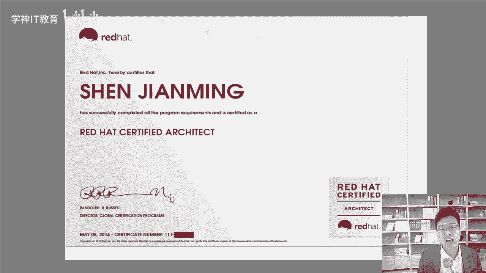

## 讲师介绍

我是MK，本课程的讲师。我曾任职于神州数码与新浪，从事运维工作，后转型为讲师。我持有红帽认证工程师（RHCE）、红帽认证架构师（RHCA）以及OpenStack私有云架构师等证书。

站在我身边的这位是红帽公司的创始人之一，也是我RHCA证书上的签名者。

这张照片记录了来自全国各地的RHCA讲师的一次聚会。我想通过这张照片传递一个信息：在IT行业，技术水平的高低远比年龄重要。只要肯努力，获得理想的薪资是完全可以实现的。

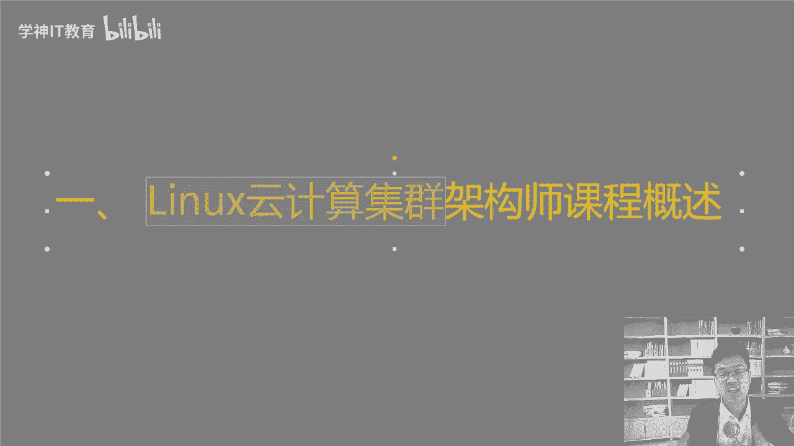

## 学神科技机构资质

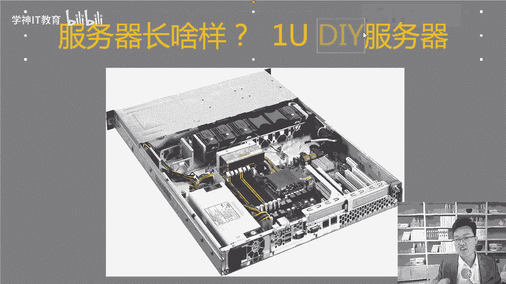

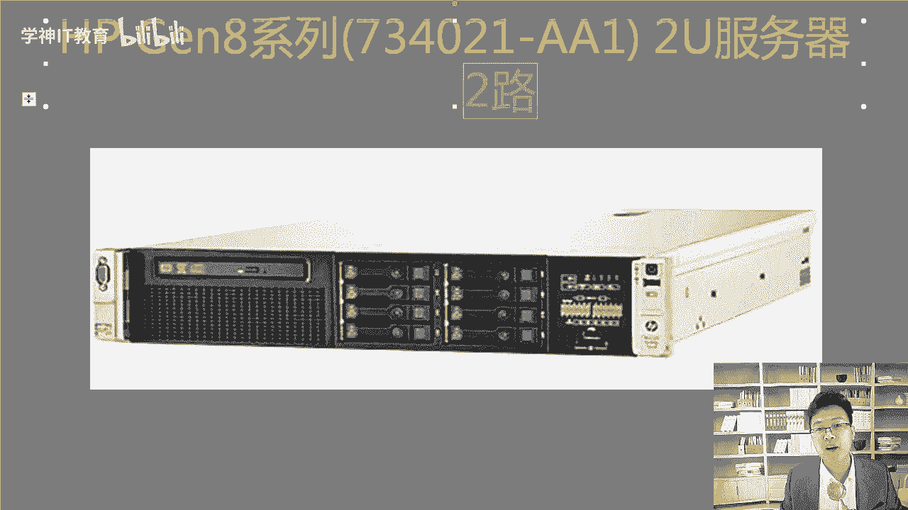

我们所在的学神科技是腾讯课堂在云计算与大数据类目中唯一认证的机构。我们在2015年获得“最受欢迎奖”，2016年获得“最具影响力奖”。

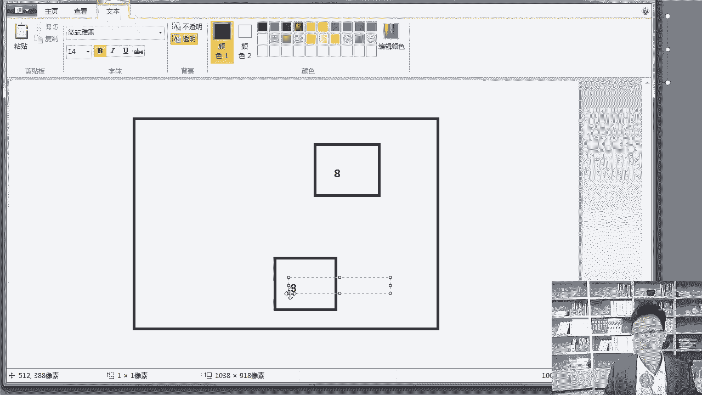

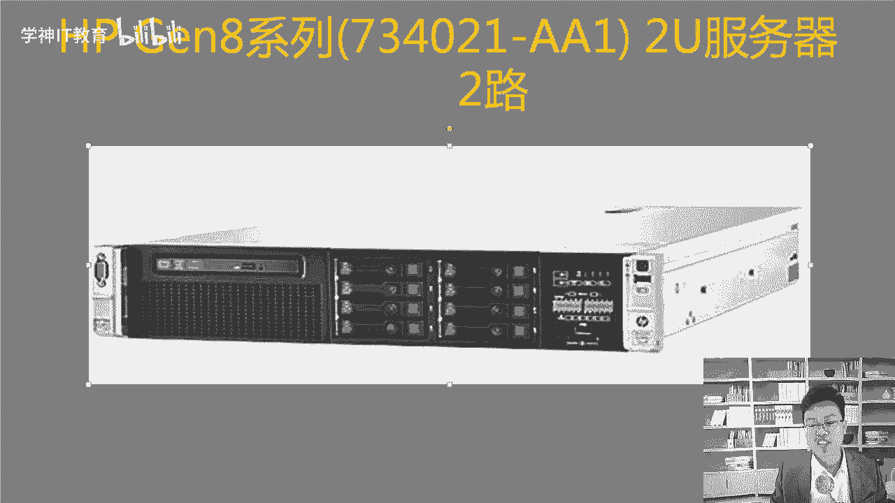

## Linux运行的硬件基础

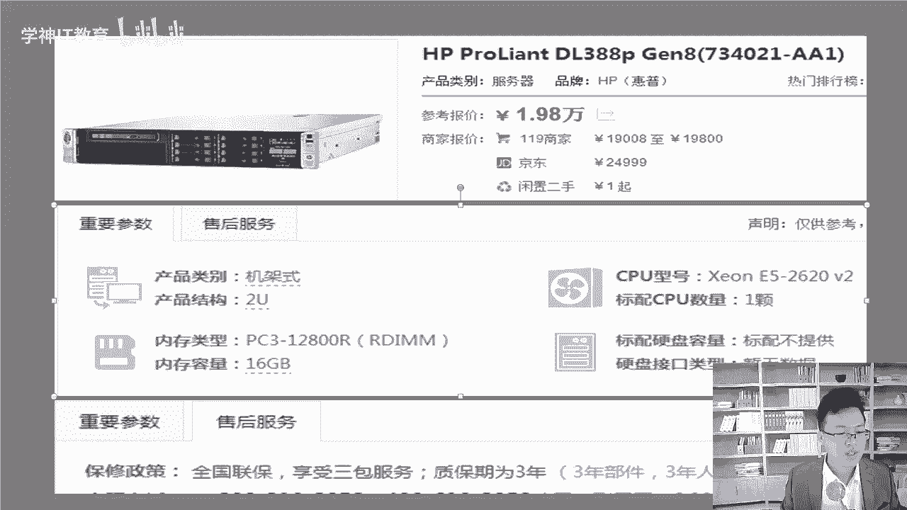

在深入学习Linux之前，我们需要了解它运行在什么样的硬件上。Linux主要运行在服务器上。

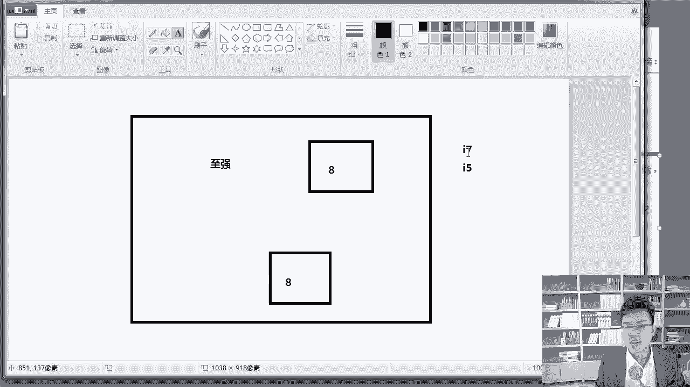

服务器有多种规格，最常见的是以“U”为单位的机架式服务器。“U”代表服务器的高度单位，1U约等于4.45厘米。

*   **1U服务器**：厚度较薄，约为三指宽。
*   **刀片服务器**：另一种高密度服务器形式。
*   **2U服务器**：厚度明显增加，可容纳更多硬件。

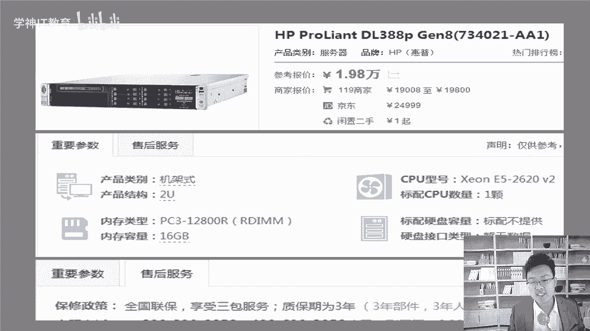

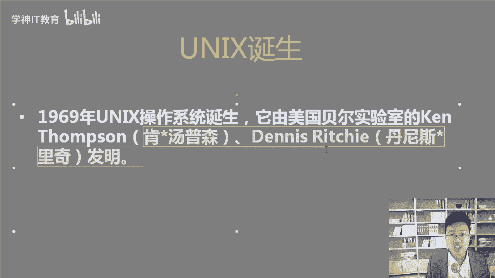

服务器性能的一个关键指标是“路”，它指的是主板上物理CPU的数量。

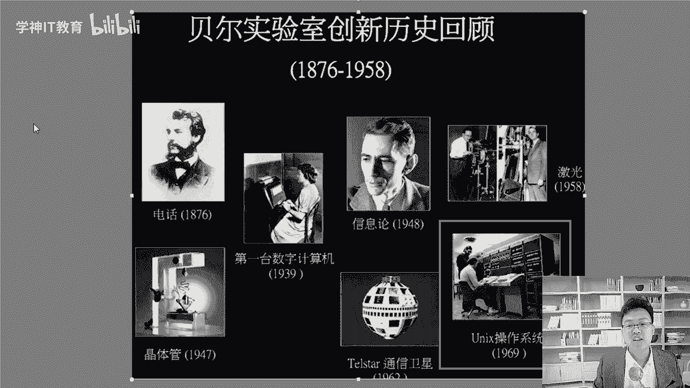

*   **单路**：主板上有一个物理CPU。
*   **双路**：主板上有两个物理CPU。如果一个CPU是8核，双路就是16核，性能大幅提升。
*   **四路**：主板上有四个物理CPU，性能更强。

服务器通常使用英特尔的**至强（Xeon）系列CPU**，例如E5-2620。它与个人电脑的酷睿（Core）i5/i7系列不同，至强CPU支持多路协同工作，专为服务器设计。

服务器内存通常使用带寄存器的**RDIMM内存**，支持ECC校验，稳定性更高。

一台品牌服务器（如惠普G8系列）的配置可能包含双路CPU、16GB内存，若配满硬盘，总价可达数万元。品牌机通常提供三年质保等服务。

## Linux的诞生与发展

上一节我们了解了Linux运行的硬件环境，本节中我们来看看Linux系统的历史渊源。

### Unix的起源

Linux的“大哥”是Unix操作系统。Unix于1969年诞生于**贝尔实验室**，由**肯·汤普森**和**丹尼斯·里奇**两位技术先驱共同创造。

*贝尔实验室，众多重大发明的摇篮*

*Unix与C语言之父：肯·汤普森（左）与丹尼斯·里奇（右）*

他们随后又发明了**C语言**，并在1973年用C语言重写了Unix系统。这样做的好处是使Unix摆脱了对特定硬件的依赖，实现了跨平台运行，极大地促进了其推广。

### Unix的发展与闭源

1973年后，Unix开始以开源形式传播，其中最著名的分支是加州大学伯克利分校开发的**BSD Unix**。

然而，到了1990年，拥有Unix知识产权的AT&T（朗讯科技）意识到了Unix的商业价值，开始起诉包括伯克利分校、IBM、惠普在内的众多厂商，要求支付版权费用。IBM和惠普等商业公司可以承担这笔费用，但作为学术机构的伯克利分校则无力支付，被迫发布了不包含任何AT&T代码的**FreeBSD**系统。

### Linux的诞生契机

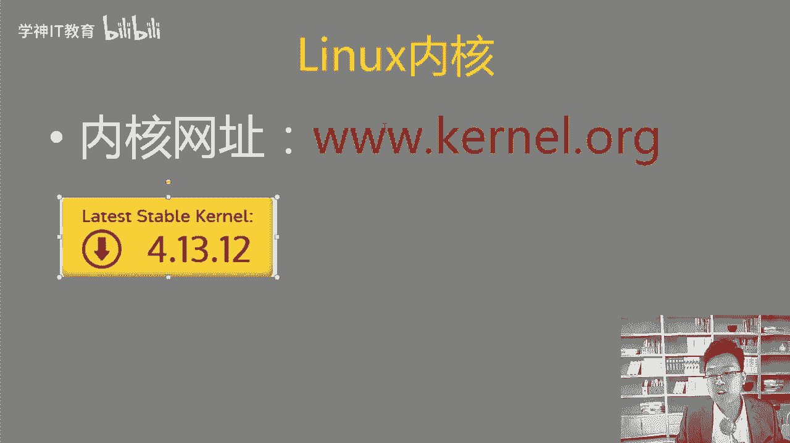

1990年的版权诉讼事件，使得业界急需一个Unix的替代品。就在这个时间点，1991年，**Linux**系统正式发布，恰逢其时地填补了市场空白。

Linux的诞生离不开两位关键人物：

1.  **理查德·斯托曼**：他发起了**GNU计划**，目标是创建一个完全自由的操作系统。GNU是“GNU‘s Not Unix”的递归缩写，意在表明其追求始终如一的自由（开源）精神，不同于Unix后来的闭源。
    
    *理查德·斯托曼，GNU计划创始人*

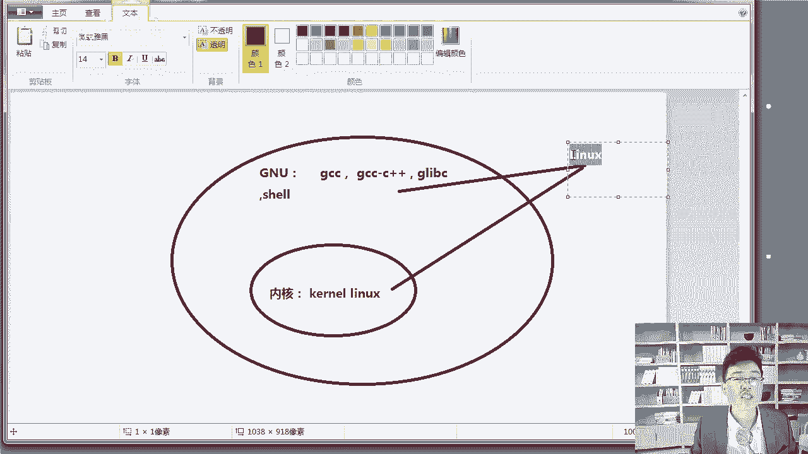

2.  **林纳斯·托瓦兹**：他编写了**Linux内核**。当时GNU计划已经开发了操作系统所需的大部分组件（如GCC编译器、Bash shell等），但唯独缺少一个成熟可用的内核。林纳斯开发的Linux内核与GNU的软件结合，形成了我们今天所使用的**GNU/Linux**操作系统。

*GNU计划吉祥物——角马，Linux的成功离不开GNU项目的支撑*

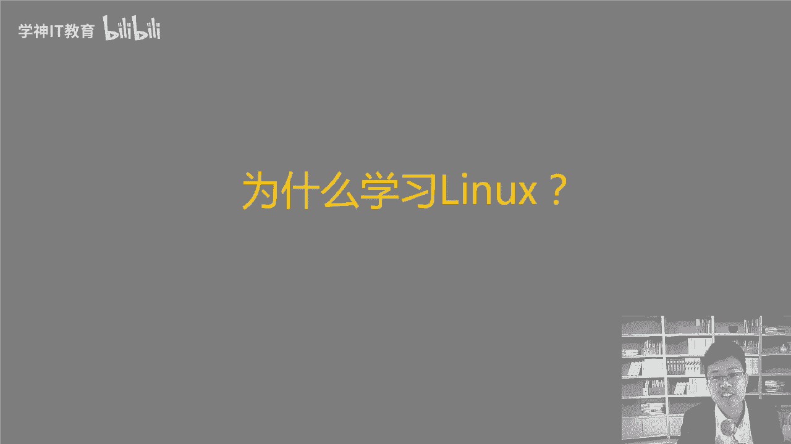

## 为什么学习Linux？

了解了Linux的历史后，我们来看看学习它的现实意义。

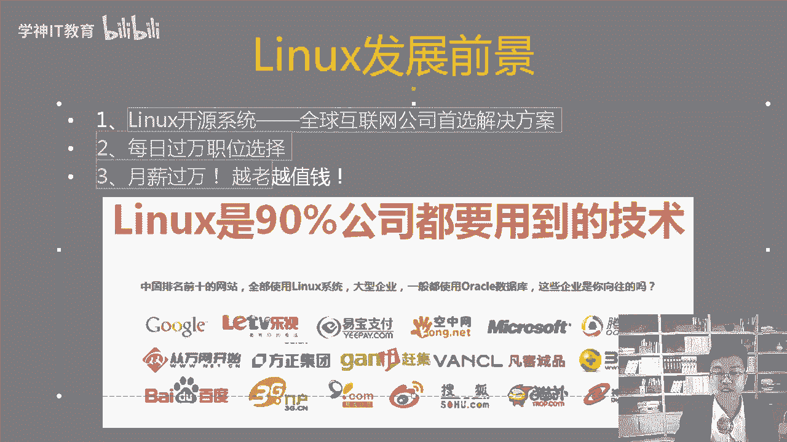

Linux开源系统是全球互联网基础设施的首选。从谷歌、百度、阿里巴巴到腾讯、360，几乎所有大型互联网公司都使用Linux。甚至传统金融、银行领域，出于安全可控的考虑，也正在从封闭的Unix系统向Linux迁移。

学习Linux意味着拥有广阔的职业前景和“越老越值钱”的潜力。

### 与其他操作系统的对比

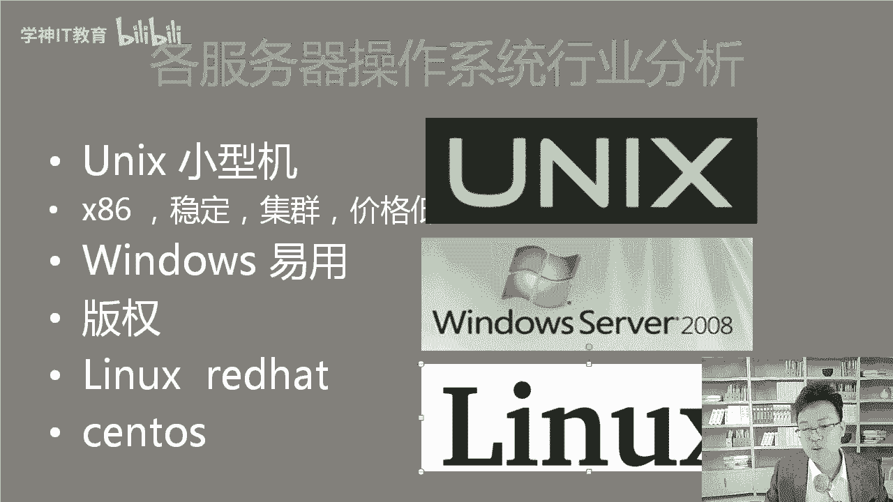

*   **Unix**：运行于昂贵的小型机，系统闭源，整体在走下坡路。
*   **Windows**：易用性强，但版权费用高，且运维岗位薪资天花板相对较低。
*   **Linux**：运行于廉价的x86服务器，系统开源自由，性能强大，是企业级应用的主流选择。

### 主要的Linux发行版

Linux有许多不同的发行版，初学者常会困惑如何选择。

以下是它们之间的关系：
1.  **Fedora**：红帽公司赞助的社区版，包含最新技术。
2.  **RHEL**：红帽企业版Linux。当Fedora中的技术稳定后，会被移植到RHEL。
3.  **CentOS**：社区企业操作系统。它**完全**源自红帽免费公开的RHEL源代码，重新编译后去掉商标发布。因此，学习CentOS等同于学习RHEL。

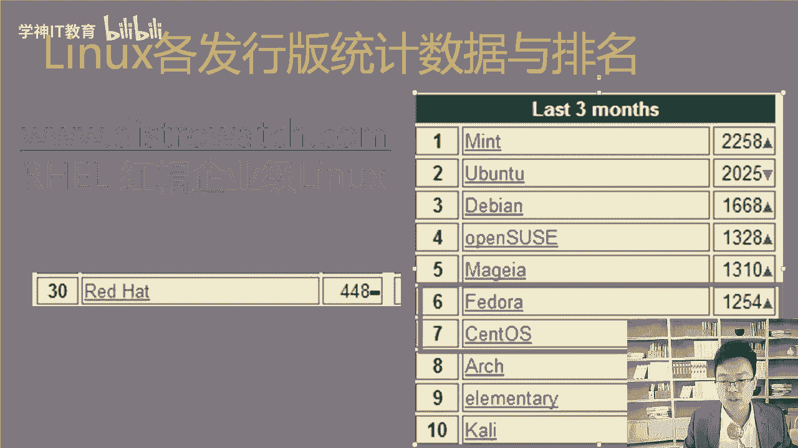

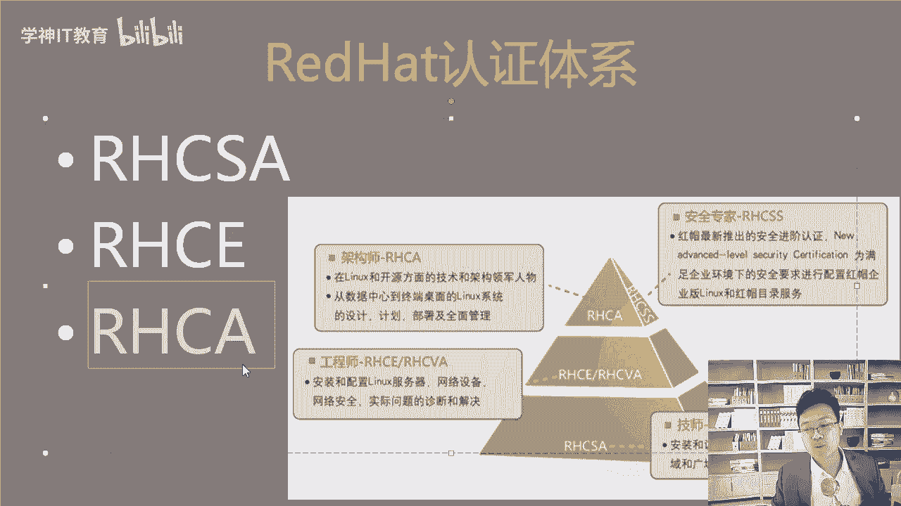

对于初学者和未来的运维架构师，**CentOS**或**RHEL**是最佳选择，因为它们是企业的实际标准。

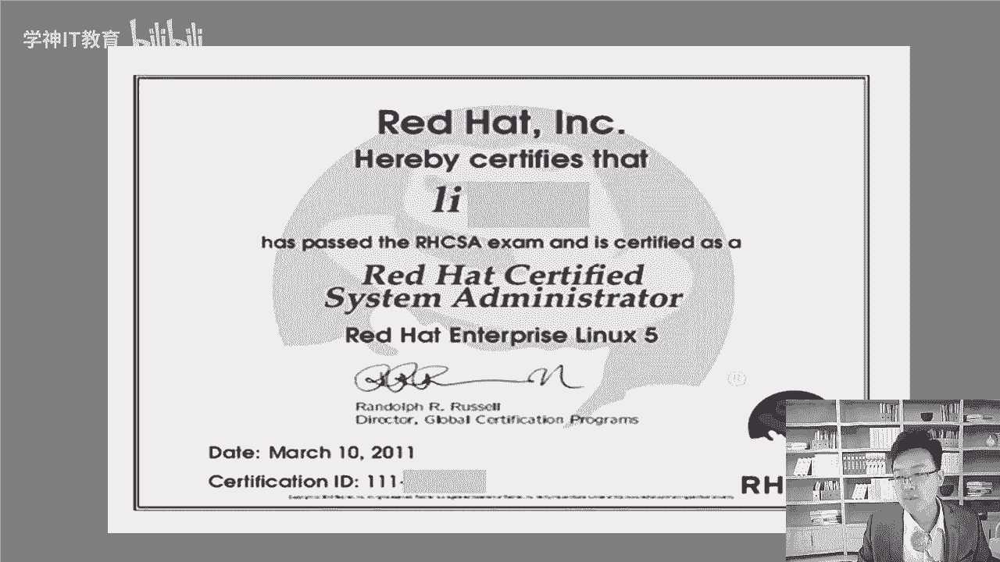

### 红帽认证体系

红帽提供了一套完整的技能认证：
*   **RHCSA**：红帽认证系统管理员（初级）。
*   **RHCE**：红帽认证工程师（中级）。
*   **RHCA**：红帽认证架构师（高级）。

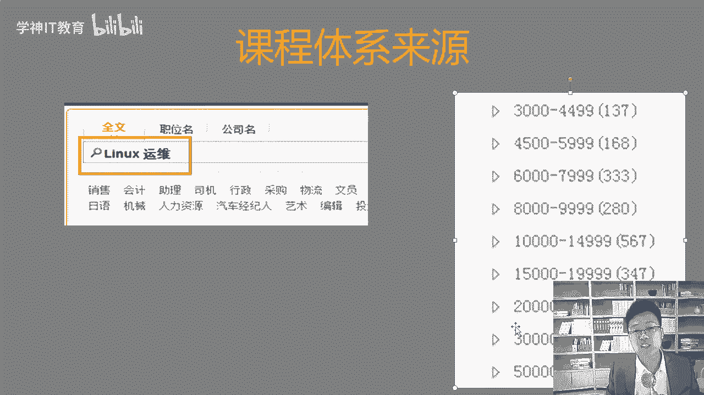

## 学习路径与职业规划

学完Linux后能从事什么工作？薪资水平如何？

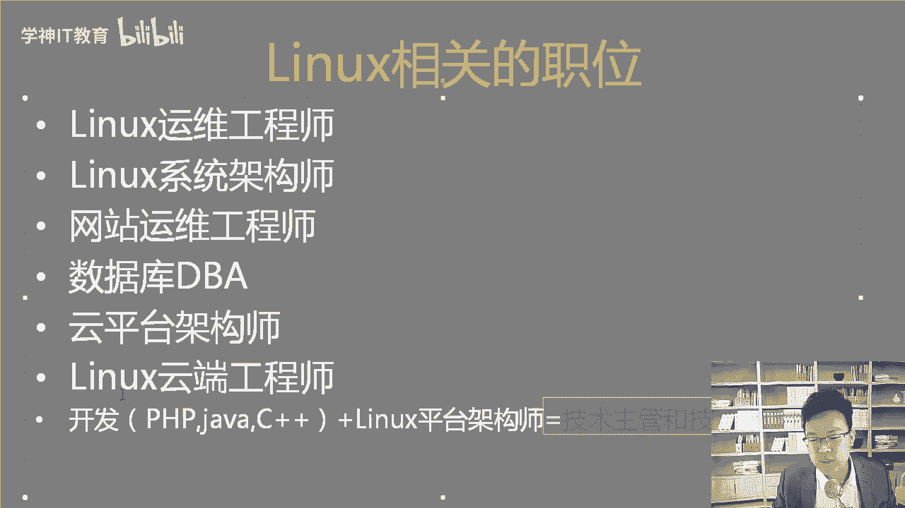

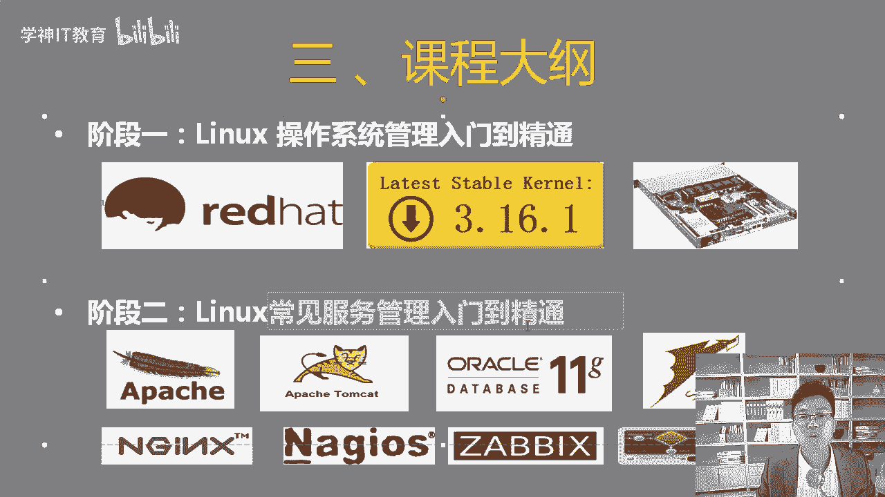

*   **应届毕业生/转行者**：掌握课程内容后，可胜任Linux运维工程师，起步薪资约为6000-8000元。
*   **有1-2年相关经验者**（如网管、系统集成）：学完后可达10000-15000元。
*   **向更高薪发展**：需要结合开发技能（如Python、Java）。Linux架构知识加上开发能力，可以迈向技术主管/总监岗位，薪资可达20000-30000元或更高。

相关的职位包括：
*   Linux运维工程师
*   系统架构师
*   数据库管理员（DBA）
*   云计算工程师
*   运维开发工程师（需结合编程）

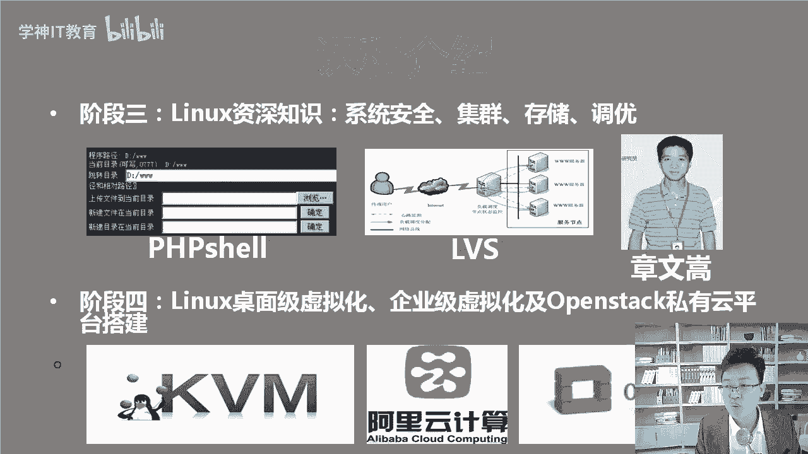

## 课程内容体系

本课程将系统性地覆盖以下核心内容：
1.  **操作系统入门到精通**：打好坚实基础。
2.  **常见Linux服务**：掌握Web、数据库、文件共享等核心服务搭建与管理。
3.  **Linux资深知识**：包括**系统安全**、**集群**、**存储**与**性能调优**。这是大数据、云计算等上层技术的基石。
4.  **虚拟化与云**：从桌面虚拟化到企业级虚拟化（KVM），再到私有云（OpenStack）和容器技术（Docker与Kubernetes）。

## 常见问题与学习建议

最后，针对初学者常见的顾虑，给出一些建议：

*   **学历要求**：建议大专以上。高中毕业则需要付出更多努力，因为Linux架构知识需要大量记忆和实践。
*   **英语不好**：完全不用担心。Linux命令多是简写，例如：
    *   `ls` (list directory contents)：列出目录内容。
    *   `pwd` (print working directory)：打印当前工作目录。
    *   `su` (switch user)：切换用户。
    *   `whoami` (who am i)：显示当前登录用户名。
    课程中会对关键术语进行讲解。
*   **非计算机专业**：完全可以学会。Linux运维更侧重于架构和实践。
*   **学习捷径**：
    1.  **系统学习**：避免碎片化地观看零散、有“坑”的免费教程。跟随一套完整的课程体系，在4个月左右集中攻关。
    2.  **多动手练习**：这是掌握技术的唯一途径。听完课一定要反复练习。
    3.  **慎选入门书籍**：像《鸟哥的Linux私房菜》这类巨著，更适合作为工具书查阅，不适合初学者从头到尾阅读，容易因内容过于庞杂而放弃。学习初期，良好的氛围和老师引导更为重要。

## 总结

本节课中，我们一起学习了Linux云计算集群架构师课程的概况。我们从Linux运行的硬件讲起，回顾了Unix和Linux波澜壮阔的发展历史，明确了学习Linux的光明前景和职业方向，并预览了完整的课程知识体系。同时，也为大家打消了关于学历、英语等方面的学习顾虑。从下一节课开始，我们将正式进入Linux的世界，从最基础的安装和操作学起。请大家保持信心，坚持练习，我们一同进步。

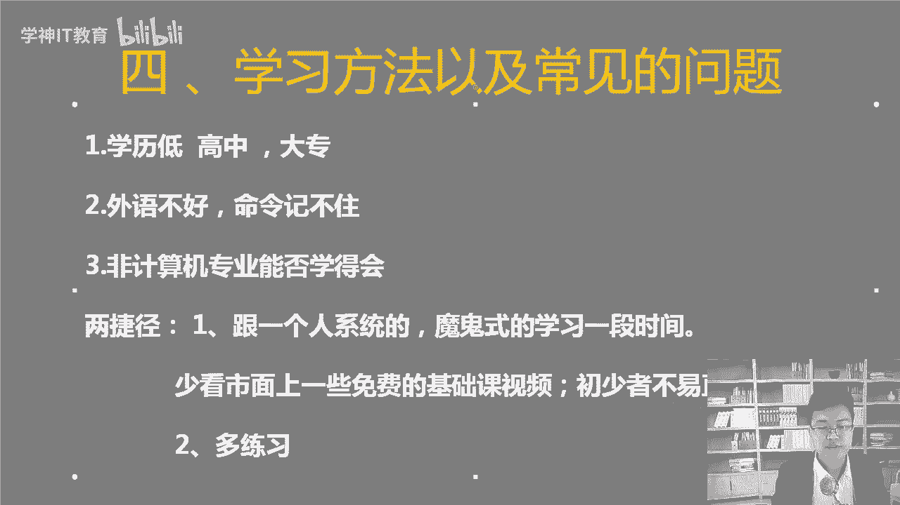

