# RHCE红帽认证课程：P2：安装VMware与CentOS 7系统 🖥️

在本节课中，我们将学习如何在个人电脑上搭建一个Linux学习环境。主要内容包括：下载并安装VMware虚拟机软件，以及在该虚拟机中安装CentOS 7操作系统。通过本教程，你将拥有一个可以安全练习Linux命令和操作的独立环境。

## 软件与镜像下载 📥

上一节我们介绍了Linux的发展史，本节中我们来看看如何准备安装所需的软件和系统镜像。

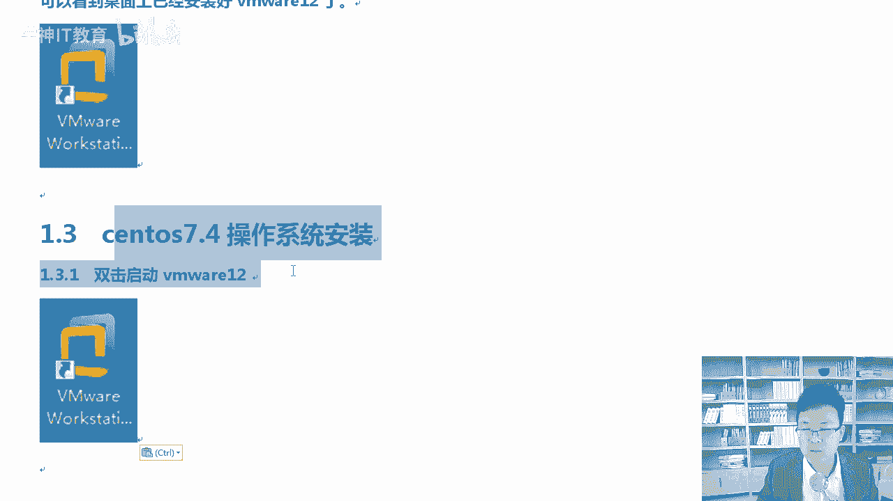

你需要下载两个核心文件：VMware虚拟机软件和CentOS 7系统镜像文件。以下是获取资源的指引：

*   **VMware软件**：提供适用于Windows和Mac系统的安装包。Windows用户下载`.exe`文件，Mac用户下载`.dmg`文件。
*   **CentOS 7镜像**：这是一个较大的文件，提供了`.iso`格式的光盘镜像文件。请确保下载的是`.iso`文件，而非压缩包。
*   **辅助资源**：教程还提供了旧版系统（如RHEL 6.5）的镜像以及软件激活所需的序列号，以备不时之需。

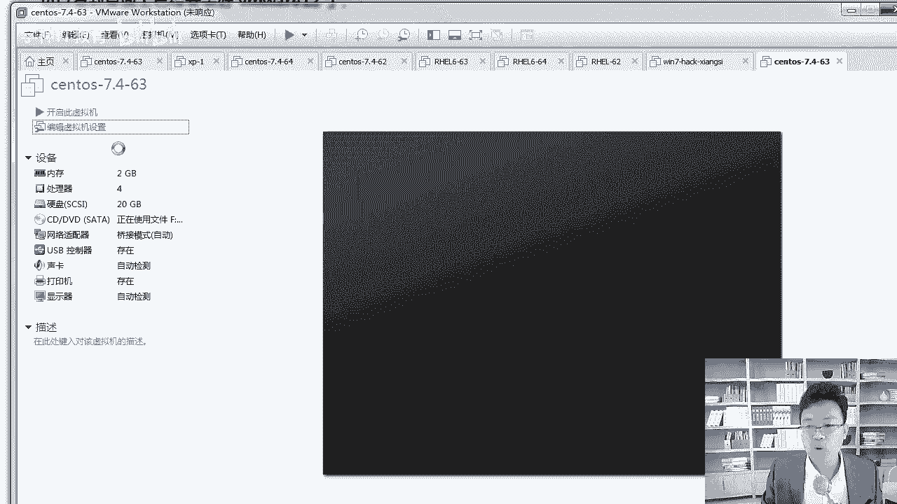

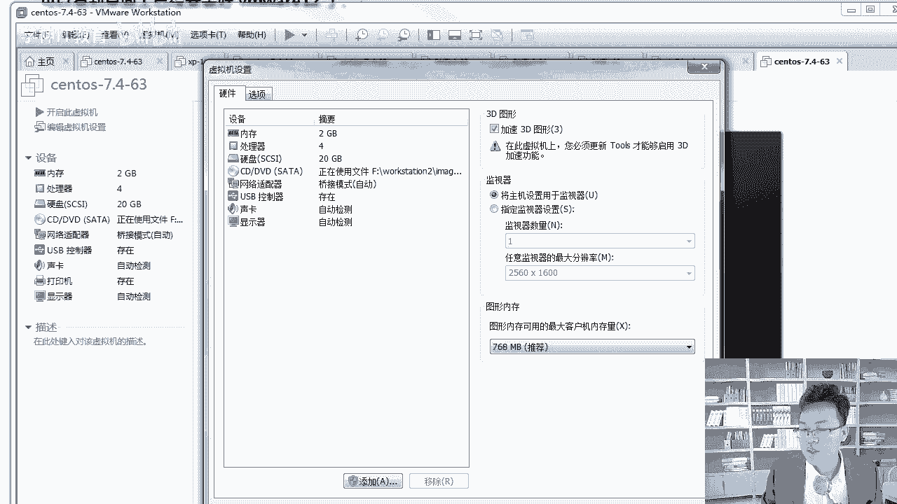

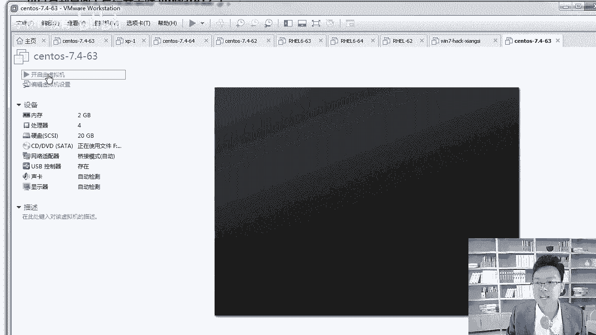

**注意**：若使用压缩包格式的镜像，请先解压获得`.iso`文件后再使用。

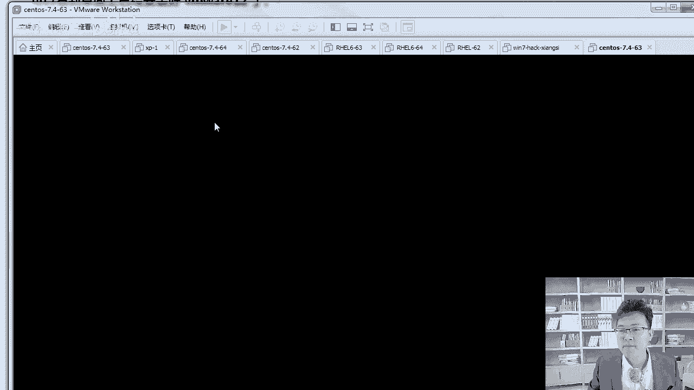

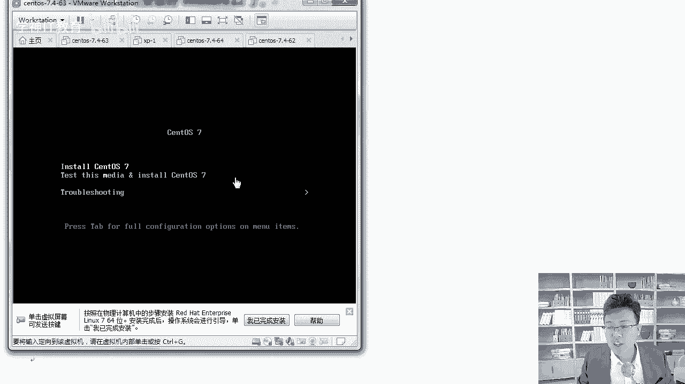

## 安装VMware虚拟机软件 🔧

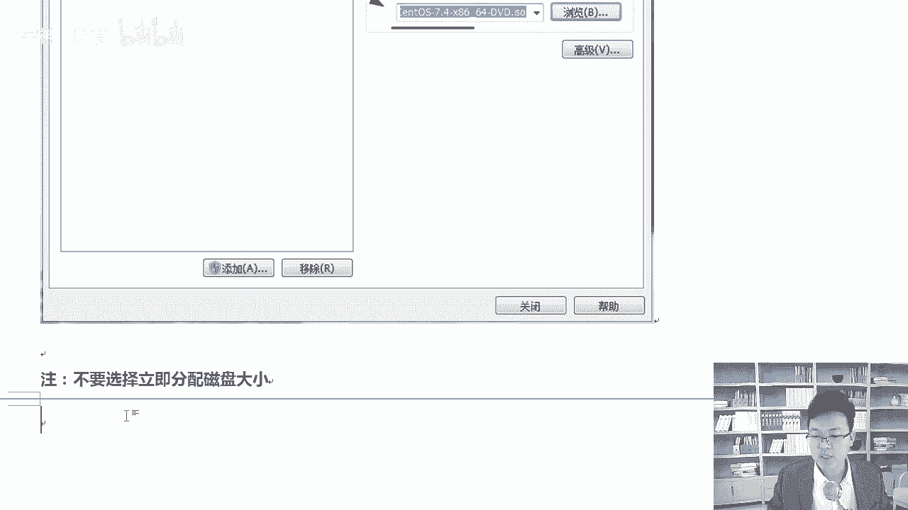

准备好安装包后，我们开始安装VMware Workstation。

1.  双击下载好的`.exe`安装程序。
2.  在安装向导中，点击“下一步”，并接受许可协议。
3.  选择安装路径。建议不要安装在C盘，以免占用过多系统盘空间。
4.  在“用户体验设置”步骤，建议取消勾选“检查产品更新”和“帮助改善VMware”选项。
5.  勾选“创建桌面快捷方式”和“创建开始菜单程序文件夹”，方便后续启动。
6.  点击“安装”并等待安装过程完成。
7.  安装完成后，不要直接点击“完成”，应点击“许可证”按钮。
8.  输入提供的序列号以激活软件，完成后即可正常使用。

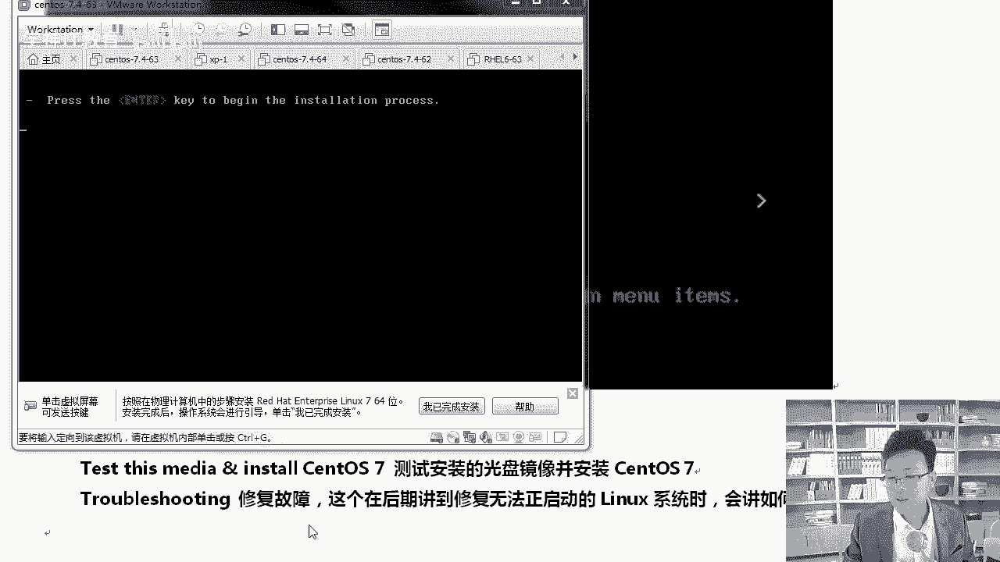

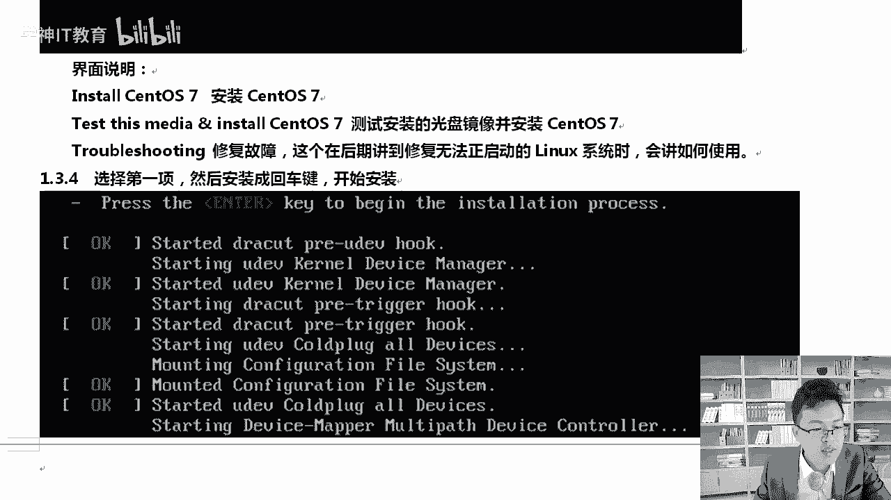

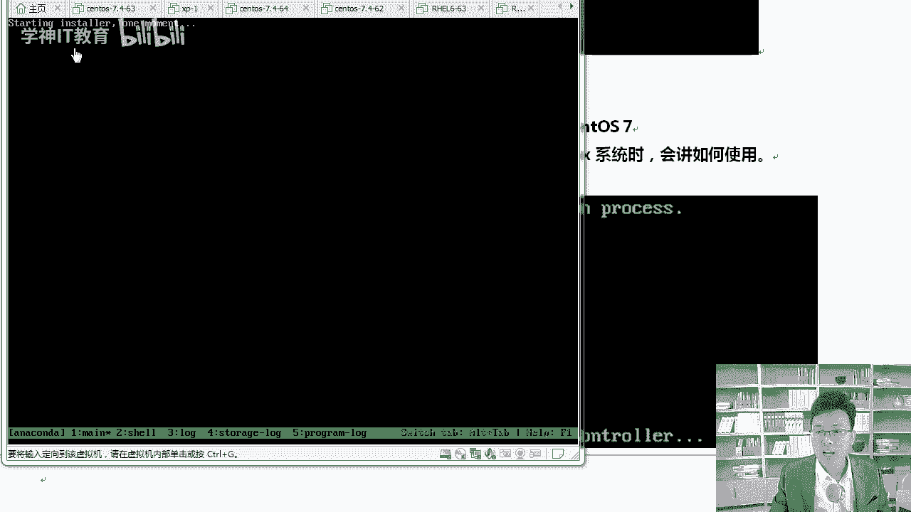

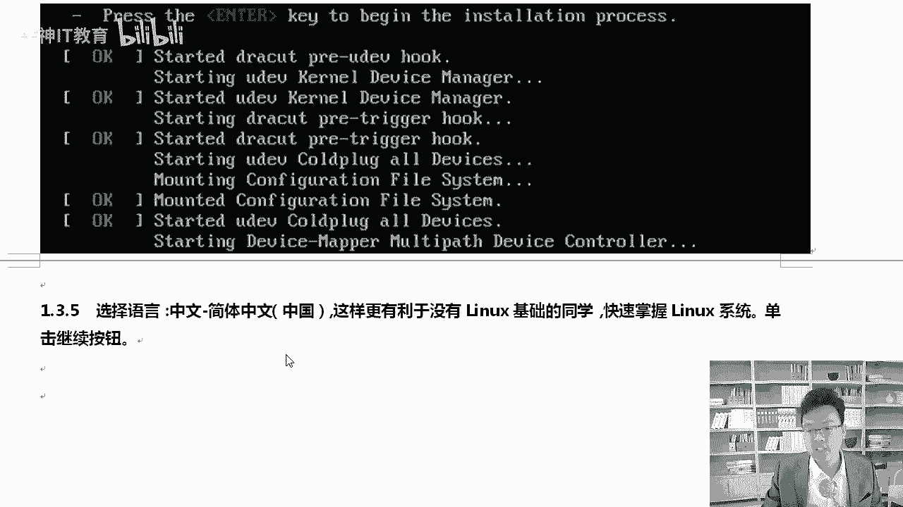

**核心概念**：虚拟机软件（如VMware）可以在你的物理计算机（称为“宿主机”）上模拟出多台完整的、独立的“虚拟计算机”。每台虚拟机都可以安装自己的操作系统，如同真实的电脑一样。

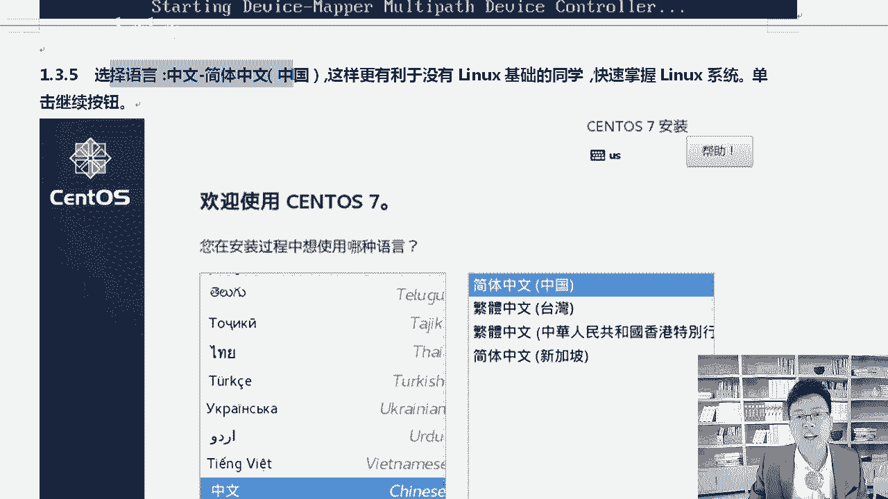

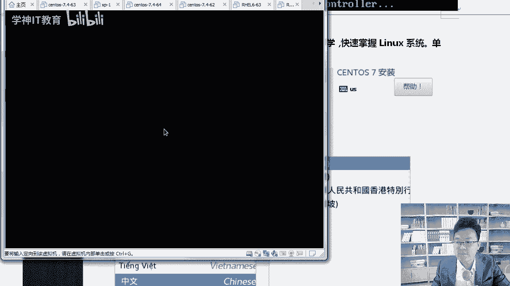

## 创建新的虚拟机 🆕

安装好VMware后，下一步是在软件内创建一台新的“虚拟电脑”，用于安装CentOS系统。

以下是创建虚拟机的关键步骤：

*   **新建虚拟机**：启动VMware，点击“创建新的虚拟机”。
*   **配置类型**：选择“自定义（高级）”配置，以便更灵活地设置参数。
*   **操作系统安装来源**：选择“稍后安装操作系统”。
*   **客户机操作系统**：选择“Linux”，版本选择“Red Hat Enterprise Linux 7 64位”。
*   **命名与位置**：为虚拟机起一个易于识别的名称（如`CentOS-7.4-63`），并指定一个非系统盘的存储位置。
*   **处理器与内存**：根据宿主机性能分配处理器核心数（例如2核或4核）和内存（建议至少2GB）。
*   **网络类型**：选择“使用网络地址转换（NAT）”，这通常是最简单且能直接上网的方式。
*   **磁盘设置**：
    *   选择“创建新虚拟磁盘”。
    *   设置磁盘大小（例如20GB），**务必取消勾选“立即分配所有磁盘空间”**，这样可以节省物理硬盘空间。
    *   选择“将虚拟磁盘存储为单个文件”。
*   **自定义硬件**：在完成前，点击“自定义硬件”。在硬件列表中，选择“新CD/DVD”，并点击“使用ISO映像文件”，浏览并选中你下载的CentOS 7 `.iso`镜像文件。
*   **移除不必要设备**：在硬件列表中，移除“打印机”等不需要的虚拟设备。
*   **完成创建**：检查设置无误后，点击“完成”。

## 安装CentOS 7操作系统 🐧

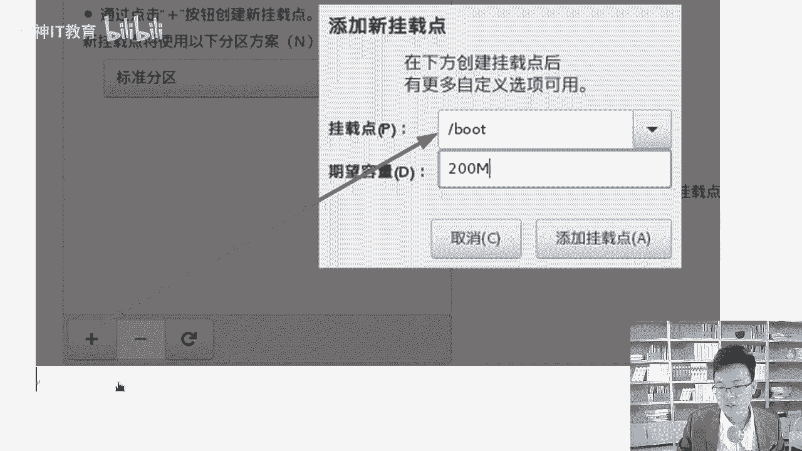

虚拟机创建好后，我们就可以启动它并开始安装CentOS 7系统了。

1.  点击“开启此虚拟机”。
2.  虚拟机启动后，会进入安装引导界面。使用键盘上下键选择第一项“`Install CentOS 7`”，然后按回车键开始安装。
3.  系统加载后，首先进入语言选择界面。选择“中文” -> “简体中文（中国）”，然后点击“继续”。
4.  进入“安装信息摘要”界面，这是配置安装的核心步骤。以下是需要配置的项：
    *   **软件选择**：点击进入。初学者建议选择“`带GUI的服务器`”，并勾选右侧的“`开发工具`”。这提供了图形界面和必要的编译环境。
    *   **安装位置**：点击进入进行磁盘分区。
        *   选择“`我要配置分区`”，点击“完成”。
        *   在分区方案中，选择“`标准分区`”，然后点击左下角“+”号创建挂载点。
        *   创建以下三个分区：
            1.  `/boot`：引导分区，文件系统为`xfs`，大小`200M`。
            2.  `swap`：交换分区，大小一般为物理内存的1-2倍，但若内存较大（如>8G），分配`4-8G`即可。
            3.  `/`：根分区，文件系统为`xfs`，分配剩余所有空间（例如`10G`或更多）。
        *   点击“完成”，并接受更改。
    *   **网络和主机名**：点击进入。
        *   将右上角的以太网开关从“关”拨到“开”状态。
        *   在下方主机名处，输入你希望的主机名（如`xuegod-63.cn`）。
        *   你可以保留自动获取的IP（DHCP），也可以点击“配置”手动设置静态IP、子网掩码、网关和DNS（例如`8.8.8.8`）。
        *   配置完成后，点击“保存”。
    *   **安全策略**：保持默认（未配置）即可。
    *   **KDUMP**：这是一个内核崩溃转储工具，可以**取消勾选**以节省内存。
5.  所有配置完成后，点击右下角的“开始安装”。
6.  在安装过程中，需要设置**ROOT密码**。点击“ROOT密码”进行设置（例如设为`123456`）。如果提示密码过于简单，请点击两次“完成”以确认。
7.  可以创建普通用户，也可在系统安装完成后创建。此处可选择跳过。
8.  等待安装进度条完成。完成后，点击“重启”。

## 系统初始配置与验证 ✅

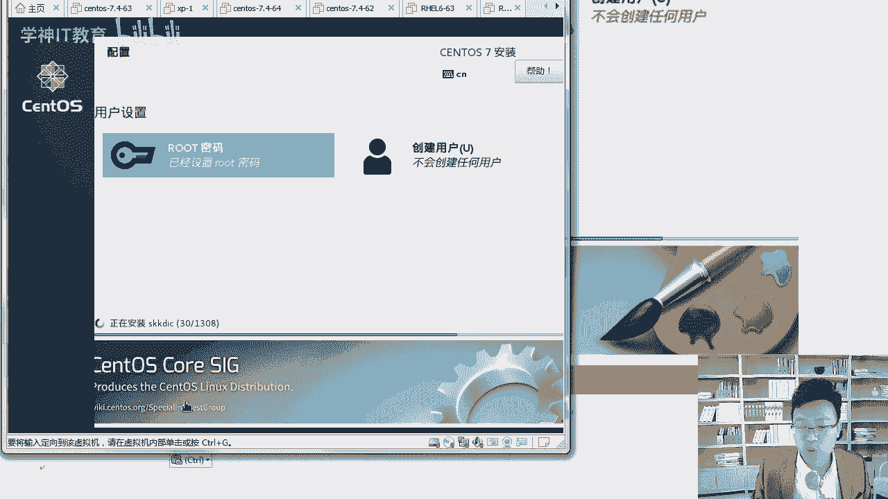

系统重启后，还需要进行一些简单的初始设置。

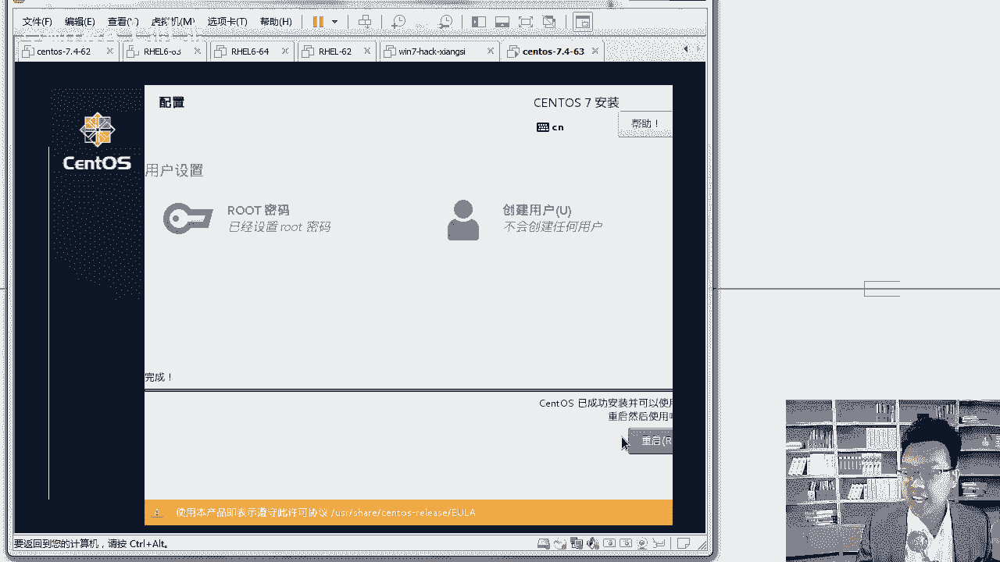

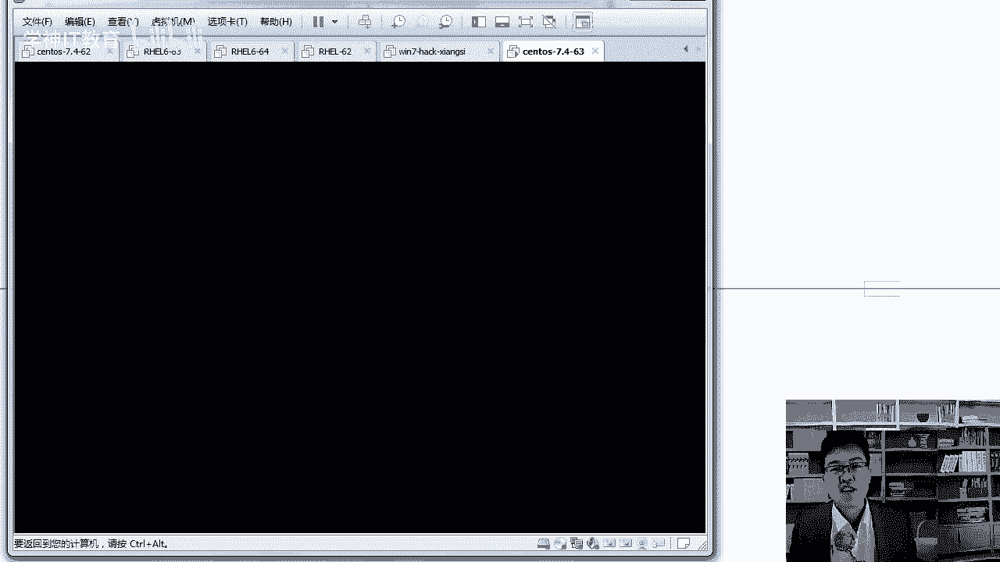

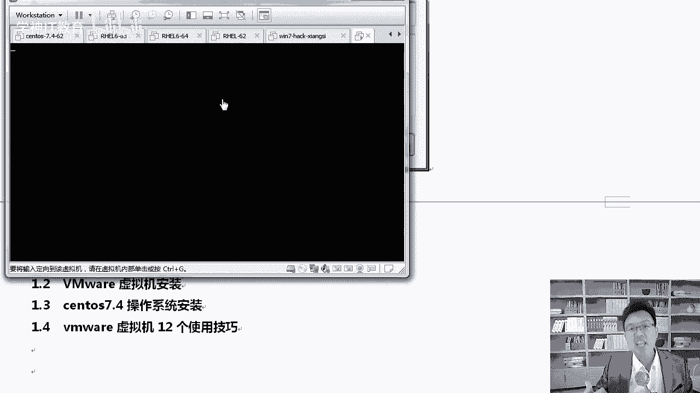

1.  重启后，首次进入系统会显示“初始设置”界面。
2.  点击“许可信息”，勾选“我同意许可协议”，然后点击“完成”。
3.  返回初始设置界面，点击“完成配置”。
4.  系统将进入图形化设置向导：
    *   选择语言和输入法，保持“汉语”即可，点击“前进”。
    *   隐私设置，可以关闭“位置服务”，点击“前进”。
    *   时区确认是“上海”，点击“前进”。
    *   在线账号可点击“跳过”。
    *   创建用户：输入你的全名、用户名（如`mk`）和密码（如`123456`），点击“前进”。
    *   最后点击“开始使用CentOS Linux”。
5.  系统安装完成。你可以打开终端（在桌面右键或点击应用程序菜单），测试网络是否连通。
    *   在终端中输入命令：`ping www.baidu.com`
    *   如果能看到数据包回复，说明网络配置成功。
6.  为了后续实验方便，建议为当前完好的系统状态创建一个“快照”。首先关机，在终端（以root用户）执行：`shutdown -h now`。待虚拟机关闭后，在VMware中点击“虚拟机” -> “快照” -> “拍摄快照”，为其命名并保存。

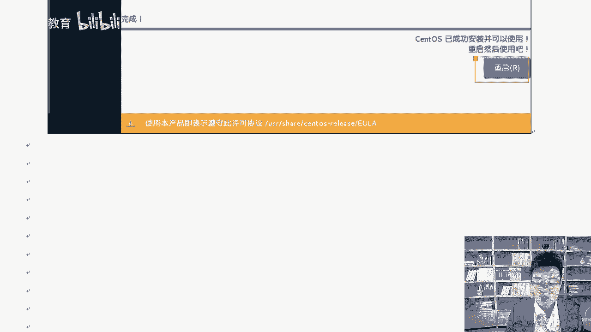

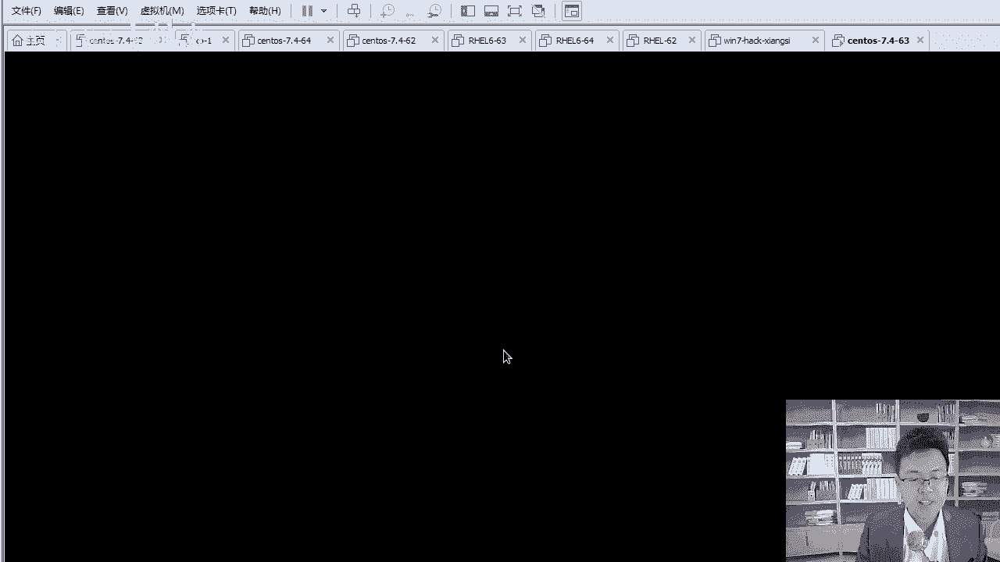

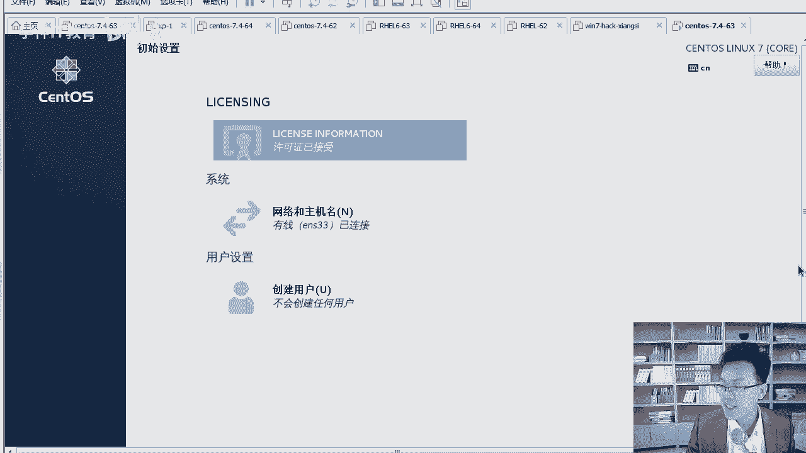

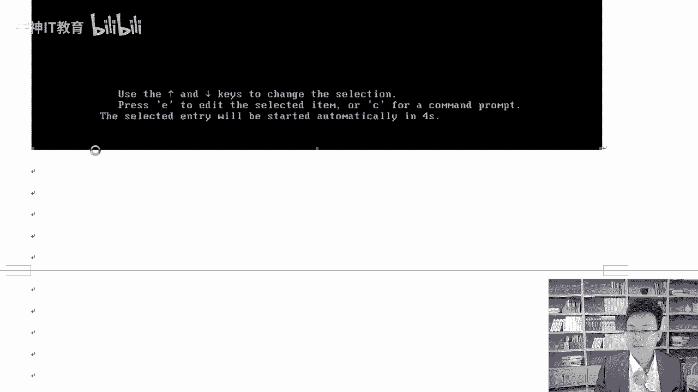

## 知识扩展：RHEL/CentOS 6与7的主要区别 🔍

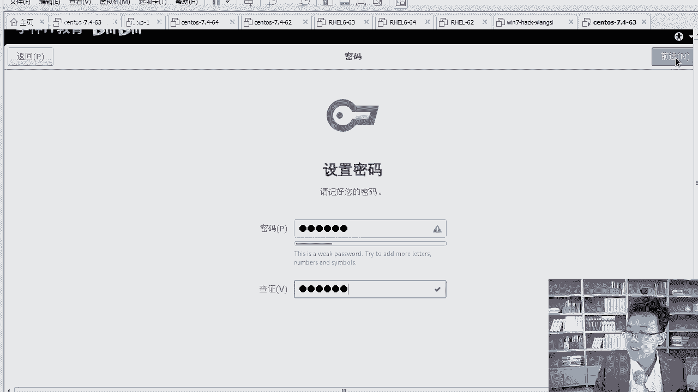

作为知识补充，了解CentOS 7与其前代版本6的一些关键区别，有助于理解Linux的演进：

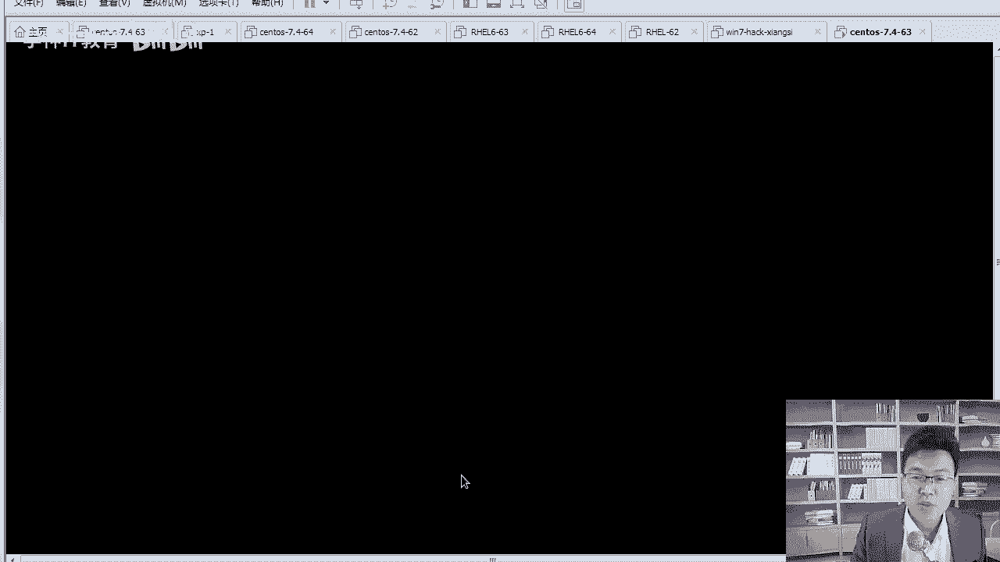

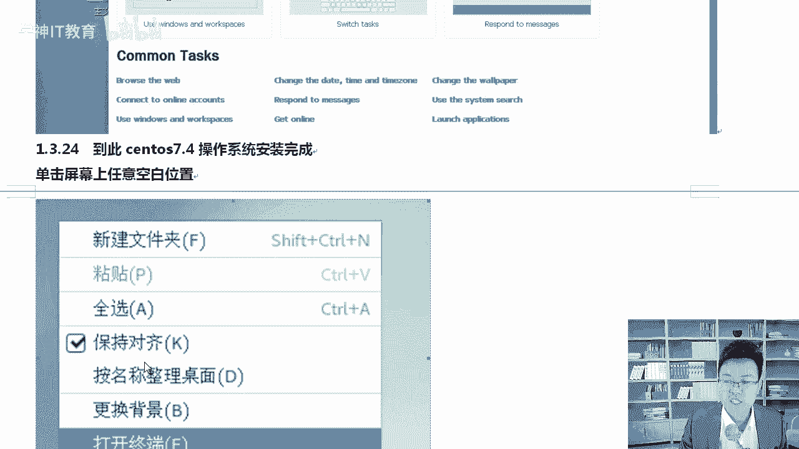

*   **文件系统**：6默认使用`ext4`，7默认使用`xfs`。
*   **内核版本**：6基于`2.6.x`内核，7基于`3.10.x`内核，性能和支持的新硬件更好。
*   **服务管理**：6使用`service`和`chkconfig`命令管理服务，7引入了`systemd`，使用`systemctl`命令进行管理。
    *   **代码示例**：启动服务
        *   CentOS 6: `service network restart`
        *   CentOS 7: `systemctl restart network`
*   **网络配置**：6的网卡配置文件位于`/etc/sysconfig/network-scripts/ifcfg-eth0`，7的网卡命名规则可能变为`ens33`等。
*   **防火墙**：6使用`iptables`，7默认使用`firewalld`（底层仍为iptables）。

---

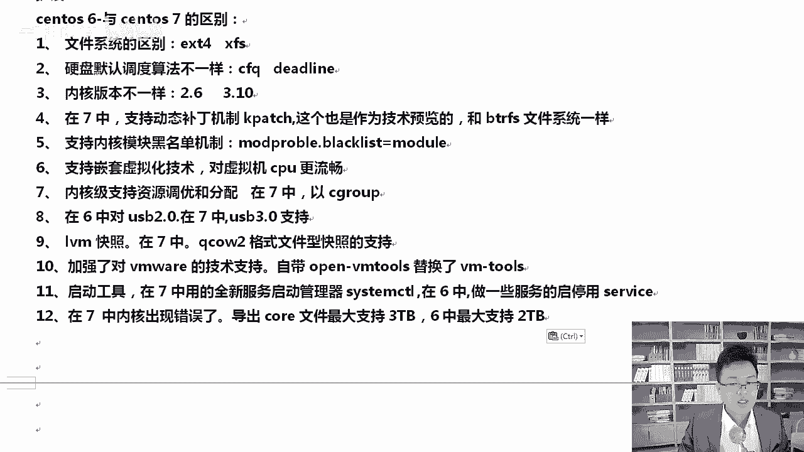

本节课中我们一起学习了如何搭建Linux学习环境。我们完成了从下载软件、安装VMware虚拟机、创建并配置虚拟机、到详细安装和初始化CentOS 7操作系统的全过程。最后，你还了解了CentOS 7与6版本的一些核心区别。现在，你已经拥有了一个可以随意练习而不用担心损坏真实系统的Linux环境，接下来就可以开始探索Linux的世界了。