# RHCE红帽认证课程：P3：VMware 12个实用技巧 🛠️

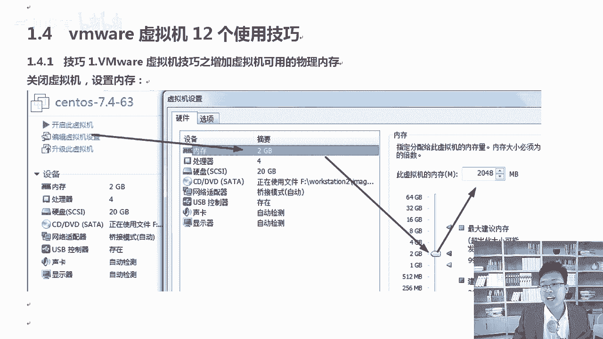

在本节课中，我们将学习VMware Workstation 12的十二个核心使用技巧。这些技巧涵盖了虚拟机硬件管理、网络配置、系统控制与维护等多个方面，是进行Linux运维和云计算学习的基础工具操作。

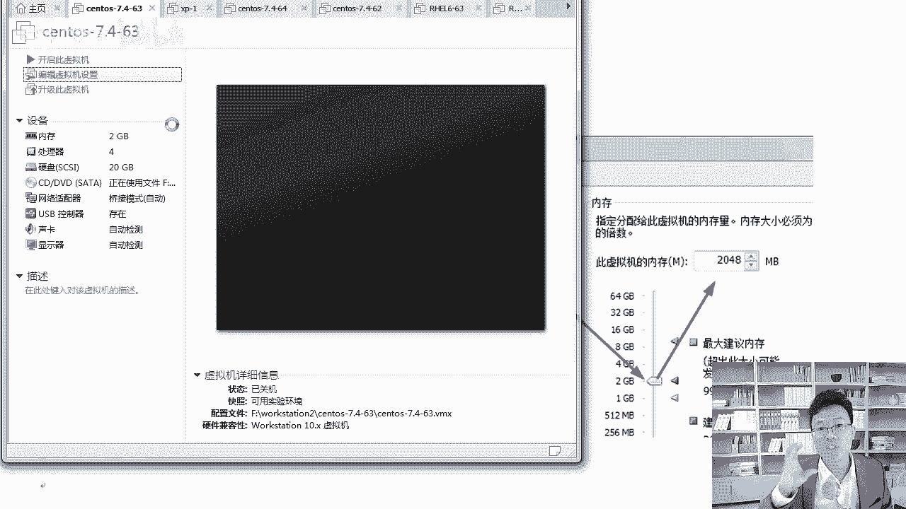

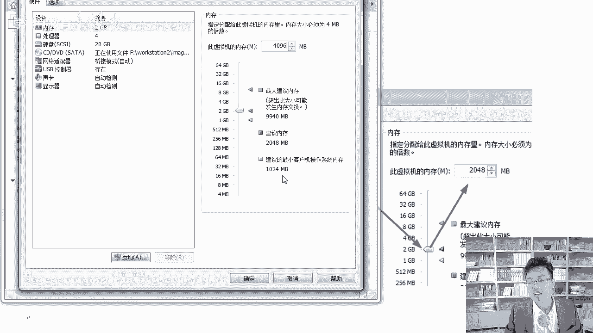

## 1. 调整虚拟机内存

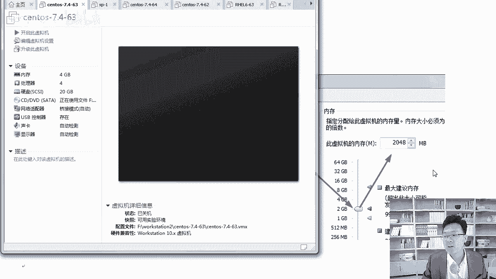

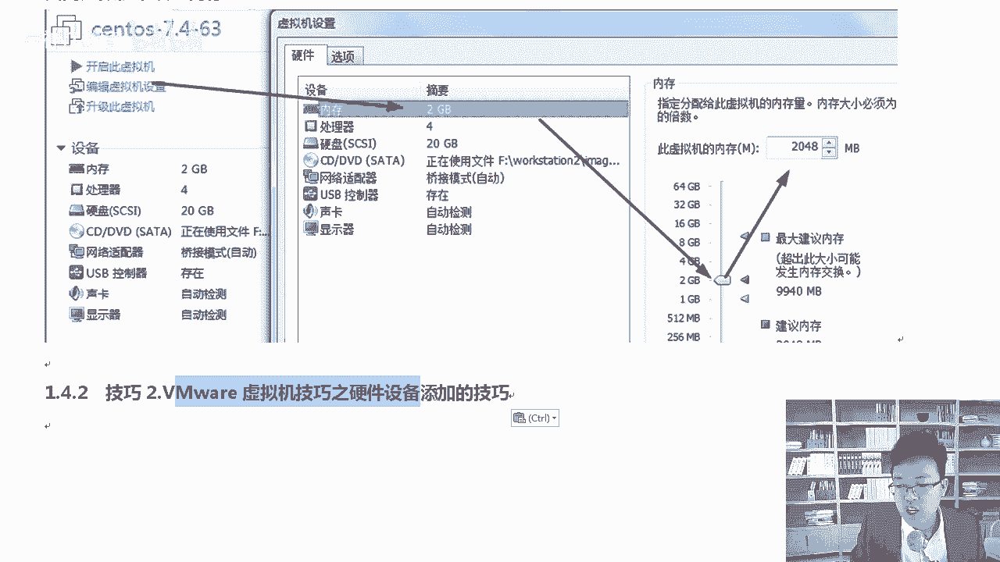

上一节我们介绍了虚拟机的安装，本节中我们来看看如何调整虚拟机的硬件配置。首先，增加虚拟机可用内存的操作必须在虚拟机关机状态下进行。

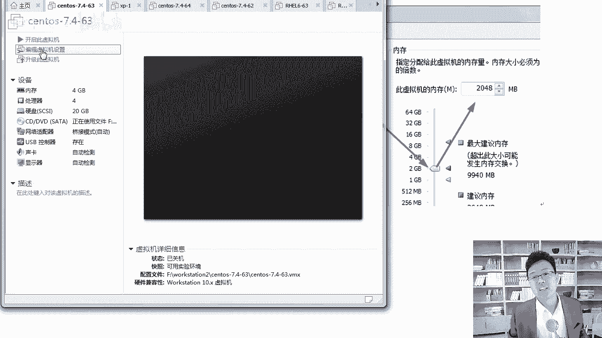

以下是具体操作步骤：
1.  关闭目标虚拟机。
2.  右键点击虚拟机，选择“设置”。
3.  在“硬件”选项卡中，选择“内存”。
4.  调整内存大小。可以通过拖动滑块或直接输入数值（例如 `4096` MB）来完成。
5.  点击“确定”保存设置。

## 2. 添加硬件设备

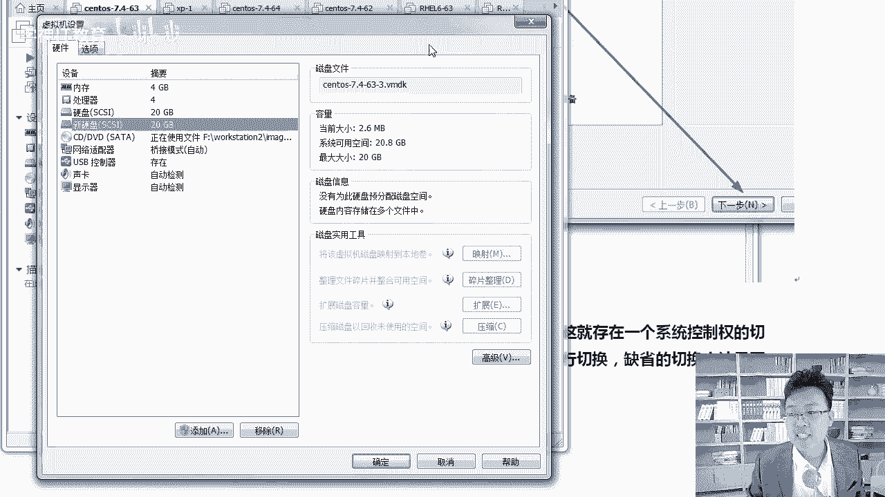

硬件配置不仅限于内存。虚拟机支持动态添加多种硬件，如硬盘、网卡等，这为灵活扩展资源提供了便利。

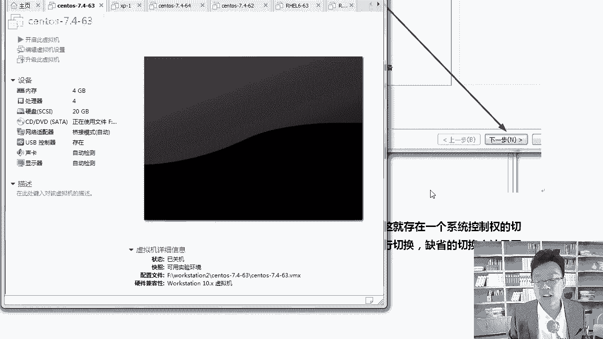

以下是添加新硬盘的步骤：
1.  在虚拟机关机状态下，进入“虚拟机设置”。
2.  点击“添加”按钮。
3.  在硬件类型中选择“硬盘”，然后点击“下一步”。
4.  选择磁盘类型（如SCSI），并按照向导完成创建。
5.  新硬盘创建后，默认不会立即分配空间。添加网卡或其他设备的方法与此类似。
移除硬件设备的方法同样简单，只需在设置中选择对应设备并点击“移除”即可。

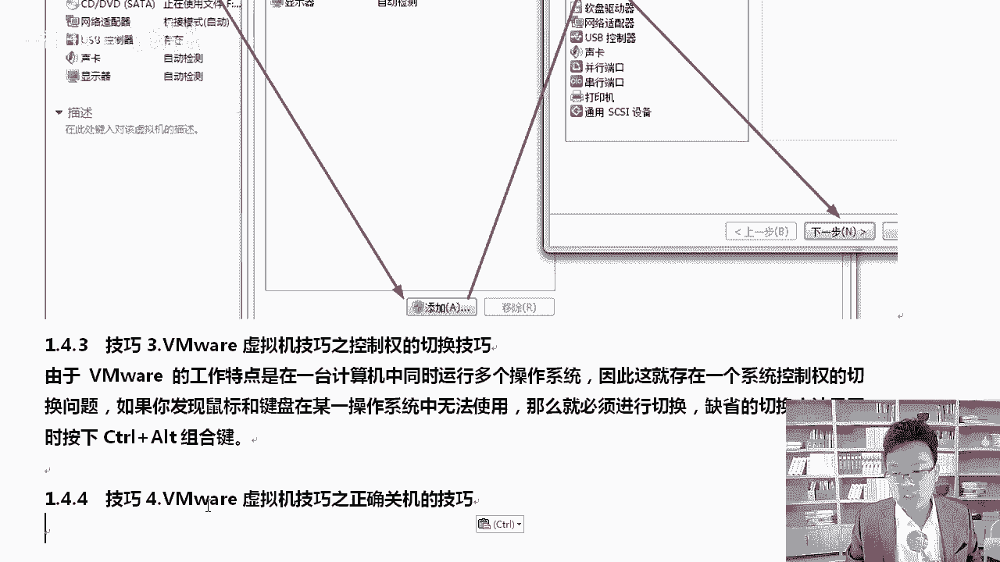

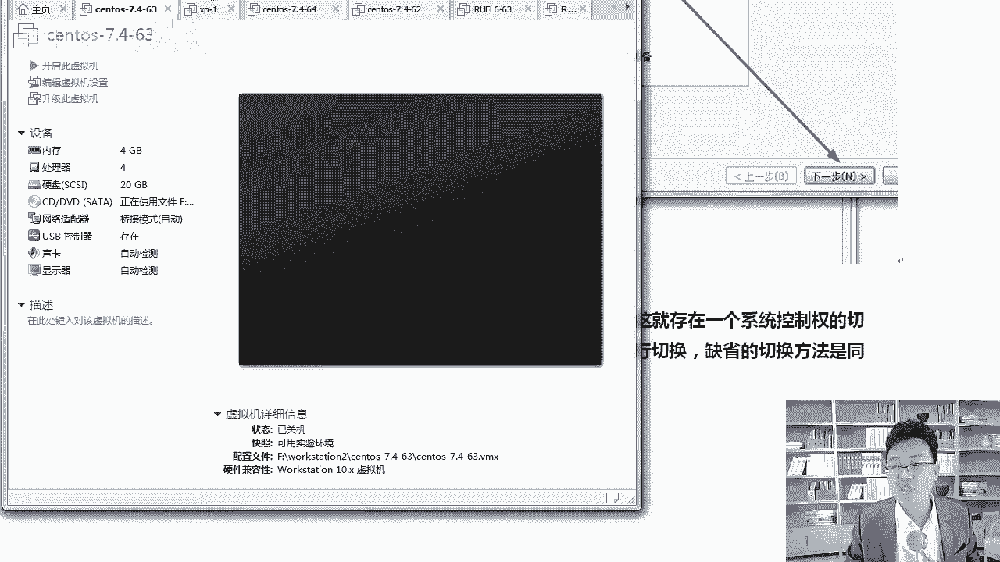

## 3. 控制权限切换

在虚拟机全屏或控制台界面操作时，有时需要将控制权从虚拟机切换回主机系统。

控制权切换的方法如下：
*   在图形界面中，通常可以直接将鼠标移出虚拟机窗口。
*   如果无法移出（尤其在文本界面下），可以按下 **`Ctrl` + `Alt`** 组合键释放鼠标。

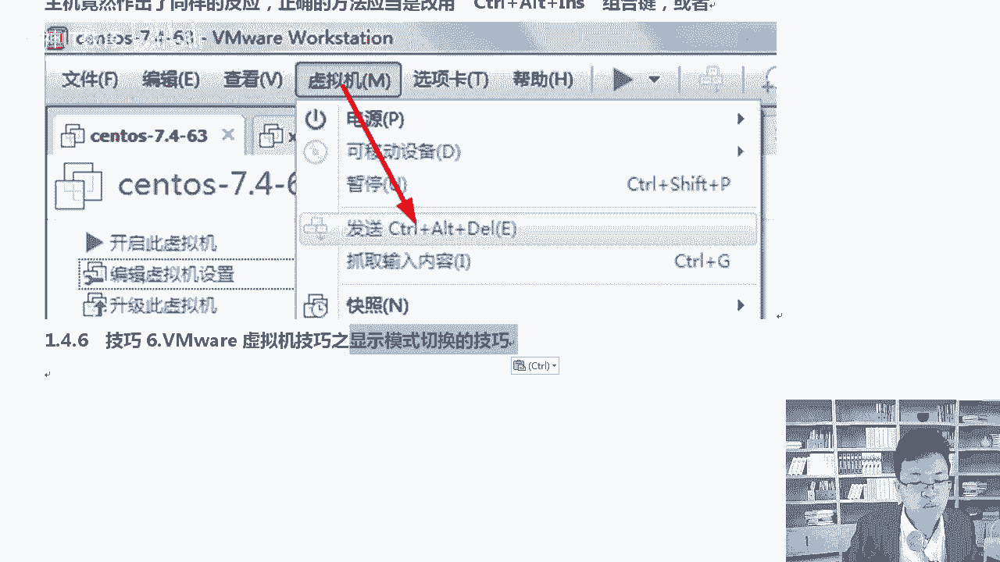

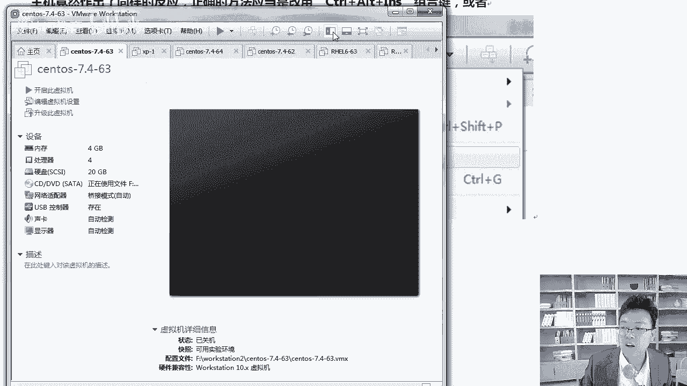

## 4. 正确关闭虚拟机

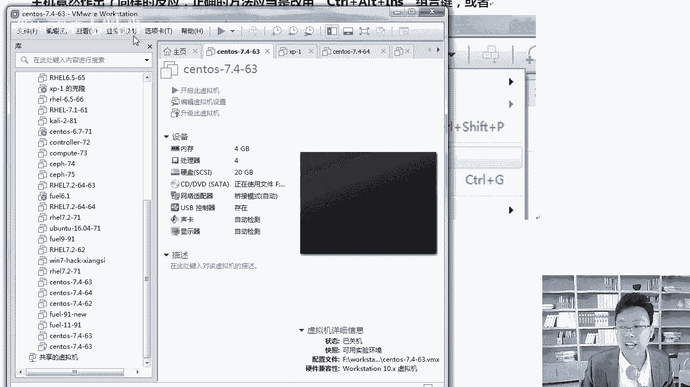

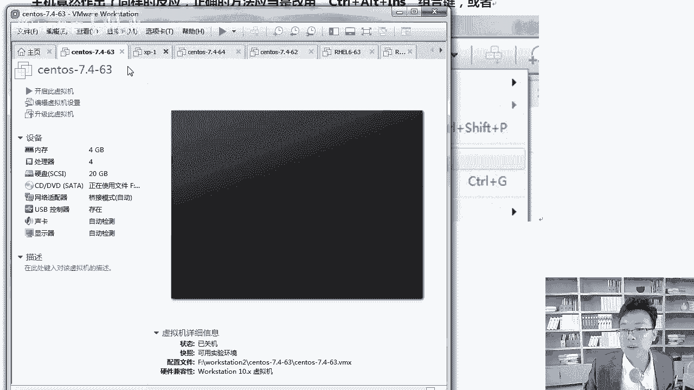

关闭虚拟机时，应尽量避免使用强制关机，就像关闭物理服务器一样，正常关机有助于保护系统数据和文件完整性。

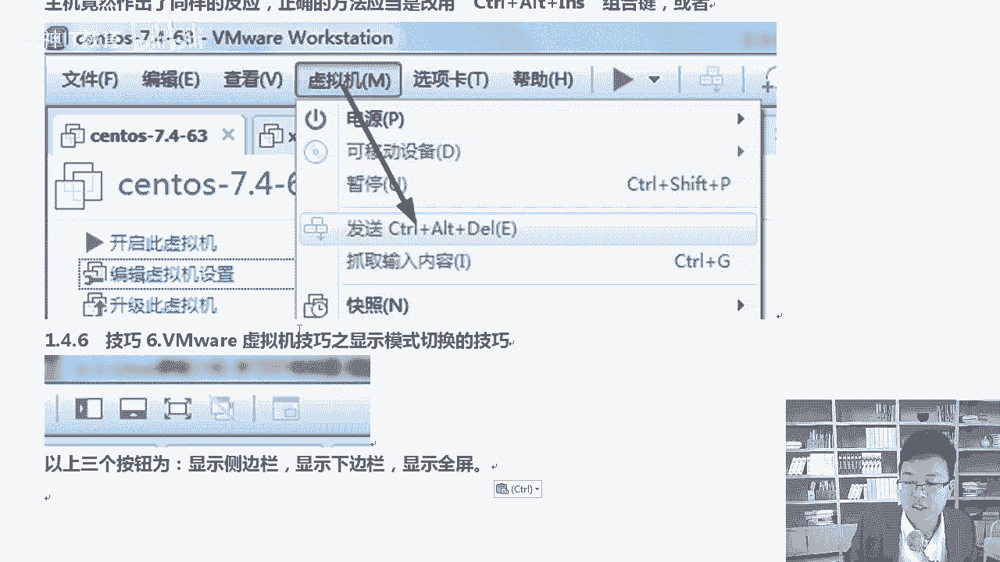

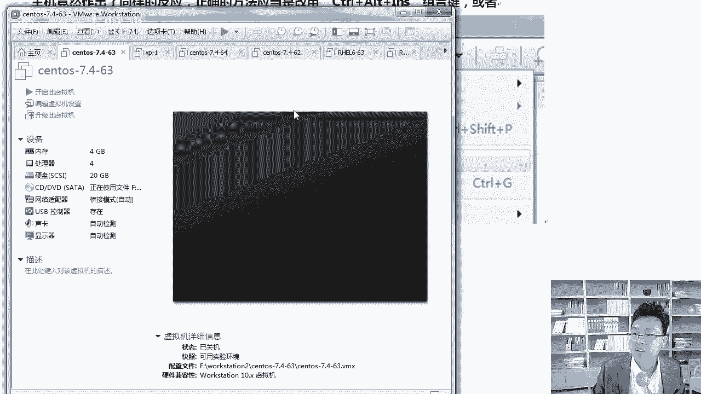

正确的关机方式是：
在虚拟机操作系统中执行关机命令。例如，在Linux系统中使用 `shutdown` 或 `poweroff` 命令，而不是直接点击VMware界面上的“关闭电源”。

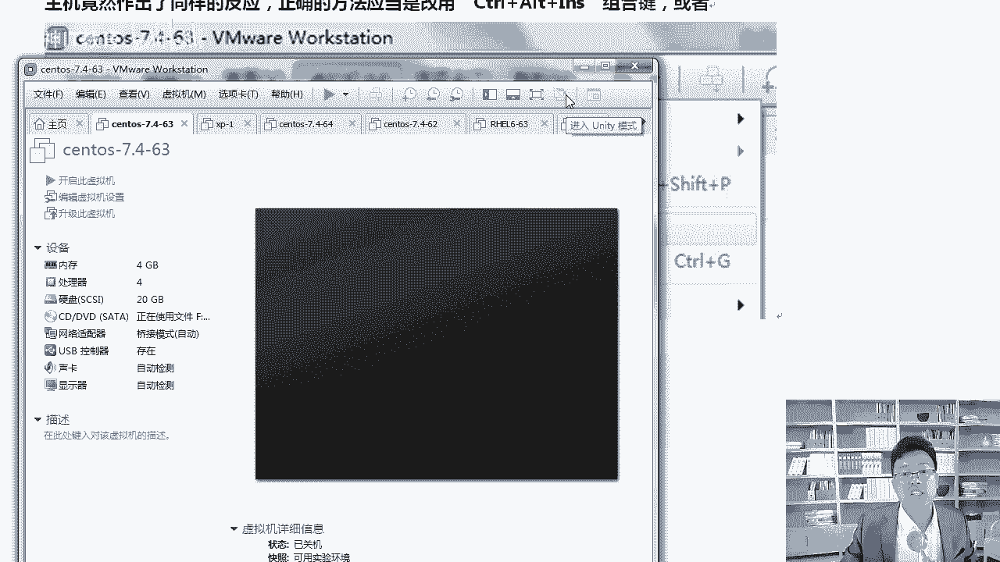

## 5. 发送组合键

有时需要向虚拟机发送特定的键盘组合键（如 `Ctrl+Alt+Delete`），但直接按下会触发主机的相应操作。

以下是向虚拟机发送组合键的方法：
*   使用VMware的特定映射：发送 `Ctrl+Alt+Delete` 可以按 **`Ctrl` + `Alt` + `Insert`**。
*   使用菜单功能：点击VMware菜单栏的“虚拟机” -> “发送 Ctrl+Alt+Delete”。

## 6. 显示屏幕与全屏切换

VMware提供了灵活的界面管理方式，方便用户在多台虚拟机间切换或获得沉浸式操作体验。

界面管理技巧包括：
*   **标签页切换**：已开启的虚拟机会以标签页形式显示在顶部或底部，点击即可切换。
*   **库视图**：左侧的库面板列出了所有虚拟机，可以方便地打开或管理。
*   **全屏模式**：点击“查看” -> “全屏”或使用快捷键进入全屏。将鼠标移动到屏幕顶部边缘会弹出控制条，可退出全屏。

## 7. 虚拟机网络模式

网络配置是虚拟机的关键。VMware主要提供三种网络连接模式，适用于不同场景。

以下是三种模式的简要说明：
*   **桥接模式**：虚拟机直接连接到物理网络，就像一台独立的物理机，与主机在同一局域网，需要配置同网段IP和网关才能上网。
*   **NAT模式**：虚拟机通过主机的网络地址转换共享主机IP上网。虚拟机之间、虚拟机与主机之间可以通信，但外部网络无法直接访问虚拟机。在此模式下，虚拟机通常应配置为自动获取IP（DHCP）。
*   **仅主机模式**：虚拟机与主机形成一个封闭的私有网络，虚拟机之间及与主机可以通信，但完全不能访问外部互联网。

## 8. 进入虚拟机BIOS设置

传统方式需要在虚拟机启动时快速按 `F2` 键进入BIOS，对时机要求高。VMware提供了更便捷的方法。

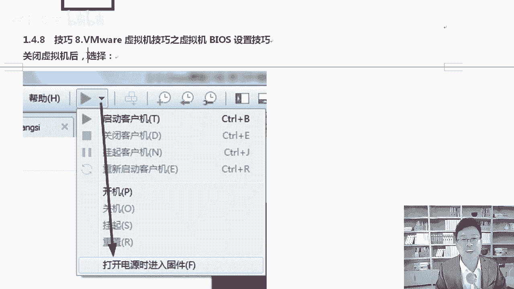

无需比拼手速的进入BIOS方法是：
1.  确保虚拟机关机。
2.  右键点击虚拟机，选择“电源” -> “启动时进入固件”。
虚拟机启动后将直接进入BIOS设置界面，可以在此修改引导顺序等设置（例如，使用 `+`/`-` 键调整设备顺序，按 `F10` 保存退出）。

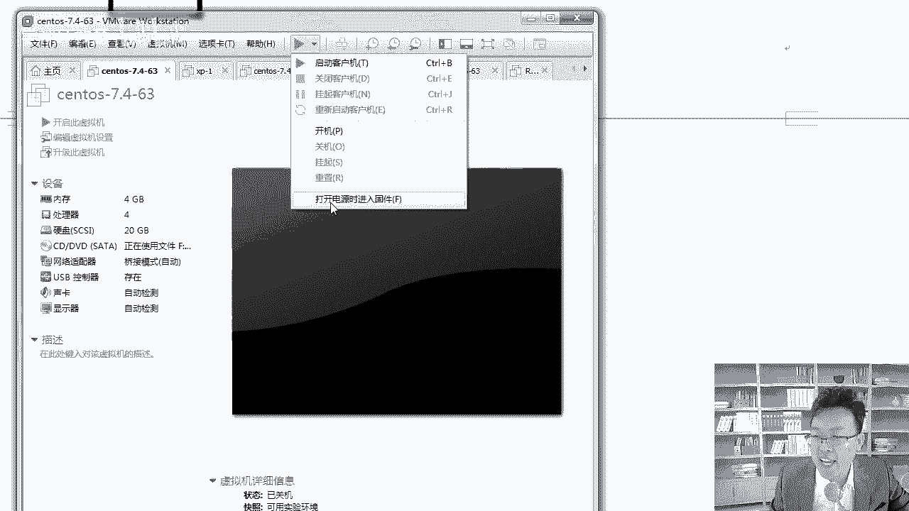

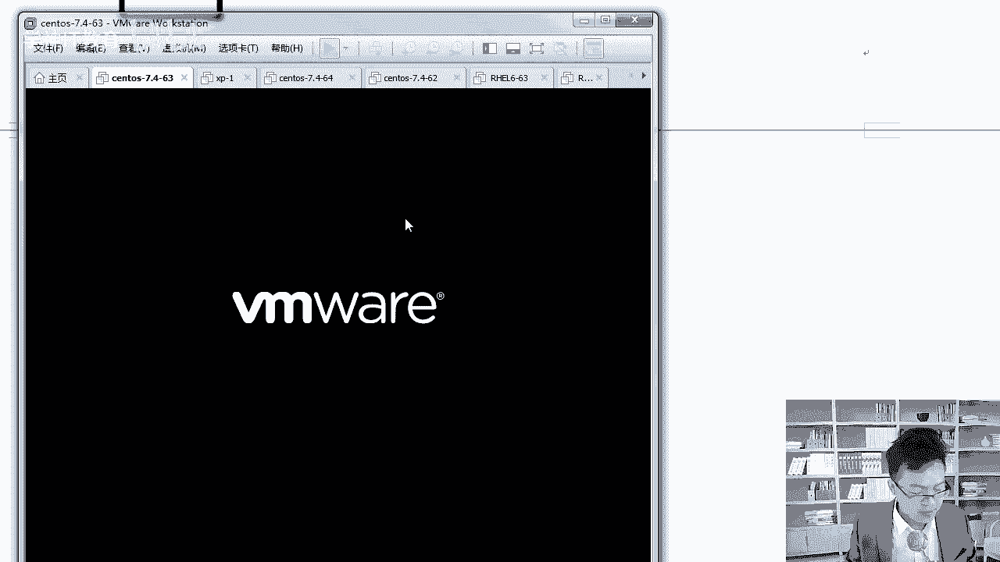

## 9. 安装VMware Tools

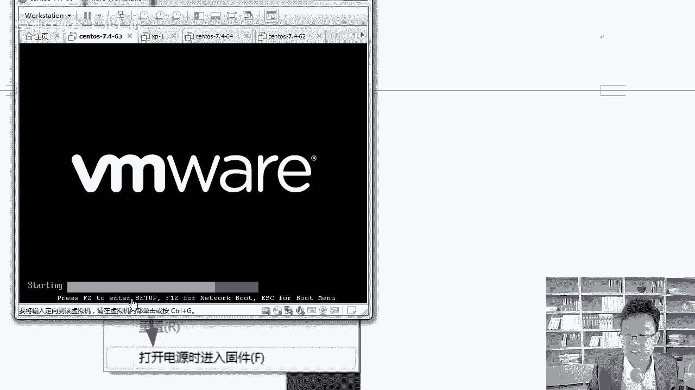

VMware Tools是一套增强工具，用于改善虚拟机的性能、显示分辨率以及主机与虚拟机间的交互体验。

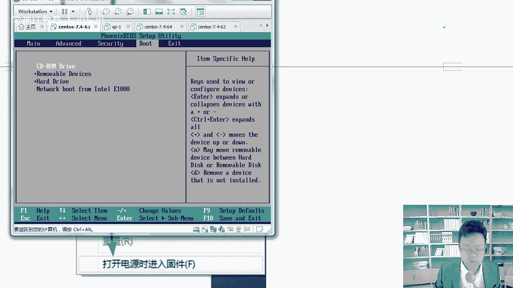

对于现代VMware版本和新版Linux系统：
*   许多系统（如CentOS 7/RHEL 7及以上）默认已集成并自动安装 `open-vm-tools`，通常无需手动安装。
*   如果遇到显示问题或需要拖放文件等功能，可以检查并确保 `open-vm-tools` 服务已安装并运行。

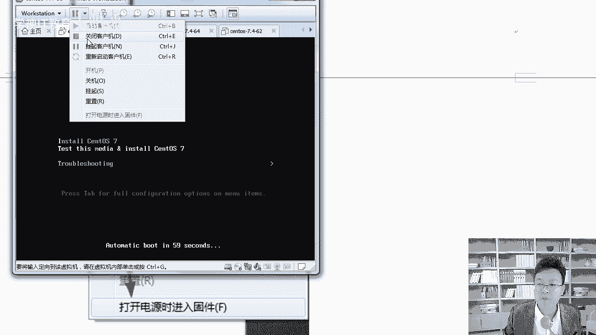

## 10. 挂载ISO镜像文件

安装操作系统或软件时，经常需要为虚拟机挂载ISO镜像文件。

挂载ISO镜像有两种方式：
*   **关机状态下**：在虚拟机设置中，选择“CD/DVD”设备，点选“使用ISO映像文件”，然后浏览选择本地ISO文件。
*   **开机状态下**：点击VMware窗口右下角的光盘图标，选择“设置”，同样可以连接或更换ISO文件。注意，如果系统正在读取光盘，直接更换可能导致错误。

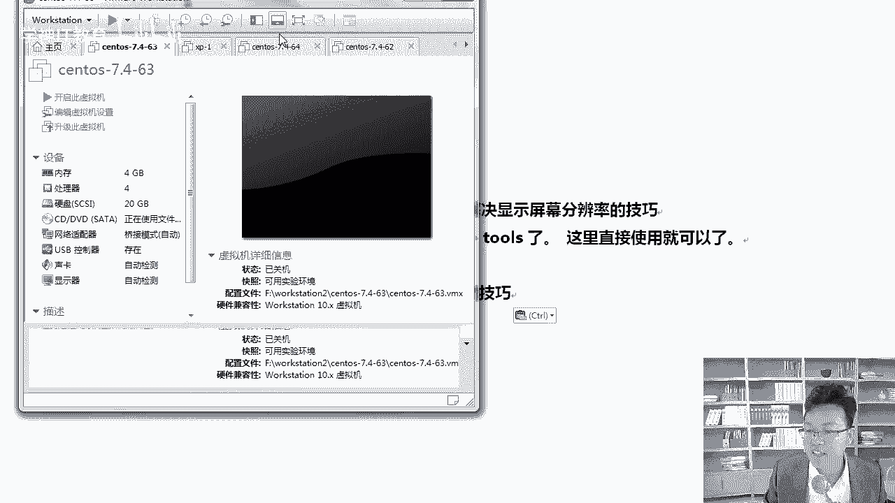

## 11. 删除虚拟机

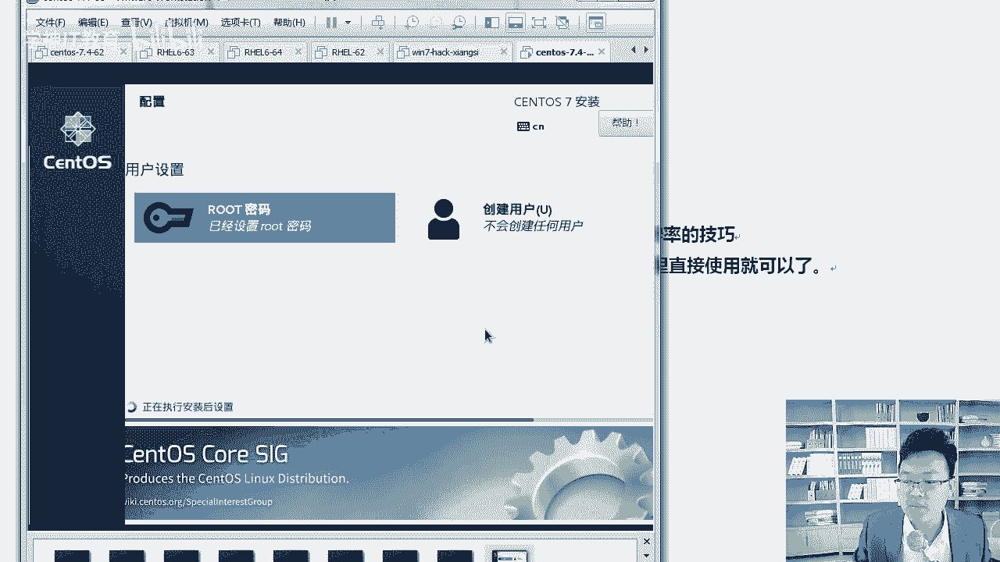

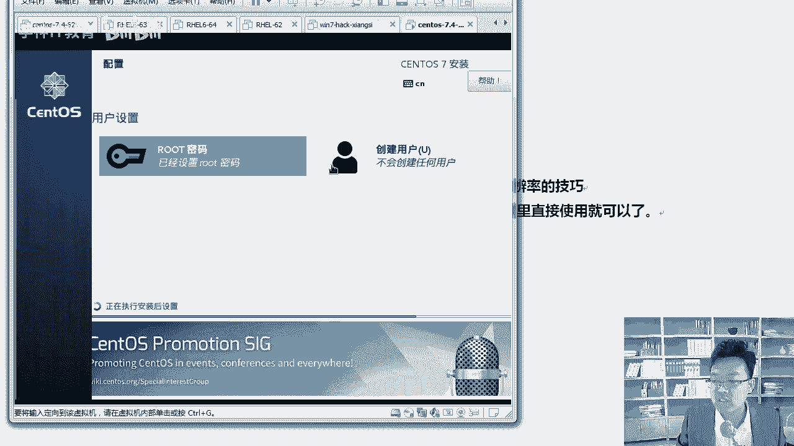

当不再需要某个虚拟机时，可以将其彻底删除以释放磁盘空间。

彻底删除虚拟机的步骤是：
1.  确保目标虚拟机已关机。
2.  在VMware库中右键点击该虚拟机。
3.  选择“管理” -> “从磁盘中删除”。
此操作会永久删除该虚拟机的所有文件，请谨慎操作。

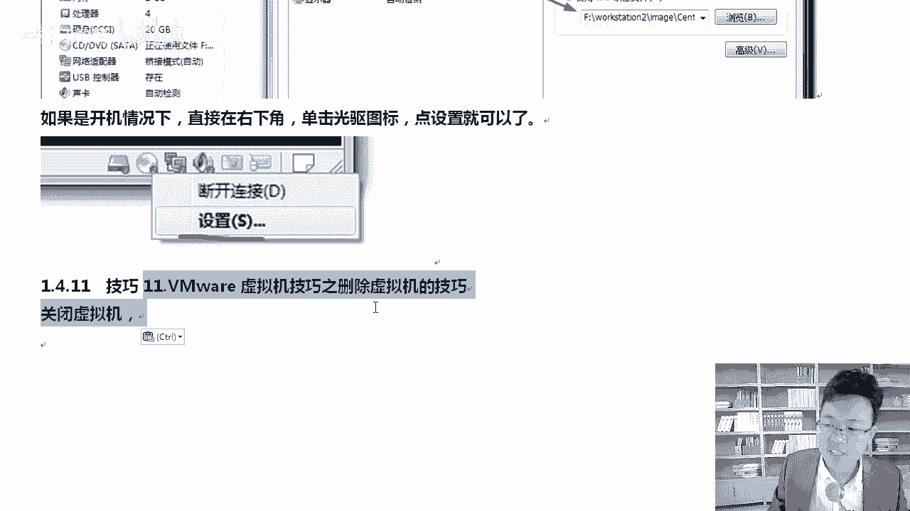

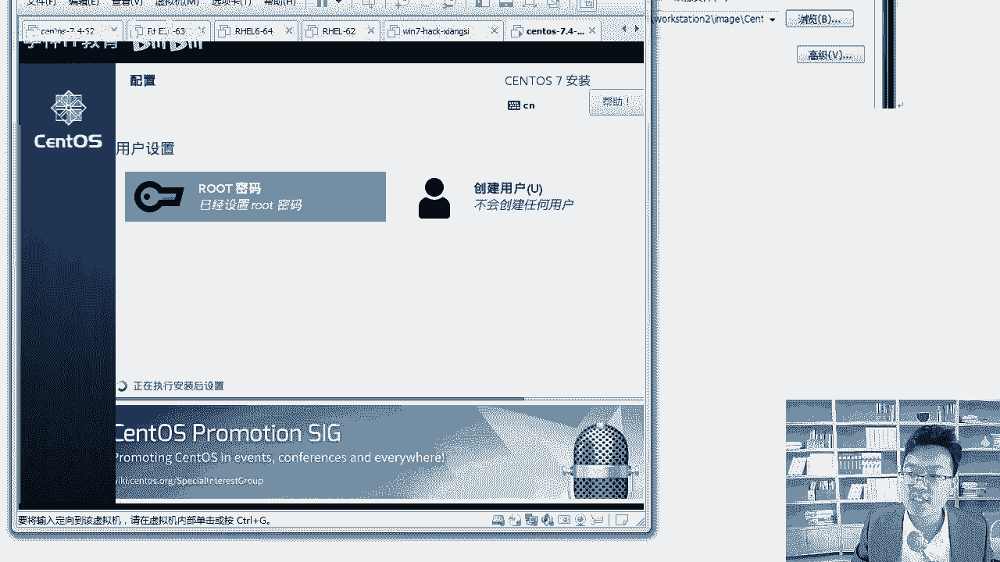

## 12. 使用快照功能

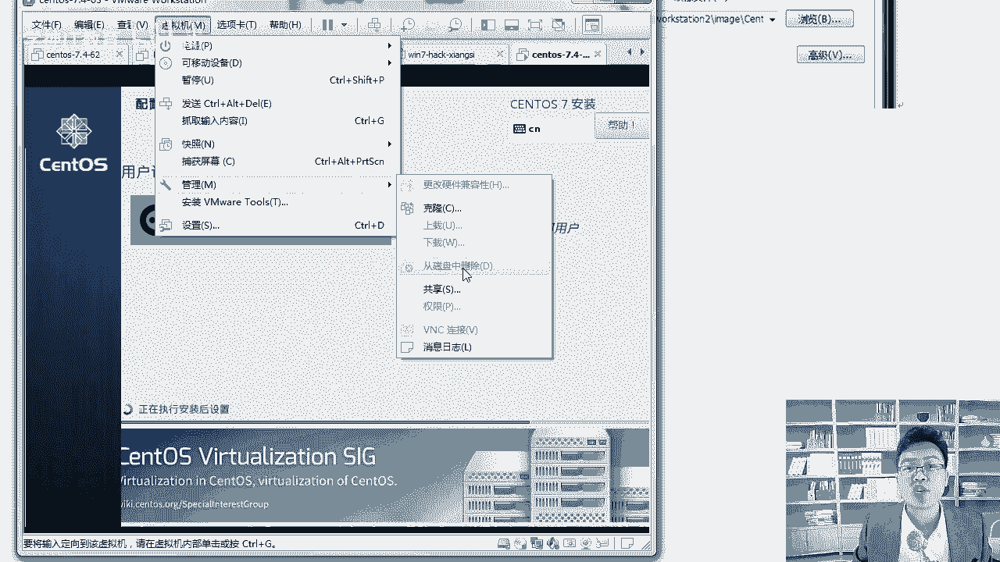

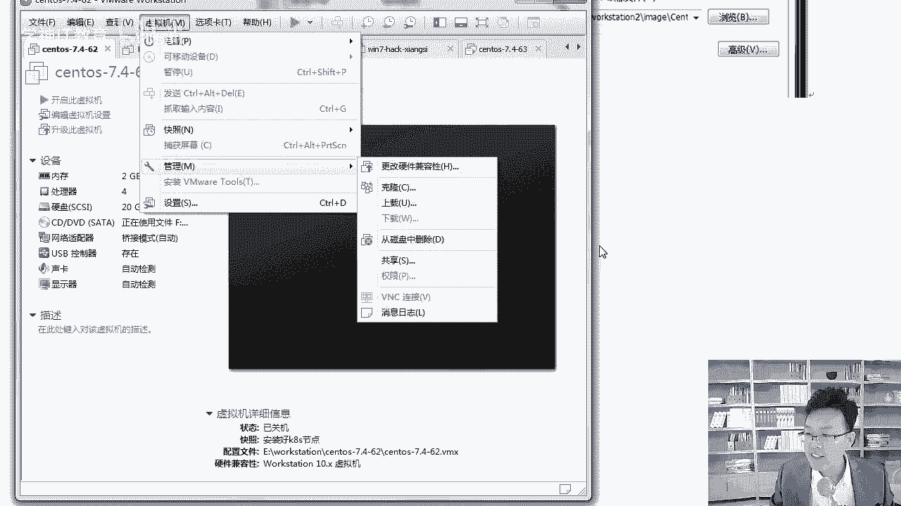

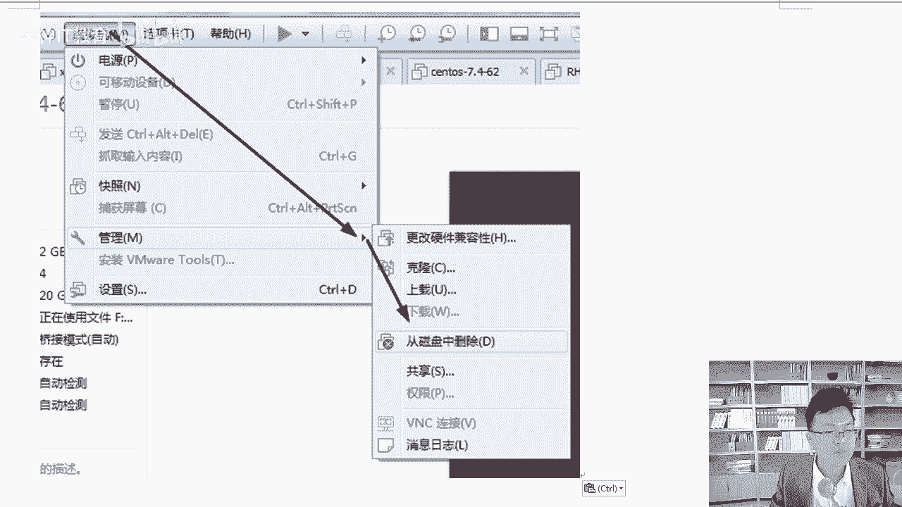

快照功能是VMware最实用的特性之一，它可以保存虚拟机在某个时间点的完整状态，便于在系统出错时快速还原。

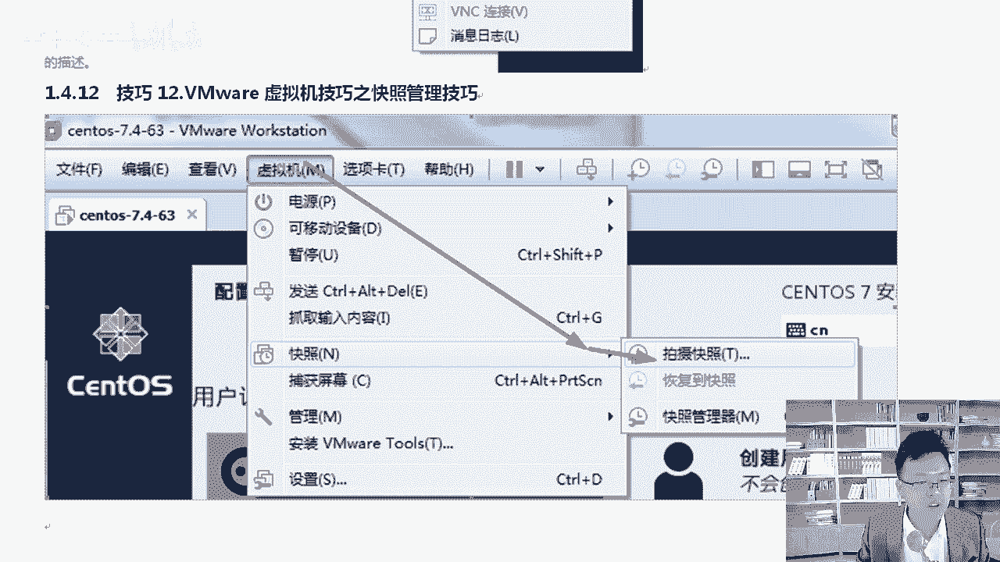

创建和使用快照：
1.  在虚拟机处于理想状态时（如刚安装好系统并配置完网络），点击菜单栏的“虚拟机” -> “快照” -> “拍摄快照”。
2.  为快照命名并添加描述，然后点击“拍摄快照”。
3.  当系统出现问题时，可以通过“虚拟机” -> “快照” -> “恢复到快照”来快速回到之前保存的状态。

---

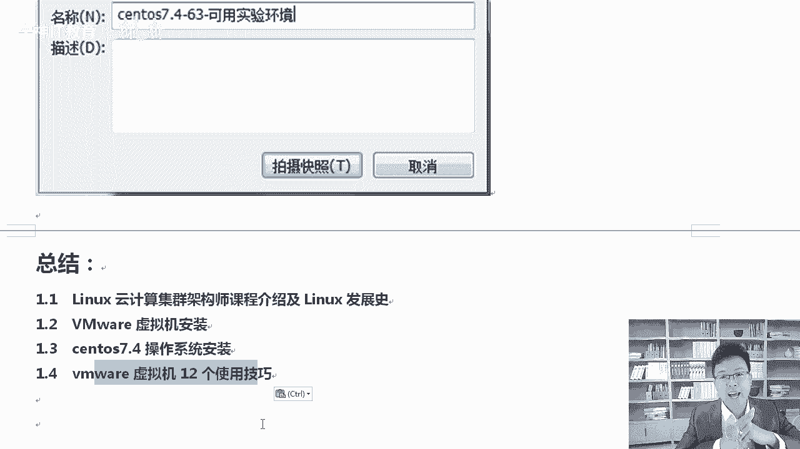

本节课中我们一起学习了VMware Workstation的十二个核心使用技巧，包括硬件调整、网络模式配置、系统控制与维护快照等。掌握这些技巧，能够让你更高效、更安全地管理和使用虚拟机，为后续的Linux命令学习和系统运维打下坚实的基础。