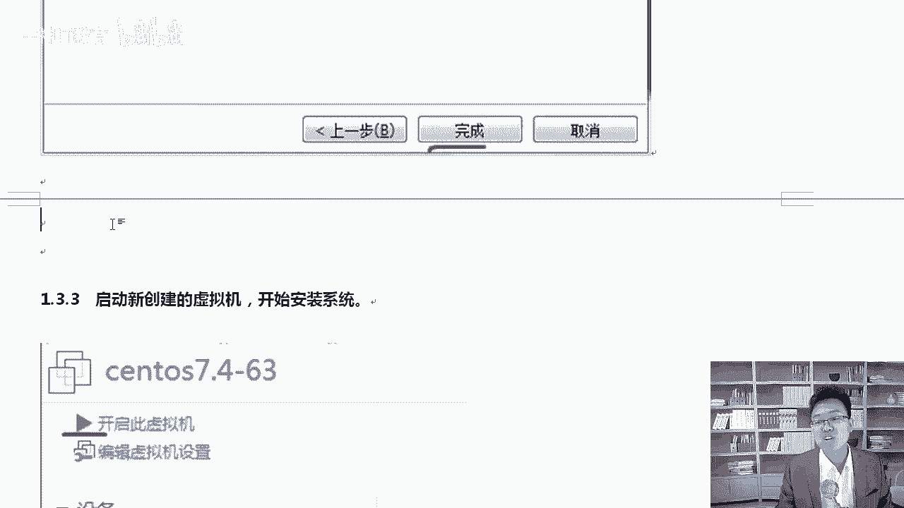
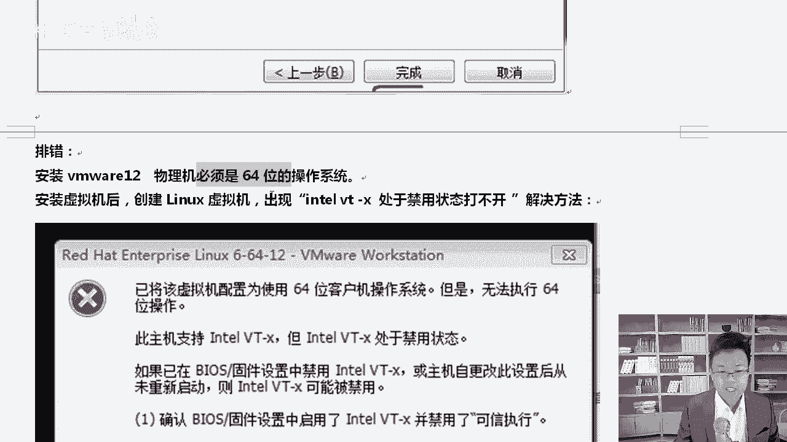
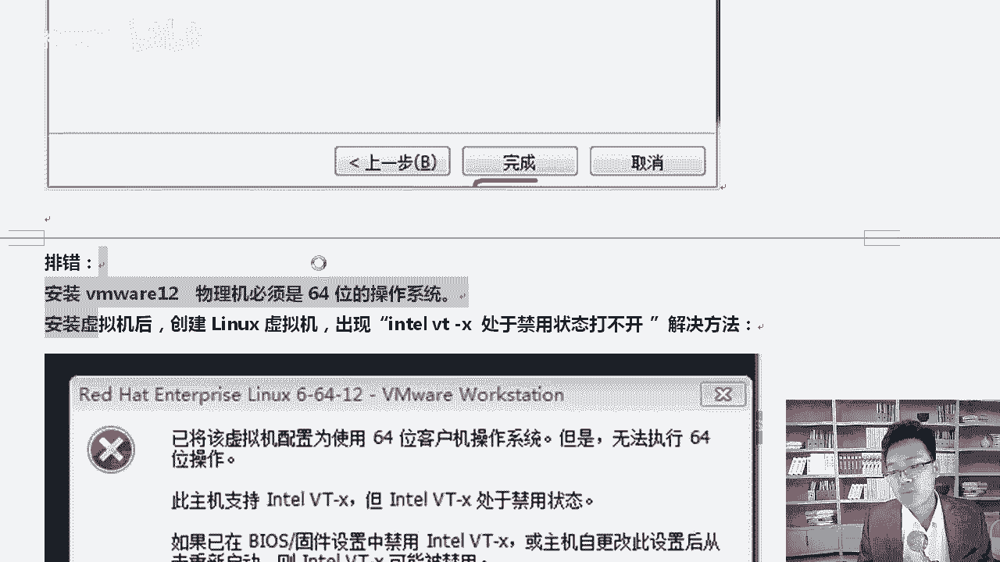
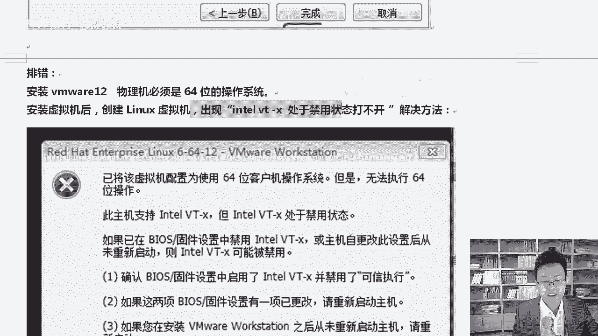
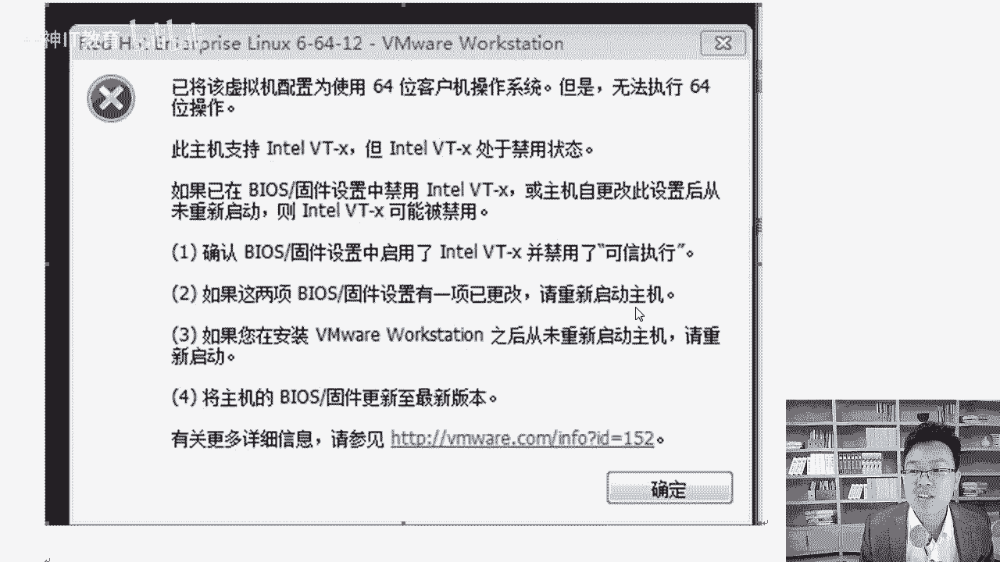
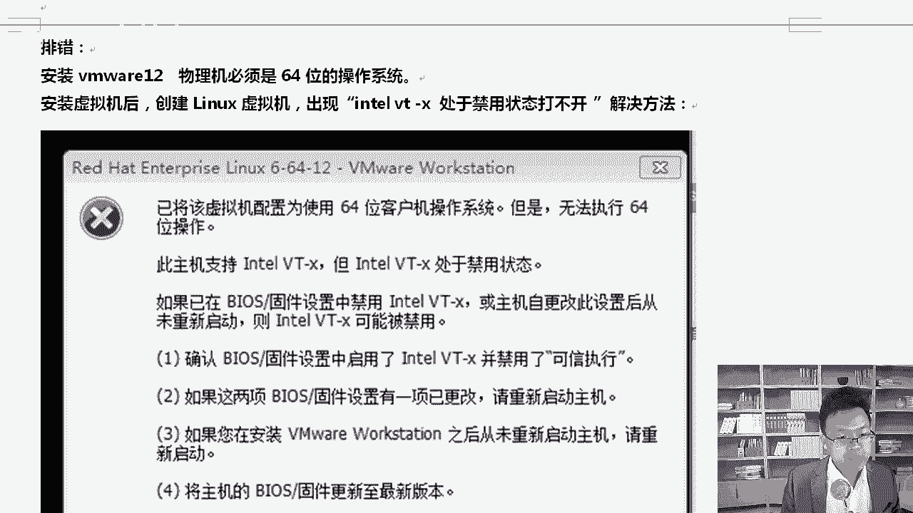
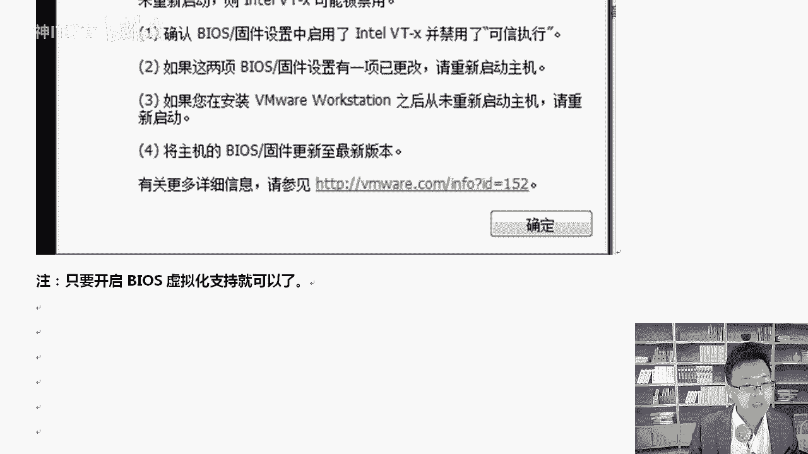
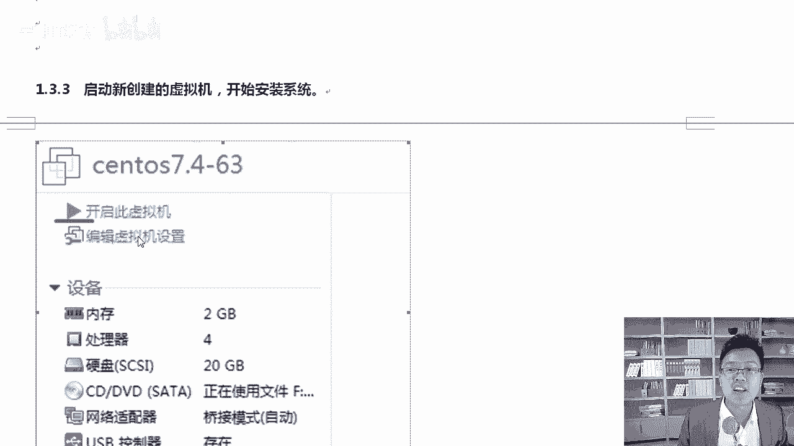
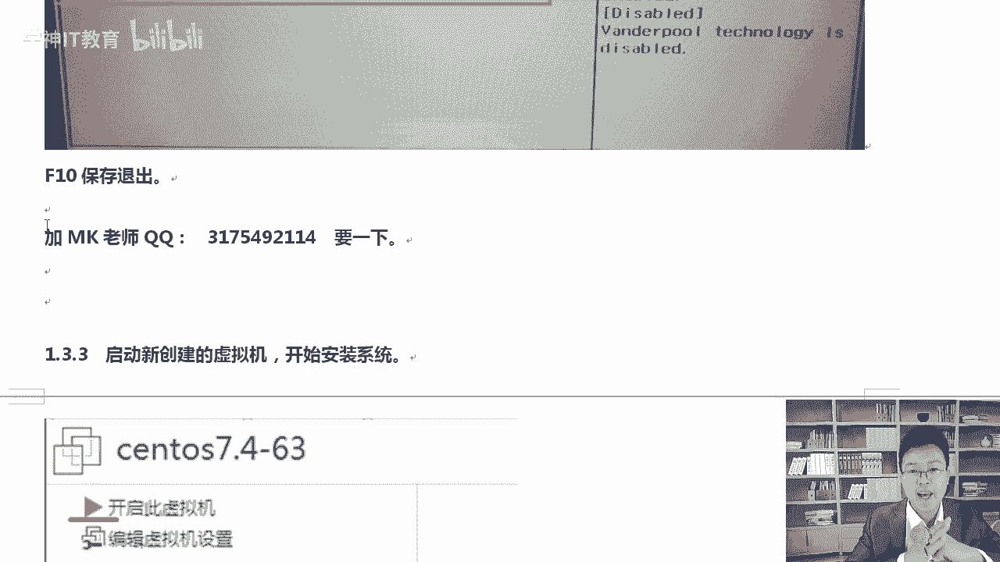

# RHCE红帽认证课程：P4：解决VMware安装报错 - Intel VT-x处于禁用状态

## 概述
在本节课中，我们将学习如何解决在VMware中安装虚拟机时，因“Intel VT-x处于禁用状态”而导致的常见报错。我们将从问题原因入手，逐步讲解在两种不同类型的BIOS中启用虚拟化技术的具体步骤。

## 物理机系统要求
在开始解决VT-x问题之前，必须确保物理机满足一个基本前提条件。

物理机必须安装64位操作系统。因为我们将要安装的Linux系统是64位版本，而32位的物理机系统无法运行64位的虚拟机。

## 常见报错与原因分析
上一节我们明确了物理机的系统要求，本节中我们来看看安装时最常见的报错及其原因。

在创建虚拟机时，你可能会遇到一个错误提示：“此主机支持Intel VT-x，但Intel VT-x处于禁用状态”。这个错误意味着你的CPU虽然支持硬件虚拟化技术（Intel VT-x），但该功能在计算机的BIOS/UEFI设置中被关闭了。

## 解决方案：启用BIOS/UEFI中的虚拟化功能
理解了报错原因后，解决问题的核心思路就很明确了：进入计算机的BIOS或UEFI设置界面，找到并开启虚拟化功能。开启后保存设置并重启计算机即可。

根据计算机主板的新旧程度，BIOS界面主要分为两种类型：新型的图形化UEFI界面和传统的文本式BIOS界面。

以下是两种界面的具体操作步骤。

### 对于新型UEFI BIOS
新型计算机通常采用图形化的UEFI BIOS界面，操作更为直观。

1.  重启计算机，在启动时按下特定键（通常是 `Del`、`F2`、`F10` 或 `Esc`）进入UEFI设置界面。
2.  进入界面后，寻找并点击“高级模式”或类似选项。
3.  在高级菜单中，找到名为 **“Intel Virtualization Technology”**、**“Intel VT-x”**、**“Virtualization Technology”** 或类似的选项。
4.  将该选项的状态从 **“Disabled”**（禁用）更改为 **“Enabled”**（启用）。
5.  保存更改并退出，通常可以按 `F10` 键，然后选择“Yes”确认。

### 对于传统文本式BIOS
较旧的计算机可能使用蓝底白字的传统BIOS界面，选项布局有所不同。

1.  重启计算机，按相应按键进入BIOS设置。
2.  使用键盘方向键，在顶部菜单栏中找到 **“Configuration”**、**“Advanced”** 或 **“Security”** 等选项卡。
3.  在这些选项卡下，寻找名为 **“Intel Virtual Technology”** 或 **“VT-x”** 的选项。
4.  选中该选项，按回车键，将其值从 **“Disabled”** 修改为 **“Enabled”**。
5.  最后，移动到 **“Exit”** 选项卡，选择 **“Exit Saving Changes”**（退出并保存更改），或按 `F10` 键保存。

## 总结
本节课中我们一起学习了如何解决VMware安装虚拟机时遇到的“Intel VT-x处于禁用状态”错误。我们首先确认了物理机需要64位操作系统，然后分析了报错原因在于BIOS中的虚拟化功能未开启。最后，我们分别介绍了在新型UEFI BIOS和传统BIOS中启用 **`Intel Virtualization Technology`** 选项的具体步骤。完成设置并重启后，即可正常创建虚拟机。遇到问题不必慌张，按照教程逐步排查即可解决。