# RHCE红帽认证课程／自学必备／云计算／RHCE／Linux运维 - P1：Linux云计算集群架构师课程介绍 - 学神科技 - BV16V411B7AY

好，大家好，我是学生IT讲师MK，欢迎你来听我的课程。那么MK首先做一个自我介绍啊，这是我的QQ号MK是什么意思啊？MK呢它是这样的啊，他是我MK当年上学的时候经常用的一个英雄角色，就是这个啊。

山丘之王啊，在这里我想跟大家说的是呃玩游戏这个事，大家上学的时候稍微玩一玩就可以了。那么步入社会了以后，你更应该像一个真正的男人一样是吧？去扛起属于你的那一片天，好不好啊？什么英雄联盟了啊，王者荣耀了。

大家少玩一下，包括吃鸡啊，一样少玩一下，后面是吧就4个月的时间跟着我一块走入linux这个世界啊，MK要带着你是吧？通过linux来拼出一片天，好不好？加油啊，同学们，我们来开始看看MK的战绩啊。

这不是我玩游戏的战绩啊，这是MK啊，做我的一个介绍啊，以前MK是做神州数码啊，跟新浪那块做运维，后来是做。讲师这一块啊，这是我的RHCE的一个证书。那个时候是red hardwood啊。

以前我们做运维的时候更多用的是s腾S4啊这样的一个系统。还要往下继续啊，这个exer20是opent私有银架构师的一个证书啊，这是老师的名字啊，申建明好不好？啊，这是我真实的名字啊。

RHC是红帽顶级架构师的一个证书啊。RHC是红帽顶级架构师的一个证书。证书上签字这位是红帽的创始人。那MK到底长什么样子呢？我们来看一下以前的一些照片啊，年轻时的一张照片啊，这是MK年轻时的一张照片。

那么站在身边的这个老外是谁啊？对他就是在你RHC架构师上面签字的那位。

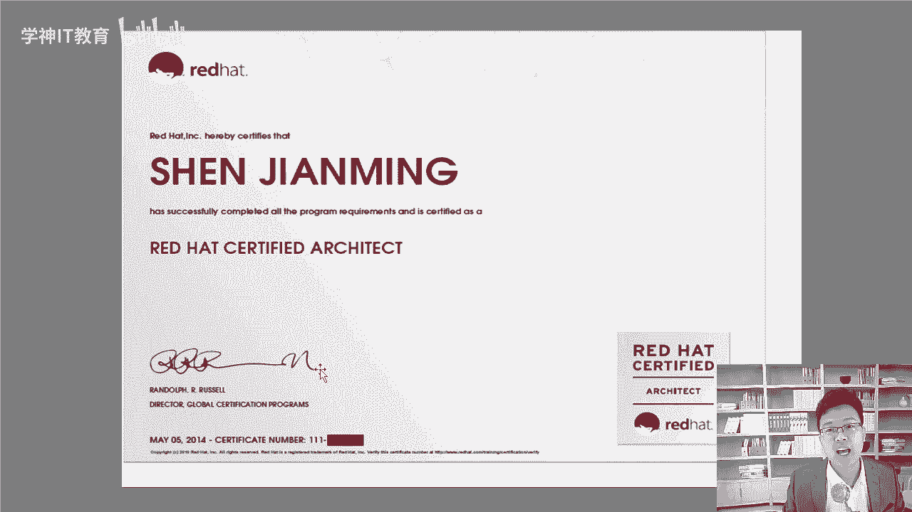

O那么这一张是我们当时来自于全国各地的IHC讲师一起做的一次合影。你像这个jackie是吧，他是来自于台湾的一个老师，还有两位是来自于香港晚上啊晚上赶飞机的时候就飞回去了。

我想跟大家说的是希望大家通过这一张照片里能看到一些正能量什么正能量啊？就是搞IT这个行业，他是不分年龄高低的，他只分技术水平高低，只要你们肯努力啊，拿到2万块钱以上是很正常的一件事，明白了吧？

其实每个人都挺拼的啊，你包括这个地方，如果新系的同学应该能看到啊，红帽创始人啊，那应该是多么啊多么有身价的一位是吧？一为大牛王，你看背后是什么圣诞树是吧？那在圣诞前夕的时候是吧？啊，那么他要出出啊。

来美国是吧，来中国出差一下，还有是吧？还要为了自己事业去拼搏，所以我们更应该去好好努力了啊，大家跟着我除了你学到一些技术，我更多能希望你学到一些正能量。好不好？好的，那么再往下还有学神的一些证书啊。

我们来快速的看一下，包括咱们是腾讯课堂啊，云计算和大数据类目唯一认证的一家机构啊，所以这样的话你可以更加放心的去跟着咱们一起学。那么2016年最具影响力奖。15年咱们获得的是最具啊欢迎奖，最受欢迎奖。

16年是最具影响力奖啊，有同学哎，老师14年你怎么没获奖呢？啊，因为14年腾讯还没有举办这个颁奖仪式，好不好？我相信17年咱们也可以获得一个最具影响力奖啊，因为17年咱们啊教学质量这一块也做的挺棒的。

再往下还有什么还有这个啊这是啊去年年底咱们可以颁奖的时的一张照片。好，说完这个我们来简单的快速看一下啊，那我把这些知识啊，给大家串输一下，好不？首先这个云计算集群架构式啊，我们先看一下这个地方。哎。

这个linux是在什么上跑的，大家知道吗？因为来听我课程的同学，可能有一些是没有linux基础的对吧？我们来看一下啊，我会从头开始啊，从linux是什么开始带着你这样的话你一定能学会好不好？

来我们来看看啊，首先linux它是一个操作系统。那么它运行在什么上呢？linux是运行在这个服务器上的好不啊，这是一款EU的服务器。EU是什么EU指的这个厚度好啊，指的是厚度大概是4。45厘米啊。

也就是三根手指这么啊这么宽的一个厚度O那么DIY就是do it yourself自己啊自己组装一下后边硬件知识，我也会给大家说好不好？那么再往下还有什么？还有刀片服务器上也可以跑我们的linux好不好？

还有什么啊2U这样服务器，包括是吧？只是惠普的啊，惠普的J8系列的G9系列的，还有J10系列的啊，那么这里是2U的一个服务器。2U的话，明显感觉这个厚度有。

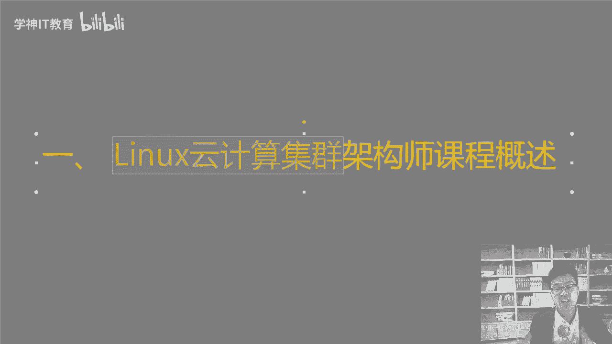

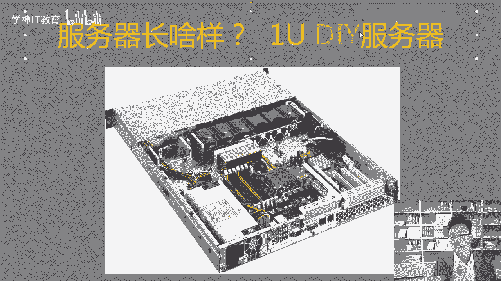

宽了好多，对不对啊，这是一个二路的啊二路的1个CPU。那么知道了这个以后呢，我们来看一下，哎，二路是什么？我画一张图跟大家说一下好不好？你们知道二路是什么意思吗？

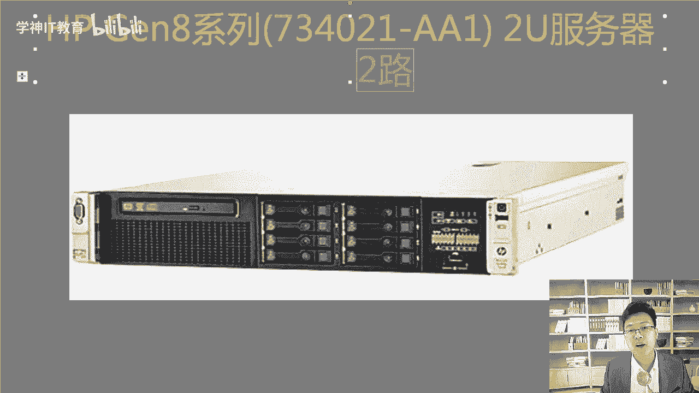

是这样的啊，以前我们的CPU上有几块主板，是吧？主板上有几块CPU。啊，有几块呢在这里是不是只有一个呀？一个主板上只有一款CPU对不对？那么如果你是二路的话，那么你可以放两个物理的CPU好吧。

如果其中一个是8核的话，那么两个合起来就是十6核心，这样的话效率就好性能就会大大的提升。

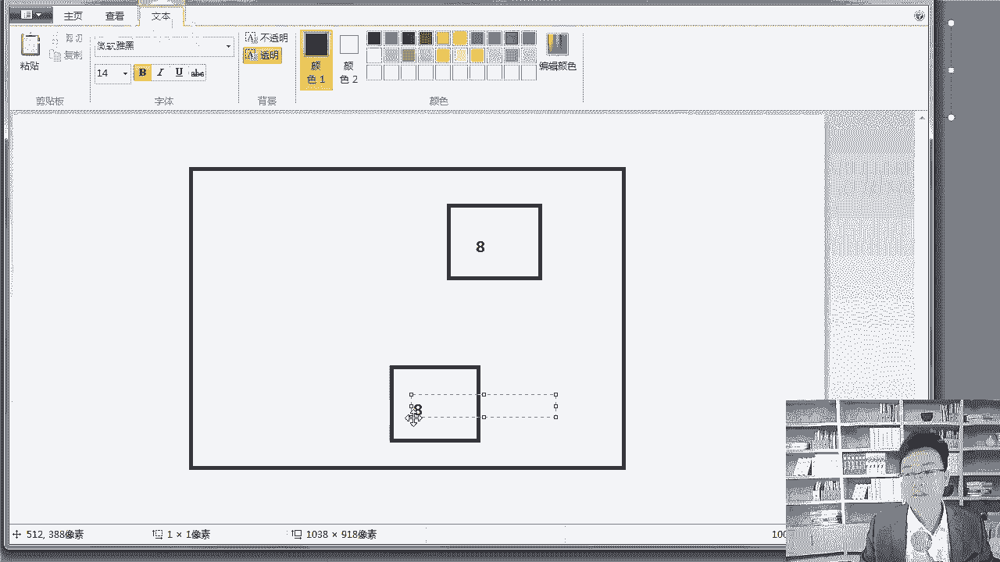

理解了吧？这个叫双路，那自然还有四路啊，四路的话，效啊，它的这个威力啊，它的性能就更强了。那么这样呢个大概一个G8系列啊，这样的一个台机器是多少呢？是1。98万，G9系列现在也是1点啊7万或者1。

8万这样的一个报价差不多都是这样的。好吧？那么在这里嗯我来跟大家说一下啊，它这个地方啊，贵还是不贵啊？有同学好像不到2万块钱也不是很贵是吧？

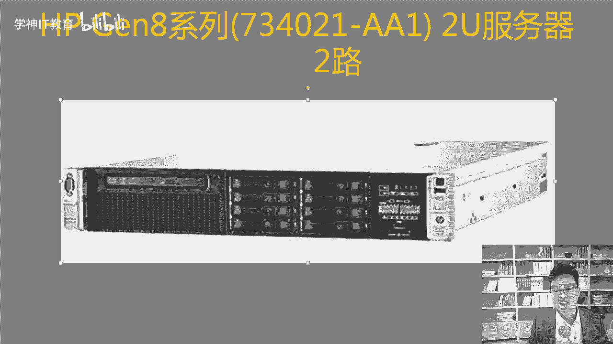

那你要看一下它的具体配置啊，你看俩U没有问题。这个你看这个地方写的是E52620E是什么东西啊啊，E5在这个地方大家可能觉得哎，老师我以前的CPU是吧？I7不是挺牛的嘛，是吧？啊。

或者说I5不是也挺牛的吗？咱们这个E系列是叫什么？对，E系列这个叫做志强。

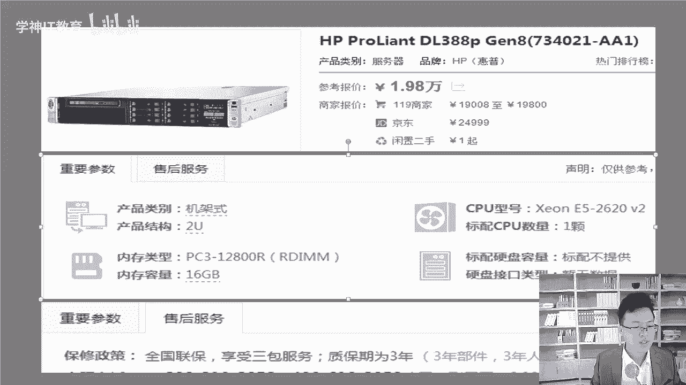

好吧，对，这个叫志强系列的CPU清楚了吧。E系列这个叫志强系列的CPU啊，它可以有一个特点，就是我可以两个两个大脑同时工作，两个物理CPU一起工作，知道了吧？而你的I7能不能两个一块吧？

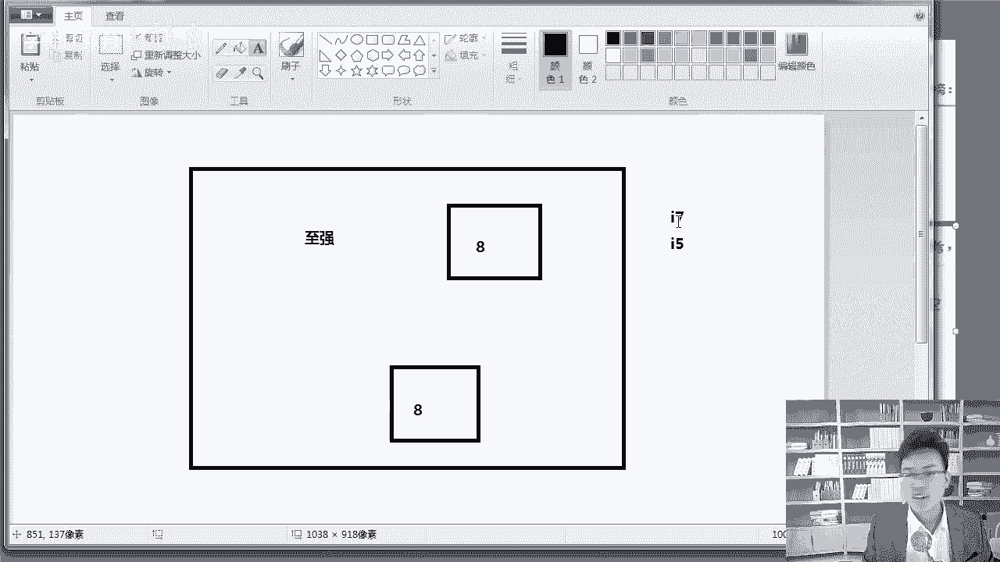

没有好吧好，所以这个要知道啊，这是服务器专门用的。那么在这里你可以看到它只有一个啊，只有一颗啊，你还需要再花个2000到3000块钱再配一颗。那么在内存这个地方是16GB16GB的话。

这个叫RDIMM内存。啊，以前大家只知道是吧啊，16啊8G16G或者DD23DD24从来没听过这个这个叫带寄存器的啊内存服务器一般都是使用带寄存器啊，带ECCC校验这种功能的内存啊，都要用这种。然后呢。

硬盘这个地方是吧？没有配啊，它用的是ss盘一块sars盘的话大概是。2000块钱啊，如果你要把这8块全都配满，就16000。16000加上这个将近2万36000，再加一块CPU。是吧。

2000块钱将近4万块钱。所以不便宜是吧？当然人家也好啊，因为你是品牌机嘛，品牌机的话，你看有有很多啊，比如说三年部件，三年人工，三年现场。好不好啊，这个地方我们清楚了啊，呃知道这个以后呢。

我们来说一说什么。😊，啊，linux的诞生那么说到lininux诞生这个地方，我们得先得说说他的大哥谁呀？unix啊，我们得先说说unix啊，69年的时候，unix操作系统诞生。

它主要有贝尔实验室和谁呀？贝尔实验室两个大牛叫肯汤姆森和丹尼斯里奇啊，两个大牛一起啊，我们看看它长啥样啊，贝尔实验室大家应该听过吧。

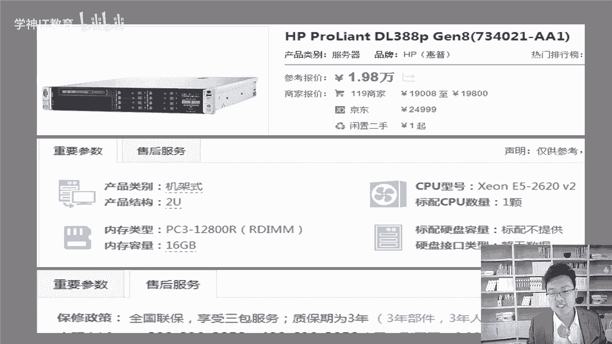

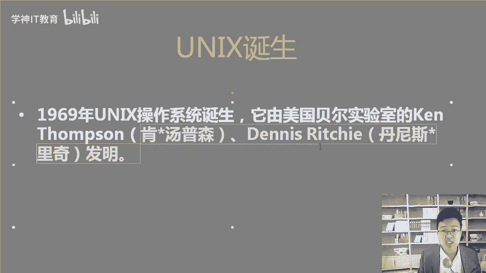

啊，很多是吧，你看电话了，数字计算机、晶体育管啊，卫星是吧，甚至信息论啊，包括unix操作系统都是贝尔实验室诞生的。这个贝尔实验室啊，它就是一个科研机构，就这个有点像像我们当下是吧？马云搞的那个叫。

达摩学院。啊，跟这个有一拼，知道了吧？那么unicux系统69年的时候，你可以看到。当时的那个计算机还是很大的啊。清楚了吧，一台小型机啊，还不是叉86这样的一个架构。

一堵墙这种方式来两个大牛长什么样子呢？长势这样。

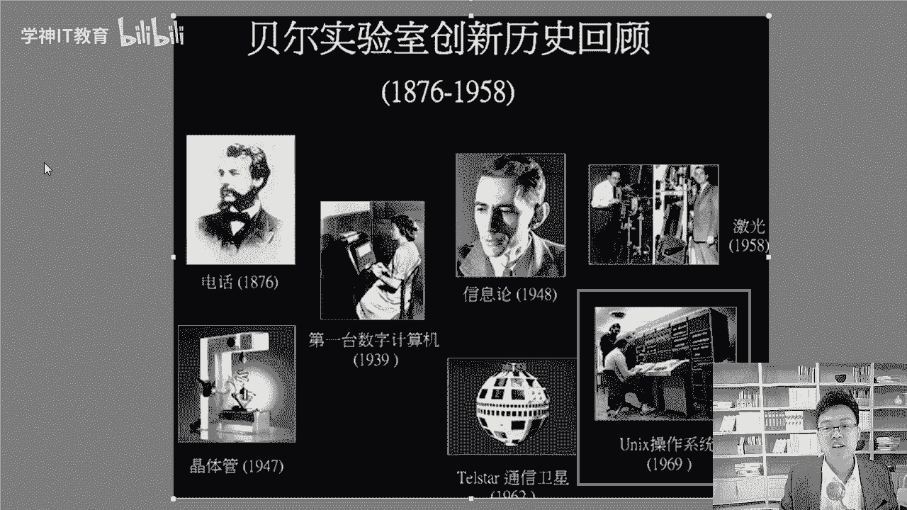

哎呀，看到了吧？啊，长成这个样子。然后呢，他们写完unix操作系统以后，又干了一件很了不起的事儿，就是C议员。啊，C元就是人家两个人是吧？怎么样搞出来的。啊，72年的时候，C议元诞生。啊。

然后73年的时候，unix用C语言改写完成。哎，叶同超老师为什么要重新搞一个呢？重新写一遍呢？因为是吧最开始这个语言unix系统它是用汇编语言写的，而汇编这个东西啊，它跟硬件息息相关，知道吧？

也就是说你换了CPU架构了就跑不了了。啊，就像我们现在好像无所谓是吧，比如win7的系统在inter尔的CPU上可以跑，在AMDCPU上也可以跑。然而那个时候不行，汇编语言是吧，跟硬件息息相关。

你在这个CPU型号能跑放到另一个，甚至放到另一个厂商，它就跑不了。所以这个时候说不利于系统的推广。😊，对吧不能说换一次硬件，就得重新写一遍操作系统啊，那这个时候是吧？创造了C语源。

C语言可以使它硬件跨平台，知道吧？那么兼容了其他的硬件。好，那这个时候我想跟大家说的是C语源也是他们俩写的，是吧？其实跟大家讲这个发展史，除了让大家对这个技术有一个来龙去脉的认识，我更想列举一些大牛。

让大家。哎，给大家树立一个很好的一个榜样。好吧，因为榜样的力量是无穷的。对吧你想想C语言都是人家哥俩创建的。现在我一问啊，什么语言最难学啊，很多大学生的时候都说哦，C语言最难学。😊，啊。

其实大家心里应该知道是吧？人家都做出来这一个东西啊，现在只是让你用一下，已经不难了。好不好？已经不拿了，所以大家。不是你学不会，不是思眼难，是你用心没有用心，你努力的程度还不够。懂我意思了吧？

所以要加把劲儿，好吧，要加把劲儿啊。好，那么在这里我们来往下继续。那么unix史上的百家争鸣啊，unix发展史上的百家争鸣什么意思呢？73连拿unix拿C元写完以后呢，没人会使。好吧。

只有你哥俩或只有贝尔实验室的人会用，那样肯定不行。就像我开发了个QQ，就我一个人会用，你觉得有用吗？没有用，所以我也需要推广，那个时候怎么推广？是吧其实开源就是一个不错的推广。啊，其实大家要知道。

开源确实是一个不错的推广啊。OK那么在这里其中最著名的叫做伯克利分校啊，有1个BSDunix系统。你像这个这是它的一个吉祥物，好吧，难的一个三叉戟，有点像那个海神波塞冬里面的那个三叉戟是吧？

一个小魔鬼啊，拿着一个三叉戟，这是他的一个吉祥物。好，还有这个这是伯克利分校的一个大门啊，很干净的一个大门啊，这个地方一看就是搞技术的感觉，让人能静下来。你有那种感觉吗？

所以大家有机会到美国去啊去旅游的时候可以参观一下。啊，去朝圣一下是吧？那这个地方大家记住啊，开源其实也是为了推广啊，这个就相当于什么呢？嗯。

你比如说苹果苹果发布了自己的智能系统IOS那那个时候真的是一家独大。是吧那谷歌为了跟你竞争怎么样？哎，我搞一个安卓，然后呢，安卓开源了。从此以后是吧一发不可收拾。

所以现在的安卓机是吧装机量要逐步的超过这个苹果的装机量，对不对？所以这就是开源开源确实一个不错的推广。如果谷歌吧安卓是吧这个操作系统哎闭远了，那就。那就没有现在这种市场份额了，好不好？

大家要知道这样一个过程。那么再往下呢，哎再往下怎么又收费了呢？对吧unix发展史上的收费与开源，为什么又收费了呢？是这样的啊，你看啊，90年AT andT这是谁啊？朗逊啊。

贝尔实验室就是人家朗逊下的一个科研机构。好不好？就像达姆学院是阿里巴巴想的一个一样，他认识到了unix的价值，认识到它是什么价值呢？就是能挣到钱，好吧，起诉了伯克利在内的很多厂商，包括IDM和惠普。

你想想90年那个时候是吧，包括00年啊，2000年那个时候IDM惠普人家就靠卖硬件服务器。比如说IDM的一台小型机动辄是吧，上百万。对吧大猩金那就更贵了。那那个时候你想想我我卖一台啊。

卖一台服务器挣了100万，上面跑的什么系统，你跑的就是unix系统。知道吧？unix系统就是基于人家是吧做了一些修改。那这个时候是吧，那朗迅就心里很不爽是吧？你们挣了那么多，你们吃肉是吧，给我喝点汤呀。

稍微交点交点什么，交点版权费呗。是吧我花了那么多钱是吧？开发出来这么好一个系统，其实我们也能理解，我说对不对？所以呢那IIBM和惠普说没问题啊，那就分给你一些版权，没有问题。因为你们也付出了嘛。

但是谁啊？伯克利不行，因为他是个大学，没有那么多钱。而且是吧做学术相关的研究嘛，所以博克利不得不推出不好任何什么源代码的啊啊freeBSD系统。你想想重新写一个系统有那么容易吗？没有那么容易，对不对？

所以这个时候是吧，91年的时候啊，linux系统就正式发布了。啊，91年的时候，lininux系统就正式发布了，这就是一个契契机啊，90年起诉了。那这个时候大家需要怎么样，不能用unux系统了。

那我总得找一个替代者吧。那这个时候91年的时候是吧，lininux就正好发布了。啊，这就是一个什么契机。也许今天是吧你听了我这节课，下半辈子你就给我结缘了，后面就要啊进入lininux这世节了，对不对？

来91年的时候是吧，哎，大家正在找出路的时候是吧，哎，linux啊由linux系统正式发布啊，就是这样一个契机。那么它发布的时候有赖于两个人，一个叫做理查德斯托曼。理查德多曼是GU计划的一个什么？

创立者啊也是著名的黑客，对黑客是坏蛋的意思吗？啊，别人不知道是吧，你女朋友不知道什么叫黑客，认为他是坏人。你应该知道，因为你是搞技术的，hi客才是什么。😡，啊，整正天天搞破坏的黑客在国外表示什么啊。

表示你的技术很高，有点像我们现在说的极客。好不好啊，一位大胡子还活着吗？因为每一次我们说到伟人的时候，大家总觉得我们应该怀念一下是吧？已经不在了啊，现在还活着啊来。

GEU计划啊是由reard托曼公开发起的，目标是创建一套完全自由的操作系统。记住了吧？GNU是什么呢？是GNU is not unix的缩写。什么叫做从字面看，GNU不是unix系统。

什么叫做GNU不是unix系统。啊，想想。这个地方是说他的意思就是这样啊，我们GNU啊做的是一个完全自由的系统。我们不会像unix那样，一开始说的是开源，后来怎么样不开源了。这个跟收费没有任何关系啊啊。

真营优组织从来不反对收费。啊，因为因为他们也需要活着嘛，是吧？人家也需要吃饭，对不对？大牛也需要吃饭，所以这里指的是自由，而不是说这个价格啊，就是我反正自始至终我一定会给你开源的。好不好？记住这个啊。

好，来再往下呢，我们来看看啊瑞查德。活着呢啊，05年的时候是吧，新浪有一次那个开源的一个啊一个直播会议是吧？正好邀请他来了啊，那你看这个时候。啊，在这个飞机的大厅是吧，等待的时候，你看干嘛呢？啊。

不是我们等待的时候刷刷朋友圈了，刷刷微博了啊，你看这个时候怎么样，65年的时候拿着一台电脑挂一个事。我每次看到这个地方的时候，真的心里都。啊，都都挺那个，你懂我意思吗？有一股劲儿。

因为什么人家都是真正的大牛了。😡，你看还要拿着电脑在那敲代码，或者干点啥，是吧？或者给他展示一下他最近的成果。对不对？我所以说每当你没有动力的时候，你把这张照片拿出来看一看。我们除了要向大牛学习技术。

更要学习他这种精神。因为大牛真的比咱们付出了更多的努力，更多的时间。好不好啊，所以我希望这种精神是吧？你可以把这张照片啊截出来，放到你的床头没。没动力的时候看一看。好不好，技术的道路上，你并不孤单。

为什么有你有我。好，一起往前走。OK好，那么这个知道了。再往下呢？还有谁呢？还有一个linux能诞生，还有一个大牛就是林纳斯。好吧，0大4呢他干了一件事吗？干了一件这个事儿啊，科点ORG这个网站。

作为一个技术人员，无论你是做开发的还是怎么样，还是做网络还是运维，都应该先打开一下这个科弄点YG先去看一看。啊，因为这是lininux内核的一个官方网站啊，现在稳定版应该是4。13，有可能是吧在更新了。

哎，所以呢这个地方知道吧，它做了一个内核啊，那么linux就可以诞生了。什么意思呢？这样。

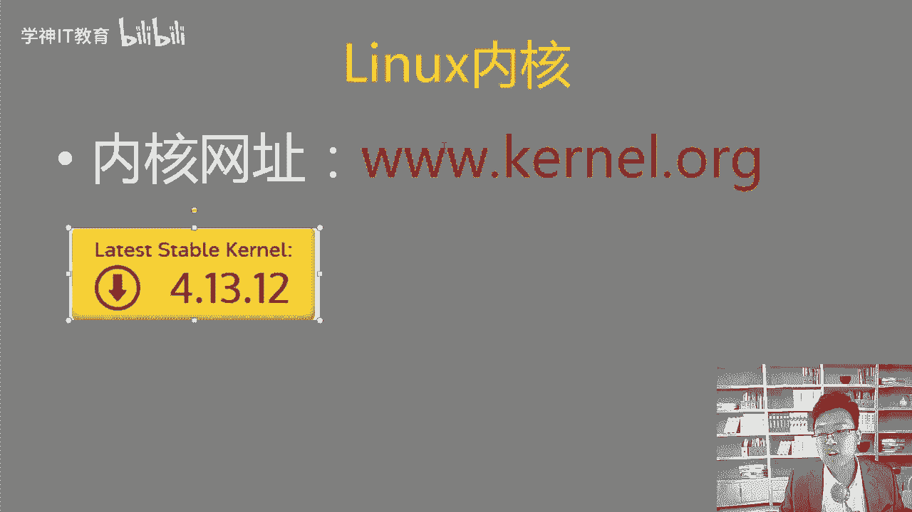

我们来简单的描述一下是这样的一个过程啊。JU计划说啊我要做一个操作系统JNU好不好？说我要做操作系统，做操作系统需要很多东西。比如说什么呢？GCC就叫C语源编译器。啊，甚至JCC怎么样杠C加加是吧？

这都是什么？C加加的编辑器等等，还需要什么呢？还需要比如说Gless圆库啊，包括我们的shall等等，很多地方都容易定下来。但是有个是。最核心的是。有个东西不好定，你知道是什么吗？

这个啊最核心的这个东西不好定。好不好？这个东西呢它不好听啊。😊，来在这里这个叫什么？啊，内核。啊，这个地方啊这个叫内核。内核的话单词叫做可能啊，可能有啊名字叫做linux。其实内核有很多种。啊。

linux是其中一种，也是用的是最普遍的一种。那么这个时候林达斯说你们没定，反正没关系，我自己先写一个内行出来啊，他把lininux写出来以后，然后呢，GNU之下的东西又是开源的，单独有个内核。

你也没法使。知道吧？我也需要有这个江互界面，包括图形界面，然后呢把他们打包到一起，对外发布了lininux系统。啊，从此以后我们用的就是这样的一个信况啊，系统。

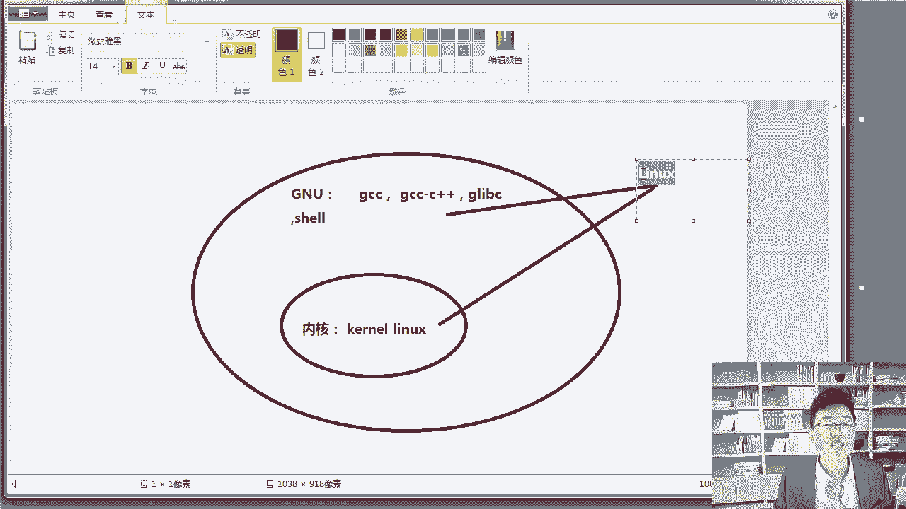

但是呢我们要知道一件事儿，什么事儿啊，看这。真有好不好？真有杠里弄斯。清楚了吧？我拿这个东西啊，哎，想要跟大家说的是lininux能有今天离不开背后默默支撑的啊，这个大哥叫做牛零牛龄是JUU的吉祥物。

就离不开我们GU组织啊。因为大家现在只知道lininux还是不知道GUU啊。是吧我觉得在我上课之前。是吧很很很少有人知道真U这样一个组织。好吧，要知道lininux没有今天真离不开人家。好吧。

别人不知道可以，我们作为内行人，应该知道这个关系，好不好？那接着往下继续。问大家一个问题啊，为什么大家要学一下利用呢？😡，对啊，你为什么要学一下lininux啊？😡，有的同学说老师为了挣钱啊。

为了兴趣是吧？lininux能让你兴趣和挣钱一起。啊，一起结合吗？还真可以啊，因为lininux这个发展前景还是非常棒的啊。linux的发展前景，lininux开源系统是全球互联网首选的解决方案。

每日呢过万的职位选择越老越值钱。真的啊，你看像谷歌啦、乐视啦、空中网啦是吧，百度是吧？搜狐啊，阿里巴巴全部都是用的是linux。

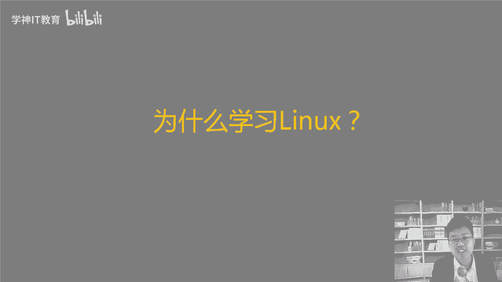

啊，包括360这一块，甚甚至员现在的银行部门，银行以前都用小型机比较多一些。那么现因为小型机它上面跑的unix系统是不开眼的。知道了吧？啊。

银行肯定不会是直接使用frreeeBSD一定是比如说买了IBM的服务器，或者说买了惠普的服务器，直接装一个什么unix系统。而这个东西是不开源的那这个时候从安全层面来讲。怎么样？以前没问题。

现在啊就不行了啊，出了那些斯诺登那种事件了，冷静门事件，对不对？那这样的话安全就上升到一个层面了。所以这个时候大家要知道啊。银行成立了叉86部门，就是专门搞linux这块。他也在往linux这块转啊。

那么所以发展前景还是非常棒的。那你学做开发的同学，有机会也可以把这个lininux学一学啊，你们的开发加上lininux架构，后面你往技术主管啊，技术总监这个方向去发展一下，知道了这个再往下啊。

那么有很多种操作系统，你应该选哪个unux系统就不用选了，因为它是在走下坡路。

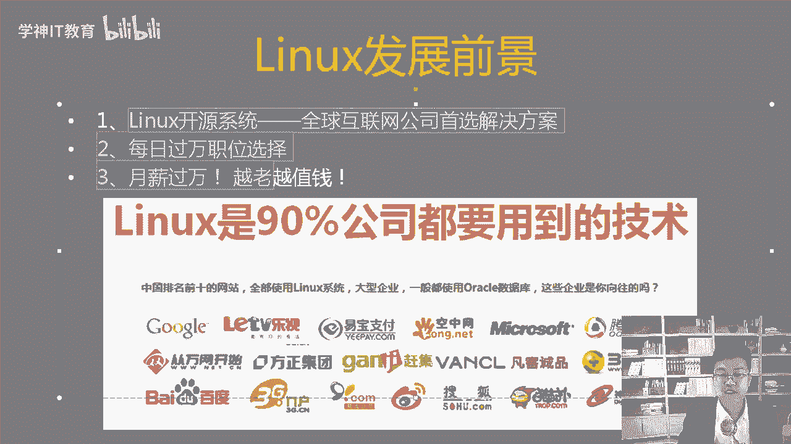

啊，如果往前再推十年，你可以学一学，现在就不用了啊，因为unicux系统。再走下坡路，为什么走下坡路呢？因为unix跑的是小型机，而小型机很贵啊，动辄500万或者说100万这样的一个价格。一台知道了吧？

那么这个时候是吧？而且最主要的是英为的系统，它不是开源的。好不好，从安全这个层度上来讲，除了核心的不可替代用它，其他的就都不用了。啊，以前没有办法，因为只有inux能达到那么高的并发量。

现在呢现在我们的lininux已经发展了啊，我们在叉86硬件上也非常稳定了，而且lininux有对应的集群，价格又非常的低。能满足这个能替代了，所以un尼斯啊就会被逐代。替代。

那么windows呢windows因为它是有版权的，而且windows非常的易用。所以我建议大家就不用学windows了，一用就代表着你挣的钱少。除非你能进到微软核心开发。知道吧？

做windows维护的话，永远是薪资是比较低的。那么这个时候很简单学一学lininux。好，学完lininux以后有很多版本，到底大家要用哪个版本？

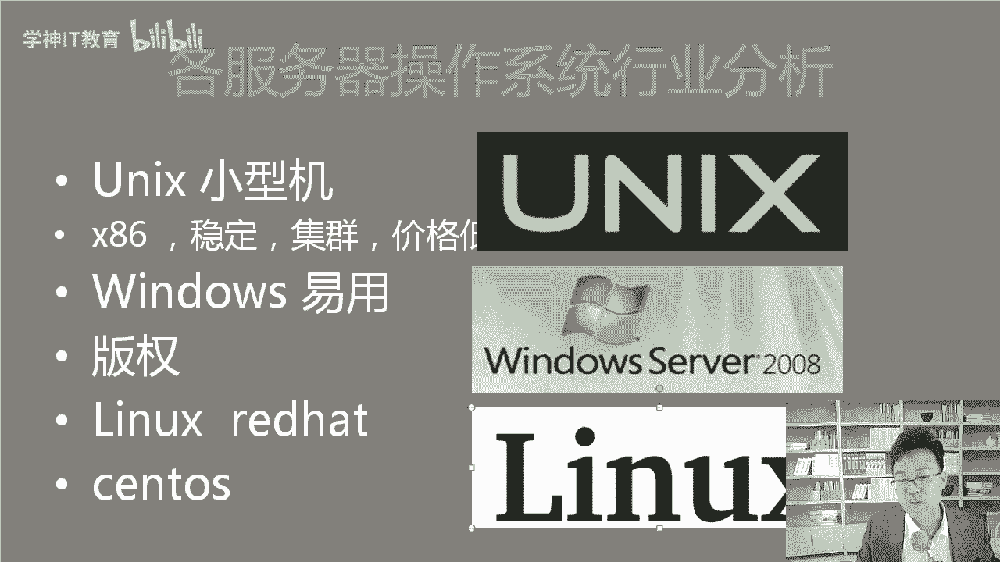

那么比如说mint u班图deb苏i等等。那么在国内的话，如果你打算做真正的什么？啊，真正的lininux这一块的，你可以搞一搞sals。好吧，那么在这里还有个red heart，还有个fey。

有同说我喜欢界面漂亮一点的那你可以使用fey。因为fey和sS他们安装包的操作方法啊，很多地方都是一样的。啊，优斑 two的话，很多做开发人员呢会用一下是吧？他是用你用soteS怎么样也可以。啊。

因为你知道你开发出来那个代码，最终还是在森头湾上跑。与其那样再通过U弯图绕一下，不如再生图S了。啊，去跑一跑s斗S上也可以要么安装很多工具啊。好吧，很多工具好，那么它们之间的关系是这样的。

federy center S和readd hard之间的关系是这样的啊，最新的技术。都是什么都跑在feary上。知道了吧？一旦这个技术稳定了。

那么fey啊红帽会把federy上的技术移植到IHL红帽企业级linux上。然后对外发布他的企业级版本，然而发布了这个版本以后，他要做一件事开源，他要把整个代码都开源。因为因为lindux规定了啊。

这个系统规定了是吧，这因为规定了是吧，我这个就是开源的啊，所以他要把代码开源。那么开源源完了以后，一个代码放在那儿多好啊，那么好的一个系统。

对吧这个时候some头S组织呢就把red hard开源出来的代码重新打包出来。好不好，把re hard的logo去掉，因为那那是人家的版权嘛，对吧？换成stoS。从而发布了sS系统。

所以你学sote S学re heartt一样，因为代码都一样，只是logo不一样。好不好。啊，只是logo不一样啊，这个地方大家有个知道，知道了以后呢，还有红帽的几个简单的认证啊。

RHCN啊RHCSA初级的CE中级CA架构式级别的。

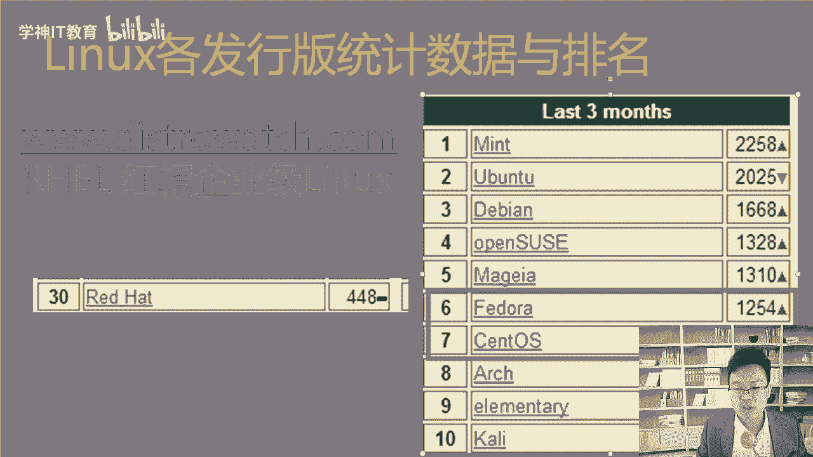

啊，我就是这个级别的是吧？

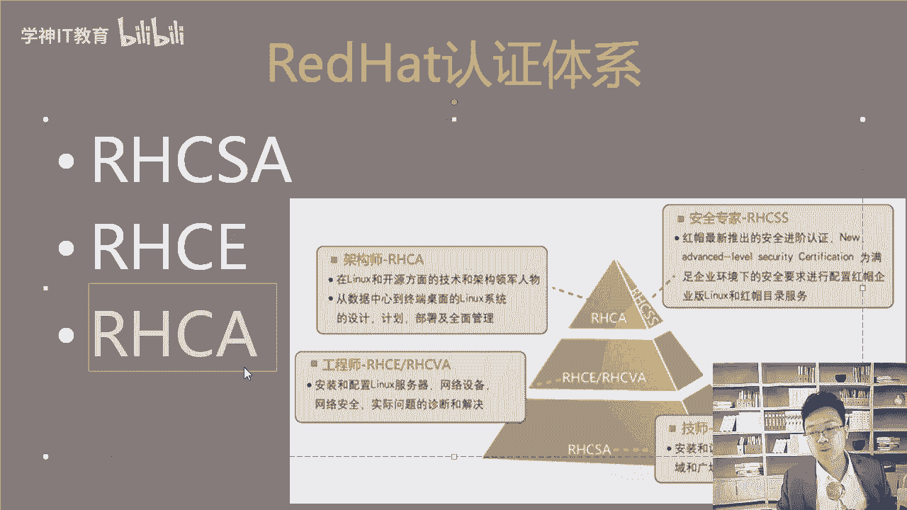

好，这个就知道了啊，再往下啊，看一下他们长什么样子啊，分别长的是这个样子。

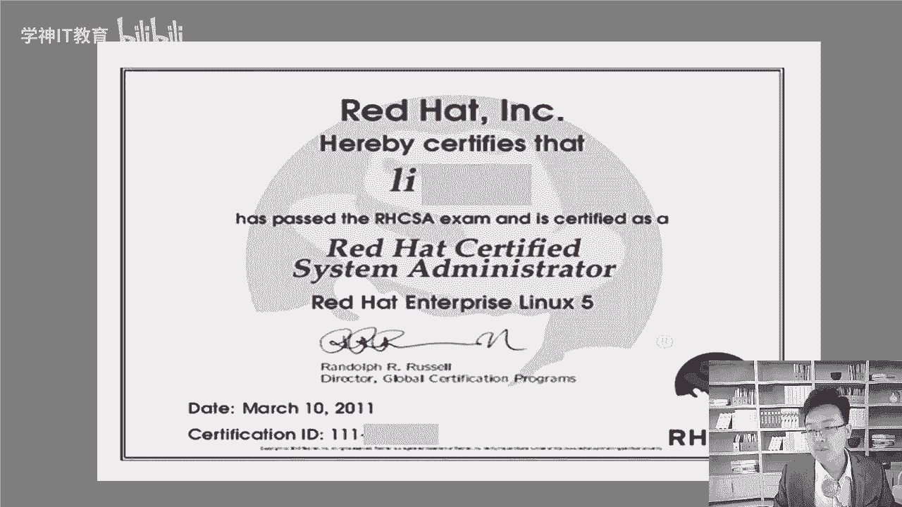

啊，那么lininux学完了以后，到底能不能挣到钱？其实钱这个问题没有问题，好吧，你只要把技术学好了就行。对于你们大学生来说，刚毕业的话，应该600到8000是没有任何问题的。好吧。

老师我已经做了两年网管了是吧？我已经啊做了。几年是吧，是软件实施了或者系统集成功程师啊，或者在IDC机房是吧，已经。已经受辐射瘦了一年了是吧？因为很多学过的课程是IDC啊。

机房这一块或者网管或者系统集成实施啊，工程师这一块的同学，那么你们学完以后可以达到1万到15000。因为你们已经有一些工作经验了。好吧，加上学生咱们这个课程就可以拥有2到3年的运维经验。啊。

大概是这样一个薪的待遇。那么后面有同让老师那怎么达到15000是吧，2万甚至3万呢？那这个时候是吧就需要你们有一些开发经验。啊，这个开发跟运维是不分家的，你可以先学运维基础上的同学呢，你先从运维。

先从lininux架构去着手。啊，因为咱们这个课程体系里边有硬硬件，有服务器，还有软件，还有shall脚本开发啊，还有服务架构，就是linux架构师其实是可以给你打一个非常扎实的这样一个基础。

尤其你们在IT行业是吧呃基础比较薄弱的同学可以先学一下这个，然后学完这个再把python或者把java或者把PAAPP再学一下。啊，这样的话你可以达到一个技术主管或者技术总监。

那么你想想一个技术主管拿到2万块钱一个月或者3万块钱一个月，不是很正常吗？对不对？那那么有同学说老师，我现在已经搞了5年加R了是吧？薪资已经达到一个瓶颈了，无法再跳了。是的，那这个时候怎么办呢？

你把这个lininux架构是吧，学一学，后面你去找一个技术主管，那这个时候是吧，拿到2万或者25003万很轻松，真的凭着你的开发啊，这个这上大家要知道，所以我把这个对应的职位也给大家说一说。

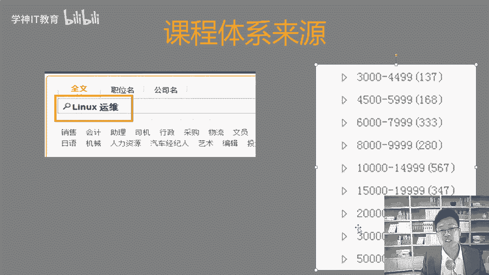

让大家对这个lininux有个很清楚的认识啊，云云计啊，如果你单纯的去做lininux运维相关的职位，有这些啊lininux运维工程师、系统架构师、网站DBA平台linux云端工程师。啊。

myscle高级DBA也可以。因为咱们有讲mysqcle高级DBA如果大家是做开发的话，那么PAPjava C加加等等这类的开发，包括python的同学。那你你们的开发加上linux平台架构师。

后期可以去做这个技术主管或者技术总监，这样的话是一个比较不错的呃职业规划，好不好？清楚了吧？同学们好，知道了以后呢，那么老师再往下给大家说一说大概你们要学的内容啊，从操作系统入门到精通。

然后接下来是常见的lininux的服务。

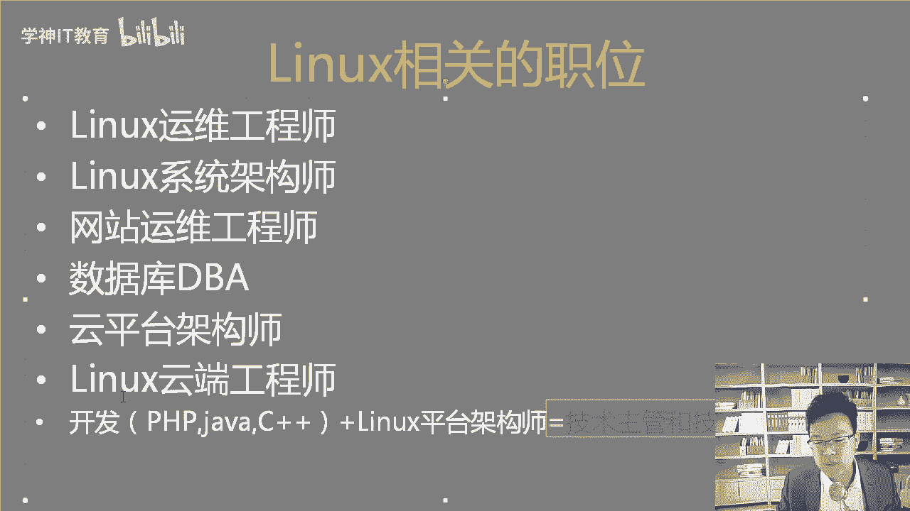

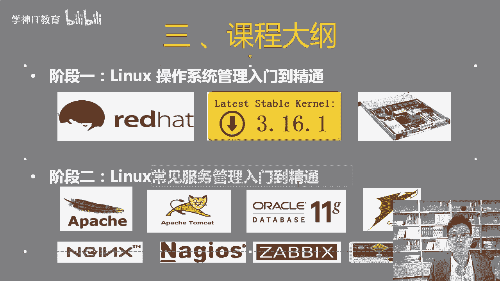

啊，还有一个是什么呢？还有一个是linux的资深知识啊，安全集群存储调优。有同学说，老师，我要学大数据，你想想大数据底层的技术都要用到这些安全集群存储和调优。对不对？所以说你上来就学大数据。

可能有点好高骛远了啊，先把底层的大数据技术先学一学。知道了吧？再往下就是桌面级虚拟化，企业级虚拟化、私有云，还有docker的内容。docker咱们也有讲啊。OK还有K8S容器啊，容器集群。好。

这些都OK了以后，这是这个来龙去脉大家都知道了。那么有同学心里有顾虑啊，哎，老师。

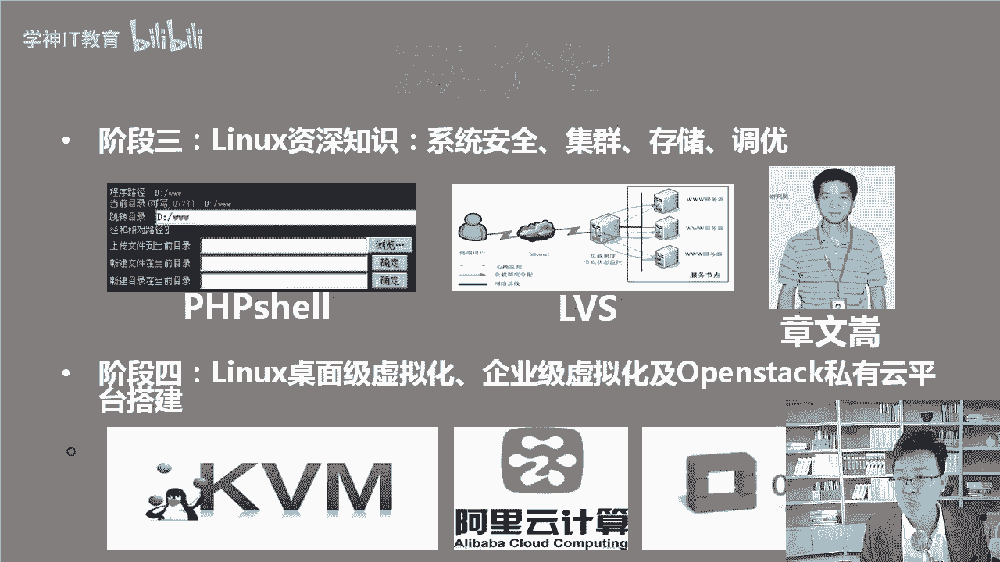

我这个学历行不行？啊，学历的话最好大专以上学历。知道吧？高中的话，那你就要付比别人付出更多了。啊，因为lininux它是它不像开发一样，开发是逻辑性很强的，你必须得也什么呀，那个脑子好使才行，是吧？

lininux更多的这些架构了，它都是死记硬背的。只要你肯努力是吧，就有收获，是这样一个情况。啊，所以你这个你不用问担心大专以上学历就可以。那么对于外语不好，命名记不住这个事怎么办？啊。

你你你英语四级过来吗？啊，这个你不用担心啊，这个linux它这个命令啊很简单。我看你我跟大家列一下啊，你看啊L这个地方是吧，list directory center啊，你看这个地方就是列出目录的内容。

L查看我当前目录下有哪些文件或者文件夹。😊，很简单的啊，然后PWD是什么呢？print working directory就是这几个缩写PWD啊，查看我当前工作的目录，就是你当前所在哪个目录下，好吧。

还有一个是吧SUSU就是切换用户嘛，switch user对吧？switch啊切换到MK用户上，切换完了以后，who am Iwho am I。你是谁呀啊，我是MK，所以这个学起来还是很容易的。啊。

他就是查看你当前登录的用户是谁。啊，所以命令这个地方你不用担心啊，遇到一些问题的话啊，英语不好也没问题。因为我会把中间讲到的那些英语单词给你教你一下。如果你英语真差的话。那跟着我学，你就知道。

除了学技术，还能学英语。啊，这个知道了啊，不好读的英语我会给你们标出来那个啊怎么读的。好吧，音标给你们标出来啊，非计算机专业能不能学得会啊，这个更没问题啊。啊，所以说这个地方大家你们。好好去学。啊。

好好去学。那么如果有同学说老师我有很多啊这几个不好的地方，我都有。那有没有什么捷径呢？人生有捷径吗？有捷径有两个啊，学了inux有两个捷径。第一个你就是跟着一个人系统的学啊，魔鬼式学对学习一段时间。

好不好啊，那么这个地方我建议大家少看一些市面上一些免费的一些基础课，了解了解就行。深入学的话，你会发现怎么样？明明老师做是能做出来的，等你自己敲的时候，你就敲不出来。为啥？有这种有这种经历吧。

不是你的问题啊，是老师录的时候就故意留了一些坑。因为你看的那些免费的技术视频全部都是由。啊，培训机构是吧贡献出来的。如果你能根据那个就学出来了。陪你去个就该倒闭了。好吧。

所以就是那个东西就是用于做宣传的。好吧，大家入了门入了门，你就该踏下进来。好，其系统的学了啊，因为好，这个地方知道了吧？因为在后面的高级或者说在后面的那些内容是吧？都会买好多坑的。好吧。

与其那样浪费时间，不如就踏下进来学一学，也就4个月。很快。初学者呢不宜直接看书。有同学说老师给你推荐本书呗。啊，那很多毫无疑问是吧，推荐鸟哥那本书是吧？鸟哥那本基础篇是吧，五六百页啊，服务篇又五六百页。

合起来1200多页。谁能看得下去啊，我也看不下去。我也买过啊，翻了三四十页以后就翻不下去了。因为那本书啊太详细，它是一个工具。就像大家学学英语的时候，都买过牛津大词典一样。

对吧你说我买味牛津大字典里边有语法，有单词发音等等，能学会吗？学不会它需要一个场景，需要一个老师带着你。一起往前走啊，而且啊学习这个事很很重要的就是有个氛围。好，这样的话，大家天天都坐到这，你看着我。

我看着你，你有问题直接跟我说，我当场给你解决。啊，这样的话，大家有了这个氛围以后，才能不知不觉4个月就过去了。真的，然后你就哎逐步的就成长起来了，需要有个这样的氛围，好不好？那么还有一个结径就是多练习。

啊，鸟哥那本书是个工具啊，强调一下啊，当你。突然间忘了某个知识点的时候，翻一翻翻一翻，那个是可以的。好吧，那个可以了啊，再一个捷径就是多练习，这个毫无疑问。笨鸟先飞，好吧，自己多练习，谁也。啊。

谁也帮不了你啊，一定要自己多练习，敲了一老师讲完一遍是吧？你多敲两遍，自然就行了。好不好？好，这是老师给大家的一些什么啊忠告啊，我相信通过这一节课，大家应该对linux有个整体的认识啊。

能不能挣到钱是吧，发展前景怎么样，好不好学？好不好啊，这样的应该有个认识。好，我们一会儿继续。

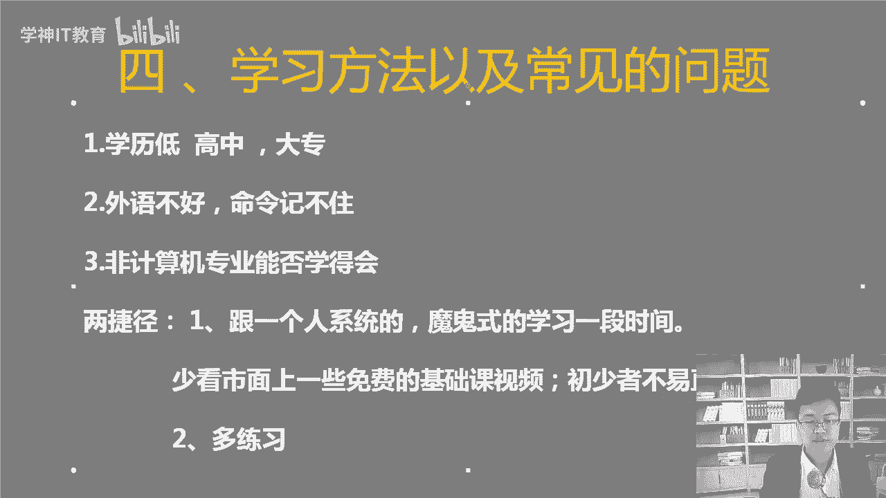