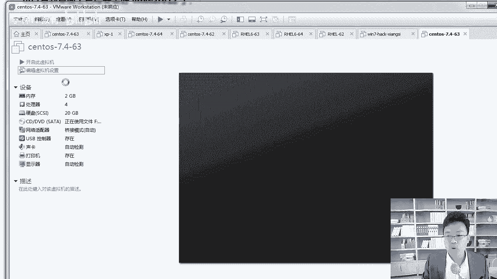

# RHCE红帽认证课程／自学必备／云计算／RHCE／Linux运维 - P2：安装vmware软件和安装centos7系统 - 学神科技 - BV16V411B7AY

好，同学们，我们回来继续好不好？那么前面我们讲过了这个linux的发展史。那么接下来我们把wareware的安装给大家说一下wareware虚拟机的安装。那么大家可以通过这个地方去下载一下。

我已经给你们提前准备好了啊，虚拟机还有这个镜像都有啊大家呃在这个地方点开这个链接就行，好吧。那么对应的播放密码，你可以找我要一下啊，因为你安装的过程中肯定会遇到各种各样的问题。

到那时候正好我给你啊有问题，你也可以找到我啊，给我留言，老师我要装的时候是吧，装完虚拟机上不了网啊，网卡调节不上等等啊，那些问题都可以找我啊。我给你们准备的这个东西啊，这个链接还挺全啊，里边有什么呢？

啊，有这些文件，然后m12，还有包括RHL6。5也有。因为有的学员可能公司还用这个6的系统，对吧？7。4的下载方法啊，还有这个地方。包括镜像种子7。4这个啊比较大。所以我给大家找到了一个种子种子。

你懂吗？啊，如果不懂的话，找我一下啊，我有种子。好不好？给你个苍老师的种子，让你知道知道啊，把这个文件这种文件怎么去下载呢？啊，尤其是7。4这种啊，下载下来以后啊，拿迅雷啊，把它打开一下啊。

或者比贴精灵打开一下。啊，如果你真没真不会的话。啊，可以找我，我给你啊，我教教你好不好？顺便赠你几个苍老师的视频，让你看看。来再往这个地方啊，我来跟你说一下啊，这个地方啊，这个VMware是吧。

这个12这个是什么呢？它是啊它是咱们windows版本的啊，当然有的同学可能是max系统是吧？那max系统的话，你就下载这个DMG这个版本就可以啊，只是max下载这一个安装包，好吧？下载下来以后呢。

我们来安装一下VM2啊，这个镜像是吧，你也自己先下载下来。好吧，然后呢6。5这个镜像我给大家啊做了个压缩包，你下载完了把它解压一下。啊，这个做压缩包主要是不想被啊被百度网盘封杀了啊，是这样的。

因为百度网盘不允许传输啊，上传这种镜像。好，这个地方我们知道了以后呢，再往下在这里啊下载下来，大家双击这个ESE安装包就行啊。我以windows给大家做一个演示啊，我这里已经下载好了啊。

大家也有什么14版本的啊，14版本是今年刚出的，没有必要啊，你就用这个就行，双击它进行安装，安装完了以后是吧？这里有对应的序列号。你把那个序列号上着啊，粘进去就行，任意选一个都可以啊。最后说一下。

我建议你买正版。好不好？为什么我说完这个，我总感觉有人在心里偷笑呢？啊，可以啊，大家可以用正南啊这个。我应该支持的。来，我们点下一步啊点下一步啊。你这个双击安装就可以啊。好，双击安装啊，欢迎使用。

我们点下一步啊，许可证我们要接受，不接受许可证肯定不行。安装到哪个目录下呢？我已经把截图都给你们截好了。啊，你可以安装到C盘啊，其他目录都行。啊，安装到这下面。如果C盘不够的话。

你就安排安装到D盘或者其他的盘下。老师讲的还是很细的啊，每一个步骤我都给你写的很细，启动的时，我们需要检查产品更新或者帮助VMVR来完善吗？呃，我一般不喜欢让我的软件主动往外发消息。

所以我都把这两个对勾取消了啊，你可以也把这两个取消一下啊。取消他啊。好，我们就不检查那个更新了。再往这个地方，我们往下继续啊，创建一个桌面快捷方式，还有开始菜单，这个肯定得创建，对吧？好。

创建完这两个以后呢，再往下开始进行安装，这个时候就需要等的时间稍微长一点了。因为毕竟这个包有好几百兆呢。那让他安装安装到哪个界面呢？等一会儿等一会儿呢，到这个界面的时候。好吧，许可证这个地方。啊。

不要点完成，你直接点许可证。好不好？其实我点完许可证呢以后呢。在这儿。你可以输入一下你的序列号，比如说输入这个可以尝试一下我给你的这个。好吧，输完以后呢，点输，这样的话就可以。啊，就可以激活了。

懂我意思了吧，你就可以正常使用了。其实我想说的呀，威面尔这个公司啊也挺聪明。啊，以VV的技术是吧，想要想解决这个盗版的问题，轻而易举。啊，之所以他一直没有。怎么样没有去解决这个问题，为了啥？

就像当年微软一样是吧？哎，我微软的盗版系统我就怎么样。啊，我就不打压啊，只要你企业里敢用，那我就给你发个律师函，剩下你就交钱就行。其实也是为了推广他自己的产品，因为你不用where where。

我可以用where to box。啊，可以用其他的是吧，甚至06啊，我可以直接用KBM。懂我意思了吧。啊，所以说其实也是。啊，也是怎么样，也是为了推广自己的产品啊，所以它并不，而且你就个人用一下是吧？

他也不好意思找你受贿，就这个意思。所以Vware是吧，直接输个序列号就可以完成验证了啊，就像当年的叉P1样，叉P是不是。啊，XP的那个破解或者激活是吧很简单，输个验证码就过了。就是为了这个。啊。

现在到win10也还可以是吧？win7也还可以，也也没有那么难。啊，这样的话就可以安装好了，也是为了垄断一下自己的市场。好，在这个地方啊，你能看到这个了吗？对吧在桌面上我们已经安装好了。啊。

安装好了以后，你双击它就可以运行了。对吧我们来双击运行一下它啊。😊，接下来安装好V面，我们来安装一下这个啊操作系统，操作系统这个安装来，我们来启动一下啊。

这是我已经提前安装好了一台了，那我带着你从头到尾来一遍。好不好？我们点一下新建虚拟机啊，新建一个虚拟机，选择自定义。啊，我们选择这个自定义啊。V works stationation12可以吧，可以。

没有问题啊，安装稍后安装系统啊，你也可以从这选一下光盘镜像。我就点稍后安装了啊。然后选择linux，linux选底板吗？不对，我们应该选择一个red heart。选ra hard764就行。好吧。

因为咱们这个s动S就是基于人家这个7。啊，源代码换一下logo，所以你选这样的一个版本就行。再往下。千万别给我选32位的啊，你是64位，在32以下装肯定有问题。呃，虚拟机的这个名称好吧。

虚拟机的名称是什么呢？我们起一个名字啊，叫做centOS。好吧，杠7。3。可以吧，然后再杠后面64。啊，63啊，你能理解这是什么意思吗？7。4，这是我的版本，63是IP。后面我一看这个哦。

我就知道这是1921681。63，这是我的命名的一个习惯。大家也可以用一下这个习惯啊，我觉得这挺好的。然后位置的话，你别放C盘C盘。啊，容易满，我呢悄悄拉到一边，有同学老师怎么不让我看呢？啊。

你说我为什么不让你看呢？😡，因为我在选目录哈，万一你看到不该看的。多不好意思啊。是不是。啊，来。啊，我们选选了一下啊，这个地方。Oh， will。来，我看一下我选的那个路径啊，不是新建文件夹啊。

我自己起了个名字。叫这个。啊，我起到一个这样的名字啊。多写了一个三，这个没关系啊，可意的。因为我同目录下有一个跟他一样的个目录。来再往下这个地方处理器。处理器选几盒啊，四盒就行啊。好不好？我是四核的啊。

所以我选的是四核，这样效率会快一些。啊，如果你不是四核，你就啊老师我只有两行，那你就选两行物理机的这个核数啊啊，我是I7的啊，我是四核的。好，再往下，我们继续啊，内存的话给两个G就够了啊，两个G就够了。

我们往下继续。钥匙这种条件。关于这个网络环境，后期我会给你们讲啊，那么再往下啊，控制器这个地方直接点推荐可以吗？可以啊，这个也往下继续。好不好，创建新的虚拟磁盘可以啊。啊，再往下磁盘大小20个G好。

已经够用了，要不要立即分配啊？不要立即分配啊，立即分配的话是立马你的硬盘里就少了20G啊，这样的话是大家最不想看到的，我还啥没干呢，20G空间没了。好吧，不要立即分配的话，我们就用多少少多少啊。

最多用到20。好，我们再往下继续啊。再点下一步。好吧，然后呢再往下游自定义硬件，这个要自定义一下啊。呃，在这里我们来选择。好不好？在这里可以开启虚拟化，也可以不开啊，我们先不开，后期教你网络。

在这里我们需要做的是CD。什么意思啊？镜像文件我们得选一下啊，镜像文件你的光盘镜像在哪儿，你就选到哪。我的是在这里吗？不是在这里我的应该是在。啊，我的L盘有个work stationation啊。

在这里。来选择这个ISO这种文件才是我们的光盘镜像文件。好不好？有同学直接把那个什么点儿RR压缩包是吧？当成光盘镜像了。不是你要如果是IR压缩包的话，你要把它解开，好不好？选择这个选完以后呢。

点打开打开以后点关闭。OK点完关闭以后，我们点完成。啊，打印机还用吗？打印机就不用了吧，我们可以点一下编辑这个设置啊，把打印机就给去掉了。好不好？然后我们把这个打印机给大家去掉啊。

打印机移除一下。啊，这样就可以了。内存CPU都各方面没有问题了，我们点一下确定。

好，确定了以后呢，点开始安装。

啊，这样的话我们就可以开始进行安装了啊，同学们。

哦，他这个地方。啊，在这里我们先暂停一下。好不好？在这里呢我们先暂停一下，我来整理整理一个笔记。

啊。笔记这个地方我会每一个步骤都给大家写的很细的啊。新建虚拟机。好不好？新拟记的每一个步骤我都为你写的很细，你们参考的这个笔记也能来，好吧，选自定义，自定义完了以后选择下一步，下一步再往下。好。

我就不一一个一个带着大家过了啊。总而言之，这个地方我会跟你怎么样。我会给你写的很细啊，关键步骤我来粘啊，我来说一下啊。比如说我们刚才所说的这个地方的时候啊，输入虚拟机的名字，好吧，soneYS7。

46363代表的是1。63存储啊，存储虚拟机的位置，大家自己啊自己自定义不要放到C盘。啊，因为一个虚拟机就占5个G左右。好不好？很容易把你的C盘就占满了，明白了吧？啊，我相信我以这样的方式去讲的话。

大家后面学前都没有任何问题。啊，因为一步步来的。对吧那么再往下啊。OK在这里啊，CPU的数量大家也知道，根据你自己啊，我是四核的。啊，我是I7的1个CPU。不知道你的CPU是几核的话，你可以问问。啊。

你可以从网上查一下啊。啊，一般不是两核，就是4核啊，我是四核的话，这样后期咱们安装的时候，系统的时候会快一些。啊，内存2个G。好，这些都知道了，再往下。有几个重要的事项，我跟来跟你说一说啊。

还有一个重要事项是这个不要选择立即分配磁盘大小。好不好？立即分配，立即省20个G啊，这个不要了。好，再往下。光盘镜像这个地方一定要自己去加载。知道吧？很多同学说老师。

我这个地方为什么我我点开机的时候起引导不起来呢？因为你的光盘镜像就没有加载上啊，你这个地方一定要选自己的光盘镜像，而且是ISO这个文件。好不好？对你选好你自己的这个镜像，如此一来。

我们就可以开始进行安装了。到哪个界面了呢？笔记给你整理到这儿啊，就到了这个界面。好吧，你点这个开启开启安装。那么这个地方所有的这个参数我们来说一说啊。

好不好，这个界面是什么意思呢？我来天跟大家说一声啊，install center7好不好？这个叫这这这这几个项都是什么意思啊？这个叫安装。其实我们正常选肯定选这个了，对吧？我们要选一下安装它。

然后test this medium第二项啊。测试这个媒体。好不，然后呢，安装系统and的就是并且安装的意思，并且的意思就是因为我们的光盘是吧，怕那个光盘被划了。A。对吧滑了的时吧。

数据就不完不完整了嘛。以前看电影的时候光盘是吧？啊，看过那个盘吧，光盘不是黄盘啊。以前我们看看光光盘的时候，每一次看的时候看到那个武打的最精彩的地方是吧？就卡啊，我记得我当年看那个李连杰那个。啊。

李连杰演的那个是吧？张丹峰了那种电影每次到最关键的时候就开始卡卡卡卡卡，你看电影的时候卡一卡无所谓啊，但你装系统就不能卡，卡了的话意味着数据的丢失，这样的话系统就会不稳定。所以它会让你测一下啊。

而我们是ISO这种啊问这种镜像文件啊。啊，直接存到电脑上，这种你就不用检测了，直接就过就行啊。如果你是光盘的话，可以测，其实也没有必要测，你就直接过就行。好吧，除了你的盘滑的不像，不像样的啊。

还有一个是插包书顶，插包书顶这个地方是什么意思啊？就是修复故障。好吧，这个主要是我在后面会跟大家讲，当我们的windows或者lininux啊，当我们的lininux无法正常启动的时候。

我们需要修复一下。那这个时候我们可以通过光盘进入插包书ing里面啊，进入救援模式给它修复一下系统。这个后面会讲。好，知道了这个以后呢，那么我们选择第一项开工进行安装。好。

开始进行安装pri the enter key啊，按下 key，然后呢begin the installation开始安装啊，按下回车键开始安装。所以你英语差也不用担心遇到那些单词我都会跟你说的。

好不好？啊，这边我们就可以愉快的安装系统了。

好，我们稍微等等他啊。好，这边已经开始了。下面这个虚拟机弹出来这个消息啊。哪个地方的就这个啊。他说我已完成，你可以直接关了他。好不好？啊，可以关了它啊，没用。给你一个提示而已。来很快就会弹出一个界面啊。

我们稍微等一下。开始进行安装。

好不好？这个稍后它会弹出一个什么样的界面啊，会弹出一个这个啊，让你选择这个语言环境，这是谈的第一个。

请选择语言简体中文还是其他语言？

好，他会让你选择一下啊。我们稍微等一下。好，我们在这里稍微等一下啊。他会有一个选项。好，稍等等他啊。

哎，来出来了啊，在这里我们应该选择是什么呢？啊，在这里我们选择中文。好不好？啊，选择中文就行。那么中文这个地方以后，我们选简体中文，繁体中文。台湾。还有什么繁体中文啊，中华人民、香港特别行政区。

还有个简体中文，新加坡。你看到这个地方有什么感觉没有？你的没有什么感觉吗？我每次装系统的时候，装到这儿。😡，心里都挺不爽，为什么呢？你说你红帽是吧，或者s到S这个组织是吧？😡，啊。

其实因为他是直接参考的红包来做的嘛，你知你红包想在中国。是吧发展的更强大，那至少这个关系你应该搞明白才行。是吧简体中文中国理解简体繁体中文台湾。是吧这个就不理解了，你直接繁体中文不行吗？

非得强调一下台湾。是不是台湾就是中国的，中国就是对吧？还有一个是么繁体中文、中华人民共和国、香港特别行政区。他把香港再单拎出来一下是吧？这个我就不理解了是吧？其实最好你就直接繁体中文啊，简体中文就行。

我就不信了是吧，就安装了个系统是吧，香港怎么样，我就用个简体中文，或者就用个繁体中文。台湾跟香港还不认识这几个字儿呢？是吧就咱们没学过繁体，咱们也知道这是个继蓄。对吧所以我希望啊有一天是吧。

大家能看到啊red heart这一类系统安装的时候，只有简体中文和繁体中文，或者说简体中文。新加坡，这个我理解，因为新加坡不是不是中国的对吧？啊，这个需要咱们中国再强大一下。

也需要你们啊跟我把lininux发展的更强大一些。只有咱们占的占有的市场份额更大的。你懂的才会什么呀？才会在这个关系上。啊，老外才能搞得清，才能分得清谁是老大。我说对不对？对的话，给我点个赞行吗？啊。

好好把林no斯学一学啊。否则的话，你看外国人搞的这个产品。这是说在在他的潜意识里就没有搞清楚这几个国家的啊，这几个这个台湾省跟中国之间的关系是吧？也没有搞搞明白香港跟中国的关系。啊。

所以我们先选择简体中文啊，大家一起加把劲儿。啊，终有一天我希望应该可以看到的。因为我现在装那个开ly的时候。就不是这样的，凯里就是简体中文，繁体中文。啊，凯里你们知道吗？也是一款lininux是吧？

做渗透用的啊。对我安装那个时候，那就是简体中文，繁体中文就够了。那个还是比较靠谱的啊。好，我们选择简体中文啊，真的我们要强大些来。来简理中文。啊，我先以中文的方式快速给大家装一下。

因为这样的话让大家快速的入个门。那么在这里安装的时候是以。所有的事啊来，我给你截个图吧，先。在这个地方，我们就要一站式安装界面。什么叫一站式呢？关于安装系统基本的操作都在这个界面可以搞定。

17、亚洲上海没有问题，好不好？键盘默认汉语，你可以点进去。啊，可以去添加，我们不用管汉语就可以了。语言的话，简体中文就OK了。哎呃安装地指是本地的光盘最小化安装，这个也要。处理啊。

最小化安装这个也要要处理啊，我们应该处理成什么样子呢？你应该用这个啊带GUI的服务器界面。因为你是初学者。啊，如果你是个老鸟，你就直接装最小化初学者是吧，不要给自己。长那么多。啊，整那么多。

不必要的麻烦啊，因为很多东西你还不知道，比如说GCC是什么，你都不知道。😡，对吧这样的话会有好多问题。大家先学linux要一步步来。好，这样的学的这个流程是非常愉快的。啊，你的技术也掌握的也很快。好。

带GUI开发工具开发工具后期我们原网编译一些东西的时候啊，会用到开发工具里面的一些包。比如说编译器啊等等一些东西。啊，图形界面先给你装上啊。先让你对他有个初步的认识。然后呢。

系统分区这个地方我们来搞定一下好不好？选择什么呢？啊，这个盘你自己默认它已经给你选中了啊。啊，这个你不用管它选我要自己分区。哦，我要自己分区点完成。啊，我们点完成啊，点完成以后呢，这里有很多分区啊。

新挂载点使用以下分区方案，哪种方案呢？我们选择一个标准的，好不好？啊，我们来选择一下啊。在这里稍等。啊，你点这个下量列表，我把那个笔记先给大家整理一下吧。好不好？你开始自己安装的时候是吧，选择亚洲啊。

完成就行啊。失去了。大家默认就行啊，市区这个地方。好不好？对，亚洲市亚洲时区选选啊时区选择亚洲上海默认就可以，不用变啊。啊，所以你这个时区你不用动它啊。好，时区我们不用动。时军不用动了以后呢。

键盘我们也不用动，我把这个笔记给大家整理一下啊。唯有选择软件b的时候，是我们一个注意事项，好不好？你看一下啊，软件包的时候，我们应该选一个什么样的呀，选一个这样的。带途形界面的。

GY的和开发工具的这也是我们要注意的。接下来我们就要开始自定义分区了。对吧。好，我们来自定一下这个分区啊。选我要分区分区的话，这个地方。好，选择标准分区啊，我们要选标准分区，点一下加号给大小。好吧。

给不特分区不特分区是做引导的，纯内核的200兆足够了，好不好？点一下挂载点，添加挂载点，这样的话会把SDA分区挂到根下的bo下。06下。这个叫根啊。啊，根一切都是从根下开始走的，查找文件啦等等。

都是就像一个树的根，然后开始找职业。嗯。接下来还有一个swi分区，samp分区我就给两个G了啊。给多大？一会儿我说。Hao。然后呢，再来一个就是根分区，根分区这个地方我们可以10个G。好不好？

给十个击啊。点击添加关联点，那么文件系统是默认是叉FS文件系统。好吧，默认是叉FS文件系统啊，点一下完成。好不好？问你是不是接受更改？是。啊、共享叉F。好，这样的分区就OK了。

我把这个笔记给大家整理到这儿。它有很多啊什么啊BTRFSLVM等等啊，我们选择标准分区就行了啊。对，在这里选择的是标准分区。标准分区以后，关于swipe分区这个地方有个说法。好吧。

新建分区不的分区200兆，12分区一般为无理分区1。5倍和2倍。这是以前我们内存比较少的时候，经常会说这样一个说法。但是比如说当你的物理机多于什么，16G以后，你的samp分区给8到16G就行了。啊。

甚至给8个G就可以不用是吧？哎，我是不是应该给你内存是16G，应该给32G不用。啊，如果你内存应该是64G呢。你还给128Gs吗？不用。好不好？实际工作中是吧，你用8到16G的。

最多给到8到16G就够了啊。如果你swipe分区还不够。或者用到了s分去，那说明你。你就该加你自己的内存了，说明内存不够用了，什么时候会用到swipe呀？当内存不够用的时候会用到swepe分区。

知道了吧？ok。这位清楚了吗？所以当你的s分区被使用了。那说明你的内存有问题。啊，要么内存不够用了，要么是机器被黑了。啊，不够用的话，那你直接加内存就行了。因为用CF还挺慢的。好，这些都知道了。

我把那个刚才那个笔记给大家整理到这儿啊。😊，好。

在这里最终我们分完以后点接受更改，记住这一句话好不好？最多一般8到16G，如果sap。怎么样？啊，如果不是说swi不够用，如果。系统使用到了sap是。对系统是用到了swi去。啊。那就直接加内存。

或怎么样，或排查一下机器。夫务妻有没有被黑？因为一般情况下不会用到这个地方的啊，真的要用的话，你也该加内存了啊。清楚了吧。Hao。C分区称为交换分区啊。三岸分区叫交换分区。啊。

就是当我们的内存不够使的时候，系统临时会把内存的数据写到这个swi分区上。但是你想想物理内存都不够用了，用开硬盘当内存了，那效率太低了。啊，为什么说就让他换呢？因为。因为硬盘太慢了啊。

硬盘和物理内存相比太慢了。那么在刚才分区的过程中，有几个概念，根的话，这个表示根所有的文件的根啊，清楚了吧。我们所有的linux下一切接文件，所有都是以这个根下开始。SDA表示第一块磁盘。

后期讲磁盘的时候，我们详细讲。好，再往下呢，我们关闭一下KD盘啊。来。可以让我启用吗？关闭一下啊，点完成。然后网络这个地方很重要，网络这个地方我们点什么开启一定默认是吧？

有很多同学说老师装完系统怎么连不上网，因为默认情况下这个网卡是关闭状态的，你要把它开启。啊，开启，那它可以自动从局域网里获取IP地址。你稍等一他啊，然后呢，在这里主机名的话，我们也要改一下。

我就改成学杠的63点C了。好吧，我我喜欢后面我讲课的时候，学神其他老师讲课也是学霸的63点CN。啊，也是这样的。来，再往下呢，我们点配置。配置的时候，你也可以自己手动写个IP这不是DHCP吗？

你可以手动配一个啊，点一下添加输入一下1921681。63子网掩码224IP。192。点168。1。6啊，往弯是1。1嘛，对吧？然后DNS的话，我们写4个8。没问题啊。

谷歌的这个4个8DNS服务器还是可以用的，好不好？点一下保存。如此一来就OK了啊。O。好，我看一下啊。它现在自动获取的是这样1个IP啊IPV4192168。1。63。是吧24知道是什么意思吗？

就是3-255。0。啊，是这个意思啊。好的，DNS是这个。好，这就OK了以后呢，我们点一下保存。啊，网款的第一个名字叫inNS33啊，就用这个就行，默认就是这样一个名字，好不好？点一下。好。

配置成功了以后呢。我们往下继续啊。ok。你可以关闭它，可以打开它啊，这个都行，一定要记住要开。好，要开已经变成1。63了啊。啊，如果你这样没显示的时候，你就这样编一下。啊，另外大家记住啊，我是1。

631，我局域网里就是1。61。0的网段，就是1921681。0的网段。啊，如果你们加是吧，或者你们公司，比如说你是4点多的或者5点多的那你显示5。63啊，前提你局网里没有人占用这个63这个IP啊。

好不好？啊，一切OK我们点完成。好，这个OK了以后呢，再往下啊策略安全策略这个地方就什么也不用选了。啊，如此一来，我们就可以点开始安装。图形界面好不好？然后网卡要配好自定义分区。其他就没有什么注意项了。

可以down吧可以关闭。啊，因为K down的是一个内核崩溃转储机制。啊，就是崩溃了以后，你也看不懂那个太复杂了，只有红帽他们自己的工程师可以看得懂。而且wininowux一般情况下，内核也不会崩溃。

好不好？所以这个地方大家知道啊，你不用管他。不用开开了，还得占内存。啊，开始安装。如的没有设置密码，我们给如的配个密码啊，123456。A lot。好，输完密码以后呢，我们点完成。好吧，完成的时候。

你看他告诉你。密码没有通过字典检易，检查过于简单。没关系，非要点完成。这样也可以点两下。啊，剩下他就开始进行安装了。用户的话可以现在创，也可以一会儿创啊，我们现在先不创建它。好，这样的话我们就OK了。

那么在这里我们来快速的说一下。几个主要注意事项啊。好，1。63这个地方是这样的，记住啊，在这儿要把它打开。一定要把它打开啊。因为否则的话，默认你配的那个是无效的。好，这一切都OK了。那么我们。啊。

记住在这里该开始安装了。啊，你跟着我这个笔记一步步来也是没有什么问题的啊。好不，也是能学出来的啊。如的密码123456，密码过于简单，那你就两次就行了啊。如果你的密码比较复杂的话是吧？一次就行。

我的后期讲课过程中，所有密码都是123456，你就不用不用把心思放到记密码上啊，IP的话一直是1。63，好不好？嗯，这个地方知道了，那么稍微等等他。通常情况下，这个时候会告诉你可以去喝杯茶了，休息一下。

行，一会儿啊一会儿我们继续啊，我在这等等他。😊。

好，同学们，我们就回来了啊，你的那个茶喝完了吗？是吧？喝了一会儿，这边终于等到了安装结束了啊，安装结束了我们应该怎么做呢？我们首先应该点重启啊，重启一下这个系统啊，我们让它重启一下。

每个步骤是吧，老师在那个笔记里都会给你们写的很细啊啊，大家学习的过程中，你应该先把视频看一遍，然后呢啊然后你可以参照着那个笔记去做，好不好？

啊，这样的话学习效率是比较高的，很多人还不会线上这种方式去学啊，这个地方不用等它3秒以后自动它就开始启动了啊，你一定要先把视频看一遍，看完一遍以后心里有数了啊。

对这个东西可能会出现什么bug老师在里边给你讲的那些坑是吧？你心里都有数了。然后呢，一步一步的去做就没有任何问题了。

然后他启动一下啊。哎，你看这是一个7这样一个标识。这个界面跟red heart是吧，7是一样的啊。来让他启动一下啊，咱们往下继续。让他转。转一会儿啊转一会儿我们接着往下。等待的还行，好不好？

好，我把这个往上给大家翻一下。回到这了是吧，刚才。好，在那等等到这的时候，我们点安装。盖章了啊，重启好不好？安装完了以后，我们点重启，重启完了以后呢，再往下我们系统启动成功。

来，在这里系统成功启动了啊，启动了吗？那看一下啊，第一次启的时候稍微慢一点，后面是吧就快了。呃，那么在这里有一个什么许可，许可要不要同意啊，肯定同意干啥都得先把许可同意。

啊，同意许可协议，然后呢点往上走走啊。点完成。好，许可接收了以后，网络也OK了，对吧？然后呢，不会创建用户，你不创建用户，反正一会儿也得让你创建。这个先我们先不创建啊，先按照最简单的给大家走一遍。

啊，点完成配置。那么这样的话，它就可以启动了啊，启动这个系统了。

我把笔记给大家写到这上面啊，完成配置。

啊，每一个步骤都有啊完成配置这一块的东西。完成配置以后，首次登录的时候，它会有一个初始化这样一个过程。所有这个操作系统都差不多是这样一个过程，好吧啊，s up dream的一个初始化啊。

根据默认一步一步往下走就可以。9。这边啊。好的。在这里我们选择汉语就可以啊，我们选择汉语。那么你可以我这里是为了录屏，所以我把窗户调小一点，你自己那调大一点啊，点一下汉语下一步。下一步。键盘还是汉语。

点前进，隐私要不要开？隐私是干嘛似的？允许应用程序确定您的地理位置。定位服务时会有相应提示啊，关了就行了。咱们服务器不需要这样的一个定位。好，时区的话是中国上海啊，不用动了啊，点前进。你有自己的账号吗？

谷歌Oclo。有没有没有有有你也登不上。别说没有啊，有你登上啊，我们点跳过就行了，因为被屏蔽了，好不好？那么再往下呢。嗯，你要输一个自己的名字，我就输入MK了啊，点前进啊，输入密码，我的密码是。

123456喽。好，123456点一下前进。

啊，前进以后you are ready to go。是的，我准备好了，这样的话你就可以安装系统。你的系统到这儿已经安装成功了啊，我们就可以正常使了，好不好？

我把这个笔记给你整理到这啊啊，我把笔记给大家整理一下。😊，好，每个步骤都有啊，点完开始稍后会弹出这样一个界面，好不好？稍后它会弹出这样一个界面，我们来看一下。看到这个界面了吧？对。

那么在这里你直接关上它就行了啊。你有兴趣的话，你也可以自己点一点。😊，行吧，他就是这个啊。你看。就是操作上的一些。啊，其实跟windows上差不多啊，往那一放，然后整个就全屏了。

往这边一放就怎么怎么地了。啊，往这边一放就填啊，就这边啊，就是鼠标的一些快捷键。好，这个我们知道了以后。那么到这儿为止，我们整个系统就安装结束了。啊，就安装结束了啊，安装结束了以后。

你可以试一下你的网络是不是通着的。

这是大家最关心的打开网端啊，打开这个终端啊，空白处右击啊或者单击都行。在这里呢你可以拼一下，拼谁呢？拼一下百度点com。这样的话我们能拼通，说明你是没有任何问题的，明白了吧？好的。那这里就没有问题了啊。

然后呢，当前是什么用户呢？dollar是普通用户啊，是MK。ho。MI，我是MK，你可以切到竹子下。好不好？知到root下以后，输入root密码，123456。输完密码以后呢，关机好不好？

我们来关一下机啊，IIT0这叫关机。关完以后，你你自己创建个快照。好了，关完以后自己创建一个快照啊。好，这边让它慢慢去关着，我们来。

写到这了啊。😊，啊，让他慢慢去关了就行了。这个知道了以后呢，我们来说一说啊六跟七有什么区别啊。啊，这个地方虽然大家说没有有同学有兴趣的话，你也可以装一下6好不好？在这里6跟七有很多区别啊啊。

我列了几个主要的内容，认真听啊，大概这个地方就是扩展知识啊，了解一下啊，6和7的区别，文件系统的区别。6里面默认用的是EFT4文件系统，27用的是叉F啊，还有默认调度算法不一样。

OK这个地方大家了解一下就行啊，因因为这个就是深了，再往后讲，不适合你们刚一开始接触，了解一下。好吧，内核版本六里面用的是2。6，这个是3。10。

在7里面支持了什么动态补定机制O还有支持了什么BTRBTRFS这种比较全啊前沿的这个文件系统，好不好？而且还支持内核模块黑名单机制啊，还有什么呢？再往下啊，我把这几个知识点都给大家列一下。

让大家知道一下啊。😊，第5个。Hao。还有这几个啊支持嵌套虚拟化。那么对C虚拟机的CPU更加流畅了。内核支持这都是说7啊7里面支持啊支持基于Cgroup的资源调调分配好吧。

group后期也会讲到啊6里面对USB2。07里面可以3。0支持啊，这个确实是一个比较好的一消息。3。0大家都知道快是吧？LVM快照在6里面一直是通过LVM来实现的。

那么在7里面我们可以通过Q call to这种KVM这种方式啊，这种文件系统结构可以做快照。这个在KVM的时候，我们会讲到加强了对VM支持自带open VM tools替换了原来的VML。

那么在7里面全新的服务都是启动的时候，用的是ss team cTL，它来启动服务的。而我们在6里面用的是service。好不好？所以这个服务这地方也是不一样的啊。好，这个知道了以后呢。

还有就是内核模块啊，内核模块这个地方。就是K down的时候啊，他能支持三体，这个可以支持6T。啊，两T啊。朕就更多了。好不好？好，这个地方我们知道一下。

那么稍后我们继续好不好？这是系统的安装。