# RHCE红帽认证课程／自学必备／云计算／RHCE／Linux运维 - P3：vmware的12个使用技巧 - 学神科技 - BV16V411B7AY

hello，我们来继续说说这个VMV212的使用技巧啊，同学们。那么这个还是很实用的啊，第一个技巧别看12个是吧，多啊，说起来很快，用心去听。第一个技巧是什么呢？啊，虚拟机增加可用的内存。

那么这个怎么做呢？先关闭虚拟机，然后呢，我们去调内存好不好？调的时候是怎么调呢？我们随便打开一台机器啊，比如说这一台机器已经用完的一台机器，一定要关机的时候去调啊，一定要关机的时候去调。

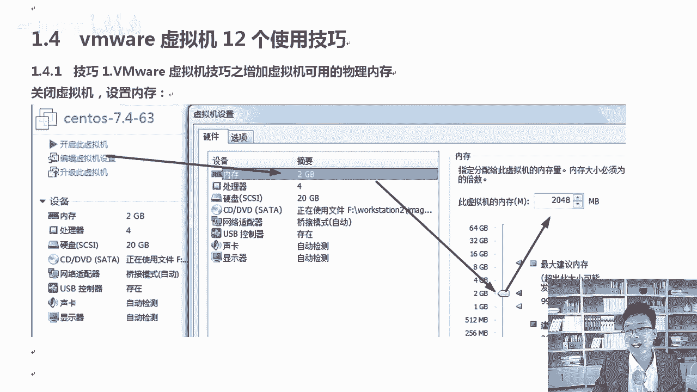

啊，因为关于硬件相关这些东西，一定要是关闭机器的时候去调内存的话，你可以从这里往上啊去拖动，也可以在这里具体写。比如说我写1个4096可以吗？当然可以了，点确定就行了。

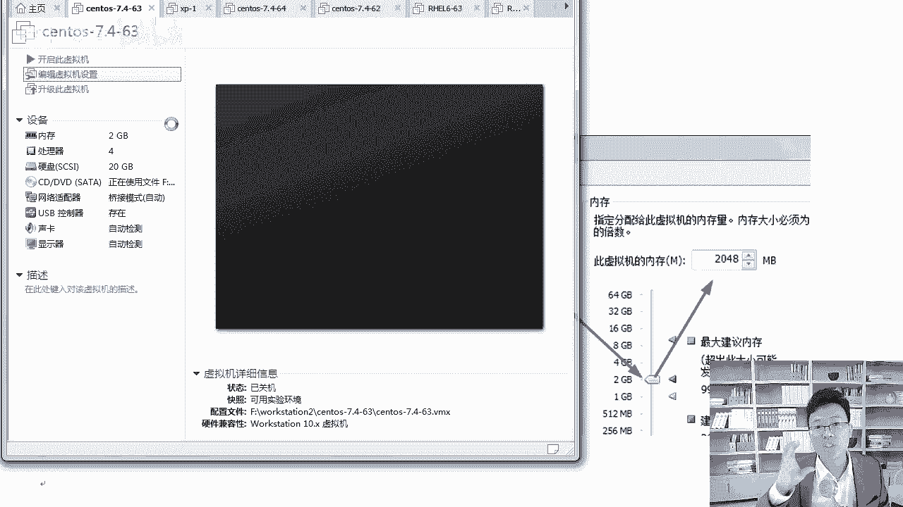

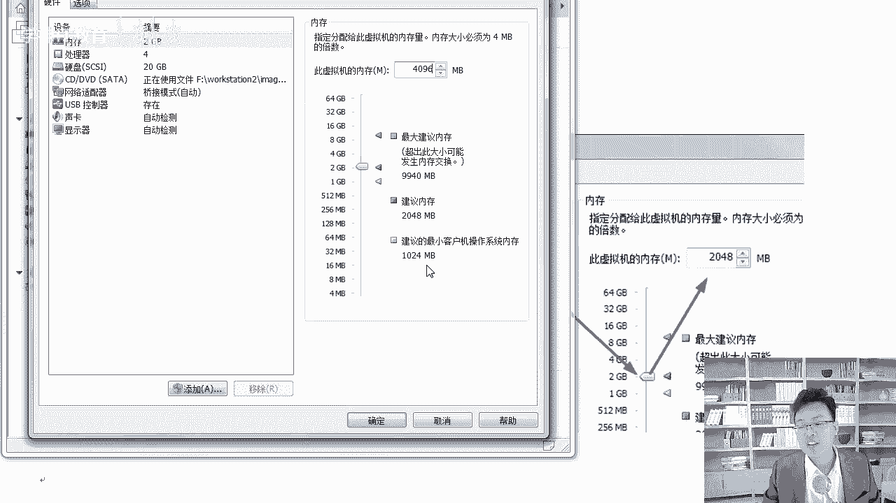

啊，这里就变成了4G好，那么步骤也也写的很清楚啊，内存去调啊，两种方式都行。这个知道了以后，第二个虚拟析啊技巧叫做。

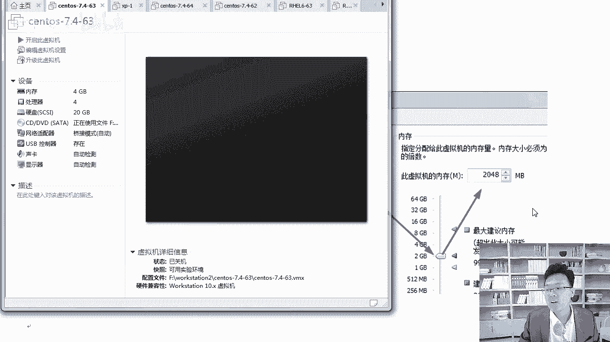

硬件设备的添加啊，就是我想的添加点硬件设备，这个时候怎么办呢？可以这样去添加啊。

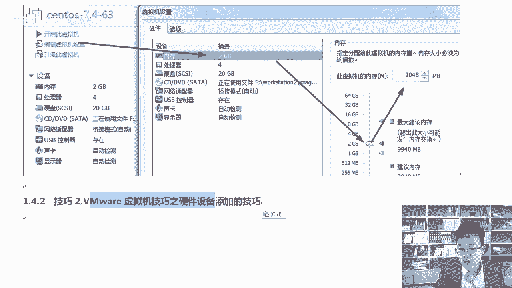

编辑一下，比如说我想再加一块硬盘对吧？啊，硬盘不够了，我再加一块可以吗？可以在这里我们点一下硬盘硬盘，然后点一下添加。

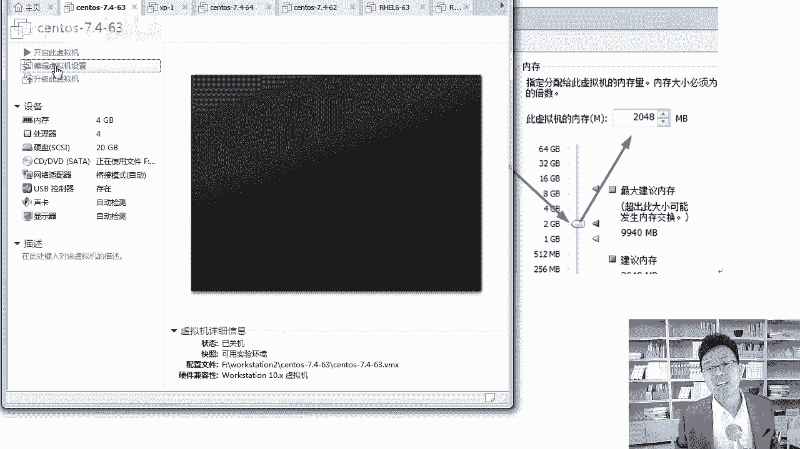

啊，点一下这个添加啊，我们来点一下是。啊，刚才黑了一下屏是吧？点一下是，然后点硬盘，下一步，下一步选择scar硬盘好不好啊，再往下创建新的磁盘可以的，然后呢，大小是20G，其实就一路下步下一步就行啊。

还是不要立即分配，再点下一步点一下完成。那么这样的话我就多了一块硬盘了。啊，我就可以多了一块硬盘了，知道了吧？好，这个知道了啊。😊，好的，同样添加网卡跟它是一样的啊。啊，都可以这样去添加移除。

大家知道怎么移除吗？移除也一样啊，你就删除就行。好吧，移除的时候就删除就行啊。还有一个是什么？是这样的啊，同学们就是虚拟机控制啊，你看虚拟机技巧之控制权限的切换，控制权限的切换什么意思呢？

以前比如说我想按一下这个啊。就是你想把鼠标移出来，按下ctrl加alt进行组合键。假设啊我这里有一台机器是吧，已经开启了，你想把鼠标从虚拟机里移出来。

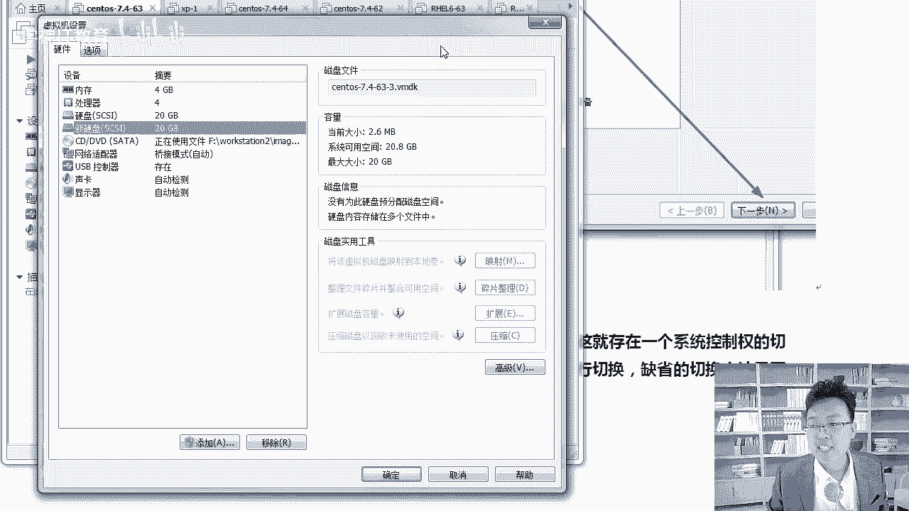

啊，如果是字符界面的话，你必须摁下ctrl alt。如果是图形界面就无所谓了啊，现在这个版本已经比较高级了，以前我们还需要安装willm to才能实现，现在不用了，默认都有，直接就可以艾从那就移出来啊。

移不出来的时候，你摁下ctrl加alt组键好不好？

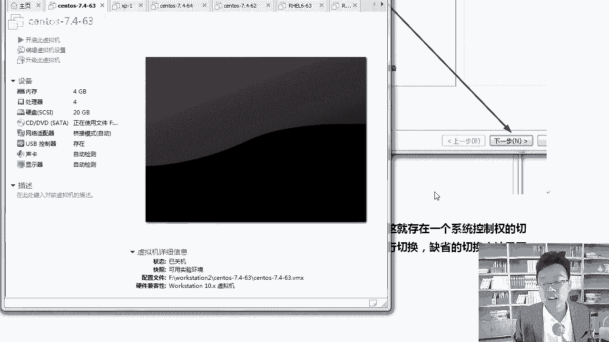

好，知道了以后呢，再一个就是虚拟器的关机啊，关机的时候怎么关呢？

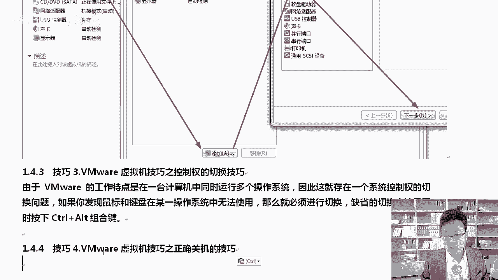

啊，是这样硬硬关吗？啊，从这里直接点那个power off直接关闭吗？

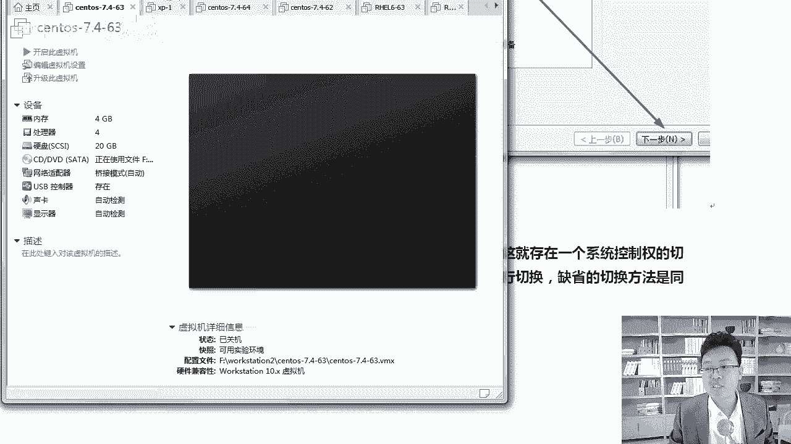

这叫硬关机，这样是不行的啊，我们希望的是什么？大家执行NNT0好不好？正常关机啊，我希望你可以这样正常关机，明白了吧？好，知道了这个再往下，还有一些快捷键。啊，我希望大家可以正常观节啊。好。

快捷键还有一个是什么呢？就是这个啊虚拟机技巧发送快捷键。好吧，怎么发动这个快捷键呢？呃，大家可以这样去实现。就是比如说我想发一个controrl al deleteelete。好吧。

如果你按装ctrll deleteele这样去这样的话，直接举发的话，那我会出现一个问题就是。你的主机怎么样也会去调出来那个任务管理器。是吧主机也会掉出来。所以这个时候我告诉大家应该怎么做呢？

你应该摁下conttrorl al加insert。啊，应该加一个insert这个键。好不好？或者怎么样呢？或者是这样虚拟机可以这样去发送啊，虚拟机这里有点虚拟机去发送一个啊，这样也可以进行发送。好。

这一些都OK了，以后已经讲了一半了啊，是不是很快？😊，啊，VMV26啊显示屏幕的切换就是这个意思啊啊，它这个地方有很多显示啊，你可以这样，这样的话，你可以看到MK我曾经装过的那些循拟机啊，没有打开过的。

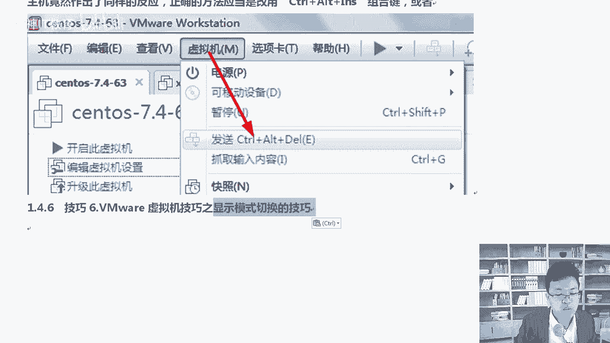

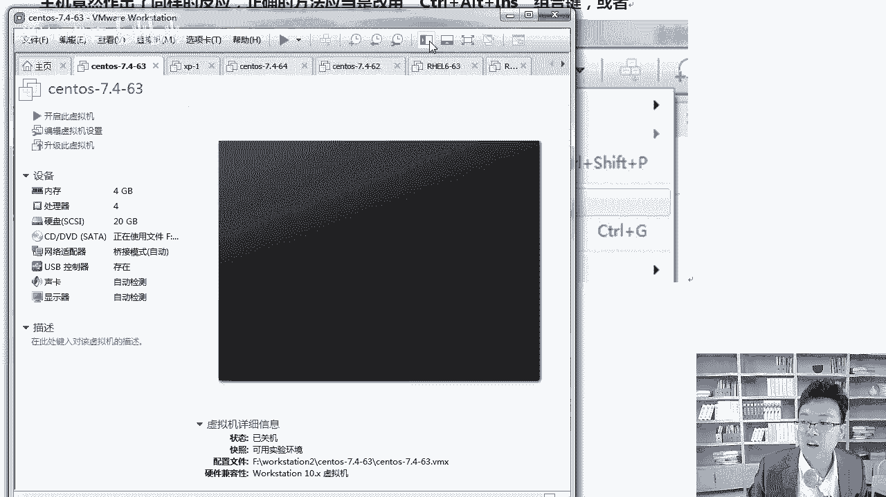

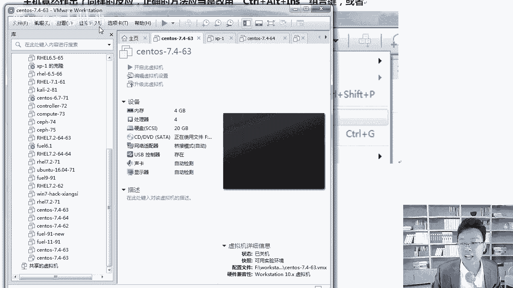

常用的纸肪那几个都在这上面好不好？也可以在下面。啊，从下边这样去切。清楚了吧？商店那个我一般都不喜欢，因为他们占的面占的空间太大，我一般都把常用的放到这上面。

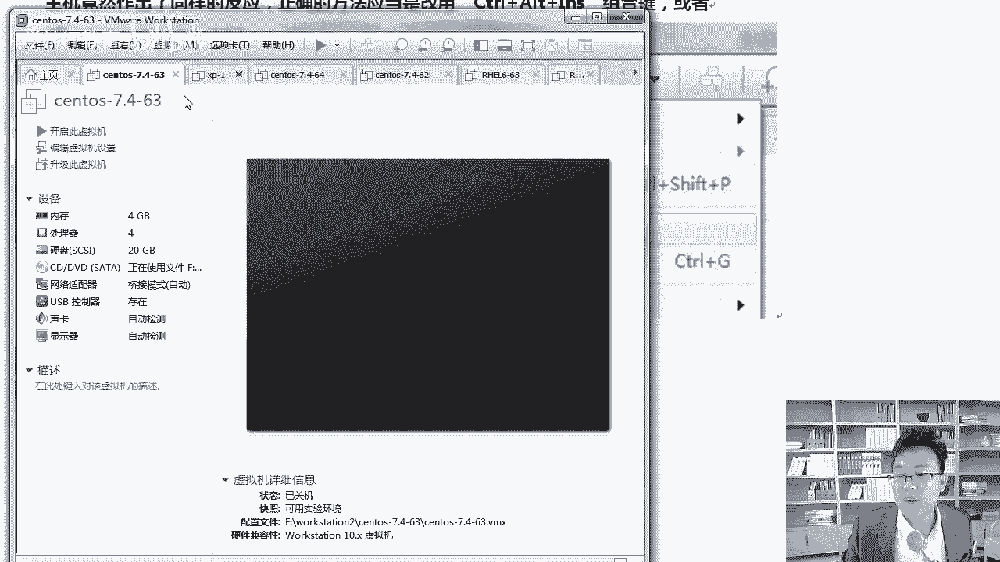

好吧，你也可以从那边去调出来它。好，这两个大家知道一下啊。当然还有一个叫全屏。

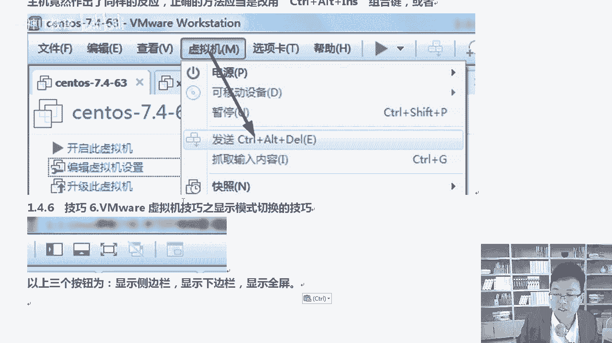

啊，全屏这个也可以。比如说我想在这里啊全屏一下。啊，鼠标往上移动一下就可以退出了啊。

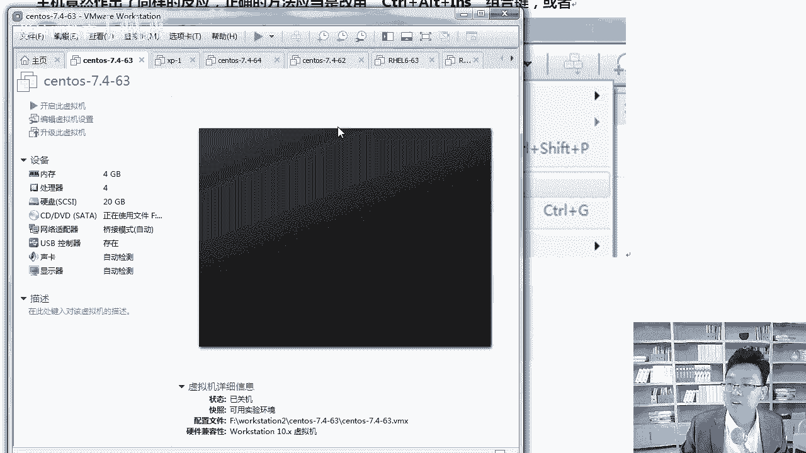

是全屏以后是吧，大家刚才没看到是吧？全屏以后，你鼠标往往屏幕的最上方这样一放啊，它有个它就会弹出来一个小条，让你你可以退出全屏。

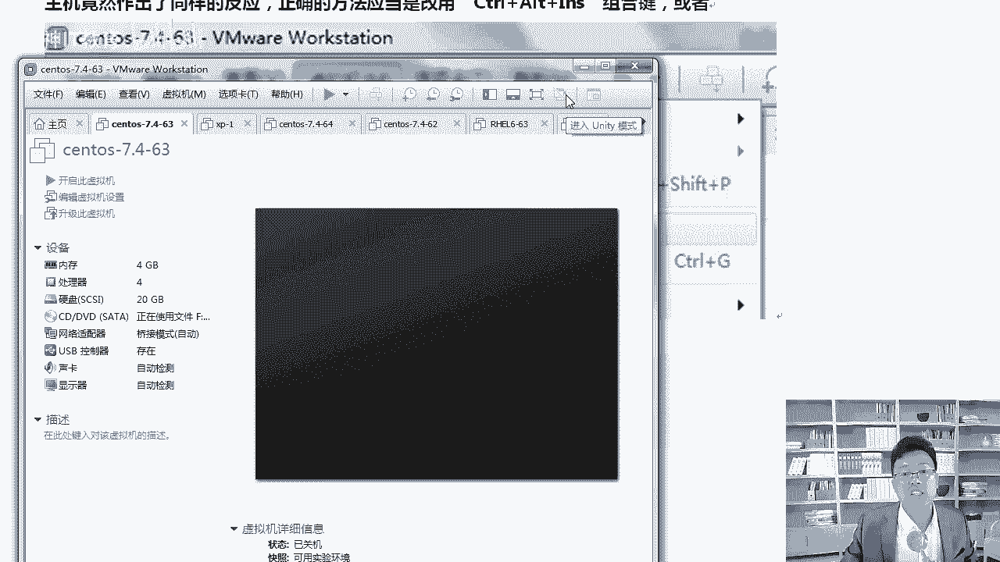

好不好啊，可以退出全屏。好，那么第六个说完以后呢，我们来说一说这个大家啊经常。经常用又容易搞混的这个东西叫做VMware网卡的使用啊。VMware网卡一般提供三种工作模式，分别是bridge桥接模式。

night网络地址转换模式，还有就是house only紧主机模式。好不好？那么这个地方我们来看一下他们啊。看一下调节模式呢来一句话啊。其实大家看这个文字上的描述啊。看的是怎么样。挺挺挺绕的啊。

看啊桥接模式就是将主机网卡和虚拟机网卡用虚拟机啊虚拟网桥进行通信。然后呢，在网桥接的作用下，类似于把物理主机当成一个交换机来用。好吧所有桥接设置的虚拟机连到这个交换机的一个接口上。啊。

物理主机也同样插在这个交换机上。啊，换而言之，你记住虚拟机的IP。啊，必须要跟主机在同一个网段上。如果需要联网，那么网关也要跟它保持一致，否则你上不了网。这是乔见模式下啊，说这么多，我给你画一张图。

你就一下懂了。啊，来。在这里我们画一张图啊，让大家看一下它那个图就是这样的啊，怎么样的呢？这是物理机。来，我给您画一下，你看啊。呃，桥件就相当于我们把物理机当成了一个交换机。

我们物理机自己也连到这台交换机上了，好吧，圆圈里有个叉叫路由器啊，它可以去上网。然后呢，VML它也连到这上面，它也可以去上网。他俩能通信吗？当然可以了，因为你俩都在一台交换机上的，所以你俩也能通信。

所以你们的IP一定是要是什么网段，都是什么网段。明白了吧。啊，因为你俩就在一个局域网里，就像就像你跟你旁边的同事一样，你俩的IP1定是同一个网段，网关也一样是一啊，是同一的。所以桥接是我们经常用的。

因为这样的话就相当于是一台真实的机器一样。好不好？好，这个地方清除。拿到这个换一张图，还有一个叫net模式。net就是地址转换。啊，低质转换。地址转换模式在net模式下。

虚拟主机需要借助虚拟NAT设备和虚拟的DHCP好吧好，使得我们的虚拟机可以联网虚拟机跟物理机共用1个IP地址。其实我们现在能上网都是用的night模式。啊，因为我们对外只有一个公网IP。

都是通过路由器做了NAT转换。对吧好，那么我们来看一下啊。换一张图吧，还还是换一张图啊。它是这样的一个图。看到。如果你用的是桥接模式，那么虚拟机上个网的时候怎么样？对他要想上网的话，他得先找到什么啊。

它相当于通过交换机连到了你的物理机上，你的物理机给他做了一个什么圆圈里有个叉，这叫NAT做了一个转发，然后通过物理机的IP地址，然后再通过路由器上网。啊，心里大概知道一下这个过程好不好？后面边用的时候。

大家就编熟了，现阶段都用调接。啊，现阶点先都用条件。好，那么horse的on理模式呢？来housese的on理模式呢就是虚拟机和。外网是隔开的，虚拟机上不了外网。出不去啊，使得虚拟机成为一个独立的系统。

只能跟主机通信，相当于是n模式去了地址转换。H ha。😊，明白了吧。原来你是能上网的，现在不让你上。啊，这一段砍掉了这一段也砍掉了。当然人家物理机人家是可以自由去上网的啊，只是虚拟机不能上。

那么就是这样一个模式。好吧，我们的VM虚拟机。啊，只能跟物理机同行，你创建的虚拟机只能跟物理机通行，这个大家清楚了吧。啊，这个要知道啊。好，我换一张图给大家看一下。啊，就相当于是这样的。好的。

这个知道了以后。啊，往下我们继续。这个也不用担心啊。你先会调节模式就行，好不好？后面那几个是吧，边用的时候慢慢就熟了。啊，有可能几个网络基础比较差的同学是吧？对这个地方有点不太了解。啊，你先记一下他。

啊，先记一下他。好，再往下呢，我们来看看这个地方啊。看看这个地方啊，对了，你用这个ho的 only模式，还是用这个net模式的时候，这个时候都要把网卡获成自动获取IP地址。因为你配的那个不见得。

就是他DHCP给你分的那个。知道了吧？所以这个时候要用。动态获取IP。ok。Hao。虚拟机使用。Night。系统操呃linux系统钥匙。配置成动态获取IP地址啊。好吧，你让他自动给你分啊。

让这个DHCP自动给你分。啊，这是个注意事项啊。Hao。这个知道了以后呢，同样house only的时候也一样啊。因为人家有自己的DHCP。啊，你你手动配的，有时候跟他不在同一个网段。主要是这样的啊。

好不好？这个大家理解我了吗？对。这地方。好，这个说完了以后呢，咱们往下接着来。啊，接来来啊。😊，调节模式也OK了。接下来说说这个啊。VML虚拟机bis设置说到这个地方的时候。

如果以前有人用过VMVR这种虚拟机的话啊，我们想进bis，通常会说一个词儿。你知道是什么吗？比下手速。是吧在MK我的那个年代啊，手速就是说大家啪打字的速度很快啊，到你们这个年代，手速已经变了味道了。

是吧？手速快不快？

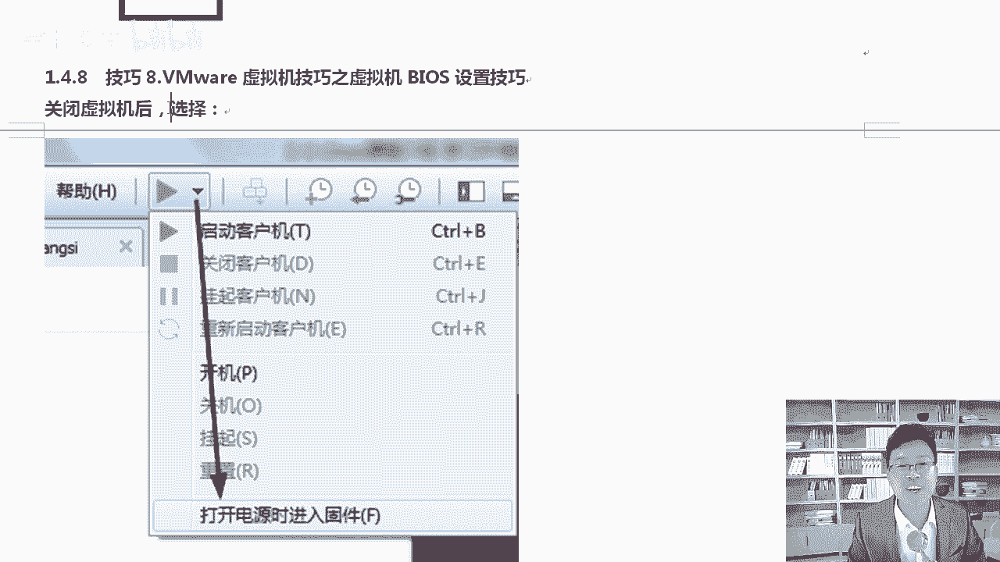

啊，有多快？啊，来。来这个地方我们来看看啊，比比手速，看我能进到bis里啊，能不能啊，我教你啊，其实你就不用比了啊，在这里打开电源时，直接进入固件，这就可以了。

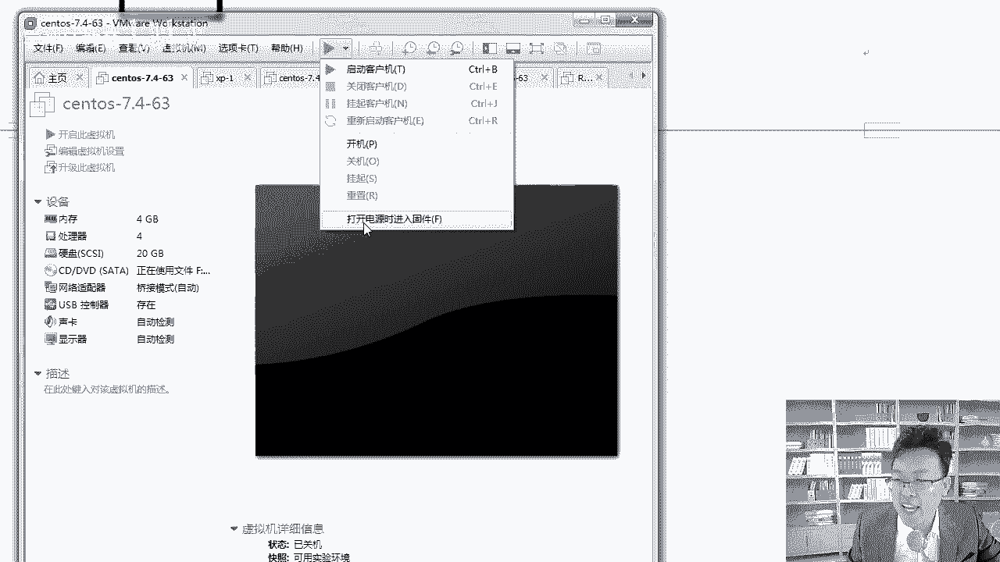

来。

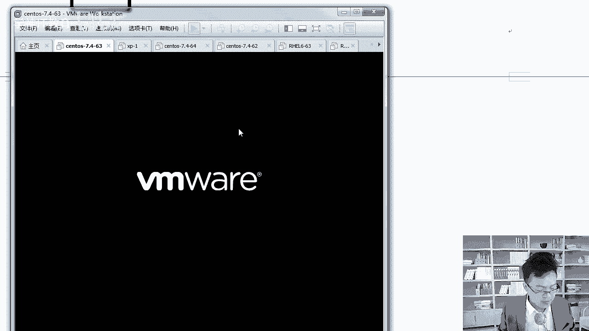

正常情况下，比手速指的是哪呢？你看这儿啊，prince F2s up。

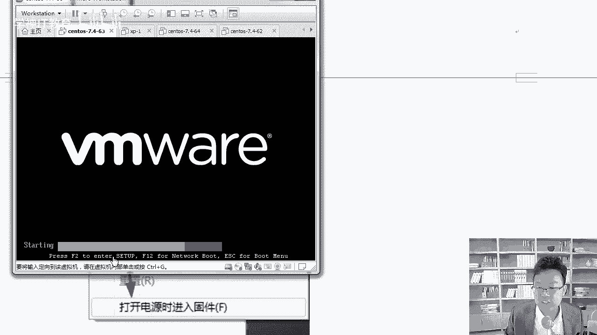

啊，如果你的手速慢，你要你你你那个时候得怎么样？以前我们得快速点进去，点进去，赶紧摁F2，摁的晚了就不行了。啊，现在人家已经有这样的功能了，你直接进到啊，在这里我们可以设置啊。

比如说引导顺序摁下这个光标键来回切。比如说我想把CD room放到第一引导。那怎么办呢？你可以按一下shift加加号，它就跑到最上面了。好不好？可以通过它来，这不是减号和加号吗啊可以通过它来做这个事儿。

啊，弄完以后F10保存并退出，这样就可以了。

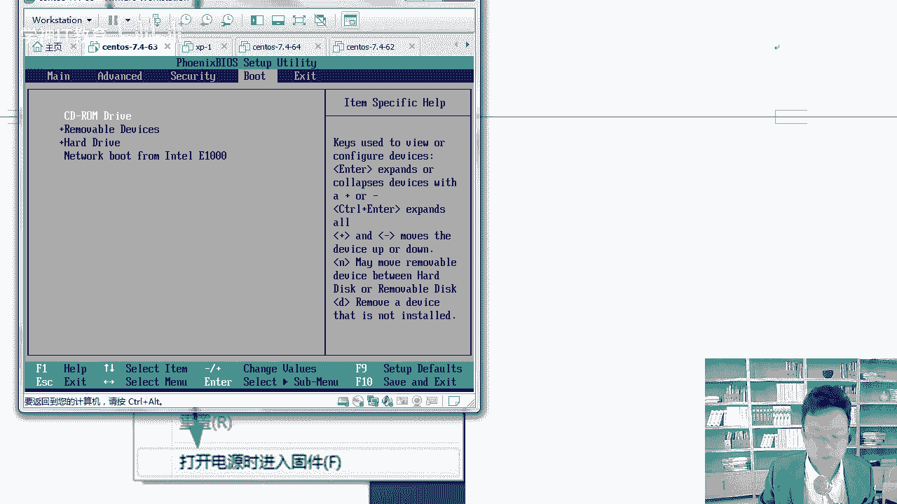

好不好？保存吗？yes保存嗯回车。啊，指的是这个。好不好？我就关机了啊，这个地方。

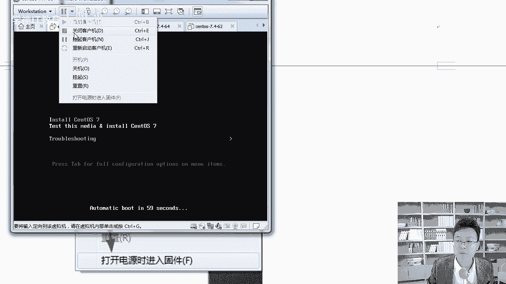

啊，没有用，给你演示一下啊，不用再比手速了。好不好？对。有了这个技巧就不用比手速了，呵呵。我得把这个。啊，有了这个技巧。就不用啊。比手速了。呵呵行。😊，来。那我们清楚了啊，那么还有什么几个技巧。

其他几个技巧都比较简单。我们来逐步的看一下啊。对，知道了这个以后呢，第九个技巧是什么呢？就是VM toth啊，以前我们一直要说要安装这个VMtth。好。

whereware安装wearm toolss解决屏幕分辨率的问题。你像我以前装那个wearware机啊，6或者说装5的时候，就是装完以后，那个屏幕很响啊，就是这一块显示的这一块很响。啊，那么在期以后。

默认就直接帮你装上了open VM tools。对吧这个大家说过，对他就直接帮你装上了啊。啊，直接帮你装上了。啊，你已就不用什么，在自己手动装了，这样的话会更加的方便。好不好？还有第十个技巧就是刮牌啊。

挂个镜像了啊。Vware尔虚拟机使用ISISO光盘的一个技巧OK啊，这个技巧怎么使呢？就是这样，比如说你可以在这里啊，你想加载什么镜像的时候，都可以点编辑虚拟机。啊。

在这里我们可以选择DVD从这里去选择自己的景像。啊，点浏览就可以了，点完以后点确定，然后启动是连接光盘。好不好，点一下确定就可以了。那如果是这种开机的状态呢，哪个呢？我看一下，刚才有个开的是吧？

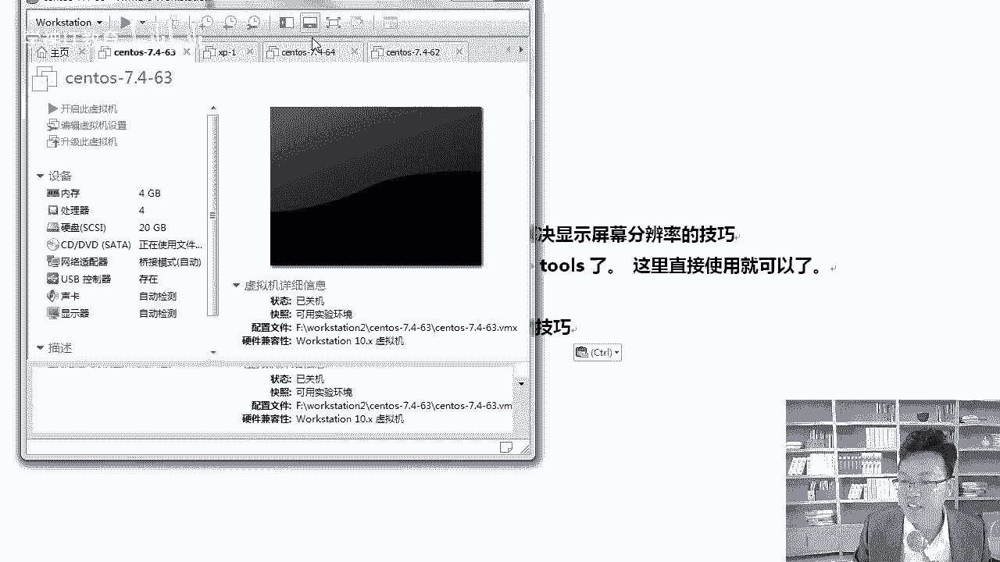

如果是这种开机的这种状态怎么办？

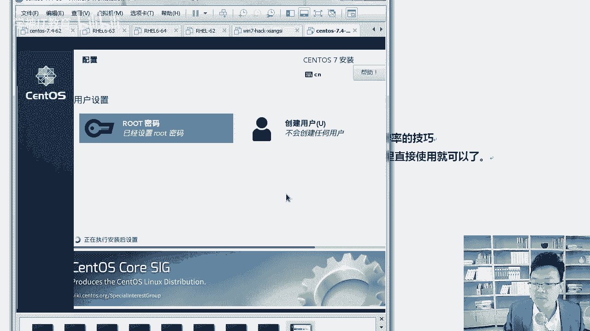

这个时候你想挂吧。这个。这个时候可以从这啊点这个啊点。单击点设置。啊，单击一下这个光盘的个标，点一下设置。

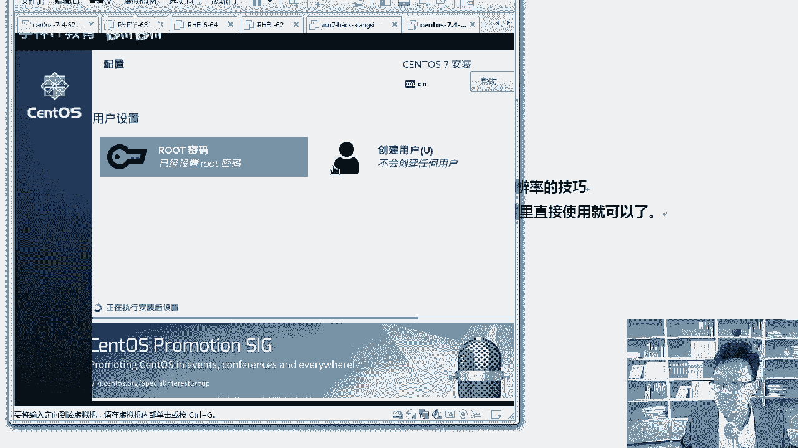

啊，从这里可以试选。啊，一般情况下，因为这个时候光盘正在用，大家一般不要从这儿。啊，直接去调了，知道吧？因为人家正读取的数据呢。好。这一回我们清楚了两种方式啊。好的。那我把这个笔记给大家写一下。

这是这个啊，如果你已经开了机，你可以在这里单击光标就可以进行设置了啊，点设置。好，最后那个呢就是虚拟机的删除了。就是有的时候我新建了很多虚拟机，我想删一下，删除虚拟机的时候，可以通过这个。

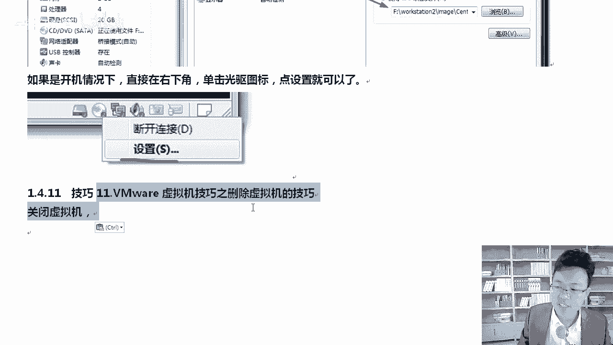

啊，比如说我不想要它了啊，我们点一下那个虚拟机，点一下管理，从磁盘中删除。如果是开机状态是无法删的啊，你得关了才行。比如说我这个是关着的，我点这个地方没有问好。

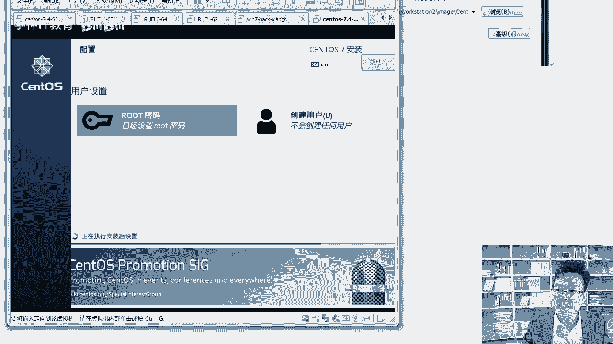

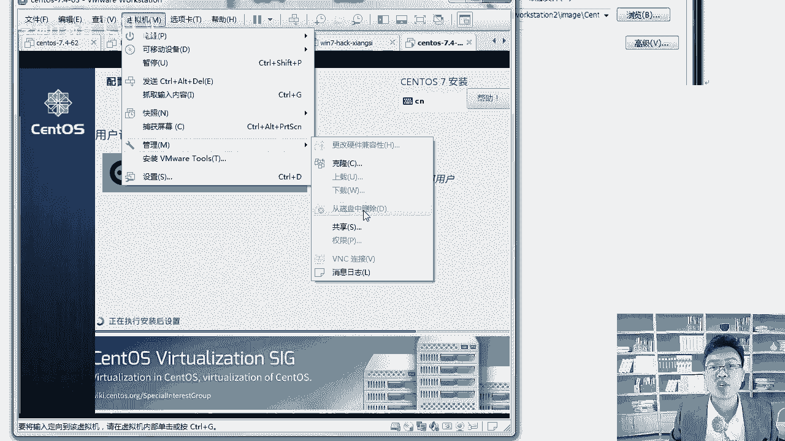

啊，那就彻底没了啊。

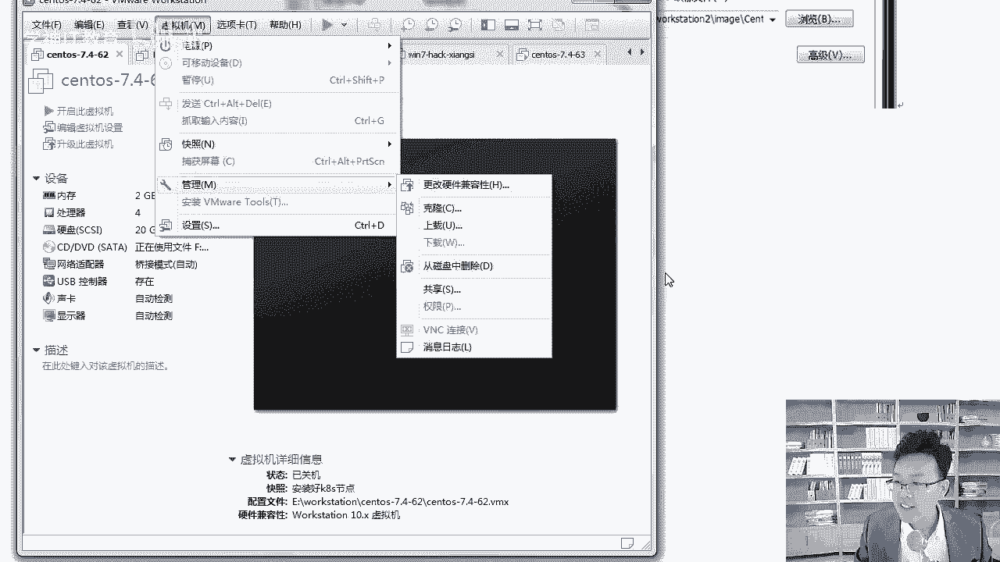

好，这叫删除最后一个技巧很实用。

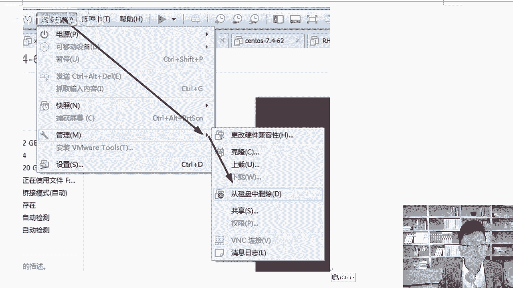

快照。好不好？来VMV尔最后一个快照，快照这个东西啊呀，大家要很实用啊，虚拟机点快照拍一个快照，就是当大家装完系统，你的系统也能上网了，此时此刻创建一个快照。万一有一天你把系统坏了。可以快速恢复。

好不好？要创建一个快照啊。

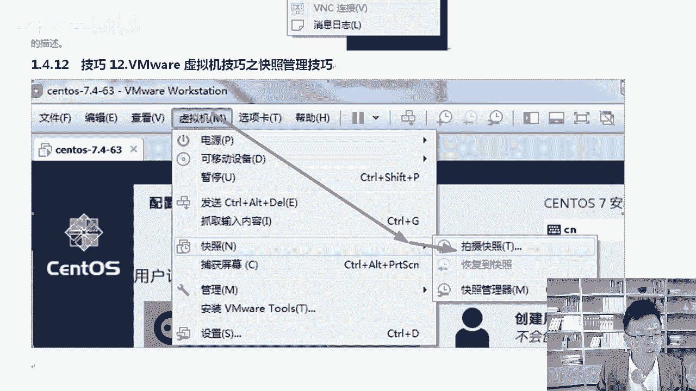

好，这地方快照可以写上自己的名字。即刻。啊，这个地方大家清楚了吧。这叫这个呃使用方法啊，VRV的使用方法。那么在这里最后呢老师给大家总结一下。ok。😊，啊，来在这里。在这里我们讲了是吧。

云计算啊这个课程的一个介绍，然后虚拟机的安装，还有对应的注意事项。比如说没有开启硬件bios的时候，应该怎么办？要把硬件bios开启，还有就是7。4系统的安装和VMM12的使用技巧。好吧。

那么相信这一节课呃，你应该有一个很多的一个收获。而且这一节课听完以后，你的lininux已经算入门了。好吧，后面就我们就可以讲一些命令了。啊，就可以卖过第一个台阶继续了。好不好？我是MK。

欢迎你继续听我的课程，好不好啊，拜拜。

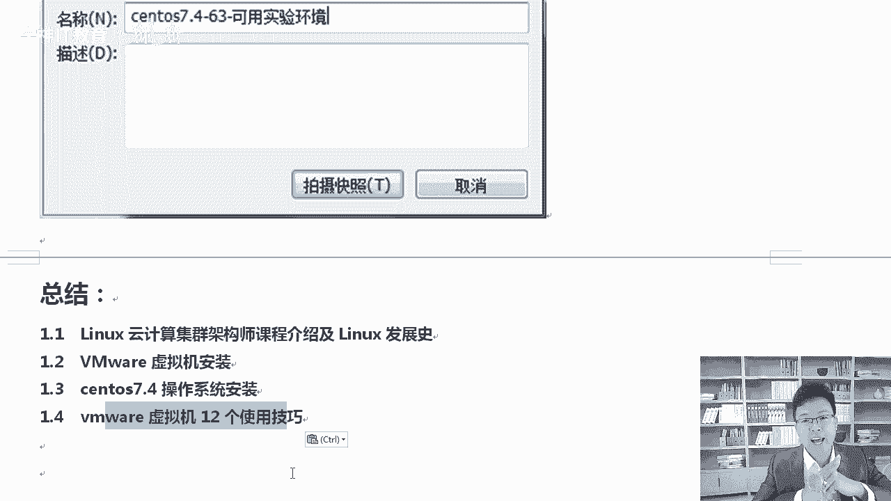