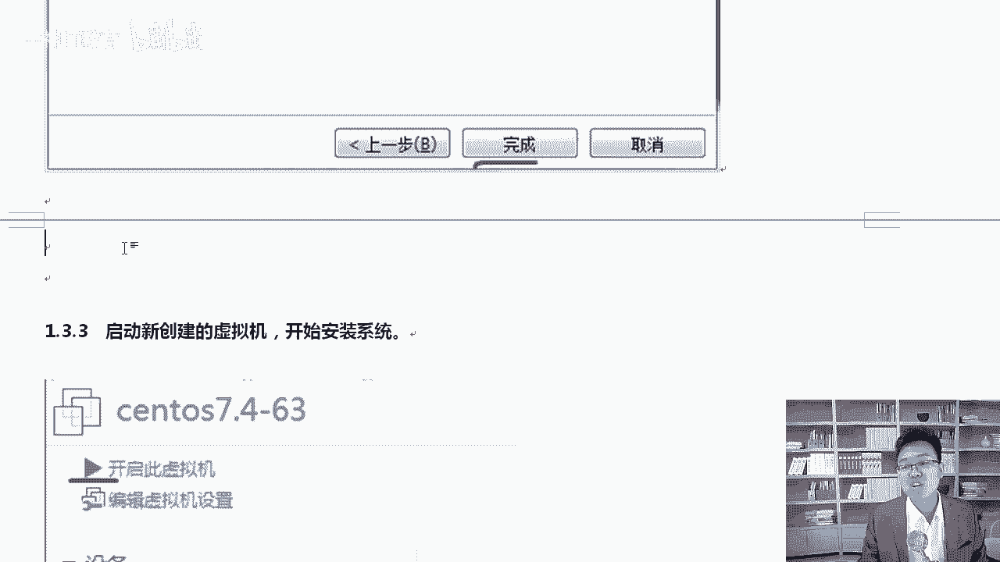
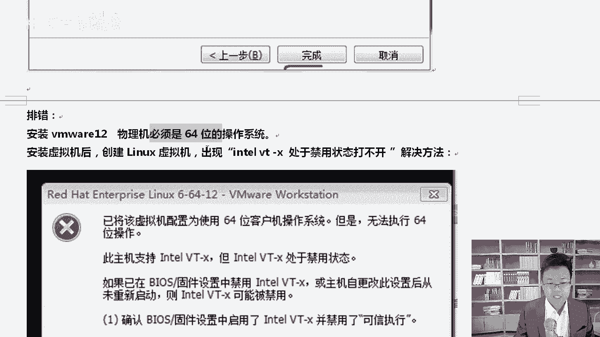
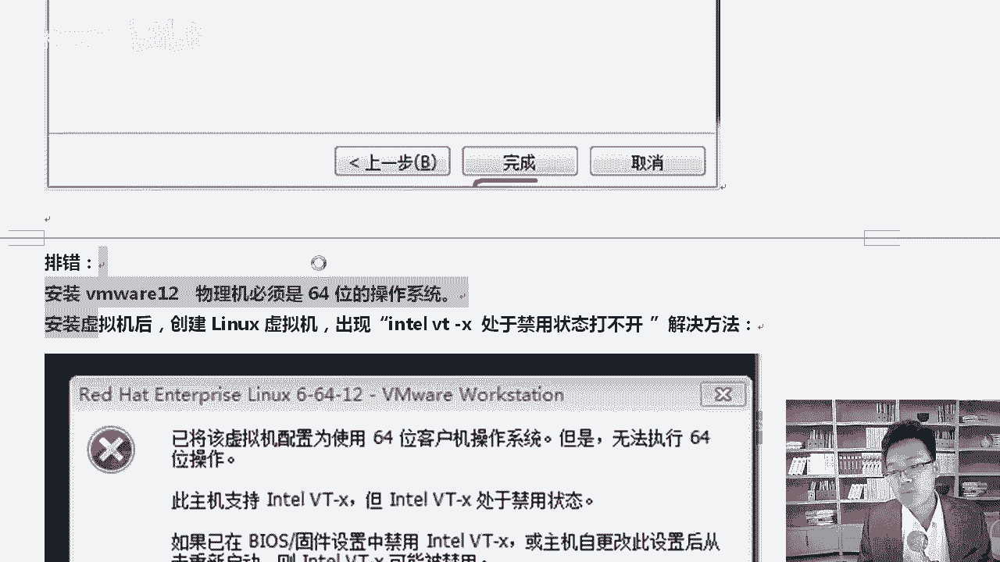
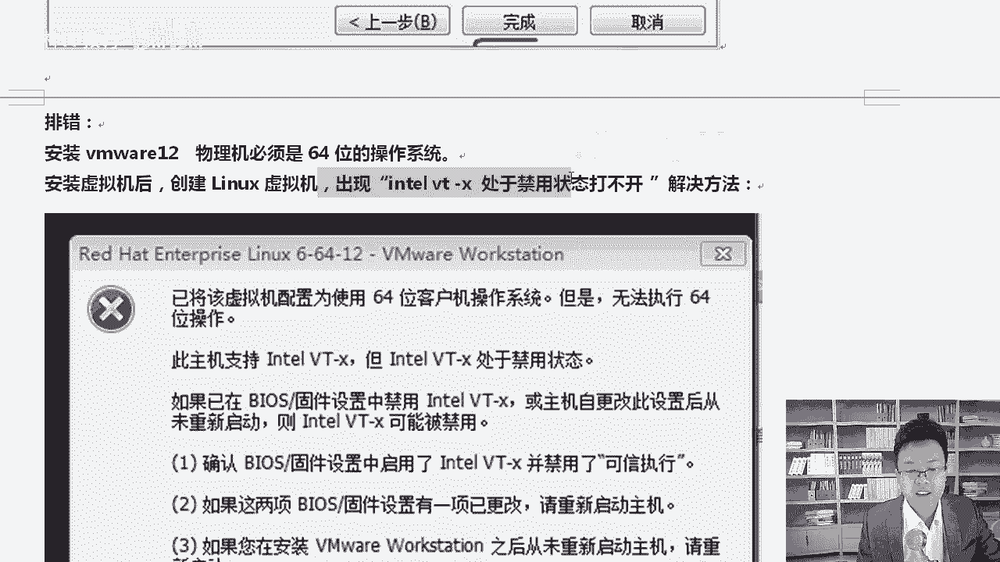
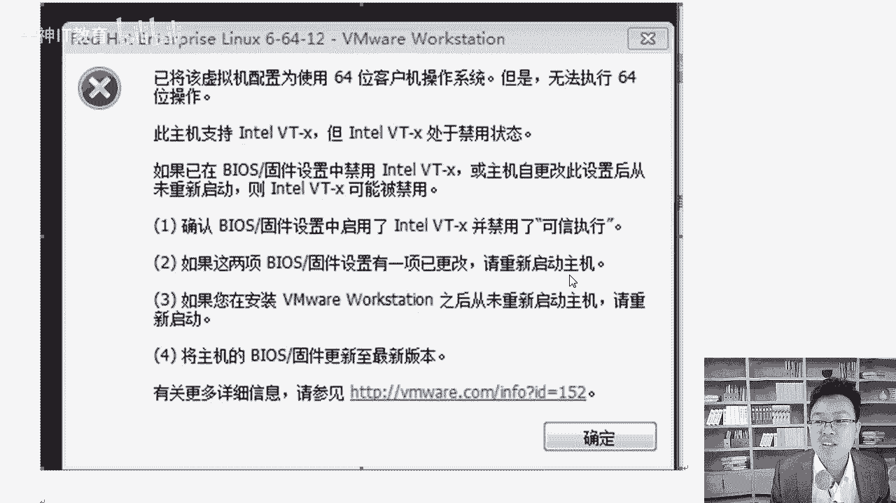
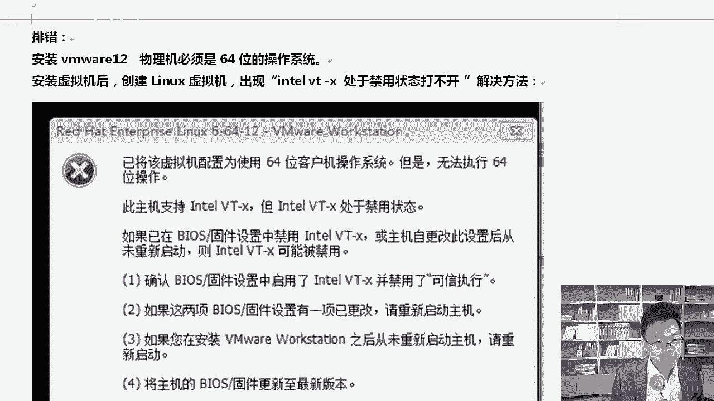
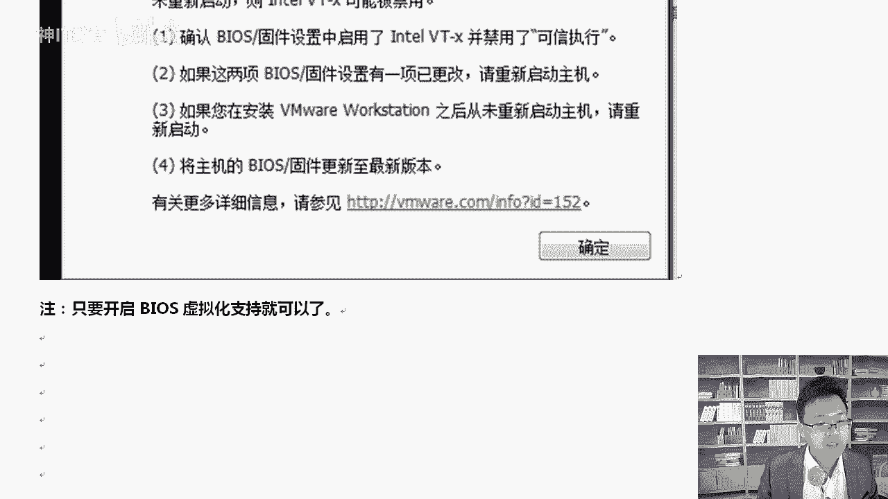
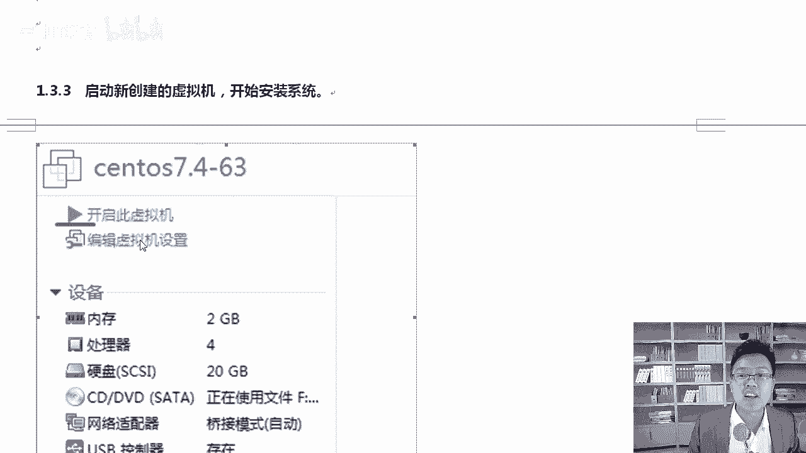
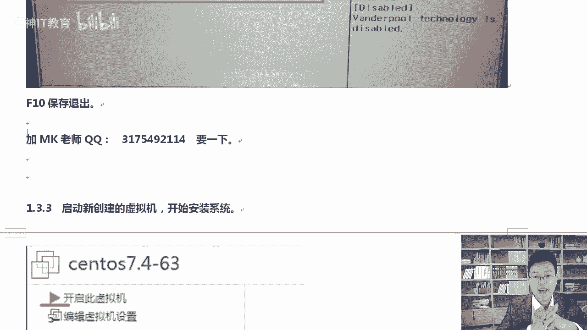

# RHCE红帽认证课程／自学必备／云计算／RHCE／Linux运维 - P4：解决vmare安装报错-解决intel-vt-x处于禁用状态打不开 - 学神科技 - BV16V411B7AY

🎼好，那在这里我教大家一个排错的一个方法啊，因为大家做的做这个虚拟机的时候是吧，安装的时候经常会出一个问题啊。第一个啊，大家用这个虚拟机，你得是64位的操作系统才行，好不好？排错啊呃，安装。

好，安装VMware好，安装VMware12。必须是物理机，必须是64位的操作系统啊，物理机必须是64位的操作系统。好吧，因为什么？因为我们安装的那个lininux就是64位的，32位跑不到6啊。

物理机物理机32位系统。因为什么？因为物理机32位运行不了64位的lininux啊，我就不打了啊，好吧，你这个物理机的系统必须是64位的，好不好？然后呢，除了这个问题以外呢，还有一个啊。

还有一个就是大家安装虚拟机的时候啊，比如在创建这个呃虚拟机的时候，经常会报一个错，什么样的错呢？

啊，我们尽常会报这个错，创建虚拟师出现这种in特VT处于禁用状态。啥叫in特尔VT处于禁用状态啊？啊，各位。

啊，什么叫做处于禁用状态？这个金融状态解决方法是这样，你看一下啊，它说此机支持英特尔VT，但VT处于禁用状态。好，那么已在bi之中是吧？如果已在bis固件中禁用了，那么请把它打开。

就是你的inter VT可能被禁用，你把它开启一下就行。开完以后重新启一下机器。

好，我我来给大家演示一下，让大家看一下啊，就是我们的bis是吧？😊。

其实一句话。你需要把这个虚拟化功能bios里面的虚拟化功能给开启。即便你是64位的系统，你也要把这个开一下。那么在这里呢有两种bios，好不好啊，比较土豪，比较新的一些机器。

它现在是以UEFI的这种方式。

好吧，那你就进入到你的bis里面，这是华硕的一个这种bis就很炫了。不像我们以前那时候都是啊黑色、白色、蓝色那种界面，对吧？在这里点这个高级模式啊，点完高级模式以后啊，我给你截个清楚点的图片啊。

点这个高级模式，点完高级以后，人家会问你是不是进入高级，那你要说肯定要进好，我要进高级模式。进完高级模式以后呢，在这里有个东西，什么东西呢？在这里你看到英特尔虚拟技术要不要开启啊。啊，要把它开启。啊。

默认是吧，bios里面是禁用的，你要把它开启，开启完了以后保存退出就可以了。好不好啊，这个地方大家就知道了吧，这是UEFI进入高级模式，高级菜单里面去找。其实bios里面不难，好吧，尤其对你们初学者啊。

bi尔斯好高深啊啊，他就那几个界面啊，一个界面一个界面找就行。😊，好吧，那么老式的这种呢。老式的我就不一步一步演示了啊，我给你截了个图，你去进到你的s里面是吧，去摁什么confire是吧？

或者说在configuration里面，你如果没有confiration，你就去找找啊，其他的一些选项。

反正一个一个找里边那个名字涨的就是这样inter啊 technology好吧ter technology改成enable这样的话就O了啊，改成enable就O了。最后呢最后保存退出啊，这样就行了啊。

这是解决这个问题。因为大家安装这个经常会出这个问题啊，我把这个问题给你说一下啊，都要保存重启一下，你再运行就没有任何问题了，好不？剩下你去创建虚拟机就不会出任何问题了好的，这个大家要知道啊。

遇到问题别慌，有我的好不好？😊。

加加我的QQ后面是吧，找老师多沟通，多交流。啊，同学们有什么问题可以跟老师多说啊，我把我的QQ发给你。😊，啊，在哪里呢？这是我的QQ啊，可以加一下，遇到问题也可以给我留个言，好不好啊，欢迎你听我的课程。

好的，拜拜。😊。

