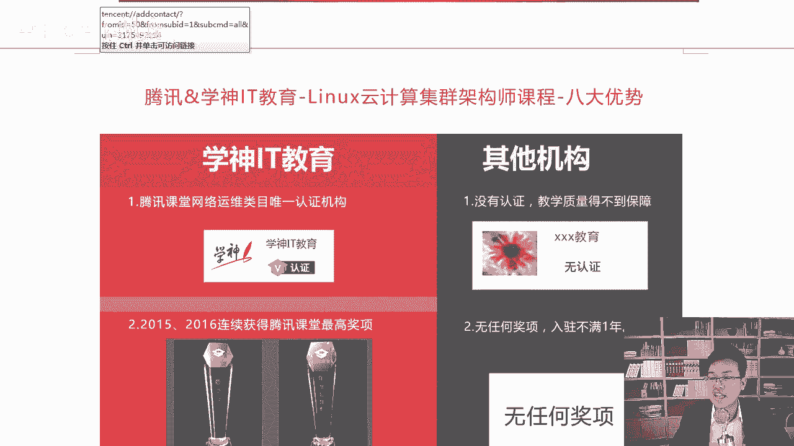
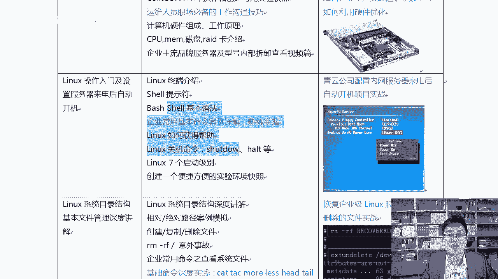
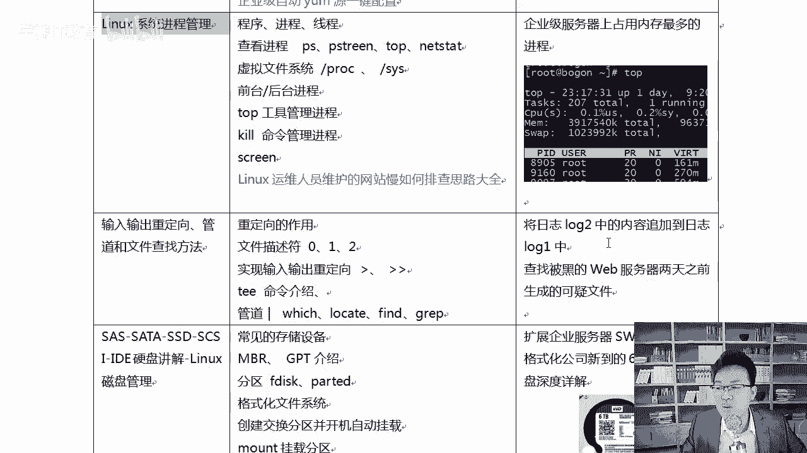
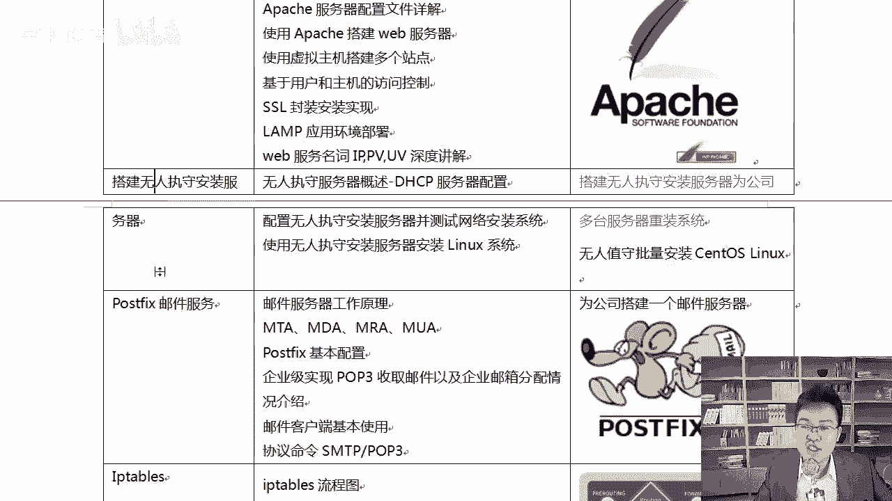
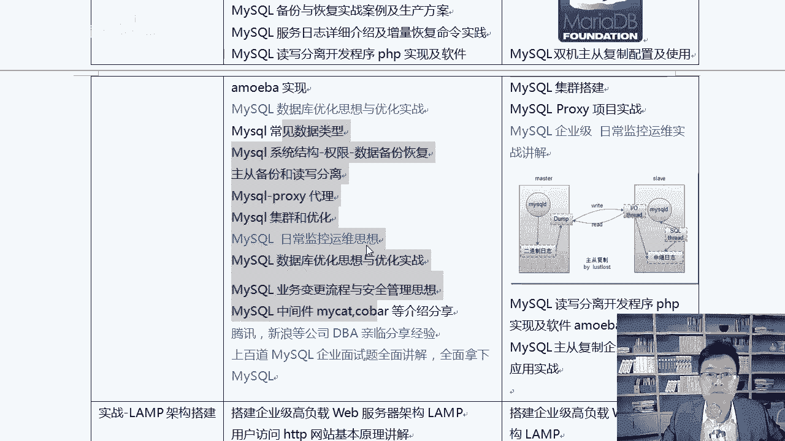
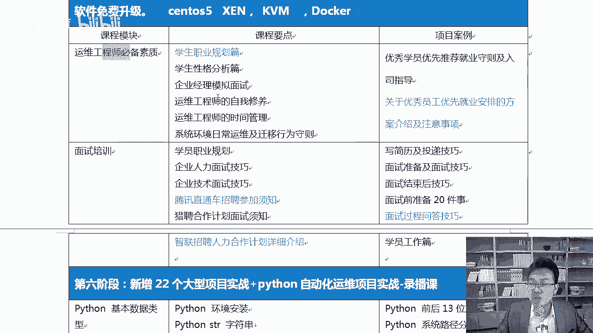
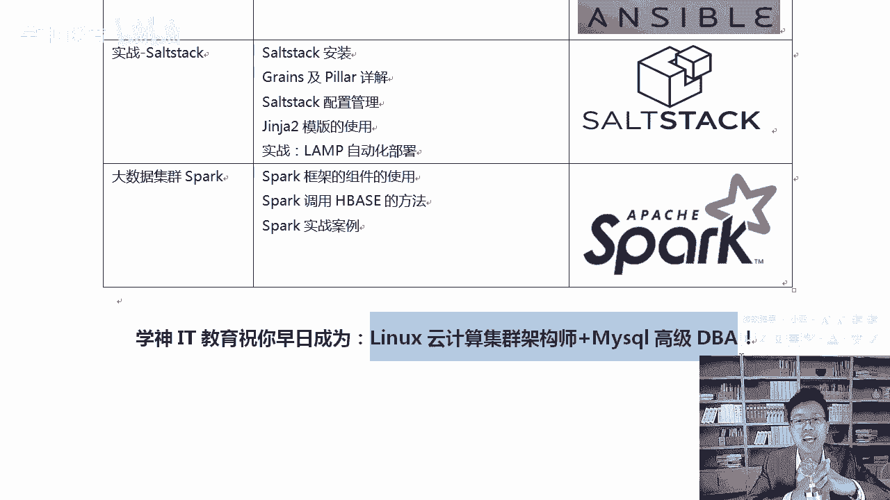

# RHCE红帽认证课程／自学必备／云计算／RHCE／Linux运维 - P5：Linux云计算集群架构师学习目标 - 学神科技 - BV16V411B7AY

好，在这里呢老师跟大家介绍一下后面啊你要跟着我一块学的内容到底有什么叫做lininux云计算集群架构师，这就是你要跟着我学的内容。好不好？咱们学生IT呢是腾讯课堂认证的一个机构。那这样的话更加有信服力。

在开始说之前我得先介绍介绍咱们的课程到底有啥优势这样的话大家也知道是吧，也看看是不是值得是吧？跟着我一块好好学。那第一个呢，咱们这个有个八大优势，好吧好？这是咱们学生拥有的其他机构没有的。

那比如说第一个咱们是腾讯啊，网络和运维类目里面唯一认证的一家机构官方认证了，自然是吧更加具有说服力了。那么其他机构还没有啊，还有一个是2015年16年连续两年获得了腾讯的最高奖项。

这足以说明咱们学生的教育质量是没有任何问题的啊，因为其他机构还没有获得这这一类的最高奖项。啊，学完以后呢，你还可以获得腾讯课堂啊，给你的一个毕业证。那有。😊。

腾讯课堂给你的倍数，我相信加上你的实力啊，你找工作会更加的方便。好吧，其他机构可能没有证书，或者只是自己啊机构简单印了一个证书啊，不太具有说服力啊。

而04年呃14年咱们应该是属于腾讯课堂最早入驻的一家机构啊，那时候腾讯课堂也刚开始，那到现在是39万。实际上大家去看课程的详情页的时候，我们应该已经达到了49万啊，42万左右的一个这样的一个学员数量。

所以呃而且好评率还一直可以达到99%啊，这样的话大家就可以放下心来，好好学了。😊，好吧，那么评价一个机构的好与坏，从这里就能看得出来了。这个大家清楚了吧？好，知道了这个以后呢，在哪里呢？

我们简单的看一下也行啊，让大家知道一下。比如说我们随便打开一个腾讯课堂的一个页面啊，这是MK我经常做的一个公开课。在这里你可以看到这个学员的人数以及这个机构是不是啊是认证的。好吧？如果认证的。

那肯定是啊可以让你更加信服的。再往后呢，课程内容这个地方其实也做的非常的棒啊。在这里咱们的课程里面包含的linux安全和渗透相关的内容。😊。

啊，那么其他的机构可能没有linux安全这块内容，而安全还是非常重要的。你说对吧？啊，还有就是周一到周六，那么4个月科学高效的去安排这个课程。因为咱们的课程内容其实挺充实的啊，挺充实的呃。

为什么是4个月呢，有同学不能5个月，6个月吗？这个还真不能啊，你看面授的那个地方也一样，永远是4个月，因为人是有精气神的，四个月是吧？能坚持的能坚持下来已经非常棒了。好，拖到5个月或者8个月。

啊你想想是吧？一年8个月是吧？没有周六周日或者每天晚上都做那，你也受不了所以要做是吧？就是一鼓作气，4个月，哪怕瘦十0斤肉，我也要把这个技术学出来。😊。

啊，就要这个啊，所以我们不会像他其他机构一样，135那样上课。因为同样的这个课程内容，如果换到135去上。那得需要8个月的时间，要么是他就把课程内容给你减少了啊，也缩到4个月。

但实际上内容就相当于少了一半。那样对于大家来说肯定就不太负责了，我说对吧？😊，所以药学就是啊一鼓作气，一到啊周一到周六就4个业务快速的出来，就要当高手。好吧，那么国内首次引入阿里和腾讯云双平台教学。

还有呢就是还会给大家加一些项目实战和pyython开发的一些录播课。啊这样的话大家就可以放下心来好好学了，好不好？呃，讲的内容呢从这儿啊，从7。

4最新的啊学神这个linux课程是应该是说在中国算是啊就是业界领先的，因为只有学神讲的是7。4。😊。

大家知道要7。4里面是吧更加的稳定，而且增加了非常多的新的功能。你这个时候正好学一学。然后到工作中正好能用到。好不好？而且7。4确实到现在已经比较稳定了。啊，为什么7。2的时候。

那个时候没有开始开始深入的去讲呢？因为7。2确实不稳定，7。4已经很稳定了。就像大家用6一样，那个时候是吧，6。56。4已经很稳定了啊，lininux就是这样的啊，五的也一样，五的是5。45。5啊。

都是从这个时候开始大规模的开始使用。😊，好不好？所以这个时候你要学学，而国内的其他机构还没有讲7。4呢啊。那么在这里看一下啊，常见的服务入门到精通一步一步来的啊，先系统再服务。

再资深知识安全集群存入桥优。这样由深到浅是吧，很系统，再到大啊虚拟化opent和docker。好吧，就业这个地方你也不用担心，那会有老师给你做就业指导啊，告诉你的简历怎么写，题库应该怎么搞。OK好。

你需要做的就是塌下心来把基础搞好，就这么简单啊，新增22个大型项目实战，还有这个python这一块的课程啊，对你来说就更好了。😊。

好吧，那么从这儿开始，后面有对应的项目实战，每一节后面都会有对应的项目实战。后期大家听我的课程的时候，你会感觉到真的哪怕就一个简单的命令，比如说上当关机，或者说啊装个系统。

我都要给你加入一些工作经验上的东西。这样的话大家学起来会更好一些好，上当，你看开机后自动开启。😊。

IM删除删完以后如何恢复呢？咱们也有讲到还有VIVI如何解决乱码这些问题，每一个后面都有对应的项目实战，好不好啊，这个地方大家要知道啊，包括用户和组相关的这些内容，还有权限了。好，软件包的压缩进程。

每一个后面都有，好不好？😊。

还有你喜欢的这种啊sarass塔各种各样的硬盘，就是软的硬的，在咱们这个课程里都有学到。老师硬件说，我不带手可以能学吗？可以啊，我会教你软的也一样，shall开发啊，shall编编程对吧？

还有系统服务架构。😊，所以我一直跟大家说，我说lininux架构师。他能给你打一个非常非常扎实的一个基础。好，无论你是做网络的还是做测试的啊，再或者你们是做开发，做了45年了。

或者34年想要再往上提升一下，一定要把架构这块打扎实，反正就4个月。😊，好不好，学完以后，你你的这个知识面就会非常的宽啊，再往上走，往技术主管啊，或者技术总监这个方向去走的时候就会很轻松。包括是吧？

你尤其有的同学可能不是科班出身，就是我不是计算机专业毕业的，我可能搞数学或者啊搞养殖或者搞其他专业的。那么你们想步入linux这个行业，或者想步入IT这个行业。😊，我的建议不要上立马去做开发。

因为你没有那个经验。好吧，上手很困难，先把lininux学一学，因为lininux能给你打打一个很好的一个很扎实的基础，能让你知道什么是硬件，什么是软件，每个东西到底是什么。有了这个基础以后。

你再去啊去做开发。会走的更远，知道了吧？如果你上来去做开发。别人跟你说个sars是什么，你一脸懵是吧？给你说个sar塔是什么，你也一脸懵好不好？给你个6T的磁盘，让你去分个区，你也不会。

因为那个时候我们得用GPT分区表，我们得用好不好？得用这个得用party的。什么是MBR分区表，不知道。然而这个东西实际上在大学里面都有讲过。😡，好，所以尤其是你们没有经验的同学。

更应该把这个课程先去学学，给自己先打好扎实的一个基础。

好不好？😊，关键挣的也不少啊，学完这个课程是吧，拿到1万到1000也挺轻松的啊。😊，呃，文件系统这个地方好吧，如何去修复这个东西啊，read01510。

对吧你作为一个技术技术主管，我们要上线一个项目，里边是用的是readd10技术。readd10是啥呀？是吧？天天做开发，从来没有接触过这个，你说那能行吗？那能当技术主管，能当老大吗？不行。😡，好。

你要知道read10是什么，好不好？LVM快照，还有日志相关的启动故障的网络相关的，还有sll脚本。

这样吧。啊，做开发的同学，你们记住，学完以后不是让你去当程序，不是让你们去当运维，而是让你去当技术主管。你至少要对这个技术指导，或者说对他很熟。

做与不做是吧，你下边有人去做，但是你要能领导他好不好？服务的话，35种服务大概有第二个阶段啊，常见的服务每个服务后面的项目实战会更多啊，我们常快速来说一下，你看DHCPDNS啊。

阿帕奇无人值守邮件的apptables啊vis my circlecle高级DBAmyscle高级DBA这个地方讲了很多啊，大概将近20天所以学完以后你也会成为一个高级DBA。😊。

好，my circle集群主从分离my cut MHA啊等等都有讲到。

好，那么包括meral DB啊，这个也有讲到啊，因为从7开始my circleql啊，其系统里面带的叫meral DB，其实就是mysl另一个分支。好，还有lamp架构这一块的内容。

包括我们的Ng的tom cutnes监控zas啊puppet和。自动化运维s stack也有。也就是说在这里啊，这是第二个阶段的内容。那么第三个综合的项目实际上咱们也要有的啊。

第三个就是安全调优及群根存储了。

好，你认真看一下这个安全的重要性。因为不是每个机构都讲安全的，而安全又是你必须得学的，知道了吧？

啊，你可以认真的看一下啊。好的话，你在心里给我敲个6。服务安全网络安全防火墙常见攻击手段DDweb circle ARP暴力破解。

缓冲器预出IDS入侵检测TCPrappper对称加密C对称加密CA认证snopen vPNN maproet木马程序黑客提全和凯y等等。

怎么样？

记床了吧。心里啊，这就是你要的啊这就是你要的集群这个地方也有keep live n啊H a proxy heartbe high doop啊，咱们这一块也都有讲到，还有一个是什么呢？

存储这个地方signnaFC3MFS云存储。

你想想。那么大的一个数量是吧？都说大数据大数据没有一个很好的存储，它搞不定的。好不好？你得知道这些分布式存储到底是什么，什么是散设备，什么是FC散，什么叫做多路径冗誉。

好唔好？这样的话才真的能去做一个技术主管或者技术总监。

啊，系统调优内核调优CPUmemca和waish等等，这是调优相关的，让我们的整个系统发挥出来它的应有的性能，好不好？

综合的项目有再往下，咱们有这个地方，虚拟化企业级虚拟化和opent。你看KBM的啊包括我们的dockerkuubernet也都有讲最新最前沿的技术都有啊，包括dkins也有，好吧，虽然他没有写到这上面。

但是我们的课程，然而已经开始在讲了。

好不好？清楚了吧，这个地方也有去讲到啊。啊，还有一个是什么呢？公有云这一块，还有opent私有云啊，所以说大家你们就放下心来好好学吧。一旦课程更新了以后，到那时候，你还可以跟着免费重新学。😊。

知道了吧？现在我讲的是7。4，等后期好吧，等后期，比如说我又出来个8。4啊，9。4。然后怎么办？然后你那时候找我啊，到那个时候你再查漏补缺一下。老师，我想我想跟着转到那个新的班里是吧？

我想学习那些前沿的技术，可以吗？可以。啊，真的可以啊，现在我们班很多人，以前你看咱们讲s度S机的时候。😊，这个真是啊，以前我们讲s斗S6的时候，s斗s斗S6那个时候没有什么。

那时候docker还不不够火。那现在讲到7的时候，很多同学老师我想学一下docker可以吗？可以，像14年15年那些同学就都过来重新学一下，他只学他最新的。😊，啊，这个就相当于说包括K8S。

是吧还有我刚才说的jekins。啊，这些都有。明白了吧，还有sk。啊，所以说这个东西就相当于什么？就相当于软件怎么样。免费升级一样，你懂我的意思了吧？你的知识库有了学神，就相当于给你提供了一个知识库。

这个知识库可以免费升级。好吧，初心技术了，晚上坐到那儿。哎MK来，我们分享分享这个技术呗，可以啊。😊，好，反正我讲公园课也是讲给你们讲也是讲。对吧坐到那儿用两个小时给大家哎聊聊是吧？

最新的基础啊给大家分享分享。可以的啊，完全可以，而且这个非常的方便。知道了吧？好，非常的方便，你只需要学你最新的那些技术就行了，好不好？啊？在这里比如说open stack啊，还有往下继续啊，这是出来。

你放心啊，7里面加了个dockerK8S等等这些新的技术。😊。

好吧，在在什么在八的时候又有新的技术，九的时候又会有新技术，每一个每一个底每一个大的版本都会增加一些全新的技术的，真是这样啊。😊，啊，真是这样，你像我们那个时候学是啊讲的是是森头SG啊。

我那时候教你们森头S5的时候，那个时候虚拟化用的是X1N。啊，到到这个6的时候说我们虚拟化就开始讲KVM了。😊，然后到期的时候是吧，就出来一个全新的技术docker。啊。

我告诉你到八的时候还会出新的技术，到那时候你再过来行吗？😡。

好，这个就业这个地方你也不要担心啊，会有老师带着大家去做的。还有新增的python相关的内容。因为python跟linux运维还是。

关系还是非常密切的，很多同学也想学。那么在这里也给大家准备了一些课程，让你啊学习一下好不好？还有后面这个地方，22个大型项目实战是相当于给大家列了一个。😊。

另一个知识库，你懂我意思了吗？有同学说老师我学完这个东西还是不够啊，我还想再提升一下，那么在这里会给你们增加。😊。

啊，增加一些readymgoDB的是吧？啊，还有codedi集群服务这块地方，还有s个m啊，SN洪水攻击的阿帕奇的。

中间人艾艾 cap啊，中间人攻击的啊ELK的啊，这个haveunsable thought stack spark整个这就是你要学的内容。好不好？期待你早日加来啊加进来。

好的，这是内容。