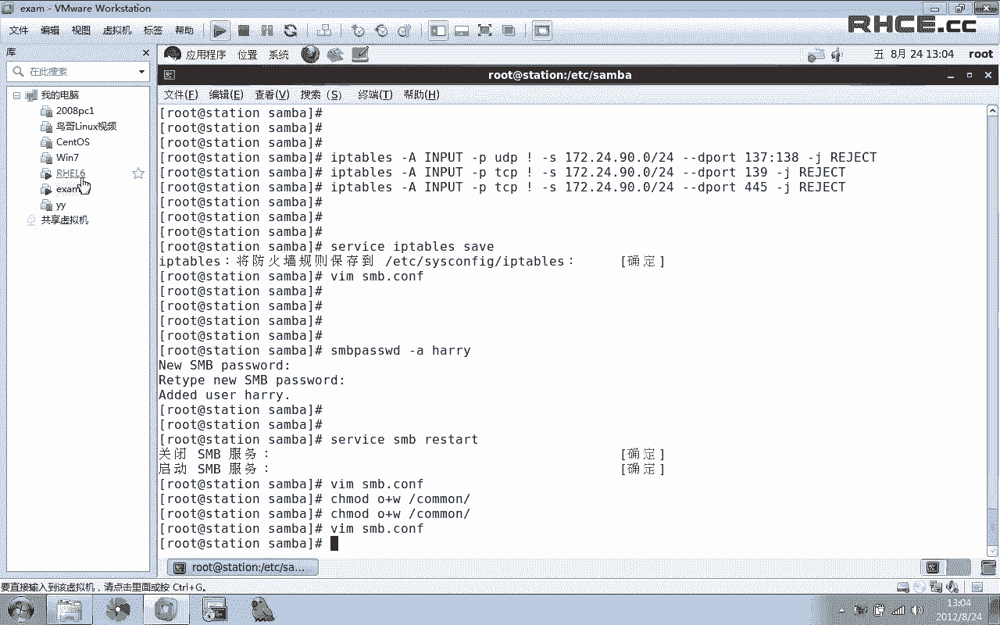
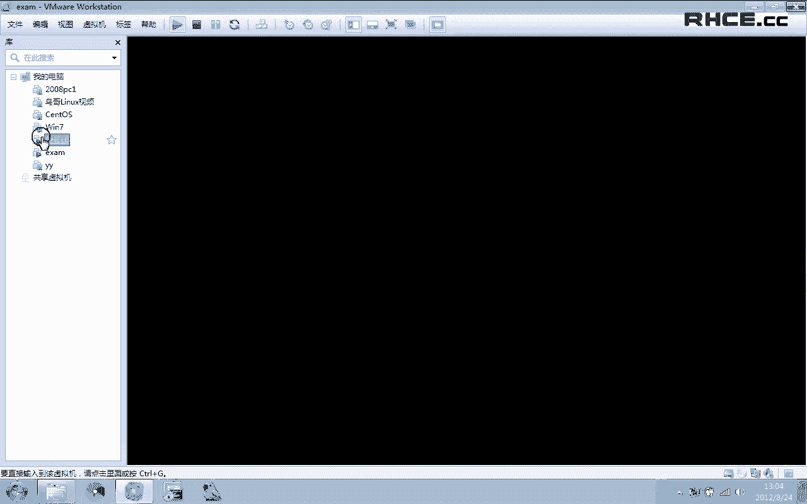
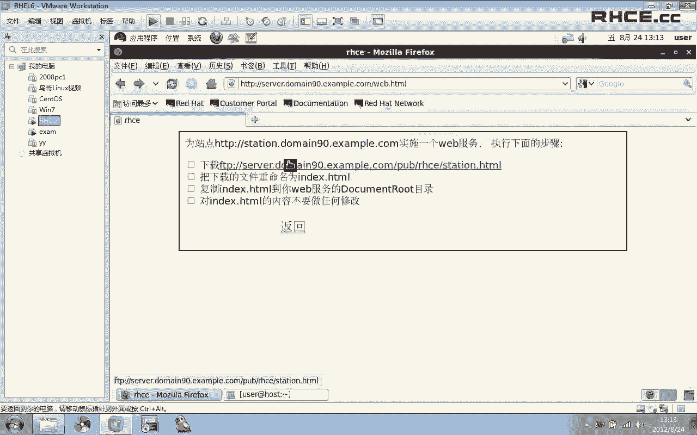
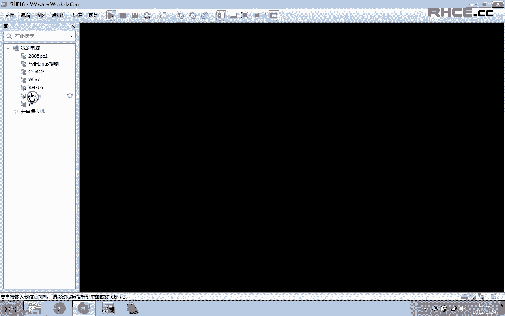
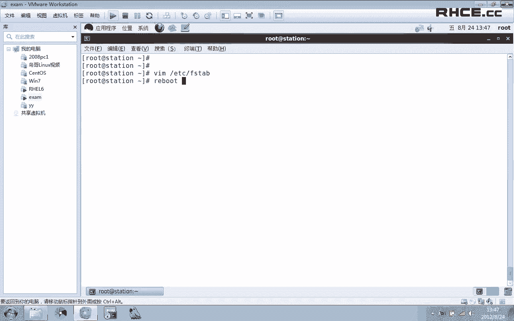
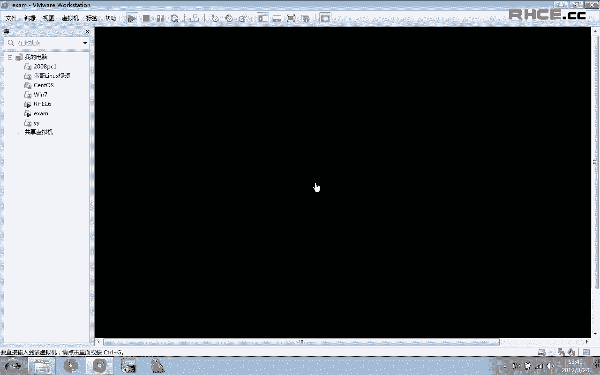
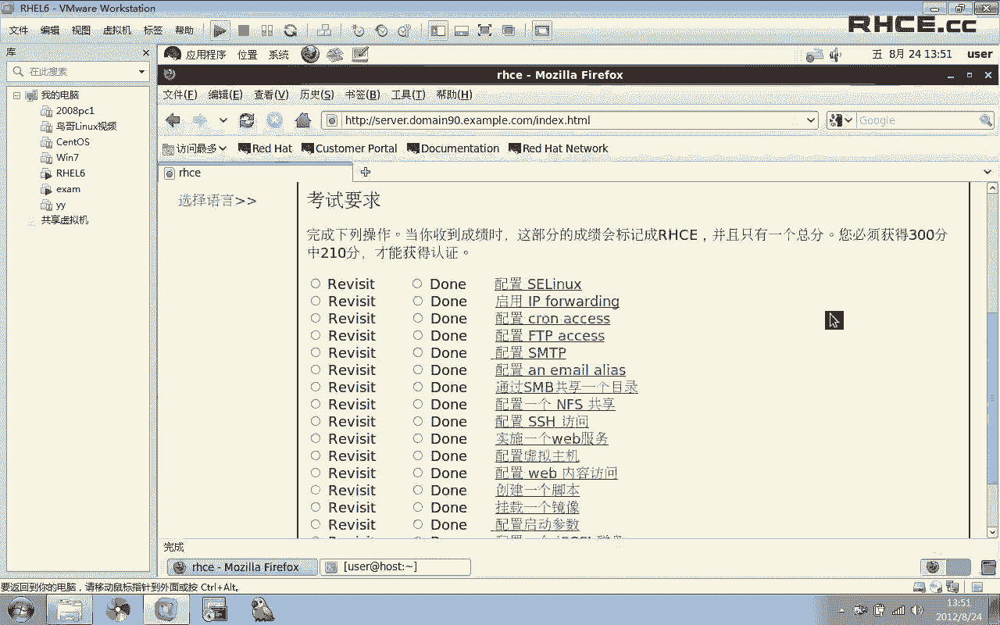

# RHCE考前辅导 - P1 - iLoveBurning - BV1Gt411y7oF

大家好，欢迎收看这里是由R4点CC为大家带来的2C的考前辅导和RCSS是一样的。我们考试呢也是需要两台机器，我用616这台机器来模拟是物理机ex。这个模拟的是这个物理机里面的那台虚拟机。😊。

当我们进入了物理机之后，我们会在桌面上找到我们的考试题目。好，我双击打开。这里面他有我们考试的一些介绍。比如说他他告诉我们，现在呢我们已经给我们提供了一台虚拟机是吧？而且在考试过程当中，我们不要去作弊。

否则的话分数可能变成零番。呃，C的总分是300分，然后考试你必须达到210分，也就是210分是及格分。好，我们来看一下这里面有一些附加信息。附加信息就是大家自己看一下就好了。然后这里面有一个有一个东西。

我们看一下，它告诉我们的一个亚母源在什么地方呢，看到了没有？他告诉了我们亚母源在什么地方呢？我们呢就是要把这个亚母源给它装起来，把样母云给它设置好。因为在虚拟机里面默认是没有亚母源的。好。

我们现在进入虚拟机。这里面下午考试的时候，我们是没有必要去破解密码的。密码我们已经知道了，在考试题目里面已经告诉我们了。😊，大家看一下。密码。屏幕已经是不是已经告诉我们密码了。

而且当前迅拟的密码就是这个密码。好，我们进来，我们首先进入这个密码，进入这个系统root，我们用root登录。😊，然后输入密码。进来之后，我们首先第一件事情就是要把样母源给它设置好，把样源给它设置好。

好，我先把这个样品名的地址给大家复制一下。好。在中端中打开。我把自己伸大一些。😊，我们首先的是底下亚美云。这个在SCSI里面，我们已经知道了怎么设置了，是吧？😊，我把它给复制粘贴过来。

如果说不能粘贴的话，大家要手工的去写。O看样本元呢我们已经设置好了，我们清空一下缓存。😊，监控一下缓团。好。大家记录一下，在考试之前，在正式的做题目之前，我们首先要把防火墙给他清空了，然后保存。

这一步大家不要忘记了，做这两步的目的就是方便我们的操作，方便我们的操作。好，最基本的已经色置好了之后，下面我们就开始来看题目。首先第一集。

它让我们配置一下SlinuxSlinux必须在infor模式来运行。好，我们来看一下。该等你放肆。当前是在promiss事务下的对吧？好，我们来试理一下se boss一。查看一下，现在变成了ifos。

但是我们我们在命令行里面敲的，它重启之后就不生效了。所以说我们要修改一下配置文件。SC下面confi个这个文件。然后为了防止写错，我把这个PR复制过来。大家写的时候。要小心一写，别写错了不要写错了啊。

然后我复制复制粘贴一下。好。😊，八80不3。那第一集就做完了。我们来看第二题。第二题说的就是要启用RP的转发。他告诉我们，在你的机器上呢要启用RP转发，那如何来启用呢？是这样做的Iical一。

parrk下面的ss net下面的RRPV4。下面的rRC forward。fo我们敲这个命令，它就启用了RPV4的转发功能。RPV4的转发功能。但是你敲这个你敲这个命令之后，它只是当前生效。

重启之后重启系统之后它就不生效了。所以说我们要编辑配置文件sctrl里c。打开。然后我们找到net IPVI forward的这一行，我们把这个零换成一。保存。O那么这一题我们也就结也也就结束了。好。

看下一题。😊，配置计划任务说me这个用户它不能使用cl不能做计划任务。但是这个限制呢不影不能影响其他用户，其他用户可以正常做做计划任务。为了我们要是想共享让某一个用户可以做计划任务的话。

我们就编辑cl点deny。有这么一个文件，这个文件你只要把那个用户名写进那个文件里面来就可以了。凡是出现在这个文件里面的用户都是不能做计划任务的。好的我打开，然后我们把这个用户看一下，这个用户名叫做。

用户们叫冷漫者是吧？😊，复制一下，别写错了。好，我们粘贴过来。36有。美女，我们写过来，看有没有写错。😊，好，没写错是吧？那么写好之后，把这个用户名写过来，那么这个用户他就不能再做计划任务了。

凡是写进这个文件里面的用户都不能再做计划任务了。那我看那这一集我们也就过去了，很简单。然后下面一题配置FTP返还。好，打开他说我 station点早90点影moncom建立1个ITP服务器。

要满足下面的要求。那好。我们首先把FTPT装进去，让我们inst到VSFTPD杠Y。先把FB给它装上去。大家来看一下，如果说一开始你没有把样本源设置好的话，这个时候你样本就没法使用。听明白了啊。

在24考试过程当中，亚美云他是没有给我们设定好的，我们要手工的去设定一下。好，这个服务装好之后。我们想都不想，首先做一件事情就是serviceVSFTVD把这个服务重启，把这个服务启动起来。

然后再敲个命令VSFTVD这个命令大家千万不要忘记敲了，切一个confi这个命令，千万不要去敲了，千万不要忘记忘记去敲了。好，第级，他说FTP允许匿名用户来访问。

来下载这个在RCCSI里面已经有了这么一个题况，它默认就能够访问。所以说这集实际上我们就不用管它，它默认就能够下载的。好，这集它就过去了，默认是可以下载的。

第二个他说早90点excom之外的客户端是不能够访问的，是不能够访问的。那么我们这里面就有限制，限制的话，你可以使用你可以使用GTPTT也可以使用防火墙啊，两个都可以两个都可以。

那我们可以就使用GT来做好了。😊，好，编辑house是al编辑houselo在这里面我写。VVSFPD们好，云谁可以访问呢？我们说的是早漫90点ex time早漫90是哪个网段的？我们来看一下啊。

早班90是哪个网段的呢？都是172。24。90。0。看到了没有？172。24。90。0。这个网段，大家在考试的时候看清楚自己的网段啊。好，那么我们回过头来再看一下。😊，就允许这个网站访问。

其他网站是不允许访问的。我在号斯瓦love里面写。172024。90点。这样写，然后再再回过头来写how deny。deny然后怎么写呢？我们写一个。VSFTPD。我现在已经在订单案里面写了。

那就是写个2拒绝所有的就192172024。90。0可以访问，其他的全部在底单案里面写，看到了没有？这样写就可以了。大家不要忘记了啊，我们看一下里面的内容。😊，你看在alow里面就要写这个文段。

在里面写一个R，那么除了这个网段可以访问，其他的网段都是不可以访问的。好，那么我们的FTT到此就结束了。这里面大家一定要记住，一定要敲一个check copy的这个命令。

下面有一个让我们配置1个SMTP服务，配置1个SMTP说配着你的系统提供SMTP服务，要满足下面的要求，说你的邮件呢应该能够接收远程远端，还有本地的邮件。好，我们来看一下。

当前我的系统现在已经启动起来了。啊，post pick之间它是行动起来的d。😊，我们来查看一下。25灯口。大家看这个时候默认情况页面，二手端口，它只监听自己的呼环接奏是吧？那么好。

我们就来编辑一下post fix。下面的ma给CF这个文件。编辑这个配置文件，编辑这个配置文件打开我们找到一个interfi。因该太子。找到它in in，找到这么一行，然后我们往下找，把al这一行。

大家看到这里面是不是有一个al看到一个al了没有？我们把这个out这一行注释给去掉。大家记住一下，还要把这个给它注释掉，听明白了没有？把loc house的这一行一个注释掉。原来是这一行是没有注释的。

这一行有注释，我们要做两步，就是把out这一行的注释给它拿掉out这一行注释给它去掉，同时给loc house的这一行注释给它加上一个注释。如果说你只是把它的注释给拿掉了。out这一行注释拿掉了。

但并没有给它加注释的话，没有给loc house加注释的话，你会发现它根本就不生效。所以说这一题目我们做的就是给out这一行把最前面的注释给它去掉。😊。

同时把local house的最前面的注释给它加上一个注释。O做好之后，我们保存。servervicice post fix restart。然后我们查看一下。你看它现在坚定的是所有接口。

所有接口现在就已经满足了我们的条件，满足了我们第一题的条件。如果说你不放心的话，你还可以敲一个che confipost fix啊，它默认已经是按了。实际上这个命令我们没有必要去消。如果说你不放心的话。

校编也没错。嗯，第二题，哈ry用户必须能够从远程机器接接收到邮邮件。那么第一题，他让这台服务器可以接收到邮件了。所以说第二题我们他默认就是已经能够接收到邮件了。harry用户已经能够接收到邮件了。

所以说第二题我们也没有必要去做，他就是使用默认的就可以了。你只要把第一题设置好。第二题他就他就可以接收到远装的邮件。

第三题投递给harry的邮件应该放放在harry的默认邮箱wa上面的smail下面的ry。大家记住一下，这个邮箱这个邮箱它就是哈尔的默认邮箱，这个邮箱它就是哈尔的默认默认邮箱。

所以说这一期我们也没有必要去修改的。这一期我们也没有必要去修改的。好，实际上这一题我们只要做第一级，剩下两集它都是默认的了。这题考察的是你能不能看懂这些东西。

你知不知道哈尔用户他默认有邮件就是放在这里面的。O这题就结束了。我们来看下一题。嗯，配置一个电子邮件的一个便民。他说，win尼的MGA配了一个电子邮件别名，凡是发送给addmin的邮件。

全部转发给na塔卡用户是吧？全部发送给娜塔卡用户。那好我们来做。我们首先编辑的是als这个文件ATTC下面的als这个文件，然后我们跳到最后一行。

然后开始写题目要求是凡是发送给凡是发送给addmin的用户邮件全部转发给南塔莎是吧？那addmin。左边是别名，大家记住一下，冒号左边是别名，右边是真名。这句话的意思就是，凡是发送给admin的邮件。

都会转发一份给娜塔莎，凡是发送给。ad面的邮件都会发转发给南ta卡用户。好，我们这样写好，记录一下，冒号左边是别名，右边是真实的邮件，真实的名字，冒号右边要有空格，一号冒号右边要有空格。

大家写的时候就按照我这种格式来写。好，写完之后，我们还要设一个命令，new new alliance这个命令。好，下面我们测试一下杠U娜塔莎。那他话现在是没有邮件的，是吧？我来测试一下。

mail杠S发主题是XX好了，那他是发送电哪他塔是吧，那他。反正哥的命。你看现在就是发送在的命字。那么我们再来看一下纳塔纳佣金，你看娜塔莎就收到了一封佣金。看到了吧？那他呢他就收到了一封邮件。好。

那这一集我们就结束了。啊，紧接着我们现在来我们来看下一节啊，他说通过s码来共享一个目录。他说使用桑码来共享一个目录，是根下面的common这个目录。首先呢我们要把这个目录给它创建出来。

创建出来这个目录好，common把这个目录创建出来。好，大家记住一点啊，当我们创建这个目录之后，创建好这个目录之后，我们所所要做的第一件事情就是要改变它的上下文，趁着嘴更替。森马。桑码是。下玩具。

是要向前记。我们要改变它的上下文。做这个题子做这个题目的时候，当我们创建好这个目录。紧接着我们就要改变它们改变它的上下文。这一点大家一定要切记。这一点一定要切记。好，改变完上下文之后。

它是说又使用扫码来创建一个目录，对吧？我们就要把扫码给它装上来m in。😊，首先把扫码给它装上去，首先把扫码给它装上来。好，装好之后我们不用考虑太多。首先把这个服务协动起来FMBstar。

check makeFMB啊，这两个大家一定要记住，先把这个命令先敲出来。为了防止你后面忘了，先把这个命字说出来。然后我们再看具体的题目。他说你三马必须是工作组staff里面的一个成员，我们开始来改好。

修改它的配置文件，SMB得抗谱。我们现在给他来的工作组。给他工作组的话，那就是suff。我克问我是维斯ta夫。STIFFstauff是吧？是不是suffok这题做完了，然后共享名为common。好。

现在开始让我们来做具体的共享啊。呃啊写到最后一行。😊，好，我们开始写共享啊，然后共享名为common。好，然后pass。等于边下面的。Com们。好，这一题现在就做的差不多。这题，但我们共享哪个目录。

你看共享没有common做好了。他说common这个文件夹，它只能对倒卖90点examp点com域里面的客户端那够访问，其他的都不能访问，对吧？其他的都不能访问。然好我们来写防问权啊。我们来写范问题。

呃，桑马它使用的是4个单口。是UDP的137138。还有TCP的139139和445。好，那么在这里面我们来写一下防火墙。😊，我们首先查看一下防火墙啊，杠L杠I现在防火权是空的。

因为一开始的时候我们就把防火墙给清空了是吧？好，我这样写I table杠I inputput杠PUDP。然后是什么呢？叹号杠S。S除了谁是吧？是除了这个域，其他都能放完。😡，其他的域都不能访问。

除了这个域除了除了这个域之外，其他的域都不能访问。那好。这个月的RRP网段是172。24。90。2590。0-4是吧？杠G杠杠deport杠杠底。port137冒号138。干。G。Reject。嗯。

我们来看一下这里面好像好像是写错了是吧？😊，看一下啊。呃。啊，是UDP啊是UDP不是UCPUDP。然后呢，我们再接着开始接着写。639。是TTP的139。还有TPP的445。大家来看这句话是。

除了这个网段之外，其他的都被拒绝了。除了这个网段之外，其他的都被拒绝的。我前面加了一个叹号，就是除了的意思就是除了的意思。我们修好防火墙之后，修好防火墙之后所要做的就是要把防火墙保存起来service。

RPbox save要把防火枪给它保存起来。OK然后我们接着往下看。😊，现在我们就实现了，只有导漫90点影咱们这个域里面的可以访问。它说compon必须可以浏览，它默认是可以浏览的。我们看一下配置文件。

默认是可以浏览的。我们给他。如果说你不放心的话，我们给它加上一个brass。加上1个plus。等于yes把等于yes。好。然后下面。他说哈用户必须能够读取和访问这个目录。如果说必要的话。

应该给他设置密码，密码为他。那么我们呢就来给他设置一个它的密码。设置一个密码，那就是SMBpenl杠I是哪个用户？harry用户是吧？我们就来讲hury。😊，好，给大家设置个密码。题目已经有要求了。好。

现在呢我就已经把harry加入到s码这这个密码里面去了。s码加入到验证里面去了，把哈rry。😊，那么我们再重启一下服务service SNBre star。啊OK那这个服务呢我们现在就做完了。

这个服务我们现在就已经做完了。那么大家自己在做的时候，可以去来做一下验证啊，我在这里面呢打开一个文件好了啊，打开我们来做做一下验证，看看能不能访问成功。😊，好，SMB client。是吧杠L杠杠。

然后是session点do90点example点com。怎么回事？我们就能看到这里面已经有了一个common的共享名，对吧？那我现在要想登录的话。你看我要现在下登录，我用哈ry用户来登录。

我共享就是我更共享到comode这大Uharry，然后指明它的密码。大家看这时候我就登陆过来了，看到了没有？我就登陆过来了。但是题目当中他并没有告诉我们，他好像没有要求说哈尔能写是吧？他没有说哈尔能写。

如果说那如果他没有让我们他没有说哈尔可以写，那大家呢就就不要去做他的喜庆星，就没有必要去做他的喜甜星。如果说你要是不放心的话，你可以给他加上一个喜庆星也没关系啊，你可以给他加上一个喜庆星。

题目当中并没有让我们去做喜明星。你要是不放心的话，给他加上一个喜平星。好，这样写。然后写一个right list。reck list等于什么呢？等于hury。

欢于harry让harry可以写让harry可以写，然后我们再加上一个。O加上W。他们的。这个是给他的文件系统，其他人一个写程性。因为我们在写的时候，harry在这里面。他使用的是其他人的权限。

所以说我们要给其他人加上一个W。当然了，一般情况下面题目当中。他并没有要求让我们具有写权限。并没有说让我们做喜提性。如果说你要是想做的话，当然做了也不会错是吧？做了也不会错。如果说你不放心的话。

就给它加上一个显提线。首先编辑配置稳定。首先编辑的是配置稳定，最后面加上一个rsh list等 hurry。然后再给这个文件上给这个文件夹复予一个视频性。当然了，我再说一遍，这个你实际上可以不做的。

如果说你不放心的话，就可以做。我们下面再来看一下哈尔能不能写，我重新登录一下。

好，tosharry。大来看他现在是可以写的，看到了没有？他现在是可以写的。好，这集三码我们就做完了。三马我们就结束了。

大家记录一下，有个命令千万不要忘记了啊，切个con。这个命令千万不要忘记写了，让它开机的时候自己启动。这个命令大家一定要切记一定要切记这个命令che开 confiSMB啊，每个服务都要敲这个命令。

让它开机的时候能够自动启动。好，扫码这一题我们就做完了。下面。让我们来配置1个IEF贡献啊。好。他说，通过IN台通过IN共享common的这个目录，这对谁共享呢？

只对导曼90点examp里comm来共享。那好我们就来看我们就来共享一下好了。冰级ETCM的export。然后共享哪个目录呢？题目说的是共享的是根in下面的common目录，对吧？

那么我们就来写跟下面的common。它指对哪个月来贡享？只对咱们90年example里com这个域来共享是吧？那么我们就写是172024。90。0-24这个网段可写。RWSYNC。他有没有说权限。

没有说权限，我们这样写就可以了。RW可写可图可写。那这句话的意思就是说是跟下们的com的这个目录，它只对172。24。9090。0这个网段。而我们的导漫90。有的com就是这个网段的对吧？

可是说明当中已经有了，所以说我们直接这样写，它就已经它就已经只对172024。90。0这个网段来进行共享，其他的网段都不共享。如果说你不放心的话，如果说你不放心的话，你可以再写一个发问权啊。

IRT杠I inputput是吧？杠7TCP杠杠deport。我写杠看好杠S172024。90。0-24。好，然后刚杠里port它的端口是20492049杠Gge。你这个可。也就是说，除了。

除了这个文段，除了这个文段。除了这个网段可以访问，其他的都是被拒绝的。做好之后，我们放动墙一定要保存RP table。啊，我刚才看一下，我看之前我刚才有没有防火器有没有保存啊，大家记住一下。

防火权一定要保存，写完之后一定要保存。听到了没有？防火枪卸好之后一定要保存。好，然后我们重启一下服务serviceIFrestarIEFrestar。然后呢。

让它开机自动启动checkfiINFS啊这个命令做完每一个服务，这个命令都要敲一下，这个服务都要敲一下。然后他说。这个目录现在已经共享是吧？他说什么呢？他说因为你没有root权限。

所以说你不能在你的你不能在你的物理机场直接挂载这个目录，听到了没？你不能在你的物理机场直接挂载这个目录。但是呢在你的物理机场已经已经给你做好了自动挂载，已经做好了自动挂载。

就说当你登录ETC下面的s这个目录的时候，当你登录这个目录的时候，自动挂载马上就行。如果说能够登录过去，就说明你做这个NF是没问题的。那好，我们来测试一下，我的我在物理机里面来做。😊。

因为我们现在是没有入册权限是吧？我首先到net里面了。😊，大家看一下net个里面是没有任何东西的，我直接进入s生点导。90点examp becomecome or回车。大家看现在我是不是又进来了。

现在又进来了。就说明当你在用的时候，它就会产生自动挂载。有没有看到它马上就会产生一个自动挂载，但你看我我是不是可以进来的CP你看是不是马上就能登陆过来，看到了没有？它就产生了一个自动挂载了。

已经它就会产生自动挂载。我再来看一下。😊，net你看它它这是他自动挂载成功的这是他自己挂载成功的啊，现在本来是没有的，大家自己往前看一下啊，你看。😊，下面原来是没有任何东西的，看到了没有？

但是我可以CD进来，是不是可以CD进来？就说明他自己挂载是成功的了，自己灌载是成功的了。好。😊，那么我们如果说你自动挂载成功，也就是说你能够登录过来的话，你能够登录过来的话。

那么就说明你的ISS做的是没有任何问题的。但是你要记住成点倒慢90。1个版本com这个这个目录它原来是不存在的。你你看我敲L这个命令的时候，敲X这个命令的时候，它是不是当前目录里面什么东西都没有。

但是你可以直接CD进来，你可以直接CD进来O。😊，那么这期IFS我们就过去了。我们开始往下看，他说配置1个SSS服务。他说哈ry呢在咱们90间1个de点com可以访问SSH的远程机器默认情况下面啊。

默认情况下面，当我们把防火墙清空之后，任何用户任何用户都可以都可以访问到我们的都可以访问我们的SSS服务，记住一下，这里面与哈ry没有关系啊，不要被这个哈ry给蒙骗了，不要被这个用户。

哈ry这个用户跟名骗了。他说哎呀，我怎么来现制这个用户呢？😊，不要被他给蒙蒙蒙骗了啊，我们这样写。😊，啊，还是写TT被拉死。首先编辑TCP号是EP上面的号是alve。然后我们写SSHD允许是172。

点24。90点，允许这个网段可以访问。然后呢，我们再写house是deny，然后是SSHD在deny里面写，然后是out。2写个二就可以了。它这里面说的是在这个用户里面可以访问。在在这个域妈1337。

2个这个域里面是不能访问的。在这个域里面是不能访问的。那么我们写一个二之后，它也就不能访问。OK这样写就可以了。或者你直接写一个点杠。13点1my1337。Og也可以把它域名写出来。

但是这里面呢大家可以直接写一个奥就可以了，没问题的。像我这样写，直接写一个2就可以了。😊，好，那么这一集呢我们也就过去了，这一集也就过去了。下面。他让我们来实施一个来建立一个外b服务。

建立一个web服务。他说为站点。s声点档漫90电影M们com建立一个外部服务。那好，我们首先把阿帕奇给它装上来。好，EMinst。首先把这个服务给它装上。这个过程比较慢。我们稍等一下。好，装好这个服务。

大家记录一下，我们想都不用想。先首先做的第一件事就是service hTPDre把服务启动起来再说，然后che confiHTPD啊，先这样做。😊，然后呢，他说。当我们下载这个文件是吧。

我们就把这个文件下载下来好了。😊，我们就先把这个文件给它下载下来。😊，好，Wge。好，已经下载下来了，下载下来的名字叫叫tation是吧？下载的名字叫下载的名字叫station点HML下载的文件。

他说让我们把这个文件重名名为什么，重名名为index点HML。好，我们就来重命名一下。😊，move index， move station。你带个C天M。然后他说把这个目录。

放在web的 document root里面来，这个目录它实际上就是一个默认的一个目录，就是一个默认的目录。O我直接我直接紧贴过去就好了，stay index。index3WHML拷不过来。做好之后。

我们最好敲一个命令restore。😊，A意思。IS。我们看一下啊。restore STREC啊RESG。restore，然后就是Y下面的杠R。发现们4W前秒。😊，就是我们要改一下它的上下环。

下好之后我们要重启下服务。还有一个。他说站点名是什么？站点名是生港90点exampcom是吧？那好，编辑一下HTPcom下面的HTPDcom好，我们找到sve name。

站点名我们改s name就设置的就是站点名，站点名为session点导90点excom对吧？那好。我们改一下。s生点当慢。90点excom session点等漫90点examinecom好，做好之后。

我们重启下服务HTPHTTPDra star。O看。他说最后一集，他说不要修改这里面的内容。好，我们就没有修改。那这个题我们就做完了，我们来测试一下tation。😊，好，你来看现在是没有任何问题的。

这个实际上这题和我们的IRCSI里面的内容是一样的，看到了没有？和IRCSI里面的内容是一样的，只不过我们多敲了一个命令，就是为了防止它上下文出现问题。因为我们在RC里面它就涉及到了ICm。

所以说我这里面就敲了一个命令啊，敲了这么一个命令。😊，O。😊，这期我们就这期我们就结束了。我们开始看下一集。呃，配置一个虚拟主机。他说，请扩展你的外包服务，建立一个包含站点为。

HTT3W点倒漫90点exampcom的虚拟主机，变成这么一个虚拟主机是吧？啊，我们呢就开始来创建一个虚拟主机。好，那我们进入这个目录里面来。编辑它的配置文件com点。HCP点com。

我们跳到最后一行跳到最后一行。首先把这个这一行，最后一行从最后一行走到这一行，把它注释给它去掉，注释给它去掉。然后呢。😊，把这几行全部给他拿掉。把这几行的注释成本拿掉。当然了，有的一行。

比如说serv的命管理员是吧？管理员就是邮箱，这个我们没有必要要后面还有两个日志，我们也没要要，也没有必要要。我们只留两个一个document root，还有一个s name。记录一下。

我们只混留这两个就可以了。没关系啊。😊，我们只保留这两个就可以了。然后他让我们做的站点名是什么？站点名93W点COM。点examp来com是吧？那好我就给他改站点名，sll name叫做3W。😊。

3W点do曼90点example点com。好，他的我看。这题他说设置document rootot为Y下面的3W，w是这个目录要把它设为是它。那好我们就把它给设置出来。是。我们写一下。

该 document root是one面的3Wwhich对吧？OK现在写好了这题。设好了，他让我们下载这个目录，下载这个文件，把这个文件下载下来。那我就先把它下载下来好了。😊，选择复制。然后呢。

Wge先保存并退出。Wge下载下来。好，下载下来之后叫做3WHML是吧？他说把这个目录重命名为index点HML，那么我就把它重命名。木3W index点HML。

然后他说把这个目录拷贝到document rootot里面来。但是在这个虚虚级主机里面，document rootot是谁？document rootot是不是哇下面的3Wwhich这个目录，对吧？好。

拷贝过去。那么我们首先把这个目录创建出来，Y下面的3W维。然后我们剪辑index到wa面的3W，which拷贝过来。拷贝过来之后，然后他说。对。index点HM秒里面的内容不要做任何修改。

不要做任何修改。😡，好。😊，嗯，我们我们这里面是不是也没有做任何修改，这个目录是不是我刚刚创建出来的，而且要把那个dexDHML已经考虑过去了。

然后我们所要做的一件事情就是改变它的生下玩杠R翻杠reance。😊，一方等于R下面的3WHML。维好，这个命令大家不要忘记了，一定要改变一下它的三下环才可以改变一下它的三下环。然后紧接着。

紧接着是他说har户har户在。这个目录里面可以创建内容可以创建东西。既然可以创建东西的话，我们就对这个目录给他用户设置一个访问控制列表，设置一个访问控制列表setFSAL杠M。You hurry。

然后它显示是RWX。好，我们给他单独的去设置一个权限。单独的去设置一个权限。O。😊，我们再往下看。他说。原原来那个站站点点导弹90。1个WcomM仍然能够访问，仍然能够访问。听明白了，它仍然能够访问。

那好，既然能够仍然访问的话，所以说我们要修改配置文件。😊，把我们原来所做的那个站点，也要写到虚拟主机里面来，也要写到主虚拟主写到虚拟主机里面来。如果说你不写到虚拟主机里面来的话。

那么原来的站点它就反用不了。好，所以说我复制4YY，我复制上行，粘贴一下。好，doment的root这是原来的是吧？它的名字应该叫wa3WHMI，这个是它原来的document的 rootot默认的。

然后原来的s name站点名叫session。😊，对吧ation好保存。这样的话，如果说你把原来的虚拟主机，原来的主机站点也写到虚拟主机里面去的话，那这样的话原来的也能访问了。

如果说你不把原来的这个站点名写过来的话，那么原来的就访问不了。好，我们保存一下HTPT重启服务。好，O那么我们下面呢就来验证一下这个我们做的有没有问题。😊，呃，我现在打开一个浏览器来看一下。

叫3W点德麦，有时间exemp点com。好，大家看一下，我们马上就看到内容了，叫vi house。那么我们看一下原来的站点还能不能访问sation是吧？tation大家看我写t的时候。

原来的站点也是可以访问的，也是可以访问的。也就是说，不管你是3W还是sation，这两个站点现在都是可以访问的。😊，那好，那这一题呢我们就结束了，大家不要忘记了，敲一个命令就敲一个confi。嗯。

把这个服给它按起来，千万不要忘记了啊，千万不要忘记了。O那这一集呢我们就过去了。好，我们看下一集。他说配置一个外部内容访问。

在你的服务器上的document rootot这这个目录里面创建一个名字为这个的目录。但是我们刚才好像已经做了一个新米主机了，是吧？我们是不是已经做了一个新级主机，对吧？已经做了一个新级主机之后。

我们也不知道它指的document的 rootot是哪一个。因为我们有两个，我们是不是有两个新米主机，它就有两个documentroot，为了防止出错，为了防止出错。😊。

我们在这两个doment的入册里面，我们都做一遍。我们都来做。好。😊，Make a directory。关什3WHML。我们把那个目录给它创建出来。然后再创建出来一个完全的3WW。

然后也创建出来这个目录，两个我们同时做。两个同同时起做啊，这样的话保证我们不错。然后下载这个目录啊，让我们下载这个文件，到FTP下面下载哪个呢？下载sation这个文件。好，我们把它下载下来。😊。

Wge。好。session点HML，我们现在已经把它下载下来了。下载下来之后，它让我们把这个文件重命名为index点HML是吧？index点HML，我们就来重命名一下好了。木 remove木。

indexex减HML出命名了，然后他说把这个目录，把这个目录，把这个目录拷贝到哪里面去呢？把这个文呃拷贝到dement root里面去，是吧？呃，下载变成为名，这个文件不要做任何修改。好嘅。

我们现把这个文件呢给大家拷贝过去。Copy index。index到外面的3W which下面有个文件叫做这个文件拷贝过来，我们再做一份好了，因为我不知道是哪个d能入存嘛。好，然后是HML。😊。

都可以拷虑过来，然后改变一下它的上下纹。乘着COIN跟R。刚刚reference。REFERENCE刚刚是说上。等于Y等于Y下面的。3WHML。然后是Y上面的3WHMH7ML，然后就是。

它然后我们再来改一个，还有就是viual下面的它我们来改一下就好了。这个上下文大家记住一下，上下文我们一定要改一下它的上下文。而且他说说什么呢？说这个目录里里面的内容，只有本只有本系统的用户可以访问。

其他系统的用户不可以访问，对吧？其他的位置的用户不可以访问。那好，我们在这里面又要修到配置文件了，编辑HTP看。HCP摆看。然后我们找到一个directory。IIECTYY得到directy。😊。

然后我们就就找到按这种格式来写，来家看一下这里面是不是告诉我们一个目录写权限的是吧？好，我们就是删除一些东西好了，我们删除一些东西。😊，我们准备复制两份出来。好，这几行是。

一行、两行、三行、四行、五行、六行。那好，我复制6行。6YY。分析一下。再来整贴一下。好，我们两个do的时候都写，其中一个是这他下这下面的是吧？好，目录的名字叫做。😊，这个名字。

因为它这里面说的document root，我们不知道是哪一个，所以说我们就来写它。加过来，同时这个目录里面我们来改一下，这是vi。回手。下面的。这个目录。O我们这写，然后他要求什么？😊，他要求是。

就本地可以访问本地本系统的用户可以访问，其他位置的用户都不能访问，对吧？我们这里面应该怎么写？😊，我们这里面都应该这样写，应该是al love先写什么？谢谢 denied耐。😊，然后这是love。

看到了没？先下alow，然后alow from。😊，然后是127。0。0。1，然后loal house，还有他自己的主机名session点do990点example点com。

然后把自己的一些主机名和RPP都写过来就可可以了。反正表示自己的全部都可以写过来，要72024。90。2590。10是吧？90。10可以写过来就可以了，然后再接着写。

deny from or其他的全部都其他的全部都拒绝。那通理我把这两行复制过来。然后。啊，YY复制两行。😊，贴一下，这样的话我们就实现了只有本地用户来访问，只有本地用户可以访问，其他用户都不能访问。

其他用户都不能访问。那有的同学可能会说了，你为什么要做两次呢？你为什么要做两次，因为启目要求，它只是说他只是说在你的doment的root里面来做，但是他并没有告诉我们是哪一个doment的root。

对吧？所以说我们没法去判断，所以说两个都是做就好了。service serviceice。STB的 star。好，我们现在来访试一下。😊，再看一下，我写。能看好死。这个肯定可以访问的。

我们看那个目录名叫做目录名，应该是这个目录是吧？好，我们看一下啊。啊，否定的。这里面我们现在也是没有访问成功。呃，他现在是自己也没有访问成功是吧？我们看一下到底是什么原因。啊。

我们我们我们再来检查一下啊，我们看一下这列文件好了。😊，啊，这里面落了一行叫or order这个我们可能可能删多了。复制过来，然后是现在deny红选love。好了，我均允许他扫门。那好。

我们再来试一下重启一下服务。service hTPD star，我们把前面的名字我们换成不是loc cost，我换成是。3W点倒麦。90点examp点com。好，大家来看这里面现在是可以访问的是吧？

现在是可以访问的，是没有任何问题。那么我换另一台机器来访问。你看我在这台机器上访问试一下。😊，在这个机器上访问试一下，你看它现在就访问不了。但说到我本机是不是可以访问的，看到了没有？

在我本机是可以访问的，现在在本机可以访问，但是在其他机器上现在就访问不了，被否定的被否定了。那好，那这一集呢我们就过去了。这一题就过去了。好，我们返回。然后我们看下一集。😊。

下期他让我们就是创建一个脚板，他说请在啊请在。在root下面创建一个叫板叫script点SS好，应该满足什么要求呢？它满足下面要求。就是说后面如果说跟的是参数是二的话，后面跟的参数如果说是二的话。

它得的结果应该是那。如果说后面的结果参数是那的话，它的输出应该是R。如果说它没有跟任何参数，就是script后面没有跟任何参数或者是什么呢？就是不是二也不是n，其他之外其他的参数。

那么它全部会显示这个报错，那好，我们来写。我们下面就来开始一个教版啊，叫script。😊，好，编辑1个scriptSCRIPT点SS好，我们这样写的。B下面的bellB下面的bell。

我们写开始CSE开始是吧？dollous一do一表示第一个参数应。😊，我们时用开始语句来写。如果说第一个参数V，我们看一下是什么。如果说是二的话。如果说是二的话，那么它将显示icle那。判在显示呢。

如果说是那样的话。它将显示IQ哦，这里面大家记录一下，我这里面写的有问题啊，必须要以分号结束，两个分号结束。看到了没？必须要两个分号结束，然后是两个分号，然后其他任意的情况。

任意的情况我们都可以都是什么eleele什么。我们做好使用单引号，然后把这个值复制过来。把这个值给它复制出来。大家记录一下，在这里面写单引号。😊，好，也是以分号。当然了。

最后一个最后一个这里面可以不写分号没关系的，但是我们只好写一下，然后是开始ESIC这样写。😊，如果说到s一后面的参数到数一是第一个参数。如果说到数1。和它是一样的话。

那么它将显示那如果说到此一和它一样的话，它将显示啊，如果说不和他一样，也不和它一样，那么其他所有的情况要不有或者是其他的值全部会显示这个apple出出来这个值，我们看一下是不是。好。

我们给它加上一个可执行权限，加上X，然后是哪个shall是script是吧？好，我们来看一下。scriptcr now。它显示的是R是吧，那就显示R显示是那，我显示XX，你看它就开始报错了。

是不是就开始报错了？😊，就开始报错了。那你看我什么都不跟的话呢，它也是开始报错的。这里面大家可以记住一下啊，最后这个位置，因为它里面有特殊字符，这个竖杠看到了没有？它有特它有特殊字符竖杠。

所以说大家iccle后面要写上单引号，最好写上单引号，听明白了没有？你单引号把它给隔开。😊，O那么这一集交给那一集我们已经过去了。下面他让我们挂载一个镜像，他说什么呢？他说配合你的系统。

让位于root下面的disk点RO这个镜像呢在开机的时候能能够怎么样能够自己自己创建出来，自己挂载到M器下面的Vdi里面来。我们首先把那个目录给它创建出来。😊。

M下面的VIITVRRT看看是不是哪个目录，别写错了啊。VIRTD。我ITD，我们我们首先把这个目录给它创建出来啊，我这里面可能是破存的MNT了啊。如果没有存在我如果说MNT如果者说有问题的话。

没有的话，大家把这个MNT同时创建出来就可以了。😊，然后他说让我们自能挂到这里面来，对吧？那好，我们首先手工能把它挂载起来。😊，挂在哪个点RSO是吧mount杠O挂了一个镜像的话。

我们要加上一个选项是吧？然后di点RSO挂到MMT下面的为di里面来，这样挂载上去就可以了。这样就把一个镜像挂在了。如果说我们要挂哪个镜像的话，一定要加上一个选象，一定要加上一个选象。

但题目当题目当中要求它在开机的时候能够也能够自动挂在是吧？在开机的时候也能够自动挂载。那这个时候我们就需要怎么样写进里面来。那好，我们开始写是root下面的点RSC点RSO挂到那里面去MN下面的。😊。

这个路径不要写错了啊，然后它的文件系统是什么？对于ISO它的文件系统是ISO9660。大家记住一下是9660，很多同学总是写成ISO9600，听明白了没有？是9660，不是96009660。

然后它的文件系统它的一个权限呢就是dfasse，我们就deosse就可以了。好，现在给您这写。我们这样写就可以了。好。推出来。那这一题呢我们也就over这一题就过去了。好，然后我们看下一题。

下一题它让我们配置一个启动参数，配了一个启动参数是吧？然后我们打开，他说修改你的系统，让它在启动的时候，参数curCTL这个值设为是5。你所做的修改呢在part下面的CMD拉进这里面可以查看。

他说在开机的时候就把内核的参数设为是5。那么我们就来修改内核的参数好了。😊，你别你现在你可以不需要知道，大家记住一下啊，你没有必要知道这个到底是什么意思，你没有必要知道它是什么意思。

反正你这样写就可以了。😡，g的康复。然后我们之前的时候，大家应该知道。诺这一行这一行它里面显示的都是诺，后面显示的都是可诺的写参数，对吧？你可以找到任意一行任意一行。你你如果说你不知道怎么写的话。

我刚才说任意一行，如果说你不知道怎么写的话，你反正找到这种格式，什么格式呢？就是什么什么等于什么什么，看到了没有？什么什么等于什么什么，你看什么时等于什么是不是有很多，然后你在这里面找到任意的一个位置。

你开始写是哪个参数呢？是这个参数，诺CTL是吧？😊，好，我们开始写。NCCL等于几等于5但写KRNCL。KERNKERNCTL你看这样写就可以了，给它的参数。那好，我们保存并退出。这样参数我们就改了。

他说你所做的修改在pro下面CMG里面也可以查看。那么我们重启系统之后，我们就我们再来查看一下。😊，这里面他要求我们的是改的是谁啊，要求我们改的是。这个值等于5。

那如果说考试要求说把XX给它的值设为是7，你会不会改？那你直接写XX等于7就行了。听明白了没有？这里面直接写XX等于7就行了。那么我们这里面它要求的是把这个值设为是5，我们直接上设置就可以了。好。😊。

但这一期呢我们也就过去了这一集。然后我们看接着往下看。他说。配置一个磁盘设备，看到了没有？他说在house点90点examp co这个机器上呢已经通过标准的 gas端口提供了一个s快设备。

然后让你的讯拟机连接到这个快设备，并创建一个文件系统出来，满足下面的要求。他说在次设备上创建1个1400兆的一个分区。那首先我们就要去学习到这个东西是吧？我们是不是首先要学习到它才行。

首先我们要学习到这个在这个我们的虚拟机里面，我们要学习到这个快设备才行。好，怎么去学习呢？😊，我们首先要装上一个阿，在这个客户端上阿SSI我们看一下，首先把这个包装一下。😊，好。

首先把这个包给他装起来再说，阿斯咖啡。首先把这个包给它装起来，装好之后，然后我们要做一个发现的动作。ISSC。

命杠Mdicovery点ISCOVRYdicover然后杠PST然后杠P指名主机house别较慢90点examp。Example come。

当Mdicovery杠器STsinsint刚P整一个主机house点倒90。1com好，我回撤。这里面大家看一下，他告诉我们了，就是在这个在在90，它共享的那个磁盘呢，它共享的磁盘就是哪个名字。

就叫做IQN这个看到了没有？大家考试的时候能看出来这个名字都是从IQN开始的IQN点com这开始的，后面这一块都是的，听明白了没有？后面这一块都是的。

到时候你要考试的时候能够判断出来共享出来的名字是什么。然后呢我们我们首先来看一下啊，杠L大家来看我这里面现在就一块磁盘SDA对吧？就一块磁盘考试的时候，你可能会看到的是SDB。😊，如果说考试的时候。

你所看到的可能是XVDI。那如果说你学习到之后就变成了SDA了这个。考试的时候自己去判断一下啊，然后。我们开始写。我重新申一遍，这cover一下。好，ask amin，然后干M，然后是node干大器。

干大器。刚才我们的硬盘里面，刚才就看到1个SDA是吧，就1个SDA好，然后我加上一个杠P。😊，house死的动漫。导我们换一行写好了，写不开反斜线，也就是另即一行开始写杠MP。

当后是house写导MIRN。😊，咱们90点examp点com。然后杠L杠L杠L的意思就是login。像L意就是login大家来看它这里面提醒我是什么successfulces就说明已经成了。

就说明已经成了。然后di杠L查看一下，大家来看这里面是SDA你原来的是SDA我先学到这个磁盘叫做SDB但SDB它并没有任何的分区，看到了没有？我原来的磁盘是SDA如果说你在考试当中。

你原来磁盘是XVDA的话，XVDI的话，那么你现在所学习的这个磁盘应该是SDA听明白了没有？我的情况是。😊，我这这里面的情况是是SDA，所以说你学到了第二块硬盘的话，就变成SCB。如果说你在考试的时候。

你本来有的磁盘是XVDI的话，那么你新学到这个磁盘就是SDA了。这个大家搞明白啊。😊，然后我们看题目要求，他说。呃，给他创建一个。1。4G的一个分区是吧？并把它格式化成EXT4EXT4的文件系统。好。

下面呢我们就开始来格式化它。分区。SDB。MP。然后扭一下。主分区就好了。然后一。然后回收，我们加上1。4G。1。4G。啊。啊，加上1400兆好了，1400兆。好。

大家来看在这里面我创建的就是1个1400兆的一个分区，1400兆的一个分区就是1。4G是吧？就是1。4个G的一个分区。OK那O那么我们保存并退出保存并退出，然后更新一下分区表。这里面大家看一下。

我刚才写是加1。4G，它在里面报错了是吧，它里面报错了，它说明是不支持小数点的，是不支小数点的。所以说我就把它换成了是啊是加上1400兆，加上1400兆，这种写法大家要记住啊。

刚才的时候是我没有注意到这一点。我我因为就直就写了，大家写的时候要写1400兆。😊，然后呢，我们做好之后，我们来更新一下分析表pasV下面的SCB。😊，吓。😊，然后腿地你看实际上就没有标要看了。

这里面我们就划分出来的一个分区，使用3P。我们就看到了现在是不是多了一个分区了，已经是吧，多了一个分区。然后题目当中他要求说你要把这个分区怎么样，把这个分区格式化成EI4文件系统。

那好我就把它格式化一下。😊，麦克FS点1点EX4DV上面SDBE把它格式化成EX4文件系统，使用这个命令，把它格式化成EX4文件系统。那好，格式化好了之后，他要求说什么呢？

他说在你的虚拟上格式化好之后呢，要把它灌到MN下面的deta这个目录里面来，对吧？那好，我就要把deta这个目录给它创建出来。😊，MNGM面的data判定出来。

然后我们就挂载一下DPM面SCBE挂载到MNGM面的deta里面了。好，这样挂载。😊，然后紧接着他说这个文件这个文件系统里面应该包含这个这个文件里面的一个附件是吧？

所以说我们应该把这个文件怎么样给它下载下来。他说你的这个文件系统就是metta是不是已经挂载了一个分区了，SB已经灌载了一个分区了，是吧？这个分区里面你应该包含它。所以说我们现在应该把它先下载下来。😊。

好，Wge先把它下载下来啊。😊，先把它下载好来。😊，下载下来之后，我们粘贴一下。啊。叫ask点text是吧？ask点text一副本所有者是root。😊，权限是044。那么我们先把这个下载下来之后。

把它拷贝过去ask拷贝到MNT下面的deta里面来。下载下来之后，是不是要拷别过去，我们来看一下它的权线R4是。叫做阿斯阿菲。它的权限它的所有者是root，所有组也是root。

你看题目要求说我们页它的所有者是root，所有者是root。它这里面大家看一下它这它这里面默认的所有者已经是root了，对吧？默认所有者已经是root了。然后他说这个文件的所有者权限应该是644。

那么我们看这里面的权形，这里面权限它好像也是644的，看到了没有？也是644的，所以说我们就不管就不用去管它。好，这里面有的同学就说这前面是零是什么意思？零的意思它指的就是一个特殊位。

比如说前面的S位啊，S位位，那么就是零的话，就代表它没有任何特殊的权限，如果说是零的话，代表没有任何特殊权形，我们这种就是对的，这种就是对的。😊，好，就是644。好，然后对这个内容不要做任何修改。

我们呢就没有做任何修改是吧？然后他说他说此文件系统开机的时候怎么样，应该能够自动化载。那好，既然要要求能够自动化载的话，我们就应该怎么样把它写入到f table里面来。好，我们编辑f table。😊。

好，DV下面的SDBE对吧？挂到MMT下面的deta这个目录里面来，文件系统是EXT4，刚才用刚才用EX4格视化的嘛，然后dse权限200。😊，O。呃，不好意思啊，这里面我刚才我看到一个问题。

我发现我不好意思，刚才我做错了一个问题啊，落了一个东西，就是我们刚才讲那个就是讲挂载的时候，就是这个挂载星尼斯盘的手候，就是挂在金像的时候啊，挂在金像的时候，我这里面落了一个东西，不好意思啊。

落了一个东西。😊，哪个东西呢？就是我们挂的天象。挂在镜像的时候，这里面啊开机的能够自动万载坐在里面。大家记录一下，在dosse里面。😊，这里面啊。加上一个路口，不要忘记了啊。切记切记。

这里面要加上一个路浦，希望大家能够看到这一点啊，要给他加上一个路普。这个刚才是我不好意思，刚才是我落下来了，刚才被我忽略了啊。这里大家一定要记住，要加上一个路普，一定要加上一个路普。

一定一定要加上一个路普。😊，好，然后我们再看一下SDBE。😊，先量个0这样就可以了。我再我再我再我再说一下啊，这个刚才是我落了一个东西，大家一定要加上一个路口，这里面一定要加上一个路虎。

一定要加上一个路口啊，一定要加上一个路虎。😊，好，那这样的话我们就做完了，我们就做完了。所有的题目我们就做完了。做完之后呢，我们就可以来重启我们的系统。重启系统的话，然后就说我们看一下到底有没有问题。

好，我们把系统重启一下reboot。😊。

好，因为这个重启的过程呢比较慢，所以说我就先暂停一下，然后我们直接看结果就好了哈，我暂停一下。😊，好。现在呢系统现在它已经启动起来了是吧？现在系统已经启动起来了，我们来看一下啊。😊。

嗯，稍微等一下。好，我们来登录我们的系统。😊，在考试过程当中，你只要没校卷的话，在整个过程当中，你可以任意的去重启系统的。你可以任意重启系统的。啊，重启系统以以便于自己的检查啊。好，那么我们来看一下。

我们看一下挂载点。😊，你看一下，我们看一下mount。现在是不是都已经挂载了，大家自己检查一下啊。😊，啊。地图查看一下。你看ISO它也是挂在了啊，ISO它也挂在了SDB它也SDB。😊。

SDB它自己也挂载了，看到了没有？SDB也挂载了。大我再说一遍啊，刚才我讲的有一个问题，就是face里面我挂载的时候，刚才写用命令的时候是用的。但是写到这里面的时候，你往里面写的时候。

这个大家千万不要忘记写了啊，这个千万不要忘记写了。😊，O然后我们来看一下serviceTPD，你看这个服务是不是都运行的呃，你可以到这面去检查一下好了。比如说3W点对吧？3W点这个你看是不是运行的。

你看是能看到就说明这些已经在正在运行等等等等。其他所有题目大家自己一起检查一下好了，看一下自己去验证一下，我们这里面呢就没有任何问题了。现在呢就是我们所有的题目都已经做完了。😊，面题目都已经做完了。

O其他的其他的事情呢，大家自己再去研证一下就可以了啊。其他的问题自己研证一下就可以了。好，那么我们的这个2CRCSE的2CE的考前辅导呢，我们就到此就结束了。O好，谢谢大家。😊。

