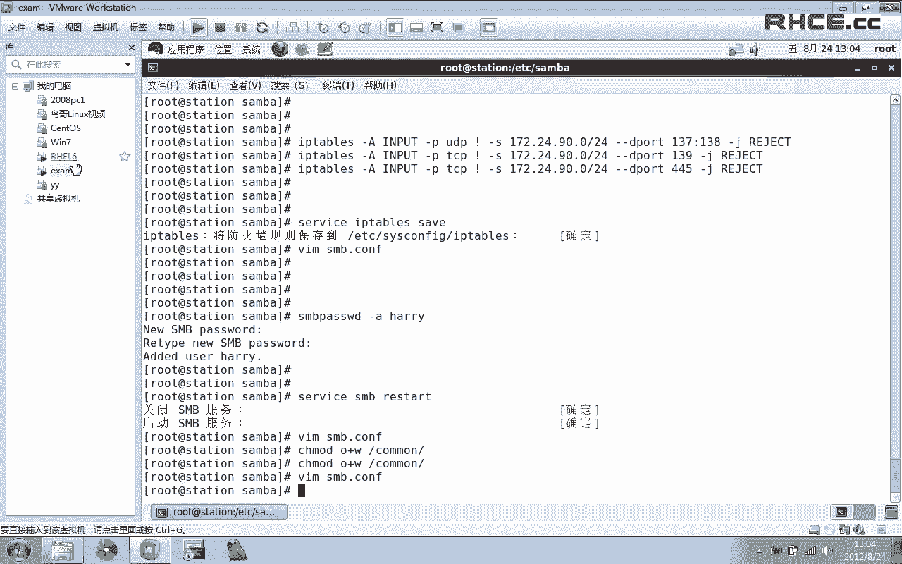
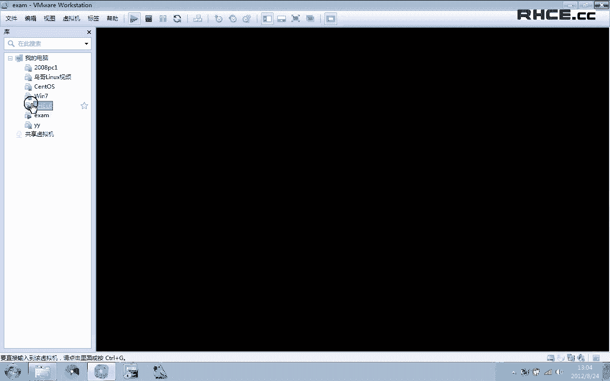
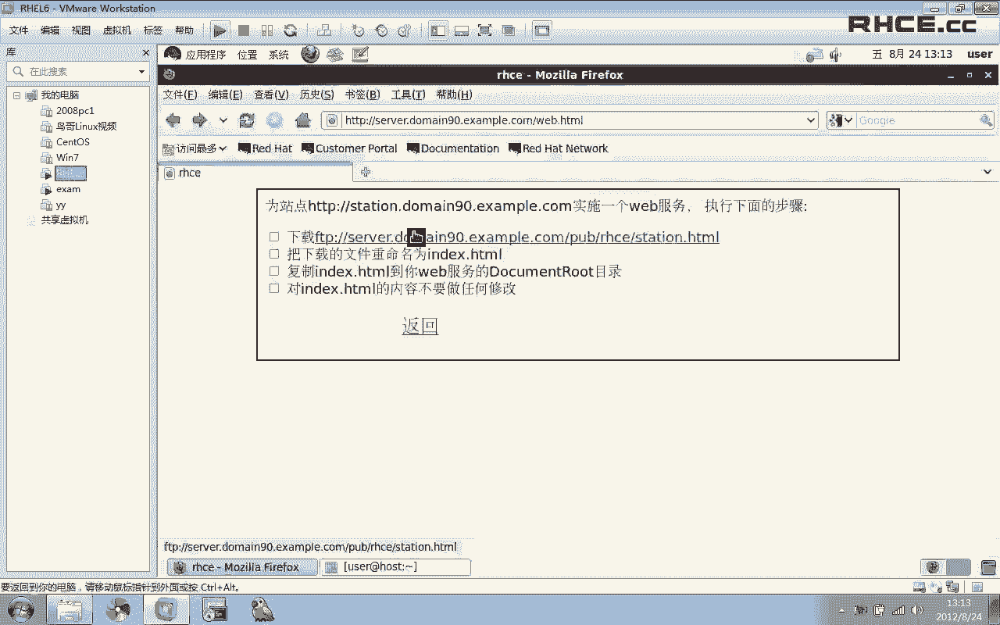
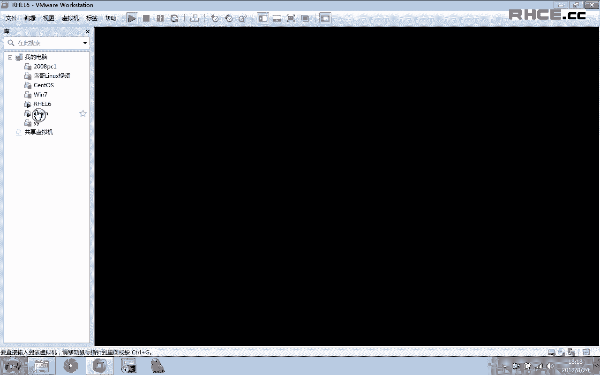
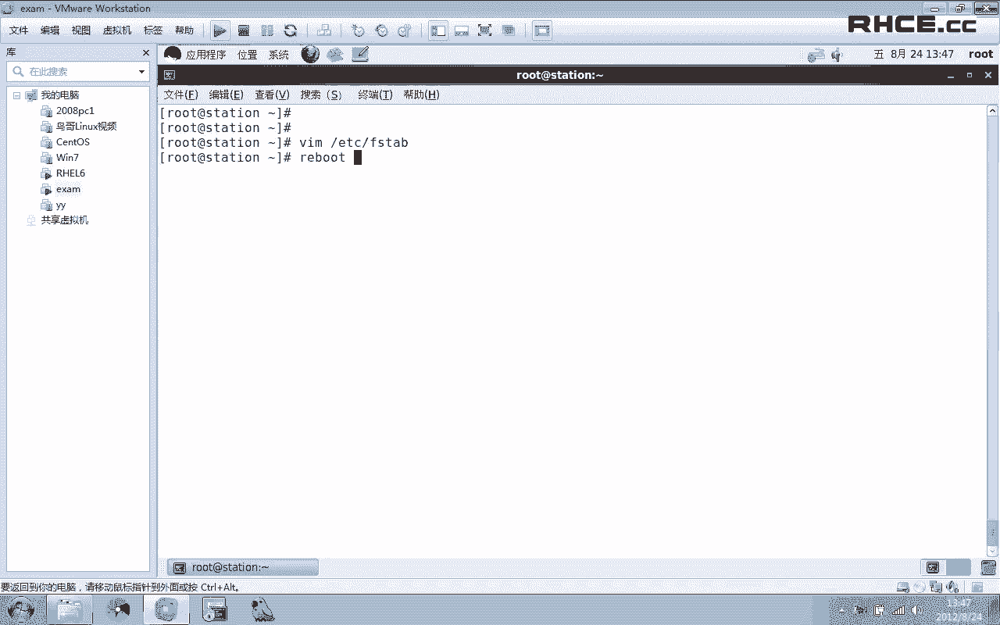
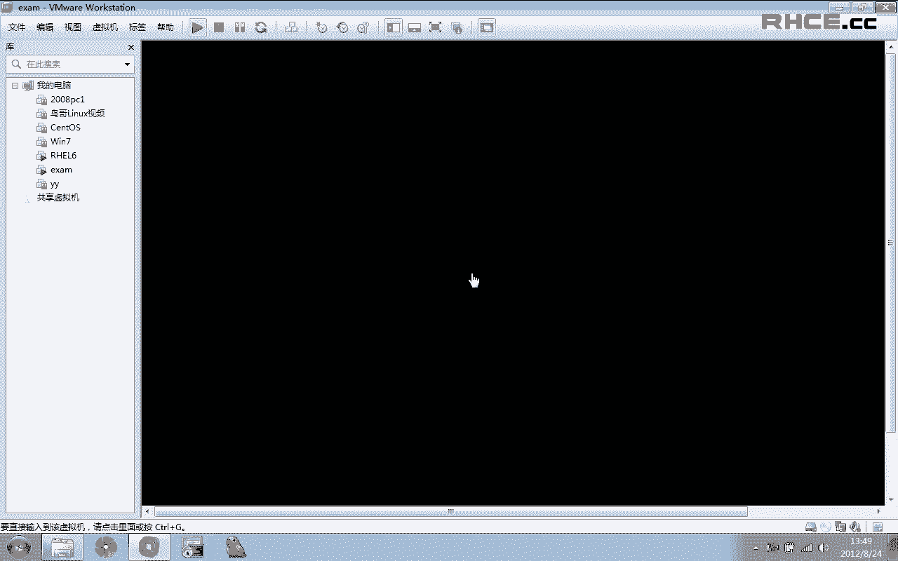
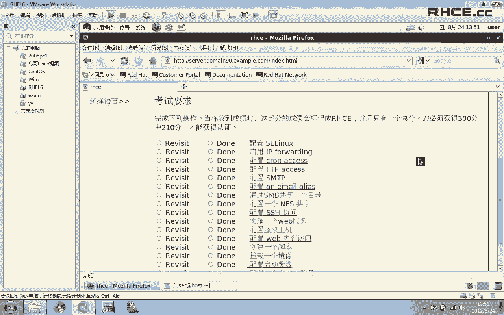

# RHCE考前辅导：P1：RHCE考试环境配置与基础服务设置 🖥️

在本课程中，我们将学习如何为RHCE考试配置基础环境，并完成一系列核心服务的设置。课程内容基于模拟考试环境，涵盖从系统初始化、防火墙配置到FTP、SMTP、Samba、NFS、Web服务等关键任务的实践操作。

## 概述

我们将从登录考试系统开始，逐步配置YUM源、设置SELinux、启用IP转发，并完成一系列服务配置任务。每一节都对应考试中的一个具体题目，确保您能掌握通过考试所需的全部技能。

---

## 考试环境与初始设置

首先，我们需要登录到提供的虚拟机。考试时，密码已在题目中给出，无需破解。

以root用户登录系统后，第一件事是配置YUM源，因为虚拟机默认没有可用的YUM源。

以下是配置YUM源的步骤：

1.  打开终端。
2.  创建或编辑YUM源配置文件。
3.  将题目提供的YUM源地址写入配置文件。
4.  清空YUM缓存。

配置完成后，执行以下命令更新缓存并清空防火墙规则，为后续操作提供便利：

```bash
yum clean all
iptables -F
service iptables save
```

---

## 配置SELinux

上一节我们完成了基础环境设置，本节中我们来看看如何配置SELinux。

题目要求SELinux必须在`permissive`模式下运行。

首先，检查当前SELinux状态：

```bash
getenforce
```

如果当前是`enforcing`模式，使用以下命令临时设置为`permissive`：

```bash
setenforce 0
```

但此更改重启后失效。需要编辑配置文件使其永久生效：

```bash
vi /etc/selinux/config
```

找到`SELINUX=`一行，将其值修改为`permissive`：

```
SELINUX=permissive
```

保存并退出。这样，SELinux的配置就完成了。

---

## 启用IP转发

接下来，我们需要在系统上启用IPv4转发功能。

使用以下命令可以立即启用IP转发：

```bash
sysctl -w net.ipv4.ip_forward=1
```

同样，此命令仅当前生效。要使其永久生效，需要编辑系统参数配置文件：

```bash
vi /etc/sysctl.conf
```

找到`net.ipv4.ip_forward = 0`这一行，将`0`改为`1`：

```
net.ipv4.ip_forward = 1
```

保存并退出。这样，系统重启后IP转发功能也会保持启用。

---

## 配置计划任务限制

本节配置特定用户的计划任务权限。题目要求用户`natasha`不能使用`cron`做计划任务，但不影响其他用户。

实现方法是编辑`cron`的拒绝文件：

```bash
vi /etc/cron.deny
```

在该文件中写入用户名`natasha`。凡是被写入此文件的用户都将被禁止使用`cron`。

保存文件后，此限制立即生效。

---

## 配置FTP服务

现在，我们来配置一个FTP服务器。服务器需要满足特定要求。

首先，安装`vsftpd`软件包：

```bash
yum install vsftpd -y
```

安装完成后，立即启动服务并设置开机自启：

```bash
service vsftpd start
chkconfig vsftpd on
```

以下是题目要求的详细配置步骤：

1.  **允许匿名用户下载**：`vsftpd`默认允许匿名下载，因此无需额外配置。
2.  **限制客户端访问**：只允许`desktop0.example.com`域的客户端访问。可以通过TCP Wrappers实现。编辑`/etc/hosts.allow`和`/etc/hosts.deny`文件。
    *   在`/etc/hosts.allow`中添加：`vsftpd: 172.24.0.0/24`
    *   在`/etc/hosts.deny`中添加：`vsftpd: ALL`
    这表示仅允许`172.24.0.0/24`网段访问FTP，其他全部拒绝。

配置完成后，不要忘记执行`chkconfig vsftpd on`确保服务开机启动。

---

## 配置SMTP服务

本节配置系统提供SMTP服务，并满足接收邮件的相关要求。



系统默认已安装`postfix`。首先检查服务状态和监听端口：



```bash
netstat -tlnp | grep :25
```

默认只监听回环地址(`127.0.0.1`)。题目要求能接收远程和本地邮件，需要修改配置：

```bash
vi /etc/postfix/main.cf
```

在配置文件中找到以下两行并进行修改：
1.  找到`inet_interfaces = localhost`，将其注释掉（行首加`#`）。
2.  找到`#inet_interfaces = all`，去掉行首的`#`。

修改后应为：
```
#inet_interfaces = localhost
inet_interfaces = all
```

保存并重启服务：

```bash
service postfix restart
```

再次检查端口，现在应监听所有接口(`0.0.0.0`)。

关于题目其他要求：
*   `harry`用户能从远程机器接收邮件：配置修改后默认即可实现。
*   投递给`harry`的邮件存放在其默认邮箱`/var/spool/mail/harry`：此为系统默认设置，无需修改。

因此，本题只需完成上述配置修改即可。

---

## 配置电子邮件别名

我们需要为系统配置一个电子邮件别名。要求是：所有发送给`admin`的邮件，都自动转发给用户`natasha`。

编辑别名配置文件：

```bash
vi /etc/aliases
```

在文件末尾添加一行：

```
admin: natasha
```

**格式说明**：冒号`:`左边是别名（`admin`），右边是真实的收件人（`natasha`）。冒号后必须有一个空格。

保存文件后，需要更新别名数据库：

```bash
newaliases
```

现在可以测试别名是否生效。使用`mail`命令给`admin`发一封测试邮件，然后检查`natasha`的邮箱是否收到。

---

## 配置Samba共享





我们将使用Samba共享一个目录。共享目录是`/common`。

首先，创建该目录并立即修改其SELinux上下文，这是关键步骤：

```bash
mkdir /common
chcon -t samba_share_t /common
```

然后，安装Samba软件包并启动服务：

```bash
yum install samba -y
service smb start
chkconfig smb on
```

现在开始具体配置。编辑Samba主配置文件：

```bash
vi /etc/samba/smb.conf
```

1.  设置工作组：找到`workgroup`行，修改为`STAFF`。
2.  配置共享：在文件末尾添加共享定义。
    ```
    [common]
        path = /common
        browsable = yes
        writable = yes
        write list = harry
    ```
    *   `[common]`是共享名。
    *   `path`指定共享目录路径。
    *   `browsable`允许浏览。
    *   `writable`和`write list`允许`harry`用户写入。

3.  **访问控制**：题目要求只允许`desktop0.example.com`域的客户端访问。这可以通过防火墙实现。Samba使用UDP 137/138端口和TCP 139/445端口。
    ```bash
    iptables -I INPUT -p udp ! -s 172.24.0.0/24 --dport 137:138 -j REJECT
    iptables -I INPUT -p tcp ! -s 172.24.0.0/24 --dport 139 -j REJECT
    iptables -I INPUT -p tcp ! -s 172.24.0.0/24 --dport 445 -j REJECT
    ```
    规则中的`! -s 172.24.0.0/24`表示“除了来自此网段的流量”。配置后保存防火墙规则：`service iptables save`。

4.  为`harry`用户设置Samba密码：
    ```bash
    smbpasswd -a harry
    ```
    根据题目要求设置密码。

最后，重启Samba服务使配置生效：`service smb restart`。可以使用`smbclient`命令从客户端测试连接和访问权限。

---

## 配置NFS共享

本节通过NFS共享`/common`目录，且只对`desktop0.example.com`域共享。

编辑NFS导出配置文件：

```bash
vi /etc/exports
```

添加以下内容：

```
/common 172.24.0.0/24(rw,sync)
```

这表示将`/common`目录以读写(`rw`)模式共享给`172.24.0.0/24`网段，并同步写入(`sync`)。

配置防火墙，只允许指定网段访问NFS（端口2049）：

```bash
iptables -I INPUT -p tcp ! -s 172.24.0.0/24 --dport 2049 -j REJECT
service iptables save
```

启动NFS服务并设置开机自启：

```bash
service nfs restart
chkconfig nfs on
```

**测试**：在物理机（客户端）上，NFS已配置为自动挂载。当访问`/net/desktop0.example.com`目录时，会自动挂载共享。如果能成功列出共享目录中的文件，说明NFS配置正确。

---

## 配置SSH访问控制

题目要求`harry`用户可以在`desktop0.example.com`域内通过SSH访问远程机器。实质上这是限制SSH服务的访问来源。

使用TCP Wrappers进行限制。编辑相关文件：

1.  `/etc/hosts.allow`：添加 `sshd: 172.24.0.0/24`
2.  `/etc/hosts.deny`：添加 `sshd: ALL`

这表示只允许`172.24.0.0/24`网段的客户端通过SSH连接，其他全部拒绝。配置立即生效。

---

## 配置Web服务（基础站点）

我们为站点`desktop0.example.com`建立一个Web服务。

首先安装Apache（`httpd`）软件包：

```bash
yum install httpd -y
service httpd start
chkconfig httpd on
```

根据题目要求操作：
1.  下载指定的网页文件。
2.  将其重命名为`index.html`。
3.  放置到Web文档根目录（默认为`/var/www/html`）下。
4.  修改其SELinux上下文：`restorecon -Rv /var/www/html`
5.  在配置文件中设置服务器名（`ServerName`）为`desktop0.example.com`。
6.  重启`httpd`服务。

完成后，可通过浏览器访问`http://desktop0.example.com`进行测试。

---

## 配置虚拟主机

现在，扩展Web服务，为`www.desktop0.example.com`建立一个虚拟主机。

编辑Apache的虚拟主机配置文件（例如`/etc/httpd/conf.d/vhost.conf`），添加以下内容：

```apache
<VirtualHost *:80>
    ServerName www.desktop0.example.com
    DocumentRoot /var/www/virtual
</VirtualHost>
```

同时，确保原来的主站点也定义在虚拟主机中，否则原站点将无法访问：

```apache
<VirtualHost *:80>
    ServerName desktop0.example.com
    DocumentRoot /var/www/html
</VirtualHost>
```

然后：
1.  创建虚拟主机的文档根目录：`mkdir /var/www/virtual`
2.  下载并放置`index.html`文件到该目录。
3.  修改目录和文件的SELinux上下文：`chcon -R -t httpd_sys_content_t /var/www/virtual`
4.  设置目录权限，使`harry`用户可以在其中创建内容（例如使用`setfacl`设置ACL）。
5.  重启`httpd`服务。

现在，`desktop0.example.com`和`www.desktop0.example.com`两个站点都应能正常访问。

---

## 配置Web内容访问控制

在Web服务器的文档根目录下创建一个特定目录，并配置访问控制，只允许本地系统用户访问。

我们需要在两个虚拟主机的文档根目录下分别创建该目录（`/var/www/html/private` 和 `/var/www/virtual/private`），并放置内容。

关键步骤是配置Apache的目录访问控制。在Apache配置文件的对应`<Directory>`段中，添加：

```apache
<Directory "/var/www/html/private">
    Order deny,allow
    Deny from all
    Allow from 127.0.0.1 localhost desktop0.example.com 172.24.0.10
</Directory>
```

此配置表示：默认拒绝所有，仅允许来自列出的IP和主机名的访问。对`/var/www/virtual/private`目录做同样配置。

保存配置并重启`httpd`服务后，只有本机可以访问这些`private`目录，其他远程客户端访问将被拒绝。

---

## 创建Shell脚本

在`/root`目录下创建一个名为`script.sh`的脚本。

脚本要求：
*   如果参数是`red`，输出`green`。
*   如果参数是`green`，输出`red`。
*   如果没有参数或参数是其他值，输出错误信息`Usage: /root/script.sh {red|green}`。

脚本内容如下：

```bash
#!/bin/bash
case $1 in
    red)
        echo "green"
        ;;
    green)
        echo "red"
        ;;
    *)
        echo 'Usage: /root/script.sh {red|green}'
        ;;
esac
```

创建后，赋予脚本执行权限：`chmod +x /root/script.sh`。然后可以使用不同参数进行测试。

---

## 挂载ISO镜像

配置系统，使位于`/root/disk.iso`的ISO镜像在开机时能自动挂载到`/mnt/virt`目录。

首先创建挂载点目录：

```bash
mkdir /mnt/virt
```

手动挂载一次以测试：

```bash
mount -o loop /root/disk.iso /mnt/virt
```

要实现开机自动挂载，需要编辑`/etc/fstab`文件，添加一行：

```
/root/disk.iso /mnt/virt iso9660 loop,defaults 0 0
```

**重要**：文件系统类型是`iso9660`，选项必须包含`loop`。这样系统启动时就会自动挂载该镜像。

---

## 配置内核启动参数

修改系统，使其在启动时将内核参数`kernel.ctrl`的值设置为`5`。修改结果可以在`/proc/cmdline`中查看。

编辑GRUB配置文件（例如`/etc/default/grub`或`/boot/grub2/grub.cfg`，取决于系统），在内核命令行（`kernel`或`linux16`行）的末尾添加：

```
kernel.ctrl=5
```

例如，找到类似`rhgb quiet`的行，在其后添加参数：

```
... rhgb quiet kernel.ctrl=5
```

保存后，需要重新生成GRUB配置（如果修改的是`/etc/default/grub`，则运行`grub2-mkconfig`）。重启系统后，检查`/proc/cmdline`文件，确认参数已生效。

---

## 配置iSCSI磁盘

在服务器`server0.example.com`上提供了一个iSCSI块设备。我们需要让虚拟机连接到此设备，并创建文件系统。

1.  **发现目标**：首先安装`iscsi-initiator-utils`包，然后发现目标。
    ```bash
    yum install iscsi-initiator-utils -y
    iscsiadm -m discovery -t st -p server0.example.com
    ```
    命令会返回一个以`iqn.`开头的目标名称。



2.  **登录目标**：使用发现到的目标名称进行登录。
    ```bash
    iscsiadm -m node -T <target_name> -p server0.example.com -l
    ```
    登录成功后，使用`fdisk -l`或`lsblk`查看新磁盘（如`sdb`）。



3.  **分区与格式化**：在新磁盘上创建大小为1400MB的分区，并格式化为`ext4`文件系统。
    ```bash
    fdisk /dev/sdb # 创建新分区，大小设为1400M
    partprobe /dev/sdb # 更新分区表
    mkfs.ext4 /dev/sdb1 # 格式化分区
    ```

4.  **挂载与配置**：创建挂载点`/mnt/data`，将分区挂载上去。
    ```bash
    mkdir /mnt/data
    mount /dev/sdb1 /mnt/data
    ```
    将题目要求的文件下载并拷贝到该目录，并设置正确的权限。
    最后，编辑`/etc/fstab`实现开机自动挂载：
    ```
    /dev/sdb1 /mnt/data ext4 defaults,_netdev 0 0
    ```
    **注意**：对于网络设备，建议添加`_netdev`选项，表示等网络就绪后再挂载。

完成所有配置后，重启系统以检查各项服务（如HTTPD、SMB、NFS）是否正常启动，以及挂载点（ISO镜像、iSCSI磁盘）是否自动挂载成功。逐一验证每个服务的功能是否符合题目要求。

---

## 总结



在本节课中，我们一起学习了RHCE考试中可能遇到的一系列典型任务。从最基础的系统环境配置（YUM源、SELinux、IP转发），到各种网络服务的部署与安全加固（FTP、SMTP、Samba、NFS、SSH、Web服务），再到存储管理（挂载镜像、连接iSCSI）和脚本编写。每个任务都强调了配置的持久化（开机自启、写入配置文件）和安全性（防火墙、访问控制列表）。掌握这些技能，是顺利通过RHCE认证考试的关键。请务必在实验环境中反复练习，直至熟练。