# RHCE考点01 - P1：01配置环境 - 开源码头 - BV1pY41187ee

好，我们来先配置一下这个Spo啊。首先呢我们登录到。boxt这个机器。创建我们的工作目录。比如说就叫S8。进入S。那么第一件事情呢就是生成asport的配置文件。

我们可以从ETC下载sport下面的sport点CFG拷过来。

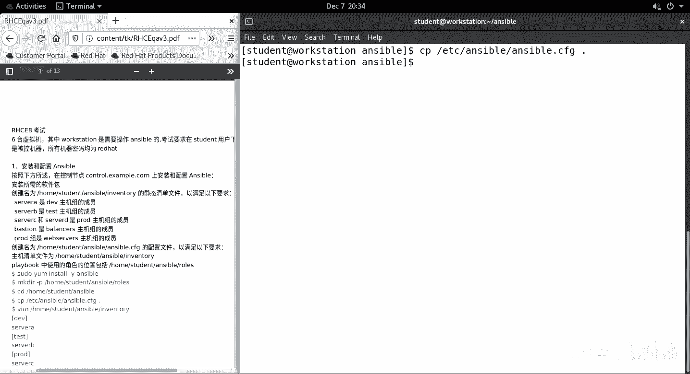

啊，然后呢编辑当前的这个文件。我们首先确定一尾腿的位置。应该是当前目录下面的。

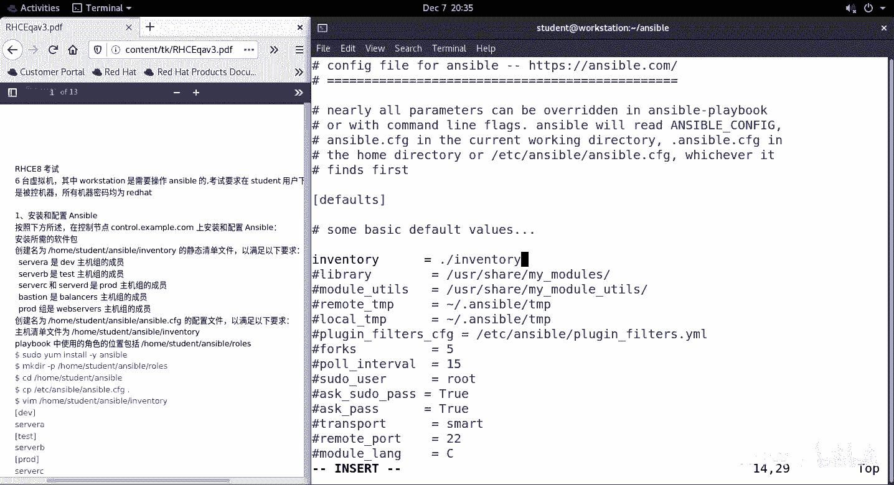

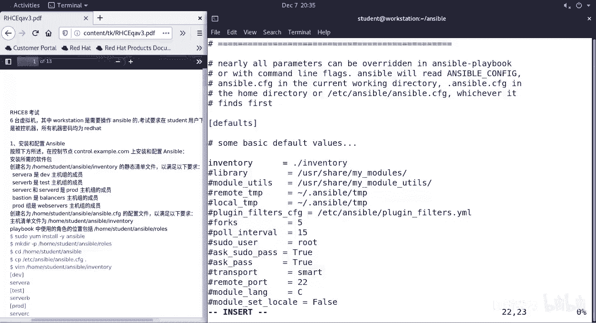

是否提问密码不提不提啊。

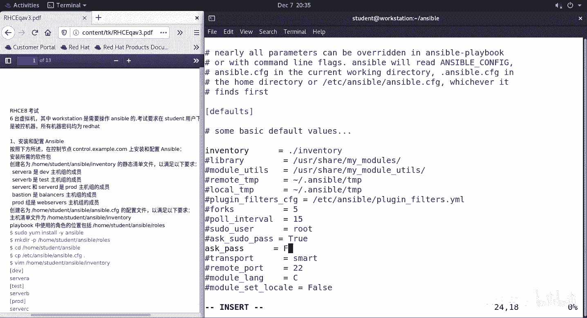

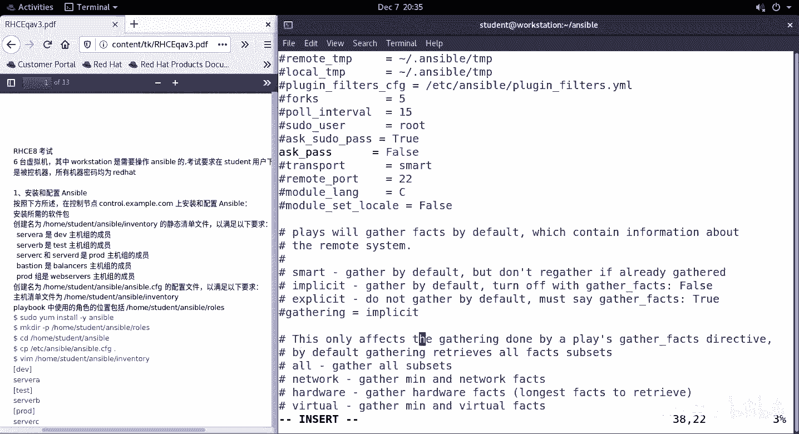

我们也可以去搜一下。收。找到了远程用户啊。原程用户我们登录时用student。

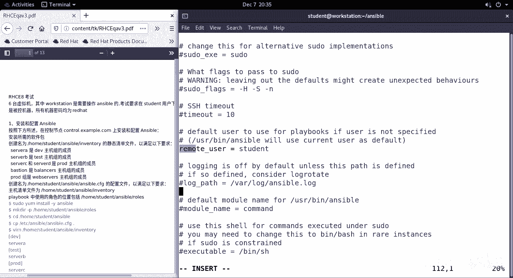

然后他还要求我们的。

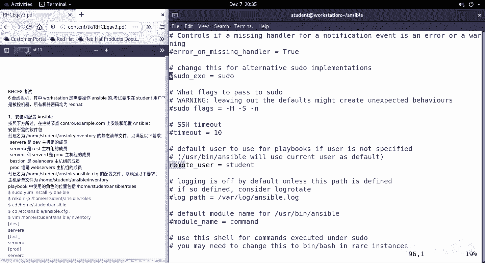

角色的目录。

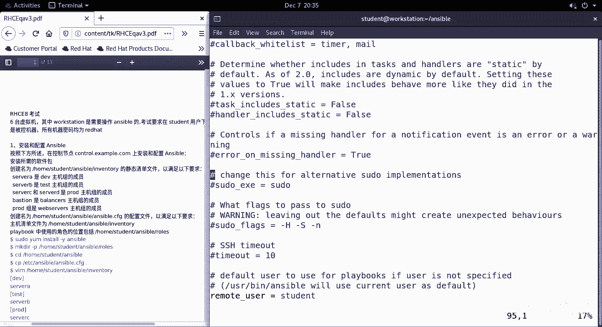

角士的路径。是当前目录下的roose。好，再收。

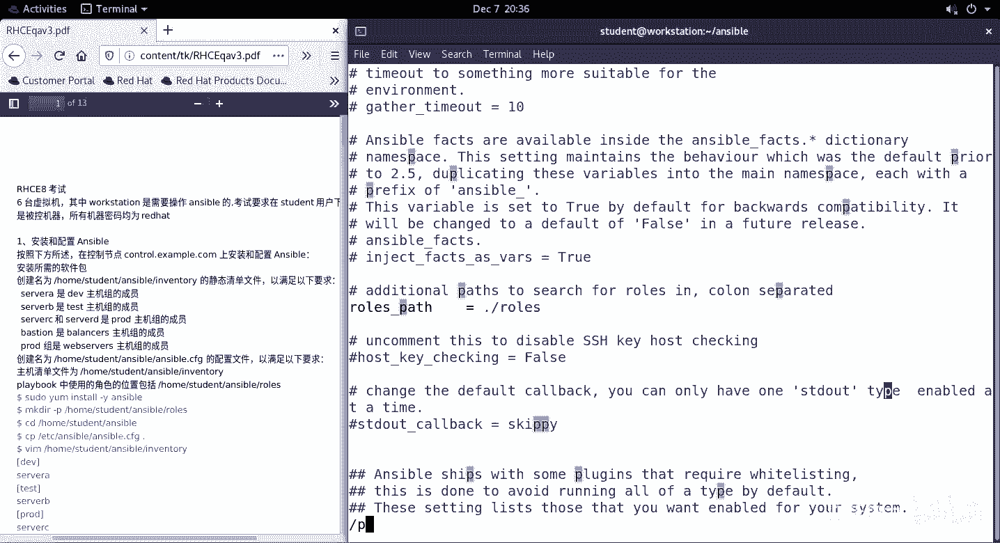

特权提升。啊，这几个注射的都可以去掉。

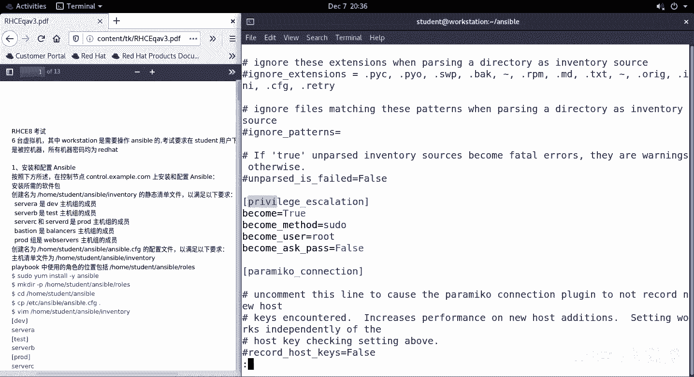

好，整体的结果呢应该是这个样子的。开头。不是井号的行。evenventry的位置。呃，登录对方机器的时候呢，登录被控机的时候不回答密码。绝色的路径。远程用户登录远程被控机的时候，用student。

然后呢，特权提升环节。特权提升是出，方法是速度，提升为root。提升的时候呢，也不需要回答密码。

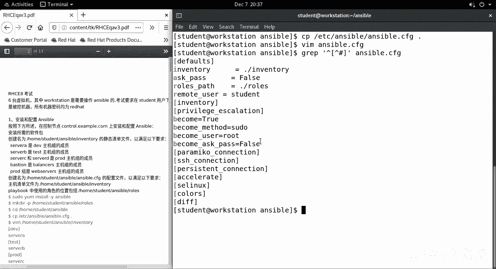

好，我们下一步做invent。有没去。打开按照他的要求去写。第一个。呃，低V主。包含了svoA机器。第二个。Test度。包含了。收个B机器。第3个。是呃pro。包含了servve C和servveD。

不能事。这个组包含了ba险。我，还有一个主叫webserv。它呢里面包含了子组，所以说应该加一个丘准标记是吧？包喊的主食坡的。

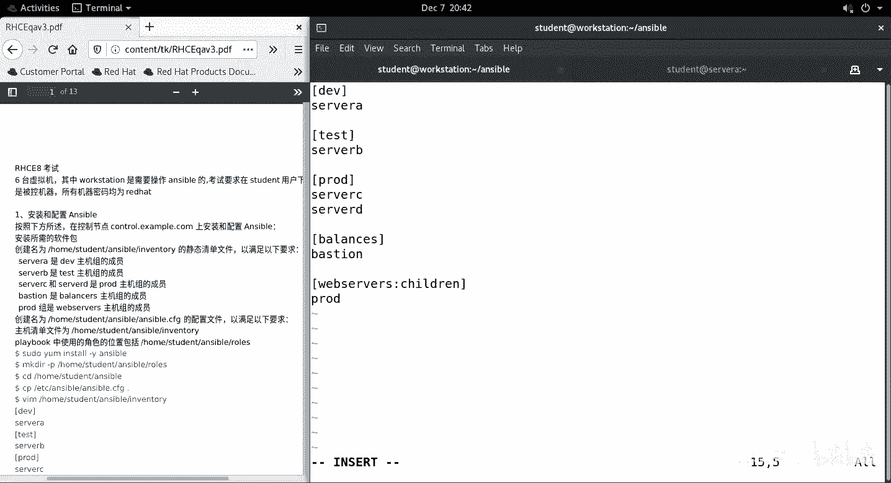

好，然后我们呢。稍微检查一下。杠杠我0。我们能看到呢它所启用的配置文件就是我们当前目前的S点FD。

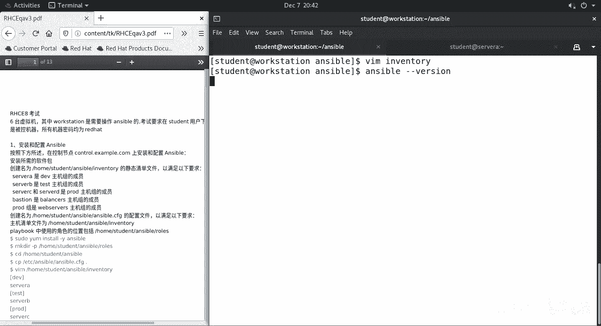

然后呢，我们去。列出所有的。出去。没问题啊，我们列一下这个。我不死了。

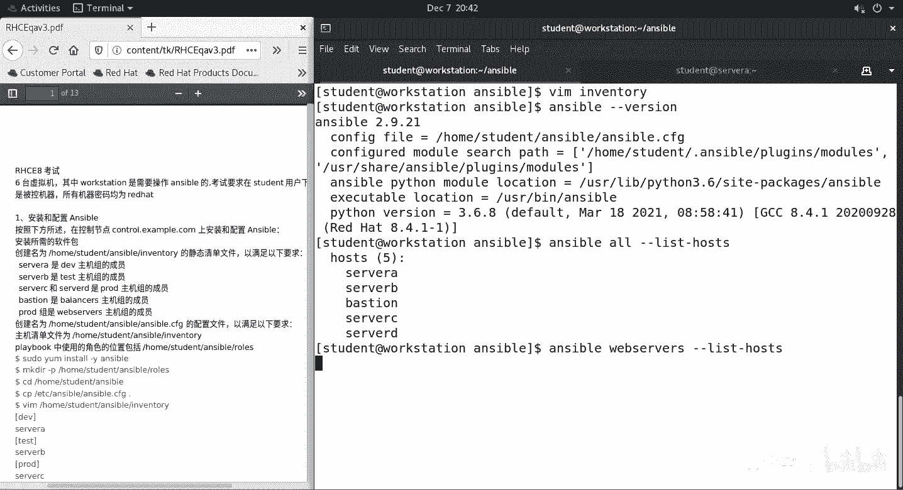

都没问题，对吧？OK。

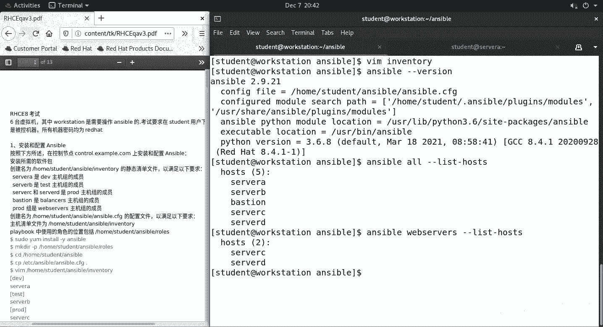