# RHCE考点01 - P1：01配置环境 🛠️

在本节课中，我们将要学习如何为Ansible配置基础工作环境。这包括创建Ansible配置文件、定义主机清单以及验证配置的正确性。这是使用Ansible进行自动化管理的第一步。

## 创建Ansible工作目录

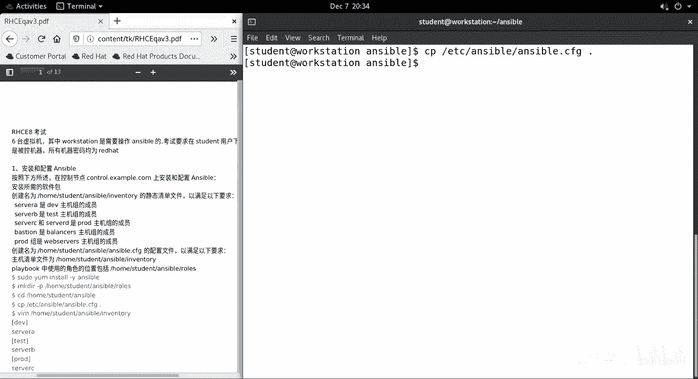

首先，登录到名为 `boxt` 的机器。创建一个专门用于Ansible工作的目录，例如命名为 `S8`，并进入该目录。

```bash
mkdir S8
cd S8
```

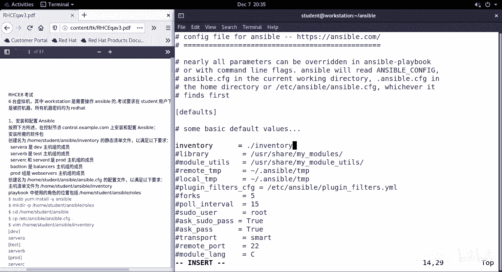

## 生成Ansible配置文件

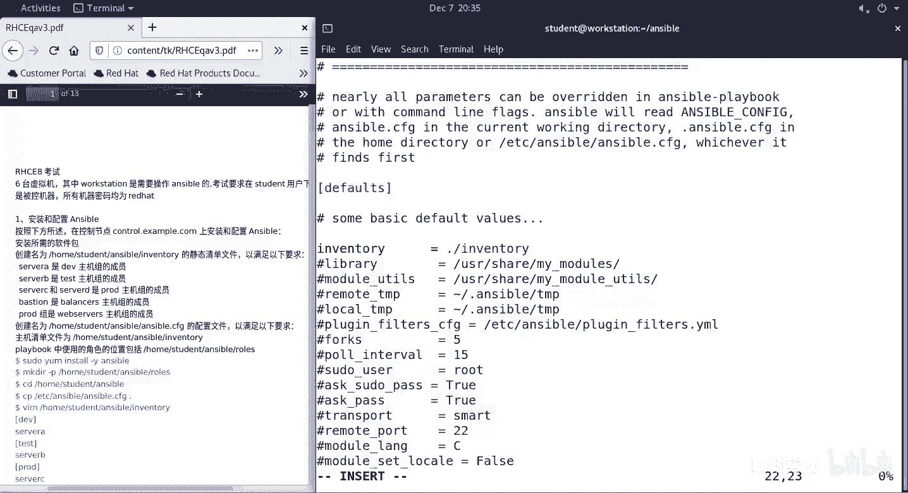

第一步是生成Ansible的配置文件。我们可以从系统默认位置复制一个模板文件到当前目录。

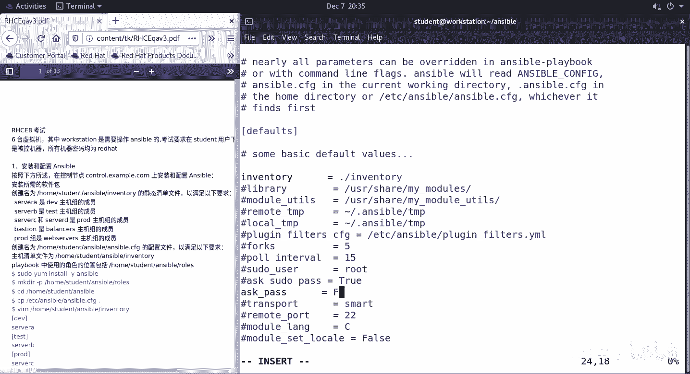

```bash
cp /etc/ansible/ansible.cfg .
```

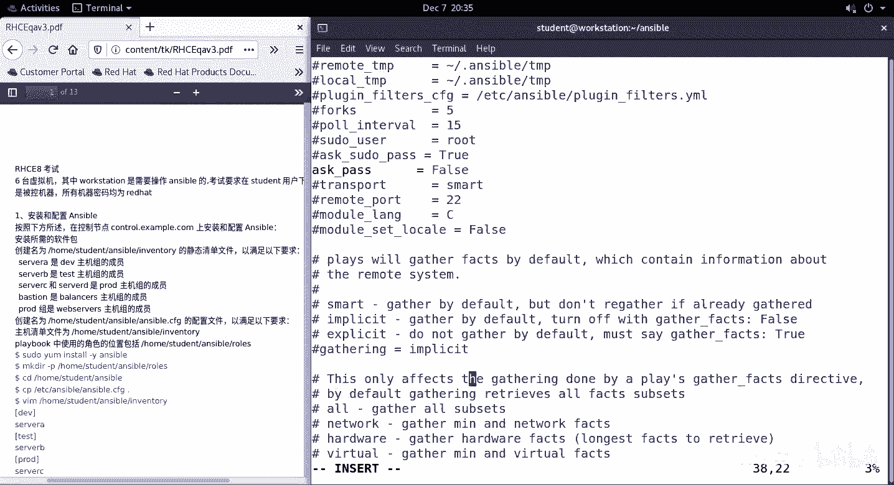

接下来，编辑这个新复制的 `ansible.cfg` 文件。

以下是需要修改的核心配置项：

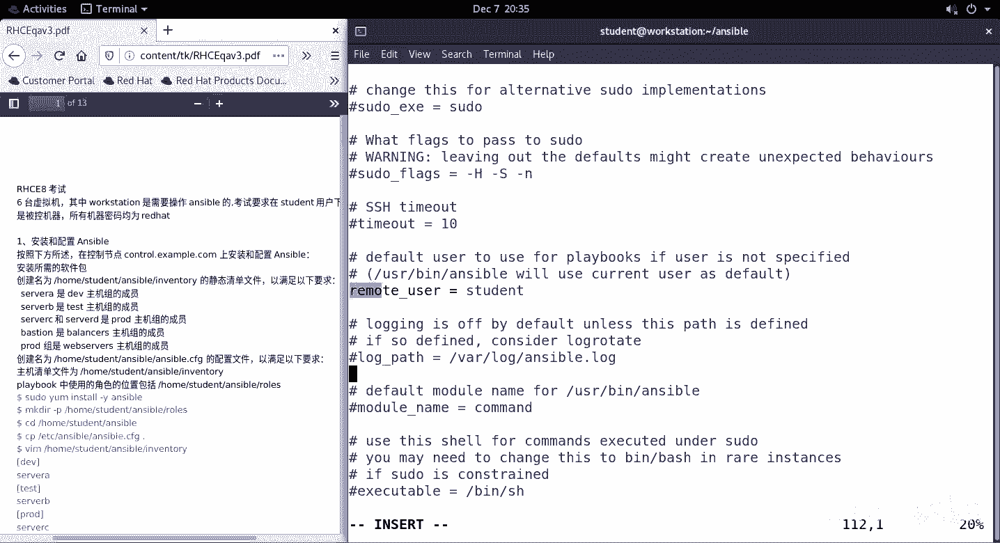

*   **`inventory`**：指定主机清单文件的位置。应设置为当前目录下的 `inventory` 文件。
*   **`ask_pass`**：控制在连接主机时是否询问密码。应设置为 `False`，以实现免密登录。
*   **`remote_user`**：定义连接远程主机时使用的默认用户名。应设置为 `student`。
*   **`roles_path`**：指定Ansible角色（roles）的查找路径。应设置为当前目录下的 `roles` 子目录。
*   **`[privilege_escalation]`**：特权提升配置部分。需要启用并配置为使用 `sudo` 方式提升为 `root` 用户，且提升时无需密码。

编辑完成后的配置文件关键部分应如下所示：

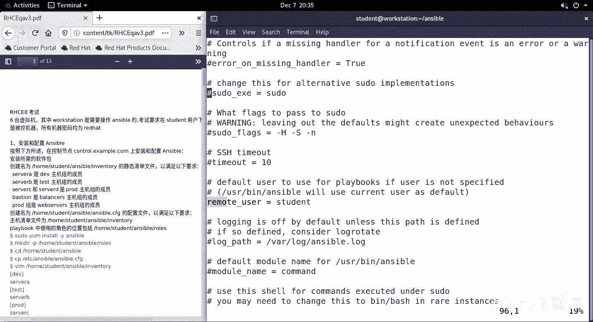

```ini
[defaults]
inventory = ./inventory
ask_pass = False
remote_user = student
roles_path = ./roles

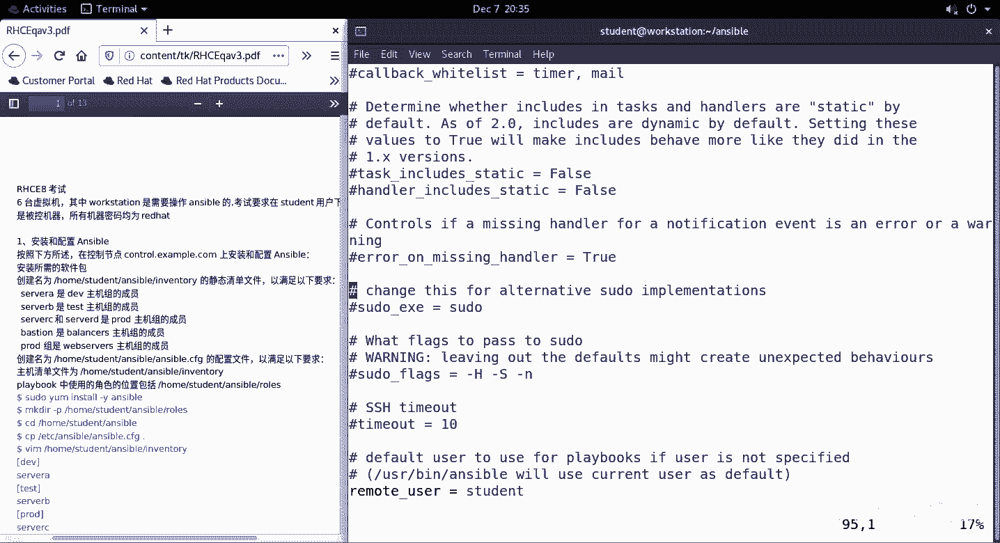

[privilege_escalation]
become = True
become_method = sudo
become_user = root
become_ask_pass = False
```

## 定义主机清单文件

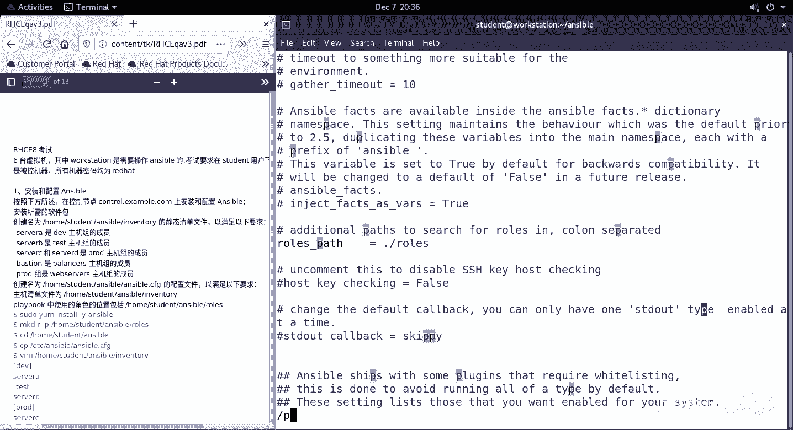

上一节我们介绍了如何配置Ansible，本节中我们来看看如何定义主机清单。主机清单文件用于组织和管理Ansible将要操作的目标主机。

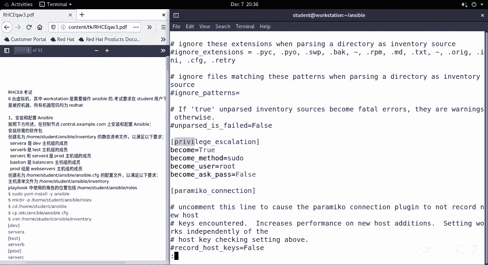

创建一个名为 `inventory` 的文件，并按照以下结构编写内容：

以下是主机分组示例，其中包含了多个组和嵌套组：

```ini
[dev]
serverA

[test]
serverB

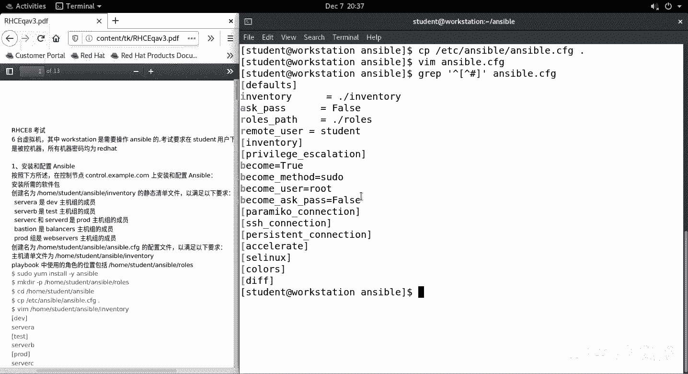

[prod]
serverC
serverD

[dbservers]
serverB

[webservers:children]
prod
```

这个清单定义了：
*   `dev` 组：包含主机 `serverA`。
*   `test` 组：包含主机 `serverB`。
*   `prod` 组：包含主机 `serverC` 和 `serverD`。
*   `dbservers` 组：包含主机 `serverB`。
*   `webservers` 组：这是一个父组，它包含了 `prod` 这个子组中的所有主机。

## 验证配置

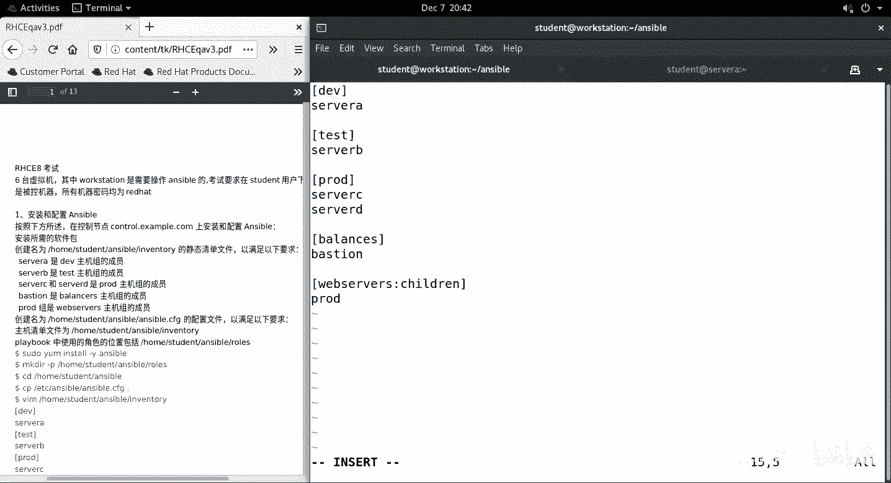

配置完成后，我们需要验证Ansible是否正确识别了我们的设置。

首先，检查Ansible使用的配置文件路径：
```bash
ansible --version
```
输出应显示配置文件路径为我们当前目录下的 `ansible.cfg`。

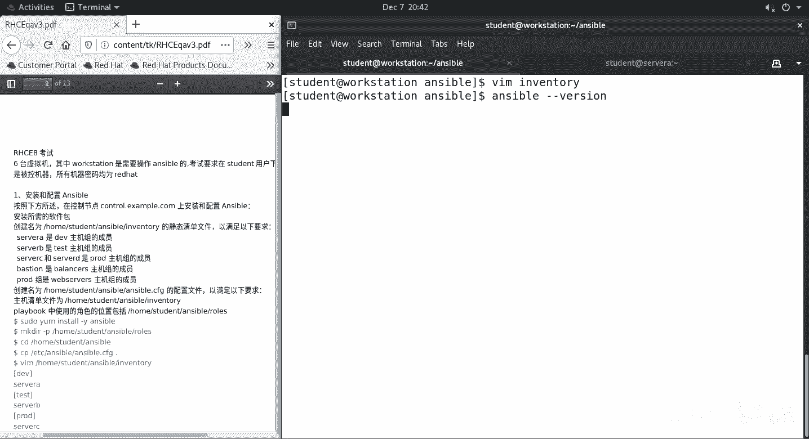

接着，列出所有已配置的主机，以验证清单文件：
```bash
ansible all --list-hosts
```

最后，可以尝试对特定组（如 `prod`）列出主机，进行针对性验证：
```bash
ansible prod --list-hosts
```

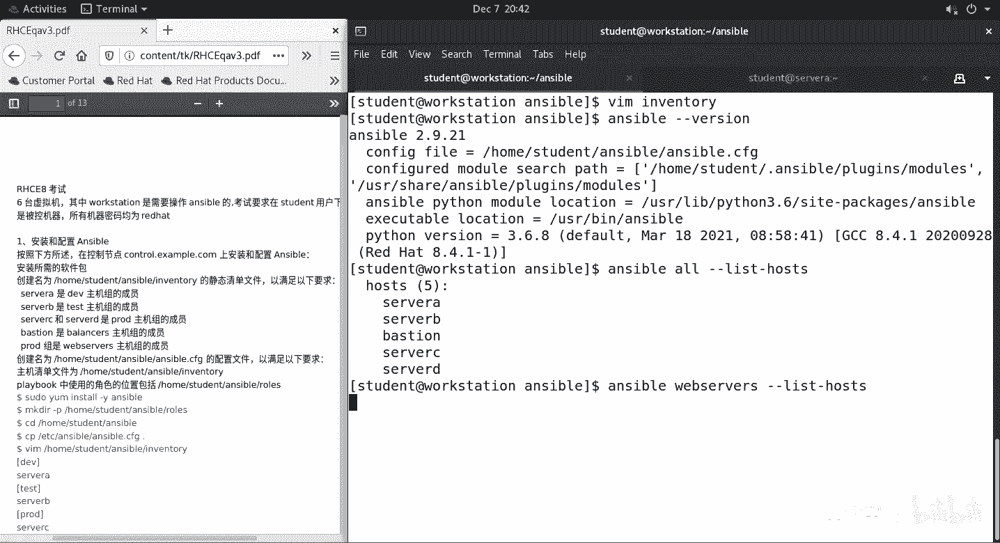

如果所有命令都能正确列出预期的主机，说明环境配置成功。

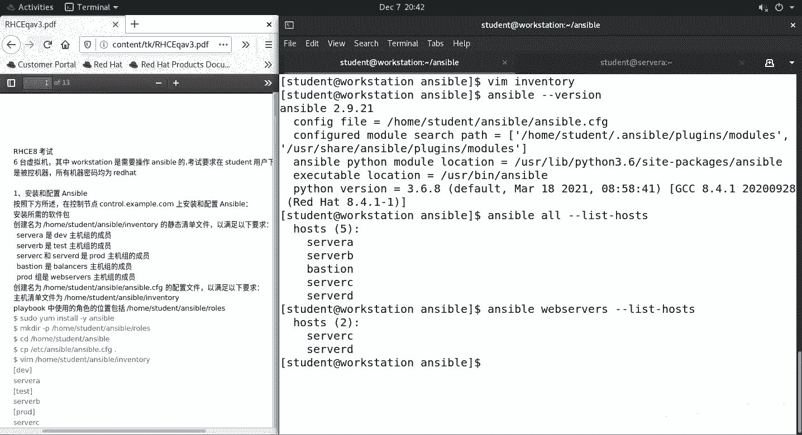

## 总结

本节课中我们一起学习了RHCE考试中关于Ansible环境配置的基础步骤。我们完成了从创建工作目录、配置 `ansible.cfg` 文件（包括设置清单路径、远程用户和特权提升），到编写结构化的主机清单文件，最后通过命令验证了整个配置的正确性。这是后续使用Ansible执行自动化任务的重要基础。